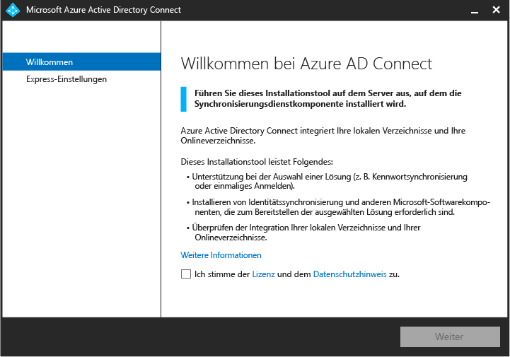
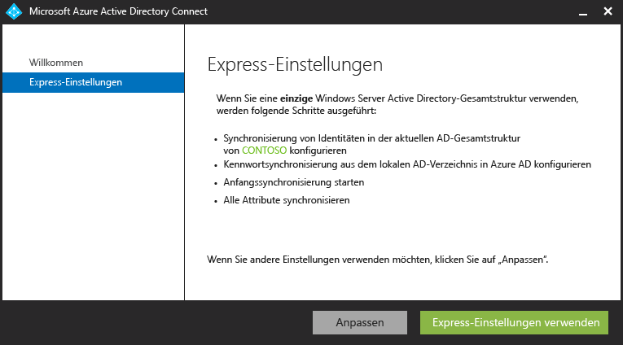
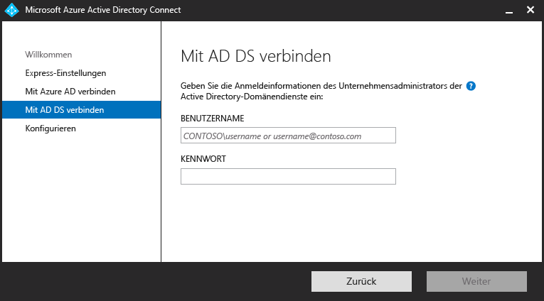
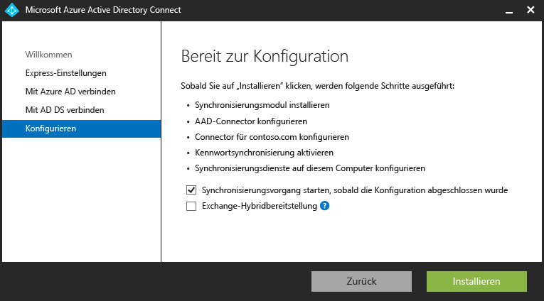

<properties
	pageTitle="Azure AD Connect: Erste Schritte mit Expresseinstellungen | Microsoft Azure"
	description="Informationen zum Herunterladen, Installieren und Ausführen des Setup-Assistenten für Azure AD Connect."
	services="active-directory"
	documentationCenter=""
	authors="billmath"
	manager="stevenpo"
	editor="curtand"/>

<tags
	ms.service="active-directory"
	ms.workload="identity"
	ms.tgt_pltfrm="na"
	ms.devlang="na"
	ms.topic="article"
	ms.date="01/21/2016"
	ms.author="billmath;andkjell"/>

# Erste Schritte mit Azure AD Connect mit Expresseinstellungen
Die folgende Dokumentation hilft Ihnen beim Einstieg mit Azure Active Directory Connect. In dieser Dokumentation wird die Verwendung der Expressinstallation für Azure AD Connect behandelt.

## Dokumentation
Wenn Sie die Dokumentation zum [Integrieren lokaler Identitäten in Azure Active Directory](active-directory-aadconnect.md) nicht gelesen haben, finden Sie in der folgenden Tabelle Links zu verwandten Themen. Sie müssen die ersten beiden, fett hervorgehobenen Themen gelesen haben, bevor Sie mit der Installation beginnen.

| Thema | |
| --------- | --------- |
| **Azure AD Connect herunterladen** | [Azure AD Connect herunterladen](http://go.microsoft.com/fwlink/?LinkId=615771) |
| **Hardware und Voraussetzungen** | [Azure AD Connect: Hardware und Voraussetzungen](active-directory-aadconnect-prerequisites.md) |
| Installation mit benutzerdefinierten Einstellungen | [Benutzerdefinierte Installation von Azure AD Connect](active-directory-aadconnect-get-started-custom.md) |
| Upgrade von DirSync | [Upgrade von Azure AD-Synchronisierungstools (DirSync)](active-directory-aadconnect-dirsync-upgrade-get-started.md) |
| Nach der Installation | [Überprüfen der Installation und Zuweisen von Lizenzen ](active-directory-aadconnect-whats-next.md) |
| Für die Installation verwendete Konten | [Weitere Informationen zu Azure AD Connect-Konten und -Berechtigungen](active-directory-aadconnect-accounts-permissions.md) |

## Expressinstallation von Azure AD Connect
Die Auswahl der Expresseinstellungen ist die Standardoption und eines der häufigsten Szenarios. Auf diese Weise stellt Azure AD Connect die Synchronisierung mit der Kennwort-Synchronisierungsoption bereit. Dies gilt nur für eine einzige Gesamtstruktur und ermöglicht den Benutzern die Verwendung ihres lokalen Kennworts beim Anmelden in der Cloud. Bei Verwendung der Expresseinstellungen wird nach Abschluss der Installation automatisch eine Synchronisierung gestartet (dies können Sie jedoch auch deaktivieren). Mit dieser Option können Sie mit nur wenigen Klicks Ihr lokales Verzeichnis auf die Cloud erweitern.

### So installieren Sie Azure AD Connect mit Expresseinstellungen

1. Melden Sie sich als lokaler Administrator an dem Server an, auf dem Sie Azure AD Connect installieren möchten. Dies sollte der Server sein, der als Synchronisierungsserver verwendet werden soll.
2. Navigieren Sie zu AzureADConnect.msi und doppelklicken Sie darauf
3. Aktivieren Sie auf der Willkommensseite das Kontrollkästchen zum Zustimmen zu den Lizenzbedingungen, und klicken Sie auf **Weiter**.
4. Klicken Sie im Bildschirm "Expresseinstellungen" auf **Expresseinstellungen verwenden**. 
5. Geben Sie im Bildschirm "Mit Azure AD verbinden" den Benutzernamen und das Kennwort eines globalen Azure-Administrators für Azure AD ein. Klicken Sie auf **Weiter**. Falls ein Fehler auftritt und Sie Probleme mit der Konnektivität haben, können Sie unter [Problembehebung bei Konnektivitätsproblemen](active-directory-aadconnect-troubleshoot-connectivity.md) nach einer Lösung suchen.
6. Geben Sie im Bildschirm "Mit AD DS verbinden" den Benutzernamen und das Kennwort für ein Enterprise-Administratorkonto ein. Klicken Sie auf **Weiter**. 
7. Klicken Sie im Bildschirm "Bereit zur Konfiguration" auf **Installieren**.
	- Optional können Sie auf der Seite "Bereit zur Konfiguration" das Kontrollkästchen **Starten Sie den Synchronisierungsvorgang, sobald die Anfangskonfiguration abgeschlossen wurde** deaktivieren. Der Assistent konfiguriert dann zwar die Synchronisierung, die Aufgabe bleibt jedoch deaktiviert, sodass sie erst ausgeführt wird, wenn Sie sie in der Aufgabenplanung manuell aktivieren. Sobald die Aufgabe aktiviert ist, wird die Synchronisierung alle drei Stunden ausgeführt.
	- Durch Aktivieren des entsprechenden Kontrollkästchens können Sie wahlweise auch die Konfiguration von Synchronisierungsdiensten für die **Exchange-Hybridbereitstellung** festlegen. Wenn Sie Exchange-Postfächer nicht gleichzeitig lokal und in der Cloud bereitstellen möchten, müssen Sie diese Option nicht aktivieren.  
8. Klicken Sie nach Abschluss der Installation auf **Beenden**.
9. Melden Sie sich nach Abschluss der Installation ab und wieder an, bevor Sie den Synchronisierungsdienst-Manager oder den Synchronisierungsregel-Editor verwenden.

   

Im Folgenden können Sie sich ein Video zur Expressinstallation ansehen:

[AZURE.VIDEO azure-active-directory-connect-express-settings]

## Nächste Schritte
Nachdem Sie Azure AD Connect installiert haben, können Sie [die Installation überprüfen und Lizenzen zuweisen](active-directory-aadconnect-whats-next.md).

Weitere Informationen zum [Integrieren lokaler Identitäten in Azure Active Directory](active-directory-aadconnect.md).

<!---HONumber=AcomDC_0128_2016-->