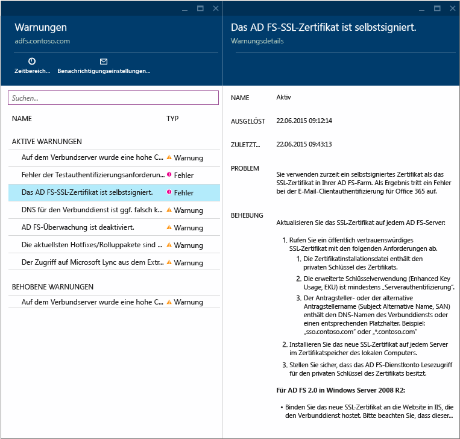
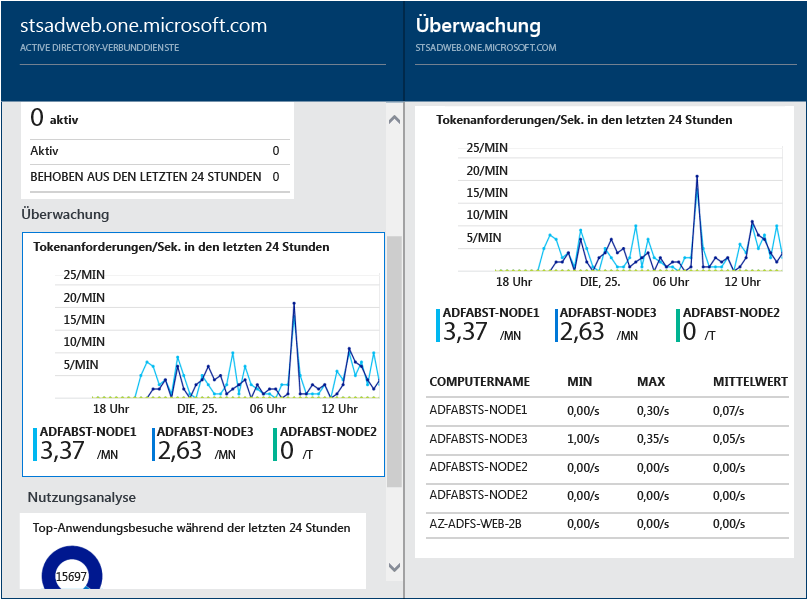
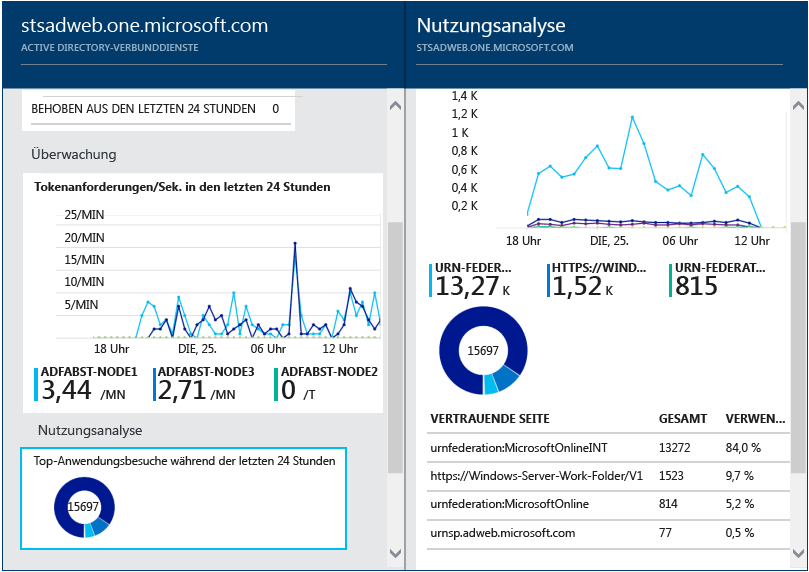

<properties 
	pageTitle="Überwachen Sie Ihre lokalen Identitätsinfrastruktur in der Cloud." 
	description="Auf dieser Seite zu Azure AD Connect Health wird der Dienst beschrieben, und es werden die Gründe für seine Verwendung erörtert." 
	services="active-directory" 
	documentationCenter="" 
	authors="billmath" 
	manager="swadhwa" 
	editor="curtand"/>

<tags 
	ms.service="active-directory" 
	ms.workload="identity" 
	ms.tgt_pltfrm="na" 
	ms.devlang="na" 
	ms.topic="article" 
	ms.date="07/12/2015" 
	ms.author="billmath"/>

# Überwachen Ihrer lokalen Identitätsinfrastruktur in der Cloud

Azure AD Connect Health unterstützt Sie bei der Überwachung Ihrer lokalen Identitätsinfrastruktur und vermittelt Ihnen wichtige Einblicke. Sie können damit Warnungen, Leistungsdaten, Verwendungsmuster und Konfigurationseinstellungen anzeigen, eine zuverlässige Verbindung mit Office 365 aufrechterhalten und viele weitere Funktionen nutzen. Dies wird mithilfe eines Agents erreicht, der auf den Zielservern installiert ist. Informationen zu Anforderungen für und die Installation von Azure AD Connect Health finden Sie unter [Azure AD Connect Health – Voraussetzungen](active-directory-aadconnect-health-requirements.md).

Diese Informationen sind alle im Azure AD Connect Health-Portal aufgeführt. Im Azure AD Connect Health-Portal können Sie Warnungen, Leistungsüberwachungsdaten und Nutzungsanalysen anzeigen. Diese Informationen werden alle an einer zentralen Stelle präsentiert, damit Sie keine Zeit mit der Suche nach den Informationen verschwenden, die Sie benötigen.

Künftige Updates für Azure AD Connect Health werden zusätzliche Überwachungsfunktionen und Einblicke in andere Identitätskomponenten und -dienste umfassen, wie z. B. die Azure AD Connect-Synchronisierungsdienste. Entsprechend können Sie mithilfe eines zentralen Dashboards im Hinblick auf die Identität für eine stabilere, fehlerfreie und besser integrierte Umgebung sorgen, damit Ihre Benutzer ihre Aufgaben schneller erledigen können.

## Gründe für die Verwendung von Azure AD Connect Health

Die Integration Ihrer lokalen Verzeichnisse in Azure AD steigert die Produktivität Ihrer Benutzer, da für den Zugriff auf die Cloud und lokale Ressourcen nur eine Identität benötigt wird. Allerdings erfordert diese Integration, dass diese Umgebung fehlerfrei bleibt, sodass Benutzer von jedem Gerät verlässlich auf lokale ebenso wie auf Cloudressourcen zugreifen können. Azure AD Connect Health bietet einen einfachen cloudbasierten Ansatz zum Überwachen und Gewinnen von Einblicken in Ihre lokale Identitätsverwaltungsinfrastruktur, die für den Zugriff auf Office 365 oder andere Azure AD-Anwendungen genutzt wird. Dieser Ansatz ist ähnlich unkompliziert wie das Installieren eines Agents auf Ihren lokalen Identitätsservern.

Azure AD Connect Health für AD FS unterstützt AD FS 2.0 unter Windows Server 2008/2008 R2 und AD FS unter Windows Server 2012/2012R2. Dies umfasst auch alle AD FS-Proxy- oder Webanwendungsproxy-Server, die die Authentifizierung für den Extranetzugriff unterstützen. Azure AD Connect Health für AD FS stellt die folgenden wichtigen Funktionen bereit:

- Anzeigen von Warnungen und Einleiten entsprechender Gegenmaßnahmen, um den zuverlässigen Zugriff auf AD FS-geschützte Anwendungen wie Azure AD zu ermöglichen
- E-Mail-Benachrichtigungen für kritische Warnungen
- Anzeigen von Leistungsdaten für die Kapazitätsplanung
- Detaillierte Ansichten Ihrer AD FS-Anmeldemuster, um Abweichungen zu ermitteln und Baselines für die Kapazitätsplanung festzulegen

Das folgende Video bietet einen Überblick über Azure AD Connect Health:

[AZURE.VIDEO azure-ad-connect-health--monitor-you-identity-bridge]

## Erste Verwendung von Azure Active Directory Connect Health aus dem Azure-Portal
Führen Sie zum Einstieg in Azure Active Directory Connect Health die folgenden Schritte aus. Denken Sie daran, dass Sie den Azure AD Connect Health-Agent auf Ihren Zielservern installieren müssen, um in Ihrer Azure AD Connect Health-Instanz Daten anzeigen zu können. Um den Azure AD Connect Health-Agent herunterzuladen, wählen Sie im ersten Blatt "Schnellstart und Tools herunterladen". Sie können den Agent auch direkt über den nachstehenden Link herunterladen. Gehen Sie zur Verwendung von Azure Active Directory Connect Health folgendermaßen vor:

1. Melden Sie sich beim [Microsoft Azure-Portal](https://portal.azure.com/) an.
2. Sie greifen auf Azure Active Directory Connect Health zu, indem Sie zum Marketplace wechseln und dort danach suchen, oder Sie wechseln zum Marketplace und wählen dort "Sicherheit + Identität" aus.
3. Klicken Sie im einführenden Blatt (ein Blatt ist ein Element der Gesamtansicht, es ähnelt einem Fenster) auf "Erstellen". Es wird ein weiteres Blatt mit Informationen zu Ihrem Verzeichnis geöffnet.
4. Klicken Sie im Blatt mit den Verzeichnisinformationen auf "Erstellen". Zur Verwendung von Azure AD Connect Health benötigen Sie eine Azure Active Directory Premium-Lizenz. Informationen zu Azure AD Premium finden Sie unter "Erste Schritte mit Azure AD Premium".

## Das Azure Active Directory Connect Health-Portal
Im Azure AD Connect Health-Portal können Sie Warnungen, Leistungsüberwachungsdaten und Nutzungsanalysen anzeigen. Beim ersten Zugriff auf Azure AD Connect Health wird das erste Blatt angezeigt. Ein Blatt ist ein Element der Gesamtansicht. Sie können es sich wie ein Fenster vorstellen. Das zuerst angezeigte Blatt zeigt Schnellstart, Dienste und Konfiguration. Der nachstehende Screenshot zeigt jedes dieser Elemente, die nachfolgend kurz beschrieben werden.

- **Schnellstart** – Bei Auswahl wird das Blatt "Schnellstart" geöffnet. Hier können Sie den Azure AD Connect Health-Agent herunterladen, indem Sie auf "Tools abrufen" klicken, Sie können auf die Dokumentation zugreifen und Feedback geben.
- **Active Directory Federation Services** – Repräsentiert alle AD FS-Dienste, die aktuell von Azure AD Connect Health überwacht werden. Die in diesem Abschnitt angezeigten Optionen werden im folgenden Abschnitt erläutert. Siehe "Azure Active Directory Connect Health-Dienste".
- "Konfigurieren" – Ermöglicht das Aktivieren oder Deaktivieren der folgenden Optionen:
<ol>
1. Automatische Aktualisierung des Azure AD Connect Health-Agents auf die aktuelle Version – Dies bedeutet, dass eine automatische Aktualisierung auf die aktuelle Version des Azure AD Connect Health-Agents durchgeführt wird, sobald diese verfügbar ist. Diese Einstellung ist standardmäßig aktiviert.
2. Erlauben Sie Microsoft, zu Zwecken der Problembehandlung den Zugriff auf die Integritätsdaten für Ihr Azure AD-Verzeichnis – Wenn Sie diese Einstellung aktivieren, kann Microsoft dieselben Daten anzeigen wie Sie. Dies kann bei der Problembehandlung und zur Unterstützung bei der Fehlerbeseitigung von Nutzen sein. Diese Einstellung ist standardmäßig deaktiviert.

## Azure Active Directory Connect Health-Dienste
Dieser Abschnitt zeigt die aktiven Dienste und Instanzen von Diensten, die von Azure AD Connect Health überwacht werden. Wenn Sie auf die Auslassungspunkte klicken, wird ein Blatt geöffnet, das alle Instanzen anzeigt.

Durch Auswahl einer der Instanzen öffnet Azure AD Connect Health ein weiteres Blatt mit Informationen zu dieser Dienstinstanz. Hier finden Sie umfangreiche Informationen zu Ihrer Instanz, darunter beispielsweise eine Übersicht, Eigenschaften, Warnungen, Überwachungsinformationen und eine Nutzungsanalyse. Weitere Informationen zu diesen Daten erhalten Sie über die Links zu den weiterführenden Abschnitten oben auf dieser Seite.

----------------------------------------------------------------------------------------------------------
## Herunterladen des Azure AD Connect Health-Agents

Für die ersten Schritte mit Azure AD Connect Health können Sie die aktuelle Version des Agents hier herunterladen: [Azure AD Connect Health-Agent – Download](http://go.microsoft.com/fwlink/?LinkID=518973). Stellen Sie vor der Installation der Agents sicher, dass Sie den Dienst aus dem Marketplace hinzugefügt haben.

----------------------------------------------------------------------------------------------------------

## Azure Active Directory Connect Health-Warnungen
Im Abschnitt "Azure AD Connect Health-Warnungen" wird eine Liste der aktiven Warnungen angezeigt. Jede Warnung umfasst relevante Informationen, Lösungsschritte und Links zur verwandten Dokumentation. Durch Auswahl einer aktiven oder behobenen Warnung wird ein neues Blatt angezeigt. Dieses enthält zusätzliche Informationen, Lösungsschritte und Links zu weiterführender Dokumentation. Sie können außerdem Verlaufsdaten zu bereits behobenen Warnungen anzeigen.

Durch Auswahl einer Warnung werden zusätzliche Informationen, Lösungsschritte sowie Links zu weiterführender Dokumentation angezeigt.

## Azure Active Directory Connect Health-Leistungsüberwachung
Die Azure AD Connect Health-Leistungsüberwachung liefert Überwachungsinformationen zu verschiedenen Metriken. Durch Auswahl des Felds "Überwachung" wird ein Blatt mit detaillierten Informationen zu den Metriken geöffnet.

Wenn Sie die Filteroption oben im Blatt auswählen, können Sie eine Filterung nach Server vornehmen, um Metriken zu einzelnen Servern anzuzeigen. Um Metriken zu ändern, klicken Sie einfach mit der rechten Maustaste auf das Überwachungsdiagramm unterhalb des Überwachungsblatts, und klicken Sie dann auf "Diagramm bearbeiten". Im dann geöffneten neuen Blatt können Sie zusätzliche Metriken aus der Dropdownliste auswählen und einen Zeitraum für die Anzeige von Leistungsdaten angeben.

## Azure Active Directory Connect Health-Nutzungsanalyse und -Berichte
In der Azure AD Connect Health-Nutzungsanalyse wird der Authentifizierungsdatenverkehr für Ihre Verbundserver analysiert. Bei Auswahl des Felds "Nutzungsanalyse" wird das Blatt zur Nutzungsanalyse geöffnet, in dem Metriken und Gruppierungen angezeigt werden.

>[AZURE.NOTE]Um die Nutzungsanalyse mit AD FS verwenden zu können, müssen Sie sicherstellen, dass die AD FS-Überwachung aktiviert ist. Weitere Informationen finden Sie unter "Azure AD Connect Health – Voraussetzungen".

Um zusätzliche Metriken auszuwählen, einen Zeitraum anzugeben oder die Gruppierung zu ändern, klicken Sie einfach mit der rechten Maustaste auf das Diagramm zur Nutzungsanalyse und wählen "Diagramm bearbeiten". Anschließend können Sie den gewünschten Zeitraum angeben, Metriken ändern oder auswählen und die Gruppierung ändern. Sie können die Verteilung des Authentifizierungsdatenverkehrs basierend auf verschiedenen Metriken anzeigen und jede Metrik über die relevanten Parameter gruppieren. Diese Parameter zur Gruppierung werden nachstehend beschrieben.

| Metrik | Gruppieren nach | Bedeutung und Nutzen der Gruppierung |
| ------ | -------- | -------------------------------------------- |
| Anforderungen insgesamt: Die Gesamtzahl der Anforderungen, die durch den Verbunddienst verarbeitet wurden. | Alle | Zeigt die Gesamtzahl von Anforderungen ohne Gruppierung. |
| | Anwendung | Diese Option gruppiert die Gesamtzahl der Anforderungen basierend auf der Zielanwendung (vertrauende Seite). Diese Gruppierung ist nützlich, wenn Sie die prozentuale Verteilung des gesamten Datenverkehrs auf die verschiedenen Anwendungen anzeigen möchten. |
| | Server | Diese Option gruppiert die Gesamtzahl der Anforderungen basierend auf dem Server, der die Anforderung verarbeitet hat. Diese Gruppierung ist nützlich, um die Lastverteilung für den gesamten Datenverkehr anzuzeigen. |
| | In den Arbeitsplatz eingebunden | Diese Option gruppiert die Gesamtzahl der Anforderungen basierend auf den Anforderungen, die von in den Arbeitsplatz eingebundenen Geräten eingehen (bekannt). Diese Gruppierung ist nützlich, wenn auf Ihre Ressourcen über Geräte zugegriffen wird, die der Identitätsinfrastruktur unbekannt sind. |
| | Authentifizierungsmethode | Diese Option gruppiert die Gesamtzahl der Anforderungen basierend auf der Authentifizierungsmethode. Diese Gruppierung ist nützlich, wenn Sie wissen möchten, welche Authentifizierungsmethode in der Regel für die Authentifizierung verwendet wird. Die Authentifizierungsmethoden sind möglich: <ol> <li>Integrierte Windows-Authentifizierung (Windows)</li> <li>Formularbasierte Authentifizierung (Formulare)</li> <li>Einmaliges Anmelden (Single Sign On, SSO)</li> <li>X509-Zertifikatauthentifizierung (Zertifikat)</li>  Beachten Sie, dass eine Anforderung als SSO-Anforderung eingestuft wird, wenn der Verbundserver eine Anforderung mit einem SSO-Cookie empfängt. In diesen Fällen wird, sofern es sich um ein gültiges Cookie handelt, der Benutzer nicht zur Eingabe von Anmeldeinformationen aufgefordert, sondern erhält nahtlos Zugriff auf die Anwendung. Dies ist üblich, wenn mehrere vertrauende Seiten von den Verbundservern geschützt werden. |
| | Netzwerkadresse | Diese Option gruppiert die Gesamtzahl der Anforderungen basierend auf der Netzwerkadresse des Benutzers. Dies kann entweder ein Intranet oder Extranet sein. Diese Gruppierung ist nützlich, wenn Sie die prozentuale Verteilung des eingehenden Datenverkehrs auf Intranet und Extranet anzeigen möchten. |
| Fehlerhafte Anforderungen insgesamt: Die Gesamtzahl der Anforderungen den Verbunddienst, bei denen Fehler aufgetreten sind.   (Diese Metrik steht nur in AD FS für Windows Server 2012 R2 zur Verfügung.)| Fehlertyp | Zeigt die Anzahl von Fehlern basierend auf den vordefinierten Fehlertypen. Diese Gruppierung ist nützlich, um die allgemeinen Arten von Fehlern zu verstehen. <ul><li>Falscher Benutzername oder falsches Kennwort: Fehler, die durch falsche Benutzernamen oder ein falsches Kennwort ausgelöst werden.</li> <li>"Extranetsperrung": Fehler durch Anforderungen von einem Benutzer, der für das Extranet gesperrt wurde.</li><li> "Kennwort abgelaufen": Fehler durch Benutzer, die sich mit einem abgelaufenen Kennwort anmelden.</li><li>"Konto deaktiviert": Fehler durch Benutzer, die sich mit einem abgelaufenen Konto anmelden.</li><li>"Authentifizierung mit Gerät": Fehler durch Benutzer, bei denen Probleme bei der Geräteauthentifizierung auftreten.</li><li>"Authentifizierung mit Benutzerzertifikat": Fehler durch Benutzer, bei denen die Authentifizierung aufgrund eines ungültigen Zertifikats nicht möglich ist.</li><li>"MFA": Fehler durch Benutzer, die sich nicht per Multi Factor Authentication authentifizieren können.</li><li>"Andere Anmeldeinformationen": "Ausstellungsautorisierung": Fehler aufgrund von Autorisierungsproblemen.</li><li>"Ausstellungsdelegierung": Fehler aufgrund von Problemen bei der Ausstellungsdelegierung.</li><li>"Tokenannahme": Fehler durch das Ablehnen von externen Identitätsanbietern durch AD FS.</li><li>"Protokoll": Fehler aufgrund von Protokollproblemen.</li><li>"Unbekannt": Fängt alle weiteren Fehler ab. Alle anderen Fehler, die nicht in die definierten Kategorien fallen.</li> |
| | Server | Gruppiert die Fehler basierend auf dem Server. Diese Gruppierung ist nützlich, um die Fehlerverteilung auf die Server anzuzeigen. Eine ungleichmäßige Verteilung könnte darauf hinweisen, dass sich ein Server in fehlerhaftem Zustand befindet. |
| | Netzwerkadresse | Gruppiert die Fehler basierend auf der Netzwerkadresse der Anforderungen (Intranet oder Extranet). Dies ist nützlich, um die Art der Anforderungen herauszufinden, für die Fehler auftreten. |
| | Anwendung | Gruppiert die Fehler basierend auf der Zielanwendung (vertrauende Seite). Mithilfe dieser Gruppierung können Sie anzeigen, für welche Zielanwendung die meisten Fehler auftreten. |
| Benutzeranzahl: Durchschnittliche Anzahl von aktiven Benutzern im System. | Alle | Stellt die durchschnittliche Anzahl von Benutzern bereit, die den Verbunddienst im ausgewählten Zeitraum verwendet haben. Die Benutzer werden nicht gruppiert.  Die durchschnittliche Anzahl richtet sich nach dem ausgewählten Zeitraum. |
| | Anwendung | Gruppiert die durchschnittliche Anzahl von Benutzern basierend auf der Zielanwendung (vertrauende Seite). Über diese Gruppierung können Sie anzeigen, wie viele Benutzer welche Anwendung nutzen. |

## Nächste Schritte
Informationen zum Einstieg in Azure AD Connect Health finden Sie unter [Azure AD Connect Health – Voraussetzungen](active-directory-aadconnect-health-requirements.md). Nachdem Sie den Agent installiert und mit der Datensammlung begonnen haben, finden Sie unter [Azure AD Connect Health-Vorgänge](active-directory-aadconnect-health-operations.md) weitere Informationen zum Konfigurieren von Azure AD Connect Health. Oder zeigen Sie den Abschnitt [Häufig gestellte Fragen](active-directory-aadconnect-health-faq.md) an.

**Weitere Ressourcen**

* [Azure AD Connect Health auf MSDN](https://msdn.microsoft.com/library/azure/dn906722.aspx)

 

<!---HONumber=July15_HO3-->