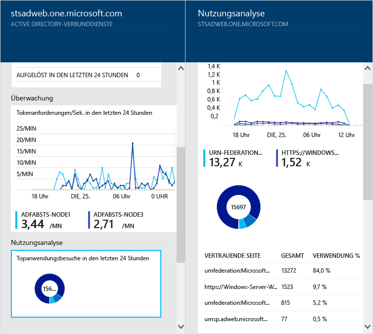

<properties 
	pageTitle="Überwachen Sie Ihre lokalen Identitätsinfrastruktur in der Cloud." 
	description="Auf der Seite &quot;Azure AD Connect Health&quot; wird der Dienst beschrieben, und es werden die Gründe für seine Verwendung erörtert." 
	services="active-directory" 
	documentationCenter="" 
	authors="billmath" 
	manager="swadhwa" 
	editor="curtand"/>

<tags 
	ms.service="active-directory" 
	ms.workload="identity" 
	ms.tgt_pltfrm="na" 
	ms.devlang="na" 
	ms.topic="article" 
	ms.date="05/28/2015" 
	ms.author="billmath"/>

# Überwachen Ihrer lokalen Identitätsinfrastruktur in der Cloud

Azure AD Connect Health unterstützt Sie bei der Überwachung Ihrer lokalen Identitätsinfrastruktur und vermittelt Ihnen wichtige Einblicke. Sie können damit Warnungen, Leistungsdaten, Verwendungsmuster und Konfigurationseinstellungen anzeigen, eine zuverlässige Verbindung mit Office 365 aufrechterhalten und viele weitere Funktionen nutzen. Dies wird mithilfe eines Agents erreicht, der auf den Zielservern installiert ist. Weitere Informationen zu [Azure AD Connect Health](https://msdn.microsoft.com/library/azure/dn906722.aspx) finden Sie auf MSDN.

Diese Informationen sind alle im Azure AD Connect Health-Portal aufgeführt. Im Azure AD Connect Health-Portal können Sie Warnungen, Leistungsüberwachungsdaten und Nutzungsanalysen anzeigen. Diese Informationen werden alle an einer zentralen Stelle präsentiert, damit Sie keine Zeit mit der Suche nach den Informationen verschwenden, die Sie benötigen.

Künftige Updates für Azure AD Connect Health werden zusätzliche Überwachungsfunktionen und Einblicke in andere Identitätskomponenten und -dienste umfassen, wie z. B. die Azure AD Connect-Synchronisierungsdienste. Entsprechend können Sie mithilfe eines zentralen Dashboards im Hinblick auf die Identität für eine stabilere, fehlerfreie und besser integrierte Umgebung sorgen, damit Ihre Benutzer ihre Aufgaben schneller erledigen können.

Weitere Informationen zu [Azure AD Connect Health](https://msdn.microsoft.com/library/azure/dn906722.aspx) finden Sie auf MSDN.

## Gründe für die Verwendung von Azure AD Connect Health

Die Integration Ihrer lokalen Verzeichnisse in Azure AD steigert die Produktivität Ihrer Benutzer, da für den Zugriff auf die Cloud und lokale Ressourcen nur eine Identität benötigt wird. Allerdings erfordert diese Integration, dass diese Umgebung fehlerfrei bleibt, sodass Benutzer von jedem Gerät verlässlich auf lokale ebenso wie auf Cloudressourcen zugreifen können. Azure AD Connect Health bietet einen einfachen cloudbasierten Ansatz zum Überwachen und Gewinnen von Einblicken in Ihre lokale Identitätsverwaltungsinfrastruktur, die für den Zugriff auf Office 365 oder andere Azure AD-Anwendungen genutzt wird. Dieser Ansatz ist ähnlich unkompliziert wie das Installieren eines Agents auf Ihren lokalen Identitätsservern.

Azure AD Connect Health für AD FS unterstützt AD FS 2.0 unter Windows Server 2008/2008 R2 und AD FS unter Windows Server 2012/2012R2. Dies umfasst auch alle AD FS-Proxy- oder Webanwendungsproxy-Server, die die Authentifizierung für den Extranetzugriff unterstützen. Azure AD Connect Health für AD FS stellt die folgenden wichtigen Funktionen bereit:

- Anzeigen von Warnungen und Einleiten entsprechender Gegenmaßnahmen, um den zuverlässigen Zugriff auf AD FS-geschützte Anwendungen wie Azure AD zu ermöglichen
- E-Mail-Benachrichtigungen für kritische Warnungen
- Anzeigen von Leistungsdaten für die Kapazitätsplanung
- Detaillierte Ansichten Ihrer AD FS-Anmeldemuster, um Abweichungen zu ermitteln und Baselines für die Kapazitätsplanung festzulegen

----------------------------------------------------------------------------------------------------------
## Herunterladen des Azure AD Connect Health-Agents

Für die ersten Schritte mit Azure AD Connect Health können Sie die neuste Version des Agents hier herunterladen: [Azure AD Connect Health-Agent – Download](http://go.microsoft.com/fwlink/?LinkID=518973). Stellen Sie vor der Installation der Agents sicher, dass Sie den Dienst vom Marketplace hinzugefügt haben.

----------------------------------------------------------------------------------------------------------

**Zusätzliche Ressourcen**

* [Azure AD Connect Health auf MSDN](https://msdn.microsoft.com/library/azure/dn906722.aspx)

 

<!---HONumber=62-->