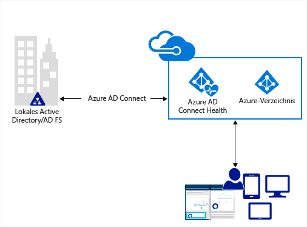
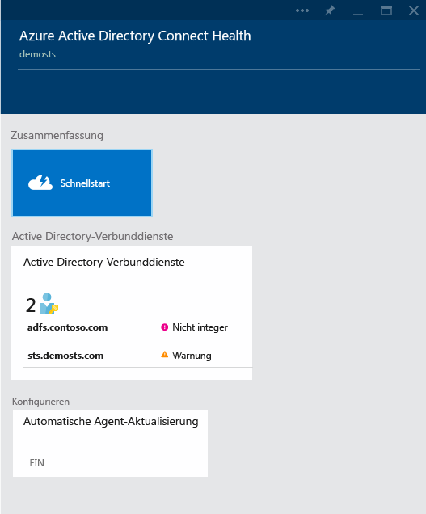

<properties
	pageTitle="Überwachen Sie Ihre lokalen Identitätsinfrastruktur in der Cloud."
	description="Auf der Seite ";Azure AD Connect Health"; wird der Dienst beschrieben, und es werden die Gründe für seine Verwendung erörtert."
	services="active-directory"
	documentationCenter=""
	authors="karavar"
	manager="stevenpo"
	editor="karavar"/>

<tags
	ms.service="active-directory"
	ms.workload="identity"
	ms.tgt_pltfrm="na"
	ms.devlang="na"
	ms.topic="get-started-article"
	ms.date="03/21/2016"
	ms.author="vakarand"/>

# Überwachen Ihrer lokalen Identitätsinfrastruktur und Synchronisierung von Diensten in der Cloud

Azure AD Connect Health unterstützt Sie bei der Überwachung Ihrer lokalen Identitätsinfrastruktur und Synchronisierungsdienste und vermittelt Ihnen wichtige Einblicke. Sie können für eine zuverlässige Verbindung mit Office 365 und Microsoft Online Services sorgen, indem Sie Überwachungsfunktionen für Ihre wichtigen Identitätskomponenten bereitstellen, z.B. AD FS Server, Azure AD Connect-Server (Synchronisierungsmodul), Active Directory-Domänencontroller usw. Außerdem sind die wichtigen Datenpunkte dieser Komponenten hierbei leicht zugänglich, sodass es einfach ist, Informationen zur Nutzung und andere wichtige Einblicke zu erhalten.

Die Informationen werden im [Azure AD Connect Health-Portal](https://aka.ms/aadconnecthealth) angezeigt. Im Azure AD Connect Health-Portal können Sie Warnungen, Leistungsüberwachungsdaten, Nutzungsanalysen und vieles mehr anzeigen. Azure AD Connect Health ermöglicht Ihnen an einem zentralen Ort einen Gesamtüberblick über die Integrität Ihrer wichtigsten Identitätskomponenten.

Künftige Updates für Azure AD Connect Health werden zusätzliche Überwachungsfunktionen und Einblicke in weitere Identitätskomponenten umfassen. Entsprechend können Sie mithilfe eines zentralen Dashboards im Hinblick auf die Identität für eine stabilere, fehlerfreie und besser integrierte Umgebung sorgen, damit Ihre Benutzer ihre Aufgaben schneller erledigen können.

<!-- 

 -->

## Gründe für die Verwendung von Azure AD Connect Health

Die Integration Ihrer lokalen Verzeichnisse in Azure AD steigert die Produktivität Ihrer Benutzer, da für den Zugriff auf die Cloud und lokale Ressourcen nur eine Identität benötigt wird. Allerdings erfordert diese Integration, dass diese Umgebung fehlerfrei bleibt, sodass Benutzer von jedem Gerät verlässlich auf lokale ebenso wie auf Cloudressourcen zugreifen können. Azure AD Connect Health bietet einen einfachen cloudbasierten Ansatz zum Überwachen und Gewinnen von Einblicken in Ihre lokale Identitätsverwaltungsinfrastruktur, die für den Zugriff auf Office 365 oder andere Azure AD-Anwendungen genutzt wird. Dieser Ansatz ist ähnlich unkompliziert wie das Installieren eines Agents auf Ihren lokalen Identitätsservern.

## [Azure AD Connect Health für AD FS](active-directory-aadconnect-health-adfs.md)

Azure AD Connect Health für AD FS unterstützt AD FS 2.0 unter Windows Server 2008 R2, AD FS unter Windows Server 2012 und Windows Server 2012 R2. Dies umfasst auch AD FS-Proxy- oder Webanwendungsproxy-Server, die die Authentifizierung für den Extranetzugriff unterstützen. Mit einer sehr einfachen und kostengünstigen Installation des Health-Agents stellt Azure AD Connect Health für AD FS die folgenden Hauptfunktionen bereit:

- Überwachung mit Warnungen als Information, wenn die Integrität von AD FS und der AD FS-Proxyserver nicht gewährleistet ist
- E-Mail-Benachrichtigungen für kritische Warnungen
- Anzeige von Trends in Leistungsdaten, nützlich für die Kapazitätsplanung von AD FS
- Nutzungsanalysen für AD FS-Anmeldungen mit unterschiedlicher Pivotierung (Apps, Benutzer, Netzwerkspeicherort usw.), nützlich für das Verständnis der AD FS-Nutzung
- Berichte für AD FS, z.B. Top-50-Benutzer mit fehlerhaften Anmeldeversuchen per Benutzername/Kennwort

Das folgende Video bietet eine Übersicht über Azure AD Connect Health für AD FS:

[AZURE.VIDEO azure-ad-connect-health--monitor-you-identity-bridge]

## [Azure AD Connect Health für die Synchronisierung](active-directory-aadconnect-health-sync.md)
Azure AD Connect Health für die Synchronisierung überwacht die Synchronisierungen zwischen Ihrem lokalen Active Directory und Azure Active Directory. Azure AD Connect Health für die Synchronisierung stellt die folgenden wichtigen Funktionen bereit:

- Überwachung mit Warnungen als Information, wenn die Integrität von Azure AD Connect-Servern (Synchronisierungsmodul) nicht gewährleistet ist
- E-Mail-Benachrichtigungen für kritische Warnungen
- Synchronisierung von betrieblichen Informationen, z.B. Latenzdiagramme für Synchronisierungsvorgänge und Trends von Synchronisierungsvorgängen wie Hinzufügungen, Aktualisierungen und Löschungen
- Schnellübersicht über Synchronisierungseigenschaften, letzter erfolgreicher Export zu Azure AD

Das folgende Video bietet eine Übersicht über Azure AD Connect Health für die Synchronisierung:

[Azure Active Directory Connect Health: Monitoring the sync engine](https://channel9.msdn.com/Series/Azure-Active-Directory-Videos-Demos/Azure-Active-Directory-Connect-Health-Monitoring-the-sync-engine) (Azure Active Directory Connect Health: Überwachen des Synchronisierungsmoduls)

## Erste Schritte mit Azure AD Connect Health
Die ersten Schritte mit Azure AD Connect Health sind sehr einfach. Führen Sie die folgenden Schritte aus:

1. [Rufen Sie Azure AD Premium ab](active-directory-get-started-premium), oder [beginnen Sie mit einer Testaktivierung](https://azure.microsoft.com/trial/get-started-active-directory/).

2. [Laden Sie Azure AD Connect Health-Agents herunter, und installieren Sie sie](#download-and-install-azure-ad-connect-health-agent) auf Ihren Identitätsservern.

3. Zeigen Sie das Azure AD Connect Health-Dashboard unter [https://aka.ms/aadconnecthealth](https://aka.ms/aadconnecthealth) an.

>[AZURE.NOTE]Denken Sie daran, dass Sie die Azure AD Connect Health-Agents auf Ihren Zielservern installieren müssen, um in Ihrem Azure AD Connect Health-Dashboard Daten anzeigen zu können.

## Herunterladen und Installieren des Azure AD Connect Health-Agents

- Sehen Sie sich die [Anforderungen](active-directory-aadconnect-health-agent-install.md#Requirements) für Azure AD Connect Health an.

- Für die ersten Schritte mit Azure AD Connect Health für AD FS können Sie die neueste Version des Agents hier herunterladen: [Azure AD Connect Health Agent für AD FS – Download](http://go.microsoft.com/fwlink/?LinkID=518973). 

- Für die ersten Schritte mit Azure AD Connect Health für die Synchronisierung laden Sie die [aktuelle Version von Azure AD Connect](http://go.microsoft.com/fwlink/?linkid=615771) herunter, und installieren Sie sie. Der Health-Agent wird im Rahmen der Installation von Azure AD Connect installiert (Version 1.0.9125.0 oder höher). Azure AD Connect unterstützt ein direktes Upgrade von vorherigen Versionen.

## Azure AD Connect Health-Portal
Im Azure AD Connect Health-Portal können Sie Warnungen, Leistungsüberwachungsdaten und Nutzungsanalysen anzeigen. Über https://aka.ms/aadconnecthealth gelangen Sie zum Hauptblatt von Azure AD Connect Health. Sie können es sich wie ein Fenster vorstellen. Auf dem Hauptblatt werden die Option „Schnellstart“, die Dienste von Azure AD Connect Health und weitere Konfigurationsoptionen angezeigt. Der nachstehende Screenshot zeigt jedes dieser Elemente, die nachfolgend kurz beschrieben werden. Nachdem Sie die Agents bereitgestellt haben, werden die Bezeichner für die Dienste angegeben, die von Azure AD Connect Health überwacht werden.

- **Schnellstart** – Bei Auswahl wird das Blatt "Schnellstart" geöffnet. Hier können Sie den Azure AD Connect Health-Agent herunterladen, indem Sie auf "Tools abrufen" klicken, Sie können auf die Dokumentation zugreifen und Feedback geben.

- **Active Directory-Verbunddienste** – Repräsentiert alle AD FS-Dienste, die aktuell von Azure AD Connect Health überwacht werden. Durch Auswahl einer der Instanzen wird ein Blatt mit Informationen zu dieser Dienstinstanz geöffnet. darunter beispielsweise eine Übersicht, Eigenschaften, Warnungen, Überwachungsinformationen und eine Nutzungsanalyse. Weitere Informationen zu den Funktionen finden Sie [hier](active-directory-aadconnect-health-adfs.md).

- **Azure Active Directory Connect (Sync)** – Repräsentiert Ihre Azure AD Connect-Server, die von Azure AD Connect Health derzeit überwacht werden. Wenn Sie den Eintrag auswählen, wird ein Blatt mit Informationen zu Ihren Azure AD Connect-Servern geöffnet. Weitere Informationen zu den Funktionen finden Sie [hier](active-directory-aadconnect-health-sync.md).

- **Konfigurieren** – Ermöglicht das Aktivieren oder Deaktivieren der folgenden Optionen:

	1. Automatische Aktualisierung des Azure AD Connect Health-Agents auf die aktuelle Version – Dies bedeutet, dass eine automatische Aktualisierung auf die aktuelle Version des Azure AD Connect Health-Agents durchgeführt wird, sobald diese verfügbar ist. Diese Einstellung ist standardmäßig aktiviert.

	2. Erlauben Sie Microsoft, zu Zwecken der Problembehandlung den Zugriff auf die Integritätsdaten für Ihr Azure AD-Verzeichnis – Wenn Sie diese Einstellung aktivieren, kann Microsoft dieselben Daten anzeigen wie Sie. Dies kann bei der Problembehandlung und zur Unterstützung bei der Fehlerbeseitigung von Nutzen sein. Diese Einstellung ist standardmäßig deaktiviert.

## Verwandte Links

* [Installieren des Azure AD Connect Health-Agents](active-directory-aadconnect-health-agent-install.md)
* [Azure AD Connect Health-Vorgänge](active-directory-aadconnect-health-operations.md)
* [Verwenden von Azure AD Connect Health mit AD FS](active-directory-aadconnect-health-adfs.md)
* [Verwenden von Azure AD Connect Health für die Synchronisierung](active-directory-aadconnect-health-sync.md)
* [Azure AD Connect Health – FAQ](active-directory-aadconnect-health-faq.md)
* [Azure AD Connect Health: Versionsverlauf](active-directory-aadconnect-health-version-history.md)

<!---HONumber=AcomDC_0323_2016-->