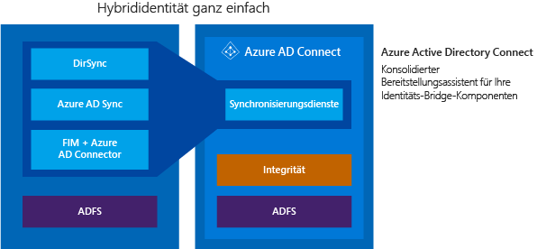

<properties
	pageTitle="Azure AD Connect: Integrieren Ihrer lokalen Identitäten in Azure Active Directory | Microsoft Azure"
	description="Mit Azure AD Connect können Sie Ihr lokales Identitätssystem wie Windows Server Active Directory in Azure Active Directory integrieren und eine Verbindung für Ihre Benutzer mit Office 365, Azure und Tausenden SaaS-Anwendungen herstellen. Dieses Thema erläutert die Features von Azure AD Connect und enthält Informationen zur Funktionsweise sowie zur Installation, Konfiguration und Anpassung von Azure AD Connect."
    keywords="Einführung in Azure AD Connect, Übersicht über Azure AD Connect, was ist Azure AD Connect, Active Directory installieren"
	services="active-directory"
	documentationCenter=""
	authors="andkjell"
	manager="stevenpo"
	editor="curtand"/>

<tags
	ms.service="active-directory"
	ms.workload="identity"
	ms.tgt_pltfrm="na"
	ms.devlang="na"
	ms.topic="get-started-article"
	ms.date="02/16/2016"
	ms.author="andkjell;billmath"/>

# Integrieren Ihrer lokalen Identitäten in Azure Active Directory
Mit Azure AD Connect können Sie Ihr lokales Identitätssystem wie Windows Server Active Directory in Azure Active Directory integrieren und eine Verbindung für Ihre Benutzer mit Office 365, Azure und tausenden Saas-Anwendungen herstellen. Dieses Thema bietet eine umfassende Anleitung für das Vorbereiten und Bereitstellen der erforderlichen Komponenten für Ihre Endbenutzer, um mit der gleichen Identität auf die Clouddienste zuzugreifen, mit der sie bereits auf vorhandene Unternehmens-Apps zugreifen.

## Gründe für die Verwendung von Azure AD Connect
Die Integration Ihrer lokalen Verzeichnisse in Azure AD steigert die Produktivität Ihrer Benutzer, da für den Zugriff auf die Cloud und lokale Ressourcen nur eine Identität benötigt wird. Mit dieser Integration können Benutzer und Organisationen die folgenden Vorteile nutzen:

- Benutzer können eine einzelne Identität verwenden, um auf lokale Anwendungen und Clouddienste wie z. B. Office 365 zuzugreifen.

- Einzelnes Tool zum Bereitstellen einer einfachen Bereitstellungserfahrung für die Synchronisierung und Anmeldung.

- Bietet die neuesten Funktionen für Ihre Szenarien. Azure AD Connect ersetzt ältere Versionen von Identitätsintegrationstools, wie z. B. DirSync und Azure AD Sync. Weitere Informationen finden Sie unter [Vergleich von Tools für die Verzeichnisintegration für Hybrid-Identitäten](active-directory-hybrid-identity-design-considerations-tools-comparison.md).

### Funktionsweise von Azure AD Connect

Azure Active Directory Connect besteht aus drei Hauptbestandteilen. Dies sind die Synchronisierungsdienste, die optionalen Active Directory-Verbunddienste und die Überwachung mithilfe von [Azure AD Connect Health](active-directory-aadconnect-health.md).

 

- Synchronisierung: Dieser Teil umfasst die Komponenten und Funktionen, die zuvor als [Dirsync und Azure AD Sync](active-directory-hybrid-identity-design-considerations-tools-comparison.md) veröffentlicht wurden. Dieser Teil ist für das Erstellen von Benutzern und Gruppen zuständig. Er stellt ebenfalls sicher, dass Benutzer- und Gruppeninformationen in Ihrer lokalen Umgebung denen in der Cloud entsprechen.
- AD FS: Dies ist eine optionale Komponente von Azure AD Connect und kann zum Einrichten einer Hybridumgebung mithilfe einer lokalen AD FS-Infrastruktur verwendet werden. Dieser Teil kann von Organisationen verwendet werden, um sich mit komplexen Bereitstellungen zu befassen, z. B. Domänenbeitritts-SSO, Erzwingen von AD-Anmelderichtlinien und Smartcard- bzw. Drittanbieter-MFA.
- Systemüberwachung: Azure AD Connect Health bietet eine stabile Überwachung und einen zentralen Speicherort im Azure-Portal, um diese Aktivität anzuzeigen. Weitere Informationen finden Sie unter [Azure Active Directory Connect Health](active-directory-aadconnect-health.md).

## Installieren von Azure AD Connect

Den Download für Azure AD Connect finden Sie im [Microsoft Download Center](http://go.microsoft.com/fwlink/?LinkId=615771).

| Lösung | Szenario |
| ----- | ----- |
| Vorbereitung | <li>[Azure AD Connect: Hardware und Voraussetzungen](active-directory-aadconnect-prerequisites.md)</li> |
| [Express-Einstellungen](active-directory-aadconnect-get-started-express.md) | <li>Empfohlene Standardoption bei einem einzelnen Gesamtstruktur-AD.</li> <li>Benutzer melden Sie sich mit dem gleichen Kennwort mithilfe der Kennwortsynchronisierung an.</li>
| [Benutzerdefinierte Einstellungen](active-directory-aadconnect-get-started-custom.md) | <li>Verwendet bei mehreren Gesamtstrukturen. Unterstützt viele lokale [Topologien](active-directory-aadconnect-topologies.md).</li> <li>Passen Sie die Anmeldeoption an, z. B. ADFS für den Verbund, oder verwenden Sie einen Drittanbieter-Identitätsanbieter.</li> <li>Passen Sie Synchronisierungsfunktionen an, wie das Filtern und Rückschreiben.</li>
| [Upgrade von DirSync](active-directory-aadconnect-dirsync-upgrade-get-started.md) | <li>Bei einem vorhandenen DirSync-Server, der bereits ausgeführt wird.</li>
| Upgrade von Azure AD Sync | <li>Dies ist ein nahtloses Direktupgrade.</li>

[Nach der Installation](active-directory-aadconnect-whats-next.md) sollten Sie überprüfen, ob es wie erwartet funktioniert und den Benutzern Lizenzen zuweisen.

### Nächste Schritte für die Installation von Azure AD Connect

| Thema | |
| --------- | --------- |
| Azure AD Connect herunterladen | [Azure AD Connect herunterladen](http://go.microsoft.com/fwlink/?LinkId=615771) |
| Installieren mit den Express-Einstellungen | [Expressinstallation von Azure AD Connect](active-directory-aadconnect-get-started-express.md) |
| Installieren mit benutzerdefinierten Einstellungen | [Benutzerdefinierte Installation von Azure AD Connect](active-directory-aadconnect-get-started-custom.md) |
| Upgrade von DirSync | [Upgrade von Azure AD-Synchronisierungstools (DirSync)](active-directory-aadconnect-dirsync-upgrade-get-started.md) |
| Nach der Installation | [Überprüfen der Installation und Zuweisen von Lizenzen ](active-directory-aadconnect-whats-next.md) |

### Weitere Informationen über die Installation von Azure AD Connect

Sie sollten sich auch auf [betriebliche](active-directory-aadconnectsync-operations.md) Probleme vorbereiten. Sie möchten möglicherweise einen Standbyserver haben, damit Sie im [Notfall](active-directory-aadconnectsync-operations.md#disaster-recovery) problemlos ein Fallover durchführen können. Wenn Sie beabsichtigen, häufig Konfigurationsänderungen vorzunehmen, sollten Sie einen [Stagingmodus](active-directory-aadconnectsync-operations.md#staging-mode)-Server einplanen.

| Thema | |
| --------- | --------- |
| Unterstützte Topologien | [Topologien für Azure AD Connect](active-directory-aadconnect-topologies.md) |
| Entwurfskonzepte | [Entwurfskonzepte für Azure AD Connect](active-directory-aadconnect-design-concepts.md) |
| Für die Installation verwendete Konten | [Weitere Informationen zu den Anmeldeinformationen und Berechtigungen von Azure AD Connect](active-directory-aadconnect-accounts-permissions.md) |
| Operative Planung | [Azure AD Connect Sync: Operative Aufgaben und Überlegungen](active-directory-aadconnectsync-operations.md) |
| Optionen für die Benutzeranmeldung | [Azure AD Connect-Optionen für die Benutzeranmeldung](active-directory-aadconnect-user-signin.md) |

## Konfigurieren von Funktionen
Azure AD Connect verfügt über mehrere Funktionen, die Sie optional aktivieren können oder die standardmäßig aktiviert sind. Einige Funktionen benötigen in einigen Fällen möglicherweise eine zusätzliche Konfiguration in bestimmten Szenarios und Topologien.

[Filtern](active-directory-aadconnectsync-configure-filtering.md) wird verwendet, wenn Sie begrenzen möchten, welche Objekte mit Azure AD synchronisiert werden. Standardmäßig werden alle Benutzer, Kontakte, Gruppen und Windows 10-Computer synchronisiert, aber Sie können dies auf Grundlage von Domänen, Organisationseinheiten oder Attributen einschränken.

[Kennwortsynchronisierung](active-directory-aadconnectsync-implement-password-synchronization.md) synchronisiert das Kennworthash in Active Directory nach Azure AD. Dies ermöglicht es dem Benutzer, das gleiche Kennwort lokal und in der Cloud zu verwenden, es jedoch nur an einem Ort zu verwalten. Da es das lokale Active Directory verwendet, können Sie auch Ihre eigene Kennwortrichtlinie verwenden.

Das [Kennwortrückschreiben](active-directory-passwords-getting-started.md) ermöglicht es den Benutzern, ihre Kennwörter in der Cloud zu ändern und zurückzusetzen und die lokale Kennwortrichtlinie anzuwenden.

Das [Geräterückschreiben](active-directory-aadconnect-feature-device-writeback.md) ermöglicht es Ihnen, ein in Azure AD registriertes Gerät wieder in das lokale Active Directory zurückzuschreiben, damit es für bedingten Zugriff verwendet werden kann.

Die Funktion zum [Verhindern eines versehentlichen Löschvorgangs](active-directory-aadconnectsync-feature-prevent-accidental-deletes.md) ist standardmäßig aktiviert und schützt Ihr Cloudverzeichnis vor einer Vielzahl von gleichzeitigen Löschvorgängen. Standardmäßig sind 500 Löschvorgänge pro Durchlauf zulässig; dies kann abhängig von der Größe Ihres Unternehmens geändert werden.

Das [automatische Upgrade](active-directory-aadconnect-feature-automatic-upgrade.md) ist für Installationen mit Express-Einstellungen standardmäßig aktiviert und stellt sicher, dass Ihr Azure AD Connect immer mit der neuesten Version aktualisiert wird.

### Nächste Schritte zum Konfigurieren der Funktionen

| Thema | |
| --------- | --------- |
| Konfigurieren der Filterung | [Azure AD Connect-Synchronisierung: Konfigurieren der Filterung](active-directory-aadconnectsync-configure-filtering.md) |
| Kennwortsynchronisierung | [Azure AD Connect-Synchronisierung: Implementieren der Kennwortsynchronisierung](active-directory-aadconnectsync-implement-password-synchronization.md) |
| Rückschreiben von Kennwörtern | [Erste Schritte mit der Kennwortverwaltung](active-directory-passwords-getting-started.md) |
| Geräterückschreiben | [Aktivieren des Geräterückschreibens in Azure AD Connect](active-directory-aadconnect-feature-device-writeback.md) |
| Verhindern von versehentlichen Löschungen | [Azure AD Connect-Synchronisierung: Verhindern von versehentlichen Löschvorgängen](active-directory-aadconnectsync-feature-prevent-accidental-deletes.md) |
| Automatisches Upgrade | [Azure AD Connect: Automatisches Upgrade](active-directory-aadconnect-feature-automatic-upgrade.md)|

## Anpassen der Azure AD Connect-Synchronisierung
Für die Azure AD Connect-Synchronisierung ist eine Standardkonfiguration vorgegeben, die für die meisten Kunden und Topologien konzipiert wurde. Es gibt jedoch immer Situationen, in denen die Standardkonfiguration nicht funktioniert und angepasst werden muss. Sie können Änderungen wie in diesem Abschnitt und in den verknüpften Themen beschrieben vornehmen.

Wenn Sie noch nicht mit einer Synchronisierungstopologie gearbeitet haben, sollten Sie sich zunächst mit den Grundlagen und verwendeten Begriffen vertraut machen, die unter [Technische Konzepte](active-directory-aadconnectsync-technical-concepts.md) beschrieben werden. Azure AD Connect ist die Weiterentwicklung von MIIS2003, ILM2007 und FIM2010. Selbst wenn einige Dinge identisch sind, hat sich doch auch eine Menge verändert.

Bei der [Standardkonfiguration](active-directory-aadconnectsync-understanding-default-configuration.md) wird davon ausgegangen, dass die Konfiguration möglicherweise mehrere Gesamtstrukturen umfasst. In diesen Topologien kann ein Benutzerobjekt möglicherweise in einer anderen Gesamtstruktur als Kontakt dargestellt werden. Der Benutzer kann in einer anderen Ressourcengesamtstruktur auch über ein verknüpftes Postfach verfügen. Das Verhalten der Standardkonfiguration wird unter [Benutzer und Kontakte](active-directory-aadconnectsync-understanding-users-and-contacts.md) beschrieben.

Das synchronisierte Konfigurationsmodell wird als [deklarative Bereitstellung](active-directory-aadconnectsync-understanding-declarative-provisioning-expressions.md) bezeichnet. Die erweiterten Attributflüsse verwenden [Funktionen](active-directory-aadconnectsync-functions-reference.md), um Attributtransformationen auszudrücken. Sie können die gesamte Konfiguration mithilfe von Tools, die im Lieferumfang von Azure AD Connect enthalten sind, anzeigen und überprüfen. Wenn Sie Änderungen an der Konfiguration vornehmen müssen, stellen Sie sicher, dass Sie die [bewährten Methoden](active-directory-aadconnectsync-best-practices-changing-default-configuration.md) befolgen, damit neue Versionen leichter übernommen werden, sobald sie zur Verfügung gestellt werden.

### Nächste Schritte zur Anpassung der Azure AD Connect-Synchronisierung

| Thema | |
| --------- | --------- |
| Alle Artikel zur Azure AD Connect-Synchronisierung | [Azure AD Connect-Synchronisierung](active-directory-aadconnectsync-whatis.md) |
| Technische Konzepte | [Azure AD Connect-Synchronisierung: Technische Konzepte](active-directory-aadconnectsync-technical-concepts.md) |
| Grundlegendes zur Standardkonfiguration | [Azure AD Connect-Synchronisierung: Grundlegendes zur Standardkonfiguration](active-directory-aadconnectsync-understanding-default-configuration.md) |
| Grundlegendes zu Benutzern und Kontakten | [Azure AD Connect-Synchronisierung: Grundlegendes zu Benutzern und Kontakten](active-directory-aadconnectsync-understanding-users-and-contacts.md) |
| Deklarative Bereitstellung | [Azure AD Connect-Synchronisierung: Grundlegendes zu Ausdrücken für die deklarative Bereitstellung](active-directory-aadconnectsync-understanding-declarative-provisioning-expressions.md) |
| Ändern der Standardkonfiguration | [Bewährte Methoden zum Ändern der Standardkonfiguration](active-directory-aadconnectsync-best-practices-changing-default-configuration.md) |

## Weitere Informationen und Referenzen

| Thema | |
| --------- | --------- |
| Versionsverlauf | [Versionsverlauf](active-directory-aadconnect-version-history.md) |
| Vergleich von DirSync, Azure ADSync und Azure AD Connect | [Vergleich von Tools für die Verzeichnisintegration](active-directory-aadconnect-get-started-tools-comparison.md) |
| Synchronisierte Attribute | [Synchronisierte Attribute](active-directory-aadconnectsync-attributes-synchronized.md) |
| Überwachen mit Azure AD Connect Health | [Azure AD Connect Health](active-directory-aadconnect-health.md) |
| Häufig gestellte Fragen | [Häufig gestellte Fragen zu Azure AD Connect](active-directory-aadconnect-faq.md) |

**Weitere Ressourcen**

Ignite 2015-Präsentation über die Erweiterung lokaler Verzeichnisse in die Cloud.

[AZURE.VIDEO microsoft-ignite-2015-extending-on-premises-directories-to-the-cloud-made-easy-with-azure-active-directory-connect]

<!---HONumber=AcomDC_0224_2016-->