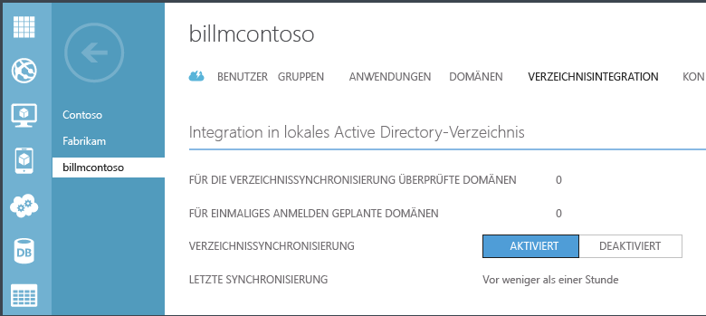
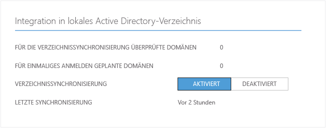
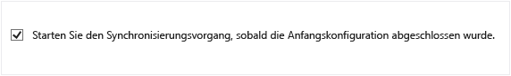
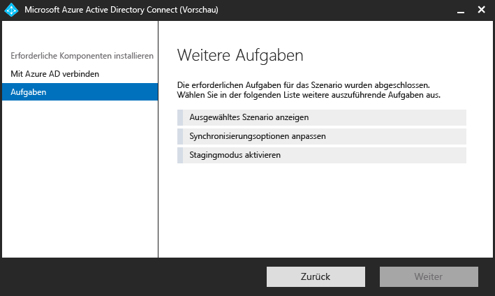

<properties 
	pageTitle="Integrieren Sie Ihre lokalen Identitäten in Azure Active Directory." 
	description="Nachfolgend finden Sie einen Überblick über Azure AD Connect sowie eine Beschreibung des Einsatzes dieser Technologie." 
	services="active-directory" 
	documentationCenter="" 
	authors="billmath" 
	manager="swadhwa" 
	editor="curtand"/>

<tags 
	ms.service="active-directory" 
	ms.workload="identity" 
	ms.tgt_pltfrm="na" 
	ms.devlang="na" 
	ms.topic="article" 
	ms.date="07/13/2015" 
	ms.author="billmath"/>

# Integrieren Ihrer lokalen Identitäten in Azure Active Directory

Heutzutage möchten Benutzer auf Anwendungen sowohl lokal als auch in der Cloud zugreifen können. Dieser Zugriff soll von jedem beliebigen Gerät aus erfolgen, z. B. einem Laptop, Smartphone oder Tablet. Da die vollständige Migration in die Cloud nicht immer möglich ist, müssen Unternehmen eine Lösung finden, wie sie Benutzern die benötigten Anwendungen zur Verfügung stellen können.

Die Einführung von Azure Active Directory vereinfacht den Zugriff auf diese Anwendungen und die Migration in die Cloud. Azure AD Connect bietet die folgenden Vorteile:

- Die Benutzer können sich mit einer einzigen Identität sowohl in der Cloud als auch lokal anmelden. Das Merken mehrerer Benutzerpasswörter und -konten entfällt, und Administratoren entsteht kein Mehraufwand durch die Verwaltung mehrerer Konten.
- Azure AD Connect stellt das einzige Tool samt Anleitungen zum Verbinden Ihrer lokalen Verzeichnisse mit Azure Active Directory dar. Nach der Installation implementiert und konfiguriert der Assistent alle Komponenten, die erforderlich sind, um Ihre Verzeichnisintegration einzurichten und auszuführen, einschließlich Synchronisierungsdiensten, Kennwortsynchronisierung oder Active Directory-Verbunddiensten (AD FS) sowie Voraussetzungen wie dem Azure AD PowerShell-Modul.

## Gründe für die Verwendung von Azure AD Connect 

Die Integration Ihrer lokalen Verzeichnisse in Azure AD steigert die Produktivität Ihrer Benutzer, da für den Zugriff auf die Cloud und lokale Ressourcen nur eine Identität benötigt wird. Mit dieser Integration können Benutzer und Organisationen die folgenden Vorteile nutzen:
	
* Organisationen können für Benutzer eine Hybrid-Identität zum Zugriff auf lokale und cloudbasierte Dienste bereitstellen, die mithilfe von Windows Server Active Directory die Verbindung zu Azure Active Directory ermöglicht. 
* Administratoren können basierend auf Anwendungsressourcen, Geräte- und Benutzeridentität, Netzwerkadressen und Multi-Factor Authentication Richtlinien für den bedingten Zugriff erstellen.
* Benutzer können diese allgemeine Identität für Konten von Azure AD bis Office 365, Intune, SaaS-Anwendungen und Anwendungen von Drittanbietern nutzen.  
* Entwickler können Anwendungen erstellen, die das allgemeine Identitätsmodell nutzen, und Anwendungen in das lokale Active Directory oder Azure für cloudbasierte Anwendungen integrieren.

Connect von Azure AD erleichtert diese Integration und vereinfacht die Verwaltung Ihrer lokalen und cloudbasierten Identitätsinfrastruktur.

----------------------------------------------------------------------------------------------------------
## Azure AD Connect herunterladen

Für Ihre ersten Schritte mit Azure AD Connect können Sie die neuste Version über den folgenden Link herunterladen: [Download Azure AD Connect](http://go.microsoft.com/fwlink/?LinkId=615771) (in englischer Sprache)

----------------------------------------------------------------------------------------------------------

## Funktionsweise von Azure AD Connect

Azure Active Directory Connect besteht aus drei Hauptbestandteilen. Dies sind die Synchronisierungsdienste, die optionalen Active Directory-Verbunddienste und die Überwachung mithilfe von [Azure AD Connect Health](https://msdn.microsoft.com/library/azure/dn906722.aspx).

 

- Synchronisierung – Dieser Teil umfasst die Komponenten und Funktionen, die zuvor als Dirsync und AAD Sync veröffentlicht wurden. Dieser Teil ist für das Erstellen von Benutzern und Gruppen zuständig. Er stellt ebenfalls sicher, dass Benutzer- und Gruppeninformationen in Ihrer lokalen Umgebung denen in der Cloud entsprechen.
- AD FS – Dies ist eine optionale Komponente von Azure AD Connect und kann zum Einrichten einer Hybridumgebung mithilfe einer lokalen AD FS-Infrastruktur verwendet werden. Dieser Teil kann von Organisationen verwendet werden, um sich mit komplexen Bereitstellungen zu befassen, z. B. Domänenbeitritts-SSO, Erzwingen von AD-Anmelderichtlinien und Smartcard- bzw. Drittanbieter-MFA. Weitere Informationen zum Konfigurieren von SSO finden Sie unter [DirSync mit Single Sign-On](https://msdn.microsoft.com/library/azure/dn441213.aspx).
- Überwachung der Integrität – Für komplexe Bereitstellungen mithilfe von AD FS bietet Azure AD Connect Health eine stabile Überwachung Ihrer Verbundserver und einen zentralen Speicherort im Azure-Portal, um diese Aktivität anzuzeigen. Weitere Informationen finden Sie unter [Azure Active Directory Connect Health](https://msdn.microsoft.com/library/azure/dn906722.aspx).

### Azure AD Connect unterstützende Komponenten

Folgendes ist eine Liste der erforderlichen und unterstützenden Komponenten, die Azure AD Connect auf dem Server installiert, auf dem Azure AD Connect eingerichtet ist. Diese Liste ist für eine einfache Expressinstallation. Wenn Sie einen anderen SQL Server auf der Installationsseite für Synchronisierungsdienste verwenden möchten, werden die unten aufgeführten SQL Server 2012-Komponenten nicht installiert.

- Azure AD Connector für Azure AD Connect
- Microsoft SQL Server 2012 – Befehlszeilenprogramme
- Microsoft SQL Server 2012 Native Client
- Microsoft SQL Server 2012 Express LocalDB
- Azure Active Directory-Modul für Windows PowerShell
- Microsoft Online Services-Anmeldeassistent für IT-Experten
- Microsoft Visual C++ 2013 Redistributionspaket

## Erste Schritte mit Azure AD Connect

Die folgende Dokumentation hilft Ihnen beim Einstieg mit Azure Active Directory Connect. In dieser Dokumentation wird die Verwendung der Expressinstallation für Azure AD Connect behandelt. Informationen zur benutzerdefinierten Installation finden Sie unter [Custom installation of Azure AD Connect](active-directory-aadconnect-get-started-custom.md) (in englischer Sprache). Informationen zum Aktualisieren von DirSync auf Azure AD Connect finden Sie unter [Upgrading DirSync to Azure Active Directory Connect](active-directory-aadconnect-dirsync-upgrade-get-started.md) (in englischer Sprache).

### Vor der Installation von Azure AD Connect
Vor der Installation von Azure AD Connect mit Express-Einstellungen benötigen Sie Folgendes.

 
- Ein Azure-Abonnement oder ein [Azure-Testabonnement](http://azure.microsoft.com/pricing/free-trial/) – Dies ist nur erforderlich für den Zugriff auf das Azure-Portal und nicht für die Verwendung von Azure AD Connect. Bei Verwendung von PowerShell oder Office 365 benötigen Sie für Azure AD Connect kein Azure-Abonnement.
- Ein globales Azure AD-Administratorkonto für den Azure AD-Mandanten, den Sie integrieren möchten.
- Ein AD-Domänencontroller oder Mitgliedsserver mit Windows Server 2008 oder höher.
- Ein Enterprise-Administratorkonto für Ihr lokales Active Directory
- Optional: Ein Testbenutzerkonto zur Überprüfung der Synchronisierung. 

#### Hardwareanforderungen für Azure AD Connect
Die folgende Tabelle zeigt die Mindestanforderungen für den Azure AD Connect-Computer.

| Anzahl der Objekte in Active Directory | CPU | Arbeitsspeicher | Festplattengröße |
| ------------------------------------- | --- | ------ | --------------- |
| Weniger als 10.000 | 1,6 GHz | 4 GB | 70 GB |
| 10\.000 bis 50.000 | 1,6 GHz | 4 GB | 70 GB |
| 50\.000 bis 100.000 | 1,6 GHz | 16 GB | 100 GB |
| Für 100.000 oder mehr Objekte ist die Vollversion von SQL Server erforderlich| | | |
| 100\.000 bis 300.000 | 1,6 GHz | 32 GB | 300 GB |
| 300\.000 bis 600.000 | 1,6 GHz | 32 GB | 450 GB |
| Mehr als 600.000 | 1,6 GHz | 32 GB | 500 GB |

Informationen zu weiteren Anforderungen für benutzerdefinierte Optionen, z. B. für mehrere Gesamtstrukturen oder die Verbundanmeldung, finden Sie [hier](active-directory-aadconnect-get-started-custom.md).

### Expressinstallation von Azure AD Connect
Die Auswahl der Express-Einstellungen ist die Standardoption und eines der häufigsten Szenarios. Auf diese Weise stellt Azure AD Connect die Synchronisierung mit der Kennwort-Hash-Synchronisierungsoption bereit. Dies gilt nur für eine einzige Gesamtstruktur und ermöglicht den Benutzern die Verwendung ihres lokalen Kennworts beim Anmelden in der Cloud. Bei Verwendung der Express-Einstellungen wird nach Abschluss der Installation automatisch eine Synchronisierung gestartet (dies können Sie jedoch auch deaktivieren). Mit dieser Option können Sie mit nur wenigen kurzen Klicks Ihr lokales Verzeichnis auf die Cloud erweitern.

#### So installieren Sie Azure AD Connect mit Express-Einstellungen
--------------------------------------------------------------------------------------------

1. Melden Sie sich als Enterprise-Administrator an dem Server an, auf dem Sie Azure AD Connect installieren möchten. Dies sollte der Server sein, der als Synchronisierungsserver verwendet werden soll.
2. Navigieren Sie zu AzureADConnect.msi und doppelklicken Sie darauf
3. Aktivieren Sie auf der Willkommensseite das Kontrollkästchen zum Zustimmen zu den Lizenzbedingungen, und klicken Sie auf **Weiter**.
4. Klicken Sie im Bildschirm "Express-Einstellungen" auf **Express-Einstellungen verwenden**.

6. Geben Sie im Bildschirm "Mit Azure AD verbinden" den Benutzernamen und das Kennwort eines globalen Azure-Administrators für Azure AD ein. Klicken Sie auf **Weiter**.
8. Geben Sie im Bildschirm "Mit AD DS verbinden" den Benutzernamen und das Kennwort für ein Enterprise-Administratorkonto ein. Klicken Sie auf **Weiter**.

9. Klicken Sie im Bildschirm "Bereit zur Konfiguration" auf **Installieren**.
	- Optional können Sie auf der Seite "Bereit zur Konfiguration" das Kontrollkästchen **Starten Sie den Synchronisierungsvorgang, sobald die Anfangskonfiguration abgeschlossen wurde** deaktivieren. Der Assistent konfiguriert dann zwar die Synchronisierung, die Aufgabe bleibt jedoch deaktiviert, sodass sie erst ausgeführt wird, wenn Sie sie in der Aufgabenplanung manuell aktivieren. Sobald die Aufgabe aktiviert ist, wird die Synchronisierung alle drei Stunden ausgeführt.
	- Durch Aktivieren des entsprechenden Kontrollkästchens können Sie wahlweise auch die Konfiguration von Synchronisierungsdiensten für die **Exchange-Hybridbereitstellung** festlegen. Wenn Sie Exchange-Postfächer nicht gleichzeitig lokal und in der Cloud bereitstellen möchten, müssen Sie diese Option nicht aktivieren.

8. Klicken Sie nach Abschluss der Installation auf **Beenden**.

   

Im Folgenden können Sie sich ein Video zur Expressinstallation ansehen:

[AZURE.VIDEO azure-active-directory-connect-express-settings]

### Überprüfen der Installation

Nach der erfolgreichen Installation von Azure AD Connect können Sie überprüfen, ob die Synchronisierung ausgeführt wird, indem Sie sich beim Azure-Portal anmelden und die letzte Synchronisierungszeit prüfen.

1.  Melden Sie sich beim Azure-Portal an.
2.  Wählen Sie im linken Bereich "Active Directory" aus.
3.  Doppelklicken Sie auf das Verzeichnis, das Sie soeben zum Einrichten von Azure AD Connect verwendet haben.
4.  Wählen Sie im oberen Bereich "Verzeichnisintegration" aus. Prüfen Sie die letzte Synchronisierungszeit.

## Verwalten von Azure AD Connect 

Anhand der Anweisungen in den folgenden weiterführenden Themen können Sie Azure Active Directory Connect entsprechend den Bedürfnissen und Anforderungen Ihrer Organisation anpassen.

### Zuweisen von Lizenzen für Benutzer von Azure AD Premium und Enterprise Mobility

Nachdem Ihre Benutzer in der Cloud synchronisiert wurden, müssen Sie ihnen nun eine Lizenz zuweisen, sodass sie Cloudanwendungen wie z. B. Office 365 verwenden können.

#### So weisen Sie eine Azure AD Premium- oder Enterprise Mobility Suite-Lizenz zu
--------------------------------------------------------------------------------
1. Melden Sie sich beim Azure-Portal als Administrator an.
2. Wählen Sie im linken Bereich **Active Directory** aus.
3. Doppelklicken Sie auf der Seite "Active Directory" auf das Verzeichnis mit den Benutzern, die Sie aktivieren möchten.
4. Wählen Sie oben auf der Seite des Verzeichnisses die Option **Lizenzen** aus.
5. Wählen Sie auf der Seite "Lizenzen" die Option "Active Directory Premium" oder "Enterprise Mobility Suite" aus, und klicken Sie dann auf **Zuweisen**.
6. Wählen Sie im Dialogfeld die Benutzer aus, denen Sie Lizenzen zuweisen möchten, und klicken Sie dann auf das Häkchen, um die Änderungen zu speichern.

### Überprüfen der geplanten Synchronisierungsaufgabe
Sie können den Status einer Synchronisierung im Azure-Portal überprüfen.

#### So überprüfen Sie die geplante Synchronisierungsaufgabe
--------------------------------------------------------------------------------

1. Melden Sie sich beim Azure-Portal als Administrator an.
2. Wählen Sie im linken Bereich **Active Directory** aus.
3. Doppelklicken Sie auf der Seite "Active Directory" auf das Verzeichnis mit den Benutzern, die Sie aktivieren möchten.
4. Wählen Sie oben auf der Seite des Verzeichnisses die Option **Verzeichnisintegration** aus.
5. Prüfen Sie unter "Integration mit lokalem Active Directory" die letzte Synchronisierungszeit.

### Starten einer geplanten Synchronisierungsaufgabe
Wenn Sie eine Synchronisierungsaufgabe ausführen möchten, können Sie dazu wieder den Azure AD Connect-Assistenten durchlaufen. Sie müssen Ihre Azure AD-Anmeldeinformationen angeben. Wählen Sie im Assistenten die Aufgabe **Synchronisierungsoptionen anpassen** aus, und klicken Sie in den weiteren Schritten des Assistenten auf "Weiter". Stellen Sie am Ende sicher, dass das Kontrollkästchen **Starten Sie den Synchronisierungsvorgang, sobald die Anfangskonfiguration abgeschlossen wurde** aktiviert ist.

### Weitere verfügbare Aufgaben in Azure AD Connect
Nach der ersten Installation von Azure AD Connect können Sie den Assistenten über die Azure AD Connect-Startseite oder die Desktopverknüpfung jederzeit erneut starten. Sie werden feststellen, dass beim erneuten Durchlaufen des Assistenten unter "Zusätzliche Aufgaben" einige neue Optionen zur Verfügung stehen.

Die folgende Tabelle enthält eine Zusammenfassung und jeweils eine kurze Beschreibung dieser Aufgaben.

 

Weitere Aufgabe | Beschreibung 
------------- | ------------- |
Ausgewähltes Szenario anzeigen |Hiermit können Sie Ihre aktuelle Azure AD Connect-Lösung anzeigen. Dazu gehören allgemeine Einstellungen, synchronisierte Verzeichnisse, Synchronisierungseinstellungen usw.
Synchronisierungsoptionen anpassen | Hiermit können Sie die aktuelle Konfiguration ändern, z. B. Hinzufügen weiterer Aktive Directory-Gesamtstrukturen zur Konfiguration oder Aktivieren von Synchronisierungsoptionen wie beispielsweise "Benutzer", "Gruppe", "Gerät" oder "Kennwort zurückschreiben".
Stagingmodus aktivieren | Hiermit können Sie Informationen bereitstellen, die später synchronisiert, jedoch nicht in Azure AD oder Active Directory exportiert werden. Auf diese Weise können Sie die Synchronisierungen in der Vorschau anzeigen, bevor sie ausgeführt werden.

 
### Zusätzliche Dokumentation
Zusätzliche Dokumentation zur Verwendung von Azure AD Connect:

- [Changing the Azure AD Connect default configuration](active-directory-aadconnect-whats-next-change-default-config.md) (in englischer Sprache)
- [Using the Azure AD Connect Synchronization Rules Editor](active-directory-aadconnect-whats-next-synch-rules-editor.md) (in englischer Sprache)
- [Using declarative provisioning](active-directory-aadconnect-whats-next-declarative-prov.md) (in englischer Sprache)

Ein Teil der Dokumentation für Azure AD Sync ist noch immer relevant und gilt für Azure AD Connect. Obwohl jede Anstrengung unternommen wird, diese Dokumentation an Azure.com zu übermitteln, befindet sich ein Teil noch immer in der MSDN-Bibliothek. Zusätzliche Dokumentation finden Sie unter [Azure AD Connect auf MSDN](https://msdn.microsoft.com/library/azure/dn832695.aspx) und [Azure AD Sync auf MSDN](https://msdn.microsoft.com/library/azure/dn790204.aspx).

**Weitere Ressourcen**

Ignite 2015-Präsentation über die Erweiterung lokaler Verzeichnisse in die Cloud.

[AZURE.VIDEO microsoft-ignite-2015-extending-on-premises-directories-to-the-cloud-made-easy-with-azure-active-directory-connect]

[Aus mehreren Gesamtstrukturen bestehende Verzeichnissynchronisierung mit Szenario für einmaliges Anmelden](https://msdn.microsoft.com/library/azure/dn510976.aspx) – Integrieren Sie mehrere Verzeichnisse in Azure AD.

[Azure AD Connect Health](active-directory-aadconnect-health.md) – Überwachen Sie die Integrität der lokalen AD FS-Infrastruktur.

 

<!---HONumber=July15_HO3-->