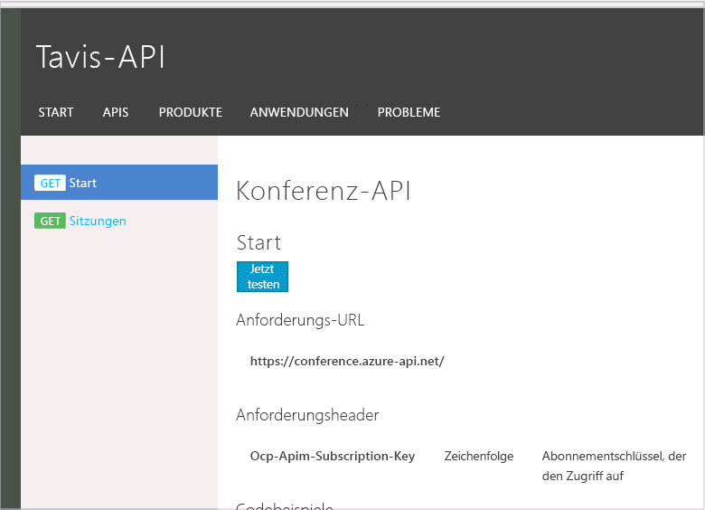

<properties
    pageTitle="Überwachen von APIs mit Azure API Management, Event Hubs und Runscope"
    description="Beispielanwendung zur Veranschaulichung der log-to-eventhub-Richtlinie, indem Azure API Management, Azure Event Hubs und Runscope für die HTTP-Protokollierung und -Überwachung verbunden werden."
    services="api-management"
    documentationCenter=""
    authors="darrelmiller"
    manager=""
    editor=""/>

<tags
    ms.service="api-management"
    ms.workload="mobile"
    ms.tgt_pltfrm="na"
    ms.devlang="dotnet"
    ms.topic="article"
    ms.date="02/19/2016"
    ms.author="v-darmi"/>

# Überwachen von APIs mit Azure API Management, Event Hubs und Runscope

Für den [API Management-Dienst](api-management-key-concepts.md) werden viele Funktionen bereitgestellt, mit denen die Verarbeitung von HTTP-Anforderungen verbessert werden kann, die an Ihre HTTP-API gesendet werden. Die Anforderungen und Antworten sind aber nur vorübergehend vorhanden. Die Anforderung wird ausgeführt und fließt durch den API Management-Dienst an Ihre Back-End-API. Ihre API verarbeitet die Anforderung, und eine Antwort fließt zurück an den API-Consumer. Der API Management-Dienst führt einige wichtige Statistiken zu den APIs für die Anzeige im Herausgeberportal-Dashboard, aber darüber hinaus gehen die Details verloren.

Mithilfe der [Richtlinie](api-management-howto-policies.md) [log-to-eventhub](https://msdn.microsoft.com/library/azure/dn894085.aspx#log-to-eventhub) im API Management-Dienst können Sie alle Details der Anforderung und Antwort an einen [Azure Event Hub](../event-hubs/event-hubs-what-is-event-hubs.md) senden. Es gibt zahlreiche Gründe, warum es hilfreich sein kann, Ereignisse aus HTTP-Nachrichten zu generieren, die an Ihre APIs gesendet werden. Beispiele hierfür sind der Überwachungspfad für Updates, Nutzungsanalysen, Warnungen zu Ausnahmen und Drittanbieterintegrationen.

In diesem Artikel wird veranschaulicht, wie Sie die gesamte HTTP-Nachricht mit Anforderung und Antwort erfassen, an den Event Hub senden und diese Nachricht dann an einen Drittanbieterdienst weiterleiten, über den die HTTP-Protokollierung und -Überwachung bereitgestellt wird.

## Gründe für das Senden über den API Management-Dienst
Es ist möglich, HTTP-Middleware zu schreiben, die als „Plug-In“ für HTTP-API-Frameworks dient. Hiermit können HTTP-Anforderungen und -Antworten erfasst und in Protokollierungs- und Überwachungssysteme eingespeist werden. Der Nachteil bei diesem Ansatz besteht darin, dass die HTTP-Middleware in die Back-End-API integriert sein und mit der Plattform der API übereinstimmen muss. Falls mehrere APIs vorhanden sind, muss die Middleware von jeder API bereitgestellt werden. Häufig liegen Gründe vor, warum Back-End-APIs nicht aktualisiert werden können.

Indem der Azure API Management-Dienst zum Integrieren in die Protokollierungsinfrastruktur verwendet wird, wird eine zentralisierte und plattformunabhängige Lösung bereitgestellt. Diese ist aufgrund der Funktionen für die [Georeplikation](api-management-howto-deploy-multi-region.md) von Azure API Management außerdem teilweise skalierbar.

## Gründe für das Senden an einen Azure Event Hub
Es ist eine berechtigte Frage, warum eine Richtlinie speziell für Azure Event Hubs erstellt werden soll. Es gibt viele unterschiedliche Orte, wo Anforderungen protokolliert werden können. Warum können die Anforderungen nicht einfach direkt an das endgültige Ziel gesendet werden? Das ist eine Option. Wenn Protokollierungsanforderungen aber über einen API Management-Dienst durchgeführt werden, muss berücksichtigt werden, wie sich Protokollierungsnachrichten auf die Leistung der API auswirken. Einem allmählichen Auslastungsanstieg kann begegnet werden, indem vermehrt verfügbare Instanzen von Systemkomponenten bereitgestellt werden oder indem die Georeplikation eingesetzt wird. Kurzzeitige Spitzen beim Datenverkehr können aber dazu führen, dass Anforderungen erheblich verzögert werden, wenn sich die Geschwindigkeit von Anforderungen an die Protokollierungsinfrastruktur bei höherer Auslastung verringert.

Azure Event Hubs sind für die Aufnahme riesiger Datenvolumen ausgelegt und verfügen – im Vergleich zur Anzahl von HTTP-Anforderungen, die von den meisten APIs verarbeitet wird – über Kapazität zur Verarbeitung einer weit höheren Zahl von Ereignissen. Der Event Hub fungiert wie eine Art anspruchsvoller Puffer zwischen Ihrem API Management-Dienst und der Infrastruktur, von der die Nachrichten gespeichert und verarbeitet werden. So wird sichergestellt, dass Ihre API-Leistung aufgrund der Protokollierungsinfrastruktur nicht beeinträchtigt wird.

Nachdem die Daten an einen Event Hub übergeben wurden, werden sie beibehalten und warten auf ihre Verarbeitung durch Event Hub-Consumer. Für den Event Hub ist es nicht wichtig, wie die Verarbeitung erfolgt. Er stellt lediglich sicher, dass die Nachricht erfolgreich zugestellt wird.

Für Event Hubs ist es möglich, Ereignisse an mehrere Consumergruppen zu streamen. So können Ereignisse von komplett unterschiedlichen Systemen verarbeitet werden. Dies ermöglicht die Unterstützung vieler Integrationsszenarien, ohne die Verarbeitung der API-Anforderung im API Management-Dienst mit weiteren Verzögerungen zu belasten, da nur ein Ereignis generiert werden muss.

## Richtlinie zum Senden von Anwendungs-/HTTP-Nachrichten
Ein Event Hub akzeptiert Ereignisdaten als einfache Zeichenfolge. Der Inhalt dieser Zeichenfolge bleibt vollständig Ihnen überlassen. Um eine HTTP-Anforderung verpacken und an Event Hubs senden zu können, müssen wir die Zeichenfolge mit den Informationen zur Anforderung/Antwort formatieren. Wenn in diesen Fällen ein Format vorhanden ist, das wir wiederverwenden können, müssen wir ggf. nicht unseren eigenen Analysecode schreiben. Zuerst wurde erwägt, [HAR](http://www.softwareishard.com/blog/har-12-spec/) zum Senden von HTTP-Anforderungen und -Antworten zu verwenden. Dieses Format ist zum Speichern einer Sequenz von HTTP-Anforderungen in einem JSON-basierten Format optimiert. Es enthält eine Reihe von obligatorischen Elementen, die für das Szenario zum Übergeben der HTTP-Nachricht per Übertragung mit unnötiger Komplexität verbunden ist.

Eine alternative Option ist die Verwendung des Medientyps `application/http`, wie in der HTTP-Spezifikation [RFC 7230](http://tools.ietf.org/html/rfc7230) beschrieben. Für diesen Medientyp wird genau das gleiche Format genutzt, das zum tatsächlichen Übertragen von HTTP-Nachrichten verwendet wird, aber die gesamte Nachricht kann in den Textkörper einer anderen HTTP-Anforderung eingefügt werden. In unserem Fall verwenden wir lediglich den Textkörper als Nachricht zum Senden an Event Hubs. Glücklicherweise ist in [Microsoft ASP.NET Web API 2.2-Client](https://www.nuget.org/packages/Microsoft.AspNet.WebApi.Client/)-Bibliotheken ein Parser vorhanden, mit dem dieses Format analysiert und in systemeigene `HttpRequestMessage`- und `HttpResponseMessage`-Objekte konvertiert werden kann.

Zum Erstellen dieser Nachricht müssen wir die C#-basierten [Richtlinienausdrücke](https://msdn.microsoft.com/library/azure/dn910913.aspx) in Azure API Management verwenden. Dies ist die Richtlinie, mit der eine HTTP-Anforderungsnachricht an Azure Event Hubs gesendet wird.

       <log-to-eventhub logger-id="conferencelogger" partition-id="0">
       @{
           var requestLine = string.Format("{0} {1} HTTP/1.1\r\n",
                                                       context.Request.Method,
                                                       context.Request.Url.Path + context.Request.Url.QueryString);

           var body = context.Request.Body?.As<string>(true);
           if (body != null && body.Length > 1024)
           {
               body = body.Substring(0, 1024);
           }

           var headers = context.Request.Headers
                                  .Where(h => h.Key != "Authorization" && h.Key != "Ocp-Apim-Subscription-Key")
                                  .Select(h => string.Format("{0}: {1}", h.Key, String.Join(", ", h.Value)))
                                  .ToArray<string>();

           var headerString = (headers.Any()) ? string.Join("\r\n", headers) + "\r\n" : string.Empty;

           return "request:"   + context.Variables["message-id"] + "\n"
                               + requestLine + headerString + "\r\n" + body;
       }
       </log-to-eventhub>

### Richtliniendeklaration
Zu diesem Richtlinienausdruck gibt es einige Anmerkungen. Die log-to-eventhub-Richtlinie verfügt über das Attribut „logger-id“, mit dem auf den Namen des Protokollierungstools verwiesen wird, das im API Management-Dienst erstellt wurde. Die Details zur Einrichtung eines Event Hub-Protokollierungstools im API Management-Dienst finden Sie im Dokument [Protokollieren von Ereignissen in Azure Event Hubs mit Azure API Management](api-management-howto-log-event-hubs.md). Das zweite Attribut ist ein optionaler Parameter, mit dem Event Hubs angewiesen werden, unter welcher Partition die Nachricht gespeichert werden soll. Event Hubs verwenden Partitionen zum Aktivieren der Skalierbarkeit, und es sind immer mindestens zwei Partitionen erforderlich. Die geordnete Zustellung von Nachrichten ist nur innerhalb einer Partition garantiert. Wenn wir Event Hub nicht anweisen, in welcher Partition die Nachricht angeordnet werden soll, wird zum Verteilen der Auslastung ein Roundrobin-Algorithmus verwendet. Dies kann aber dazu führen, dass einige Nachrichten außerhalb der Reihe verarbeitet werden.

### Partitionen
Um sicherzustellen, dass unsere Nachrichten in der richtigen Reihenfolge an Consumer geliefert werden, und die Funktionen zur Lastverteilung von Partitionen zu nutzen, habe ich mich dafür entschieden, HTTP-Anforderungsnachrichten an eine Partition und HTTP-Antwortnachrichten an eine zweite Partition zu senden. So wird eine gleichmäßige Lastverteilung sichergestellt, und wir können garantieren, dass alle Anforderungen und auch alle Antworten in der richtigen Reihenfolge verarbeitet werden. Es kann passieren, dass eine Antwort vor der entsprechenden Anforderung verarbeitet wird. Dies ist aber kein Problem, weil ein anderer Mechanismus zum Korrelieren von Anforderungen mit Antworten vorhanden ist und wir wissen, dass Anforderungen immer vor Antworten kommen.

### HTTP-Nutzlasten
Nach der Erstellung von `requestLine` überprüfen wir, ob der Anforderungstext abgeschnitten werden muss. Der Anforderungstext wird auf 1024 Zeichen abgeschnitten. Dieser Wert kann auch erhöht werden. Da einzelne Event Hub-Nachrichten aber auf 256 KB beschränkt sind, kann es sein, dass einige HTTP-Nachrichtentexte nicht in eine einzelne Nachricht passen. Bei der Protokollierung und Analyse lässt sich nur aus HTTP-Anforderungszeilen und -Headern eine beträchtliche Menge an Daten ableiten. Außerdem geben viele API-Anforderungen nur kleine Textkörper zurück. Daher ist der Verlust des Informationswerts durch das Abschneiden großer Textkörper im Vergleich zur Reduzierung des Aufwands für die Übertragung, Verarbeitung und Speicherung für die Beibehaltung des gesamten Textkörperinhalts relativ gering. Ein letzter Hinweis zur Verarbeitung des Textkörpers: Wir müssen `true` an die As<string>()-Methode übergeben, weil wir die Textkörperinhalte lesen, aber wir möchten auch, dass die Back-End-API den Text lesen kann. Indem wir „true“ an diese Methode übergeben, erreichen wir, dass der Text gepuffert wird. Er kann dann ein zweites Mal gelesen werden. Es ist wichtig, dass Ihnen dies bewusst ist, wenn Sie eine API nutzen, mit der sehr große Dateien hochgeladen werden oder für die lange Abrufvorgänge verwendet werden. In diesen Fällen wäre es am besten, das Lesen des Texts ganz zu vermeiden.

### HTTP-Header
HTTP-Header können einfach in das Nachrichtenformat übertragen werden (in einem einfachen Schlüssel-Wert-Paar-Format). Wir haben uns dafür entschieden, bestimmte sicherheitsrelevante Felder wegzulassen, um das unnötige Offenlegen von vertraulichen Informationen zu vermeiden. Es ist unwahrscheinlich, dass API-Schlüssel und andere Anmeldeinformationen zu Analysezwecken verwendet werden. Wenn wir eine Analyse des Benutzers und des jeweils verwendeten Produkts durchführen möchten, können wir diese Daten über das `context`-Objekt ermitteln und der Nachricht hinzufügen.
### Metadaten von Nachrichten
Bei der Erstellung der vollständigen Nachricht für das Senden an den Event Hub ist die erste Zeile nicht Bestandteil der `application/http`-Nachricht. Die erste Zeile umfasst zusätzliche Metadaten. Hiermit wird angegeben, ob die Nachricht eine Anforderungs- oder Antwortnachricht ist, und eine Nachrichten-ID wird verwendet, um Anforderungen und Antworten zu korrelieren. Die Nachrichten-ID wird mit einer anderen Richtlinie erstellt, die wie folgt aussieht:

    <set-variable name="message-id" value="@(Guid.NewGuid())" />

Wir hätten die Anforderungsnachricht erstellen und in einer Variablen speichern können, bis die Antwort zurückgegeben wird, und die Anforderung und Antwort dann einfach als einzelne Nachricht senden können. Aber wenn die Anforderung und die Antwort unabhängig voneinander gesendet werden und zum Korrelieren eine Nachrichten-ID verwendet wird, erhalten wir etwas mehr Flexibilität bei der Nachrichtengröße. Wir können mehrere Partitionen nutzen – unter Beibehaltung der Nachrichtenreihenfolge –, und die Anforderung wird in unserem Dashboard für die Protokollierung früher angezeigt. Es kann auch Fälle geben, in denen eine gültige Antwort niemals an den Event Hub gesendet wird, weil im API Management-Dienst unter Umständen ein schwerwiegender Fehler aufgetreten ist. Wir verfügen dann aber über einen Nachweis über die Anforderung.

Die Richtlinie zum Senden der HTTP-Antwortnachricht ähnelt der Anforderung, und die vollständige Richtlinienkonfiguration sieht wie folgt aus:

      <policies>
      	<inbound>
      		<set-variable name="message-id" value="@(Guid.NewGuid())" />
      		<log-to-eventhub logger-id="conferencelogger" partition-id="0">
              @{
                  var requestLine = string.Format("{0} {1} HTTP/1.1\r\n",
                                                              context.Request.Method,
                                                              context.Request.Url.Path + context.Request.Url.QueryString);

                  var body = context.Request.Body?.As<string>(true);
                  if (body != null && body.Length > 1024)
                  {
                      body = body.Substring(0, 1024);
                  }

                  var headers = context.Request.Headers
                                       .Where(h => h.Key != "Authorization" && h.Key != "Ocp-Apim-Subscription-Key")
                                       .Select(h => string.Format("{0}: {1}", h.Key, String.Join(", ", h.Value)))
                                       .ToArray<string>();

                  var headerString = (headers.Any()) ? string.Join("\r\n", headers) + "\r\n" : string.Empty;

                  return "request:"   + context.Variables["message-id"] + "\n"
                                      + requestLine + headerString + "\r\n" + body;
              }
          </log-to-eventhub>
      	</inbound>
      	<backend>
      		<forward-request follow-redirects="true" />
      	</backend>
      	<outbound>
      		<log-to-eventhub logger-id="conferencelogger" partition-id="1">
              @{
                  var statusLine = string.Format("HTTP/1.1 {0} {1}\r\n",
                                                      context.Response.StatusCode,
                                                      context.Response.StatusReason);

                  var body = context.Response.Body?.As<string>(true);
                  if (body != null && body.Length > 1024)
                  {
                      body = body.Substring(0, 1024);
                  }

                  var headers = context.Response.Headers
                                                  .Select(h => string.Format("{0}: {1}", h.Key, String.Join(", ", h.Value)))
                                                  .ToArray<string>();

                  var headerString = (headers.Any()) ? string.Join("\r\n", headers) + "\r\n" : string.Empty;

                  return "response:"  + context.Variables["message-id"] + "\n"
                                      + statusLine + headerString + "\r\n" + body;
             }
          </log-to-eventhub>
      	</outbound>
      </policies>

Mit der Richtlinie `set-variable` wird ein Wert erstellt, auf den von der Richtlinie `log-to-eventhub` sowohl im Abschnitt `<inbound>` als auch im Abschnitt `<outbound>` zugegriffen werden kann.

## Empfangen von Ereignissen von Event Hubs
Ereignisse von Azure Event Hub werden über das [AMQP-Protokoll](http://www.amqp.org/) empfangen. Das Microsoft Service Bus-Team hat Clientbibliotheken bereitgestellt, um die Nutzung von Ereignissen zu vereinfachen. Es werden zwei unterschiedliche Ansätze unterstützt: einer mit einem *Direkten Consumer* und ein anderer mit Verwendung der `EventProcessorHost`-Klasse. Beispiele für diese beiden Ansätze finden Sie im [Programmierleitfaden für Event Hubs](../event-hubs/event-hubs-programming-guide.md). Kurz lassen sich die Unterschiede wie folgt beschreiben: Mit `Direct Consumer` haben Sie die volle Kontrolle, und `EventProcessorHost` übernimmt einige technische Aufgaben für Sie, aber hierbei werden auch einige Annahmen darüber getroffen, wie Sie diese Ereignisse verarbeiten.

### EventProcessorHost
In diesem Beispiel verwenden wir der Einfachheit halber `EventProcessorHost`, auch wenn dies hierfür nicht unbedingt die beste Wahl ist. Nur mit `EventProcessorHost` wird sichergestellt, dass Sie sich über Threadingprobleme in einer bestimmten Ereignisprozessorklasse keine Sorgen machen müssen. In unserem Szenario konvertieren wir die Nachricht aber einfach in ein anderes Format und übergeben sie mit einer asynchronen Methode an einen anderen Dienst. Es ist nicht erforderlich, den freigegebenen Zustand zu aktualisieren, und daher besteht in Bezug auf Threadingprobleme kein Risiko. In den meisten Fällen ist `EventProcessorHost` wahrscheinlich die beste Wahl, und es ist sicherlich die einfachere Option.

### IEventProcessor
Das zentrale Konzept beim Verwenden von `EventProcessorHost` ist die Erstellung einer Implementierung der `IEventProcessor`-Schnittstelle, in der die `ProcessEventAsync`-Methode enthalten ist. Der wesentliche Teil dieser Methode ist hier dargestellt:

  async Task IEventProcessor.ProcessEventsAsync(PartitionContext context, IEnumerable<EventData> messages) {

           foreach (EventData eventData in messages)
           {
               _Logger.LogInfo(string.Format("Event received from partition: {0} - {1}", context.Lease.PartitionId,eventData.PartitionKey));

               try
               {
                   var httpMessage = HttpMessage.Parse(eventData.GetBodyStream());
                   await _MessageContentProcessor.ProcessHttpMessage(httpMessage);
               }
               catch (Exception ex)
               {
                   _Logger.LogError(ex.Message);
               }
           }
            ... checkpointing code snipped ...
        }

Eine Liste mit EventData-Objekten wird an die Methode übergeben, und diese Liste wird dann durchlaufen. Die Bytes jeder einzelnen Methode werden in ein HttpMessage-Objekt analysiert, und dieses Objekt wird an eine Instanz von IHttpMessageProcessor übergeben.

### HttpMessage
Die `HttpMessage`-Instanz enthält drei Datenelemente:

      public class HttpMessage
       {
           public Guid MessageId { get; set; }
           public bool IsRequest { get; set; }
           public HttpRequestMessage HttpRequestMessage { get; set; }
           public HttpResponseMessage HttpResponseMessage { get; set; }

        ... parsing code snipped ...

      }

Die `HttpMessage`-Instanz enthält eine `MessageId`-GUID, die uns für die HTTP-Anforderung das Herstellen einer Verbindung mit der entsprechenden HTTP-Antwort ermöglicht, sowie einen booleschen Wert zum Identifizieren, ob das Objekt eine Instanz von HttpRequestMessage und HttpResponseMessage enthält. Indem die integrierten HTTP-Klassen aus `System.Net.Http` verwendet wurden, konnte der `application/http`-Analysecode genutzt werden, der in `System.Net.Http.Formatting` enthalten ist.

### IHttpMessageProcessor
Die `HttpMessage`-Instanz wird dann an die Implementierung von `IHttpMessageProcessor` weitergeleitet. Diese Schnittstelle habe ich erstellt, um den Empfang und die Interpretation des Ereignisses aus Azure Event Hub von der eigentlichen Verarbeitung abzukoppeln.

## Weiterleiten der HTTP-Meldung
Für dieses Beispiel habe ich entschieden, dass es interessant wäre, die HTTP-Anforderung auf [Runscope](http://www.runscope.com) zu verschieben. Runscope ist ein cloudbasierter Dienst, der für HTTP-Debuggen, Protokollierung und Überwachung ausgelegt ist. Es gibt einen Free-Tarif, sodass der Dienst problemlos ausprobiert werden kann. Wir können verfolgen, wie die HTTP-Anforderungen in Echtzeit durch den API Management-Dienst fließen.

Die `IHttpMessageProcessor`-Implementierung sieht wie folgt aus:

      public class RunscopeHttpMessageProcessor : IHttpMessageProcessor
       {
           private HttpClient _HttpClient;
           private ILogger _Logger;
           private string _BucketKey;
           public RunscopeHttpMessageProcessor(HttpClient httpClient, ILogger logger)
           {
               _HttpClient = httpClient;
               var key = Environment.GetEnvironmentVariable("APIMEVENTS-RUNSCOPE-KEY", EnvironmentVariableTarget.User);
               _HttpClient.DefaultRequestHeaders.Authorization = new AuthenticationHeaderValue("bearer", key);
               _HttpClient.BaseAddress = new Uri("https://api.runscope.com");
               _BucketKey = Environment.GetEnvironmentVariable("APIMEVENTS-RUNSCOPE-BUCKET", EnvironmentVariableTarget.User);
               _Logger = logger;
           }

           public async Task ProcessHttpMessage(HttpMessage message)
           {
               var runscopeMessage = new RunscopeMessage()
               {
                   UniqueIdentifier = message.MessageId
               };

               if (message.IsRequest)
               {
                   _Logger.LogInfo("Sending HTTP request " + message.MessageId.ToString());
                   runscopeMessage.Request = await RunscopeRequest.CreateFromAsync(message.HttpRequestMessage);
               }
               else
               {
                   _Logger.LogInfo("Sending HTTP response " + message.MessageId.ToString());
                   runscopeMessage.Response = await RunscopeResponse.CreateFromAsync(message.HttpResponseMessage);
               }

               var messagesLink = new MessagesLink() { Method = HttpMethod.Post };
               messagesLink.BucketKey = _BucketKey;
               messagesLink.RunscopeMessage = runscopeMessage;
               var runscopeResponse = await _HttpClient.SendAsync(messagesLink.CreateRequest());
               _Logger.LogDebug("Request sent to Runscope");
           }
       }

Ich konnte eine [vorhandene Clientbibliothek für Runscope](http://www.nuget.org/packages/Runscope.net.hapikit/0.9.0-alpha) nutzen, mit der `HttpRequestMessage`- und `HttpResponseMessage`-Instanzen problemlos in den Dienst verschoben werden können. Zum Zugreifen auf die Runscope-API benötigen Sie ein Konto und einen API-Schlüssel. Eine Anleitung zum Beschaffen eines API-Schlüssels finden Sie im Screencast [Erstellen von Anwendungen zum Zugreifen auf die Runscope-API](http://blog.runscope.com/posts/creating-applications-to-access-the-runscope-api).

## Vollständiges Beispiel
Den [Quellcode](https://github.com/darrelmiller/ApimEventProcessor) und die Tests für das Beispiel finden Sie bei GitHub. Sie benötigen einen [API Management-Dienst](api-management-get-started.md), [einen verbundenen Event Hub](api-management-howto-log-event-hubs.md) und ein [Speicherkonto](../storage/storage-create-storage-account.md), um das Beispiel selbst auszuführen.

Das Beispiel ist nur eine einfache Konsolenanwendung, die auf Ereignisse vom Event Hub lauscht, diese in ein `HttpRequestMessage`- und `HttpResponseMessage`-Objekt konvertiert und sie dann an die Runscope-API weiterleitet.

Im folgenden animierten Bild sehen Sie, wie eine Anforderung an eine API im Entwicklerportal gestellt wird, den Empfang, die Verarbeitung und die Weiterleitung in der Konsolenanwendung und dann die Anzeige der Anforderung und Antwort im Runscope Traffic Inspector.

## Zusammenfassung
Der Azure API Management-Dienst ist ein idealer Ort zum Erfassen des HTTP-Datenverkehrs, der an Ihre APIs fließt und von den APIs gesendet wird. Azure Event Hubs ist eine hoch skalierbare, kostengünstige Lösung zum Erfassen dieses Datenverkehrs und zum Bereitstellen für sekundäre Verarbeitungssysteme für die Protokollierung und Überwachung sowie andere anspruchsvolle Analysevorgänge. Das Verbinden mit Datenverkehr-Überwachungssystemen von Drittanbietern wie Runscope ist so einfach wie das Schreiben einiger Dutzend Codezeilen.

## Nächste Schritte
-	Weitere Informationen zu Azure Event Hubs
	-	[Erste Schritte mit Azure Event Hubs](../event-hubs/event-hubs-csharp-ephcs-getstarted.md)
	-	[Empfangen von Nachrichten mit EventProcessorHost](../event-hubs/event-hubs-csharp-ephcs-getstarted.md#receive-messages-with-eventprocessorhost)
	-	[Programmierleitfaden für Event Hubs](../event-hubs/event-hubs-programming-guide.md)
-	Erfahren Sie mehr über die Integration der API-Verwaltung und Event Hubs
	-	[Protokollieren von Ereignissen in Azure Event Hubs mit Azure API Management](api-management-howto-log-event-hubs.md)
	-	[Verweis zu Protokollierungstool](https://msdn.microsoft.com/library/azure/mt592020.aspx)
	-	[log-to-eventhub policy reference](https://msdn.microsoft.com/library/azure/dn894085.aspx#log-to-eventhub)
	

<!---HONumber=AcomDC_0302_2016-->