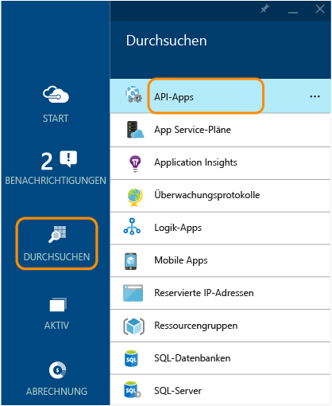
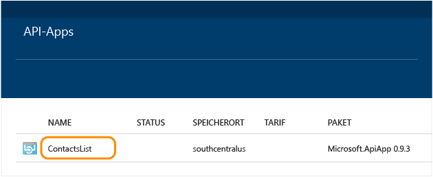
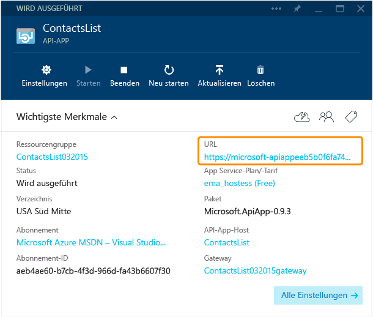
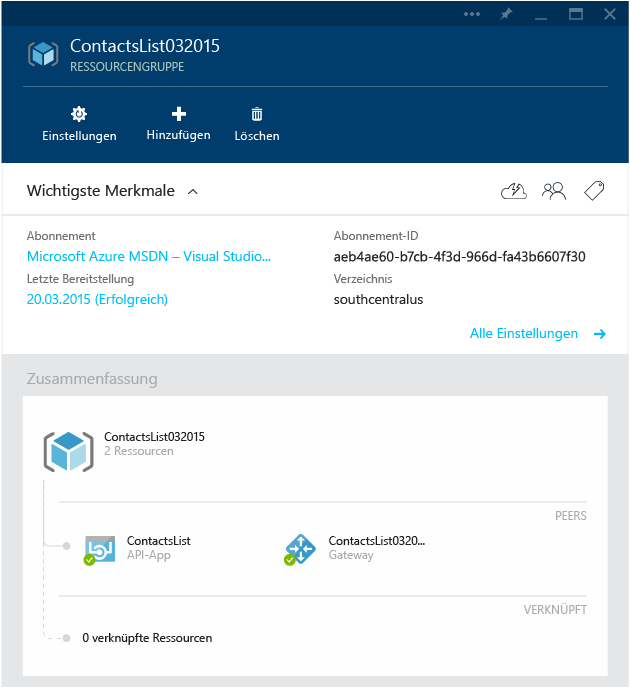
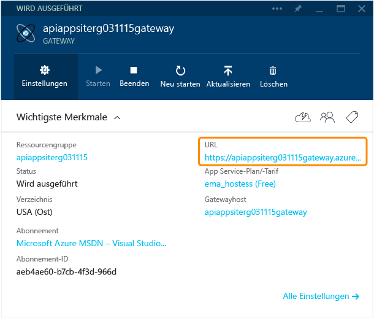
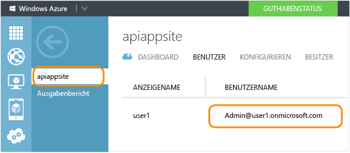
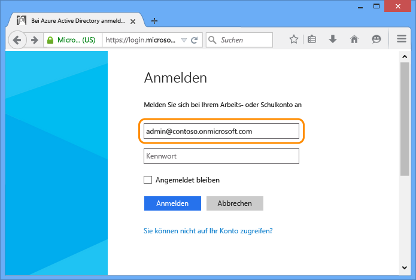
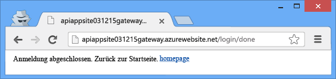

<properties 
	pageTitle="Schützen einer Azure API-App" 
	description="Erfahren Sie, wie Sie eine Azure API-App mithilfe von Visual Studio schützen." 
	services="app-service\api" 
	documentationCenter=".net" 
	authors="tdykstra" 
	manager="wpickett" 
	editor="jimbe"/>

<tags 
	ms.service="app-service-api" 
	ms.workload="web" 
	ms.tgt_pltfrm="dotnet" 
	ms.devlang="na" 
	ms.topic="article" 
	ms.date="06/26/2015" 
	ms.author="tdykstra"/>

# Schützen einer API-App: Hinzufügen der Authentifizierung über Azure Active Directory oder ein soziales Netzwerk

## Übersicht

Dieses Lernprogramm zeigt, wie Sie eine API-App schützen, sodass nur authentifizierte Benutzer darauf zugreifen können. In diesem Lernprogramm wird außerdem der Code gezeigt, den Sie in einer ASP.NET-API-App zum Abrufen von Informationen über den angemeldeten Benutzer verwenden können.

Sie führen die folgenden Schritte aus:

- Aufrufen der API-App, um deren Funktionalität sicherzustellen
- Anwenden von Authentifizierungsregeln auf die API-App
- Erneutes Aufrufen der API-App, um sicherzustellen, dass nicht authentifizierte Anforderungen abgelehnt werden
- Anmelden beim konfigurierten Anbieter
- Erneutes Aufrufen der API-App, um sicherzustellen, dass der authentifizierte Zugriff funktioniert
- Schreiben und testen Sie Code, der Ansprüchen für den angemeldeten Benutzer abruft.

Weitere Informationen zur Authentifizierung in Azure App Service finden Sie unter [Authentifizierung für API-Apps und mobile Apps in Azure App Service](../app-service/app-service-authentication-overview.md).

## Voraussetzungen

In diesem Lernprogramm wird die API-App verwendet, die Sie in [Erstellen einer API-App](app-service-dotnet-create-api-app.md) erstellt und in [Bereitstellen einer API-App](app-service-dotnet-deploy-api-app.md) bereitgestellt haben.

## Verwenden des Browsers zum Aufrufen der API-App 

Die einfachste Möglichkeit zu prüfen, ob Ihre API-App öffentlich zugänglich ist, besteht darin, sie über einen Browser aufzurufen.

1. Wechseln Sie in Ihrem Browser zum [Azure-Vorschauportal].

3. Klicken Sie auf der Startseite auf **Durchsuchen > API-Apps**, und klicken Sie dann auf den Namen der API-App, die Sie schützen möchten.

	

	

3. Klicken Sie auf dem Blatt **API-App** auf **URL**, um ein Browserfenster zu öffnen, in dem Ihre API-App aufgerufen wird.

	

2. Hängen Sie in der Adressleiste des Browsers `/api/contacts/get/` an die URL.

	Angenommen, die URL Ihrer API-App lautet folgendermaßen:

    	https://microsoft-apiappeeb5bdsasd744e188be7fa26f239bd4b.azurewebsites.net/

	Dann lautet die vollständige URL so:

    	https://microsoft-apiappeeb5bdsasd744e188be7fa26f239bd4b.azurewebsites.net/api/contacts/get/

	Die verschiedenen Browser verarbeiten API-Aufrufe unterschiedlich. Nachstehend wird ein erfolgreicher Aufruf über einen Chrome-Browser gezeigt.

	

2. Speichern Sie die verwendete URL; Sie werden sie später in diesem Lernprogramm erneut verwenden.

## Schützen der API-App

Als Sie Ihre API-App bereitgestellt haben, ist die Bereitstellung als Bestandteil einer Ressourcengruppe erfolgt. Sie können Web-Apps und andere API-Apps zur selben Ressourcengruppe hinzufügen, und jede API-App innerhalb der Ressourcengruppe kann eine von drei Zugriffseinstellungen verwenden: <!--todo: diagram showing different accessibility settings-->

- **Öffentlich (anonym)** – Beliebige Benutzer können die API-App von außerhalb der Ressourcengruppe und ohne Anmeldung aufrufen.
- **Öffentlich (authentifiziert)** – Nur authentifizierte Benutzer können die API-App von außerhalb der Ressourcengruppe aufrufen.
- **Intern** – Nur andere API-Apps oder Web-Apps in derselben Ressourcengruppe dürfen die API-App aufrufen. (Aufrufe von Web-Apps werden als extern betrachtet, selbst wenn sich die Web-Apps in derselben Ressourcengruppe befinden.)

Als Visual Studio die Ressourcengruppe für Sie erstellt hat, wurde auch ein *Gateway* erstellt. Ein Gateway ist eine spezielle Web-App, die alle Anforderungen verarbeitet, die an API-Apps in der Ressourcengruppe gerichtet sind.

Wenn Sie im [Azure-Vorschauportal] zum Blatt für die Ressourcengruppe wechseln, können Sie Ihre API-App und das Gateway im Diagramm anzeigen.

### Konfigurieren der API-App zum Verwenden der Authentifizierung

Um Ihre API-App so zu konfigurieren, dass nur authentifizierte Anforderungen akzeptiert werden, legen Sie den Zugriff **Öffentlich (authentifiziert)** fest. Anschließend konfigurieren Sie das Gateway für eine Authentifizierung über einen Anbieter wie Azure Active Directory, Google oder Facebook.

[AZURE.INCLUDE [app-service-api-config-auth](../../includes/app-service-api-config-auth.md)]

Ihre API-App ist jetzt vor einem nicht authentifizierten Zugriff geschützt. Als Nächstes müssen Sie das Gateway konfigurieren, um den Authentifizierungsanbieter anzugeben.

### Konfigurieren des Gateways zum Verwenden eines Authentifizierungsanbieters

[AZURE.INCLUDE [app-service-api-gateway-config-auth](../../includes/app-service-api-gateway-config-auth.md)]

## Sicherstellen, dass die Authentifizierung funktioniert

**Hinweis:** Wenn Sie beim Ausführen der folgenden Schritte Probleme bei der Anmeldung haben, öffnen Sie ein Browserfenster im privaten oder im Inkognito-Modus.
 
1. Öffnen Sie ein Browserfenster, und geben Sie in der Adressleiste die URL ein, mit der (wie zuvor) die `Get`-Methode Ihrer API-App aufgerufen wird.

	Dieses Mal führt der Zugriffsversuch auf die API-App zu einer Fehlermeldung.

	

2. Wechseln Sie im Browser zur Anmelde-URL. Die URL folgt diesem Muster:

    	http://[gatewayurl]/login/[providername]

	Sie können die Gateway-URL aus dem Blatt **Gateway** im [Azure-Vorschauportal] abrufen. (Sie gelangen zum Blatt **Gateway**, indem Sie auf dem Blatt **Ressourcengruppe** auf das Gateway im angezeigten Diagramm klicken.)

	

	Für [providername] muss einer der folgenden Werte verwendet werden:
	
	* "microsoftaccount"
	* "facebook"
	* "twitter"
	* "google"
	* "aad"

	Nachfolgend wird eine beispielhafte Anmelde-URL für Azure Active Directory gezeigt:

		https://dropboxrgaeb4ae60b7cb4f3d966dfa43.azurewebsites.net/login/aad/

	Beachten Sie, dass im Gegensatz zur vorherigen URL der Name der API-App nicht enthalten ist: das Gateway authentifiziert Sie, nicht die API-App. Das Gateway übernimmt die Authentifizierung für alle API-Apps in der Ressourcengruppe.

3. Geben Sie Ihre Anmeldeinformationen ein, wenn der Browser eine Anmeldeseite anzeigt.
 
	Wenn Sie die Azure Active Directory-Anmeldung konfiguriert haben, verwenden Sie einen der auf der Registerkarte **Benutzer** aufgeführten Benutzer für die Anwendung, die Sie auf der Registerkarte "Azure Active Directory" im [Azure-Portal] erstellt haben, z. B. admin@contoso.onmicrosoft.com.

	

	

4. Wenn die Meldung "Anmeldung abgeschlossen" angezeigt wird, geben Sie erneut die URL zur Get-Methode Ihrer API-App ein.

	Nun, da Sie authentifiziert wurden, ist der Aufruf erfolgreich. Das Gateway erkennt, dass Sie ein authentifizierter Benutzer sind, und übergibt Ihre Anforderung an die API-App.

	

	

	Wenn Sie die Swagger-Benutzeroberfläche aktiviert haben, können Sie jetzt auch zur Seite mit der Swagger-Benutzeroberfläche wechseln. Allerdings sehen Sie rechts unten auf der Seite ein rotes **FEHLER**-Symbol. Wenn Sie auf das Symbol klicken, wird die Meldung eingeblendet, dass auf die JSON-Datei von Swagger nicht zugegriffen werden kann. Dies erfolgt, weil Swagger beim Versuch, die JSON-Datei abzurufen, einen AJAX-Aufruf ausführt, ohne das Zumo-Token einzubeziehen. Dies verhindert, dass die Seite mit der Swagger-Benutzeroberfläche funktioniert.

## Verwenden von Postman zum Senden einer Post-Anforderung

Wenn Sie sich am Gateway anmelden, gibt das Gateway ein Authentifizierungstoken zurück. Dieses Token muss in alle Anforderungen von externen Quellen eingeschlossen werden, die über das Gateway erfolgen. Wenn Sie über einen Browser auf eine API zugreifen, wird das Token typischerweise in einem Cookie gespeichert und zusammen mit allen nachfolgenden Aufrufen an die API gesendet.

Damit Sie sehen, was im Hintergrund geschieht, verwenden Sie in diesem Abschnitt des Lernprogramms ein Browsertool zum Erstellen und Senden einer Post-Anforderung. Anschließend rufen Sie das Autorisierungstoken aus dem Cookie ab und schließen es in einen HTTP-Header ein. Dieser Abschnitt ist optional: Sie haben im vorherigen Abschnitt bereits überprüft, dass die API-App ausschließlich authentifizierte Zugriffe akzeptiert.

Diese Anweisungen zeigen, wie Sie das Postman-Tool im Chrome-Browser verwenden, aber Sie können dieselbe Aufgabe ebenso mit einem beliebigen REST-Clienttool und den Entwicklertools für den Browser durchführen.

1. Durchlaufen Sie in einem Chrome-Browserfenster die im vorherigen Abschnitt gezeigten Schritte zur Authentifizierung, und öffnen Sie dann die Entwicklertools (F12).

	

3. Suchen Sie auf der Registerkarte **Ressourcen** der Chrome-Entwicklertools nach den Cookies für Ihr Gateway, und klicken Sie dreimal auf den für das Cookie **x-zumo-auth**, um alle Informationen auszuwählen.

	**Hinweis:** Stellen Sie sicher, dass Sie den gesamten Cookiewert abrufen. Bei einem Doppelklick wird möglicherweise nur der erste Teil ausgewählt.

5. Klicken Sie mit der rechten Maustaste auf den **Value** für das Cookie **x-zumo-auth**, und klicken Sie dann auf **Kopieren**.

	

4. Sofern noch nicht geschehen, installieren Sie die Postman-Erweiterung in Ihrem Chrome-Browser.

6. Öffnen Sie die Postman-Erweiterung.

7. Geben Sie im Feld für die Anforderungs-URL die URL zur Get-Methode Ihrer API-App ein, die Sie bereits zuvor verwendet haben. Lassen Sie jedoch den Wert `get/` am Ende weg.
 
		http://[apiappurl]/api/contacts
    
8. Klicken Sie auf **Headers**, und fügen Sie einen *x-zumo-auth*-Header hinzu. Fügen Sie den Tokenwert aus der Zwischenablage in das Feld **Value** ein.

9. Fügen Sie einen *Content-Type*-Header mit dem Wert *application/json* hinzu.

10. Klicken Sie auf **form-data**, und fügen Sie einen *contact*-Schlüssel mit dem folgenden Wert hinzu:

		{   "Id": 0,   "Name": "Li Yan",   "EmailAddress": "yan@contoso.com" }

11. Klicken Sie auf "Send".

	Die API-App gibt eine *201 Erstellt*-Antwort zurück.

	

12. Um sicherzustellen, dass diese Anforderung ohne das Authentifizierungstoken nicht funktionieren würde, löschen Sie den Authentifizierungsheader, und klicken Sie erneut auf "Send".

	Sie erhalten eine *403 Verboten*-Antwort.

	

## Abrufen von Informationen zum angemeldeten Benutzer

In diesem Abschnitt ändern Sie den Code in der API-App "ContactsList" so ab, dass der Name und die E-Mail-Adresse des angemeldeten Benutzers abgerufen und zurückgegeben werden.

1. Öffnen Sie in Visual Studio das API-App-Projekt, das Sie in [Bereitstellen einer API-App](app-service-dotnet-deploy-api-app.md) bereitgestellt und für dieses Lernprogramm aufgerufen haben.

3. Öffnen Sie die Datei "apiapp.json", und fügen Sie eine Zeile ein um anzugeben, dass die API-App die Azure Active Directory-Authentifizierung verwendet.

		"authentication": [{"type": "aad"}]

	Die endgültige Version der Datei "apiapp.json" sieht in etwa folgendermaßen aus:

		{
		    "$schema": "http://json-schema.org/schemas/2014-11-01/apiapp.json#",
		    "id": "ContactsList",
		    "namespace": "microsoft.com",
		    "gateway": "2015-01-14",
		    "version": "1.0.0",
		    "title": "ContactsList",
		    "summary": "",
		    "author": "",
		    "endpoints": {
		        "apiDefinition": "/swagger/docs/v1",
		        "status": null
		    },
		    "authentication": [{"type": "aad"}]
		}

	In diesem Lernprogramm wird Azure Active Directory als Beispiel verwendet. Verwenden Sie für andere Anbieter den geeigneten Bezeichner. Nachfolgend finden Sie die gültigen Anbieterwerte:

	* "aad"
	* "microsoftaccount"
	* "google"
	* "twitter"
	* "facebook" 

2. Ersetzen Sie in der Datei *ContactsController.cs* den Code in der `Get`-Methode durch den folgenden Code.

		var runtime = Runtime.FromAppSettings(Request);
		var user = runtime.CurrentUser;
		TokenResult token = await user.GetRawTokenAsync("aad");
		var name = (string)token.Claims["name"];
		var email = (string)token.Claims["http://schemas.xmlsoap.org/ws/2005/05/identity/claims/upn"];
		return new Contact[]
		{
		    new Contact { Id = 1, EmailAddress = email, Name = name }
		};

	Anstelle der drei Beispielkontakte gibt der Code Kontaktinformationen zum angemeldeten Benutzer zurück.

	Im Beispielcode wird Azure Active Directory verwendet. Für andere Anbieter verwenden Sie den geeigneten Tokennamen und Anspruchsbezeichner, wie im vorherigen Schritt gezeigt.

	Informationen zu den verfügbaren Azure Active Directory-Ansprüchen finden Sie unter [Unterstützte Token und Anspruchstypen](https://msdn.microsoft.com/library/dn195587.aspx).

3. Fügen Sie eine using-Anweisung für `Microsoft.Azure.AppService.ApiApps.Service` hinzu.

		using Microsoft.Azure.AppService.ApiApps.Service;

3. Stellen Sie das Projekt erneut bereit.

	Visual Studio hat die Einstellungen der Bereitstellung des Projekts beim Ausführen des Lernprogramms [Bereitstellung](app-service-dotnet-deploy-api-app.md) gespeichert. Klicken Sie mit der rechten Maustaste auf das Projekt, klicken Sie auf **Veröffentlichen**, und klicken Sie dann im Dialogfeld **Im Web veröffentlichen** auf **Veröffentlichen**.

6. Folgen Sie den vorherigen Anweisungen zum Senden einer Get-Anforderung an die geschützte API-App.

	Die Antwortnachricht zeigt den Namen und die ID der Identität, die Sie zur Anmeldung verwendet haben.

	

## Nächste Schritte

Sie haben erfahren, wie Sie eine Azure API-App schützen, indem Sie sie für eine Authentifizierung über Azure Active Directory oder ein soziales Netzwerk konfigurieren. Weitere Informationen finden Sie unter [Authentifizierung für API-Apps und mobile Apps in Azure App Service](../app-service/app-service-authentication-overview.md).

[Azure-Portal]: https://manage.windowsazure.com/
[Azure-Vorschauportal]: https://portal.azure.com/

<!---HONumber=July15_HO4-->