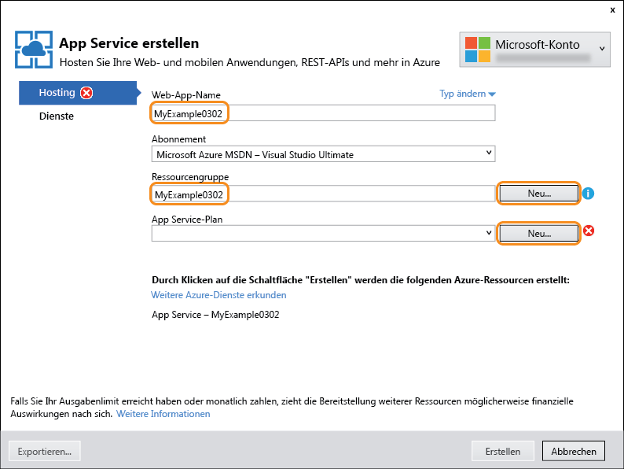
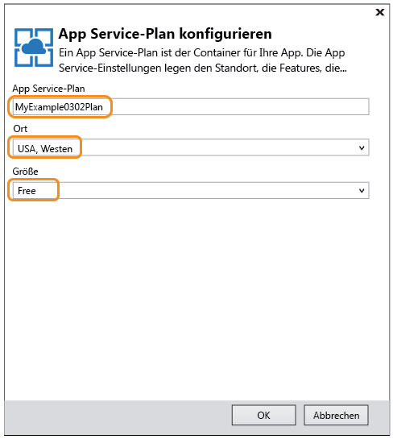

<properties
	pageTitle="Erste Schritte mit API-Apps und ASP.NET in Azure App Service | Microsoft Azure"
	description="Erfahren Sie, wie Sie mit Visual Studio 2015 eine ASP.NET-API-App in Azure App Service erstellen, bereitstellen und nutzen."
	services="app-service\api"
	documentationCenter=".net"
	authors="tdykstra"
	manager="wpickett"
	editor=""/>

<tags
	ms.service="app-service-api"
	ms.workload="na"
	ms.tgt_pltfrm="dotnet"
	ms.devlang="na"
	ms.topic="hero-article"
	ms.date="01/26/2016"
	ms.author="tdykstra"/>

# Erste Schritte mit API-Apps und ASP.NET in Azure App Service

[AZURE.INCLUDE [app-service-api-get-started-selector](../../includes/app-service-api-get-started-selector.md)]

## Übersicht

Dies ist das erste Tutorial einer Reihe von Tutorials zur Verwendung der Features von Azure App Service, die als Unterstützung beim Entwickeln und Hosten von APIs dienen:

* Integrierte Unterstützung für API-Metadaten
* CORS-Unterstützung
* Unterstützung für Authentifizierung und Autorisierung

Sie stellen eine Beispielanwendung für zwei [API-Apps](app-service-api-apps-why-best-platform.md) und eine Web-App in Azure App Service bereit. Die Beispielanwendung ist eine Aufgabenliste, die über ein AngularJS-SPA-Front-End (Single-Page-Anwendung), eine ASP.NET-Web-API für die mittlere Ebene und eine ASP.NET-Web-API für die Datenebene verfügt. Dies ist in der Abbildung dargestellt.

Hier ist ein Screenshot des SPA-Front-Ends angegeben.

Wenn Sie dieses Tutorial abgeschlossen haben, sind die beiden Web-APIs für App Service-API-Apps einsatzbereit. Nach Abschluss des folgenden Tutorials wird die gesamte Anwendung in der Cloud ausgeführt, und die SPA ist in eine App Service-Web-App eingebettet. In den nachfolgenden Tutorials fügen Sie dann die Authentifizierung und Autorisierung hinzu.

## Sie lernen Folgendes

In diesem Lernprogramm lernen Sie Folgendes:

* Vorbereiten Ihres Computers für die Azure-Entwicklung durch Installieren des Azure SDK für .NET
* Verwenden von API-Apps und Web-Apps in Azure App Service mit integrierten Tools von Visual Studio 2015
* Automatisieren der API-Ermittlung mit dem Swashbuckle-NuGet-Paket zum dynamischen Generieren der JSON-Daten für die Swagger-API
* Automatisches Generieren von Clientcode zum Nutzen einer API-App über einen .NET-Client
* Verwenden des Azure-Portals zum Konfigurieren des Endpunkts für die Metadaten der API-App

## Voraussetzungen

[AZURE.INCLUDE [Voraussetzungen](../../includes/app-service-api-dotnet-get-started-prereqs.md)]

[AZURE.INCLUDE [set-up-dev-environment](../../includes/install-sdk-2015-2013.md)]

Für dieses Tutorial ist Version 2.8.2 des Azure-SDK für .NET erforderlich.

## Herunterladen der Beispielanwendung 

1. Laden Sie das Repository [Azure-Samples/app-service-api-dotnet-to-do-list](https://github.com/Azure-Samples/app-service-api-dotnet-todo-list) herunter.

	Sie können auf die Schaltfläche **Download ZIP** klicken oder das Repository auf Ihrem lokalen Computer klonen.

2. Öffnen Sie die Projektmappe ToDoList in Visual Studio 2015 oder 2013.

	Die Visual Studio-Projektmappe ist eine Beispielanwendung, bei der einfache Aufgabenelemente eingesetzt werden, die eine Beschreibung und einen Besitzer umfassen.

		public class ToDoItem 
		{ 
		    public int ID { get; set; } 
		    public string Description { get; set; } 
		    public string Owner { get; set; } 
		} 
 
	Die Projektmappe enthält drei Projekte:

	

	* **ToDoListAngular** – Front-End: AngularJS-SPA zum Aufrufen der mittleren Ebene 

	* **ToDoListAPI** – Mittlere Ebene: ASP.NET-Web-API-Projekt zum Aufrufen der Datenebene und Durchführen von CRUD-Operationen für Aufgabenelemente

	* **ToDoListDataAPI** – Datenebene: ASP.NET-Web-API-Projekt zum Durchführen von CRUD-Operationen für Aufgabenelemente. Aufgabenelemente werden im Arbeitsspeicher gespeichert. Dies bedeutet, dass jeweils alle Änderungen verloren gehen, wenn die Anwendung neu gestartet wird.

	Von der mittleren Ebene wird die Benutzer-ID im Feld `Owner` bereitgestellt, wenn die Datenebene aufgerufen wird. Im Code, den Sie herunterladen, lautet die Benutzer-ID immer „*“. Beim Hinzufügen der Authentifizierung in späteren Tutorials stellt die mittlere Ebene die tatsächliche Benutzer-ID für die Datenebene bereit.

2. Erstellen Sie die Projektmappe, um die NuGet-Pakete wiederherzustellen.

### Optional: Lokales Ausführen der Anwendung

In diesem Abschnitt stellen Sie sicher, dass Sie den Client lokal ausführen und die API aufrufen können, während sie ebenfalls lokal ausgeführt wird.

**Hinweis:** Diese Anweisungen gelten für Internet Explorer und Edge-Browser, da diese Browser ursprungsübergreifende Aufrufe von und an `http://localhost`-URLs ermöglichen. Wenn Sie Chrome verwenden, starten Sie den Browser mit dem Switch `--disable-web-security`. Wenn Sie Firefox verwenden, überspringen Sie diesen Abschnitt.

1. Legen Sie alle drei Projekte als Startprojekte fest, und zwar in der Reihenfolge ToDoListDataAPI, ToDoListAPI und dann ToDoListAngular. (Klicken Sie mit der rechten Maustaste auf **Eigenschaften**, wählen Sie **Mehrere Startprojekte**, bringen Sie die Projekte in die richtige Reihenfolge, und legen Sie **Aktion** jeweils auf **Start** fest.)  

2. Drücken Sie F5, um die Projekte zu starten.

	Es werden zwei Browserfenster mit HTTP 403-Fehlerseiten geöffnet. Dies ist für Web-API-Projekte normal. Im dritten Browserfenster wird die AngularJS-Benutzeroberfläche angezeigt.

3. Klicken Sie im Browserfenster, in dem die AngularJS-Benutzeroberfläche angezeigt wird, auf die Registerkarte **Aufgabenliste**.

	Auf der Benutzeroberfläche werden zwei standardmäßige Aufgabenelemente angezeigt.

	

4. Fügen Sie Aufgabenelemente hinzu, und bearbeiten und löschen Sie sie, um herauszufinden, wie die Anwendung funktioniert.

	Alle vorgenommenen Änderungen werden im Arbeitsspeicher gespeichert und gehen verloren, wenn Sie die Anwendung neu starten.

3. Schließen Sie die Browserfenster.

## Verwenden von Swagger-Metadaten und -Benutzeroberfläche

In Azure App Service ist Unterstützung für [Swagger 2.0](http://swagger.io/)-API-Metadaten integriert. Für jede API-App wird ein URL-Endpunkt angegeben, der Metadaten für die API im Swagger-JSON-Format zurückgibt. Die Metadaten, die von diesem Endpunkt zurückgegeben werden, können zum Generieren von Clientcode verwendet werden.

Über das NuGet-Paket [Swashbuckle](https://www.nuget.org/packages/Swashbuckle) werden Swagger 2.0-Metadaten für ein ASP.NET-Web-API-Projekt bereitgestellt. Bei Swashbuckle wird die Reflexion verwendet, um Metadaten dynamisch zu generieren.

Das Swashbuckle-NuGet-Paket ist bereits in den Projekten ToDoListDataAPI und ToDoListAPI installiert, die Sie heruntergeladen haben. Es ist bereits installiert, wenn Sie mit der Projektvorlage **Azure-API-App** ein neues Projekt erstellen. (In Visual Studio: **Datei > Neu > Projekt > ASP.NET-Webanwendung > Azure-API-App**.)

In diesem Abschnitt des Tutorials geht es um die generierten Swagger 2.0-Metadaten, und dann probieren Sie eine Testbenutzeroberfläche aus, die auf den Swagger-Metadaten basiert.

2. Legen Sie das Projekt ToDoListDataAPI als Startprojekt fest. 
 
4. Drücken Sie F5, um das Projekt im Debugmodus auszuführen.

	Der Browser wird geöffnet und zeigt die Seite mit dem Fehler „HTTP 403“ an.

12. Fügen Sie in der Adressleiste des Browsers „`swagger/docs/v1`“ am Ende der Zeile hinzu, und drücken Sie die EINGABETASTE. (Die URL lautet `http://localhost:45914/swagger/docs/v1`.)

	Dies ist die Standard-URL, die von Swashbuckle zum Zurückgeben von Swagger 2.0-JSON-Metadaten für die API verwendet wird. Wenn Sie Internet Explorer verwenden, fordert der Browser Sie zum Herunterladen der Datei *v1.json* auf.

	

	Wenn Sie Chrome, Firefox oder Edge verwenden, zeigt der Browser die JSON-Daten im Browserfenster an.

	

	Im folgenden Beispiel ist der erste Abschnitt der Swagger-Metadaten für die API mit der Definition für die Get-Methode zu sehen. Diese Metadaten stellen die Grundlage der Swagger-Benutzeroberfläche dar, die Sie in den folgenden Schritten verwenden. Sie nutzen sie auch in einem späteren Abschnitt des Tutorials, um Clientcode automatisch zu generieren.

		{
		  "swagger": "2.0",
		  "info": {
		    "version": "v1",
		    "title": "ToDoListDataAPI"
		  },
		  "host": "localhost:45914",
		  "schemes": [ "http" ],
		  "paths": {
		    "/api/ToDoList": {
		      "get": {
		        "tags": [ "ToDoList" ],
		        "operationId": "ToDoList_GetByOwner",
		        "consumes": [ ],
		        "produces": [ "application/json", "text/json", "application/xml", "text/xml" ],
		        "parameters": [
		          {
		            "name": "owner",
		            "in": "query",
		            "required": true,
		            "type": "string"
		          }
		        ],
		        "responses": {
		          "200": {
		            "description": "OK",
		            "schema": {
		              "type": "array",
		              "items": { "$ref": "#/definitions/ToDoItem" }
		            }
		          }
		        },
		        "deprecated": false
		      },

1. Schließen Sie den Browser.

3. Öffnen Sie im Projekt ToDoListDataAPI im **Projektmappen-Explorer** die Datei *App\_Start\\SwaggerConfig.cs*, und scrollen Sie dann nach unten zum folgenden Code. Heben Sie die Auskommentierung für diesen Code auf.

		/*
		    })
		.EnableSwaggerUi(c =>
		    {
		*/

	Die Datei *SwaggerConfig.cs* wird erstellt, wenn Sie das Swashbuckle-Paket in einem Projekt installieren. Die Datei bietet unterschiedliche Möglichkeiten zur Konfiguration von Swashbuckle.

	Mit dem Code, für den Sie die Auskommentierung aufgehoben haben, wird die Swagger-Benutzeroberfläche aktiviert, die Sie in den folgenden Schritten verwenden. Wenn Sie ein Web-API-Projekt erstellen, indem Sie die API-App-Projektvorlage verwenden, wird dieser Code als Sicherheitsmaßnahme standardmäßig auskommentiert.

5. Führen Sie das Projekt erneut aus.

3. Fügen Sie in der Adressleiste des Browsers „`swagger`“ am Ende der Zeile hinzu, und drücken Sie die EINGABETASTE. (Die URL lautet `http://localhost:45914/swagger`.)

4. Klicken Sie auf der Seite der Swagger-Benutzeroberfläche auf **ToDoList**, um die verfügbaren Methoden anzuzeigen.

	

5. Klicken Sie auf **Get**.

6. Geben Sie ein Sternchen als Wert für den Parameter `owner` ein, und klicken Sie dann auf **Ausprobieren**.

	

	Auf der Swagger-Benutzeroberfläche wird die ToDoList Get-Methode aufgerufen, und die JSON-Ergebnisse werden angezeigt.

	

6. Klicken Sie auf **Post** und dann in das Feld unter **Modellschema**.

	Wenn Sie auf das Modellschema klicken, wird das Eingabefeld ausgefüllt, in dem Sie den Parameterwert für die Post-Methode angeben können. (Falls dies in Internet Explorer nicht funktioniert, sollten Sie einen anderen Browser verwenden oder den Parameterwert im nächsten Schritt manuell eingeben.

	

7. Ändern Sie die JSON-Daten im Eingabefeld des Parameters `contact` so, dass sie wie im folgenden Beispiel aussehen, oder geben Sie Ihren eigenen Beschreibungstext ein:

		{
		  "ID": 2,
		  "Description": "buy the dog a toy",
		  "Owner": "*"
		}

10. Klicken Sie auf **Ausprobieren**.

	Die ToDoList-API gibt den Antwortcode „HTTP 204“ zurück, der für eine erfolgreiche Durchführung steht.

11. Klicken Sie auf **Abrufen > Ausprobieren**.

	Die Antwort der Get-Methode enthält jetzt das neue Element.

12. Probieren Sie auch die Methoden „Put“, „Delete“ und „Get by ID“ aus, und schließen Sie dann den Browser.

Swashbuckle funktioniert mit allen ASP.NET-Web-API-Projekten. Wenn Sie die Generierung von Swagger-Metadaten einem vorhandenen Projekt hinzufügen möchten, können Sie einfach das Swashbuckle-Paket installieren. Um ein neues Projekt zu erstellen, verwenden Sie die ASP.NET-Projektvorlage **Azure API-App**, die in der folgenden Abbildung dargestellt ist. Mit dieser Vorlage wird ein Web-API-Projekt mit Installation von Swashbuckle erstellt.

**Hinweis:** Swashbuckle generiert standardmäßig ggf. doppelte Swagger-Vorgangs-IDs für Ihre Controllermethoden. Dies geschieht, wenn Ihr Controller überladene HTTP-Methoden aufweist, wie z. B. `Get()` und `Get(id)`. Informationen zur Behandlung von Überladungen finden Sie unter [Anpassen von mit Swashbuckle generierten API-Definitionen](app-service-api-dotnet-swashbuckle-customize.md). Wenn Sie ein Web-API-Projekt in Visual Studio mithilfe der Azure-API-App-Vorlage erstellen, wird Code, der eindeutige Vorgangs-IDs automatisch generiert, der Datei *SwaggerConfig.cs* hinzugefügt.

## Erstellen einer API-App in Azure und Bereitstellen des Projekts ToDoListAPI für die API-App

In diesem Abschnitt verwenden Sie Azure-Tools, die in den Visual Studio-Assistenten **Web veröffentlichen** integriert sind, um eine neue API-App in Azure zu erstellen. Sie können dann das Projekt ToDoListDataAPI für die neue API-App bereitstellen und die API aufrufen, indem Sie die Swagger-Benutzeroberfläche erneut ausführen, und zwar dieses Mal während der Ausführung in der Cloud.

1. Klicken Sie im **Projektmappen-Explorer** mit der rechten Maustaste auf das Projekt ToDoListDataAPI, und klicken Sie dann auf **Veröffentlichen**.

3.  Klicken Sie im Schritt **Profil** im Assistenten **Web veröffentlichen** auf **Microsoft Azure App Service**.

	

4. Melden Sie sich an Ihrem Azure-Konto an, falls Sie dies noch nicht getan haben, oder aktualisieren Sie Ihre Anmeldeinformationen, falls sie abgelaufen sind.

4. Wählen Sie im App Service-Dialogfeld das gewünschte Azure-**Abonnement** aus, und klicken Sie dann auf **Neu**.

	

3. Klicken Sie im Dialogfeld **App Service erstellen** auf der Registerkarte **Hosting** auf **Typ ändern** und dann auf **API-App**.

	

	Wenn Sie den Typ auf **API-App** festlegen, werden dadurch nicht die Features bestimmt, die für die neue App verfügbar sind. Die URL der API-Definition (wird später in diesem Tutorial beschrieben), CORS-Unterstützung (wird im nächsten Tutorial beschrieben) und Authentifizierung (wird in den letzten drei Tutorials dieser Reihe beschrieben) sind für Web-Apps und mobile Apps sowie API-Apps verfügbar. Das Erstellen einer App als API-App hat lediglich folgende Auswirkungen:

	a. Im Azure-Portal wird das Symbol oder der Text des App-Typs in den Blatteinstellungen und Listen mit Apps angezeigt. Auf dem Blatt **Einstellungen** erscheint der API-Abschnitt in der Liste für eine API-App gegenüber anderen App-Typen außerdem früher.

	b. In Visual Studio mit Azure SDK für .NET 2.8.1 legt Visual Studio die URL für die API-Definition während der Erstellung einer neuen ASP.NET-API-App fest, aber nicht für andere App-Typen.

4. Geben Sie einen **API-App-Namen** ein, der in der Domäne *azurewebsites.net* eindeutig ist, z. B. ToDoListDataAPI mit einer angehängten Zahl.

	Visual Studio schlägt einen eindeutigen Namen vor, indem an den Projektnamen eine Zeichenfolge mit Datum und Uhrzeit angefügt wird. Wenn Sie möchten, können Sie diesen Namen akzeptieren.

	Wenn Sie einen Namen eingeben, der von einer anderen Person bereits verwendet wurde, wird rechts ein rotes Ausrufungszeichen anstelle eines grünen Häkchens angezeigt. Sie müssen dann einen anderen Namen eingeben.

	Dieser Name wird von Azure als Präfix für die URL Ihrer Anwendung verwendet. Die vollständige URL besteht aus diesem Namen und dem Zusatz *.azurewebsites.net*. Für den Namen `ToDoListDataAPI` lautet die URL z. B. `todolistdataapi.azurewebsites.net`.

6. Geben Sie in der Dropdownliste **Ressourcengruppe** „ToDoListGroup“ oder einen anderen Namen ein, den Sie bevorzugen.

	In diesem Feld können Sie eine vorhandene [Ressourcengruppe](../azure-preview-portal-using-resource-groups.md) auswählen oder eine neue Ressourcengruppe erstellen. Geben Sie hierfür einen Namen ein, der sich von einer vorhandenen Ressourcengruppe in Ihrem Abonnement unterscheidet.

	Für dieses Tutorial ist es besser, eine neue Ressourcengruppe zu erstellen. Es ist dann einfacher, alle Azure-Ressourcen, die Sie für das Tutorial erstellen, in einem Schritt zu löschen.

4. Klicken Sie neben der Dropdownliste **App Service-Plan** auf die Schaltfläche **Neu**.

	

	Weitere Informationen zu App Service-Plänen finden Sie unter [App Service-Pläne – Übersicht](../app-service/azure-web-sites-web-hosting-plans-in-depth-overview.md).

5. Geben Sie im Dialogfeld **App Service-Plan konfigurieren** den Namen „ToDoListPlan“ oder einen anderen Namen ein, den Sie bevorzugen.

5. Wählen Sie in der Dropdownliste **Standort** den Standort aus, der Ihnen am nächsten liegt.

	Mit dieser Einstellung wird das Azure-Rechenzentrum angegeben, in dem Ihre App ausgeführt wird. In diesem Lernprogramm können Sie ohne spürbaren Unterschied eine beliebige Region auswählen. Für eine Produktions-App sollte sich der Server aber so nah wie möglich bei den Clients befinden, mit denen darauf zugegriffen wird, um [Latenz](http://www.bing.com/search?q=web%20latency%20introduction&qs=n&form=QBRE&pq=web%20latency%20introduction&sc=1-24&sp=-1&sk=&cvid=eefff99dfc864d25a75a83740f1e0090) zu minimieren.

5. Klicken Sie in der Dropdownliste **Größe** auf **Free**.

	Für dieses Tutorial bietet der Tarif „Free“ eine ausreichende Leistung.

6. Klicken Sie im Dialogfeld **App Service-Plan konfigurieren** auf **OK**.

	

7. Klicken Sie im Dialogfeld **App Service erstellen** auf **Erstellen**.

	Visual Studio erstellt die API-App und ein Veröffentlichungsprofil, das alle erforderlichen Einstellungen für die neue API-App enthält. In den folgenden Schritten verwenden Sie das neue Veröffentlichungsprofil, um das Projekt bereitzustellen.
 
	**Hinweis**: Es gibt auch andere Wege zum Erstellen von API-Apps in Azure App Service. In Visual Studio sind beim Erstellen eines neuen Projekts die gleichen Dialogfelder verfügbar. Sie können API-Apps auch erstellen, indem Sie das Azure-Portal, [Azure-Cmdlets für Windows PowerShell](../powershell-install-configure.md) oder die [plattformübergreifende Befehlszeilenschnittstelle](../xplat-cli.md) verwenden.

8. Klicken Sie auf der Registerkarte **Verbindung** des Assistenten **Web veröffentlichen** auf **Veröffentlichen**.

	

	Visual Studio stellt das Projekt ToDoListDataAPI in der neuen API-App bereit und öffnet einen Browser mit der URL der API-App. Im Browser wird die Seite mit dem Hinweis angezeigt, dass die Erstellung erfolgreich war.

	

11. Fügen Sie der URL in der Adresszeile des Browsers „swagger“ hinzu, und drücken Sie dann die EINGABETASTE. (Die URL lautet `http://{apiappname}.azurewebsites.net/swagger`.)

	Im Browser wird die gleiche Swagger-Benutzeroberfläche angezeigt, die Sie bereits kennen, aber nun wird sie in der Cloud ausgeführt. Wenn Sie die Get-Methode ausprobieren, sehen Sie, dass wieder die beiden standardmäßigen Aufgabenelemente angezeigt werden. Dies liegt daran, dass die von Ihnen vorgenommenen Änderungen im Arbeitsspeicher des lokalen Computers gespeichert wurden.

12. Öffnen Sie das [Azure-Portal](https://portal.azure.com/).
 
14. Klicken Sie auf **Durchsuchen > API-Apps > {Ihre neue API-App}**.

	

16. Klicken Sie auf **Einstellungen**. Suchen Sie im Blatt **Einstellungen** den Abschnitt „API“, und klicken Sie auf **API-Definition**.

	

	Auf dem Blatt „API-Definition“ können Sie die URL angeben, über die Swagger 2.0-Metadaten im JSON-Format zurückgegeben werden. Beim Erstellen der API-App wird die URL der API-Definition in Visual Studio auf den Standardwert festgelegt, den Sie schon kennen. Dies ist die Basis-URL der API-App mit dem Zusatz `/swagger/docs/v1`.

	

	Wenn Sie eine API-App auswählen, um Clientcode dafür zu generieren, ruft Visual Studio die Metadaten über diese URL ab.

### API-Definitions-URL in Azure-Ressourcen-Manager-Tools

Sie können auch die API-Definitions-URL einer API-App mithilfe von Azure-Ressourcen-Manager-Tools wie z. B. Azure PowerShell, Befehlszeilenschnittstelle (CLI) oder [Ressourcen-Explorer](https://resources.azure.com/) konfigurieren.

Gehen Sie hierzu wie folgt vor: Legen Sie die `apiDefinition`-Eigenschaft über den Ressourcentyp `Microsoft.Web/sites/config` für die Ressource `<site name>/web` fest. Beispiel: Wechseln Sie im **Ressourcen-Explorer** zu **Abonnements > {Ihr Abonnement} > Ressourcengruppen > {Ihre Ressourcengruppe} > Anbieter > Microsoft.Web > Websites > {Ihre Website} > Konfigurieren > Web**. Hier wird die `apiDefinition`-Eigenschaft angezeigt:

		"apiDefinition": {
		  "url": "https://todolistdataapi.azurewebsites.net/swagger/docs/v1"
		}

##  Nutzen in einem .NET-Client mit generiertem Clientcode

Einer der Vorteile der Integration von Swagger in Azure API-Apps ist die automatische Codegenerierung. Generierte Clientklassen vereinfachen das Schreiben von Code, mit dem eine API-App aufgerufen wird.

In diesem Abschnitt erfahren Sie, wie Sie eine API-App per ASP.NET-Web-API-Code nutzen.

### Generieren von Clientcode

Sie können Clientcode für eine API-App mit Visual Studio oder über die Befehlszeile generieren. In diesem Tutorial verwenden Sie Visual Studio. Informationen zur Vorgehensweise mit der Befehlszeile finden Sie auf GitHub.com im Repository [Azure/autorest](https://github.com/azure/autorest) in der Infodatei.

Das Projekt ToDoListAPI enthält bereits den generierten Clientcode. Sie löschen und generieren den Code aber neu, damit die standardmäßige Ziel-URL auf Ihre eigene API-App zurückgesetzt wird.

1. Löschen Sie im **Projektmappen-Explorer** von Visual Studio im Projekt ToDoListAPI den Ordner *ToDoListDataAPI*.

	Dieser Ordner wurde mithilfe des Codegenerierungsprozesses erstellt, den Sie gleich durchlaufen werden.

	

2. Klicken Sie mit der rechten Maustaste auf das Projekt ToDoListAPI, und klicken Sie dann auf **Hinzufügen > REST-API-Client**.

	

3. Klicken Sie im Dialogfeld **REST-API-Client hinzufügen** auf **Swagger-URL** und dann auf **Azure-Asset auswählen**.

	

8. Erweitern Sie im Dialogfeld **App Service** die für dieses Tutorial verwendete Ressourcengruppe, und wählen Sie Ihre API-App aus. Klicken Sie anschließend auf **OK**.

	In diesem Dialogfeld haben Sie mehrere Möglichkeiten zum Organisieren von API-Apps in der Liste, falls die Liste für den Bildlauf zu lang wird. Außerdem können Sie eine Suchzeichenfolge eingeben, um API-Apps nach dem Namen zu filtern.

	

	Wenn Sie die API-App nicht in der Liste sehen, besteht die Möglichkeit, dass Sie beim Erstellen der API-App versehentlich den Schritt ausgelassen haben, bei dem der Typ von „Web-App“ in „API-App“ geändert wird. In diesem Fall können Sie eine neue API-App erstellen, indem Sie die vorherigen Schritte wiederholen. Sie müssen einen anderen Namen für die API-App wählen.

	Beachten Sie Folgendes: Wenn Sie zurück zum Dialogfeld **REST-API-Client hinzufügen** wechseln, sehen Sie, dass das Textfeld mit dem URL-Wert der API-Definition gefüllt wurde. Diesen Wert kennen Sie bereits aus dem Portal.

	

	Eine alternative Möglichkeit zum Abrufen von Metadaten für die Codegenerierung ist das direkte Eingeben von Code, anstatt das Dialogfeld „Durchsuchen“ zu verwenden. Wenn Sie die API beispielsweise für eine Web-App bereitgestellt haben und diese im Dialogfeld „Durchsuchen“ nicht angezeigt wird, können Sie die URL zum Zurückgeben von Swagger-Metadaten hier manuell eingeben.

	Eine andere Alternative zum Abrufen der Metadaten ist die Verwendung der Option **Vorhandene Swagger-Metadatendatei auswählen**. Wenn Sie vor der Bereitstellung für Azure beispielsweise Clientcode generieren möchten, können Sie die lokale Ausführung nutzen und die Swagger-JSON-Datei herunterladen und hier auswählen.

9. Klicken Sie im Dialogfeld **REST-API-Client hinzufügen** auf **OK**.

	Visual Studio erstellt einen Ordner, der nach der API-App benannt ist, und generiert Clientklassen.

	

5. Öffnen Sie im Projekt ToDoListAPI die Datei *Controllers\\ToDoListController.cs*, um den Code zum Aufrufen der API mit dem generierten Client anzuzeigen.

	Der folgende Codeausschnitt zeigt, wie mit dem Code das Clientobjekt instanziiert und die Get-Methode aufgerufen wird.

		private ToDoListDataAPI db = new ToDoListDataAPI(new Uri("http://localhost:45914"));
		
		public ActionResult Index()
		{
		    return View(db.Contacts.Get());
		}

	Mit diesem Code wird die lokale IIS Express-URL des API-Projekts an den Clientklassenkonstruktor übergeben, damit Sie die Anwendung lokal ausführen können. Wenn Sie den Konstruktorparameter weglassen, ist der Standardendpunkt die URL, aus der Sie den Code generiert haben.

6. Ihre Clientklasse wird unter einem anderen Namen basierend auf dem Namen Ihrer API-App generiert. Ändern Sie diesen Code, damit der Typname mit den Daten übereinstimmt, die in Ihrem Projekt generiert wurden, und entfernen Sie die URL. Wenn Sie Ihre API-App beispielsweise ToDoListDataAPI0121 nennen, sieht der Code wie folgt aus:

		private ToDoListDataAPI0121 db = new ToDoListDataAPI0121();
		
		public ActionResult Index()
		{
		    return View(db.Contacts.Get());
		}

	Die standardmäßige Ziel-URL ist Ihre API-App ToDoListDataAPI, weil Sie den Code darüber generiert haben. Falls Sie eine andere Methode zum Generieren des Codes verwendet haben, müssen Sie die URL der Azure-API-App unter Umständen genauso wie die lokale URL angeben.

#### Erstellen einer API-App zum Hosten der mittleren Ebene

1. Klicken Sie im **Projektmappen-Explorer** mit der rechten Maustaste auf das Projekt ToDoListAPI, und klicken Sie dann auf **Veröffentlichen**.

3.  Klicken Sie auf der Registerkarte **Profil** des Assistenten **Web veröffentlichen** auf **Microsoft Azure App Service**.

5. Klicken Sie im Dialogfeld **App Service** auf **Neu**.

3. Klicken Sie im Dialogfeld **App Service erstellen** auf der Registerkarte **Hosting** auf **Typ ändern**, und ändern Sie den Typ in **API-App**.

4. Geben Sie einen **API-App-Namen** ein, der in der Domäne *azurewebsites.net* eindeutig ist.

5. Wählen Sie das gewünschte Azure-**Abonnement** aus.

6. Wählen Sie in der Dropdownliste **Ressourcengruppe** die Ressourcengruppe aus, die Sie weiter oben erstellt haben.

4. Wählen Sie in der Dropdownliste **App Service-Plan** den Plan aus, den Sie bereits erstellt haben.

7. Klicken Sie auf **Erstellen**.

	Visual Studio erstellt die API-App und das dazugehörige Veröffentlichungsprofil und zeigt den Schritt **Verbindung** des Assistenten **Web veröffentlichen** an.

### Bereitstellen des Projekts ToDoListAPI für die neue API-App

3.  Klicken Sie im Schritt **Verbindung** des Assistenten **Web veröffentlichen** auf **Veröffentlichen**.

	Visual Studio stellt das Projekt ToDoListAPI in der neuen API-App bereit und öffnet einen Browser mit der URL der API-App. Die Seite mit dem Hinweis, dass die Erstellung erfolgreich war, wird angezeigt.

### Testen des Aufrufs von ToDoListDataAPI durch ToDoListAPI

11. Fügen Sie der URL in der Adresszeile des Browsers „swagger“ hinzu, und drücken Sie dann die EINGABETASTE. (Die URL lautet `http://{apiappname}.azurewebsites.net/swagger`.)

	Im Browser wird die gleiche Swagger-Benutzeroberfläche wie vorher für ToDoListDataAPI angezeigt, aber jetzt ist `owner` kein erforderliches Feld. Der Grund ist, dass die API-App der mittleren Ebene diesen Wert für Sie an die API-App der Datenebene sendet.

12. Probieren Sie die Get-Methode und die anderen Methoden aus, um zu überprüfen, ob die API-App der mittleren Ebene die API-App der Datenebene erfolgreich aufruft.

	

## Nächste Schritte

In diesem Tutorial haben Sie erfahren, wie Sie API-Apps erstellen, Code dafür bereitstellen, Clientcode generieren und die Apps dann über .NET-Clients nutzen. Im nächsten Tutorial der Reihe „Erste Schritte mit API-Apps“ wird gezeigt, wie Sie [API-Apps über JavaScript-Clients mit CORS nutzen](app-service-api-cors-consume-javascript.md).

<!---HONumber=AcomDC_0128_2016-->