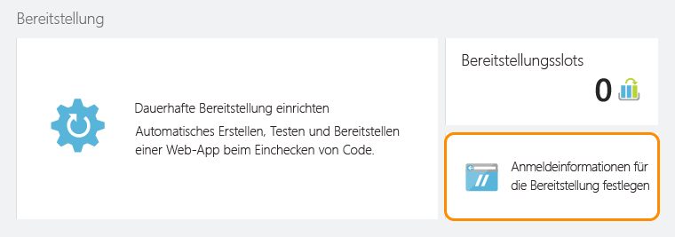

<properties
	pageTitle="Erstellen und Bereitstellen einer Java-API-App in Azure App Service"
	description="Lernen Sie, wie Sie ein Java-API-App-Paket erstellen und in Azure App Service bereitstellen."
	services="app-service\api"
	documentationCenter="java"
	authors="bradygaster"
	manager="mohisri" 
	editor="tdykstra"/>

<tags
	ms.service="app-service-api"
	ms.workload="web"
	ms.tgt_pltfrm="na"
	ms.devlang="java"
	ms.topic="get-started-article"
	ms.date="02/22/2016"
	ms.author="bradygaster"/>

# Erstellen und Bereitstellen einer Java-API-App in Azure App Service

[AZURE.INCLUDE [app-service-api-get-started-selector](../../includes/app-service-api-get-started-selector.md)]

In diesem Lernprogramm erfahren Sie, wie Sie eine Java-Anwendung erstellen und mit [Git](http://git-scm.com) als Azure App Service-API-App bereitstellen. Die Anweisungen in diesem Lernprogramm gelten für alle Betriebssysteme, unter denen Java ausgeführt werden kann. Der Code in diesem Tutorial wird mit [Maven](https://maven.apache.org/) erstellt. [Jax-RS](https://jax-rs-spec.java.net/) dient zum Erstellen des RESTful-Diensts und wird basierend auf der [Swagger](http://swagger.io)-Metadatenspezifikation mithilfe des [Swagger-Editors](http://editor.swagger.io/) generiert.

## Voraussetzungen

1. [Java Developer Kit 8](http://www.oracle.com/technetwork/java/javase/downloads/jdk8-downloads-2133151.html) (oder höher)
1. Ein kostenpflichtiges Abonnement für oder eine [kostenlose Testversion](https://azure.microsoft.com/pricing/free-trial/) von [Microsoft Azure](https://azure.microsoft.com/)
1. [Maven](https://maven.apache.org/) auf dem Entwicklungscomputer
1. Git auf dem Entwicklungscomputer 

## Erstellen des Gerüsts für die API mit Swagger.IO
Mit dem swagger.io-Online-Editor können Sie Swagger-JSON- oder YAML-Code eingeben, der die Struktur Ihrer API darstellt. Nach dem Entwerfen der API-Oberfläche können Sie Code in zahlreiche Plattformen und Frameworks exportieren. Im nächsten Abschnitt wird der erstellte Code geändert, um Modellfunktionen aufzunehmen.

In dieser Demo wird mit einem Swagger-JSON-Text begonnen, der in den swagger.io-Editor eingefügt wird. Anschließend wird der Text dazu verwendet, Code mithilfe von JAX-RS zu erstellen, um auf einen REST-API-Endpunkt zuzugreifen. Sie bearbeiten dann den erstellten Code, um Modelldaten zurückzugeben. Dabei wird eine REST-API simuliert, die auf einem Datenpersistenzmechanismus basiert.

1. Kopieren Sie den folgenden Swagger-JSON-Code in die Zwischenablage:

		{
			"swagger": "2.0",
			"info": {
				"version": "v1",
				"title": "Contact List",
				"description": "A Contact list API based on Swagger and built using Java"
			},
			"host": "localhost",
			"schemes": [
				"http",
				"https"
			],
			"basePath": "/api",
			"paths": {
				"/contacts": {
					"get": {
						"tags": [
							"Contact"
						],
						"operationId": "contacts_get",
						"consumes": [],
						"produces": [
							"application/json",
							"text/json"
						],
						"responses": {
							"200": {
								"description": "OK",
								"schema": {
									"type": "array",
									"items": {
										"$ref": "#/definitions/Contact"
									}
								}
							}
						},
						"deprecated": false
					}
				},
				"/contacts/{id}": {
					"get": {
						"tags": [
							"Contact"
						],
						"operationId": "contacts_getById",
						"consumes": [],
						"produces": [
							"application/json",
							"text/json"
						],
						"parameters": [
							{
								"name": "id",
								"in": "path",
								"required": true,
								"type": "integer",
								"format": "int32"
							}
						],
						"responses": {
							"200": {
								"description": "OK",
								"schema": {
									"type": "array",
									"items": {
										"$ref": "#/definitions/Contact"
									}
								}
							}
						},
						"deprecated": false
					}
				}
			},
			"definitions": {
				"Contact": {
					"type": "object",
					"properties": {
						"Id": {
							"format": "int32",
							"type": "integer"
						},
						"Name": {
							"type": "string"
						},
						"EmailAddress": {
							"type": "string"
						}
					}
				}
			}
		}
		
1. Navigieren Sie zum [Online-Swagger-Editor](http://editor.swagger.io/). Klicken Sie dort auf das Menüelement **Datei -> JSON einfügen**.

    

1. Fügen Sie den zuvor kopierten Swagger-JSON-Code der Kontaktlisten-API ein.

    

1. Zeigen Sie die im Editor gerenderten Dokumentationsseiten und die API-Zusammenfassung an.

    

1. Wählen Sie die Menüoption **Server erstellen -> JAX-RS**, um den serverseitigen Code zu erstellen, den Sie später zum Hinzufügen einer Modellimplementierung bearbeiten.

    
	
	Nach der Erstellung des Codes wird eine ZIP-Datei für den Download bereitgestellt. Diese Datei enthält den Code, der vom Swagger-Code-Generator und allen zugeordneten Buildskripts generiert wurde. Entpacken Sie die gesamte Bibliothek in ein Verzeichnis auf Ihrer Entwicklungsarbeitsstation.

## Bearbeiten des Codes zum Hinzufügen der API-Implementierung
In diesem Abschnitt ersetzen Sie die serverseitige Implementierung des generierten Codes durch Ihren benutzerdefinierten Code. Der neue Code gibt ein ArrayList-Element mit Kontaktdaten an den aufrufenden Client zurück.

1. Öffnen Sie die Modelldatei *Contact.java* im Ordner *src/gen/java/io/swagger/model* mit [Visual Studio Code](https://code.visualstudio.com) oder Ihrem bevorzugten Text-Editor. 

    

1. Fügen Sie der Klasse **Contact** folgenden Konstruktor hinzu:

        public Contact(Integer id, String name, String email) 
		{
			this.id = id;
			this.name = name;
			this.emailAddress = email;
		}

1. Öffnen Sie die Dienstimplementierungsdatei *ContactsApiServiceImpl.java* im Ordner *src/main/java/io/swagger/api/impl* mit [Visual Studio Code](https://code.visualstudio.com) oder Ihrem bevorzugten Text-Editor.

    

1. Überschreiben Sie den Code in der Datei mit diesem neuen Code, um dem Dienstcode eine Modellimplementierung hinzuzufügen.

        package io.swagger.api.impl;

        import io.swagger.api.*;
        import io.swagger.model.*;
        import com.sun.jersey.multipart.FormDataParam;
        import io.swagger.model.Contact;
        import java.util.*;
        import io.swagger.api.NotFoundException;
        import java.io.InputStream;
        import com.sun.jersey.core.header.FormDataContentDisposition;
        import com.sun.jersey.multipart.FormDataParam;
        import javax.ws.rs.core.Response;

        @javax.annotation.Generated(value = "class io.swagger.codegen.languages.JaxRSServerCodegen", date = "2015-11-24T21:54:11.648Z")
        public class ContactsApiServiceImpl extends ContactsApiService {
  
            private ArrayList<Contact> loadContacts()
            {
                ArrayList<Contact> list = new ArrayList<Contact>();
                list.add(new Contact(1, "Barney Poland", "barney@contoso.com"));
                list.add(new Contact(2, "Lacy Barrera", "lacy@contoso.com"));
                list.add(new Contact(3, "Lora Riggs", "lora@contoso.com"));
                return list;
            }
  
            @Override
            public Response contactsGet(SecurityContext securityContext)
            throws NotFoundException {
                ArrayList<Contact> list = loadContacts();
                return Response.ok().entity(list).build();
                }
  
            @Override
            public Response contactsGetById(Integer id, SecurityContext securityContext)
            throws NotFoundException {
                ArrayList<Contact> list = loadContacts();
                Contact ret = null;
            
                for(int i=0; i<list.size(); i++)
                {
                    if(list.get(i).getId() == id)
                    {
                        ret = list.get(i);
                    }
                }
                return Response.ok().entity(ret).build();
            }
        }

1. Öffnen Sie eine Eingabeaufforderung.

1. Erstellen Sie den Code mit dem folgenden Maven-Befehl, und führen Sie ihn mit dem Jetty-App-Server lokal aus.

		mvn package jetty:run
		
1. Daraufhin sollte im Befehlsfenster angezeigt werden, dass Jetty den Code an Port 8080 gestartet hat:

	
	
1. Senden Sie mit [Postman](https://www.getpostman.com/) eine Anforderung an die API-Methode „get all contacts“ unter http://localhost:8080/api/contacts.

	
	
1. Senden Sie mit [Postman](https://www.getpostman.com/) eine Anforderung an die API-Methode „get specific contact“ unter http://localhost:8080/api/contacts/2.

	
	
1. Erstellen Sie abschließend die Java WAR-Datei (Web ARchive), indem Sie folgenden Maven-Befehl in der Konsole ausführen.

		mvn package war:war
		
	Die WAR-Datei wird nach ihrer Erstellung im Zielordner abgelegt. Navigieren Sie zum Zielordner, und benennen Sie die WAR-Datei **ROOT.war** um (die Großschreibung muss diesem Format entsprechen).
	
		rename swagger-jaxrs-server-1.0.0.war ROOT.war
		
	Führen Sie abschließend die folgenden Befehle zum Erstellen des Bereitstellungsordners aus, der zum Bereitstellen der WAR-Datei in Azure verwendet werden soll.
	
		mkdir deploy
		mkdir deploy\webapps
		copy target\ROOT.war deploy\webapps
		cd deploy
	
## Veröffentlichen der Ausgabe in Azure App Service
In diesem Abschnitt erfahren Sie, wie Sie mit dem Azure-Portal eine neue API-App erstellen, diese API-App zum Hosten von Java-Anwendungen vorbereiten und die neu erstellte WAR-Datei in Azure App Service bereitstellen, um Ihre neue API-App auszuführen.

1. Erstellen Sie eine neue API-App im [Azure-Portal](https://portal.azure.com/), indem Sie auf das Menüelement **Neu -> Web und mobil -> API-App** klicken.
	
	

1. Klicken Sie auf dem Blatt mit den Einstellungen der API-App auf die Option **Anwendungseinstellungen**. Wählen Sie anschließend in den Java-Versionsmenüs die neuesten Java-Versionen und im Menü mit den Webcontainern den aktuellen Tomcat-Container aus.

	

1. Klicken Sie auf das Einstellungsmenüelement **Anmeldeinformationen für die Bereitstellung**, und geben Sie einen Benutzernamen und ein Kennwort für die Veröffentlichung von Dateien in Ihrer API-App ein.

	

1. Klicken Sie auf das Einstellungsmenüelement **Fortlaufende Bereitstellung**. Klicken Sie dort auf die Schaltfläche **Quelle auswählen**, und wählen Sie die Option **Lokales Git-Repository**. Dadurch wird ein in Azure ausgeführtes Git-Repository erstellt, das Ihrer API-App zugeordnet ist. Jedes Mal, wenn Sie für Ihren Code ein Commit in der Hauptverzweigung Ihres Git-Repositorys ausführen, wird der Code in der Liveinstanz Ihrer ausgeführten API-App veröffentlicht.

	

1. Kopieren Sie die neue URL des Git-Repositorys in die Zwischenablage. Speichern Sie sie, da Sie sie in Kürze benötigen.

	

1. Übertragen Sie die WAR-Datei per Git Push an das Online-Repository. Navigieren Sie dazu zum zuvor erstellten Bereitstellungsordner, damit Sie einfach einen Commit für den Code im Repository in App Service ausführen können. Navigieren Sie im Konsolenfenster zum Ordner, in dem sich der Ordner „webapps“ befindet. Geben Sie dort die folgenden Git-Befehle ein, um den Prozess zu starten und eine Bereitstellung auszulösen.

		git init
		git add .
		git commit -m "initial commit"
		git remote add azure [YOUR GIT URL]		
		git push azure master
		
	Nach Ausgabe der **push**-Anforderung werden Sie zur Eingabe des Kennworts aufgefordert, das Sie zuvor für die Bereitstellungsanmeldeinformationen erstellt haben. Bei der Eingabe sehen Sie im Portal, dass das Update abgerufen und bereitgestellt wurde.
		
1. Wenn Sie mit Postman erneut auf die neu bereitgestellte API-App zugreifen, die in Azure App Service ausgeführt wird, sehen Sie, dass das Verhalten konsistent ist und nun wie erwartet Kontaktdaten zurückgegeben und einfache Änderungen am Java-Code verwendet werden, der mit dem swagger.io-Editor erstellt wurde.

	
	
## Nächste Schritte
In diesem Artikel konnten Sie mit einer Swagger-JSON-Datei und Java-Code beginnen, der mit dem swagger.io-Editor generiert wurde. Durch einfache Änderungen und einen Git-Bereitstellungsprozess haben Sie eine funktionale, in Java geschriebene API-App erhalten. Im nächsten Tutorial der Reihe „Erste Schritte mit API-Apps“ wird gezeigt, wie Sie [API-Apps über JavaScript-Clients mit CORS nutzen](app-service-api-cors-consume-javascript.md).

Aufbauend auf diesem Beispiel können Sie mehr über das [Storage SDK für Java](../storage/storage-java-how-to-use-blob-storage.md) erfahren, um die JSON-Blobs beständig zu speichern. Alternativ Sie können mithilfe des [Java SDK für DocumentDB](../documentdb/documentdb-java-application.md) Ihre Kontaktdaten in Azure DocumentDB speichern.

Weitere Informationen zum Verwenden von Java in Azure finden Sie im [Java Developer Center](/develop/java/).

<!---HONumber=AcomDC_0302_2016-->