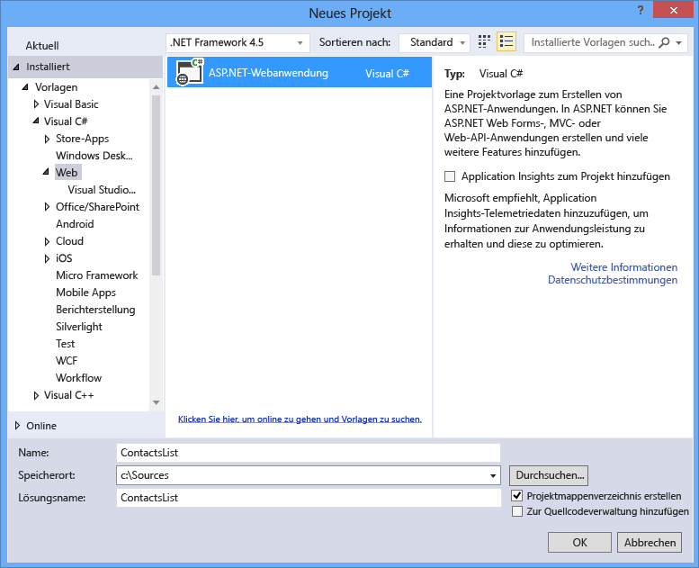
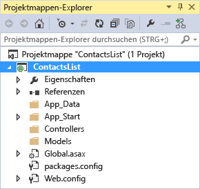
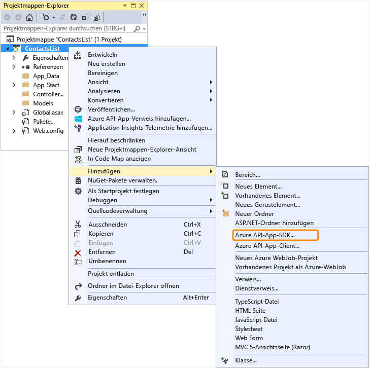
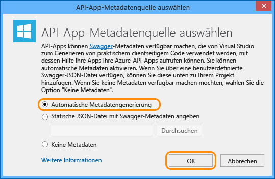

<properties 
	pageTitle="Konfigurieren eines Web-API-Projekts als API-App" 
	description="Erfahren Sie, wie Sie ein Web-API-Projekt mithilfe von Visual Studio 2013 als API-App konfigurieren." 
	services="app-service\api" 
	documentationCenter=".net" 
	authors="tdykstra" 
	manager="wpickett" 
	editor="jimbe"/>

<tags 
	ms.service="app-service-api" 
	ms.workload="web" 
	ms.tgt_pltfrm="dotnet" 
	ms.devlang="na" 
	ms.topic="article" 
	ms.date="05/19/2015" 
	ms.author="bradyg;tarcher"/>

# Konfigurieren eines Web-API-Projekts als API-App

## Übersicht

In diesem Lernprogramm wird gezeigt, wie Sie ein vorhandenes Web-API-Projekt für die Bereitstellung als [API-App](app-service-api-apps-why-best-platform.md) in [Azure App Service](../app-service/app-service-value-prop-what-is.md) konfigurieren. Nachfolgende Lernprogramme in dieser Reihe zeigen, wie Sie das in diesem Lernprogramm erstellte API-App-Projekt [bereitstellen](app-service-dotnet-deploy-api-app.md) und [debuggen](../app-service-dotnet-remotely-debug-api-app.md).

Weitere Informationen zu API-Apps finden Sie unter [Was sind API-Apps?](app-service-api-apps-why-best-platform.md).

[AZURE.INCLUDE [install-sdk-2013-only](../../includes/install-sdk-2013-only.md)]

Für dieses Lernprogramm ist Version 2.5.1 oder höher des Azure-SDK für .NET erforderlich.

## Konfigurieren eines Web-API-Projekts 

In diesem Abschnitt wird gezeigt, wie Sie ein vorhandenes Web-API-Projekt als API-App konfigurieren. Sie beginnen damit, die Web-API-Projektvorlage zum Erstellen eines Web-API-Projekts zu verwenden und diese anschließend als API-App zu konfigurieren.

1. Öffnen Sie Visual Studio 2013.

2. Wählen Sie **Datei > Neues Projekt** aus.

3. Wählen Sie die Vorlage **ASP.NET-Webanwendung**.

4. Stellen Sie sicher, dass das Kontrollkästchen **Application Insights zu Projekt hinzufügen** deaktiviert ist.

4. Geben Sie dem Projekt den Namen *ContactsList*.

	

5. Klicken Sie auf **OK**.

6. Wählen Sie im Dialogfeld **Neues ASP.NET-Projekt** die Projektvorlage **Leer** aus.

7. Aktivieren Sie das Kontrollkästchen **Web-API**.

8. Deaktivieren Sie die Option **In der Cloud hosten**.

	

9. Klicken Sie auf **OK**, um das Projekt zu generieren.

	

10. Klicken Sie im **Projektmappen-Explorer** mit der rechten Maustaste auf das Projekt (nicht die Projektmappe), und klicken Sie dann auf **Hinzufügen > Azure API-App-SDK**.

	

11. Klicken Sie im Dialogfeld **API-App-Metadatenquelle wählen** auf **Automatische Metadatengenerierung**.

	

	Diese Option aktiviert die dynamische Swagger-Benutzeroberfläche, die Sie später in diesem Lernprogramm kennenlernen werden. Wenn Sie eine Swagger-Metadatendatei hochladen, wird diese mit dem Dateinamen *apiDefinition.swagger.json* gespeichert, wie im folgenden Abschnitt erläutert.

12. Klicken Sie auf **OK**.
 
	Zu diesem Zeitpunkt installiert Visual Studio API-App-NuGet-Pakete und fügt API-App-Metadaten zum Web-API-Projekt hinzu.

[AZURE.INCLUDE [app-service-api-review-metadata](../../includes/app-service-api-review-metadata.md)]

[AZURE.INCLUDE [app-service-api-define-api-app](../../includes/app-service-api-define-api-app.md)]

[AZURE.INCLUDE [app-service-api-direct-deploy-metadata](../../includes/app-service-api-direct-deploy-metadata.md)]

## Nächste Schritte

Ihre API-App kann jetzt bereitgestellt werden. Dazu können Sie das Lernprogramm [Bereitstellen einer API-App](app-service-dotnet-deploy-api-app.md) befolgen.
 

<!---HONumber=August15_HO6-->