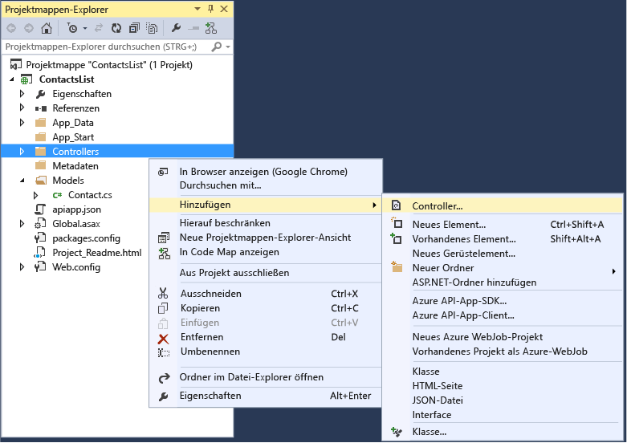
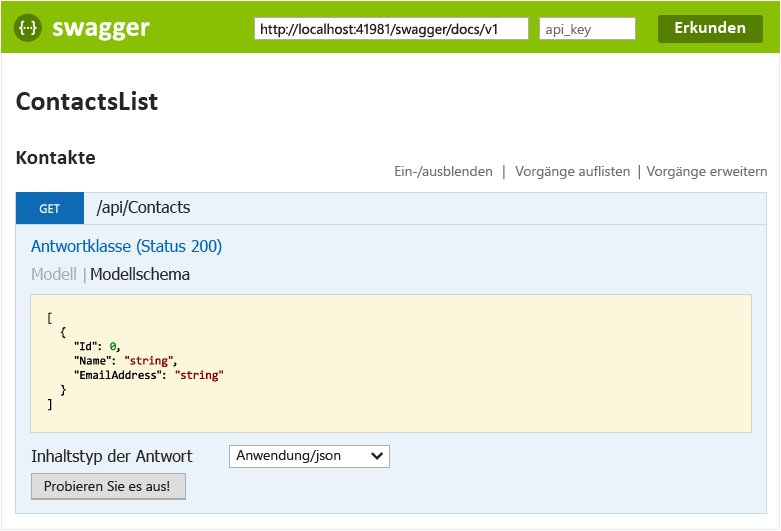
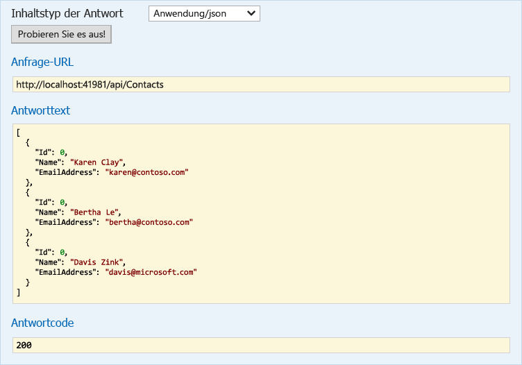

<properties 
	pageTitle="Erstellen einer ASP.NET-API-App in Azure App Service mithilfe von Visual Studio 2015 " 
	description="Erfahren Sie, wie Sie mithilfe von Visual Studio 2015 eine ASP.NET-API-App in Azure App Service erstellen." 
	services="app-service\api" 
	documentationCenter=".net" 
	authors="tdykstra" 
	manager="wpickett" 
	editor="jimbe"/>

<tags 
	ms.service="app-service-api" 
	ms.workload="web" 
	ms.tgt_pltfrm="dotnet" 
	ms.devlang="na" 
	ms.topic="article" 
	ms.date="05/19/2015" 
	ms.author="tdykstra"/>

# Erstellen einer ASP.NET-API-App in Azure App Service mithilfe von Visual Studio 2015 

> [AZURE.SELECTOR]
- [Visual Studio 2013](app-service-dotnet-create-api-app.md)
- [Visual Studio 2015 RC](app-service-dotnet-create-api-app-vs2015.md)
- [Visual Studio Code](app-service-create-aspnet-api-app-using-vscode.md)

## Übersicht

In diesem Lernprogramm erstellen Sie ein ASP.NET Web API 2-Projekt mit [Visual Studio 2015 RC](https://www.visualstudio.com/de-de/downloads/visual-studio-2015-downloads-vs.aspx), und konfigurieren Sie ihn für die Bereitstellung in der Cloud als eine [API-Anwendung](app-service-api-apps-why-best-platform.md) in [Azure Anwendungsdiensts](../app-service/app-service-value-prop-what-is.md). Sie stellen das Projekt auch für Azure bereit. Am Ende des Lernprogramms haben Sie eine API-App, die in der Azure-Cloud ausgeführt wird.

Für das Lernprogramm wird davon ausgegangen, dass Sie die Arbeit mit Dateien und Ordnern im Visual Studio **Projektmappen-Explorer** beherrschen.

Das Lernprogramm funktioniert mit der derzeit veröffentlichten Version der ASP.NET-Web-API. Informationen zum Erstellen einer ASP.NET MVC 6-API-App finden Sie im Blogbeitrag: [https://alexanderzeitler.com/articles/Deploying-a-ASP-NET-MVC-6-API-as-Azure-API-App-in-Azure-App-Services/](https://alexanderzeitler.com/articles/Deploying-a-ASP-NET-MVC-6-API-as-Azure-API-App-in-Azure-App-Services/ "Bereitstellen einer ASP.NET MVC 6-API als Azure-API-App in Azure App Services").

[AZURE.INCLUDE [install-sdk-2015-only](../../includes/install-sdk-2015-only.md)]

Für dieses Lernprogramm ist die Version 2.6 des Azure-SDK für .NET erforderlich.

## Erstellen eines API-App-Projekts 

Visual Studio 2015 RC verfügt noch nicht über eine API-App-Projektvorlage. Verwenden Sie daher die Web-API-Projektvorlage, um ein API-App-Projekt von Grund auf zu erstellen.

1. Öffnen Sie Visual Studio 2015 RC.

2. Klicken Sie auf **Datei > Neues Projekt**.

3. Klicken Sie unter **Vorlagen** auf **Web**, und klicken Sie dann auf die Vorlage **ASP.NET-Webanwendung**.

4. Geben Sie dem Projekt den Namen *ContactsList*.

5. Stellen Sie sicher, dass die **Fügen Sie Application Insights Projekt** ist das Kontrollkästchen deaktiviert.

5. Klicken Sie auf **OK**.

	

6. Wählen Sie im Dialogfeld **Neues ASP.NET-Projekt** unter **ASP.NET 4.6-Vorlagen** die Projektvorlage **Leer** aus.

7. Aktivieren Sie das Kontrollkästchen **Web-API**.

8. Heben Sie die Auswahl des Kontrollkästchens **In der Cloud hosten** auf.

7. Klicken Sie auf **OK**.

	

## Hinzufügen von NuGet-Paketen

Die App-Dienstlaufzeit-API-Anwendungen erfolgt über die [Microsoft.Azure.AppService.ApiApps.Service](http://www.nuget.org/packages/Microsoft.Azure.AppService.ApiApps.Service/) NuGet-Paket und dynamische [Swagger](http://swagger.io/ "Offizielle Swagger-Informationen") API Metadatengenerierung erfolgt über die [Swashbuckle](http://www.nuget.org/packages/Swashbuckle/) NuGet-Paket.

> **Hinweis:** bei der Installation des Pakets Swashbuckle-API-Testseite standardmäßig aktiviert. Wenn Sie die API-Anwendung veröffentlichen, und legen den Zugriff auf **Public (anonyme)**, jeder, der den URL der Seite findet kann es verwenden, um Ihre API aufrufen. Später in diesem Lernprogramm verwenden Sie die Testseite.

1. Klicken Sie auf **Extras > NuGet-Paket-Manager > Paket-Manager-Konsole**.

2. In der **-Paket-Manager-Konsole** (PMC), geben Sie die folgenden Befehle aus.

		install-package Microsoft.Azure.AppService.ApiApps.Service
		install-package Swashbuckle

	Sie müssen möglicherweise einige Minuten warten, nachdem der PMC die Meldung anzeigt, in der darauf hingewiesen wird, dass die Abhängigkeiten überprüft werden.

## Hinzufügen von API-App-Metadatendateien

Die Metadaten, dank derer ein Web-API-Projekt als eine API-App bereitgestellt werden kann, sind in der Datei *apiapp.json* und dem Ordner *Metadata* sowie dessen Unterordern und Dateien enthalten. In den folgenden Schritten fügen Sie diese Dateien mit Standardwerten hinzu.

Im Abschnitt [API-App-Metadaten](#api-app-metadata) später in diesem Lernprogramm wird erläutert, wie Sie diese Metadaten anpassen.

1. Erstellen Sie im Projektordner eine *JSON*-Datei mit dem Namen "apiapp.json", und ersetzen Sie den Inhalt der neuen Datei mit dem folgenden JSON-Text.

		{
		    "$schema": "http://json-schema.org/schemas/2014-11-01/apiapp.json#",
		    "id": "ContactsList",
		    "namespace": "microsoft.com",
		    "gateway": "2015-01-14",
		    "version": "1.0.0",
		    "title": "ContactsListTitle",
		    "summary": "Summary",
		    "author": "Author",
		    "endpoints": {
		        "apiDefinition": "/swagger/docs/v1",
		        "status": null
		    }
		}

3. Erstellen Sie im Projektordner einen Ordner namens *Metadata*, und erstellen Sie im Ordner *Metadata* einen Ordner mit dem Namen *deploymentTemplates*.

5. Erstellen Sie im Ordner *deploymentTemplates* eine *JSON*-Datei mit dem Namen *apiappconfig.azureresource.json*, und ersetzen Sie den Inhalt der neuen Datei mit dem folgenden JSON-Text.

		{
		  "$schema": "http://schemas.management.azure.com/schemas/2014-04-01-preview/deploymentTemplate.json#",
		  "contentVersion": "1.0.0.0",
		  "parameters": {
		    "$system": {
		      "type": "Object"
		    }
		  },
		  "resources": []
		}

## Hinzufügen von Web-API-Code

In den folgenden Schritten fügen Sie Code für eine einfache HTTP-Get-Methode hinzu, die eine hartcodierte Liste mit Kontakten zurückgibt.

1. Erstellen einer *Modelle* Ordner in den Projektordner, wenn er nicht bereits vorhanden.

2. In der *Modelle* Ordner, fügen Sie eine Klassendatei mit dem Namen *Contact.cs*, und Ersetzen Sie den Inhalt der Datei mit dem folgenden Code Namespace ContactsList.Models {öffentliche Klasse Kontakt {public Int Id {Get; Set;} public String Name {Get; Set;} public String EmailAddress {get; eingestellt;}}}

5. Klicken Sie mit der rechten Maustaste auf den Ordner **Controller**, und wählen Sie dann im Kontextmenü **Hinzufügen > Controller**.

	

6. Wählen Sie im Dialogfeld **Gerüst hinzufügen** die Option **Web API 2-Controller – Leer** aus, und klicken Sie auf **Hinzufügen**.

	

7. Nennen Sie den Controller **ContactsController**, und klicken Sie auf **Hinzufügen**.

	

8. Ersetzen Sie den Inhalt der Datei *ContactsController.cs* durch den folgenden Code:

		using ContactsList.Models;
		using System;
		using System.Collections.Generic;
		using System.Linq;
		using System.Net;
		using System.Net.Http;
		using System.Threading.Tasks;
		using System.Web.Http;
		
		namespace ContactsList.Controllers
		{
		    public class ContactsController : ApiController
		    {
		        [HttpGet]
		        public IEnumerable<Contact> Get()
		        {
		            return new Contact[]{
						new Contact { Id = 1, EmailAddress = "barney@contoso.com", Name = "Barney Poland"},
						new Contact { Id = 2, EmailAddress = "lacy@contoso.com", Name = "Lacy Barrera"},
	                	new Contact { Id = 3, EmailAddress = "lora@microsoft.com", Name = "Lora Riggs"}
		            };
		        }
		    }
		}

## Testen der Web-API

Führen Sie die folgenden Schritte aus, um die API-Testseite anzuzeigen.

1. Führen Sie die Anwendung lokal (STRG + F5), und fügen `/swagger` am Ende der URL in der Adressleiste des Browsers. 

	

2. Klicken Sie auf **Contacts > Abrufen > Jetzt testen**. Sie sehen, dass die API funktioniert und das erwartete Ergebnis zurückgibt.

	

## Erstellen einer API-App in Azure

1. Erstellen Sie eine API-App im [Azure-Vorschauportal](https://portal.azure.com). 

	* Klicken Sie auf **Neu > Web + Mobil > API-App**.

		

	* In **Name** noch eingeben.

	* Klicken Sie in **App Service-Plan** auf **Neu erstellen**, und geben Sie einen Namen ein, zum Beispiel: **ContactsList**.

		Weitere Informationen zu Azure App Service-Plänen finden Sie unter [Azure App Service-Pläne – Detaillierte Übersicht](azure-web-sites-web-hosting-plans-in-depth-overview.md).

	* Klicken Sie auf **Preisstufe > Alle anzeigen > frei > Wählen Sie** die kostenlose Preisstufe auszuwählen.

		Sie können eine kostenpflichtige Preisstufe wählen, im Rahmen dieses Lernprogramms ist dies jedoch nicht erforderlich.

	* In **Ressourcengruppe**, klicken Sie auf **neu erstellen** und geben Sie einen Namen ein, z. B.: noch.

		Weitere Informationen über Ressourcengruppen finden Sie unter [Verwenden von Ressourcengruppen zum Verwalten von Azure-Ressourcen](resource-group-overview.md).

	* Wenn Sie über mehr als ein Abonnement verfügen, wählen Sie das Abonnement aus, das Sie verwenden möchten.

	* Wählen Sie einen Standort in Ihrer Nähe aus.

	* Klicken Sie auf **Erstellen**.

		

2. Abschluss von Azure Erstellen der app-API-Festlegen der API-Anwendung Zugriff auf **Public (anonyme)**.

	* Klicken Sie auf **Durchsuchen > Ressourcengruppen > [die von Ihnen erstellte Ressourcengruppe] > [die von Ihnen erstellte API-App]**.

	* Klicken Sie auf **Einstellungen > Anwendungseinstellungen**.

	* Legen Sie die **Zugriffsebene** auf **Öffentlich (anonym)** fest.
	 
	* Klicken Sie auf **Speichern**.

		
	
2. Notieren Sie den Namen der zugrunde liegenden Web-App, die API-App hostet. Sie werden diesen beim Bereitstellen des Visual Studio-Projekts verwenden.

	* Klicken Sie unter **app-Host-API-**, klicken Sie auf **noch**.

		

	* Der Name befindet sich im Titel des Blatts **API-App-Host**.

		

## Bereitstellen des Web-API-Projekts in der neuen API-App in Azure
 
API-Apps sind im Grunde Web-Apps, für die Azure zusätzliche Funktionen für die Web Service-Funktionalität bereitstellt. In Visual Studio 2015 RC führen Sie die Veröffentlichung auf der zugrunde liegenden Web-App der API-App durch, da der Assistent "Web veröffentlichen" keine spezielle Auswahl für API-Apps bietet.

2. Klicken Sie im Visual Studio **Projektmappen-Explorer** mit der rechten Maustaste auf das Projekt, und klicken Sie dann im Kontextmenü auf **Veröffentlichen**.

3. Klicken Sie im Schritt **Profil** im Assistenten **Web veröffentlichen** auf **Microsoft Azure-Web-Apps**.

	

4. Wählen Sie in der Dropdownliste **Vorhandene Web-Apps** den Eintrag mit dem API-App-Namen aus, den Sie zuvor notiert haben.

	

5. Klicken Sie auf **Veröffentlichen**.

	Im Browser wird die Web-App-URL geöffnet, der eine Seite "API-Anwendung wurde erstellt" zeigt.

6. Fügen Sie in der Adresszeile des Browsers am Ende der URL "swagger/" hinzu. Beispiel:

		https://microsoft-apiappb001b62a9033493a33748332233fca2.azurewebsites.net/swagger/

	Sie sehen die gleiche Swagger-UI, die Sie bereits zuvor mit einer lokalen Ausführung gesehen haben. Jetzt wird sie jedoch in der Cloud ausgeführt.

2. Klicken Sie auf **Contacts > Abrufen > Jetzt testen**. Sie sehen, dass die API funktioniert und das erwartete Ergebnis zurückgibt.

	

## Anzeigen der API-Definition im Azure-Vorschauportal

In diesem Abschnitt navigieren Sie zum Portal anzeigen die API-Definition für die API-Anwendung, die Sie gerade erstellt haben.

1. In der [Azure Preview-Portal](https://portal.azure.com), navigieren Sie zu den **API-Anwendung** Blade für Ihre API-app: Klicken Sie auf **Durchsuchen > Ressourcengruppen > [die Ressourcengruppe, die Sie erstellt haben] > [der API-Anwendung, die Sie erstellt haben]**.

4. Klicken Sie auf **API-Definition**.

	Das Blatt **API-Definition** der App zeigt die Liste der API-Vorgänge an, die Sie beim Erstellen der App definiert haben. (Wenn Sie in diesem Lernprogramm ausgeführt haben Sie nur einen Get-Vorgang sehen.)

	

## Fügen Sie einen Vorgang an den Web-API-code

5. Gehen Sie zurück zu dem Projekt in Visual Studio und fügen Sie folgenden Code zum die **ContactsController.cs** Datei. Dieser Code fügt eine **Post**-Methode hinzu, mit deren Hilfe neue `Contact`-Instanzen in der API platziert werden können.  

		[HttpPost]
		public HttpResponseMessage Post([FromBody] Contact contact)
		{
			// todo: save the contact somewhere
			return Request.CreateResponse(HttpStatusCode.Created);
		}

	

6. Veröffentlichen Sie das Projekt wie zuvor. (In **Projektmappen-Explorer**, mit der rechten Maustaste auf das Projekt, und klicken Sie auf **Veröffentlichen**, und klicken Sie dann auf **Veröffentlichen** in den **Web veröffentlichen** Assistenten.)

12. Nach dem Abschluss des Veröffentlichungsprozess zum Portal zurückkehren Sie, und starten Sie das Gateway, wie zuvor.

14. Im Portal gehen Sie zurück zu den **-API-Definition** Blade.

	Sie finden Sie in der neuen API-Endpunkt, den Sie gerade erstellt und bereitgestellt werden, um Ihre Azure-Abonnement.

	

[AZURE.INCLUDE [app-service-api-direct-deploy-metadata](../../includes/app-service-api-direct-deploy-metadata.md)]

## Nächste Schritte

Sie haben nun eine API-Anwendung mithilfe von Visual Studio 2015 RC erstellt und bereitgestellt. Zusätzliche Dokumentation zu API-Apps finden Sie unter den Einträgen im Navigationsbereich auf der linken Seite der Seite (bei breiten Browserfenstern) oder am oberen Rand der Seite (bei schmalen Browserfenstern). Der Großteil der API-App-Dokumentation zeigt derzeit Visual Studio 2013, aber vieles davon gilt auch für VS 2015, da die Benutzeroberfläche ähnlich ist. Der Code, den Sie schreiben, ist derselbe und auch die Portalbenutzeroberfläche ist identisch.
 

<!---HONumber=GIT-SubDir_Tue_AM_dede-->