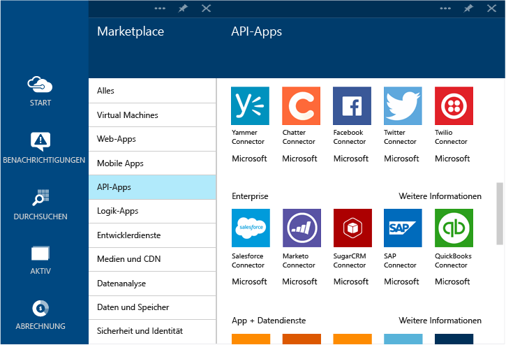

<properties 
	pageTitle="Was sind Connectors und BizTalk-API-Apps?" 
	description="Erfahren Sie mehr über API-Apps, Connectors und BizTalk-API-Apps" 
	services="app-service\logic" 
	documentationCenter="" 
	authors="MandiOhlinger" 
	manager="dwrede" 
	editor=""/>

<tags 
	ms.service="app-service-logic" 
	ms.workload="integration" 
	ms.tgt_pltfrm="na" 
	ms.devlang="na" 
	ms.topic="article" 
	ms.date="09/08/2015" 
	ms.author="mandia"/>

# Was sind Connectors und BizTalk-API-Apps?

Azure App Services basiert auf dem Prinzip der Erweiterbarkeit und allgemeinen Konnektivität mittels API-Apps. Ein *Connector* ist eine Art API-App mit Fokus auf Konnektivität. Connectors werden wie alle anderen API-Apps von Web-Apps, Mobile Apps und Logik-Apps verwendet. Connectors vereinfachen Verbindungen mit vorhandenen Diensten, helfen beim Verwalten der Authentifizierung und bieten Überwachungs-, Analyse- und weitere Funktionen.

Entwickler können eigene API-Apps erstellen und sie privat bereitstellen. In Zukunft können Entwickler ihre eigens erstellten API-Apps über den Marketplace freigeben und daran verdienen.

Um die Entwicklung von Lösungen mit Azure App Service zu beschleunigen, hat das Azure-Team dem Marketplace verschiedene Connectors für zahlreiche gängige Szenarien hinzugefügt. Darüber hinaus sind zum Erweitern der Funktionalität von App Service für komplexe Integrationsszenarien auch verschiedene Premium- und BizTalk-Funktionen verfügbar.

In Azure App Service sind unterschiedliche Dienstebenen verfügbar. Alle Ebenen umfassen alle Connectors und API-Apps, einschließlich ihrer vollen Funktionalität.

Unter [App Service-Preise](http://azure.microsoft.com/pricing/details/app-service/) werden diese Dienstebenen beschrieben. Zudem wird aufgeführt, was in den einzelnen Ebenen enthalten ist. In den folgenden Abschnitten werden die verschiedenen Kategorien von BizTalk-API-Apps und -Connectors beschrieben.

## Standardconnectors
App Service wird mit einem umfassenden Satz an Connectors bereitgestellt, die eine einfache Möglichkeit bieten, Ihre Web-, mobilen und Logik-Apps mit einigen der größten SaaS-Anbieter zu verbinden, so z. B. mit Office 365, SalesForce, Sugar CRM, OneDrive, DropBox, Marketo, Facebook und vielen mehr. Es umfasst auch eine Reihe von Connectors für die Kommunikation mit externen Diensten über FTP, SFTP, POP3/IMAP, SMTP und SOAP – ebenso einfach wie ein HTTP-Aufruf.

## Premiumconnectors 
Die Premiumconnectors ermöglichen eine weitere Integration von App Services in Enterprise-Anwendungen wie SAP, Oracle, DB2, Informix und WebSphere.

## EAI- und EDI-Dienste
Das Entwickeln geschäftskritischer Apps erfordert mehr als bloß Konnektivität. Basierend auf der branchenweit führenden Integrationsplattform von Microsoft - BizTalk Server - bieten BizTalk-API-Apps erweiterte Integrationsmöglichkeiten, die einfach in Ihre Web-, mobilen und Logik-Apps eingeklinkt werden können. Zu diesen Integrationsfunktionen zählen das Überprüfen, Extrahieren, Transformieren, Encoder, Handelspartnerverwaltung sowie Unterstützung für EDI-Formate wie X12, EDIFACT und AS2.

## Regeln
Geschäftsregeln umfassen die Richtlinien und Entscheidungen, welche Geschäftsprozesse steuern. Normalerweise sind Regeln dynamisch und ändern sich im Laufe der Zeit, zum Beispiel aufgrund von Geschäftsplänen oder Bestimmungen oder aus vielen anderen Gründen. Mit BizTalk-Regeln in App Services können Sie diese Richtlinien von Ihrem Anwendungscode entkoppeln und den Änderungsprozess einfacher und schneller gestalten.

## Liste der Connectors und API-Apps
Eine vollständige Liste der Connectors und API-Apps, die in den einzelnen Kategorien wie den Standardconnectors, BizTalk-EAI, Premiumconnectors usw. enthalten sind, finden Sie unter [Liste mit Connectors und API-Apps](app-service-logic-connectors-list.md).
 

<!---HONumber=Oct15_HO3-->