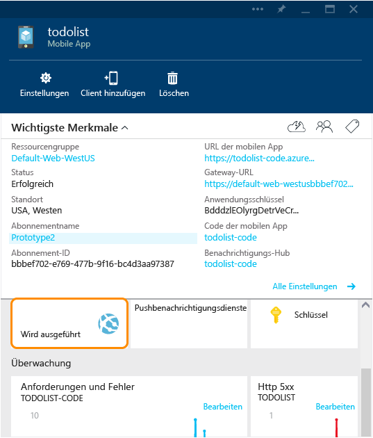
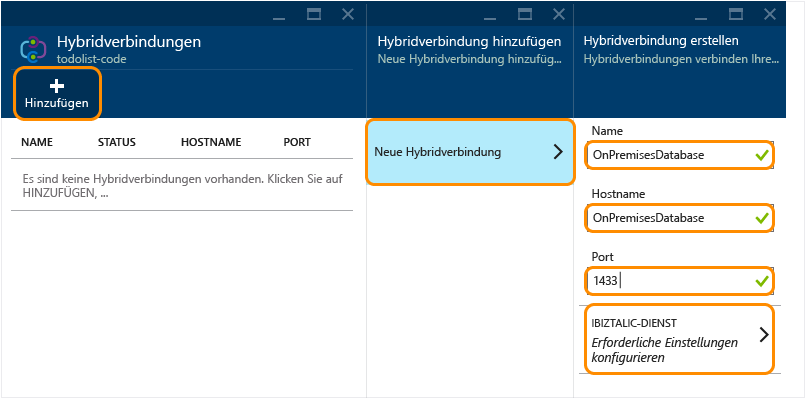
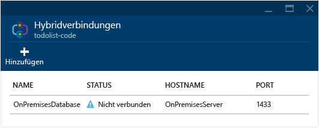
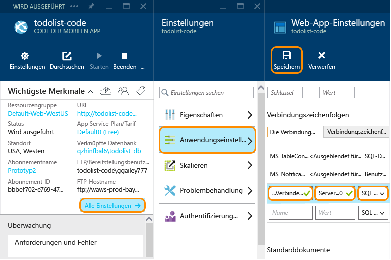

<properties
	pageTitle="Verbinden Ihrer mobilen Azure-App mit einer lokalen SQL Server-Instanz über Hybridverbindungen | Microsoft Azure"
	description="Erfahren Sie, wie Sie über Hybridverbindungen eine Verbindung mit einer lokalen SQL Server-Instanz von einer mobilen App Service-App aus herstellen können."
	services="app-service"
	documentationCenter=""
	authors="ggailey777"
	manager="dwrede"
	editor=""/>

<tags
	ms.service="app-service"
	ms.workload="na"
	ms.tgt_pltfrm="na"
	ms.devlang="multiple"
	ms.topic="get-started-article"
	ms.date="07/30/2015"
	ms.author="glenga"/>

# Herstellen einer Verbindung mit einem lokalen SQL Server von Mobile Apps mit Hybridverbindungen

Wenn Ihr Unternehmen auf die Cloud umstellt, können Sie möglicherweise nicht alle Ihre Ressourcen sofort zu Azure migrieren. Mit Hybridverbindungen kann das Mobile Apps-Feature in Azure App Service sichere Verbindungen mit Ihren lokalen Ressourcen herstellen. Auf diese Weise können Sie Ihre lokalen Daten mithilfe von Azure für Ihre mobilen Clients zugänglich machen. Unterstützt werden unter anderem alle Ressourcen, die auf einem statischen TCP-Port laufen, inklusive Microsoft SQL Server, MySQL, HTTP Web-APIs und die meisten selbst entwickelten Webdienste. Hybridverbindungen verwenden SAS-Autorisierung (Shared Access Signature) zum Sichern der Verbindungen vom mobilen Dienst und dem lokalen Hybrid Connection Manager zur Hybridverbindung. Weitere Informationen finden Sie unter [Übersicht über Hybridverbindungen](../integration-hybrid-connection-overview.md).

In diesem Tutorial erfahren Sie, wie Sie ein Mobile Apps-.NET-Back-End so anpassen können, dass es eine lokale SQL Server-Datenbank anstatt der standardmäßig mit Ihrem Dienst bereitgestellten Azure SQL-Datenbank verwendet.

[AZURE.INCLUDE [app-service-mobile-to-web-and-api](../../includes/app-service-mobile-to-web-and-api.md)]

## Voraussetzungen ##

Für dieses Lernprogramm müssen Sie über Folgendes verfügen:

- **Ein vorhandenes mobiles Apps-Back-End**  Folgen Sie dem [Schnellstart-Lernprogramm](app-service-mobile-dotnet-backend-windows-store-dotnet-get-started-preview.md) zum Erstellen und Herunterladen einer neuen mobilen .NET-Back-End-App aus dem [Azure-Portal].

[AZURE.INCLUDE [hybrid-connections-prerequisites](../../includes/hybrid-connections-prerequisites.md)]

## Installieren von SQL Server Express, Aktivieren von TCP/IP und Erstellen einer lokalen SQL Server-Datenbank

[AZURE.INCLUDE [hybrid-connections-create-on-premises-database](../../includes/hybrid-connections-create-on-premises-database.md)]

## Erstellen einer Hybridverbindung

Sie müssen eine neue Hybridverbindung und einen neuen BizTalk-Dienst für den Codeteil des mobilen App-Back-Ends (eine Webanwendung) erstellen.

1. Navigieren Sie im [Azure-Portal] zu Ihrer mobilen App, und klicken Sie auf die Schaltfläche für das Web-App-Back-End.

	

	Dadurch gelangen Sie zur Web-App, die den Back-End-Code für die mobile App implementiert, also den Namen der mobilen App gefolgt von `-code`.

2. Führen Sie im Blatt der Web-App einen Bildlauf nach unten durch, und klicken Sie auf **Hybridverbindungen**.

	

2. Klicken Sie im Blatt "Hybridverbindungen" auf **Hinzufügen** und dann auf **Neue Hybridverbindung**.

3. Geben Sie im **Blade zum Erstellen einer Hybridverbindung** einen **Name** und einen **Hostnamen** für die Hybridverbindung an, und legen Sie den **Port** auf `1433` fest.

	

4. Klicken Sie auf **BizTalk-Dienst**, und geben Sie einen Namen für den BizTalk-Dienst ein. Klicken Sie zweimal auf **OK**.

	Dieses Tutorial verwendet **mobile1**. Sie müssen einen eindeutigen Namen für Ihren neuen BizTalk Service angeben.

	Nach Abschluss des Prozesses leuchtet im Bereich **Benachrichtigungen** der Text **ERFOLG** in grüner Schrift, und das Blatt **Hybridverbindung** zeigt die neue Hybridverbindung mit dem Status **Nicht verbunden** an.

	

An diesem Punkt haben Sie einen wichtigen Teil der Hybridverbindungsinfrastruktur der Cloud erstellt. Als Nächstes erstellen Sie das lokale Gegenstück.

## Installieren des lokalen Hybrid Connection Manager, um die Verbindung zu vervollständigen

[AZURE.INCLUDE [app-service-hybrid-connections-manager-install](../../includes/app-service-hybrid-connections-manager-install.md)]

## Konfigurieren des mobilen App-Back-End-Projekts zum Herstellen einer zur SQL Server-Datenbank

In diesem Schritt definieren Sie eine Verbindungszeichenfolge für die lokale Datenbank und ändern das mobile App-Back-End für diese Verbindung.

1. Öffnen Sie in Visual Studio 2013 das Projekt, in dem das mobile App-Back-End definiert wird.

	Weitere Informationen zum Herunterladen des .NET Back-End-Projekts finden Sie unter [Schnellstart-Lernprogramm](app-service-mobile-dotnet-backend-windows-store-dotnet-get-started-preview.md).

2. Öffnen Sie im Projektmappen-Explorer die Datei "Web.config", suchen Sie den Abschnitt **connectionStrings**, fügen Sie einen neuen SqlClient-Eintrag, der auf die lokale SQL Server-Datenbank verweist, wie folgt hinzu:

	    <add name="OnPremisesDBConnection"
         connectionString="Data Source=OnPremisesServer,1433;
         Initial Catalog=OnPremisesDB;
         User ID=HybridConnectionLogin;
         Password=<**secure_password**>;
         MultipleActiveResultSets=True"
         providerName="System.Data.SqlClient" />

	Denken Sie daran, `<**secure_password**>` in dieser Zeichenfolge durch das Kennwort zu ersetzen, das Sie für *HbyridConnectionLogin* erstellt haben.

3. Klicken Sie in Visual Studio auf **Speichern**, um die Datei "Web.config" zu speichern.

	> [AZURE.NOTE]Diese Verbindungseinstellung wird bei Ausführung auf dem lokalen Computer verwendet. Bei der Ausführung in Azure wird diese Einstellung durch die Verbindungseinstellung überschrieben, die im Portal definiert wird.

4. Erweitern Sie im den Ordner **Modelle**, und öffnen Sie die Datenmodelldatei, deren Name mit *Context.cs* endet.

6. Ändern Sie den **DbContext**-Instanzkonstruktor zum Übergeben des Werts `OnPremisesDBConnection` an den **DbContext**-Basiskonstruktor (ähnlich wie im folgenden Codeausschnitt):

        public class hybridService1Context : DbContext
        {
            public hybridService1Context()
                : base("OnPremisesDBConnection")
            {
            }
        }

	Der Dienst verwendet jetzt die neue Verbindung zur SQL Server-Datenbank.

## Aktualisieren von Azure, um die lokale Verbindungszeichenfolge zu verwenden

Als Nächstes müssen Sie eine App-Einstellung für diese neue Verbindungszeichenfolge hinzufügen, damit sie von Azure verwendet werden kann.

1. Klicken Sie im [Azure-Portal] im Web-App-Back-End-Code für die mobile App auf **Alle Einstellungen** und dann auf **Anwendungseinstellungen**.

3. Führen Sie im Blatt **Web-App-Einstellungen** einen Bildlauf nach unten zu **Verbindungszeichenfolgen** durch, und fügen Sie eine neue **SQL Server**-Verbindungszeichenfolge mit dem Namen `OnPremisesDBConnection` mit einem Wert wie `Server=OnPremisesServer,1433;Database=OnPremisesDB;User ID=HybridConnectionsLogin;Password=<**secure_password**>` hinzu.

	Ersetzen Sie `<**secure_password**>` durch das sichere Kennwort für Ihre lokale Datenbank.

	

2. Klicken Sie auf **Speichern**, um die Hybridverbindung und die soeben erstellte Verbindungszeichenfolge zu speichern.

## Veröffentlichen und Testen des mobilen App-Back-Ends in Azure

Abschließend müssen Sie das mobile App-Back-End auf Azure veröffentlichen und sicherstellen, dass die Hybridverbindung zum Speichern von Daten in der lokalen Datenbank verwendet wird.

3. Klicken Sie in Visual Studio mit der rechten Maustaste auf das Projekt, klicken Sie auf **Veröffentlichen**, und klicken Sie dann unter **Web veröffentlichen** auf **Microsoft Azure-Websites**.

	Anstelle von Visual Studio können Sie auch [Git zum Veröffentlichen Ihres Back-Ends verwenden](mobile-services-dotnet-backend-store-code-source-control.md).

2. Melden Sie sich mit Ihren Azure-Anmeldeinformationen an, und wählen Sie den Dienst unter **Vorhandene Websites auswählen** aus.

	Visual Studio lädt die Veröffentlichungseinstellungen direkt von Azure herunter.

3. Klicken Sie abschließend auf **Veröffentlichen**.

	Nach Abschluss der Veröffentlichung wird der Dienst neu gestartet wird und die Back-End-Startseite angezeigt.

4. Verwenden Sie entweder wie zuvor die Schaltfläche **Ausprobieren** auf der Startseite, oder rufen Sie mithilfe einer Clientanwendung, die mit der mobilen App verbunden ist, einige Vorgänge auf, die Datenbankänderungen generieren.

	>[AZURE.NOTE]Bei Verwendung der Schaltfläche **Ausprobieren** zum Starten der Hilfe-API-Seiten, denken Sie daran, Ihren Anwendungsschlüssel als Kennwort (mit einem leeren Benutzernamen) anzugeben.

4. Stellen Sie in SQL Server Management Studio eine Verbindung mit der SQL Server-Instanz her, öffnen Sie den Objekt-Explorer, erweitern Sie die **OnPremisesDB**-Datenbank, und erweitern Sie **Tabellen**.

5. Klicken Sie mit der rechten Maustaste auf die Tabelle **hybridService1.TodoItems**, und wählen Sie **Top 1000 Zeilen auswählen** aus, um die Ergebnisse anzuzeigen.

	Beachten Sie, dass Änderungen in Ihrer Client-App durch Ihr mobiles App-Back-End in der lokalen Datenbank unter Verwendung der Hybridverbindung gespeichert werden.

## Weitere Informationen ##

+ [Website zu Hybridverbindungen](../../services/biztalk-services/)
+ [Überblick über Hybridverbindungen](../integration-hybrid-connection-overview.md)
+ [BizTalk Services: Registerkarten "Dashboard", "Überwachen", "Skalieren", "Konfigurieren" und "Hybridverbindungen"](../biztalk-dashboard-monitor-scale-tabs.md)
+ [Ändern des Datenmodells eines mobilen .NET-Back-End-Diensts](../mobile-services-dotnet-backend-how-to-use-code-first-migrations.md)

<!-- IMAGES -->

<!-- Links -->
[Azure-Portal]: https://portal.azure.com/
[Azure Management Portal]: http://go.microsoft.com/fwlink/p/?linkid=213885
[Get started with Mobile Services]: ../mobile-services-dotnet-backend-windows-store-dotnet-get-started.md

<!---HONumber=Oct15_HO1-->