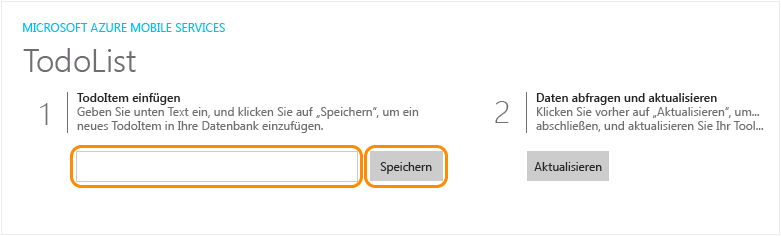
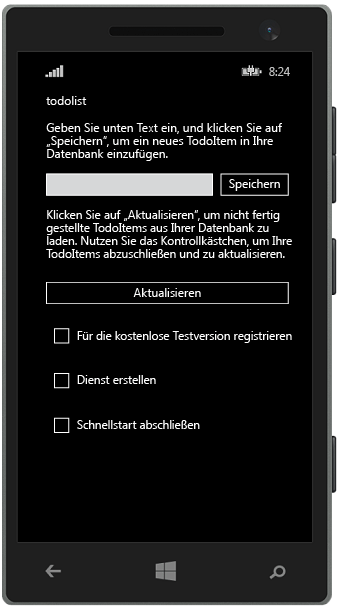

<properties
	pageTitle="Erstellen einer universellen Windows-Runtime 8.1-App auf Azure Mobile Apps"
	description="Befolgen Sie dieses Lernprogramm für die ersten Schritte bei der Verwendung mobiler Azure-App-Back-Ends für die Windows Store-Entwicklung in C#, VB oder JavaScript."
	services="app-service\mobile"
	documentationCenter="windows"
	authors="ggailey777"
	manager="dwrede"
	editor=""/>

<tags
	ms.service="app-service-mobile"
	ms.workload="mobile"
	ms.tgt_pltfrm="mobile-windows"
	ms.devlang="dotnet"
	ms.topic="hero-article"
	ms.date="08/14/2015"
	ms.author="glenga"/>

#Erstellen einer Windows-App

[AZURE.INCLUDE [app-service-mobile-selector-get-started-preview](../../includes/app-service-mobile-selector-get-started-preview.md)]&nbsp;[AZURE.INCLUDE [app-service-mobile-note-mobile-services-preview](../../includes/app-service-mobile-note-mobile-services-preview.md)]

##Übersicht

Dieses Lernprogramm zeigt Ihnen, wie Sie einen cloudbasierten Back-End-Dienst mithilfe eines mobilen Azure-App-Back-Ends zu einer universellen Windows Runtime 8.1-App hinzufügen. Universelle Windows-App-Lösungen beinhalten Projekte für Windows Store 8.1, Windows Phone Store 8.1-Apps und ein gemeinsames, geteiltes Projekt.

[AZURE.INCLUDE [app-service-mobile-windows-universal-get-started-preview](../../includes/app-service-mobile-windows-universal-get-started-preview.md)]

##Voraussetzungen

Für dieses Lernprogramm benötigen Sie Folgendes:

* Ein aktives Azure-Konto. Falls Sie kein Konto besitzen, können Sie sich für eine Azure-Testversion registrieren. So erhalten Sie bis zu 10 kostenlose mobile Apps, die Sie auch nach Ablauf der Testversion weiter nutzen können. Weitere Informationen finden Sie unter [Kostenloses Azure-Testkonto](http://azure.microsoft.com/pricing/free-trial/).

* [Visual Studio Community 2013] oder höher.

>[AZURE.NOTE]Wenn Sie Azure App Service ausprobieren möchten, ehe Sie sich für ein Azure-Konto anmelden, können Sie unter [App Service testen](http://go.microsoft.com/fwlink/?LinkId=523751&appServiceName=mobile) sofort kostenlos eine kurzlebige mobile Starter-App in App Service erstellen. Keine Kreditkarte erforderlich, keine Verpflichtungen.

##Erstellen eines neuen Azure Mobile App-Back-Ends

[AZURE.INCLUDE [app-service-mobile-dotnet-backend-create-new-service-preview](../../includes/app-service-mobile-dotnet-backend-create-new-service-preview.md)]

## Herunterladen des Serverprojekts

1. Klicken Sie im [Azure-Portal] auf **Alle durchsuchen** > **Web-Apps**, und klicken Sie anschließend auf das mobile App-Back-End, das Sie gerade erstellt haben. 

2. Klicken Sie im Mobile App-Back-End auf **Alle Einstellungen**, und klicken Sie unter **Mobile App** auf **Schnellstart** > **Windows (C\#)**.

3. Klicken Sie unter **Herunterladen und Serverprojekt ausführen** in **Neue App erstellen** auf **Herunterladen**, extrahieren Sie die komprimierten Projektdateien auf den lokalen Computer, und öffnen Sie die Projektmappe in Visual Studio.

4. Erstellen Sie das Projekt, um die NuGet-Pakete wiederherzustellen.

##Veröffentlichen des Serverprojekts in Azure

[AZURE.INCLUDE [app-service-mobile-dotnet-backend-publish-service-preview](../../includes/app-service-mobile-dotnet-backend-publish-service-preview.md)]

##Herunterladen und Ausführen des Clientprojekts

Sobald Sie das mobile App-Back-End erstellt haben, können Sie einem einfachen Schnellstart im Azure-Portal folgen, um entweder eine neue App zu erstellen oder eine vorhandene App für die Verbindung zum mobilen App-Back-End zu ändern.

In diesem Abschnitt laden Sie ein universelles Windows-App-Vorlagenprojekt herunter, das zum Herstellen einer Verbindung mit dem Azure-Mobile-App-Back-End angepasst wird.

1. Klicken Sie zurück im Blatt für ihr Mobile App-Back-End auf **Alle Einstellungen**, und klicken Sie unter **Mobile App** auf **Schnellstart** > **Windows (C\#)**. 

2.  Klicken Sie unter **Herunterladen und Windows-Projekt ausführen** in **Neue App erstellen** auf **Herunterladen**, und extrahieren Sie die komprimierten Projektdateien auf den lokalen Computer.
  
3. (Optional) Fügen Sie das universelle Windows-App-Projekt der Projektmappe mit dem Serverprojekt hinzu. Dies erleichtert es, bei Bedarf sowohl die App als auch das Back-End in der gleichen Visual Studio-Projektmappe zu debuggen.

4. Drücken Sie bei einer Windows Store-App als Startprojekt F5, um das Projekt neu zu erstellen, und starten Sie die Windows Store-App.

5. Geben Sie in der App einen beschreibenden Text, zum Beispiel *Complete the tutorial*, unter **Insert a TodoItem** ein. Klicken Sie dann auf **Save**.

	

	Dadurch wird eine POST-Anforderung an das neue in Azure gehostete mobile App-Back-End gesendet.

6. Um das Debuggen zu beenden, klicken Sie mit der rechten Maustaste auf das `<your app name>.WindowsPhone`-Projekt, klicken Sie auf **Als Startprojekt festlegen**, und drücken Sie dann erneut F5.

	

	Beachten Sie, dass nach dem Starten der Windows-App die im vorhergehenden Schritt gespeicherte Daten aus der mobilen App geladen werden.

##Nächste Schritte

* [Hinzufügen von Authentifizierung zur App](app-service-mobile-dotnet-backend-windows-store-dotnet-get-started-users-preview.md)  Informationen über die Authentifizierung von Benutzern der App mit einem Identitätsanbieter.

* [Hinzufügen von Pushbenachrichtigungen zur App](app-service-mobile-dotnet-backend-windows-store-dotnet-get-started-push-preview.md)  Erfahren Sie, wie Sie eine einfache Pushbenachrichtigung an Ihre App senden können.

<!-- Anchors. -->
<!-- Images. -->
<!-- URLs. -->
[Get started with authentication]: app-service-mobile-dotnet-backend-windows-store-dotnet-get-started-users-preview.md
[Mobile App SDK]: http://go.microsoft.com/fwlink/?LinkId=257545
[Azure-Portal]: https://portal.azure.com/

[Visual Studio Community 2013]: https://go.microsoft.com/fwLink/p/?LinkID=534203
 

<!---HONumber=August15_HO8-->