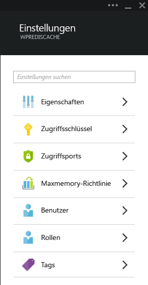
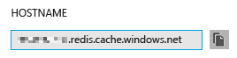
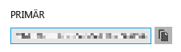
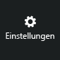
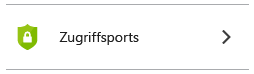
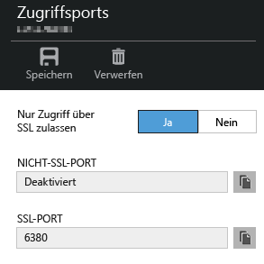
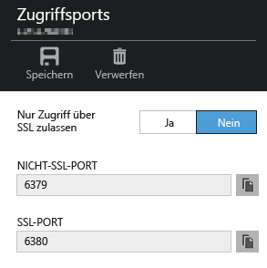

<properties
   pageTitle="Verbinden einer Web-App in Azure App Service mit Redis-Cache über das Memcache-Protokoll | Microsoft Azure"
	description="Verbinden Sie eine Web-App in Azure App Service mit Redis-Cache über das Memcache-Protokoll."
	services="app-service\web"
	documentationCenter="php"
	authors="SyntaxC4"
	manager="wpickett"
	editor="riande"/>

<tags
   ms.service="app-service-web"
	ms.devlang="php"
	ms.topic="get-started-article"
	ms.tgt_pltfrm="windows"
	ms.workload="web"
	ms.date="06/30/2015"
	ms.author="cfowler"/>

# Verbinden einer Web-App in Azure App Service mit Redis-Cache über das Memcache-Protokoll

In diesem Artikel erfahren Sie, wie Sie eine WordPress-Web-App in [Azure App Service](http://go.microsoft.com/fwlink/?LinkId=529714) mithilfe des [Memcache][13]-Protokolls mit [Azure Redis Cache][12] verbinden. Wenn Sie über eine vorhandene Web-App verfügen, die einen Memcached-Server für die Zwischenspeicherung im Arbeitsspeicher verwendet, können Sie diese in Azure App Service migrieren und die Erstanbieter-Lösung für die Zwischenspeicherung in Microsoft Azure mit nur wenigen oder gar keinen Änderungen am Anwendungscode nutzen. Darüber hinaus können Sie Ihre vorhandenen Memcache-Erfahrungen nutzen, um hochgradig skalierbare, verteilte Apps in Azure App Service mit Azure Redis Cache für die Zwischenspeicherung im Arbeitsspeicher zu erstellen und dabei gängige Anwendungsframeworks wie .NET, PHP, Node.js, Java und Python zu verwenden.

App Service-Web-Apps ermöglichen dieses Anwendungsszenario mit dem Web-App-Memcache-Shim, einem lokalen Memcache-Server, der als Memcache-Proxy für die Aufrufe zur Zwischenspeicherung von Azure Redis Cache fungiert. Dadurch kann jede App, die mithilfe des Memcache-Protokolls kommuniziert, Daten mit Redis-Cache zwischenspeichern. Der Memcache-Shim arbeitet auf Protokollebene, damit er von Anwendungen oder Anwendungsframeworks verwendet werden kann, sofern diese mit dem Memcache-Protokoll kommunizieren.

## Voraussetzungen

Der Web-Apps-Memcache-Shim kann mit jeder Anwendung verwendet werden, sofern diese über das Memcache-Protokoll kommuniziert. In diesem speziellen Beispiel ist die Referenzanwendung eine skalierbare WordPress-Website, die aus dem Azure Marketplace bereitgestellt werden kann.

Führen Sie die Schritte in den folgenden Artikeln aus:

* [Bereitstellen einer Instanz des Azure Redis Cache Service][1]
* [Bereitstellen einer skalierbaren WordPress-Website in Azure][0]

Nachdem Sie die skalierbare WordPress-Website und eine Redis-Cache-Instanz bereitgestellt haben, können Sie damit fortfahren, den Memcache-Shim in Azure App Service-Web-Apps zu aktivieren.

## Aktivieren des Web-Apps-Memcache-Shims

Zum Konfigurieren des Memcache-Shims müssen Sie drei Anwendungseinstellungen erstellen. Dies kann auf unterschiedliche Weise erfolgen: im [Azure-Portal](http://go.microsoft.com/fwlink/?LinkId=529715), im [alten Portal][3], mithilfe von [Azure-PowerShell-Cmdlets][5] oder über die [Azure-Befehlszeilenschnittstelle][5]. In diesem Artikel verwende ich das [Azure-Portal][4] zum Festlegen der Anwendungseinstellungen. Die folgenden Werte können vom Blatt **Einstellungen** Ihrer Redis Cache-Instanz abgerufen werden.



### Hinzufügen der Anwendungseinstellung REDIS\_HOST

Die erste Anwendungseinstellung, die Sie erstellen müssen, ist die Anwendungseinstellung **REDIS\_HOST**. Diese Einstellung legt das Ziel fest, an das der Shim Cacheinformationen weiterleitet. Der erforderliche Wert für die Anwendungseinstellung REDIS\_HOST kann auf dem Blatt **Eigenschaften** Ihrer Redis Cache-Instanz abgerufen werden.



Legen Sie den Schlüssel der Anwendungseinstellung auf **REDIS\_HOST** und den Wert der Einstellung auf den Hostnamen der Redis Cache-Instanz fest.


### Hinzufügen der Anwendungseinstellung REDIS\_KEY

Die zweite Anwendungseinstellung, die Sie erstellen müssen, ist die Anwendungseinstellung **REDIS\_KEY**. Diese Einstellung stellt das Authentifizierungstoken für den sicheren Zugriff auf die Redis-Cache-Instanz bereit. Der erforderliche Wert für die App-Einstellung REDIS\_KEY kann auf dem Blatt **Zugriffsschlüssel** Ihrer Redis Cache-Instanz abgerufen werden.



Legen Sie den Schlüssel der Anwendungseinstellung auf **REDIS\_KEY** und den Wert der Einstellung auf den Primärschlüssel der Redis Cache-Instanz fest.


### Hinzufügen der Anwendungseinstellung MEMCACHESHIM\_REDIS\_ENABLE

Die letzte App-Einstellung wird verwendet, um den Memcache-Shim in Web-Apps zu aktivieren. Dieser verwendet REDIS\_HOST und REDIS\_KEY, um eine Verbindung mit dem Azure Redis Cache herzustellen und die Cacheaufrufe weiterzuleiten. Legen Sie den Schlüssel der Anwendungseinstellung auf **MEMCACHESHIM\_REDIS\_ENABLE** und den Wert auf **true** fest.


Wenn Sie die drei Anwendungseinstellungen hinzugefügt haben, klicken Sie auf **Speichern**.

## Aktivieren der Memcache-Erweiterung für PHP

Damit die Anwendung über das Memcache-Protokoll kommunizieren kann, muss die Memcache-Erweiterung für PHP (Sprachen-Framework für Ihre WordPress-Website) installiert werden.

### Herunterladen der php\_memcache-Erweiterung

Navigieren Sie zu [PECL][6]. Klicken Sie unter der Kategorie für das Zwischenspeichern auf [memcache][7]. Klicken Sie in der Spalte mit den Downloads auf den DLL-Link.


Laden Sie das Ziel des x86-Links zum Non-Thread Safe (NTS) für Ihre in Web-Apps aktivierte Version von PHP herunter. (Die Standardeinstellung ist PHP 5.4)


### Aktivieren der php\_memcache-Erweiterung

Extrahieren Sie die Datei **php\_memcache.dll** nach dem Herunterladen, und laden Sie sie in das Verzeichnis **d:\\home\\site\\wwwroot\\bin\\ext\** hoch. Nachdem die Datei „php\_memcache.dll“ in die Web-App hochgeladen wurde, muss die Erweiterung für die PHP-Laufzeit aktiviert werden. Öffnen Sie zum Aktivieren der Memcache-Erweiterung im Azure-Portal das Blatt **Anwendungseinstellungen** für die Web-App, und fügen Sie eine neue Anwendungseinstellung mit dem Schlüssel **PHP\_EXTENSIONS** und dem Wert **bin\\ext\\php\_memcache.dll** hinzu.


> [AZURE.NOTE]Wenn die Web-App mehrere PHP-Erweiterungen laden muss, sollte der Wert von PHP\_EXTENSIONS eine durch Kommas getrennte Liste von relativen Pfaden zu DLL-Dateien sein.


Klicken Sie, wenn Sie fertig sind, auf **Speichern**.

## Installieren des Memcache-WordPress-Plug-Ins

> [AZURE.NOTE]Sie können das [Memcached Object-Plug-In](https://wordpress.org/plugins/memcached/) auch von „WordPress.org“ herunterladen.

Klicken Sie auf der Seite mit den WordPress-Plug-Ins auf die Schaltfläche **Neues hinzufügen**.


Geben Sie im Suchfeld **memcached** ein, und drücken Sie die EINGABETASTE.


Suchen Sie in der Liste nach **Memcached Object Cache**, und klicken Sie dann auf **Jetzt installieren**.


### Aktivieren des Memcache WordPress-Plug-Ins

>[AZURE.NOTE]Befolgen Sie die Anweisungen in diesem Blog unter [Aktivieren von Websiteerweiterungen in Web-Apps][8], um Visual Studio Online zu installieren.

Fügen Sie in der Datei `wp-config.php` den folgenden Code über dem Kommentar zum Ende des Bearbeitungsbereichs nahe dem Ende der Datei ein.

```php
$memcached_servers = array(
	'default' => array('localhost:' . getenv("MEMCACHESHIM_PORT"))
);
```

Wenn dieser Code eingefügt wurde, speichert Monaco das Dokument automatisch.

Im nächsten Schritt wird das Object-Cache-Plug-In aktiviert. Dazu wird die Datei **object-cache.php** per Drag & Drop aus dem Ordner **wp-content/memcached** in den Ordner **wp-content** kopiert, um die Funktionen des Memcached Object Cache zu aktivieren.


Wenn sich die Datei **object-cache.php** im Ordner **wp-content** befindet, ist der Memcached Object Cache aktiviert.


## Überprüfen der Funktion des Memcached Object Cache-Plug-Ins

Alle Schritte zum Aktivieren des Web-Apps-Memcache-Shims sind damit abgeschlossen. Der letzte Schritt besteht darin, sicherzustellen, dass Ihre Redis-Cache-Instanz mit Daten aufgefüllt wird.

### Aktivieren der Nicht-SSL-Port-Unterstützung in Azure Redis Cache

>[AZURE.NOTE]Zum Zeitpunkt der Erstellung dieses Artikels unterstützt die Redis-Befehlszeilenschnittstelle keine SSL-Verbindungen, daher sind die folgenden Schritte erforderlich.

Navigieren Sie im Azure-Portal zur Redis-Cache-Instanz, die Sie für diese Web-App erstellt haben. Wenn das Blatt des Caches angezeigt wird, klicken Sie auf das Symbol **Einstellungen**.



Wählen Sie aus der Liste **Access Ports** aus.



Klicken Sie unter **Allow access only via SSL** auf **Nein**.



Es wird angezeigt, dass der Nicht-SSL-Port nun geöffnet ist. Klicken Sie auf **Speichern**.



### Herstellen einer Verbindung mit dem Azure Redis Cache von Redis-CLI

>[AZURE.NOTE]Dieser Schritt setzt voraus, dass Redis lokal auf dem Entwicklungscomputer installiert ist. [Installieren Sie Redis lokal mithilfe dieser Anweisungen][9].

Öffnen Sie die Befehlszeilenkonsole Ihrer Wahl, und geben Sie den folgenden Befehl ein:

```shell
redis-cli –h <hostname-for-redis-cache> –a <primary-key-for-redis-cache> –p 6379
```

Ersetzen Sie **<hostname-for-redis-cache>** durch den tatsächlichen Hostnamen "xxxxx.redis.cache.windows.net" und **<primary-key-for-redis-cache>** durch den Zugriffsschlüssel für den Cache, und drücken Sie dann die EINGABETASTE. Sobald die CLI eine Verbindung mit der Redis-Cache-Instanz hergestellt hat, übermitteln Sie einen beliebigen Redis-Befehl. Im Screenshot unten liste ich die Schlüssel auf.


Der Aufruf zum Auflisten der Schlüssel sollte einen Wert zurückgeben. Wenn dies nicht der Fall ist, navigieren Sie zur Web-App, und versuchen Sie es erneut.

## Zusammenfassung

Glückwunsch! Die WordPress-App verfügt jetzt über einen zentralen Cache im Arbeitsspeicher zur Unterstützung eines erhöhten Durchsatzes. Beachten Sie, dass der Web-Apps-Memcache-Shim mit jedem Memcache-Client verwendet werden kann, unabhängig von der Programmiersprache oder dem Anwendungsframework. Feedback oder Fragen zum Web-Apps-Memcache-Shim können Sie in den [MSDN-Foren][10] oder bei [Stackoverflow][11] veröffentlichen.

>[AZURE.NOTE]Wenn Sie Azure App Service ausprobieren möchten, ehe Sie sich für ein Azure-Konto anmelden, können Sie unter [App Service testen](http://go.microsoft.com/fwlink/?LinkId=523751) sofort kostenlos eine kurzlebige Starter-Web-App in App Service erstellen. Keine Kreditkarte erforderlich, keine Verpflichtungen.

## Änderungen
* Hinweise zur Änderung von Websites zu App Service finden Sie unter: [Azure App Service und seine Auswirkungen auf vorhandene Azure-Dienste](http://go.microsoft.com/fwlink/?LinkId=529714).
* Hinweise zu den Veränderungen des neuen Portals gegenüber dem alten finden Sie unter [Referenz zur Navigation im Azure-Portal](http://go.microsoft.com/fwlink/?LinkId=529715)


[0]: http://bit.ly/1F0m3tw
[1]: http://bit.ly/1t0KxBQ
[2]: http://manage.windowsazure.com
[3]: http://portal.azure.com
[4]: ../powershell-install-configure.md
[5]: /downloads
[6]: http://pecl.php.net
[7]: http://pecl.php.net/package/memcache
[8]: http://blog.syntaxc4.net/post/2015/02/05/how-to-enable-a-site-extension-in-azure-websites.aspx
[9]: http://redis.io/download#installation
[10]: https://social.msdn.microsoft.com/Forums/home?forum=windowsazurewebsitespreview
[11]: http://stackoverflow.com/questions/tagged/azure-web-sites
[12]: /services/cache/
[13]: http://memcached.org

<!---HONumber=September15_HO1-->