<properties
	pageTitle="Erstellen einer ASP.NET-Web-App in Azure App Service | Microsoft Azure"
	description="In diesem Lernprogramm erfahren Sie, wie Sie ein ASP.NET-Webprojekt in Visual Studio 2013 erstellen und in einer Web-App in Azure App Service bereitstellen."
	services="app-service\web"
	documentationCenter=".net"
	authors="tdykstra"
	manager="wpickett"
	editor="jimbe"/>

<tags
	ms.service="app-service-web"
	ms.workload="web"
	ms.tgt_pltfrm="na"
	ms.devlang="dotnet"
	ms.topic="hero-article"
	ms.date="08/10/2015"
	ms.author="tdykstra"/>

# Erstellen von ASP.NET-Web-Apps in Azure App Service

> [AZURE.SELECTOR]
- [.Net](web-sites-dotnet-get-started.md)
- [Node.js](web-sites-nodejs-develop-deploy-mac.md)
- [Java](web-sites-java-get-started.md)
- [PHP - Git](web-sites-php-mysql-deploy-use-git.md)
- [PHP - FTP](web-sites-php-mysql-deploy-use-ftp.md)
- [Python](web-sites-python-ptvs-django-mysql.md)

## Übersicht

In diesem Lernprogramm wird die Erstellung einer ASP.NET-Webanwendung und deren Bereitstellung in einer [Web-App in Azure App Service](app-service-web-overview.md) mit Visual Studio 2015 oder Visual Studio 2013 gezeigt. Das Lernprogramm geht davon aus, dass Sie noch keine Erfahrung mit der Verwendung von Azure haben. Nach Abschluss des Lernprogramms verfügen Sie über eine einfache Webanwendung, die in der Cloud ausgeführt wird.

In der folgenden Abbildung wird die fertige Anwendung dargestellt:

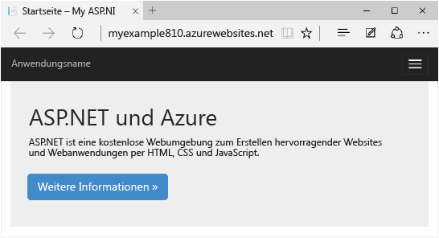

Sie lernen Folgendes:

* Ermöglichen der Azure-Entwicklung auf Ihrem Computer durch Installieren des Azure SDK
* Erstellen eines Visual Studio ASP.NET-Webprojekts und Bereitstellen für eine Azure-Web-App
* Vornehmen von Änderungen am Webprojekt und erneute Bereitstellung der Anwendung
* Verwenden des [Azure-Portals](/overview/preview-portal/) zum Überwachen und Verwalten der Web-App

##Anmelden bei Microsoft Azure

Sie benötigen ein Windows Azure-Konto, um dieses Lernprogramm durchführen zu können. Sie können Folgendes ausführen:

* [Kostenloses Anlegen eines Azure-Kontos](/pricing/free-trial/?WT.mc_id=A261C142F). Sie erhalten ein Guthaben, mit dem Sie andere kostenpflichtige Azure-Dienste ausprobieren können. Selbst, nachdem Sie dieses Guthaben aufgebraucht haben, können Sie das Konto behalten und kostenlose Azure-Dienste und -Features nutzen, z. B. das Web-Apps-Feature in Azure App Service.
* [Aktivieren der Vorteile für MSDN-Abonnenten](/pricing/member-offers/msdn-benefits-details/?WT.mc_id=A261C142F). Ihr MSDN-Abonnement beinhaltet ein monatliches Guthaben, das Sie für zahlungspflichtige Azure-Dienste verwenden können.

> [AZURE.NOTE]Wenn Sie Azure App Service ausprobieren möchten, ehe Sie sich für ein Azure-Konto anmelden, besuchen Sie [ Azure App Service testen](http://go.microsoft.com/fwlink/?LinkId=523751). Dort können Sie direkt eine kurzzeitige Start-Web-App in App Service erstellen – keine Kreditkarte erforderlich, keine weiteren Verpflichtungen.

In diesem Video zeigt Scott Hanselman, wie einfach Sie sich für eine kostenlose Testversion von Microsoft Azure anmelden können. (Dauer: 1:58)

> [AZURE.VIDEO sign-up-for-microsoft-azure]

[AZURE.INCLUDE [install-sdk-2015-2013](../../includes/install-sdk-2015-2013.md)]

## Erstellen eines Projekts und einer Web-App

Der erste Schritt besteht darin, ein Webprojekt in Visual Studio und eine Web-App in Azure App Service zu erstellen. Wenn Sie damit fertig sind, werden Sie das Projekt der Web-App bereitstellen, um es im Internet verfügbar zu machen.

Das Diagramm veranschaulicht Ihre Schritte bei der Erstellung und Bereitstellung.

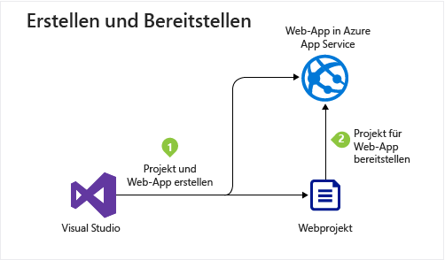

1. Öffnen Sie Visual Studio 2015 oder Visual Studio 2013.

	Wenn Sie Visual Studio 2013 verwenden, weichen die Bildschirme geringfügig von den Screenshots ab, die Verfahren sind jedoch im Wesentlichen identisch.

2. Klicken Sie im Menü **Datei** auf **Neu > Projekt**.

3. Klicken Sie im Dialogfeld **Neues Projekt** auf **C# > Web > ASP.NET-Webanwendung**. Bei Bedarf können Sie auch **Visual Basic** verwenden.

3. Stellen Sie sicher, dass als Zielframework **.NET Framework 4.5.2** ausgewählt ist.

4.  [Azure Application Insights](app-insights-overview.md) überwacht Ihre Web-App auf Verfügbarkeit, Leistung und Nutzung. Deaktivieren Sie das Kontrollkästchen **Application Insights zum Projekt hinzufügen**, wenn Sie die Funktion nicht ausprobieren möchten.

4. Nennen Sie die Anwendung **MyExample**.

5. Klicken Sie auf **OK**.

	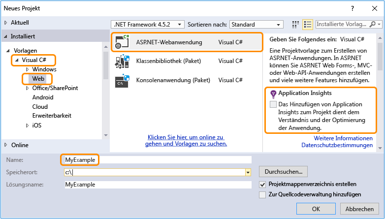

5. Wählen Sie im Dialogfeld **Neues ASP.NET-Projekt** die Vorlage **MVC** aus.

	[MVC](http://www.asp.net/mvc) ist ein ASP.NET-Framework zum Entwickeln von Web-Apps.

7. Klicken Sie auf **Authentifizierung ändern**.

	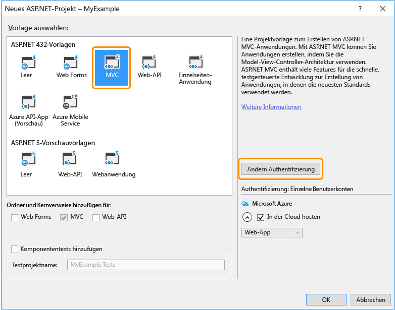

6. Klicken Sie im Dialogfeld **Authentifizierung ändern** auf **Keine Authentifizierung** und dann auf **OK**.

	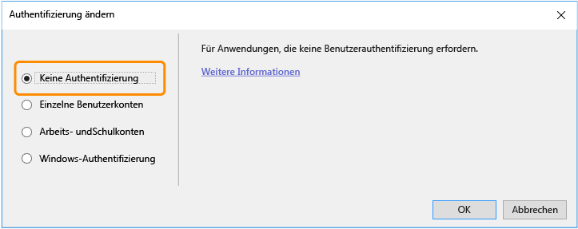

	Die von Ihnen erstellte Beispielanwendung erlaubt keine Anmeldung durch Benutzer. Der Abschnitt [Nächste Schritte](#next-steps) enthält einen Link zu einem Lernprogramm, in dem die Authentifizierung und Autorisierung implementiert werden.

5. Lassen Sie im Dialogfeld **Neues ASP.NET-Projekt** die Einstellungen für **Microsoft Azure** unverändert, und klicken Sie dann auf **OK**.

	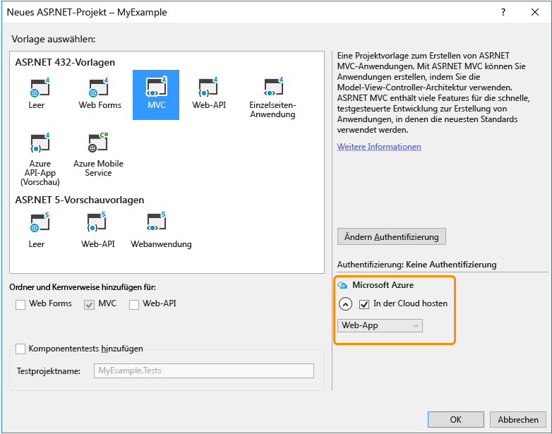

	Mit den Standardeinstellungen wird angegeben, dass eine Azure-Web-App für das Webprojekt von Visual Studio erstellt wird. Im nächsten Abschnitt dieses Lernprogramms stellen Sie das Webprojekt für die neu erstellte Web-App bereit.

5. Falls Sie sich noch nicht bei Azure angemeldet haben, werden Sie von Visual Studio dazu aufgefordert, dies nachzuholen. Melden Sie sich mit der ID und dem Kennwort des Kontos an, mit dem Sie Ihr Azure-Abonnement verwalten.

	Wenn Sie angemeldet sind, werden Sie im Dialogfeld **Configure Microsoft Azure Web App Settings** gefragt, welche Ressourcen Sie erstellen möchten.

	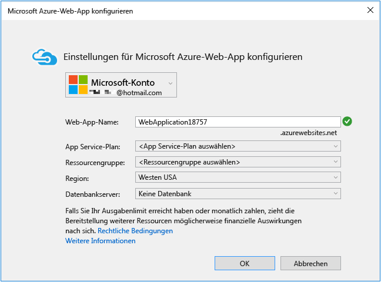

3. Geben Sie im Dialogfeld **Microsoft Azure-Web-App-Einstellungen konfigurieren** einen **Web-App-Namen** ein, der in der Domäne *azurewebsites.net* eindeutig ist. Beispielsweise können Sie sie "MyExample" nennen und Zahlen anhängen, damit der Name eindeutig ist, z. B. "MyExample810". Wenn ein Standardwebname für Sie erstellt wird, ist dieser eindeutig und Sie können ihn verwenden.

	Wenn eine andere Person den eingegebenen Namen bereits verwendet hat, wird rechts ein rotes Ausrufungszeichen anstelle eines grünen Häkchens angezeigt, und Sie müssen einen anderen Namen eingeben.

	Dieser Name wird von Azure als Präfix für die URL Ihrer Anwendung verwendet. Die vollständige URL besteht aus diesem Namen und *.azurewebsites.net* (wie neben dem Textfeld **Web-App-Name** angezeigt). Für den Namen `MyExample810` lautet die URL z. B. `MyExample810.azurewebsites.net`. Die URL muss eindeutig sein.

4. Wählen Sie in der Dropdownliste **App Service plan** die Option **Create new App Service plan** aus.

	Der Abschnitt [Nächste Schritte](#next-steps) enthält Links zu Informationen über App Service-Pläne.

5. Geben Sie **MyExamplePlan** oder einen Namen Ihrer Wahl für den Plan ein.

6. Wählen Sie in der Dropdownliste **Ressourcengruppe** die Option **Neue Ressourcengruppe erstellen** aus.

	Der Abschnitt [Nächste Schritte](#next-steps) enthält Links zu Informationen über Ressourcengruppen.

5. Geben Sie **MyExampleGroup** oder einen anderen Namen für die Ressourcengruppe ein.

5. Wählen Sie in der Dropdownliste **Region** den am nächsten befindlichen Ort aus.

	Mit dieser Einstellung wird das Azure-Datencenter angegeben, in dem Ihre Web-App ausgeführt wird. In diesem Lernprogramm können Sie ohne spürbaren Unterschied eine beliebige Region auswählen. Aber für eine Produktions-Web-App sollte sich der Webserver so nah wie möglich an den Browsern befinden, die auf die Website zugreifen, um die [Latenzzeiten](http://www.bing.com/search?q=web%20latency%20introduction&qs=n&form=QBRE&pq=web%20latency%20introduction&sc=1-24&sp=-1&sk=&cvid=eefff99dfc864d25a75a83740f1e0090) zu minimieren.

5. Verändern Sie das Datenbankfeld nicht.

	Für dieses Lernprogramm verwenden Sie keine Datenbank. Der Abschnitt [Nächste Schritte](#next-steps) verweist auf ein Tutorial, in dem die Verwendung einer Datenbank erläutert wird.

6. Klicken Sie auf **OK**.

	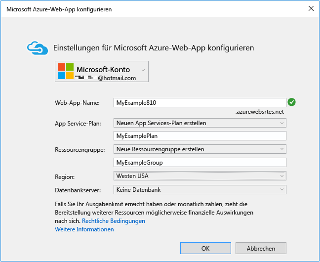

	Das Webprojekt wird von Visual Studio innerhalb weniger Sekunden in dem angegebenen Ordner erstellt. Auch die Web-App wird in der angegebenen Azure-Region erstellt.

	Im Fenster **Projektmappen-Explorer** werden die Dateien und Ordner in dem neuen Projekt angezeigt.

	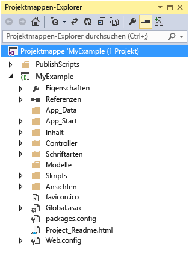

	Im Fenster **Azure App Service Activity** wird angegeben, dass die Web-App erstellt wurde.

	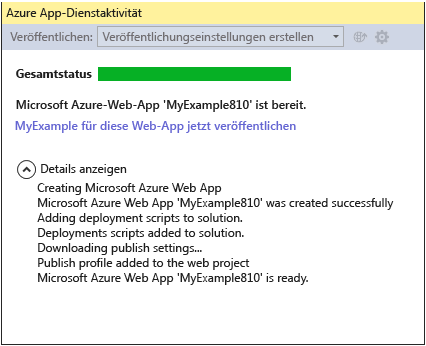

	Und Sie können die Web-App im **Server-Explorer** sehen.

	

## Bereitstellen des Projekts in der Web-App

In diesem Abschnitt stellen Sie das Webprojekt in der Web-App bereit (siehe Schritt 2 in der Abbildung).

7. Klicken Sie im Fenster **Azure App Service Activity** auf **Publish MyExample to this Web App now**.

	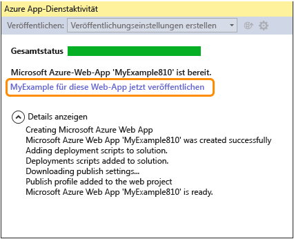

	Wenige Sekunden später wird der Assistent **Web veröffentlichen** geöffnet.

	Die Einstellungen, die Visual Studio benötigt, um Ihr Projekt in Azure bereitzustellen, wurden in einem *Veröffentlichungsprofil* gespeichert. Mithilfe des Assistenten können Sie diese Einstellungen überprüfen und ändern.

8. Klicken Sie auf der Registerkarte **Verbindung** des Assistenten **Web veröffentlichen** auf **Weiter**.

	Visual Studio bietet alle Einstellungen, die Sie Ihrer Azure-Web-App bereitstellen müssen.

	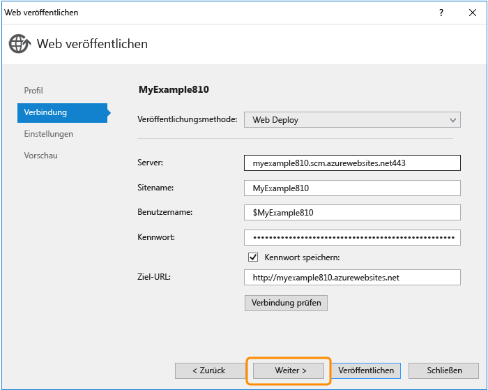

10. Klicken Sie auf der Registerkarte **Einstellungen** auf **Weiter**.

	Sie können die Standardwerte für **Konfiguration** und **File Publish Options** übernehmen.

	In der Dropdownliste **Konfiguration** können Sie einen Debugbuild für das Remotedebuggen bereitstellen. Der Abschnitt [Nächste Schritte](#next-steps) enthält einen Link zu einem Lernprogramm, in dem das Remoteausführen von Visual Studio im Debugmodus demonstriert wird.

	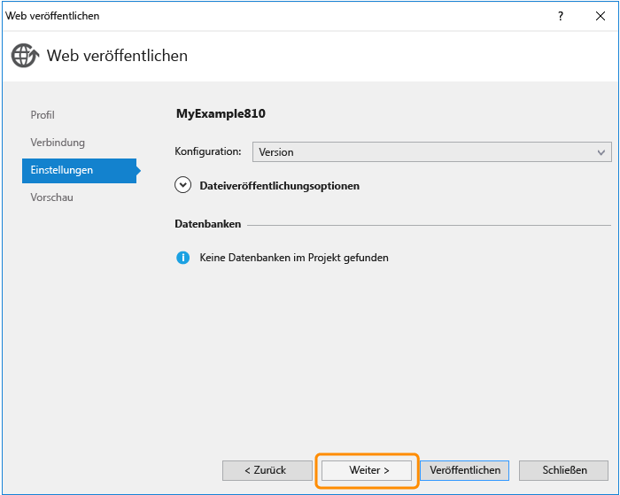

11. Klicken Sie auf der Registerkarte **Vorschau** auf **Veröffentlichen**.

	Um festzustellen, welche Dateien in Azure kopiert werden, können Sie auf **Vorschau starten** klicken, bevor Sie auf **Veröffentlichen** klicken.

	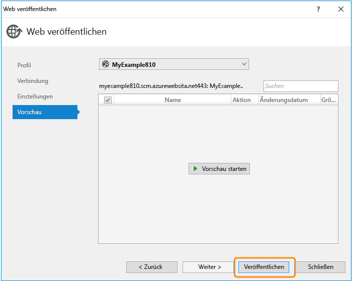

	Die Dateien werden von Visual Studio auf den Azure-Server kopiert.

	In den Fenstern **Ausgabe** und **Azure App Service Activity** wird angezeigt, welche Bereitstellungsaktionen ausgeführt wurden, und es wird die erfolgreiche Durchführung der Bereitstellung gemeldet.

	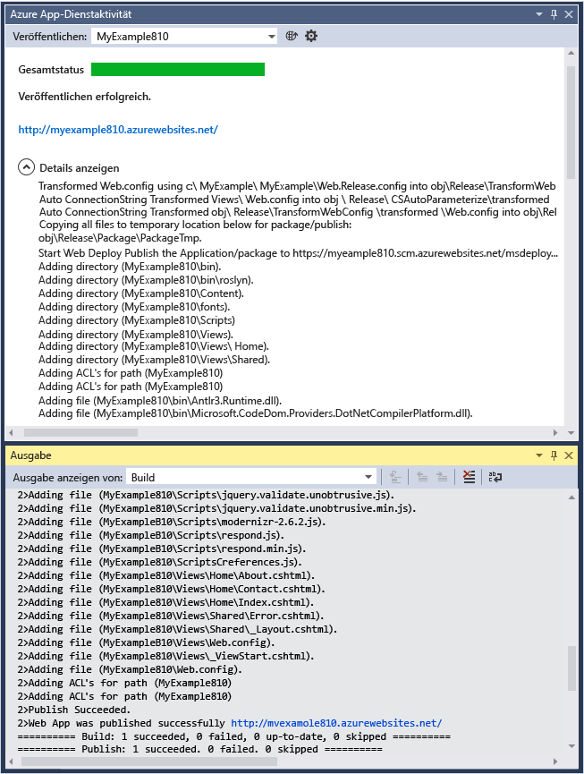

	Nach der erfolgreichen Bereitstellung wird die URL der bereitgestellten Web-App automatisch im Standardbrowser geöffnet, und die erstellte Anwendung wird jetzt in der Cloud ausgeführt. Die URL in der Adressleiste des Browsers gibt an, dass die Web-App aus dem Internet geladen wird.

	

13. Schließen Sie den Browser.

## Vornehmen von Änderungen und erneutes Bereitstellen

Dieser Abschnitt des Tutorials ist optional. In diesem Abschnitt ändern Sie die **h1**-Überschrift der Startseite, führen das Projekt lokal auf dem Entwicklungscomputer aus, um die Änderung zu prüfen, und stellen diese dann in Azure bereit.

2. Öffnen Sie die Datei **Views/Home/Index.cshtml** oder **.vbhtml** im **Projektmappen-Explorer**, ändern Sie die Überschrift **h1** von "ASP.NET" in "ASP.NET and Azure", und speichern Sie die Datei.

	

	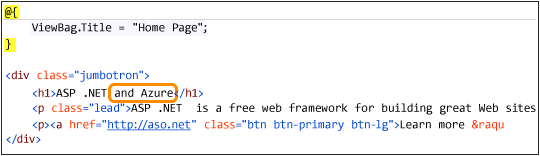

1. Drücken Sie STRG+F5, um die geänderte Überschrift anzuzeigen, indem Sie die Web-App auf dem lokalen Computer ausführen.

	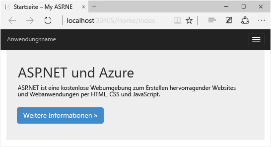

	Die URL `localhost` zeigt an, dass die Web-App auf dem lokalen Computer ausgeführt wird. Standardmäßig erfolgt die Ausführung in IIS Express, einer im Umfang eingeschränkten Version von IIS, die für die Entwicklung von Webanwendungen konzipiert wurde.

1. Schließen Sie den Browser.

1. Klicken Sie im Projektmappen-Explorer mit der rechten Maustaste auf das Projekt, und wählen Sie **Veröffentlichen** aus.

	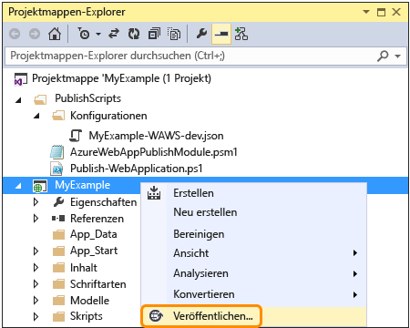

	Die Registerkarte **Vorschau** im Assistenten **Web veröffentlichen** wird angezeigt. Wenn Sie Veröffentlichungseinstellungen ändern mussten, können Sie eine andere Registerkarte auswählen. Nun ist es jedoch völlig ausreichend, die erneute Bereitstellung mit denselben Einstellungen auszuführen.

2. Klicken Sie im Assistenten **Web veröffentlichen** auf **Veröffentlichen**.

	

	Das Projekt wird von Visual Studio für Azure bereitgestellt, und die Web-App wird im Standardbrowser geöffnet.

	

**Tipp:** Für eine noch schnellere Bereitstellung können Sie die Symbolleiste **Webveröffentlichung mit einem Klick** aktivieren. Klicken Sie auf **Ansicht > Symbolleisten**, und wählen Sie dann **Webveröffentlichung mit einem Klick** aus. In der Symbolleiste können Sie ein Profil auswählen, auf eine Schaltfläche zum Veröffentlichen klicken oder auf eine Schaltfläche klicken, um den Assistenten **Web veröffentlichen** zu öffnen.

## Überwachen und Verwalten der Web-App im Azure-Portal

Das [Azure-Portal](/services/management-portal/) ist eine Weboberfläche, die das Verwalten und Überwachen Ihrer Azure-Dienste ermöglicht, z. B. der soeben erstellten Web-App. In diesem Abschnitt des Lernprogramms erfahren Sie, was Sie im Portal durchführen können.

1. Rufen Sie in Ihrem Browser [https://portal.azure.com](https://portal.azure.com) auf, und melden Sie sich mit Ihren Azure-Anmeldeinformationen an.

2. Klicken Sie auf **Alle durchsuchen > Web-Apps** und dann auf den Namen der Web-App.

	Auf dem Blatt **Web-App** wird eine Übersicht über die Einstellungen und eine Nutzungsstatistik für Ihre Web-App angezeigt.

	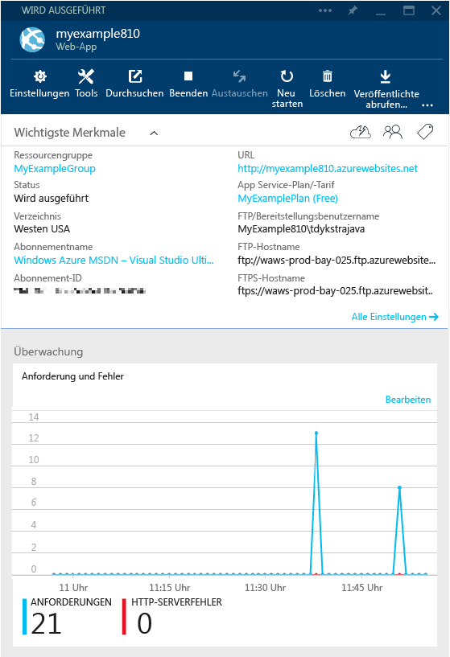

	Bisher gab es in Ihrer Web-App kaum Datenverkehr, daher wird in der Übersicht möglicherweise nichts angezeigt. Wenn Sie Ihre Anwendung aufrufen, aktualisieren Sie die Seite mehrmals, und aktualisieren Sie anschließend die Portalseite. Nun sollte eine Statistik angezeigt werden.

3. Klicken Sie auf **Einstellungen**, um weitere Optionen zum Konfigurieren der Web-App anzuzeigen.

	Es wird eine Liste der verschiedenen Einstellungstypen angezeigt.

	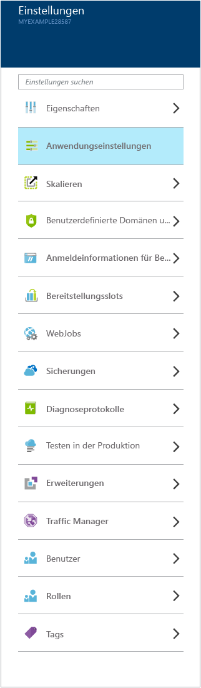

4. Klicken Sie auf **Anwendungseinstellungen**, um ein Beispiel für die verschiedenen Einstellungen anzuzeigen, die Sie im Portal konfigurieren können.

	Sie können beispielsweise die für die Web-App verwendete .NET-Version festlegen, Funktionen wie [WebSockets](/blog/2013/11/14/introduction-to-websockets-on-windows-azure-web-sites/) aktivieren und die [Werte für Verbindungszeichenfolgen](/blog/2013/07/17/windows-azure-web-sites-how-application-strings-and-connection-strings-work/) festlegen.

	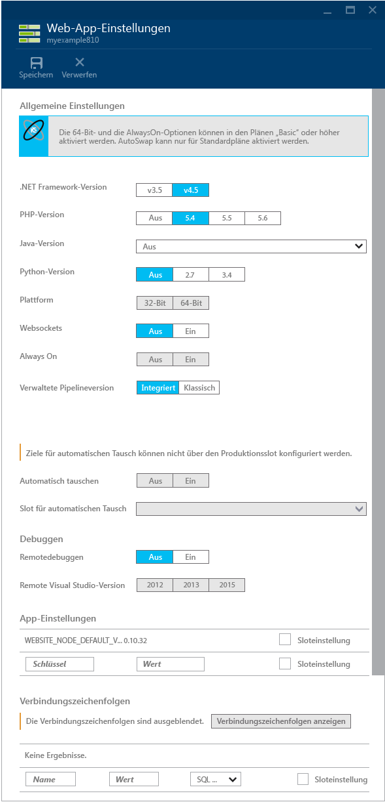

Dies sind nur einige Funktionen des Portals. Sie können neue Web-Apps erstellen, vorhandene Web-Apps löschen, Web-Apps anhalten und neu starten und andere Azure-Dienste verwalten, z. B. Datenbanken und virtuelle Computer.

## Nächste Schritte

In diesem Lernprogramm haben Sie erfahren, wie eine einfache Webanwendung erstellt und in einer Azure-Web-App bereitgestellt wird. In den folgenden Themen und Ressourcen finden Sie weitere Informationen zu Web-Apps in Azure App Service.

* Andere Möglichkeiten für die Bereitstellung eines Webprojekts

	In diesem Lernprogramm wurde die schnellste Methode zum Erstellen und Bereitstellen einer Web-App in einem einzigen Vorgang erläutert. Eine Übersicht über andere Möglichkeiten der Bereitstellung mit Visual Studio oder durch die [Automatisierung der Bereitstellung](http://www.asp.net/aspnet/overview/developing-apps-with-windows-azure/building-real-world-cloud-apps-with-windows-azure/continuous-integration-and-continuous-delivery) über ein [Quellcode-Verwaltungssystem](http://www.asp.net/aspnet/overview/developing-apps-with-windows-azure/building-real-world-cloud-apps-with-windows-azure/source-control) finden Sie unter [Bereitstellen von Azure-Web-Apps](web-sites-deploy.md).

	Visual Studio kann auch Windows PowerShell-Skripte generieren, mit deren Hilfe Sie die Bereitstellung automatisieren können. Weitere Informationen finden Sie unter [Automate Everything (Building Real-World Cloud Apps with Azure)](http://www.asp.net/aspnet/overview/developing-apps-with-windows-azure/building-real-world-cloud-apps-with-windows-azure/automate-everything) (in englischer Sprache).

* Verwalten von Web-Apps in Visual Studio

	Informationen zu den verfügbaren Web-App-Verwaltungsfunktionen im **Server-Explorer** finden Sie unter [Problembehandlung von Azure-Web-Apps in Visual Studio](web-sites-dotnet-troubleshoot-visual-studio.md).

* Problembehandlung für eine Web-App

	Visual Studio enthält Funktionen, die die Anzeige von Azure-Protokollen vereinfachen, da sie in Echtzeit erstellt werden. Darüber hinaus ist die Ausführung in Azure remote im Debugmodus möglich. Weitere Informationen finden Sie unter [Problembehandlung von Azure-Web-Apps in Visual Studio](web-sites-dotnet-troubleshoot-visual-studio.md).

* Hinzufügen von Datenbank- und Autorisierungsfunktionalität

	Ein Lernprogramm mit Anleitungen bezüglich Datenbankzugriff und Einschränkung einiger Anwendungsfunktionen auf autorisierte Benutzer finden Sie unter [Bereitstellen einer sicheren ASP.NET MVC-Anwendung mit Mitgliedschaft, OAuth und einer SQL-Datenbank für eine Azure-Web-App](/develop/net/tutorials/web-site-with-sql-database/).

* So fügen Sie einen benutzerdefinierten Domänennamen und SSL hinzu

	Informationen zur Verwendung von SSL und einer eigenen Domäne (z. B. www.contoso.com statt contoso.azurewebsites.net) finden Sie in den folgenden Ressourcen:

	* [Konfigurieren eines benutzerdefinierten Domänennamens in Azure App Service](web-sites-custom-domain-name.md)
	* [Aktivieren von HTTPS für Azure-Web-Apps](web-sites-configure-ssl-certificate.md)

* Vermeiden von Wartezeiten nach Leerlaufzeiten

	Standardmäßig werden Web-Apps entladen, wenn sie einige Zeit im Leerlauf waren. Bei der ersten Anforderung nach dem Entladen einer Web-App muss gewartet werden, bis die Web-App neu geladen wurde. Zur Vermeidung von Wartezeiten können Sie das Feature "Always On" aktivieren. Weitere Informationen dazu finden Sie unter den Konfigurationsoptionen in [Konfigurieren von Web-Apps](web-sites-configure.md).

* Hinzufügen von Echtzeitfunktionen wie Chat

	Wenn Ihre Web-App Echtzeitfunktionen (Chat-Dienste, Spiele, Börsenticker usw.) enthalten soll, erreichen Sie die beste Performance durch die Verwendung von [ASP.NET SignalR](http://www.asp.net/signalr) mit der Transportmethode [WebSockets](/blog/2013/11/14/introduction-to-websockets-on-windows-azure-web-sites/). Weitere Informationen finden Sie unter [Using SignalR with Web Apps in Azure App Service](http://www.asp.net/signalr/overview/signalr-20/getting-started-with-signalr-20/using-signalr-with-windows-azure-web-sites) (in englischer Sprache).

* Auswählen zwischen App Service, Azure Cloud Services und Azure Virtual Machines für Webanwendungen

	In Azure können Sie Webanwendungen in App Service-Web-Apps (wie in diesem Lernprogramm gezeigt), in Cloud Services oder in Virtual Machines ausführen. Weitere Informationen finden Sie unter [Azure Web-Apps, Cloud Services und Virtual Machines im Vergleich](/manage/services/web-sites/choose-web-app-service/).

* [Auswählen oder Erstellen eines App Service-Plans](../app-service/azure-web-sites-web-hosting-plans-in-depth-overview.md)

* [Auswählen oder Erstellen einer Ressourcengruppe](../azure-preview-portal-using-resource-groups.md)

## Änderungen
* Hinweise zu den Veränderungen von Websites zum App Service finden Sie unter [Azure App Service und vorhandene Azure-Dienste](http://go.microsoft.com/fwlink/?LinkId=529714).
* Hinweise zu den Veränderungen des neuen Portals gegenüber dem alten finden Sie unter [Referenz zur Navigation im Azure-Portal](http://go.microsoft.com/fwlink/?LinkId=529715).

<!---HONumber=Sept15_HO4-->