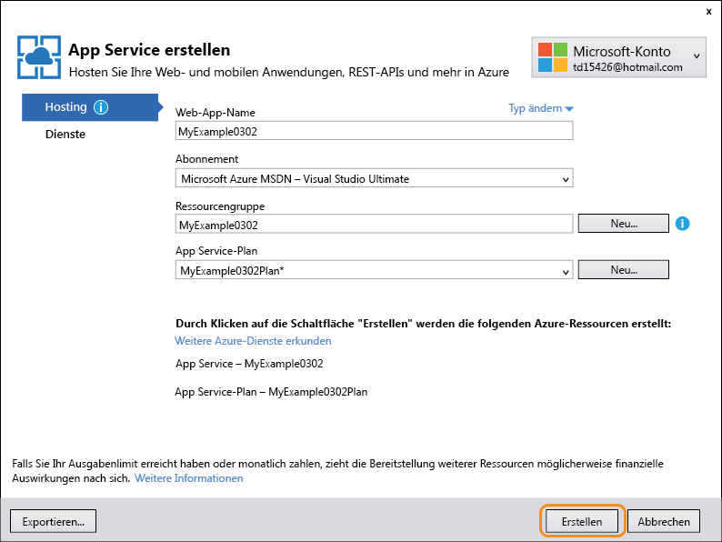
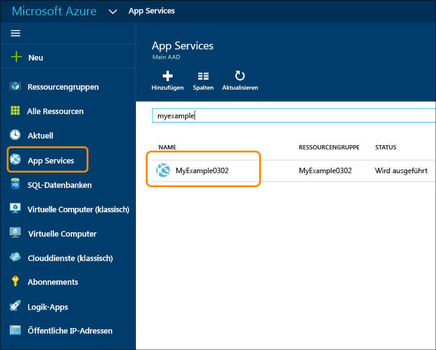

<properties
	pageTitle="Erstellen einer ASP.NET-Web-App in Azure App Service | Microsoft Azure"
	description="In diesem Lernprogramm erfahren Sie, wie Sie ein ASP.NET-Webprojekt in Visual Studio 2013 erstellen und in einer Web-App in Azure App Service bereitstellen."
	services="app-service\web"
	documentationCenter=".net"
	authors="tdykstra"
	manager="wpickett"
	editor="jimbe"/>

<tags
	ms.service="app-service-web"
	ms.workload="web"
	ms.tgt_pltfrm="na"
	ms.devlang="dotnet"
	ms.topic="hero-article"
	ms.date="03/02/2015"
	ms.author="tdykstra"/>

# Erstellen von ASP.NET-Web-Apps in Azure App Service

> [AZURE.SELECTOR]
- [.Net](web-sites-dotnet-get-started.md)
- [Node.js](web-sites-nodejs-develop-deploy-mac.md)
- [Java](web-sites-java-get-started.md)
- [PHP – Git](web-sites-php-mysql-deploy-use-git.md)
- [PHP – FTP](web-sites-php-mysql-deploy-use-ftp.md)
- [Python](web-sites-python-ptvs-django-mysql.md)

## Übersicht

In diesem Tutorial wird erläutert, wie Sie mithilfe von Visual Studio 2015 eine ASP.NET-Webanwendung in einer [Web-App in Azure App Service](app-service-web-overview.md) bereitstellen. Das Tutorial geht davon aus, dass Sie ein ASP.NET-Entwickler sind, der noch keine Erfahrung mit der Verwendung von Azure hat. Nach Abschluss des Lernprogramms verfügen Sie über eine einfache Webanwendung, die in der Cloud ausgeführt wird.

In der folgenden Abbildung wird die fertige Anwendung dargestellt:

Sie lernen Folgendes:

* Erstellen einer neuen App Service-Web-App beim Erstellen eines neuen Webprojekts in Visual Studio
* Bereitstellen eines Webprojekts für eine App Service-Web-App mit Visual Studio
* Verwenden des [Azure-Portals](/overview/preview-portal/) zum Überwachen und Verwalten der Web-App

Der Abschnitt [Nächste Schritte](#next-steps) am Ende dieses Tutorials enthält Links zu anderen Tutorials, in denen die Anwendung des Azure App Service ausführlicher beschrieben wird.

> [AZURE.NOTE] Unterstützen Sie uns dabei, Umfang und Ansatz dieses Tutorials zu gestalten – wenn Sie wünschen, dass ein Erste-Schritte-Tutorial weitere Themen abdeckt, hinterlassen Sie Ihr Feedback am Ende des Tutorials in einem [Disqus-Kommentar](#comments).

[AZURE.INCLUDE [Voraussetzungen](../../includes/app-service-web-dotnet-get-started-prereqs.md)]

## Erstellen eines Projekts und einer Web-App

Der erste Schritt besteht darin, ein Webprojekt in Visual Studio und eine Web-App in Azure App Service zu erstellen. Wenn Sie damit fertig sind, werden Sie das Projekt der Web-App bereitstellen, um es im Internet verfügbar zu machen.

Das Diagramm veranschaulicht Ihre Schritte bei der Erstellung und Bereitstellung.

1. Öffnen Sie Visual Studio 2015.

2. Klicken Sie auf **Datei > Neu > Projekt**.

3. Klicken Sie im Dialogfeld **Neues Projekt** auf **Visual C# > Web > ASP.NET-Webanwendung**. (Bei Bedarf können Sie auch **Visual Basic** verwenden.)

3. Stellen Sie sicher, dass als Zielframework **.NET Framework 4.5.2** ausgewählt ist.

4.  [Azure Application Insights](../application-insights/app-insights-overview.md) überwacht die Verfügbarkeit, Leistung und Nutzung Ihrer Web-App. Das Kontrollkästchen **Application Insights zum Projekt hinzufügen** ist standardmäßig aktiviert, wenn Sie das erste Mal nach der Installation von Visual Studio ein Webprojekt erstellen. Deaktivieren Sie das Kontrollkästchen, wenn Sie Application Insights nicht ausprobieren möchten.

4. Nennen Sie die Anwendung **MyExample**.

5. Klicken Sie auf **OK**.

	

5. Wählen Sie im Dialogfeld **Neues ASP.NET-Projekt** die Vorlage **MVC** aus.

7. Klicken Sie auf **Authentifizierung ändern**.

	

6. Klicken Sie im Dialogfeld **Authentifizierung ändern** auf **Keine Authentifizierung** und dann auf **OK**.

	

	Bei der Anwendung, die Sie für dieses Tutorial erstellen, handelt es sich um eine einfache Anwendung, die die Benutzeranmeldung nicht unterstützt.

5. Überprüfen Sie im Dialogfeld **Neues ASP.NET-Projekt** im Abschnitt **Microsoft Azure**, ob **In der Cloud hosten** und in der Dropdownliste die Option **App Service** ausgewählt ist.

	

	Mit diesen Einstellungen wird angegeben, dass eine Azure-Web-App für das Webprojekt von Visual Studio erstellt wird.

6. Klicken Sie auf **OK**.

5. Falls Sie sich noch nicht bei Azure angemeldet haben, werden Sie von Visual Studio dazu aufgefordert, dies nachzuholen. Melden Sie sich mit der ID und dem Kennwort des Kontos an, mit dem Sie Ihr Azure-Abonnement verwalten.

	Wenn Sie angemeldet sind, werden Sie im Dialogfeld **App Service erstellen** gefragt, welche Ressourcen Sie erstellen möchten.

	

3. Geben Sie im Dialogfeld **App Service erstellen** einen **Web-App-Namen** ein, der in der Domäne *azurewebsites.net* eindeutig ist. Beispielsweise können Sie sie "MyExample" nennen und Zahlen anhängen, damit der Name eindeutig ist, z. B. "MyExample810". Wenn ein Standardwebname für Sie erstellt wird, ist dieser eindeutig und Sie können ihn verwenden.

	Wenn eine andere Person den eingegebenen Namen bereits verwendet hat, wird rechts ein rotes Ausrufungszeichen anstelle eines grünen Häkchens angezeigt, und Sie müssen einen anderen Namen eingeben.

	Dieser Name wird von Azure als Präfix für die URL Ihrer Anwendung verwendet. Die vollständige URL besteht aus diesem Namen und *.azurewebsites.net* (wie neben dem Textfeld **Web-App-Name** angezeigt). Für den Namen `MyExample810` lautet die URL z. B. `myexample810.azurewebsites.net`. Die URL muss eindeutig sein.

6. Klicken Sie neben der Dropdownliste **Ressourcengruppe** auf **Neu**, und geben Sie dann „MyExample“ oder einen Namen Ihrer Wahl ein.

	In diesem Kombinationsfeld können Sie eine vorhandene Ressourcengruppe auswählen oder eine neue Ressourcengruppe erstellen. Geben Sie hierfür einen Namen ein, der sich von einer vorhandenen Ressourcengruppe in Ihrem Abonnement unterscheidet.

	Eine Ressourcengruppe ist eine Sammlung mit Azure-Ressourcen, z. B. API-Apps, Datenbanken, VMs usw. Für dieses Tutorial ist es im Allgemeinen besser, eine neue Ressourcengruppe zu erstellen. Es ist dann einfacher, alle Azure-Ressourcen, die Sie für das Tutorial erstellen, in einem Schritt zu löschen. Weitere Informationen finden Sie unter [Übersicht über den Azure Resource Manager](../resource-group-overview.md).

4. Klicken Sie neben der Dropdownliste **App Service-Plan** auf die Schaltfläche **Neu**.

	

	Der Screenshot enthält Beispielwerte für die Optionen **Web-App-Name**, **Abonnement** und **Ressourcengruppe**. Ihre Werte werden sich von diesen Werten unterscheiden.

	In den folgenden Schritten erstellen Sie einen App Service-Plan für die neue Ressourcengruppe. Mit einem App Service-Plan werden die Computeressourcen angegeben, auf denen Ihre API-App ausgeführt wird. Wenn Sie beispielsweise den Free-Tarif wählen, wird Ihre API-App auf freigegebenen VMs ausgeführt. Für einige kostenpflichtige Tarife wird sie dagegen auf dedizierten VMs ausgeführt. Weitere Informationen finden Sie unter [App Service-Pläne – Übersicht](../app-service/azure-web-sites-web-hosting-plans-in-depth-overview.md).

5. Geben Sie im Dialogfeld **App Service-Plan konfigurieren** den Namen „MyExamplePlan“ oder einen anderen Namen Ihrer Wahl ein.

5. Wählen Sie in der Dropdownliste **Standort** den Standort aus, der Ihnen am nächsten liegt.

	Mit dieser Einstellung wird das Azure-Rechenzentrum angegeben, in dem Ihre App ausgeführt wird. In diesem Lernprogramm können Sie ohne spürbaren Unterschied eine beliebige Region auswählen. Für eine Produktions-App sollte sich der Server aber so nah wie möglich bei den Clients befinden, mit denen darauf zugegriffen wird, um [Latenz](http://www.bing.com/search?q=web%20latency%20introduction&qs=n&form=QBRE&pq=web%20latency%20introduction&sc=1-24&sp=-1&sk=&cvid=eefff99dfc864d25a75a83740f1e0090) zu minimieren.

5. Klicken Sie in der Dropdownliste **Größe** auf **Free**.

	Für dieses Tutorial bietet der Tarif „Free“ eine ausreichende Leistung.

6. Klicken Sie im Dialogfeld **App Service-Plan konfigurieren** auf **OK**.

	

7. Klicken Sie im Dialogfeld **App Service erstellen** auf **Erstellen**.

	

	Visual Studio erstellt das Webprojekt und die Web-App innerhalb kurzer Zeit, üblicherweise in weniger als einer Minute.

	Im Fenster **Projektmappen-Explorer** werden die Dateien und Ordner in dem neuen Projekt angezeigt.

	

	Im Fenster **Azure App Service Activity** wird angegeben, dass die Web-App erstellt wurde.

	

	Und Sie können die Web-App im **Cloud-Explorer** sehen.

	

## Bereitstellen des Projekts in der Web-App

In diesem Abschnitt stellen Sie das Webprojekt in der Web-App bereit (siehe Schritt 2 in der Abbildung).

1. Klicken Sie im Projektmappen-Explorer mit der rechten Maustaste auf das Projekt, und wählen Sie **Veröffentlichen** aus.

	

	Wenige Sekunden später wird der Assistent **Web veröffentlichen** geöffnet. Im Assistenten wird ein *Veröffentlichungsprofil* mit Einstellungen für die Bereitstellung des Webprojekts in der neuen Web-App angezeigt. Wenn die Bereitstellung in einer anderen Web-App erfolgen soll, können Sie auf die Registerkarte **Profil** klicken, um ein anderes Profil zu erstellen. In diesem Lernprogramm übernehmen Sie die Einstellungen, mit denen die Bereitstellung in der zuvor erstellten Web-App erfolgt.

8. Klicken Sie auf der Registerkarte **Verbindung** des Assistenten **Web veröffentlichen** auf **Weiter**.

	

	Die nächste Registerkarte ist die Registerkarte **Einstellungen**. Hier können Sie die Buildkonfiguration ändern, um einen Debugbuild für das [Remotedebuggen](../app-service-web/web-sites-dotnet-troubleshoot-visual-studio.md#remotedebug) bereitzustellen. Die Registerkarte enthält außerdem mehrere **Dateiveröffentlichungsoptionen**:

	* Nicht übereinstimmende Dateien im Ziel entfernen
	* Während der Veröffentlichung vorkompilieren
	* Dateien aus dem App\_Data-Ordner ausschließen

	Für dieses Tutorial benötigen Sie diese Optionen nicht. Ausführliche Beschreibungen ihrer Funktionsweise finden Sie unter [Gewusst wie: Bereitstellen eines Webanwendungsprojekts mit der One-Click-Veröffentlichung in Visual Studio](https://msdn.microsoft.com/library/dd465337.aspx).

10. Klicken Sie auf der Registerkarte **Einstellungen** auf **Weiter**.

	

	Die nächste Registerkarte ist die Registerkarte **Vorschau**. Hier können Sie sehen, welche Dateien aus Ihrem Projekt in die API-App kopiert werden. Wenn Sie ein Projekt für eine API-App bereitstellen, für die Sie bereits eine Bereitstellung durchgeführt haben, werden nur geänderte Dateien kopiert. Wenn Sie eine Liste mit den kopierten Dateien anzeigen möchten, können Sie auf die Schaltfläche **Vorschau starten** klicken.

11. Klicken Sie auf der Registerkarte **Vorschau** auf **Veröffentlichen**.

	

	Wenn Sie auf **Veröffentlichen** klicken, werden die Dateien von Visual Studio auf den Azure-Server kopiert. Dies kann ein oder zwei Minuten dauern.

	In den Fenstern **Ausgabe** und **Azure App Service-Aktivität** wird angezeigt, welche Bereitstellungsaktionen ausgeführt wurden, und es wird die erfolgreiche Durchführung der Bereitstellung gemeldet.

	

	Nach der erfolgreichen Bereitstellung wird die URL der bereitgestellten Web-App automatisch im Standardbrowser geöffnet, und die erstellte Anwendung wird jetzt in der Cloud ausgeführt. Die URL in der Adressleiste des Browsers gibt an, dass die Web-App aus dem Internet geladen wird.

	

> [AZURE.TIP] Für eine schnelle Bereitstellung können Sie die Symbolleiste **Webveröffentlichung mit einem Klick** aktivieren. Klicken Sie auf **Ansicht > Symbolleisten**, und wählen Sie dann **Webveröffentlichung mit einem Klick** aus. Auf der Symbolleiste können Sie ein Profil auswählen, auf eine Schaltfläche zum Veröffentlichen klicken oder auf eine Schaltfläche klicken, um den Assistenten **Web veröffentlichen** zu öffnen. 

## Überwachen und Verwalten der Web-App im Azure-Portal

Das [Azure-Portal](/services/management-portal/) ist eine Weboberfläche, die das Verwalten und Überwachen Ihrer Azure-Dienste ermöglicht, z. B. der soeben erstellten Web-App. In diesem Abschnitt des Lernprogramms erfahren Sie, was Sie im Portal durchführen können.

1. Rufen Sie in Ihrem Browser [https://portal.azure.com](https://portal.azure.com) auf, und melden Sie sich mit den Azure-Anmeldeinformationen an, die Sie für die Verwaltung Ihres Azure-Kontos verwenden.

2. Klicken Sie auf **App Services** und dann auf den Namen der Web-App.

	

	Auf dem Blatt **Web-App** wird eine Übersicht über die Einstellungen und eine Nutzungsstatistik für Ihre Web-App angezeigt. (Fenster, die im Portal auf der rechten Seite geöffnet werden, werden als *Blätter* bezeichnet.)

	

	Bisher gab es in Ihrer Web-App kaum Datenverkehr, daher wird in der Übersicht möglicherweise nichts angezeigt. Wenn Sie Ihre Anwendung aufrufen, aktualisieren Sie die Seite mehrmals, und aktualisieren Sie anschließend die Portalseite. Nun sollte eine Statistik angezeigt werden.

3. Auf dem Blatt **Einstellungen** werden weitere Optionen zum Konfigurieren der Web-App angezeigt.

	

	Auf diesem Blatt sind mehr Abschnitte enthalten als auf dem Screenshot gezeigt.

4. Klicken Sie auf dem Blatt **Einstellungen** im Abschnitt **Allgemein** auf **Anwendungseinstellungen**, um ein Beispiel für die verschiedenen Einstellungen anzuzeigen, die Sie im Portal konfigurieren können.

	Sie können beispielsweise die für die Web-App verwendete .NET-Version festlegen, Funktionen wie [WebSockets](/blog/2013/11/14/introduction-to-websockets-on-windows-azure-web-sites/) aktivieren und die [Werte für Verbindungszeichenfolgen](/blog/2013/07/17/windows-azure-web-sites-how-application-strings-and-connection-strings-work/) festlegen.

	

Dies sind nur einige Funktionen des Portals. Sie können neue Web-Apps erstellen, vorhandene Web-Apps löschen, Web-Apps anhalten und neu starten und andere Azure-Dienste verwalten, z. B. Datenbanken und virtuelle Computer.

## Nächste Schritte

In diesem Lernprogramm haben Sie erfahren, wie eine einfache Webanwendung erstellt und in einer Azure-Web-App bereitgestellt wird. In den folgenden Themen und Ressourcen finden Sie weitere Informationen zu Azure App Service:

* Andere Methoden zum Erstellen von Web-Apps

	Sie haben gelernt, wie beim Erstellen eines Visual Studio-Projekts eine Web-App erstellt wird. Azure-Ressourcen können im Bereitstellungsprozess in Visual Studio auf die gleiche Weise erstellt werden wie während der Projekterstellung. Sie können Web-Apps auch erstellen, indem Sie das [Azure-Portal](https://portal.azure.com/), [Azure-Cmdlets für Windows PowerShell](../powershell-install-configure.md) oder die [plattformübergreifende Befehlszeilenschnittstelle](../xplat-cli.md) verwenden.

* Gewusst wie: Erstellen von API-Apps

	Sie haben gelernt, wie Sie eine Instanz von Azure App Service erstellen, die in erster Linie eine Website hosten soll. App Service verfügt auch über Funktionen, die das Entwickeln, Testen und Hosten von APIs vereinfachen sollen. Weitere Informationen finden Sie unter [Erste Schritte mit API-Apps und ASP.NET in Azure App Service](../app-service-api/app-service-api-dotnet-get-started.md).

* Andere Möglichkeiten für die Bereitstellung eines Webprojekts

	Informationen zu anderen Möglichkeiten der Bereitstellung von Webprojekten in Web-Apps mit Visual Studio oder durch die [Automatisierung der Bereitstellung](http://www.asp.net/aspnet/overview/developing-apps-with-windows-azure/building-real-world-cloud-apps-with-windows-azure/continuous-integration-and-continuous-delivery) über ein [Quellcode-Verwaltungssystem](http://www.asp.net/aspnet/overview/developing-apps-with-windows-azure/building-real-world-cloud-apps-with-windows-azure/source-control) finden Sie unter [Bereitstellen von Azure-Web-Apps](web-sites-deploy.md).

	Visual Studio kann auch Windows PowerShell-Skripte generieren, mit deren Hilfe Sie die Bereitstellung automatisieren können. Weitere Informationen finden Sie unter [Automate Everything (Building Real-World Cloud Apps with Azure)](http://www.asp.net/aspnet/overview/developing-apps-with-windows-azure/building-real-world-cloud-apps-with-windows-azure/automate-everything) (in englischer Sprache).

* Problembehandlung für eine Web-App

	Visual Studio enthält Funktionen, die die Anzeige von Azure-Protokollen vereinfachen, da sie in Echtzeit erstellt werden. Darüber hinaus ist die Ausführung in Azure remote im Debugmodus möglich. Weitere Informationen finden Sie unter [Problembehandlung von Azure-Web-Apps in Visual Studio](web-sites-dotnet-troubleshoot-visual-studio.md).

* So fügen Sie einen benutzerdefinierten Domänennamen und SSL hinzu

	Informationen zur Verwendung von SSL und einer eigenen Domäne (z. B. www.contoso.com statt contoso.azurewebsites.net) finden Sie in den folgenden Ressourcen:

	* [Konfigurieren eines benutzerdefinierten Domänennamens in Azure App Service](web-sites-custom-domain-name.md)
	* [Aktivieren von HTTPS für Azure-Web-Apps](web-sites-configure-ssl-certificate.md)

* Hinzufügen von Echtzeitfunktionen wie Chat

	Wenn Ihre Web-App Echtzeitfunktionen (Chatdienste, Spiele, Börsenticker usw.) enthalten soll, erreichen Sie die beste Leistung durch die Verwendung von [ASP.NET SignalR](http://www.asp.net/signalr) mit der Transportmethode [WebSockets](/blog/2013/11/14/introduction-to-websockets-on-windows-azure-web-sites/). Weitere Informationen finden Sie unter [Using SignalR with Web Apps in Azure App Service](http://www.asp.net/signalr/overview/signalr-20/getting-started-with-signalr-20/using-signalr-with-windows-azure-web-sites) (in englischer Sprache).

* Auswählen zwischen App Service, Azure Cloud Services und Azure Virtual Machines für Webanwendungen

	In Azure können Sie Webanwendungen in App Service-Web-Apps (wie in diesem Lernprogramm gezeigt), in Cloud Services oder in Virtual Machines ausführen. Weitere Informationen finden Sie unter [Azure Web-Apps, Cloud Services und Virtual Machines im Vergleich](/manage/services/web-sites/choose-web-app-service/).

<!---HONumber=AcomDC_0309_2016-->