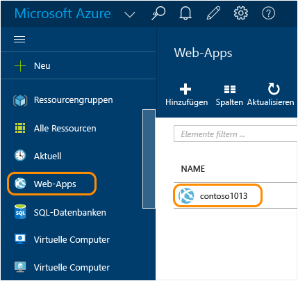
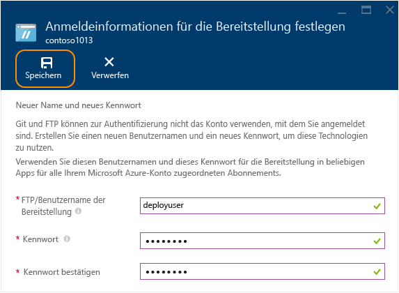
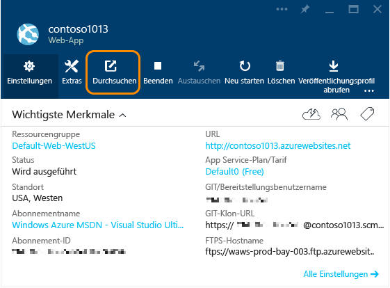
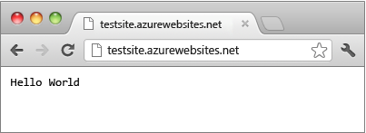

<properties
	pageTitle="Erstellen einer Node.js-Web-App in Azure App Service | Microsoft Azure"
	description="Erfahren Sie, wie Sie eine Node.js-Anwendung in einer Web-App in Azure App Service bereitstellen."
	services="app-service\web"
	documentationCenter="nodejs"
	authors="rmcmurray"
	manager="wpickett"
	editor=""/>

<tags
	ms.service="app-service-web"
	ms.workload="web"
	ms.tgt_pltfrm="na"
	ms.devlang="nodejs"
	ms.topic="hero-article"
	ms.date="11/20/2015"
	ms.author="robmcm"/>

# Erstellen einer Node.js-Web-App in Azure App Service

> [AZURE.SELECTOR]
- [.Net](web-sites-dotnet-get-started.md)
- [Node.js](web-sites-nodejs-develop-deploy-mac.md)
- [Java](web-sites-java-get-started.md)
- [PHP - Git](web-sites-php-mysql-deploy-use-git.md)
- [PHP - FTP](web-sites-php-mysql-deploy-use-ftp.md)
- [Python](web-sites-python-ptvs-django-mysql.md)

In diesem Tutorial erfahren Sie, wie Sie eine einfache [Node.js](http://nodejs.org)-Anwendung erstellen und über [Git](http://git-scm.com) in einer [Web-App](app-service-web-overview.md) in [Azure App Service](../app-service/app-service-value-prop-what-is.md) bereitstellen. Die Anweisungen in diesem Tutorial gelten für alle Betriebssysteme, unter denen Node.js ausgeführt werden kann.

Sie lernen Folgendes:

* Erstellen einer Web-App in Azure App Service über das Azure-Portal
* Bereitstellen einer Node.js-Anwendung in der Web-App durch Pushübertragung in das Git-Repository der Web-App

Die vollständig erstellte Anwendung schreibt eine "Hello World"-Zeichenfolge in den Browser.

![Ein Browser, in dem die Nachricht "Hello World" angezeigt wird.][helloworld-completed]

Tutorials und Beispielcode mit komplexeren Node.js-Anwendungen sowie weitere Themen zur Verwendung von Node.js in Azure finden Sie im [Node.js Developer Center](/develop/nodejs/).

> [AZURE.NOTE]Sie benötigen ein Microsoft Azure-Konto, um dieses Lernprogramm auszuführen. Wenn Sie kein Konto haben, können Sie [Ihre Visual Studio-Abonnentenvorteile aktivieren](/de-DE/pricing/member-offers/msdn-benefits-details/?WT.mc_id=A261C142F) oder sich [für eine kostenlose Testversion registrieren](/de-DE/pricing/free-trial/?WT.mc_id=A261C142F).
>
> Wenn Sie Azure App Service ausprobieren möchten, ehe Sie sich für ein Azure-Konto anmelden, besuchen Sie [Azure App Service-App erstellen](http://go.microsoft.com/fwlink/?LinkId=523751). Dort können Sie direkt eine kurzzeitige Start-Web-App in App Service erstellen – keine Kreditkarte erforderlich, keine weiteren Verpflichtungen.

##Erstellen einer Web-App und Aktivieren der Git-Veröffentlichung

Führen Sie diese Schritte aus, um eine Web-App in Azure App Service zu erstellen und die Git-Veröffentlichung zu aktivieren.

[Git](http://git-scm.com/) ist ein verteiltes Versionskontrollsystem, mit dem Sie Ihre Azure-Website bereitstellen können. Dazu speichern Sie den Code, den Sie für Ihre Web-App geschrieben haben, in einem lokalen Git-Repository und stellen ihn anschließend mithilfe eines Pushvorgangs zu einem Remoterepository in Azure bereit. Diese Bereitstellungsmethode ist ein Feature der App Service-Web-Apps.

1. Melden Sie sich beim [Azure-Portal](https://portal.azure.com) an.

2. Klicken Sie oben links im Azure-Portal auf das Symbol **+ NEU**.

3. Klicken Sie auf **Web und mobil** und dann auf **Web-App**.

    ![][portal-quick-create]

4. Geben Sie im Feld **Web-App** einen Namen für die Web-App ein.

	Der Name muss innerhalb der Domäne "azurewebsites.net" eindeutig sein, da die URL der Web-App "{name}.azurewebsites.net" lauten wird. Wenn der eingegebene Name nicht eindeutig ist, wird im Textfeld ein rotes Ausrufezeichen angezeigt.

5. Wählen Sie ein **Abonnement** aus.

6. Wählen Sie eine **Ressourcengruppe** aus, oder erstellen Sie eine neue.

	Weitere Informationen zu Ressourcengruppen finden Sie unter [Verwenden des Azure-Portals zum Verwalten Ihrer Azure-Ressourcen](../resource-group-portal.md).

7. Wählen Sie einen **App Service-Plan/-Standort** aus, oder erstellen Sie einen neuen Plan und Standort.

	Weitere Informationen zu App Service-Plänen finden Sie unter [Azure App Service-Pläne – Detaillierte Übersicht](../azure-web-sites-web-hosting-plans-in-depth-overview.md).

8. Klicken Sie auf **Erstellen**.
   
    ![][portal-quick-create2]

	Azure beendet die Erstellung der neuen Web-App innerhalb kurzer Zeit, üblicherweise in weniger als einer Minute.

9. Klicken Sie auf **Web-Apps > {Ihre neue Web-App}**.

	

10. Klicken Sie auf dem Blatt **Web-App** auf das Detail **Bereitstellung**.

	![][deployment-part]

11. Klicken Sie auf dem Blatt **Dauerhafte Bereitstellung** auf **Quelle auswählen**.

12. Klicken Sie auf **Lokales Git-Repository** und dann auf **OK**.

	![][setup-git-publishing]

13. Falls nicht bereits erfolgt, richten Sie Anmeldeinformationen für die Bereitstellung ein.

	a. Klicken Sie auf dem Blatt der Web-App auf **Einstellungen > Anmeldeinformationen für die Bereitstellung**.

	![][deployment-credentials]
 
	b. Erstellen Sie einen Benutzernamen und ein Kennwort.
	
	

14. Klicken Sie auf dem Blatt der Web-App auf **Einstellungen** und anschließend auf **Eigenschaften**.
 
	Für die Veröffentlichung führen Sie ein Push zu einem Remote-Git-Repository aus. Die URL für das Repository wird unter **GIT-URL** aufgelistet. Sie verwenden diese URL später im Tutorial.

	![][git-url]

##Lokales Erstellen und Testen der Anwendung

In diesem Abschnitt erstellen Sie eine Datei **server.js**, die eine leicht abgewandelte Version des "Hello World"-Beispiels von [nodejs.org] enthält. Der Code fügt "process.env.PORT" als den Port ein, an dem bei Ausführung in einer Azure-Web-App gelauscht werden soll.

1. Erstellen Sie ein Verzeichnis namens *helloworld*.

2. Erstellen Sie mithilfe eines Text-Editors eine neue Datei namens **server.js** im Verzeichnis *helloworld*.

2. Kopieren Sie den folgenden Code in die Datei **server.js**, und speichern Sie die Datei:

        var http = require('http')
        var port = process.env.PORT || 1337;
        http.createServer(function(req, res) {
          res.writeHead(200, { 'Content-Type': 'text/plain' });
          res.end('Hello World\n');
        }).listen(port);

3. Öffnen Sie die Befehlszeile, und verwenden Sie den folgenden Befehl, um die Web-App lokal zu starten:

        node server.js

4. Öffnen Sie Ihren Browser, und navigieren Sie zu http://localhost:1337.

	Eine Website mit dem Text "Hello World" wird geöffnet, wie im folgenden Screenshot gezeigt:

    ![Ein Browser, in dem die Nachricht "Hello World" angezeigt wird.][helloworld-localhost]

##Veröffentlichen der Anwendung

1. Installieren Sie Git, falls Sie dies noch nicht getan haben.

	Installationsanweisungen für Ihre Plattform finden Sie auf der [Downloadseite für Git](http://git-scm.com/download).

1. Wechseln Sie über die Befehlszeile zum Verzeichnis **helloworld**, und geben Sie den folgenden Befehl ein, um ein lokales Git-Repository zu initialisieren.

		git init

2. Verwenden Sie die folgenden Befehle, um dem Repository Dateien hinzuzufügen:

		git add .
		git commit -m "initial commit"

3. Fügen Sie ein Git-Remoteverzeichnis hinzu, um die Updates per Push an die zuvor erstellte Web-App zu übertragen. Verwenden Sie dazu den folgenden Befehl:

		git remote add azure [URL for remote repository]

4. Übertragen Sie Ihre Änderungen mit dem folgenden Befehl per Push an Azure:

		git push azure master

	Sie werden aufgefordert, das zuvor erstellte Kennwort einzugeben. Die Ausgabe sieht in etwa wie das folgende Beispiel aus:

		Counting objects: 3, done.
		Delta compression using up to 8 threads.
		Compressing objects: 100% (2/2), done.
		Writing objects: 100% (3/3), 374 bytes, done.
		Total 3 (delta 0), reused 0 (delta 0)
		remote: New deployment received.
		remote: Updating branch 'master'.
		remote: Preparing deployment for commit id '5ebbe250c9'.
		remote: Preparing files for deployment.
		remote: Deploying Web.config to enable Node.js activation.
		remote: Deployment successful.
		To https://user@testsite.scm.azurewebsites.net/testsite.git
		 * [new branch]      master -> master

5. Um Ihre App anzuzeigen, klicken Sie im Detail **Web-App** im Azure-Portal auf die Schaltfläche **Durchsuchen**.

	

	

##Veröffentlichen von Änderungen an der Anwendung

1. Öffnen Sie die Datei **server.js** in einem Texteditor, und ändern Sie "Hello World\\n" in "Hello Azure\\n". 

2. Speichern Sie die Datei.

2. Wechseln Sie über die Befehlszeile zum Verzeichnis **helloworld**, und führen Sie die folgenden Befehle aus:

		git add .
		git commit -m "changing to hello azure"
		git push azure master

	Sie werden aufgefordert, Ihr Kennwort erneut einzugeben.

3. Aktualisieren Sie das Browserfenster, in dem Sie zur URL der Web-App navigiert sind.

	![Eine Webseite, die "Hello Azure" anzeigt][helloworld-completed]

## Rollback einer Bereitstellung

Auf dem Blatt **Web-App** können Sie auf **Einstellungen > Dauerhafte Bereitstellung** klicken, um den Bereitstellungsverlauf auf dem Blatt **Bereitstellungen** anzuzeigen. Wenn Sie ein Rollback auf eine frühere Bereitstellung durchführen müssen, können Sie die Bereitstellung auswählen und auf dem Blatt **Bereitstellungsdetails** auf **Erneut bereitstellen** klicken

##Nächste Schritte

Sie haben eine Node.js-Anwendung in einer Web-App in Azure App Service bereitgestellt. Weitere Informationen zur Ausführung von Node.js-Anwendungen in App Service-Web-Apps finden Sie unter [Azure App Service Web Apps: Node.js](http://blogs.msdn.com/b/silverlining/archive/2012/06/14/windows-azure-websites-node-js.aspx) und [Festlegen einer Node.js-Version in einer Azure-Anwendung](../nodejs-specify-node-version-azure-apps.md).

Node.js bietet ein vielseitiges Portfolio an Modulen, die von Ihren Anwendungen verwendet werden können. Weitere Informationen darüber, wie Web-Apps mit Modulen funktionieren, finden Sie unter [Verwenden von Node.js-Modulen mit Azure-Anwendungen](../nodejs-use-node-modules-azure-apps.md).

Wenn nach der Bereitstellung in Azure Probleme mit der Anwendung auftreten, finden Sie Informationen zur Problemdiagnose unter [Debuggen einer Node.js-Anwendung in Azure App Service](web-sites-nodejs-debug.md).

In diesem Artikel wird das Azure-Portal zum Erstellen einer Web-App verwendet. Für die gleichen Vorgänge können Sie auch die [Azure-Befehlszeilenschnittstelle](../xplat-cli-install.md) oder [Azure PowerShell](../install-configure-powershell.md) verwenden.

Weitere Informationen zum Entwickeln von Node.js-Anwendungen in Azure finden Sie im [Node.js Developer Center](/develop/nodejs/).

[helloworld-completed]: ./media/web-sites-nodejs-develop-deploy-mac/helloazure.png
[helloworld-localhost]: ./media/web-sites-nodejs-develop-deploy-mac/helloworldlocal.png
[portal-quick-create]: ./media/web-sites-nodejs-develop-deploy-mac/create-quick-website.png
[portal-quick-create2]: ./media/web-sites-nodejs-develop-deploy-mac/create-quick-website2.png
[setup-git-publishing]: ./media/web-sites-nodejs-develop-deploy-mac/setup_git_publishing.png
[go-to-dashboard]: ./media/web-sites-nodejs-develop-deploy-mac/go_to_dashboard.png
[deployment-part]: ./media/web-sites-nodejs-develop-deploy-mac/deployment-part.png
[deployment-credentials]: ./media/web-sites-nodejs-develop-deploy-mac/deployment-credentials.png
[git-url]: ./media/web-sites-nodejs-develop-deploy-mac/git-url.png

<!----HONumber=AcomDC_1217_2015-->