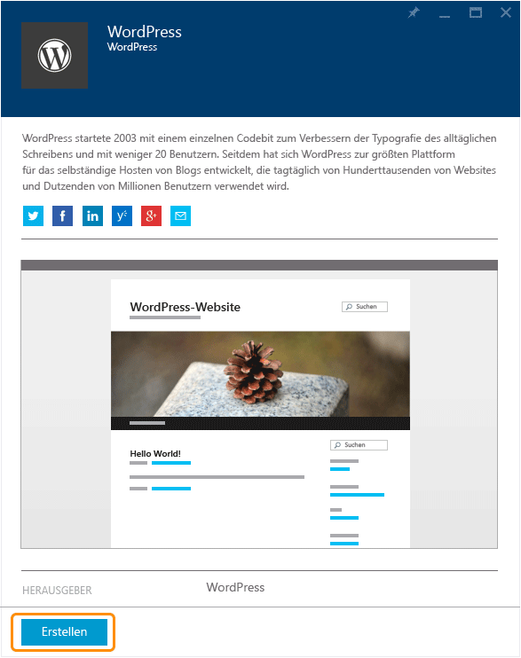
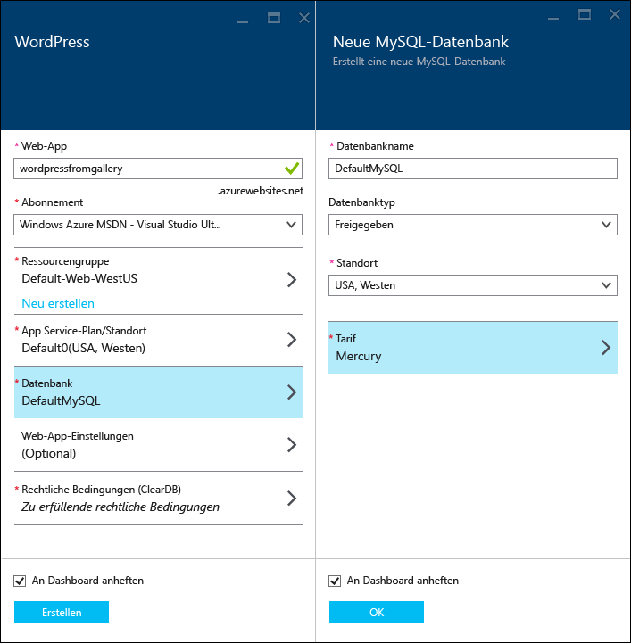
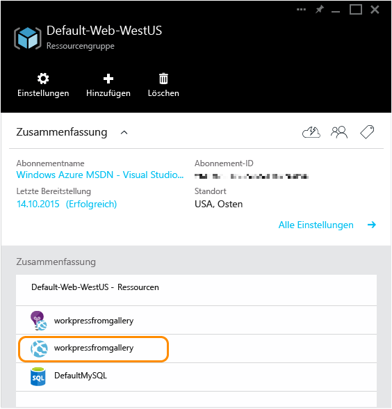

<properties
	pageTitle="Erstellen einer Wordpress-Web-App in Azure App Service | Microsoft Azure"
	description="Erfahren Sie, wie Sie über das Azure-Portal eine neue Azure-Web-App für einen WordPress-Blog erstellen."
	services="app-service\web"
	documentationCenter="php"
	authors="tfitzmac"
	manager="wpickett"
	editor=""/>

<tags
	ms.service="app-service-web"
	ms.workload="na"
	ms.tgt_pltfrm="na"
	ms.devlang="PHP"
	ms.topic="hero-article"
	ms.date="11/13/2015"
	ms.author="tomfitz"/>

# Erstellen einer WordPress-Web-App in Azure App Service

In diesem Tutorial wird gezeigt, wie Sie eine Anwendung im Azure Marketplace suchen und in einer App Service-Web-App installieren. Im Tutorial wird eine WordPress-Blotwebsite als Beispiel verwendet, der Prozess ist jedoch der gleiche für viele weitere Marketplace-Anwendungen.

Wenn Sie das Tutorial beendet haben, verfügen Sie über eine eigene WordPress-Blogwebsite, die in der Cloud ausgeführt wird.

Sie lernen Folgendes:

* Suchen einer Anwendungsvorlage im Azure Marketplace
* Erstellen einer Web-App in Azure App Service basierend auf der Vorlage
* Konfigurieren der Azure App Service-Einstellungen für die neue Web-App und die MySQL-Datenbank

Azure Marketplace bietet eine breite Auswahl an beliebten Web-Apps, die von Microsoft, anderen Unternehmen oder Open Source-Softwareinitiativen entwickelt wurden. Die Web-Apps basieren auf einer Vielzahl beliebter Frameworks, wie z. B. [PHP](/develop/nodejs/) (in diesem WordPress-Beispiel), [.NET](/develop/net/), [Node.js](/develop/nodejs/), [Java](/develop/java/) und [Python](/develop/python/), um nur einige zu nennen. Die einzige Software, die Sie zum Erstellen der Web-App über den Azure Marketplace benötigen, ist der Browser, den Sie für das [Azure-Portal](https://portal.azure.com/) verwenden.

> [AZURE.NOTE]Sie benötigen ein Microsoft Azure-Konto, um dieses Lernprogramm auszuführen. Wenn Sie kein Konto haben, können Sie [Ihre Visual Studio-Abonnentenvorteile aktivieren](/pricing/member-offers/msdn-benefits-details/?WT.mc_id=A261C142F) oder [sich für eine kostenlose Testversion registrieren](/de-DE/pricing/free-trial/?WT.mc_id=A261C142F).
>
> Wenn Sie Azure App Service ausprobieren möchten, ehe Sie sich für ein Azure-Konto anmelden, besuchen Sie [Azure App Service-App erstellen](http://go.microsoft.com/fwlink/?LinkId=523751). Dort können Sie direkt eine kurzzeitige Start-Web-App in App Service erstellen – keine Kreditkarte erforderlich, keine weiteren Verpflichtungen.

## Auswählen von WordPress und Konfigurieren für Azure App Service

1. Melden Sie sich beim [Azure-Portal](https://portal.azure.com/) an.

2. Klicken Sie auf **Neu**.
	
    ![Neu erstellen][5]
	
3. Suchen Sie nach **WordPress**, und klicken Sie dann auf **WordPress**.

	![WordPress-Symbol in der Liste][7]
	
5. Lesen Sie die Beschreibung der WordPress-App, und klicken Sie dann auf **Erstellen**.

	

4. Geben Sie im Feld **Web-App** einen Namen für die Web-App ein.

	Der Name muss innerhalb der Domäne "azurewebsites.net" eindeutig sein, da die URL der Web-App "{name}.azurewebsites.net" lauten wird. Wenn der eingegebene Name nicht eindeutig ist, wird im Textfeld ein rotes Ausrufezeichen angezeigt.

8. Wenn Sie über mehr als ein Abonnement verfügen, wählen Sie das Abonnement aus, das Sie verwenden möchten.

5. Wählen Sie eine vorhandene **Ressourcengruppe** aus, oder erstellen Sie eine neue.

	Weitere Informationen zu Ressourcengruppen finden Sie unter [Verwenden des Azure-Portals zum Verwalten Ihrer Azure-Ressourcen](../resource-group-portal.md).

5. Wählen Sie einen **App Service-Plan/-Standort** aus, oder erstellen Sie einen neuen Plan und Standort.

	Weitere Informationen zu App Service-Plänen finden Sie unter [Azure App Service-Pläne – Detaillierte Übersicht](../azure-web-sites-web-hosting-plans-in-depth-overview.md).

7. Klicken Sie auf **Datenbank**, und geben Sie auf dem Blatt **Neue MySQL-Datenbank** die erforderlichen Werte für die Konfiguration Ihrer MySQL-Datenbank ein.

	a. Geben Sie einen neuen Namen ein, oder übernehmen Sie den Standardnamen.

	b. Belassen Sie den **Datenbanktyp** bei **Freigegeben**.

	c. Wählen Sie den gleichen Standort wie für die Web-App.

	d. Wählen Sie einen Tarif aus. "Mercury" (kostenlos mit minimaler Anzahl von Verbindungen und geringem Datenträgerspeicherplatz) ist für die Zwecke dieses Tutorials ausreichend.

8. Klicken Sie auf dem Blatt **Neue MySQL-Datenbank** auf **OK**.

8. Akzeptieren Sie auf dem Blatt **WordPress** die rechtlichen Hinweise, und klicken Sie anschließend auf **Erstellen**.

	

	Azure App Service erstellt die Web-App üblicherweise in weniger als einer Minute. Sie können den Fortschritt verfolgen, indem Sie oben auf der Portalseite auf das Glockensymbol klicken.

	

## Starten und Verwalten Ihrer WordPress-Web-App
	
7. Wenn die Erstellung der Web-App abgeschlossen ist, navigieren Sie im Azure-Portal zu der Ressourcengruppe, in der Sie die Anwendung erstellt haben. Dort werden die Web-App und die Datenbank angezeigt.

	Bei der zusätzlichen Ressource mit dem Glühbirnensymbol handelt es sich um den Dienst [Application Insights](/services/application-insights/), der Überwachungsdienste für Ihre Web-App bereitstellt.

1. Klicken Sie auf dem Blatt **Ressourcengruppe** auf die Zeile der Web-App.

	

2. Klicken Sie auf dem Blatt der Web-App auf **Durchsuchen**.

    ![Website-URL][browse]

3. Geben Sie auf der WordPress-Seite **Willkommen** die Konfigurationsinformationen ein, die von WordPress benötigt werden, und klicken Sie dann auf **WordPress installieren**.

	

4. Melden Sie sich auf der Seite **Willkommen** mit den erstellten Anmeldeinformationen an.

5. Das Website-Dashboard wird geöffnet.

	

## Nächste Schritte

Sie haben gesehen, wie Sie eine PHP-Web-App über den Katalog erstellen und bereitstellen. Weitere Informationen zum Verwenden von PHP in Azure finden Sie im [PHP Developer Center](/develop/php/).

Zusätzliche Dokumentation zur Arbeit mit App Service-Web-Apps finden Sie in den Links auf der linken Seite der Seite (bei breiten Browserfenstern) oder am oberen Rand der Seite (bei schmalen Browserfenstern).

## Änderungen
* Hinweise zu den Änderungen in App Service im Vergleich zu Websites finden Sie unter [Azure App Service und vorhandene Azure-Dienste](http://go.microsoft.com/fwlink/?LinkId=529714).

[5]: ./media/web-sites-php-web-site-gallery/startmarketplace.png
[7]: ./media/web-sites-php-web-site-gallery/search-web-app.png
[browse]: ./media/web-sites-php-web-site-gallery/browse-web.png

<!---HONumber=AcomDC_1203_2015-->