<properties 
	pageTitle="Erstellen eines .NET-Webauftrags in Azure App Service" 
	description="Hier erfahren Sie, wie Sie mit ASP.NET MVC und Azure eine Anwendung mit mehreren Ebenen erstellen. Das Front-End wird in einer Web-App in Azure App Service und das Back-End als Webauftrag ausgeführt. Die App verwendet Entity Framework, SQL-Datenbank sowie Azure-Speicherwarteschlangen und -Blobs." 
	services="app-service\web" 
	documentationCenter=".net" 
	authors="tdykstra" 
	manager="wpickett" 
	editor="mollybos"/>

<tags 
	ms.service="app-service-web" 
	ms.workload="web" 
	ms.tgt_pltfrm="na" 
	ms.devlang="na" 
	ms.topic="article" 
	ms.date="06/29/2015" 
	ms.author="tdykstra"/>

# Erstellen eines .NET-Webauftrags in Azure App Service

## Übersicht

Dieses Lernprogramm zeigt, wie eine ASP.NET-MVC-Anwendung mit mehreren Ebenen erstellt wird, die das Webaufträge-SDK verwendet, um mit [Azure-Warteschlangen](http://www.asp.net/aspnet/overview/developing-apps-with-windows-azure/building-real-world-cloud-apps-with-windows-azure/queue-centric-work-pattern) und [Azure-Blobs](http://www.asp.net/aspnet/overview/developing-apps-with-windows-azure/building-real-world-cloud-apps-with-windows-azure/unstructured-blob-storage) in einer Web-App in [Azure App Service](http://go.microsoft.com/fwlink/?LinkId=529714) zu arbeiten. Die Anwendung verwendet auch die [Azure-SQL-Datenbank](http://msdn.microsoft.com/library/azure/ee336279).

Bei dieser Beispielanwendung handelt es sich um ein Bulletin Board für Werbung. Benutzer können eine Werbung erstellen, indem sie Text eingeben und ein Bild hochladen. Die Anwendung zeigt eine Liste von Werbeeinblendungen mit Miniaturbildern an, und Benutzer können auf eine Werbung klicken, um das Bild in voller Größe anzuzeigen. Hier sehen Sie einen Screenshot:

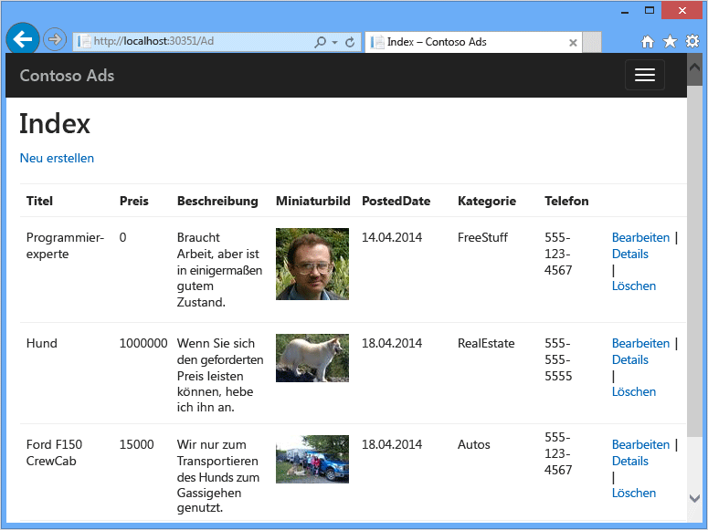

Sie können das [Visual Studio-Projekt][download] in der MSDN Code Gallery herunterladen.

[download]: http://code.msdn.microsoft.com/Simple-Azure-Website-with-b4391eeb

## Voraussetzungen

Dieses Lernprogramm setzt voraus, dass Sie mit der Arbeit mit [ASP.NET MVC](http://www.asp.net/mvc/tutorials/mvc-5/introduction/getting-started)- oder [Web Forms](http://www.asp.net/web-forms/tutorials/aspnet-45/getting-started-with-aspnet-45-web-forms/introduction-and-overview)-Projekten in Visual Studio vertraut sind. Die Beispielanwendung verwendet MVC, aber ein Großteil des Lernprogramms gilt auch für Web Forms.

Die Anweisungen im Lernprogramm funktionieren mit den folgenden Produkten:

* Visual Studio 2013
* Visual Studio 2013-Community
* Visual Studio 2013 Express für das Web

Falls Sie keines dieser Produkte haben, wird Visual Studio 2013 Express für das Web zusammen mit dem Azure SDK installiert.

[AZURE.INCLUDE [free-trial-note](../../includes/free-trial-note.md)]

>[AZURE.NOTE]Wenn Sie Azure App Service ausprobieren möchten, ehe Sie sich für ein Azure-Konto anmelden, können Sie unter [App Service testen](http://go.microsoft.com/fwlink/?LinkId=523751) sofort kostenlos eine kurzlebige Starter-Web-App in App Service erstellen. Keine Kreditkarte erforderlich, keine Verpflichtungen.

## Sie lernen Folgendes

Dieses Lernprogramm beschreibt die folgenden Aufgaben:

* Ermöglichen der Azure-Entwicklung auf Ihrem Computer durch Installieren des Azure SDK.
* Erstellen eines Konsolenanwendungsprojekts, das automatisch als Azure WebJob bereitgestellt wird, wenn Sie das zugehörige Webprojekt bereitstellen.
* Lokales Testen des WebJobs SDK-Back-Ends auf dem Entwicklungscomputer.
* Veröffentlichen einer Anwendung mit einem Webauftrags-Back-End in einer Web-App in App Service.
* Hochladen von Dateien und Speicherung der Dateien im Azure-Blob-Dienst.
* Verwenden des Azure WebJobs SDK für die Arbeit mit Azure-Speicher-Warteschlangen und -Blobs.

## Anwendungsarchitektur

Die Beispielanwendung verwendet das [warteschlangenorientierte Arbeitsmuster](http://www.asp.net/aspnet/overview/developing-apps-with-windows-azure/building-real-world-cloud-apps-with-windows-azure/queue-centric-work-pattern), um die CPU-intensive Last der Erstellung von Miniaturbildern an einen Back-End-Prozess auszulagern.

Die Anwendung speichert Werbungen in einer SQL-Datenbank und verwendet Entity Framework Code First, um Tabellen zu erstellen und auf Daten zuzugreifen. Pro Werbung werden in der Datenbank zwei URLs gespeichert, eine für das Bild in voller Größe und eine für die Miniaturansicht.

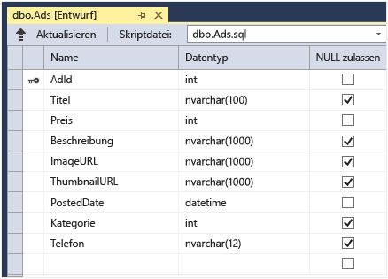

Wenn ein Benutzer ein Bild hochlädt, speichert das Front-End der Web-App das Bild in einem [Azure-Blob](http://www.asp.net/aspnet/overview/developing-apps-with-windows-azure/building-real-world-cloud-apps-with-windows-azure/unstructured-blob-storage) und die Werbeinformationen in der Datenbank zusammen mit einer URL, die auf das Blob zeigt. Gleichzeitig wird eine Nachricht in eine Azure-Warteschlange geschrieben. Ein als Azure WebJob ausgeführter Back-End-Prozess verwendet das WebJobs SDK, um die Warteschlange auf neue Nachrichten zu überprüfen. Wenn eine neue Nachricht vorhanden ist, erstellt der WebJob eine Miniaturansicht für das Bild und aktualisiert das entsprechende Datenbankfeld mit der URL für diese Werbung. Das folgende Diagramm zeigt die Interaktion zwischen den verschiedenen Anwendungskomponenten:

### Alternative Architektur

Webaufträge werden im Kontext einer Web-App ausgeführt und können nicht separat skaliert werden. Wenn Sie z. B. eine Standard-Web-App-Instanz haben, können Sie nur eine Instanz Ihres Hintergrundprozesses ausführen. Dieser Prozess verwendet Serverressourcen (Prozessor, Arbeitsspeicher usw.), die andernfalls für die Auslieferung von Webinhalten zur Verfügung stehen würden.

Wenn der Datenverkehr je nach Tageszeit oder Wochentag schwankt und Ihre Back-End-Verarbeitung nicht zeitkritisch ist, können Sie die Ausführung Ihrer WebJobs in Zeiten mit niedrigem Datenverkehr planen. Wenn die Last immer noch zu hoch für diese Lösung ist, können Sie alternative Umgebungen für Ihr Back-End-Programm in Betracht ziehen:

* Führen Sie das Programm als Webauftrag in einer separaten Web-App aus, die ausschließlich zu diesem Zweck dient. Auf diese Weise können Sie Ihre Back-End-Web-App unabhängig von Ihrer Front-End-Web-App skalieren.
* Führen Sie das Programm in einer Azure-Clouddienst-Workerrolle aus. Mit dieser Option können Sie das Front-End entweder in einer Cloud-Dienst-Webrolle oder in einer Web-App ausführen.

Dieses Lernprogramm beschreibt, wie Sie das Front-End in einer Web-App und das Back-End als Webauftrag in derselben Web-App ausführen können. Informationen zur Auswahl der optimalen Umgebung für Ihr Szenario finden Sie unter [Vergleich von Web-Apps, Cloud-Diensten und virtuellen Computern in Azure](../choose-web-site-cloud-service-vm/).

[AZURE.INCLUDE [install-sdk-2013-only](../../includes/install-sdk-2013-only.md)]

Die Anleitungen in diesem Lernprogramm gelten für das Azure SDK für .NET 2.5.1 oder höher. Im Abschnitt zum Erstellen von Grund auf, in dem Sie das Webauftragsprojekt erstellen, werden die Webaufträge-SDK-Pakete automatisch in das Projekt eingeschlossen. Bei früheren Versionen des SDK müssen Sie die Pakete manuell installieren.

## Erstellen eines Azure-Speicherkontos

Azure-Speicherkonten bieten Ressourcen zum Speichern von Warteschlangen- und Blobdaten in der Cloud. Das WebJobs SDK verwendet das Speicherkonto außerdem zum Speichern von Protokollierungsdaten für das Dashboard.

In einer tatsächlichen Anwendung würden Sie normalerweise separate Konten für Anwendungsdaten und Protokolldaten sowie für Test- und Produktionsdaten erstellen. In diesem Lernprogramm verwenden wir nur ein einziges Konto.

1. Öffnen Sie das Fenster **Server-Explorer** in Visual Studio.

2. Klicken Sie mit der rechten Maustaste auf den **Azure**-Knoten, und klicken Sie dann auf**Mit Microsoft Azure verbinden**.

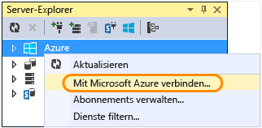

3. Melden Sie sich mit Ihren Azure-Anmeldeinformationen an.

5. Klicken Sie mit der rechten Maustaste im Azure-Knoten auf **Speicher**, und klicken Sie dann auf **Speicherkonto erstellen**.

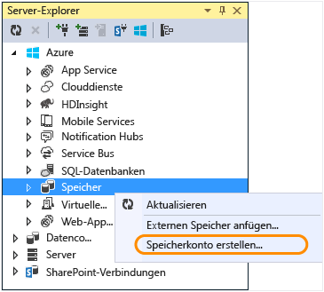

3. Geben Sie im Dialogfeld **Speicherkonto erstellen** einen Namen für das Speicherkonto ein. 

	Der Name muss eindeutig sein (kein anderes Azure Storage-Konto kann den gleichen Namen haben). Wenn der eingegebene Name bereits verwendet wird, haben Sie die Möglichkeit, ihn zu ändern.

	Die URL für den Zugriff auf Ihr Speicherkonto lautet *{Name}*.core.windows.net.

5. Wählen Sie in der Dropdownliste **Region oder Affinitätsgruppe** den Ihnen am nächsten gelegenen Ort aus.

	Diese Einstellung legt fest, in welchem Azure-Rechenzentrum Ihr Speicherkonto gehostet wird. In diesem Lernprogramm macht Ihre Auswahl keinen großen Unterschied. Für Produktions-Web-Apps sollten Ihr Webserver und Ihr Speicherkonto jedoch in der gleichen Region liegen, um Latenz und Kosten für die Datenübertragung zu minimieren. Die Web-App (die Sie später erstellen) sollte sich möglichst nahe an den Browsern befinden, die auf die Web-App zugreifen, um die Latenz zu minimieren.

6. Wählen Sie in der Dropdownliste **Replikation** den Wert **Lokal redundant** aus.

	Wenn Georeplikation für ein Speicherkonto aktiviert ist, werden dessen Inhalte an ein zweites Datencenter repliziert, um im Katastrophenfall eine Failover-Instanz an diesem zweiten Standort zur Verfügung zu haben. Für die Georeplikation können zusätzliche Kosten anfallen. Für Test- und Entwicklungskonten macht es wenig Sinn, für Georeplikation zu bezahlen. Weitere Informationen finden Sie unter [Erstellen, Verwalten oder Löschen eines Speicherkontos](../storage-create-storage-account/#replication-options).

5. Klicken Sie auf **Erstellen**.

	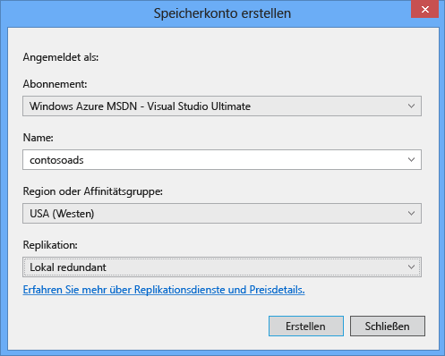

## Herunterladen der Anwendung
 
1. Laden Sie die [abgeschlossene Lösung][download] herunter und entzippen Sie das Archiv.

2. Starten Sie Visual Studio.

3. Wählen Sie im Menü **Datei** die Option **Öffnen** **Projekt/Lösung**, navigieren Sie zu dem Ort, an dem Sie die Lösung gespeichert haben und öffnen Sie die Lösungsdatei.

3. Drücken Sie STRG+UMSCH+B, um die Lösung zu erstellen.

	Standardmäßig stellt Visual Studio den Inhalt des NuGet-Pakets automatisch wieder her, das nicht in der *.zip*-Datei enthalten war. Wenn die Pakete nicht wiederhergestellt werden, installieren Sie diese manuell, indem Sie das Dialogfeld **NuGet-Pakete verwalten** öffnen und oben rechts auf **Wiederherstellen** klicken.

3. Vergewissern Sie sich im **Projektmappen-Explorer**, dass **ContosoAdsWeb** als Startprojekt ausgewählt ist.

## Konfigurieren der Anwendung zur Verwendung Ihres Speicherkontos

2. Öffnen Sie die Datei *Web.config* für das ContosoAdsWeb-Projekt.
 
	Die Datei enthält eine SQL-Verbindungszeichenfolge und eine Azure-Speicher-Verbindungszeichenfolge für die Arbeit mit Blobs und Warteschlangen.

	Die SQL-Verbindungszeichenfolge zeigt auf eine [SQL Server Express LocalDB](http://msdn.microsoft.com/library/hh510202.aspx)-Datenbank.
 
	Die Speicherverbindungszeichenfolge ist ein Beispiel, das Platzhalter für den Namen des Speicherkontos und den Zugriffsschlüssel verwendet. Sie müssen dies durch eine Verbindungszeichenfolge mit dem Namen und Schlüssel des Speicherkontos ersetzen.

	<pre class="prettyprint">&lt;connectionStrings>
  &lt;add name="ContosoAdsContext" connectionString="Data Source=(localdb)\v11.0; Initial Catalog=ContosoAds; Integrated Security=True; MultipleActiveResultSets=True;" providerName="System.Data.SqlClient" />
  &lt;add name="AzureWebJobsStorage" connectionString="DefaultEndpointsProtocol=https;AccountName=<mark>[Kontoname]</mark>;AccountKey=<mark>[Zugriffsschlüssel]</mark>"/>
&lt;/connectionStrings></pre>Die Speicher-Verbindungszeichenfolge hat den Namen AzureWebJobsStorage, da dies der Name ist, den das WebJobs SDK standardmäßig verwendet. Hier wird derselbe Name verwendet, sodass Sie nur einen Verbindungszeichenfolgenwert in der Azure-Umgebung festlegen müssen.
 
2. Klicken Sie im **Server-Explorer** mit der rechten Maustaste auf Ihr Speicherkonto im Knoten **Speicher**, und klicken Sie anschließend auf **Eigenschaften**.

	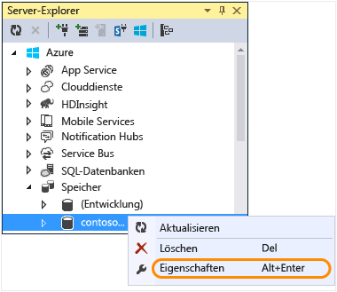

4. Klicken Sie im Fenster**Eigenschaften** auf **Speicherkontoschlüssel** und dann auf die Auslassungspunkte.

	

7. Kopieren Sie die **Verbindungszeichenfolge**.

	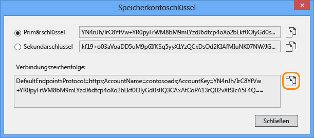

8. Ersetzen Sie die Speicher-Verbindungszeichenfolge in der Datei *Web.config* durch die Verbindungszeichenfolge, die Sie gerade kopiert haben. Vergewissern Sie sich, dass alles innerhalb der Anführungszeichen, aber nicht die Anführungszeichen selbst ausgewählt sind, bevor Sie den Inhalt einfügen.

4. Öffnen Sie die Datei *App.config* für das ContosoAdsWebJob-Projekt.

	Die Datei enthält zwei Verbindungszeichenfolgen: eine für die Anwendungsdaten und eine für die Protokollierung. In diesem Lernprogramm verwenden Sie dasselbe Konto für beide Funktionen. Die Verbindungszeichenfolgen enthalten Platzhalter für die Speicherkontoschlüssel. <pre class="prettyprint">&lt;configuration&gt; &lt;connectionStrings&gt; &lt;add name="AzureWebJobsDashboard" connectionString="DefaultEndpointsProtocol=https;AccountName=<mark>[Kontoname]</mark>;AccountKey=<mark>[Zugriffsschlüssel]</mark>"/&gt; &lt;add name="AzureWebJobsStorage" connectionString="DefaultEndpointsProtocol=https;AccountName=<mark>[Kontoname]</mark>;AccountKey=<mark>[Zugriffsschlüssel]</mark>"/&gt; &lt;add name="ContosoAdsContext" connectionString="Data Source=(localdb)\\v11.0; Initial Catalog=ContosoAds; Integrated Security=True; MultipleActiveResultSets=True;"/&gt; &lt;/connectionStrings&gt; &lt;startup&gt; &lt;supportedRuntime version="v4.0" sku=".NETFramework,Version=v4.5" /&gt; &lt;/startup&gt; &lt;/configuration&gt;</pre>

	Standardmäßig sucht das WebJobs SDK nach Verbindungszeichenfolgen mit den Namen AzureWebJobsStorage und AzureWebJobsDashboard. Alternativ können Sie [beliebige Namen für die Verbindungszeichenfolgen vergeben und die Namen explizit an das `JobHost`-Objekt übergeben](websites-dotnet-webjobs-sdk-storage-queues-how-to.md#config).

1. Ersetzen Sie beide Speicher-Verbindungszeichenfolgen mit der Verbindungszeichenfolge, die Sie zuvor kopiert haben.

5. Speichern Sie die Änderungen.

## Lokales Ausführen der Anwendung

1. Starten Sie das Web-Front-End der Anwendung mit STRG+F5. 

	Die Startseite wird in Ihrem Standardbrowser geöffnet. (Das Webprojekt wird ausgeführt, da es als Startprojekt konfiguriert ist.)

	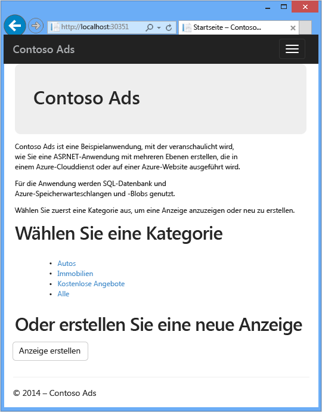

2. Klicken Sie mit der rechten Maustaste auf das ContosoAdsWebJob-Projekt im **Projektmappen-Explorer** und anschließend auf **Debug** > **Neue Instanz starten**, um das WebJobs-Back-End der Anwendung zu starten.

	Ein Konsolenfenster wird geöffnet und zeigt Protokollierungsmeldungen an, die zeigen, dass das WebJobs-SDK-JobHost-Objekt jetzt ausgeführt wird.

	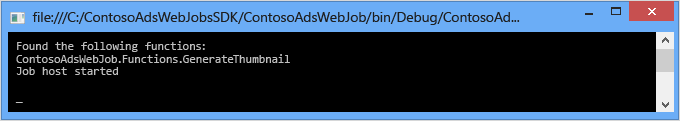

2. Klicken Sie in Ihrem Browser auf **Werbung erstellen**.

2. Geben Sie einige Testdaten ein, wählen Sie ein hochzuladendes Bild aus, und klicken Sie auf **Erstellen**.

	

	Die Anwendung wechselt zur Indexseite, zeigt jedoch noch keine Miniaturansicht für die neue Werbung an, da diese Verarbeitung noch nicht erfolgt ist.

	Nach einer kurzen Wartezeit erscheint eine Protokollierungsnachricht im Konsolenfenster und zeigt an, dass eine Warteschlangen-Nachricht empfangen und verarbeitet wurde.

	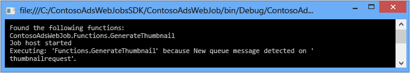

3. Nachdem die Protokollierungsnachricht im Konsolenfenster angezeigt wurde, können Sie die Indexseite aktualisieren, um die Miniaturansicht anzuzeigen.

	

4. Klicken Sie auf **Details** für Ihre Werbung, um das Bild in voller Größe anzuzeigen.

	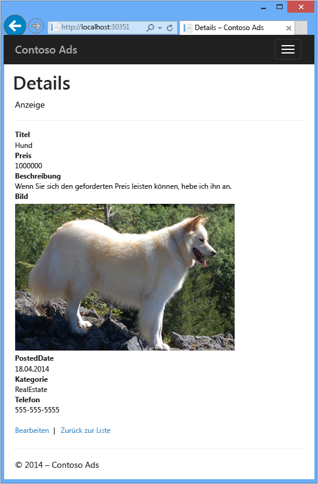

Sie haben die Anwendung auf Ihrem lokalen Computer ausgeführt und eine SQL Server-Datenbank auf Ihrem Computer verwendet. Die Anwendung verwendet jedoch Warteschlangen und Blobs in der Cloud. Im folgenden Abschnitt werden Sie die Anwendung in der Cloud ausführen und eine Cloud-Datenbank sowie Cloud-Blobs und -Warteschlangen verwenden.

## Ausführen der Anwendung in der Cloud

Führen Sie folgende Schritte aus, um die Anwendung in der Cloud auszuführen:

* Führen Sie Bereitstellung in den Web-Apps durch. Visual Studio erstellt automatisch eine neue Web-App in App Service sowie die SQL-Datenbankinstanz.
* Konfigurieren Sie die Web-App zur Verwendung Ihrer Azure SQL-Datenbank und Ihres Speicherkontos.

Nachdem Sie einige Werbeeinblendungen unter Ausführung in der Cloud erstellt haben, können Sie das WebJobs SDK-Dashboard öffnen, um dessen umfassende Überwachungsfeatures zu erkunden.

### Bereitstellen in Web-Apps

1. Schließen Sie Ihren Browser und das Konsolenfenster.

3. Klicken Sie im **Projektmappen-Explorer** mit der rechten Maustaste auf das ContosoAdsWeb-Projektmappen-Explorer und dann auf **Veröffentlichen**.

3. Klicken Sie im Schritt **Profil** im Assistenten **Web veröffentlichen** auf **Microsoft Azure-Web-Apps**.

	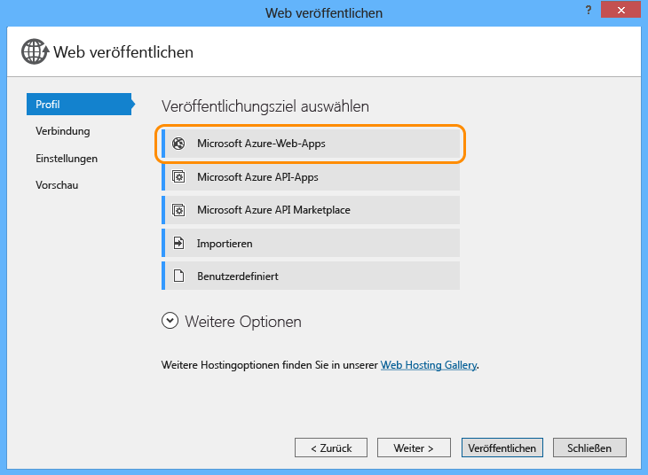

2. Klicken Sie im Feld **Vorhandene Web-App auswählen** auf **Anmelden**, und geben Sie Ihre Anmeldeinformationen ein, sofern Sie noch nicht angemeldet sind.
 
5. Klicken Sie nach der Anmeldung auf **Neu**.

	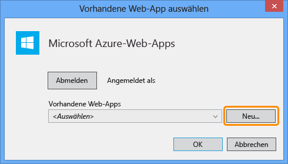

9. Geben Sie im Dialogfeld **Web-App auf Microsoft Azure erstellen** einen eindeutigen Namen in das Feld **Web-App-Name** ein.

	Die vollständige URL besteht aus der hier eingegebenen Zeichenfolge und ".azurewebsites.net" (wie neben dem Textfeld **Web-App-Name** angezeigt). Beispiel: Wenn der Web-App-Name "ContosoAds" lautet, ist die URL "ContosoAds.azurewebsites.net".

9. Wählen Sie in der Dropdownliste [App Service-Plan](../app-service/azure-web-sites-web-hosting-plans-in-depth-overview.md) die Option **Neuen App Services-Plan erstellen** aus.

11. Geben Sie einen Namen für den App Service-Plan ein, z. B. ContosoAdsPlan.

9. Wählen Sie in der Dropdownliste [Ressourcengruppe](../resource-group-overview.md) die Option **Neue Ressourcengruppe erstellen** aus.

11. Geben Sie einen Namen für die Ressourcengruppe ein, z. B. ContosoAdsGroup.

9. Wählen Sie in der Dropdownliste **Region** dieselbe Region aus, die Sie für Ihr Speicherkonto ausgewählt haben.

	Mit dieser Einstellung wird das Azure-Datencenter angegeben, in dem Ihre Web-App ausgeführt wird. Wenn sich Web-App und Speicherkonto im gleichen Datencenter befinden, werden Latenz und Datenübertragungskosten minimiert.

9. Wählen Sie in der Dropdownliste **Datenbankserver** die Option **Neuen Server erstellen** aus.

	Falls Ihr Konto bereits einen Server enthält, können Sie auch diesen Server aus der Dropdownliste auswählen.

1. Geben Sie einen Namen für den Datenbankserver ein, z. B. ContosoAdsServer.

1. Geben Sie unter **Datenbank-Benutzername** und **Datenbank-Kennwort** die Anmeldedaten eines Administrators ein.

	Wenn Sie **New SQL Database server** ausgewählt haben, geben Sie hier keinen vorhandenen Namen und kein vorhandenes Kennwort ein. Stattdessen definieren Sie jetzt einen neuen Namen und ein neues Kennwort zur späteren Verwendung beim Datenbankzugriff. Wenn Sie einen zuvor erstellten Server ausgewählt haben, werden Sie aufgefordert, das Kennwort für den zuvor erstellten Administratorbenutzer einzugeben.

1. Klicken Sie auf **Erstellen**.

	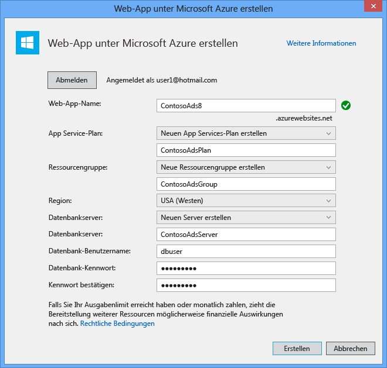

	Visual Studio erstellt die Projektmappe, das Webprojekt, die Web-App in Azure und die Azure-SQL-Datenbankinstanz.

2. Klicken Sie im Schritt **Verbindung** des Assistent **Web veröffentlichen** auf **Weiter**.

	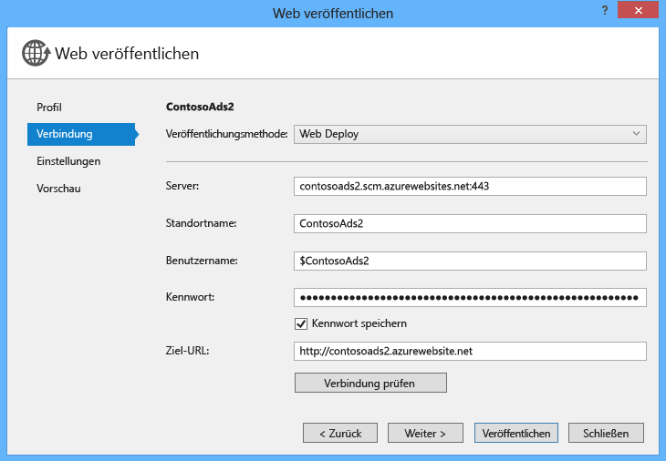

3. Entfernen Sie im Schritt **Einstellungen** das Häkchen in **Diese Verbindungszeichenfolge zur Laufzeit verwenden** und klicken Sie auf **Weiter**.

	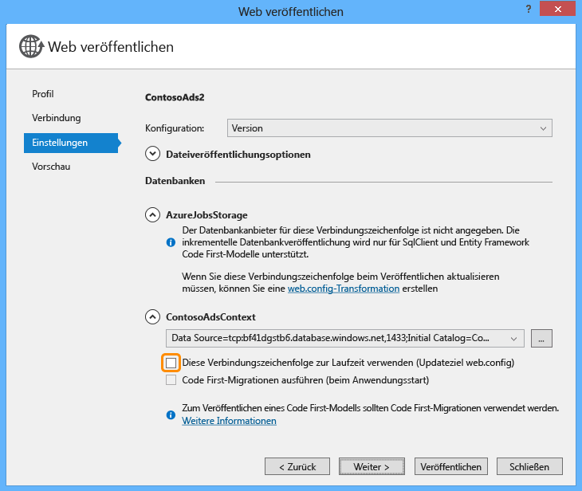
	
	Sie müssen die SQL-Verbindungszeichenfolge im Veröffentlichungsdialog nicht eingeben, da Sie diesen Wert später in der Azure-Umgebung setzen werden.

	Sie können die Warnungen auf dieser Seite ignorieren.

	* Normalerweise verwenden Sie für die Ausführung in Azure ein anderes Speicherkonto als bei der lokalen Ausführung. Dieses Lernprogramm verwendet jedoch dasselbe Speicherkonto für beide Umgebungen. Die AzureWebJobsStorage-Verbindungszeichenfolge muss daher nicht geändert werden. Selbst wenn Sie ein anderes Speicherkonto in der Cloud verwenden wollten, müssen Sie diese Verbindungszeichenfolge nicht ändern, da die Anwendung bei der Ausführung in Azure eine Azure-Umgebungseinstellung verwendet. Dieser Punkt wird später in diesem Lernprogramm behandelt.

	* Für dieses Lernprogramm nehmen Sie keine Änderungen am Datenmodell für die ContosoAdsContext-Datenbank vor und müssen daher keine Entity Framework Code First-Migrationen für die Bereitstellung verwenden. Code First erstellt automatisch eine neue Datenbank, wenn die Anwendung zum ersten Mal versucht, auf SQL-Daten zuzugreifen.

	Für dieses Lernprogramm können Sie die Standardwerte für die Optionen unter **Dateiveröffentlichungsoptionen** verwenden.

4. Klicken Sie im Schritt **Vorschau** auf **Vorschau starten**.

	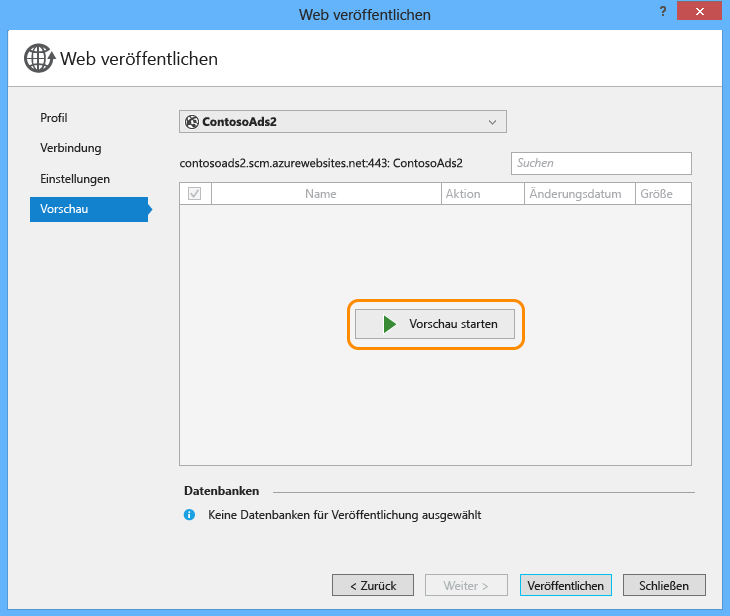

	Sie können die Warnung ignorieren, dass keine Datenbanken veröffentlicht werden. Die Datenbank wird von Entity Framework Code First erstellt und muss daher nicht veröffentlicht werden.

	Im Vorschaufenster wird angezeigt, dass Binär- und Konfigurationsdateien aus dem Webauftragsprojekt in den Ordner *app_data\\jobs\\continuous* der Web-App kopiert werden.

	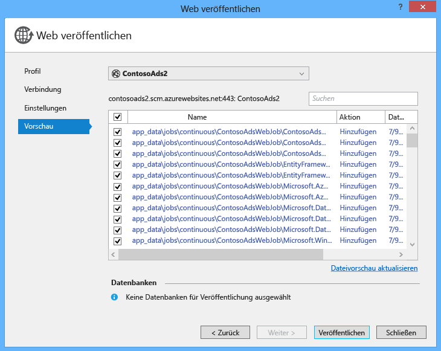

5. Klicken Sie auf **Veröffentlichen**.

	Visual Studio stellt die Anwendung bereit und öffnet die URL der Startseite im Browser.

	Sie können die Web-App jedoch erst verwenden, nachdem Sie die Verbindungszeichenfolgen für die Azure-Umgebung im nächsten Abschnitt konfiguriert haben. Je nach den Web-App- und Datenbankerstellungsoptionen, die Sie zuvor ausgewählt haben, wird entweder eine Fehlerseite oder die Startseite angezeigt.

### Konfigurieren Sie die Web-App zur Verwendung Ihrer Azure SQL-Datenbank und Ihres Speicherkontos.

Sie sollten es vermeiden [sensible Daten wie Verbindungszeichenfolgen in Dateien zu lagern, die in Quellcode-Repositorys gespeichert werden](http://www.asp.net/aspnet/overview/developing-apps-with-windows-azure/building-real-world-cloud-apps-with-windows-azure/source-control#secrets). Azure bietet hierfür eine Möglichkeit: Sie können die Verbindungszeichenfolge und andere Einstellungswerte in der Azure-Umgebung setzen, und die Konfigurations-APIs von ASP.NET verwenden automatisch diese Werte, wenn die Anwendung in Azure ausgeführt wird. In diesem Abschnitt setzen Sie die Verbindungszeichenfolgen in Azure.

7. Klicken Sie im **Server-Explorer** unter dem Knoten**Web-Apps** mit der rechten Maustaste auf Ihre Web-App, und klicken Sie dann auf **Ansichtseinstellungen**.

	Das Fenster **Azure-Web-App** wird auf der Registerkarte **Konfiguration** geöffnet.

9. Ändern Sie den Namen der DefaultConnection-Verbindungszeichenfolge zu ContosoAdsContext.

	Azure hat diese Verbindungszeichenfolge automatisch erstellt, als Sie die Web-App mit zugehöriger Datenbank erstellt haben, und die Verbindungszeichenfolge enthält bereits den korrekten Wert. Sie ändern also nur den Namen, nach dem Ihr Code suchen soll.

9. Fügen Sie zwei neue Verbindungszeichenfolgen mit den Namen AzureWebJobsStorage und AzureWebJobsDashboard hinzu. Setzen Sie deren Typ auf "Benutzerdefiniert" und setzen Sie die Verbindungszeichenfolge auf denselben Wert, den Sie zuvor in den Dateien *Web.config* und *App.config* verwendet haben. (Verwenden Sie unbedingt die komplette Verbindungszeichenfolge und nicht nur den Zugriffsschlüssel, und verwenden Sie keine Anführungszeichen.)

	Diese Verbindungszeichenfolgen werden vom WebJobs SDK verwendet, je eine für die Anwendungsdaten und für die Protokollierung. Wie Sie bereits gesehen haben, wird die Verbindungszeichenfolge für die Anwendungsdaten auch vom Code des Web-Front-Ends verwendet.
	
9. Klicken Sie auf **Speichern**.

	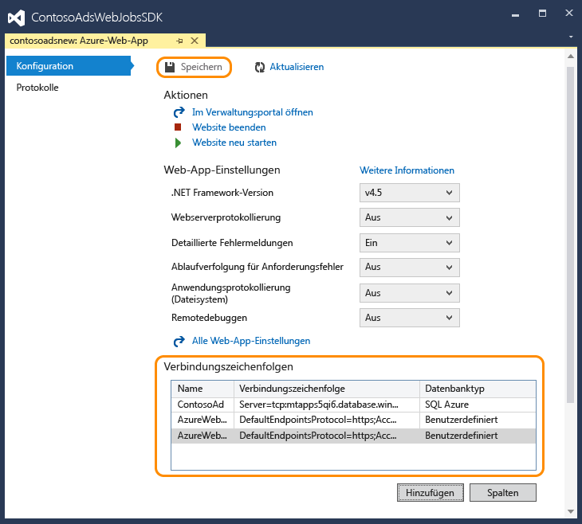

10. Klicken Sie im **Server-Explorer** mit der rechten Maustaste auf die Web-App, und klicken Sie dann auf **Web-App beenden**.

12. Nachdem die Web-App beendet wurde, klicken Sie mit der rechten Maustaste erneut auf die Web-App, und klicken Sie dann auf **Web-App starten**.

	Der WebJob wird bei der Veröffentlichung automatisch gestartet, wird jedoch bei Änderungen an der Konfiguration angehalten. Für einen Neustart können Sie entweder die Web-App oder den Webauftrag im [Azure-Portal](http://go.microsoft.com/fwlink/?LinkId=529715) neu starten. Nach einer Konfigurationsänderung sollten Sie jedoch im Allgemeinen die Web-App neu starten.

9. Aktualisieren Sie das Browserfenster mit der Web-App-URL in der Adressleiste.

	Die Startseite wird angezeigt.

10. Erstellen Sie eine Werbung wie bereits zuvor bei der lokalen Ausführung der Anwendung.

	Die Indexseite wird zunächst ohne Miniaturansicht angezeigt.

11.	Aktualisieren Sie die Seite nach wenigen Sekunden, und die Miniaturansicht erscheint.

	Wenn die Miniaturansicht nicht angezeigt wird, kann es sein, dass der WebJob nicht automatisch gestartet wurde. Öffnen Sie in diesem Fall die WebJobs-Registerkarte im
 

### Anzeigen des WebJobs SDK-Dashboards

1. Wählen Sie im [Azure-Portal](https://manage.windowsazure.com) Ihre Web-App aus.

2. Klicken Sie auf die Registerkarte **WebJobs**.

3. Klicken Sie auf die URL in der "Protokolle"-Spalte für Ihren WebJob.

	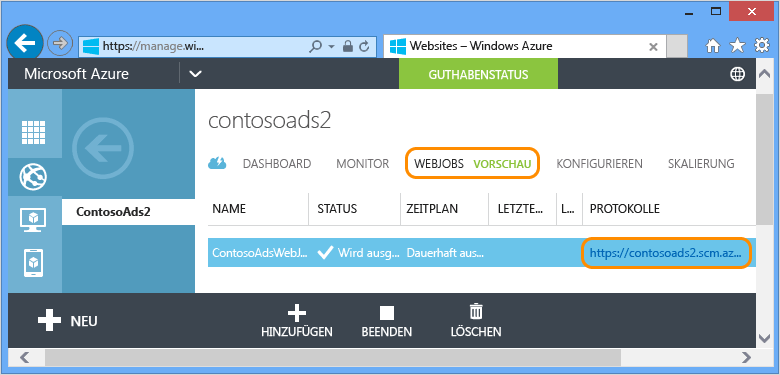

	Das WebJobs SDK-Dashboard wird in einer neuen Browser-Registerkarte geöffnet. Das Dashboard zeigt an, dass der WebJob ausgeführt wird, und enthält außerdem eine Liste der Funktionen in Ihrem Code, die vom WebJobs SDK ausgelöst wurden.

4. Klicken Sie auf eine der Funktionen, um Details zu deren Ausführung anzuzeigen
 
	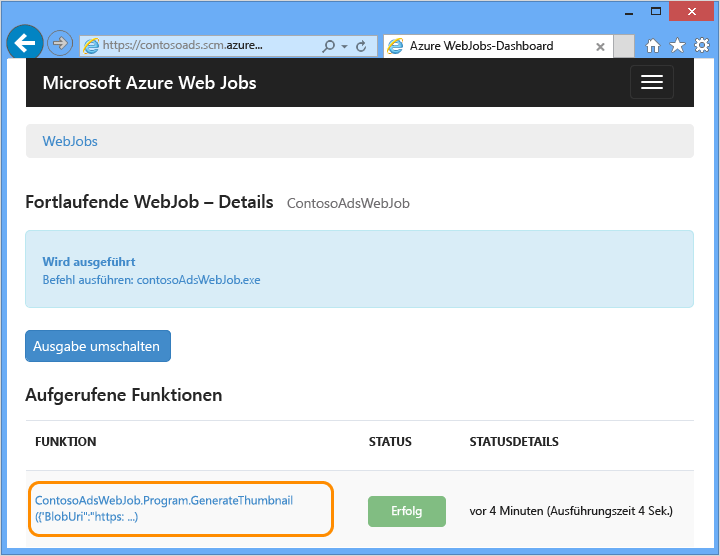

	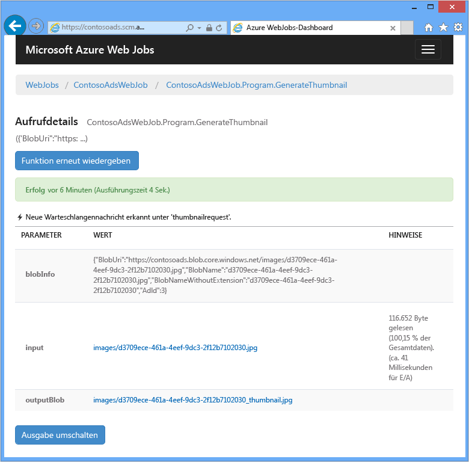

	Mit der Schaltfläche **Funktion abspielen** auf dieser Seite können Sie veranlassen, dass das WebJobs SDK-Framework die Funktion erneut aufruft, und können die an die Funktion übergebenen Daten zuvor ändern.

>[AZURE.NOTE]Nach Abschluss der Tests löschen Sie die Web-App und die SQL-Datenbankinstanz. Die Web-App ist kostenlos, aber für die SQL-Datenbankinstanz und das Speicherkonto fallen Kosten an (minimal aufgrund der kleinen Größe). Wenn Sie die Web-App laufen lassen, kann außerdem jeder, der die URL findet, Werbungen erstellen und anzeigen. Navigieren Sie im Azure-Portal zur Registerkarte **Dashboard** für Ihre Web-App, und klicken Sie dann am unteren Seitenrand auf **Löschen**. Dort finden Sie auch ein Kontrollkästchen, um die SQL-Datenbankinstanz ebenfalls zu löschen. Klicken Sie stattdessen auf **Anhalten**, um nur vorübergehend zu verhindern, dass andere Personen auf die Web-App zugreifen. In diesem Fall entstehen weiterhin Kosten für SQL-Datenbank und Speicherkonto. Sie können die SQL-Datenbank und das Speicherkonto auf ähnliche Weise löschen, wenn Sie diese nicht mehr benötigen.

### Aktivieren von "AlwaysOn" für lang andauernde Prozesse

Um sicherzustellen, dass Ihre Webaufträge immer ausgeführt werden und auf allen Instanzen der Web-App laufen, muss die Funktion [AlwaysOn](http://weblogs.asp.net/scottgu/archive/2014/01/16/windows-azure-staging-publishing-support-for-web-sites-monitoring-improvements-hyper-v-recovery-manager-ga-and-pci-compliance.aspx) aktiviert sein.

## Erstellen der Anwendung von Grund auf 

In diesem Abschnitt werden Sie die folgenden Aufgaben ausführen:

* Erstellen Sie eine Visual Studio-Lösung mit einem Webprojekt.
* Fügen Sie ein Klassenbibliotheks-Projekt für die Datenzugriffsebene hinzu, das von Front-End und Back-End gemeinsam genutzt wird.
* Fügen Sie ein Konsolenanwendungsprojekt für das Back-End hinzu und aktivieren Sie die WebJobs-Bereitstellung.
* NuGet-Pakete hinzufügen.
* Projektverweise setzen.
* Kopieren Sie den Anwendungscode und die Konfigurationsdateien aus der heruntergeladenen Anwendung, mit der Sie im vorherigen Abschnitt dieses Lernprogramms gearbeitet haben.
* Prüfen Sie die Codeabschnitte, die Azure-Blobs, Warteschlangen und das WebJobs SDK verwenden.
 
### Erstellen einer Visual Studio-Lösung mit Webprojekt und Klassenbibliotheks-Projekt

1. Klicken Sie in Visual Studio auf **Neu** > **Projekt** im Menü **Datei**.

2. Klicken Sie im Dialogfeld **Neues Projekt** auf **Visual C#** > **Web** > **ASP.NET-Webanwendung**.

3. Nennen Sie das Projekt ContosoAdsWeb und die Lösung ContosoAdsWebJobsSDK (ändern Sie den Namen der Lösung, falls Sie diese im gleichen Ordner wie die heruntergeladene Lösung ablegen), und klicken Sie auf **OK**.

	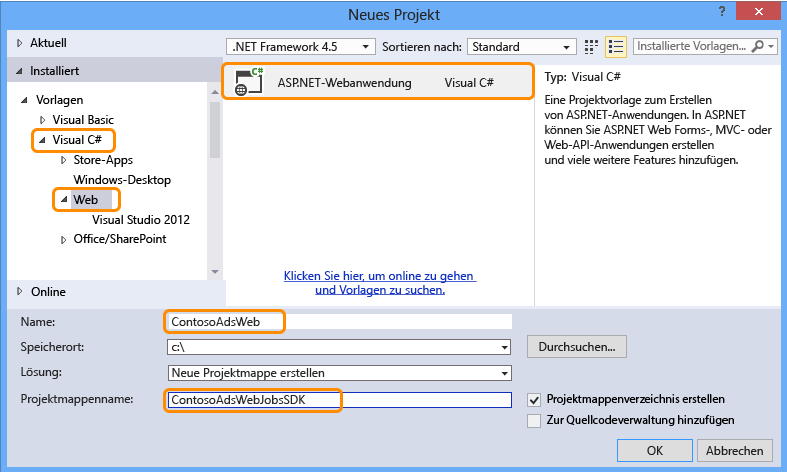

5. Wählen Sie im Dialogfeld **Neues ASP.NET-Projekt** die MVC-Vorlage aus und entfernen Sie das Häkchen im Kontrollkästchen **In der Cloud hosten** unter **Microsoft Azure**.

	Wenn Sie **In der Cloud hosten** aktivieren, erstellt Visual Studio automatisch eine neue Azure-Web-App und eine SQL-Datenbank. Sie haben diese Komponenten bereits zuvor erstellt und müssen dies bei der Projekterstellung daher nicht erneut tun. Markieren Sie das Kontrollkästchen, um die Komponenten neu zu erstellen. Anschließend können Sie die neue Web-App und die SQL-Datenbank auf dieselbe Weise konfigurieren, wie Sie dies zuvor beim Bereitstellen der Anwendung getan haben.

5. Klicken Sie auf **Authentifizierung ändern**.

	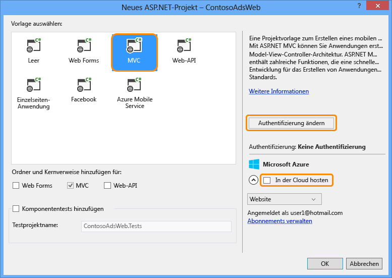

7. Klicken Sie im Dialogfeld **Authentifizierung ändern** auf **Keine Authentifizierung** und dann auf **OK**.

	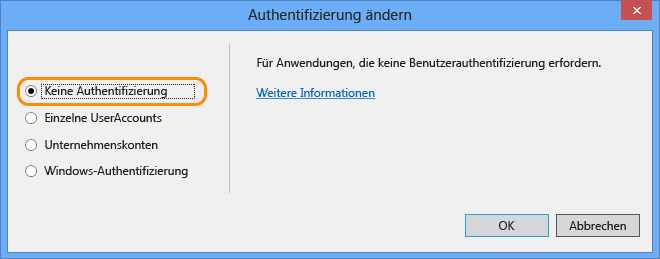

8. Klicken Sie im Dialogfeld **Neues ASP.Net-Projekt** auf **OK**.

	Visual Studio erstellt die Lösung und das Webprojekt.

9. Klicken Sie im **Projektmappen-Explorer** mit der rechten Maustaste auf die Lösung (nicht auf das Projekt) und klicken Sie auf **Hinzufügen** > **Neues Projekt**.

11. Wählen Sie im Dialogfeld **Neues Projekt** die Vorlage **Visual C#** > **Windows Desktop** > **Klassenbibliothek** aus.

10. Benennen Sie das Projekt *ContosoAdsCommon* und klicken Sie auf **OK**.

	Das Projekt wird den Entity Framework-Kontext und das Datenmodell enthalten, die sowohl vom Front-End als auch vom Back-End verwendet werden. Alternativ könnten Sie die EF-verwandten Klassen im Webprojekt definieren und im WebJob-Projekt auf dieses Projekt verweisen. In diesem Fall würde Ihr WebJob-Projekt jedoch auf Web-Assemblys verweisen, die es nicht benötigt.

### Hinzufügen eines Konsolenanwendungsprojekts und Aktivieren der WebJobs-Bereitstellung

11. Klicken Sie mit der rechten Maustaste auf das Webprojekt (nicht auf die Lösung oder das Klassenbibliotheks-Projekt). Klicken Sie auf **Hinzufügen** > **Neues Azure-WebJob-Projekt**.

	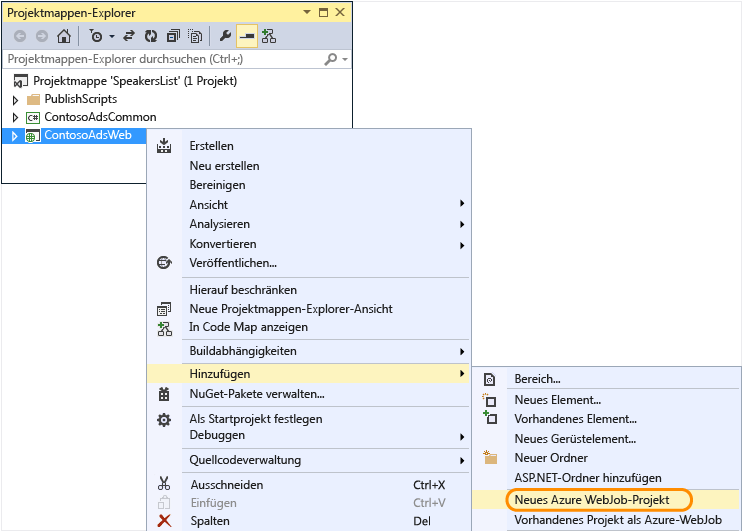

1. Geben Sie im Dialogfeld **Azure-WebJob hinzufügen** unter **Projektname** und **WebJob-Name** den Wert ContosoAdsWebJob ein. Behalten Sie unter **WebJob-Ausführungsmodus** den Wert **Fortlaufend ausführen** bei.

2.  Klicken Sie auf **OK**.
  
	Visual Studio erstellt eine Konsolenanwendung, die automatisch als Azure WebJob bereitgestellt wird, wenn Sie das Webprojekt bereitstellen. Dazu werden die folgenden Schritte nach der Projekterstellung ausgeführt:

	* Hinzufügen einer *webjob-publish-settings.json*-Datei im Eigenschaftenordner des WebJob-Projekts.
	* Hinzufügen einer *webjobs-list.json*-Datei im Eigenschaftenordner des Webprojekts.
	* Installieren des NuGet-Pakets "Microsoft.Web.WebJobs.Publish" im WebJob-Projekt.
	 
	Weitere Informationen zu diesen Änderungen finden Sie unter [Bereitstellen von WebJobs in Visual Studio](websites-dotnet-deploy-webjobs.md).

### NuGet-Pakete hinzufügen

Die Vorlage "new project" für ein Webauftragsprojekt installiert automatisch das Webauftrags-SDK-NuGet-Paket [Microsoft.Azure.WebJobs](http://www.nuget.org/packages/Microsoft.Azure.WebJobs) und seine Abhängigkeiten.

Eine der WebJobs-SDK-Abhängigkeiten, die automatisch im WebJob-Projekt installiert wird, ist die Azure Storage Client Library (SCL). Sie müssen diese jedoch zum Webprojekt hinzufügen, um mit Blobs und Warteschlangen arbeiten zu können.

11. Öffnen Sie das Dialogfeld **NuGet-Pakete verwalten** für die Lösung.

12. Klicken Sie im linken Bereich auf **Installierte Pakete**.
   
13. Wählen Sie das Paket *Azure-Speicher* aus und klicken Sie auf **Verwalten**.

13. Markieren Sie im Dialogfeld **Projekte auswählen** das Kontrollkästchen **ContosoAdsWeb** und klicken Sie auf **OK**.

Alle drei Projekte verwenden das Entity Framework für die Arbeit mit Daten in SQL-Datenbanken.

12. Klicken Sie im linken Bereich auf **Online**.
   
16. Suchen Sie das NuGet-Paket *EntityFramework* und installieren Sie es in allen drei Projekten.

### Setzen von Projektverweisen

Sowohl das Web- als auch das WebJob-Projekt verwenden die SQL-Datenbank. Daher benötigen beide Projekte einen Verweis auf das ContosoAdsCommon-Projekt.

10. Fügen Sie im Projekt ContosoAdsWeb einen Verweis auf das Projekt ContosoAdsCommon ein. Klicken Sie mit der rechten Maustaste auf das ContosoAdsWeb-Projekt und klicken Sie auf **Hinzufügen** > **Verweis**. Wählen Sie im Dialogfeld **Verweis-Manager** im linken Bereich **Lösung** > **Projekte** > **ContosoAdsCommon** aus und klicken Sie auf **OK**.)

11. Fügen Sie im Projekt ContosoAdsWebJob einen Verweis auf das Projekt ContosoAdsCommon ein.

Das WebJob-Projekt benötigt Verweise für die Arbeit mit Bildern und für den Zugriff auf Verbindungszeichenfolgen.

11. Legen Sie im Projekt "ContosoAdsWebJob" einen Verweis auf `System.Drawing` und `System.Configuration` fest.

### Hinzufügen von Code und Konfigurationsdateien

Dieses Lernprogramm befasst sich nicht mit der [Erstellung von MVC-Controller und -Ansichten mithilfe eines Gerüsts](http://www.asp.net/mvc/tutorials/mvc-5/introduction/getting-started), dem [Entity Framework-Code für die Arbeit mit SQL Server-Datenbanken](http://www.asp.net/mvc/tutorials/getting-started-with-ef-using-mvc) und den [Grundsätzen asynchroner Programmierung in ASP.NET 4.5](http://www.asp.net/aspnet/overview/developing-apps-with-windows-azure/building-real-world-cloud-apps-with-windows-azure/web-development-best-practices#async). Daher müssen Sie nur noch den Code und die Konfigurationsdateien aus der heruntergeladenen Lösung in die neue Lösung kopieren. Anschließend finden Sie in den folgenden Abschnitten Hinweise zu den wichtigsten Bereichen des Codes.

Um Dateien zu einem Projekt oder einem Ordner hinzuzufügen, klicken Sie mit der rechten Maustaste auf das Projekt bzw. den Ordner und klicken dann auf **Hinzufügen** > **Vorhandenes Element**. Wählen Sie die gewünschten Dateien aus und klicken Sie auf **Hinzufügen**. Klicken Sie auf **Ja**, wenn Sie gefragt werden, ob Sie vorhandene Dateien ersetzen möchten.

3. Löschen Sie im Projekt ContosoAdsCommon die Datei *Class1.cs* und fügen Sie an deren Stelle die folgenden Dateien aus dem heruntergeladenen Projekt hinzu.

	- *Ad.cs*
	- *ContosoAdscontext.cs*
	- *BlobInformation.cs*  

3. Fügen Sie im Projekt ContosoAdsWeb die folgenden Dateien aus dem heruntergeladenen Projekt hinzu.

	- *Web.config*
	- *Global.asax.cs*  
	- Im Ordner *Controllers*: *AdController.cs* 
	- Im Ordner *Views\\Shared*: Datei <em>_Layout.cshtml</em>. 
	- Im Ordner *Views\\Home*: *Index.cshtml*. 
	- Im Ordner *Views\\Ad* (Ordner zuerst erstellen): fünf *.cshtml*-Dateien.  

3. Fügen Sie im Projekt ContosoAdsWebJob die folgenden Dateien aus dem heruntergeladenen Projekt hinzu.

	- *App.config* (ändern Sie den Dateityp-Filter zu **Alle Dateien**)
	- *Program.cs*
	- *Functions.cs*

Sie können die Anwendung nun anhand der zuvor in diesem Lernprogramm beschriebenen Prozedur erstellen, ausführen und bereitstellen. Zuvor müssen Sie jedoch den Webauftrag anhalten, der immer noch in der ersten Web-App ausgeführt wird, in der Sie ihn bereitgestellt haben. Andernfalls verarbeitet dieser Webauftrag Warteschlangen-Nachrichten, die lokal oder von der in einer neuen Web-App ausgeführten App erstellt wurden, da alle Komponenten dasselbe Speicherkonto verwenden.

## Überprüfen des Anwendungscodes

Die folgenden Abschnitte beschreiben den Code für die Arbeit mit dem WebJobs SDK und Azure-Speicher-Blobs und Warteschlangen.

> **Hinweis:** Den speziellen Code für das WebJobs SDK finden Sie unter ["Program.cs" und "Functions.cs"](#programcs).

### ContosoAdsCommon - Ad.cs

Die Datei Ad.cs definiert eine Enumeration für Werbekategorien und eine POCO-Entitätsklasse für Werbeinformationen.

		public enum Category
		{
		    Cars,
		    [Display(Name="Real Estate")]
		    RealEstate,
		    [Display(Name = "Free Stuff")]
		    FreeStuff
		}

		public class Ad
		{
		    public int AdId { get; set; }

		    [StringLength(100)]
		    public string Title { get; set; }

		    public int Price { get; set; }

		    [StringLength(1000)]
		    [DataType(DataType.MultilineText)]
		    public string Description { get; set; }

		    [StringLength(1000)]
		    [DisplayName("Full-size Image")]
		    public string ImageURL { get; set; }

		    [StringLength(1000)]
		    [DisplayName("Thumbnail")]
		    public string ThumbnailURL { get; set; }

		    [DataType(DataType.Date)]
		    [DisplayFormat(DataFormatString = "{0:yyyy-MM-dd}", ApplyFormatInEditMode = true)]
		    public DateTime PostedDate { get; set; }

		    public Category? Category { get; set; }
		    [StringLength(12)]
		    public string Phone { get; set; }
		}

### ContosoAdsCommon - ContosoAdsContext.cs

Die Klasse ContosoAdsContext gibt an, dass die Ad-Klasse in einer DbSet-Sammlung verwendet wird, die von Entity Framework in einer SQL-Datenbank gespeichert wird.

		public class ContosoAdsContext : DbContext
		{
		    public ContosoAdsContext() : base("name=ContosoAdsContext")
		    {
		    }
		    public ContosoAdsContext(string connString)
		        : base(connString)
		    {
		    }
		    public System.Data.Entity.DbSet<Ad> Ads { get; set; }
		}
 
Die Klasse besitzt zwei Konstruktoren. Der erste Konstruktor wird vom Webprojekt verwendet und gibt den Namen einer Verbindungszeichenfolge an, die in der Datei Web.config oder in der Azure-Laufzeitumgebung gespeichert ist. Mit dem zweiten Konstruktor können Sie die eigentliche Verbindungszeichenfolge übergeben. Diese wird vom WebJob-Projekt benötigt, da dieses keine eigene Web.config-Datei hat. Sie haben weiter oben gesehen, wo diese Verbindungszeichenfolge gespeichert wird, und weiter unten werden Sie sehen, wie der Code die Verbindungszeichenfolge beim Instanziieren der DbContext-Klasse abruft.

### ContosoAdsCommon - BlobInformation.cs

Die `BlobInformation`-Klasse speichert Informationen über ein Bild-Blob in einer Warteschlangen-Nachricht.

		public class BlobInformation
		{
		    public Uri BlobUri { get; set; }
		    
		    public string BlobName
		    {
		        get
		        {
		            return BlobUri.Segments[BlobUri.Segments.Length - 1];
		        }
		    }
		    public string BlobNameWithoutExtension
		    {
		        get
		        {
		            return Path.GetFileNameWithoutExtension(BlobName);
		        }
		    }
		    public int AdId { get; set; }
		}

### ContosoAdsWeb - Global.asax.cs

Der aus der `Application_Start`-Methode aufgerufene Code erstellt einen *images*-Blob-Container und eine *images*-Warteschlange, falls diese noch nicht vorhanden sind. Damit wird sichergestellt, dass Blob-Container und Warteschlange immer automatisch erstellt werden, wenn Sie ein neues Speicherkonto verwenden.

Der Code verwendet die Speicher-Verbindungszeichenfolge aus der *Web.config*-Datei oder aus der Azure-Laufzeitumgebung für den Zugriff auf das Speicherkonto.

		var storageAccount = CloudStorageAccount.Parse
		    (ConfigurationManager.ConnectionStrings["AzureWebJobsStorage"].ToString());

Anschließend ruft er einen Verweis auf den *images*-Blob-Container ab, erstellt den Container, falls dieser noch nicht existiert, und setzt die Zugriffsberechtigungen für den neuen Container. Standardmäßig erlauben neue Container nur Clients mit Speicherkonto-Anmeldeinformationen den Zugriff auf Blobs. Für die Web-App müssen die Blobs öffentlich sein, damit Bilder mithilfe von URLs, die auf die Bild-Blobs zeigen, angezeigt werden können.

		var blobClient = storageAccount.CreateCloudBlobClient();
		var imagesBlobContainer = blobClient.GetContainerReference("images");
		if (imagesBlobContainer.CreateIfNotExists())
		{
		    imagesBlobContainer.SetPermissions(
		        new BlobContainerPermissions
		        {
		            PublicAccess = BlobContainerPublicAccessType.Blob
		        });
		}

Ein ähnlicher Codeabschnitt ruft einen Verweis auf die *blobnamerequest*-Warteschlange ab und erstellt eine neue Warteschlange. In diesem Fall sind keine Berechtigungsänderungen erforderlich. Der Abschnitt [ResolveBlobName](#resolveblobname) in diesem Lernprogramm erläutert, warum die Warteschlange, in die die Webanwendung schreibt, nur zum Abrufen der Blobnamen verwendet wird, und nicht für die Generierung der Miniaturansichten.

		CloudQueueClient queueClient = storageAccount.CreateCloudQueueClient();
		var imagesQueue = queueClient.GetQueueReference("blobnamerequest");
		imagesQueue.CreateIfNotExists();

### ContosoAdsWeb - _Layout.cshtml

Die *_Layout.cshtml*-Datei setzt den App-Namen in Kopf- und Fußzeile und erstellt einen "Ads"-Menüeintrag.

### ContosoAdsWeb - Views\\Home\\Index.cshtml

Die *Views\\Home\\Index.cshtml*-Datei zeigt Links zu den Kategorien auf der Startseite an. Die Links übergeben den ganzzahligen Wert aus der `Category`-Enumeration in einer querystring-Variable an die Ads-Indexseite.
	
		<li>@Html.ActionLink("Cars", "Index", "Ad", new { category = (int)Category.Cars }, null)</li>
		<li>@Html.ActionLink("Real estate", "Index", "Ad", new { category = (int)Category.RealEstate }, null)</li>
		<li>@Html.ActionLink("Free stuff", "Index", "Ad", new { category = (int)Category.FreeStuff }, null)</li>
		<li>@Html.ActionLink("All", "Index", "Ad", null, null)</li>

### ContosoAdsWeb - AdController.cs

In der *AdController.cs*-Datei ruft der Konstruktor die `InitializeStorage`-Methode auf, um Objekte der Azure-Speicherclient-Bibliothek zu erstellen, die eine API für die Arbeit mit Blobs und Warteschlangen bereitstellen.

Anschließend ruft der Code einen Verweis auf den *images*-Blobcontainer ab, wie weiter oben in *Global.asax.cs* gezeigt. Gleichzeitig wird eine angemessene Standard-[Wiederholungs-Richtlinie](http://www.asp.net/aspnet/overview/developing-apps-with-windows-azure/building-real-world-cloud-apps-with-windows-azure/transient-fault-handling) für eine Webanwendung gesetzt. Mit der Standardrichtlinie (exponentiell ansteigende Wartezeiten) kann es passieren, dass die Webanwendung im Fall eines vorübergehenden Fehlers über eine Minute lang stehen bleibt. Die hier gezeigte Richtlinie wartet 3 Sekunden nach jedem Versuch für bis zu 3 Versuche.

		var blobClient = storageAccount.CreateCloudBlobClient();
		blobClient.DefaultRequestOptions.RetryPolicy = new LinearRetry(TimeSpan.FromSeconds(3), 3);
		imagesBlobContainer = blobClient.GetContainerReference("images");

Ein ähnlicher Codeteil ruft einen Verweis auf die *images*-Warteschlange ab.

		CloudQueueClient queueClient = storageAccount.CreateCloudQueueClient();
		queueClient.DefaultRequestOptions.RetryPolicy = new LinearRetry(TimeSpan.FromSeconds(3), 3);
		imagesQueue = queueClient.GetQueueReference("blobnamerequest");

Ein Großteil des Controller-Codes ist typisch für die Arbeit mit einem Entity Framework-Datenmodell und einer DbContext-Klasse. Eine Ausnahme ist die HttpPost `Create`-Methode, die eine Datei hochlädt und im Blobspeicher ablegt. Die Modellbindung stellt ein [HttpPostedFileBase](http://msdn.microsoft.com/library/system.web.httppostedfilebase.aspx)-Objekt für die Methode bereit.

		[HttpPost]
		[ValidateAntiForgeryToken]
		public async Task<ActionResult> Create(
		    [Bind(Include = "Title,Price,Description,Category,Phone")] Ad ad,
		    HttpPostedFileBase imageFile)

Wenn ein Benutzer eine hochzuladende Datei auswählt, lädt der Code die Datei hoch, speichert sie in einem Blob und aktualisiert den Ad-Datenbankeintrag mit einer URL, die auf den Blob zeigt.

		if (imageFile != null && imageFile.ContentLength != 0)
		{
		    blob = await UploadAndSaveBlobAsync(imageFile);
		    ad.ImageURL = blob.Uri.ToString();
		}

Der Code für den Upload befindet sich in der `UploadAndSaveBlobAsync`-Methode. Er erstellt einen GUID-Namen für den Blob, lädt die Datei hoch und speichert sie, und gibt einen Verweis auf den gespeicherten Blob zurück.

		private async Task<CloudBlockBlob> UploadAndSaveBlobAsync(HttpPostedFileBase imageFile)
		{
		    string blobName = Guid.NewGuid().ToString() + Path.GetExtension(imageFile.FileName);
		    CloudBlockBlob imageBlob = imagesBlobContainer.GetBlockBlobReference(blobName);
		    using (var fileStream = imageFile.InputStream)
		    {
		        await imageBlob.UploadFromStreamAsync(fileStream);
		    }
		    return imageBlob;
		}

Nachdem die HttpPost `Create`-Methode einen Blob hochgeladen und die Datenbank aktualisiert hat, wird eine Nachricht in der Warteschlange erstellt, um den Back-End-Prozess darüber zu informieren, dass ein Bild für die Konvertierung zu einer Miniaturansicht vorliegt.

		BlobInformation blobInfo = new BlobInformation() { AdId = ad.AdId, BlobUri = new Uri(ad.ImageURL) };
		var queueMessage = new CloudQueueMessage(JsonConvert.SerializeObject(blobInfo));
		await thumbnailRequestQueue.AddMessageAsync(queueMessage);

Der Code für die HttpPost `Edit`-Methode ist ähnlich, nur müssen hier alle vorhandenen Blobs für diese Werbung gelöscht werden, wenn der Benutzer eine neue Bilddatei auswählt.
 
		if (imageFile != null && imageFile.ContentLength != 0)
		{
		    await DeleteAdBlobsAsync(ad);
		    imageBlob = await UploadAndSaveBlobAsync(imageFile);
		    ad.ImageURL = imageBlob.Uri.ToString();
		}

Hier sehen Sie den Code, der Blobs löscht, wenn Sie eine Werbung löschen:

		private async Task DeleteAdBlobsAsync(Ad ad)
		{
		    if (!string.IsNullOrWhiteSpace(ad.ImageURL))
		    {
		        Uri blobUri = new Uri(ad.ImageURL);
		        await DeleteAdBlobAsync(blobUri);
		    }
		    if (!string.IsNullOrWhiteSpace(ad.ThumbnailURL))
		    {
		        Uri blobUri = new Uri(ad.ThumbnailURL);
		        await DeleteAdBlobAsync(blobUri);
		    }
		}
		private static async Task DeleteAdBlobAsync(Uri blobUri)
		{
		    string blobName = blobUri.Segments[blobUri.Segments.Length - 1];
		    CloudBlockBlob blobToDelete = imagesBlobContainer.GetBlockBlobReference(blobName);
		    await blobToDelete.DeleteAsync();
		}
 
### ContosoAdsWeb - Views\\Ad\\Index.cshtml und Details.cshtml

Die Datei *Index.cshtml* zeigt Miniaturansichten zusammen mit den restlichen Werbedaten an:

		

Die Datei *Details.cshtml* zeigt das Bild in voller Größe an:

		

### ContosoAdsWeb - Views\\Ad\\Create.cshtml und Edit.cshtml

Die Dateien *Create.cshtml* und *Edit.cshtml* geben die Formularcodierung an, mit der der Controller das `HttpPostedFileBase`-Objekt abruft.

		@using (Html.BeginForm("Create", "Ad", FormMethod.Post, new { enctype = "multipart/form-data" }))

Ein `<input>`-Element weist den Browser an, ein Dateiauswahl-Dialogfeld zu öffnen.

		<input type="file" name="imageFile" accept="image/*" class="form-control fileupload" />

### ContosoAdsWebJob - "Program.cs"

Wenn der Webauftrag startet, ruft die `Main`-Methode die `JobHost.RunAndBlock`-Methode im Webaufträge-SDK auf, mit der Ausführung der ausgelösten Funktionen im aktuellen Thread zu beginnen.

		static void Main(string[] args)
		{
		    JobHost host = new JobHost();
		    host.RunAndBlock();
		}

### ContosoAdsWebJob – "Functions.cs" – GenerateThumbnail-Methode

Das WebJobs SDK ruft diese Methode auf, wenn eine Warteschlangen-Nachricht empfangen wird. Die Methode gibt eine Miniaturansicht zurück und legt die URL der Miniaturansicht in der Datenbank ab.

		public static void GenerateThumbnail(
		[QueueTrigger("thumbnailrequest")] BlobInformation blobInfo,
		[Blob("images/{BlobName}", FileAccess.Read)] Stream input,
		[Blob("images/{BlobNameWithoutExtension}_thumbnail.jpg")] CloudBlockBlob outputBlob)
		{
		    using (Stream output = outputBlob.OpenWrite())
		    {
		        ConvertImageToThumbnailJPG(input, output);
		        outputBlob.Properties.ContentType = "image/jpeg";
		    }
		
		    // Entity Framework context class is not thread-safe, so it must
		    // be instantiated and disposed within the function.
		    using (ContosoAdsContext db = new ContosoAdsContext())
		    {
		        var id = blobInfo.AdId;
		        Ad ad = db.Ads.Find(id);
		        if (ad == null)
		        {
		            throw new Exception(String.Format("AdId {0} not found, can't create thumbnail", id.ToString()));
		        }
		        ad.ThumbnailURL = outputBlob.Uri.ToString();
		        db.SaveChanges();
		    }
		}

* Das `QueueTrigger`-Attribut weist das Webaufträge-SDK an, diese Methode aufzurufen, wenn eine neue Nachricht in der thumbnailrequest-Warteschlange empfangen wird.

		[QueueTrigger("thumbnailrequest")] BlobInformation blobInfo,

	Das `BlobInformation`-Objekt in der Warteschlangen-Nachricht wird automatisch in den `blobInfo`-Parameter deserialisiert. Nach Abschluss der Methode wird die Warteschlangen-Nachricht gelöscht. Wenn vor Abschluss der Methode ein Fehler auftritt, wird die Warteschlangen-Nachricht nicht gelöscht. Nachdem eine 10-minütige Sperre abläuft, wird die Nachricht freigegeben und kann erneut abgerufen und verarbeitet werden. Diese Sequenz wird nicht unbegrenzt wiederholt, wenn eine Nachricht immer eine Ausnahme auslöst. Nach 5 fehlgeschlagenen Versuchen, eine Nachricht zu verarbeiten, wird die Nachricht in eine Warteschlange mit dem Namen "{Warteschlangenname}-poison" verschoben. Die maximale Anzahl möglicher Versuche ist konfigurierbar.

* Die beiden `Blob`-Attribute liefern Objekte, die an Blobs gebunden sind: eines für das vorhandene BLOB-Abbild und ein neues thumbnail-BLOB, das die Methode erstellt.

		[Blob("images/{BlobName}", FileAccess.Read)] Stream input,
		[Blob("images/{BlobNameWithoutExtension}_thumbnail.jpg")] CloudBlockBlob outputBlob)

	Die Blobnamen stammen aus den Eigenschaften des `BlobInformation`-Objekts, das in der Warteschlangen-Nachricht empfangen wurde ((`BlobName` und `BlobNameWithoutExtension`). Sie können die `CloudBlockBlob`-Klasse für die Arbeit mit Blobs verwenden, um den kompletten Funktionsumfang der Speicherclient-Bibliothek zu nutzen. Falls Sie Code wiederverwenden möchten, der für die Arbeit mit `Stream`-Objekten geschrieben wurde, können Sie die `Stream`-Klasse verwenden.

Weitere Informationen zum Schreiben von Funktionen, die Attribute des Webaufträge-SDK verwenden, finden Sie unter den folgenden Ressourcen:

* [Verwenden von Azure-Warteschlangenspeicher mit dem Webaufträge-SDK](websites-dotnet-webjobs-sdk-storage-queues-how-to.md)
* [Verwenden von Azure-Blobspeicher mit dem WebJobs-SDK](websites-dotnet-webjobs-sdk-storage-blobs-how-to.md)
* [Verwenden von Azure-Tabellenspeicher mit dem WebJobs-SDK](websites-dotnet-webjobs-sdk-storage-tables-how-to.md)
* [Verwenden von Azure Service Bus mit dem Webaufträge-SDK](websites-dotnet-webjobs-sdk-service-bus.md)

>[AZURE.NOTE]* Falls Ihre Web-App auf mehreren VMs läuft, wird dieses Programm auf allen Computern ausgeführt, und jeder Computer wartet auf Auslöser und versucht, Funktionen auszuführen. In einigen Szenarien kann dies dazu führen, dass einige Funktionen die Verarbeitung derselben Daten zweimal führen, daher sollten Funktionen idempotent sein (so geschrieben, dass wiederholtes Aufrufen mit den gleichen Eingabedaten nicht zu doppelten Ergebnissen führt). * Informationen zum Durchführen von ordnungsgemäßem Herunterfahren finden Sie unter [Ordnungsgemäßes Herunterfahren](websites-dotnet-webjobs-sdk-storage-queues-how-to.md#graceful). * Der Code in der `ConvertImageToThumbnailJPG`)-Methode (nicht dargestellt) verwendet aus Gründen der Einfachheit Klassen im `System.Drawing`-Namespace. Die Klassen in diesem Namespace wurden jedoch für den Einsatz mit Windows Forms entwickelt. Sie werden nicht für die Verwendung in einem Windows- oder ASP.NET-Dienst unterstützt. Weitere Informationen zu Bildverarbeitungsoptionen finden Sie unter [Dynamic Image Generation](http://www.hanselman.com/blog/BackToBasicsDynamicImageGenerationASPNETControllersRoutingIHttpHandlersAndRunAllManagedModulesForAllRequests.aspx) (Dynamische Imageerstellung; in englischer Sprache) und [Deep Inside Image Resizing](http://www.hanselminutes.com/313/deep-inside-image-resizing-and-scaling-with-aspnet-and-iis-with-imageresizingnet-author-na) (Ausführliche Informationen zur Bildgrößenanpassung; in englischer Sprache).

### Webaufträge-SDK im Vergleich zu Cloud-Dienst-Workerrolle ohne Webaufträge-SDK

Wenn Sie die Menge an Code in der `GenerateThumbnails`-Methode in dieser Beispielanwendung mit dem Workerrollen-Code in der [Clouddienst-Version der Anwendung](../cloud-services-dotnet-get-started.md) vergleichen, können Sie erkennen, wie viel Arbeit das Webaufträge-SDK Ihnen tatsächlich abnimmt. Der tatsächliche Vorteil ist sogar noch größer, da der Code der Clouddienst-Beispielanwendung nicht alle Aufgaben erledigt (z. B. die Behandlung nicht verarbeitbarer Nachrichten), die sie in einer Produktionsanwendung implementieren würden, während das WebJobs SDK diese Aufgaben ausführt.

In der Clouddienst-Version der Anwendung ist die Eintrags-ID die einzige Information in der Warteschlangen-Nachricht, und der Hintergrundprozess ruft die Bild-URL aus der Datenbank ab. In der Webaufträge-SDK-Version der Anwendung enthält die Warteschlangen-Nachricht die Bild-URL, sodass sie an die `Blob`-Attribute weitergegeben werden kann. Wenn die Warteschlangen-Nachricht nicht die Blob-URL enthält, können Sie [das Blob-Attribut im Text der Methode anstatt in der Methodensignatur verwenden](websites-dotnet-webjobs-sdk-storage-queues-how-to.md#blobbody).

### Verwenden des WebJobs-SDK außerhalb von WebJobs

Programme, die das WebJobs SDK verwenden, müssen nicht in einem WebJob in Azure ausgeführt werden. Sie können lokal ausgeführt werden und auch in anderen Umgebungen, wie z. B. einer Cloud-Dienst-Workerrolle oder einem Windows-Dienst. Sie erreichen das Webaufträge-SDK-Dashboard jedoch nur über eine Azure-Web-App. Um das Dashboard zu verwenden, müssen Sie die Web-App mit dem von Ihnen verwendeten Speicherkonto verbinden, indem Sie die "AzureWebJobsDashboard"-Verbindungszeichenfolge auf der Registerkarte **Konfigurieren** im Azure-Portal festlegen. Dann können Sie das Dashboard über die folgende URL abrufen:

https://{webappname}.scm.azurewebsites.net/azurejobs/#/functions

Weitere Informationen finden Sie unter [Einrichten eines Dashboards für die lokale Entwicklung mit dem WebJobs SDK](http://blogs.msdn.com/b/jmstall/archive/2014/01/27/getting-a-dashboard-for-local-development-with-the-webjobs-sdk.aspx). Dieser Artikel enthält jedoch einen veralteten Namen für die Verbindungszeichenfolge.

## Nächste Schritte

In diesem Lernprogramm haben Sie erfahren, wie Sie eine einfache Anwendung mit mehreren Ebenen erstellen können, die das WebJobs SDK für die Hintergrundverarbeitung verwendet. Die Anwendung wurde für dieses Lernprogramm einfach gehalten. Sie implementiert z. B. keine [Abhängigkeitsinjektion](http://www.asp.net/mvc/tutorials/hands-on-labs/aspnet-mvc-4-dependency-injection) oder [Repository und Arbeitseinheit](http://www.asp.net/mvc/tutorials/getting-started-with-ef-using-mvc/advanced-entity-framework-scenarios-for-an-mvc-web-application#repo), verwendet keine [Schnittstelle für die Protokollierung](http://www.asp.net/aspnet/overview/developing-apps-with-windows-azure/building-real-world-cloud-apps-with-windows-azure/monitoring-and-telemetry#log) und keine [EF Code First-Migrationen](http://www.asp.net/mvc/tutorials/getting-started-with-ef-using-mvc/migrations-and-deployment-with-the-entity-framework-in-an-asp-net-mvc-application) zur Verwaltung von Datenmodellen oder [EF-Verbindungsstabilität](http://www.asp.net/mvc/tutorials/getting-started-with-ef-using-mvc/connection-resiliency-and-command-interception-with-the-entity-framework-in-an-asp-net-mvc-application) für vorübergehende Verbindungsfehler, usw.

Weitere Informationen finden Sie unter [Azure WebJobs - Empfohlene Ressourcen](http://go.microsoft.com/fwlink/?LinkId=390226).

## Änderungen
* Hinweise zu den Änderungen von Websites zum App Service finden Sie unter: [Azure App Service und vorhandene Azure-Dienste](http://go.microsoft.com/fwlink/?LinkId=529714).
* Hinweise zu den Veränderungen des Azure-Portals gegenüber dem Azure-Vorschauportal finden Sie unter [Referenz zur Navigation im Azure-Vorschauportal](http://go.microsoft.com/fwlink/?LinkId=529715)

<!---HONumber=July15_HO3-->