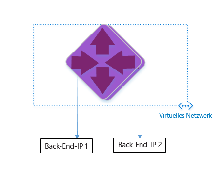
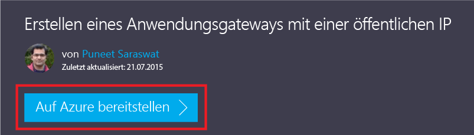
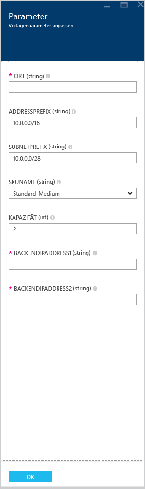

<properties 
   pageTitle="Erstellen eines Application Gateways mit Azure-Ressourcen-Manager-Vorlagen | Microsoft Azure"
   description="Diese Seite enthält Anweisungen zum Erstellen eines Azure Application Gateways mit einer Azure-Ressourcen-Manager-Vorlage."
   documentationCenter="na"
   services="application-gateway"
   authors="joaoma"
   manager="jdial"
   editor="tysonn"/>
<tags 
   ms.service="application-gateway"
   ms.devlang="na"
   ms.topic="hero-article" 
   ms.tgt_pltfrm="na"
   ms.workload="infrastructure-services" 
   ms.date="09/21/2015"
   ms.author="joaoma"/>

# Erstellen eines Application Gateways mit einer ARM-Vorlage

Application Gateway verwendet einen Lastenausgleich der Ebene 7. Application Gateway bietet ein Failover sowie ein schnelles Routing von HTTP-Anforderungen zwischen verschiedenen Servern in der Cloud und der lokalen Umgebung. Application Gateways weisen folgende Anwendungsbereitstellungsfunktionen auf: HTTP-Lastenausgleich, cookiebasierte Sitzungsaffinität und SSL-Auslagerung.

> [AZURE.SELECTOR]
- [Azure Classic Powershell steps](application-gateway-create-gateway.md)
- [Azure Resource Manager Powershell steps](application-gateway-create-gateway-arm.md)
- [Azure Resource Manager template steps](application-gateway-create-gateway-arm-template.md)

 

Sie erfahren, wie Sie eine vorhandene ARM-Vorlage von GitHub herunterladen und ändern sowie die Vorlage aus GitHub, PowerShell und der Azure-Befehlszeilenschnittstelle bereitstellen.

Wenn Sie die ARM-Vorlage ohne Änderungen einfach direkt aus GitHub bereitstellen möchten, lesen Sie im Abschnitt zum Bereitstellen einer Vorlage aus GitHub weiter.

>[AZURE.IMPORTANT]Bevor Sie mit Azure-Ressourcen arbeiten, sollten Sie wissen, dass Azure derzeit über zwei Bereitstellungsmodelle verfügt: die Bereitstellung mit dem Ressourcen-Manager und die klassische Bereitstellung. Stellen Sie sicher, dass Sie die [Bereitstellungsmodelle und -tools](azure-classic-rm.md) verstanden haben, bevor Sie mit Azure-Ressourcen arbeiten. Sie können die Dokumentation für verschiedene Tools anzeigen, indem Sie auf die Registerkarten oben in diesem Artikel klicken. Dieses Dokument behandelt das Erstellen eines Application Gateways mit dem Azure-Ressourcen-Manager. Um die klassische Version zu verwenden, wechseln Sie zu [Erstellen einer klassischen Application Gateway-Bereitstellung mithilfe von PowerShell](application-gateway-create-gateway.md).

## Szenario

In diesem Szenario erstellen Sie Folgendes:

- Ein Application Gateway mit 2 Instanzen.
- Ein VNet mit der Bezeichnung "VirtualNetwork1" mit dem reservierten CIDR-Block 10.0.0.0/16.
- Ein Subnetz mit der Bezeichnung "Appgatewaysubnet", das 10.0.0.0/28 als CIDR-Block verwendet.
- Sie richten zwei zuvor konfigurierte Back-End-IP-Adressen für die Webserver ein, die den Lastenausgleich verarbeiten sollen. In dieser Beispielvorlage werden die Back-End-IP-Adressen 10.0.1.10 und 10.0.1.11 verwendet.

>[AZURE.NOTE]Dies sind die Parameter für diese Vorlage. Sie können Regeln, Listener und SSL ändern, indem Sie die Datei "azuredeploy.json" öffnen, um die Vorlage anzupassen.

## Herunterladen und Verstehen der ARM-Vorlage

Sie können die vorhandene ARM-Vorlage zum Erstellen von einem VNet und zwei Subnetzen über GitHub herunterladen, die gewünschten Änderungen vornehmen und die Vorlage anschließend wiederverwenden. Dazu führen Sie die folgenden Schritte aus.

1. Navigieren Sie zu https://github.com/Azure/azure-quickstart-templates/blob/master/101-create-applicationgateway-publicip.
2. Klicken Sie auf **azuredeploy.json**, und klicken Sie dann auf **RAW**.
3. Speichern Sie die Datei in einem lokalen Ordner auf Ihrem Computer.
4. Wenn Sie mit ARM-Vorlagen vertraut sind, fahren Sie mit Schritt 7 fort.
5. Öffnen Sie die Datei, die Sie gerade gespeichert haben, und sehen Sie sich den Inhalt unter **parameters** in Zeile 5 an. ARM-Vorlagenparameter enthalten Platzhalter für Werte, die während der Bereitstellung ausgefüllt werden können.

	| Parameter | Beschreibung |
	|---|---|
	| **location** | Azure-Region, in der das Application Gateway erstellt wird |
	| **VirtualNetwork1** | Name für das neue VNet |
	| **addressPrefix** | Adressraum für das VNet im CIDR-Format |
	| **ApplicationGatewaysubnet** | Name für das Application Gateway-Subnetz |
	| **subnetPrefix** | CIDR-Block für das Application Gateway-Subnetz |
	| **skuname** | Größe der SKU-Instanz |
	| **Kapazität** | Anzahl von Instanzen |
	| **backendaddress1** | IP-Adresse des ersten Webservers |
	| **backendaddress2** | IP-Adresse des zweiten Webservers|

>[AZURE.IMPORTANT]Die in GitHub verwalteten ARM-Vorlagen können mit der Zeit geändert werden. Überprüfen Sie die Vorlage stets, bevor Sie sie verwenden.
	
6. Überprüfen Sie den Inhalt unter **resources**, und beachten Sie Folgendes:

	- **type**. Typ der Ressource, die von der Vorlage erstellt wird. In diesem Fall **Microsoft.Network/applicationGateways** als Ressourcentyp für ein Application Gateway.
	- **name**. Name der Ressource. Beachten Sie die Verwendung von **[parameters('applicationGatewayName')]**. Dies bedeutet, dass der Name während der Bereitstellung durch einen Benutzer oder eine Parameterdatei eingegeben wird.
	- **properties**. Liste der Eigenschaften für die Ressource. Diese Vorlage verwendet während der Erstellung des Application Gateways das virtuelle Netzwerk und die öffentliche IP-Adresse.

7. Navigieren Sie zurück zu https://github.com/Azure/azure-quickstart-templates/blob/master/101-create-applicationgateway-publicip.
8. Klicken Sie auf **azuredeploy-parameters.json**, und klicken Sie dann auf **RAW**.
9. Speichern Sie die Datei in einem lokalen Ordner auf Ihrem Computer.
10. Öffnen Sie die Datei, die Sie gerade gespeichert haben, und bearbeiten Sie die Parameterwerte. Verwenden Sie die unten stehenden Werte, um das Application Gateway wie in unserem Szenario beschrieben bereitzustellen.

		{
		   "$schema": "http://schema.management.azure.com/schemas/2015-01-01/deploymentParameters.json#",
		   "contentVersion": "1.0.0.0",
		   "parameters": {
		     "location": {
		       "value": "East US"
		     },
		     "addressPrefix": {
		      "value": "10.0.0.0/16"
    		 },
		     "subnetPrefix": {
		      "value": "10.0.0.0/24"
		     },
		     "skuName": {
		       "value": "Standard_Small"
		     },
		     "capacity": {
		       "value": 2
		    },
		    "backendIpAddress1": {
		      "value": "10.0.1.10"
		    },
		     "backendIpAddress2": {
		       "value": "10.0.1.11"
		     }
		  }
		}

11. Speichern Sie die Datei. Sie können die JSON-Vorlage und die Parametervorlage mithilfe von online verfügbaren JSON-Validierungstools wie [JSlint.com](http://www.jslint.com/) testen.
 
## Bereitstellen der ARM-Vorlage mithilfe von PowerShell

1. Wenn Sie Azure PowerShell noch nie verwendet haben, lesen Sie [Installieren und Konfigurieren von Azure PowerShell](powershell-install-configure.md), und befolgen Sie die komplette Anleitung, um sich bei Azure anzumelden und Ihr Abonnement auszuwählen.
2. Führen Sie an einer Azure PowerShell-Eingabeaufforderung das Cmdlet **Switch-AzureMode** aus, um zum Ressourcen-Manager-Modus zu wechseln, wie unten dargestellt.

		Switch-AzureMode AzureResourceManager
	
Erwartete Ausgabe:

		WARNING: The Switch-AzureMode cmdlet is deprecated and will be removed in a future release.

>[AZURE.WARNING]Das Cmdlet "Switch-AzureMode" ist demnächst veraltet. In diesem Fall werden alle Ressourcen-Manager-Cmdlets umbenannt.
	
3. Erstellen Sie bei Bedarf mithilfe des `New-AzureResourceGroup`-Cmdlets eine neue Ressourcengruppe. In unten stehendem Beispiel wird eine neue Ressourcengruppe mit der Bezeichnung "AppgatewayRG" in der Region "East US" erstellt.

		PS C:\> New-AzureResourceGroup -Name AppgatewayRG -Location "East US"
		VERBOSE: 5:38:49 PM - Created resource group 'AppgatewayRG' in location 'eastus'

		ResourceGroupName : AppgatewayRG
		Location          : eastus
		ProvisioningState : Succeeded
		Tags              :
		Permissions       :
	                 Actions  NotActions
	                 =======  ==========
	                  *

		ResourceId        : /subscriptions/################################/resourceGroups/AppgatewayRG

4. Führen Sie das New-AzureResourceGroupDeployment-Cmdlet aus, um das neue VNet mithilfe der oben heruntergeladenen und geänderten Vorlage und Parameterdateien bereitzustellen.

		New-AzureResourceGroupDeployment -Name TestAppgatewayDeployment -ResourceGroupName AppgatewayRG `
 		   -TemplateFile C:\ARM\azuredeploy.json -TemplateParameterFile C:\ARM\azuredeploy-parameters.json

Folgende Ausgabe wird von der Befehlszeile generiert:

		DeploymentName    : testappgatewaydeployment
		ResourceGroupName : appgatewayRG
		ProvisioningState : Succeeded
		Timestamp         : 9/19/2015 1:49:41 AM
		Mode              : Incremental
		TemplateLink      :
		Parameters        :
                   Name             Type                       Value
                   ===============  =========================  ==========
                   location         String                     East US
                   addressPrefix    String                     10.0.0.0/16
                   subnetPrefix     String                     10.0.0.0/24
                   skuName          String                     Standard_Small
                   capacity         Int                        2
                   backendIpAddress1  String                     10.0.1.10
                   backendIpAddress2  String                     10.0.1.11

		Outputs           :

## Bereitstellen der ARM-Vorlage mithilfe der Azure-Befehlszeilenschnittstelle

Führen Sie die folgenden Schritte aus, um die ARM-Vorlage bereitzustellen, die Sie mithilfe der Azure-Befehlszeilenschnittstelle heruntergeladen haben.

1. Wenn Sie die Azure-Befehlszeilenschnittstelle noch nie verwendet haben, ziehen Sie [Installieren und Konfigurieren der Azure-Befehlszeilenschnittstelle](xplat-cli-install.md) zurate, und folgen Sie den Anweisungen bis zu dem Punkt, an dem Sie Ihr Azure-Konto und Ihr Abonnement auswählen.
2. Führen Sie den Befehl **azure config mode** aus, um in den Ressourcen-Manager-Modus zu wechseln, wie unten dargestellt.

		azure config mode arm

Hier ist die erwartete Ausgabe des obigen Befehls:

		info:	New mode is arm

3. Führen Sie bei Bedarf **azure group create** aus, um eine neue Ressourcengruppe zu erstellen, wie unten dargestellt. Beachten Sie die Ausgabe des Befehls. In der nach der Ausgabe angezeigten Liste werden die verwendeten Parameter erläutert. Weitere Informationen zu Ressourcengruppen finden Sie unter [Übersicht über den Azure-Ressourcen-Manager](resource-group-overview.md).

		azure group create -n appgatewayRG -l eastus

**-n (oder --name)**. Name für die neue Ressourcengruppe. In diesem Szenario: *appgatewayRG*.

**-l (oder --location)**. Azure-Region, in der die neue Ressourcengruppe erstellt wird. In diesem Szenario: *Eastus*.

4. Führen Sie das Cmdlet **azure group deployment create** aus, um das neue VNet mithilfe der oben heruntergeladenen und geänderten Vorlage und Parameterdateien bereitzustellen. In der nach der Ausgabe angezeigten Liste werden die verwendeten Parameter erläutert.

		azure group deployment create -g appgatewayRG -n TestAppgatewayDeployment -f C:\ARM\azuredeploy.json -e C:\ARM\azuredeploy-parameters.json

Hier ist die erwartete Ausgabe des obigen Befehls:

		azure group deployment create -g appgatewayRG -n TestAppgatewayDeployment -f C:\ARM\azuredeploy.json -e C:\ARM\azuredeploy-parameters.json
		info:    Executing command group deployment create
		+ Initializing template configurations and parameters
		+ Creating a deployment
		info:    Created template deployment "TestAppgatewayDeployment"
		+ Waiting for deployment to complete
		data:    DeploymentName     : TestAppgatewayDeployment
		data:    ResourceGroupName  : appgatewayRG
		data:    ProvisioningState  : Succeeded
		data:    Timestamp          : 2015-09-21T20:50:27.5129912Z
		data:    Mode               : Incremental
		data:    Name               Type    Value
		data:    -----------------  ------  --------------
		data:    location           String  East US
		data:    addressPrefix      String  10.0.0.0/16
		data:    subnetPrefix       String  10.0.0.0/24	
		data:    skuName            String  Standard_Small
		data:    capacity           Int     2
		data:    backendIpAddress1  String  10.0.1.10
		data:    backendIpAddress2  String  10.0.1.11
		info:    group deployment create command OK

**-g (or --resource-group)**. Name der Ressourcengruppe, in der das neue VNet erstellt wird.

**-f (oder --template-file)**. Pfad zu Ihrer ARM-Vorlagendatei.

**-e (oder --parameters-file)**. Pfad zu Ihrer ARM-Parameterdatei.

## Bereitstellen der ARM-Vorlage per Klick

Die Bereitstellung per Klick ist ein weiterer Vorteil von ARM-Vorlagen. Diese Art der Bereitstellung bietet eine einfache Möglichkeit, Vorlagen im Azure-Portal zu verwenden.

### Schritt 1 
Der Link [Bereitstellen eines Application Gateways per Klick](http://azure.microsoft.com/documentation/templates/101-create-applicationgateway-publicip/) leitet Sie zur Portalseite mit den Vorlagen für Application Gateways.

### Schritt 2 

Klicken Sie auf "Bereitstellen in Azure".

### Schritt 3

Füllen Sie im Portal die Parameter für die Bereitstellungsvorlage aus, und klicken Sie auf "OK".

### Schritt 4

Wählen Sie "Rechtliche Bedingungen" aus, und klicken Sie auf "Kaufen".

### Schritt 5

Klicken Sie auf dem Blatt "Benutzerdefinierte Bereitstellung" auf "Erstellen".

 
## Nächste Schritte

Wenn Sie die SSL-Auslagerung konfigurieren möchten, lesen Sie [Konfigurieren eines Application Gateways für die SSL-Auslagerung](application-gateway-ssl.md).

Wenn Sie ein Application Gateway für ILB konfigurieren möchten, lesen Sie [Erstellen eines Application Gateways mit einem internen Lastenausgleich (ILB)](application-gateway-ilb.md).

Weitere Informationen zu Lastenausgleichsoptionen im Allgemeinen finden Sie unter:

- [Azure-Lastenausgleich](https://azure.microsoft.com/documentation/services/load-balancer/)
- [Azure Traffic Manager](https://azure.microsoft.com/documentation/services/traffic-manager/)

<!---HONumber=Oct15_HO1-->