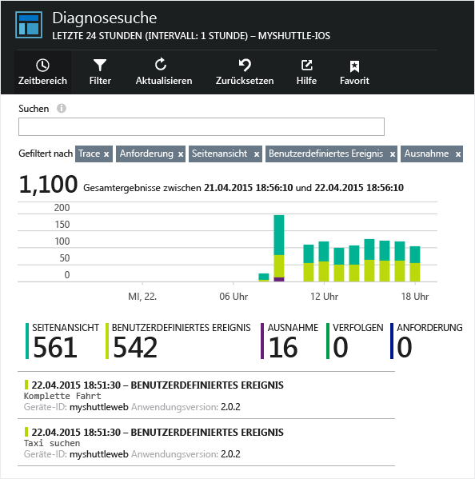
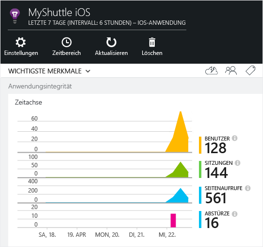
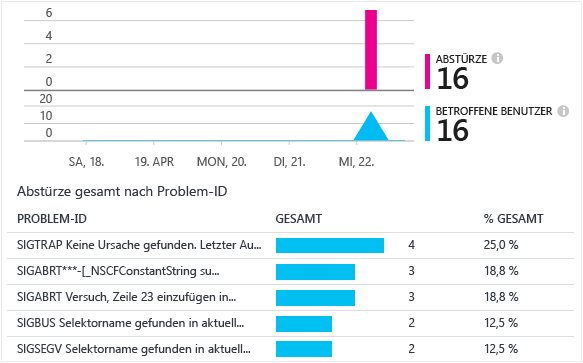

<properties
    pageTitle="Analysen für Android-Apps | Microsoft Azure"
    description="Analysieren Sie die Nutzung und Leistung Ihrer Android-App."
    services="application-insights"
    documentationCenter="android"
    authors="alancameronwills"
    manager="douge"/>

<tags
    ms.service="application-insights"
    ms.workload="mobile"
    ms.tgt_pltfrm="mobile-android"
    ms.devlang="na"
    ms.topic="get-started-article"
	ms.date="11/14/2015"
    ms.author="awills"/>

# Analysen für Android-Apps

Mit Visual Studio Application Insights können Sie Ihre mobile Anwendung auf Nutzung, Ereignisse und Abstürze überwachen.

> [AZURE.NOTE]Wir empfehlen [HockeyApp](http://support.hockeyapp.net/kb/client-integration-android/hockeyapp-for-android-sdk), um Absturzberichte, Analysen, Verteilung und Feedback zu verwalten.

## Anforderungen

Sie benötigen Folgendes:

* Ein Abonnement für [Microsoft Azure](http://azure.com). Sie melden sich mit einem Microsoft-Konto an, das Sie möglicherweise für Windows, XBox Live oder andere Microsoft-Clouddienste verwenden.
* Android Studio
* Android SDK, Version 9 oder höher.

## Erstellen einer Application Insights-Ressource

Erstellen Sie im [Azure-Portal][portal] eine neue Application Insights-Ressource. Wählen Sie die Android-Option.


Auf dem nun geöffneten Blatt werden die Leistungs- und Nutzungsdaten über Ihre App angezeigt. Um bei der nächsten Anmeldung bei Azure dorthin zu gelangen, sollten Sie eine Kachel auf dem Startbildschirm anlegen. Klicken Sie alternativ auf "Durchsuchen", um das Blatt zu finden.

## Einrichtung

Befolgen Sie den [Einrichtungsleitfaden](https://github.com/Microsoft/ApplicationInsights-Android#-3-setup):


## Verwenden des SDK

Initialisieren Sie das SDK, und beginnen Sie mit der Nachverfolgung der Telemetrie.

Fügen Sie der Stammaktivität Ihrer App den folgenden Import hinzu:

```java

     import com.microsoft.applicationinsights.library.ApplicationInsights;
```

Fügen Sie dem `onCreate`-Rückruf der Aktivität Folgendes hinzu:

```java

    ApplicationInsights.setup(this.getApplicationContext(), this.getApplication());
    ApplicationInsights.start();
```

Wenn `ApplicationInsights.start()` aufgerufen wird, beginnt das SDK mit dem Nachverfolgen von Android-Lebenszyklusaktivität und unbehandelten Ausnahmen.

> [AZURE.NOTE]Lebenszyklusereignisse der Anwendung werden nur im Android SDK Version 15 und höher (Ice Cream Sandwich+), erfasst.

Darüber hinaus können benutzerdefinierte Ereignisse, Ablaufverfolgungen, Metriken und behandelte Ausnahmen erfasst werden. Verwenden Sie eine der [Application Insights-APIs][api], um Telemetriedaten zu senden.

* "TrackEvent(eventName)" für andere Benutzeraktionen
* "TrackTrace(logEvent)" für die [Diagnoseprotokollierung][diagnostic]
* "TrackHandledException(exception)" in Catch-Klauseln
* "TrackMetric(name, value)" in einer Hintergrundaufgabe, um reguläre Berichte von Metriken zu senden, die nicht an bestimmte Ereignisse angefügt sind

Der folgende Code ist ein Beispiel für die Initialisierung und manuelle Telemetrieerfassung:

```java

    public class MyActivity extends Activity {

      @Override
      protected void onCreate(Bundle savedInstanceState) {

        ApplicationInsights.setup(this);
        //... other initialization code ...//
        ApplicationInsights.start();

        // track telemetry data
        TelemetryClient client = TelemetryClient.getInstance();
        HashMap<String, String> properties = new HashMap<String, String>();
        properties.put("property1", "my custom property");
        client.trackEvent("sample event", properties);
        client.trackTrace("sample trace");
        client.trackMetric("sample metric", 3);
        client.trackHandledException(new Exception("sample exception"));
      }
    }
```

## <a name="run"></a> Ausführen des Projekts

Führen Sie Ihre Anwendung aus (UMSCHALT+F10 in Windows, STRG+R in OS X), um Telemetriedaten zu generieren.

## Anzeigen Ihrer Daten in Application Insights

Kehren Sie zu http://portal.azure.com zurück, und navigieren Sie zur Application Insights-Ressource.

Klicken Sie auf **Suchen**, um [Diagnosesuche][diagnostic] zu öffnen. Dort werden die ersten Ereignisse angezeigt. Wenn keine Ereignisse angezeigt werden, warten Sie eine oder zwei Minuten, und klicken Sie dann auf **Aktualisieren**.



Während Ihre App verwendet wird, werden die Daten auf dem Blatt "Übersicht" angezeigt.



Klicken Sie auf ein beliebiges Diagramm, um weitere Details zu erhalten. Zum Beispiel zu Abstürzen:




## <a name="usage"></a>Nächste Schritte

[Nachverfolgen der Nutzung Ihrer App][track]

[Diagnosesuche][diagnostic]

[Metrik-Explorer][metrics]

[Problembehandlung][qna]


<!--Link references-->

[api]: app-insights-api-custom-events-metrics.md
[diagnostic]: app-insights-diagnostic-search.md
[metrics]: app-insights-metrics-explorer.md
[portal]: http://portal.azure.com/
[qna]: app-insights-troubleshoot-faq.md
[track]: app-insights-api-custom-events-metrics.md

<!---HONumber=Nov15_HO4-->