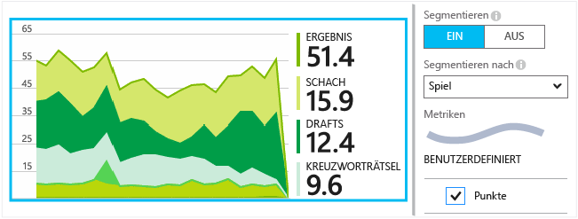

<properties 
	pageTitle="Application Insights-API für benutzerdefinierte Ereignisse und Metriken" 
	description="Fügen Sie einige Codezeilen in Ihrer Geräte- oder Desktop-App, Webseite oder dem Webdienst ein, um Nutzungs- und Diagnoseprobleme nachzuverfolgen." 
	services="application-insights"
    documentationCenter="" 
	authors="alancameronwills" 
	manager="douge"/>
 
<tags 
	ms.service="application-insights" 
	ms.workload="tbd" 
	ms.tgt_pltfrm="ibiza" 
	ms.devlang="multiple" 
	ms.topic="article" 
	ms.date="09/23/2015" 
	ms.author="awills"/>

# Application Insights-API für benutzerdefinierte Ereignisse und Metriken 

*Application Insights befindet sich in der Vorschau.*

Fügen Sie einige Codezeilen in Ihre Anwendung ein, um herauszufinden, wie sie von Benutzern eingesetzt wird, oder um Probleme zu diagnostizieren. Sie können Telemetriedaten von Geräte- und Desktop-Apps, Webclients und Webservern senden.

Application Insights-Datensammler verwenden diese API, um Standardtelemetriedaten wie Seitenaufrufe und Ausnahmeberichte zu senden. Sie können sie jedoch auch verwenden, um eigene benutzerdefinierte Telemetriedaten zu senden.

## API-Zusammenfassung

Die API ist, abgesehen von ein paar kleinen Variationen, auf allen Plattformen einheitlich.

Methode | Verwendung
---|---
[`TrackPageView`](#page-views) | Seiten, Bildschirme, Blätter oder Formulare.
[`TrackEvent`](#track-event) | Benutzeraktionen und andere Ereignisse. Wird zum Verfolgen des Benutzerverhaltens oder zur Leistungsüberwachung eingesetzt.
[`TrackMetric`](#track-metric) | Leistungsmessungen wie Warteschlangenlängen, die nicht im Zusammenhang mit bestimmten Ereignissen stehen.
[`TrackException`](#track-exception)|Protokollieren von Ausnahmen für die Diagnose. Verfolgen Sie, wo diese in Bezug auf andere Ereignisse auftreten, und untersuchen Sie die Stapelüberwachung.
[`TrackRequest`](#track-request)| Protokollieren Sie die Häufigkeit und Dauer der Serveranforderungen für die Leistungsanalyse.
[`TrackTrace`](#track-trace)|Diagnoseprotokollnachrichten. Sie können auch Drittanbieterprotokolle erfassen.
[`TrackDependency`](#track-dependency)|Protokollieren Sie die Dauer und die Häufigkeit der Aufrufe von externen Komponenten, von denen Ihre Anwendung abhängt.

Sie können den meisten dieser Telemetrieaufrufe [Eigenschaften und Metriken anfügen](#properties).


## <a name="prep"></a>Vorbereitung

Falls noch nicht geschehen:

* Fügen Sie Ihrem Projekt das Application Insights-SDK hinzu:
 * [ASP.NET-Projekt][greenbrown]
 * [Windows-Projekt][windows]
 * [Java-Projekt][java] 
 * [JavaScript auf jeder Webseite][client]   

* Schließen Sie Folgendes in den Geräte- oder Webservercode ein:

    *C#:* `using Microsoft.ApplicationInsights;`

    *VB:* `Imports Microsoft.ApplicationInsights`

    *Java:* `import com.microsoft.applicationinsights.TelemetryClient;`

## Erstellen eines TelemetryClient

Erstellen Sie eine Instanz von TelemetryClient (außer in JavaScript auf Webseiten):

*C#:*

    private TelemetryClient telemetry = new TelemetryClient();

*VB:*

    Private Dim telemetry As New TelemetryClient

*Java*

    private TelemetryClient telemetry = new TelemetryClient();

TelemetryClient ist threadsicher.

Wir empfehlen Ihnen, für jedes Modul Ihrer App eine Instanz des `TelemetryClient` zu verwenden. Zum Beispiel können Sie einen `TelemetryClient` in Ihrem Webdienst haben, der eingehende HTTP-Anforderungen meldet, und einen anderen in einer Middleware-Klasse, der Geschäftslogikereignisse meldet. Sie können Eigenschaften festlegen wie `TelemetryClient.Context.User.Id` zum Nachverfolgen von Benutzern und Sitzungen oder `TelemetryClient.Context.Device.Id` zum Identifizieren des Computers. Diese Informationen werden allen Ereignissen angefügt, die von der Instanz gesendet werden.


## Nachverfolgen von Ereignissen

In Application Insights handelt es sich bei einem *benutzerdefinierten Ereignis* um einen Datenpunkt, den Sie als aggregierte Anzahl im [Metrik-Explorer][metrics] und als einzelne Vorkommen in der [Diagnosesuche][diagnostic] anzeigen können. (Er gehört nicht zu MVC oder anderen Ereignissen des Frameworks.)

Fügen Sie TrackEvent-Aufrufe in Ihren Code ein, um zu zählen, wie oft Benutzer ein bestimmtes Feature auswählen, bestimmte Ziele erreichen oder vielleicht bestimmte Arten von Fehlern machen.

Senden Sie z. B. in einer Spiele-App ein Ereignis, sobald ein Benutzer das Spiel gewinnt:

*JavaScript*

    appInsights.trackEvent("WinGame");

*C#*
    
    telemetry.TrackEvent("WinGame");

*VB*


    telemetry.TrackEvent("WinGame")

*Java*

    telemetry.trackEvent("WinGame");

„WinGame“ ist hier der Name, der im Application Insights-Portal angezeigt wird. Klicken Sie auf die Kachel "Benutzerdefinierte Ereignisse" auf dem Blatt "Übersicht":


Das Diagramm ist nach Ereignisnamen gruppiert, um die relativen Beiträge der wichtigsten Ereignisse anzuzeigen. Markieren Sie zum Steuern dieser Einstellung das Diagramm, und verwenden Sie das Steuerelement für die Gruppierung.


Wählen Sie in der Liste unterhalb des Diagramms einen Ereignisnamen aus. Klicken Sie, um weitere einzelne Vorkommen eines Ereignisses anzuzeigen.


Klicken Sie auf ein beliebiges Vorkommen, um weitere Details anzuzeigen.

## <a name="properties"></a>Filtern, Suchen und Segmentieren der Daten mit Eigenschaften

Sie können Ihren Ereignissen (und auch Metriken, Seitenaufrufen, Ausnahmen und anderen Telemetriedaten) Eigenschaften und Messungen anfügen.

**Eigenschaften** sind die Zeichenfolgenwerte, die Sie zum Filtern der Telemetriedaten in den Nutzungsberichten verwenden können. Wenn zum Beispiel die Anwendung mehrere Spiele bereitstellt, sollten Sie den Namen des Spiels an jedes Ereignis anfügen, damit Sie sehen können, welche Spiele immer populärer werden.

Es gibt eine Beschränkung von ca. 1 KB für die Länge der Zeichenfolge. (Wenn Sie große Datenblöcke senden möchten, verwenden Sie den message-Parameter von [TrackTrace](#track-trace).)

**Metriken** sind numerische Werte, die grafisch dargestellt werden können. Beispiel: Sie möchten überprüfen, ob die von den Spielern erreichten Punktzahlen stetig zunehmen. Die Diagramme können anhand der mit dem Ereignis gesendeten Eigenschaften unterteilt werden, sodass Sie für verschiedene Spiele separate oder gestapelte Diagramme erhalten.

Metrikwerte müssen >=0 sein, um richtig angezeigt zu werden.


Es gibt einige [Beschränkungen hinsichtlich der Anzahl von Eigenschaften, Eigenschaftswerten und Metriken](#limits), die Sie verwenden können.


*JavaScript*

    appInsights.trackEvent
      ("WinGame",
         // String properties:
         {Game: currentGame.name, Difficulty: currentGame.difficulty},
         // Numeric metrics:
         {Score: currentGame.score, Opponents: currentGame.opponentCount}
         );

    appInsights.trackPageView
        ("page name", "http://fabrikam.com/pageurl.html",
          // String properties:
         {Game: currentGame.name, Difficulty: currentGame.difficulty},
         // Numeric metrics:
         {Score: currentGame.score, Opponents: currentGame.opponentCount}
         );
          

*C#*

    // Set up some properties and metrics:
    var properties = new Dictionary <string, string> 
       {{"game", currentGame.Name}, {"difficulty", currentGame.Difficulty}};
    var metrics = new Dictionary <string, double>
       {{"Score", currentGame.Score}, {"Opponents", currentGame.OpponentCount}};

    // Send the event:
    telemetry.TrackEvent("WinGame", properties, metrics);


*VB*

    ' Set up some properties:
    Dim properties = New Dictionary (Of String, String)
    properties.Add("game", currentGame.Name)
    properties.Add("difficulty", currentGame.Difficulty)

    Dim metrics = New Dictionary (Of String, Double)
    metrics.Add("Score", currentGame.Score)
    metrics.Add("Opponents", currentGame.OpponentCount)

    ' Send the event:
    telemetry.TrackEvent("WinGame", properties, metrics)


*Java*
    
    Map<String, String> properties = new HashMap<String, String>();
    properties.put("game", currentGame.getName());
    properties.put("difficulty", currentGame.getDifficulty());
    
    Map<String, Double> metrics = new HashMap<String, Double>();
    metrics.put("Score", currentGame.getScore());
    metrics.put("Opponents", currentGame.getOpponentCount());
    
    telemetry.trackEvent("WinGame", properties, metrics);


> [AZURE.NOTE]Achten Sie darauf, keine persönlich identifizierbaren Informationen in den Eigenschaften zu protokollieren.

**Wenn Sie Metriken verwenden**, öffnen Sie den Metrik-Explorer, und wählen Sie die Metrik aus der benutzerdefinierten Gruppe aus:


*Wenn die Metrik nicht angezeigt wird oder die benutzerdefinierte Überschrift nicht vorhanden ist, schließen Sie das Blatt „Auswahl“, und versuchen Sie es später erneut. Manchmal dauert das Aggregieren der Metriken über die Pipeline eine Stunde.*

**Wenn Sie Eigenschaften und Metriken verwendet haben**, unterteilen Sie die Metrik nach der Eigenschaft:





**In der Diagnosesuche** können Sie die Eigenschaften und Metriken einzelner Vorkommen eines Ereignisses anzeigen.


Verwenden Sie das Suchfeld, um Ereignisvorkommen mit einem bestimmten Eigenschaftswert anzuzeigen.


[Erfahren Sie mehr über Suchausdrücke][diagnostic].

#### Alternative Methode zum Festlegen von Eigenschaften und Metriken

Wenn es für Sie praktischer ist, können Sie die Parameter eines Ereignisses in einem separaten Objekt sammeln:

    var event = new EventTelemetry();

    event.Name = "WinGame";
    event.Metrics["processingTime"] = stopwatch.Elapsed.TotalMilliseconds;
    event.Properties["game"] = currentGame.Name;
    event.Properties["difficulty"] = currentGame.Difficulty;
    event.Metrics["Score"] = currentGame.Score;
    event.Metrics["Opponents"] = currentGame.Opponents.Length;

    telemetry.TrackEvent(event);


#### <a name="timed"></a> Zeitmessung bei Ereignissen

Manchmal möchten Sie im Diagramm darstellen, wie lange es dauert, eine Aktion auszuführen. Beispielsweise möchten Sie wissen, wie lange Benutzer brauchen, um die Auswahl in einem Spiel zu erwägen. Dies ist ein nützliches Beispiel für die Verwendungszwecke des Messparameters.


*C#*

    var stopwatch = System.Diagnostics.Stopwatch.StartNew();

    // ... perform the timed action ...

    stopwatch.Stop();

    var metrics = new Dictionary <string, double>
       {{"processingTime", stopwatch.Elapsed.TotalMilliseconds}};

    // Set up some properties:
    var properties = new Dictionary <string, string> 
       {{"signalSource", currentSignalSource.Name}};

    // Send the event:
    telemetry.TrackEvent("SignalProcessed", properties, metrics);


## TrackMetric

Verwenden Sie TrackMetric zum Senden von Metriken, die keinen bestimmten Ereignissen zugeordnet sind. Beispielsweise könnten Sie die Länge einer Warteschlange in regelmäßigen Abständen überwachen.

Metriken werden als statistische Diagramme im Metrik-Explorer angezeigt. Im Gegensatz zu Ereignissen können Sie jedoch nicht nach einzelnen Vorkommen in der Diagnosesuche suchen.

Metrikwerte müssen >=0 sein, um richtig angezeigt zu werden.


*JavaScript*

    appInsights.trackMetric("Queue", queue.Length);

*C#*

    telemetry.TrackMetric("Queue", queue.Length);

*VB*

    telemetry.TrackMetric("Queue", queue.Length)

*Java*

    telemetry.trackMetric("Queue", queue.Length);

Tatsächlich können Sie dies in einem Hintergrundthread ausführen:

*C#*

    private void Run() {
     var appInsights = new TelemetryClient();
     while (true) {
      Thread.Sleep(60000);
      appInsights.TrackMetric("Queue", queue.Length);
     }
    }


Um die Ergebnisse anzuzeigen, öffnen Sie den Metrik-Explorer, und fügen Sie ein neues Diagramm hinzu. Legen Sie es für die Anzeige Ihrer Metrik fest.


Es gibt einige [Beschränkungen hinsichtlich der Anzahl von Metriken](#limits), die verwendet werden können.

## Seitenaufrufe

In einer Geräte- oder Webseiten-App werden die Telemetriedaten zu den Seitenaufrufen standardmäßig gesendet, wenn die einzelnen Bildschirme oder Seiten geladen werden. Sie können dies jedoch so ändern, dass Seitenaufrufe zu zusätzlichen oder anderen verfolgt werden. Angenommen, Sie möchten in einer App mit Registerkarten oder Blättern eine "Seite" nachverfolgen, sobald der Benutzer ein neues Blatt öffnet.


Benutzer- und Sitzungsdaten werden als Eigenschaften zusammen mit Seitenaufrufen gesendet, damit die Benutzer- und Sitzungsdiagramme aktiv werden, sobald Telemetriedaten zu den Seitenaufrufen vorliegen.

#### Benutzerdefinierte Seitenaufrufe

*JavaScript*

    appInsights.trackPageView("tab1");

*C#*

    telemetry.TrackPageView("GameReviewPage");

*VB*

    telemetry.TrackPageView("GameReviewPage")


Wenn Sie mehrere Registerkarten in anderen HTML-Seiten haben, können Sie ebenfalls die URL angeben:

    appInsights.trackPageView("tab1", "http://fabrikam.com/page1.htm");


## TrackRequest

Wird vom Server-SDK zum Protokollieren von HTTP-Anforderungen verwendet.

Sie können diese Methode auch selbst aufrufen, wenn Sie Anforderungen in einem Kontext simulieren möchten, in dem das Webdienstmodul nicht ausgeführt wird.

*C#*

    // At start of processing this request:

    // Operation Id and Name are attached to all telemetry and help you identify
    // telemetry associated with one request:
    telemetry.Context.Operation.Id = Guid.NewGuid().ToString();
    telemetry.Context.Operation.Name = requestName;
    
    var stopwatch = System.Diagnostics.Stopwatch.StartNew();

    // ... process the request ...

    stopwatch.Stop();
    telemetryClient.TrackRequest(requestName, DateTime.Now,
       stopwatch.Elapsed, 
       "200", true);  // Response code, success


## TrackException

Senden Sie Ausnahmen an Application Insights, um sie als Hinweis auf die Häufigkeit eines Problems [zu zählen][metrics] und um [einzelne Vorkommen zu untersuchen][diagnostic]. Die Berichte enthalten die Stapelüberwachung.

*C#*

    try
    {
        ...
    }
    catch (Exception ex)
    {
       telemetry.TrackException(ex);
    }

*JavaScript*

    try
    {
       ...
    }
    catch (ex)
    {
       appInsights.trackException(ex);
    }

Die SDKs viele Ausnahmen automatisch abfangen, müssen Sie TrackException nicht immer explizit aufrufen.

* ASP.NET: [Schreiben Sie Code zum Abfangen von Ausnahmen](app-insights-asp-net-exceptions.md)
* J2EE: [Ausnahmen werden automatisch abgefangen](app-insights-java-get-started.md#exceptions-and-request-failures)
* Windows-Apps: [Abstürze werden automatisch abgefangen](app-insights-windows-crashes.md)
* JavaScript: Wird automatisch abgefangen. Wenn Sie die automatische Erfassung deaktivieren möchten, fügen Sie eine Zeile dem Codeausschnitt hinzu, den Sie in Ihren Webseiten einfügen:

    ```
    ({
      instrumentationKey: "your key"
      , disableExceptionTracking: true
    })
    ```


## TrackTrace 

Verwenden Sie diese Methode zur Diagnose von Problemen, indem Sie eine "Brotkrümelnavigation" an Application Insights senden. Sie können Blöcke von Diagnosedaten senden und sie in der [Diagnosesuche][diagnostic] überprüfen.

 

[Protokolladapter][trace] verwenden diese API zum Senden von Drittanbieterprotokollen an das Portal.


*C#*

    telemetry.TrackTrace(message, SeverityLevel.Warning, properties);

Die Größenbeschränkung für `message` liegt wesentlich höher als der Grenzwert für Eigenschaften. Sie können nach Nachrichteninhalt suchen, aber (anders als bei Eigenschaftswerten) nicht danach filtern.

## TrackDependency

Verwenden Sie diesen Aufruf zum Verfolgen der Antwortzeiten und der Erfolgsraten der Aufrufe an eine externe Codepassage. Die Ergebnisse werden in den Abhängigkeitsdiagrammen im Portal angezeigt.

```C#

            var success = false;
            var startTime = DateTime.UtcNow;
            var timer = System.Diagnostics.Stopwatch.StartNew();
            try
            {
                success = dependency.Call();
            }
            finally
            {
                timer.Stop();
                telemetry.TrackDependency("myDependency", "myCall", startTime, timer.Elapsed, success);
            }
```

Beachten Sie, dass die Server-SDKs ein [Abhängigkeitsmodul](app-insights-dependencies.md) enthalten, das bestimmte Abhängigkeitsaufrufe automatisch ermittelt und überwacht, z. B. von Datenbanken und REST-APIs. Sie müssen einen Agent auf dem Server installieren, damit das Modul funktioniert. Sie können diesen Aufruf verwenden, um Aufrufe zu verfolgen, die durch die automatisierte Nachverfolgung nicht angezeigt werden oder wenn Sie den Agent nicht installieren möchten.

Um das Standardmodul zum Nachverfolgen von Abhängigkeiten zu deaktivieren, bearbeiten Sie [ApplicationInsights.config](app-insights-configuration-with-applicationinsights-config.md), und löschen Sie den Verweis auf `DependencyCollector.DependencyTrackingTelemetryModule`.


## Authentifizierte Benutzer

In einer Web-App werden Benutzer standardmäßig durch Cookies identifiziert. Benutzer werden möglicherweise mehr als einmal gezählt, wenn sie über verschiedene Computer oder Browser auf Ihre App zugreifen oder Cookies löschen.

Wenn sich Benutzer bei Ihrer App anmelden, erhalten Sie einen genaueren Zählwert durch Festlegen der ID des authentifizierten Benutzers im Browsercode:

*JavaScript*

```JS
    // Called when my app has identified the user.
    function Authenticated(signInId) {
      var validatedId = signInId.replace(/[,;=| ]+/g, "_");
      appInsights.setAuthenticatedUserContext(validatedId);
      ...
    }
```

In einer ASP.NET-MVC-Webanwendung, beispielsweise:

*Razor*

        @if (Request.IsAuthenticated)
        {
            <script>
                appInsights.setAuthenticatedUserContext("@User.Identity.Name".replace(/[,;=| ]+/g, "_"));
            </script>
        }

Es ist nicht notwendig, den tatsächlichen Anmeldenamen des Benutzers zu verwenden. Es muss sich lediglich um eine ID handeln, die für diesen Benutzer eindeutig ist. Sie darf keine Leerzeichen und keines der folgenden Zeichen enthalten: `,;=|`.

Die Benutzer-ID wird zudem in einem Sitzungscookie festgelegt und an den Server gesendet. Wenn das Server-SDK installiert ist, wird die ID des authentifizierten Benutzers als Teil der Kontexteigenschaften der Client- und Servertelemetrie gesendet, sodass Sie sie filtern und durchsuchen können.

Wenn bei Ihrer App Benutzer in Konten gruppiert werden, können Sie auch einen Bezeichner für das Konto (mit den gleichen Zeicheneinschränkungen) übergeben.


      appInsights.setAuthenticatedUserContext(validatedId, accountId);

Im [Metrik-Explorer](app-insights-metrics-explorer.md) können Sie ein Diagramm erstellen, dass **authentifizierte Benutzer** und **Benutzerkonten** zählt.

Sie können auch nach Clientdatenpunkten mit bestimmten Benutzernamen und Konten [suchen][diagnostic].


## <a name="defaults"></a>Festlegen von Standardeinstellungen für ausgewählte benutzerdefinierte Telemetriedaten

Wenn Sie nur die Standardeigenschaftswerte für einige von Ihnen benutzerdefinierte Ereignisse festlegen möchten, können Sie diese in einem TelemetryClient einstellen. Sie werden jedem Telemetrieelement zugeordnet, das von diesem Client gesendet wird..

*C#*

    using Microsoft.ApplicationInsights.DataContracts;

    var gameTelemetry = new TelemetryClient();
    gameTelemetry.Context.Properties["Game"] = currentGame.Name;
    // Now all telemetry will automatically be sent with the context property:
    gameTelemetry.TrackEvent("WinGame");
    
*VB*

    Dim gameTelemetry = New TelemetryClient()
    gameTelemetry.Context.Properties("Game") = currentGame.Name
    ' Now all telemetry will automatically be sent with the context property:
    gameTelemetry.TrackEvent("WinGame")

*Java*

    import com.microsoft.applicationinsights.TelemetryClient;
    import com.microsoft.applicationinsights.TelemetryContext;
    ...


    TelemetryClient gameTelemetry = new TelemetryClient();
    TelemetryContext context = gameTelemetry.getContext();
    context.getProperties().put("Game", currentGame.Name);
    
    gameTelemetry.TrackEvent("WinGame");


    
Einzelne Telemetrieaufrufe können die Standardwerte in ihren Eigenschaftenwörterbüchern überschreiben.

**Für JavaScript-Webclients** verwenden Sie [JavaScript-Telemetrieinitialisierer](#js-initializer).


## <a name="ikey"></a> Festlegen des Instrumentationsschlüssels für ausgewählte benutzerdefinierte Telemetriedaten

*C#*
    
    var telemetry = new TelemetryClient();
    telemetry.Context.InstrumentationKey = "---my key---";
    // ...


## Telemetrieinitialisierer

Mithilfe von Telemetrieinitialisierern definieren Sie globale Eigenschaften, die mit allen Telemetriedaten gesendet werden, und setzen das ausgewählte Verhalten der Standardtelemetriemodule außer Kraft.

Das Application Insights for Web-Paket erfasst beispielsweise Telemetriedaten über HTTP-Anforderungen. Standardmäßig kennzeichnet es jede Anforderung mit einem Antwortcode >= 400 als fehlerhaft. Wenn 400 jedoch als erfolgreich behandelt werden soll, können Sie einen Telemetrieinitialisierer angeben, der die Success-Eigenschaft festlegt.

Wenn Sie einen Telemetrieinitialisierer angeben, wird dieser immer aufgerufen, wenn eine der Track*()-Methoden aufgerufen wird. Dies umfasst auch Methoden, die von den Standardtelemetriemodulen aufgerufen werden. Nach Abmachung legen diese Module keine Eigenschaft fest, die bereits durch einen Initialisierer festgelegt wurde.

**Definieren des Initialisierers**

*C#*

```C#

    using System;
    using Microsoft.ApplicationInsights.Channel;
    using Microsoft.ApplicationInsights.DataContracts;
    using Microsoft.ApplicationInsights.Extensibility;

    namespace MvcWebRole.Telemetry
    {
      /*
       * Custom TelemetryInitializer that overrides the default SDK 
       * behavior of treating response codes >= 400 as failed requests
       * 
       */
      public class MyTelemetryInitializer : ITelemetryInitializer
      {
        public void Initialize(ITelemetry telemetry)
        {
            var requestTelemetry = telemetry as RequestTelemetry;
            // Is this a TrackRequest() ?
            if (requestTelemetry == null) return;
            int code;
            bool parsed = Int32.TryParse(requestTelemetry.ResponseCode, out code);
            if (!parsed) return;
            if (code >= 400 && code < 500)
            {
                // If we set the Success property, the SDK won't change it:
                requestTelemetry.Success = true;
                // Allow us to filter these requests in the portal:
                requestTelemetry.Context.Properties["Overridden400s"] = "true";
            }
            // else leave the SDK to set the Success property      
        }
      }
    }
```

**Laden des Initialisierers**

In "ApplicationInsights.config":

    <ApplicationInsights>
      <TelemetryInitializers>
        <!-- Fully qualified type name, assembly name: -->
        <Add Type="MvcWebRole.Telemetry.MyTelemetryInitializer, MvcWebRole"/> 
        ...
      </TelemetryInitializers>
    </ApplicationInsights>

*Alternativ* können Sie den Initialisierer im Code instanziieren, z. B. in "Global.aspx.cs":


```C#
    protected void Application_Start()
    {
        // ...
        TelemetryConfiguration.Active.TelemetryInitializers
        .Add(new MyTelemetryInitializer());
    }
```


[Weitere Informationen zu diesem Beispiel anzeigen.](https://github.com/Microsoft/ApplicationInsights-Home/tree/master/Samples/AzureEmailService/MvcWebRole)

<a name="js-initializer"></a>
### JavaScript-Telemetrieinitialisierer

*JavaScript*

Fügen Sie einen Telemetrieinitialisierer unmittelbar nach dem Initialisierungscode ein, den Sie vom Portal abgerufen haben:

```JS

    <script type="text/javascript">
        // ... initialization code
        ...({
            instrumentationKey: "your instrumentation key"
        });
        window.appInsights = appInsights;


        // Adding telemetry initializer.
        // This is called whenever a new telemetry item
        // is created.

        appInsights.queue.push(function () {
            appInsights.context.addTelemetryInitializer(function (envelope) {
                var telemetryItem = envelope.data.baseData;

                // To check the telemetry item’s type - for example PageView:
                if (envelope.name == Microsoft.ApplicationInsights.Telemetry.PageView.envelopeType) {
                    // this statement removes url from all page view documents
                    telemetryItem.url = "URL CENSORED";
                }

                // To set custom properties:
                telemetryItem.properties = telemetryItem.properties || {};
                telemetryItem.properties["globalProperty"] = "boo";

                // To set custom metrics:
                telemetryItem.measurements = telemetryItem.measurements || {};
                telemetryItem.measurements["globalMetric"] = 100;
            });
        });

        // End of inserted code.

        appInsights.trackPageView();
    </script>
```

Eine Übersicht der für "telemetryItem" verfügbaren nicht benutzerdefinierten Eigenschaften finden Sie im [Datenmodell](app-insights-export-data-model.md/#lttelemetrytypegt).

Sie können beliebig viele Initialisierer hinzufügen.

## <a name="dynamic-ikey"></a>Dynamischer Instrumentationsschlüssel

Um das Vermischen von Telemetriedaten aus Entwicklungs-, Test- und Produktionsumgebungen zu vermeiden, können Sie [separate Application Insights-Ressourcen erstellen][create] und ihre Schlüssel abhängig von der Umgebung ändern.

Statt den Instrumentationsschlüssel aus der Konfigurationsdatei abzurufen, können Sie ihn im Code festlegen. Legen Sie den Schlüssel in einer Initialisierungsmethode fest, wie z. B. "global.aspx.cs" in einem ASP.NET-Dienst:

*C#*

    protected void Application_Start()
    {
      Microsoft.ApplicationInsights.Extensibility.
        TelemetryConfiguration.Active.InstrumentationKey = 
          // - for example -
          WebConfigurationManager.Settings["ikey"];
      ...

*JavaScript*

    appInsights.config.instrumentationKey = myKey; 


Auf Webseiten empfiehlt es sich, ihn über den Zustand des Webservers festzulegen, anstatt ihn im Skript zu codieren. Hier zum Beispiel auf einer Webseite, die von einer ASP.NET-App generiert wird:

*JavaScript in Razor*

    <script type="text/javascript">
    // Standard Application Insights web page script:
    var appInsights = window.appInsights || function(config){ ...
    // Modify this part:
    }({instrumentationKey:  
      // Generate from server property:
      @Microsoft.ApplicationInsights.Extensibility.
         TelemetryConfiguration.Active.InstrumentationKey"
    }) // ...


## Leeren von Daten

Normalerweise sendet das SDK Daten zu ausgewählten Zeiten, um den Benutzer möglichst wenig zu beeinträchtigen. In einigen Fällen empfiehlt es sich jedoch, den Puffer zu leeren – wenn Sie das SDK beispielsweise in einer Anwendung verwenden, die heruntergefahren wird.

*C#*

    telemetry.Flush();

    // Allow some time for flushing before shutdown.
    System.Threading.Thread.Sleep(1000);

Beachten Sie, dass die Funktion für speicherinterne Kanäle asynchron ist, allerdings synchron, wenn Sie den [persistenten Kanal](app-insights-windows-desktop.md#persistence-channel) wählen.


## Deaktivieren der Standardtelemetrie

Sie können [ausgewählte Teile der Standardtelemetrie deaktivieren][config], indem Sie `ApplicationInsights.config` bearbeiten. Diese Vorgehensweise bietet sich z. B. an, wenn Sie Ihre eigenen TrackRequest-Daten senden möchten.

[Weitere Informationen][config].


## <a name="debug"></a>Entwicklermodus

Während des Debuggens ist es sinnvoll, die Telemetriedaten beschleunigt über die Pipeline zu senden, damit die Ergebnisse sofort angezeigt werden. Sie erhalten außerdem zusätzliche Meldungen, mit denen Sie alle Probleme mit der Telemetrie verfolgen können. Schalten Sie ihn in der Produktion aus, da er Ihre App beeinträchtigen kann.


*C#*
    
    TelemetryConfiguration.Active.TelemetryChannel.DeveloperMode = true;

*VB*

    TelemetryConfiguration.Active.TelemetryChannel.DeveloperMode = True

## TelemetryContext

TelemetryClient besitzt eine Eigenschaft "Context", die eine Reihe von Werten enthält, die zusammen mit allen Telemetriedaten gesendet werden. Sie werden normalerweise von den Standardtelemetriemodulen festgelegt, aber Sie können sie auch selbst einstellen. Beispiel:

    telemetryClient.Context.Operation.Name = “MyOperationName”;

Wenn Sie diese Werte selbst festlegen, empfiehlt es sich, die entsprechende Zeile aus [ApplicationInsights.config][config] zu entfernen, damit kein Konflikt zwischen Ihren Werten und den Standardwerten entsteht.

* **Component** Identifiziert die App und deren Version.
* **Device** Daten zu dem Gerät, auf dem die App ausgeführt wird (in Web-Apps der Server oder das Clientgerät, von dem die Telemetrie gesendet wird).
* **InstrumentationKey** Identifiziert die Application Insights-Ressource in Azure, in der die Telemetrie angezeigt wird. In der Regel wird diese aus der Datei "ApplicationInsights.config" übernommen.
* **Location** Identifiziert den geografischen Standort des Geräts.
* **Operation** In Web-Apps die aktuelle HTTP-Anforderung. In anderen App-Typen können Sie dies zur Gruppierung von Ereignissen festlegen.
 * **Id**: Ein generierter Wert, der verschiedene Ereignisse korreliert, sodass Sie beim Untersuchen eines Ereignisses in der Diagnosesuche "Verwandte Elemente" finden können.
 * **Name**: Ein Bezeichner, in der Regel die URL der HTTP-Anforderung. 
 * **SyntheticSource**: Wenn sie nicht null oder leer ist, gibt diese Zeichenfolge an, dass die Quelle der Anforderung als Roboter oder Webtest identifiziert wurde. Standardmäßig wird sie von Berechnungen im Metrik-Explorer ausgeschlossen.
* **Properties** Eigenschaften, die mit allen Telemetriedaten gesendet werden. Kann in einzelnen Track*-Aufrufen außer Kraft gesetzt werden.
* **Session** Identifiziert die Sitzung des Benutzers. Die ID wird auf einen generierten Wert festgelegt, der geändert wird, wenn der Benutzer für eine Weile nicht aktiv ist.
* **User** Benutzerinformationen. 


## <a name="default-properties"></a>Kontextinitialisierer – Festlegen von Standardeigenschaften für alle Telemetriedaten

Sie können einen universellen Initialisierer einrichten, damit alle neuen "TelemetryClient"-Elemente automatisch Ihren Kontext verwenden. Dies schließt die standardmäßigen Telemetriedaten ein, die von plattformspezifischen Telemetriemodulen gesendet werden, wie z. B. die Nachverfolgung von Webserveranforderungen.

Eine typische Verwendung besteht in der Identifikation von Telemetriedaten aus verschiedenen Versionen oder Komponenten Ihrer App. Im Portal können Sie Ergebnisse nach der Eigenschaft "Application Version" filtern oder gruppieren.

Im Allgemeinen [empfehlen wir die Verwendung von Telemetrieinitialisierern anstelle von Kontextinitialisierern](http://apmtips.com/blog/2015/06/09/do-not-use-context-initializers/).

#### Definieren eines Kontextinitialisierers


*C#*

```C#

    using System;
    using Microsoft.ApplicationInsights.Channel;
    using Microsoft.ApplicationInsights.DataContracts;
    using Microsoft.ApplicationInsights.Extensibility;

    namespace MyNamespace
    {
      // Context initializer class
      public class MyContextInitializer : IContextInitializer
      {
        public void Initialize (TelemetryContext context)
        {
            if (context == null) return;

            context.Component.Version = "v2.1";
        }
      }
    }
```

*Java*

```Java

    import com.microsoft.applicationinsights.extensibility.ContextInitializer;
    import com.microsoft.applicationinsights.telemetry.TelemetryContext;

    public class MyContextInitializer implements ContextInitializer {
      @Override
      public void initialize(TelemetryContext context) {
        context.Component.Version = "2.1";
      }
    }
```

#### Laden eines Kontextinitialisierers

In "ApplicationInsights.config":

    <ApplicationInsights>
      <ContextInitializers>
        <!-- Fully qualified type name, assembly name: -->
        <Add Type="MyNamespace.MyContextInitializer, MyAssemblyName"/> 
        ...
      </ContextInitializers>
    </ApplicationInsights>

*Alternativ* können Sie den Initialisierer im Code instanziieren:

*C#*

```C#

    protected void Application_Start()
    {
        // ...
        TelemetryConfiguration.Active.ContextInitializers
        .Add(new MyContextInitializer());
    }
```

*Java*

```Java

    // load the context initializer
    TelemetryConfiguration.getActive().getContextInitializers().add(new MyContextInitializer());
```


## Grenzen

Es gibt einige Beschränkungen hinsichtlich der Anzahl von Metriken und Ereignissen pro Anwendung.

1. Bis zu 500 Telemetriedatenpunkte pro Sekunde pro Instrumentationsschlüssel (d. h. pro Anwendung). Dazu gehören sowohl die vom SDK-Modul gesendete Standardtelemetrie als auch benutzerdefinierte Ereignisse, Metriken und andere Telemetriedaten, die vom Code gesendet werden.
1.	Bis zu 200 eindeutige Metriknamen und 200 eindeutige Eigenschaftennamen für Ihre Anwendung. Zu den Metriken gehören Daten, die über TrackMetric gesendet werden, sowie Messungen für andere Datentypen wie z. B. Ereignisse. Metriken und Eigenschaftennamen gelten global pro Instrumentationsschlüssel und werden nicht auf den Datentyp begrenzt.
2.	Eigenschaften können nur zur Filterung und zur Gruppierung verwendet werden, solange sie weniger als 100 eindeutige Werte für jede Eigenschaft aufweisen. Sobald die eindeutigen Werte 100 überschreiten, kann die Eigenschaft zwar noch zur Suche und Filterung, jedoch nicht mehr für Filter verwendet werden.
3.	Standardeigenschaften wie z. B. RequestName und die Seiten-URL, sind auf 1000 eindeutige Werte pro Woche beschränkt. Nach 1000 eindeutigen Werten werden zusätzliche Werte als "Andere Werte" gekennzeichnet. Der ursprüngliche Wert kann nach wie vor für die Volltextsuche und die Filterung verwendet werden.

* *F: Wie lange werden Daten aufbewahrt?*

    Informationen hierzu finden Sie unter [Datenaufbewahrung und Datenschutz][data].


## Referenz

* [ASP.NET-Referenz](https://msdn.microsoft.com/library/dn817570.aspx)
* [Java-Referenz](http://dl.windowsazure.com/applicationinsights/javadoc/)
* [JavaScript-Referenz](https://github.com/Microsoft/ApplicationInsights-JS/blob/master/API-reference.md)
* [Android-SDK](https://github.com/Microsoft/ApplicationInsights-Android)
* [iOS SDK](https://github.com/Microsoft/ApplicationInsights-iOS)


## SDK-Code

* [ASP.NET Core SDK](https://github.com/Microsoft/ApplicationInsights-dotnet)
* [ASP.NET 5](https://github.com/Microsoft/ApplicationInsights-aspnet5)
* [Android-SDK](https://github.com/Microsoft/ApplicationInsights-Android)
* [Java SDK](https://github.com/Microsoft/ApplicationInsights-Java)
* [JavaScript SDK](https://github.com/Microsoft/ApplicationInsights-JS)
* [iOS SDK](https://github.com/Microsoft/ApplicationInsights-iOS)
* [Alle Plattformen](https://github.com/Microsoft?utf8=%E2%9C%93&query=applicationInsights)

## Fragen

* *Welche Ausnahmen werden möglicherweise von Aufrufen vom Typ „Track\_()“ ausgelöst?*
    
    Keine. Sie müssen sie nicht mit try/catch-Klauseln umschließen. Wenn beim SDK Probleme auftreten, werden Meldungen protokolliert, die in der Debugkonsolenausgabe und – sofern die Meldungen ankommen – in der Diagnosesuche angezeigt werden.


* *Gibt es eine REST-API?*

    Ja, aber sie wird noch nicht veröffentlicht.

## <a name="next"></a>Nächste Schritte


[Durchsuchen von Ereignissen und Protokollen][diagnostic]

[Beispiele und exemplarische Vorgehensweisen](app-insights-code-samples.md)

[Problembehandlung][qna]


<!--Link references-->

[client]: app-insights-javascript.md
[config]: app-insights-configuration-with-applicationinsights-config.md
[create]: app-insights-create-new-resource.md
[data]: app-insights-data-retention-privacy.md
[diagnostic]: app-insights-diagnostic-search.md
[exceptions]: app-insights-asp-net-exceptions.md
[greenbrown]: app-insights-start-monitoring-app-health-usage.md
[java]: app-insights-java-get-started.md
[metrics]: app-insights-metrics-explorer.md
[qna]: app-insights-troubleshoot-faq.md
[trace]: app-insights-search-diagnostic-logs.md
[windows]: app-insights-windows-get-started.md

 

<!---HONumber=Oct15_HO1-->