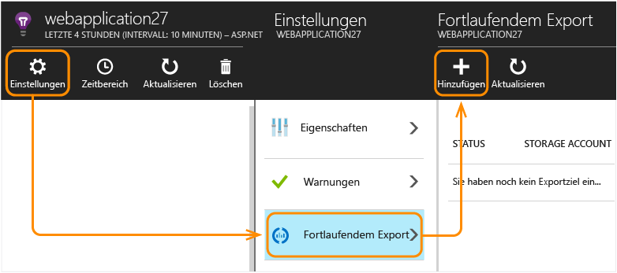
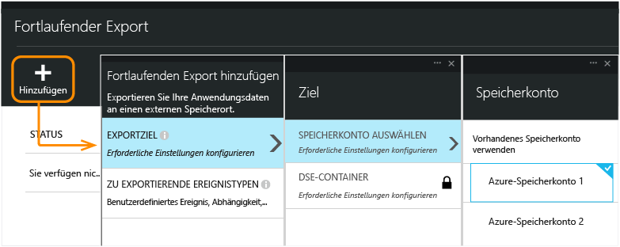
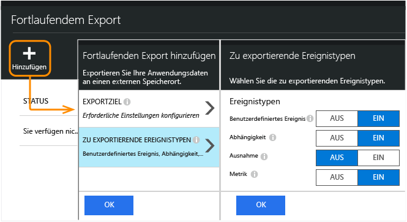
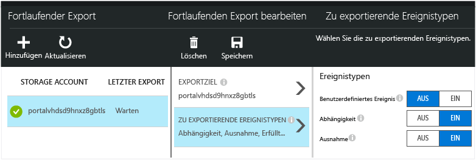
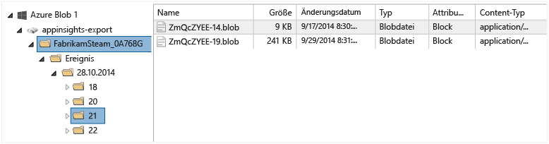
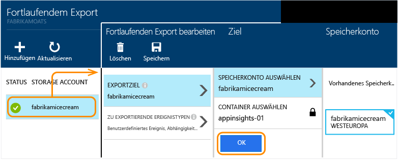

<properties 
	pageTitle="Fortlaufender Export von Telemetriedaten aus Application Insights" 
	description="Exportieren Sie Diagnose- und Nutzungsdaten in Microsoft Azure-Speicher, die Sie anschließendes daraus herunterladen." 
	services="application-insights" 
    documentationCenter=""
	authors="alancameronwills" 
	manager="douge"/>

<tags 
	ms.service="application-insights" 
	ms.workload="tbd" 
	ms.tgt_pltfrm="ibiza" 
	ms.devlang="na" 
	ms.topic="article" 
	ms.date="09/23/2015" 
	ms.author="awills"/>
 
# Exportieren von Telemetriedaten aus Application Insights

Möchten Sie Ihre Telemetriedaten einer angepassten Analyse unterziehen? Oder möchten Sie vielleicht eine E-Mail-Benachrichtigung zu Ereignissen mit bestimmten Eigenschaften erhalten? Der fortlaufende Export eignet sich hierfür ideal. Die Ereignisse, die Sie im Application Insights-Portal sehen, können im JSON-Format in Microsoft Azure-Speicher exportiert werden. Sie können Ihre Daten anschließend herunterladen und den Code schreiben, den Sie zu ihrer Verarbeitung benötigen.

Der fortlaufende Export ist im kostenlosen Testzeitraum und in den [Standard- und Premium-Preisplänen](http://azure.microsoft.com/pricing/details/application-insights/) verfügbar.

(Wenn Sie die Daten in einem Ihrer Blätter "Metriken" oder "Suchen" nur [einmal exportieren](app-insights-metrics-explorer.md#export-to-excel) möchten, klicken Sie oben im Blatt auf "Export".)

## Erstellen eines Speicherkontos

Wenn Sie noch nicht über ein "klassisches" Speicherkonto verfügen, erstellen Sie jetzt eins.

1. Erstellen Sie ein "klassisches" Speicherkonto in Ihrem Abonnement im [Azure-Portal](https://portal.azure.com).

    

2. Erstellen eines Containers

    

##  Einrichten des fortlaufenden Exports

Öffnen Sie im Application Insights-Portal auf dem Blatt "Übersicht" Ihrer Anwendung "Fortlaufender Export":

Fügen Sie einen Export hinzu, und wählen Sie ein [Azure-Speicherkonto](../storage-introduction.md), dem die Daten hinzugefügt werden sollen:

Wählen Sie die Ereignistypen, die Sie exportieren möchten:

Nachdem Sie Ihren Exportvorgang erstellt haben, geht es gleich los. (Sie erhalten nur Daten, die nach Erstellung des Exportvorgangs eingehen.)

Es kann etwa eine Stunde dauern, bis Daten im Blob angezeigt werden.

Wenn Sie die Ereignistypen später ändern möchten, bearbeiten Sie einfach den Export:

Klicken Sie auf "Deaktivieren", um den Datenstrom zu beenden. Wenn Sie erneut auf "Aktivieren" klicken, wird der Datenstrom mit neuen Daten neu gestartet. Sie erhalten nicht die Daten, die im Portal eingegangen sind, während der Export deaktiviert war.

Um den Datenstrom dauerhaft zu beenden, löschen Sie den Exportvorgang. Dabei werden Ihre Daten nicht aus dem Speicher gelöscht.

#### Wer darf einen Export ergänzen oder ändern?

* Zum Ergänzen oder Ändern von Exporten benötigen Sie das Zugriffsrecht "Besitzer", "Mitwirkender" oder "Application Insights-Mitwirkender". [Weitere Informationen zu Rollen][roles].

##  Welche Ereignisse werden abgerufen?

Bei den exportierten Daten handelt es sich um die Telemetrierohdaten, die wir von Ihrer Anwendung empfangen. Wir fügen allerdings Standortdaten hinzu, die wir anhand der Client-IP-Adresse berechnen.

Andere berechnete Metriken sind nicht enthalten. Wir exportieren z. B. nicht die durchschnittliche CPU-Auslastung, doch wir exportieren die rohen Telemetriedaten, anhand derer der Durchschnitt berechnet wird.

Die Daten umfassen außerdem die Ergebnisse von [Verfügbarkeitswebtests](app-insights-monitor-web-app-availability.md), die Sie eventuell eingerichtet haben.

## Untersuchen der Daten

Sie können den Speicher direkt im Portal überprüfen. Klicken Sie auf **Durchsuchen**, wählen Sie das Speicherkonto aus, und öffnen Sie dann **Container**.

Um Azure Storage in Visual Studio zu überprüfen, öffnen Sie **Anzeigen** und dann **Cloud Explorer**. (Wenn dieser Menübefehl nicht verfügbar ist, müssen Sie das Azure SDK installieren: Öffnen Sie das Dialogfeld **Neues Projekt**, erweitern Sie "Visual C#/Cloud", und wählen Sie **Get Microsoft Azure SDK for .NET** aus.)

Beim Öffnen Ihres Blobspeichers sehen Sie einen Container mit einer Gruppe von Blobdateien. Der URI der einzelnen Dateien wird vom Application Insights-Ressourcennamen, dem zugehörigen Instrumentierungsschlüssel sowie von Typ, Datum und Uhrzeit der Telemetriedaten abgeleitet. (Der Ressourcenname enthält nur Kleinbuchstaben, und beim Instrumentierungsschlüssel werden Bindestriche entfernt.)

Datum und Uhrzeit werden in UTC angegeben und entsprechen dem Zeitpunkt, an dem die Telemetriedaten im Speicher abgelegt wurden, nicht dem Zeitpunkt ihrer Erzeugung. Wenn Sie also Code zum Herunterladen der Daten schreiben, kann sich dieser linear durch die Daten bewegen.

##  Datenformat

* Jedes Blob ist eine Textdatei, die mehrere durch '\\n' getrennte Zeilen enthält.
* Jede Zeile ist ein unformatiertes JSON-Dokument. Wenn Sie den Vorgang verfolgen möchten, öffnen Sie es in Visual Studio, und wählen Sie "Bearbeiten", "Erweitert", "Formatdatei":

Zeiten werden mithilfe von Teilstrichen dargestellt: 10.000 Teilstriche = 1 ms. Diese Werte zeigen beispielsweise einen Zeitraum von 10 ms für das Senden einer Anforderung aus dem Browser, von 30 ms für den Empfang und von 1,8 s für die Verarbeitung der Seite im Browser:

	"sendRequest": {"value": 10000.0},
	"receiveRequest": {"value": 30000.0},
	"clientProcess": {"value": 17970000.0}

[Detaillierte Datenmodellreferenz für die Eigenschaftstypen und -werte.](app-insights-export-data-model.md)

## Verarbeiten der Daten

Im kleinen Rahmen können Sie Code zum Aufteilen Ihrer Daten schreiben, sie in eine Kalkulationstabelle einlesen usw. Zum Beispiel:

    private IEnumerable<T> DeserializeMany<T>(string folderName)
    {
      var files = Directory.EnumerateFiles(folderName, "*.blob", SearchOption.AllDirectories);
      foreach (var file in files)
      {
         using (var fileReader = File.OpenText(file))
         {
            string fileContent = fileReader.ReadToEnd();
            IEnumerable<string> entities = fileContent.Split('\n').Where(s => !string.IsNullOrWhiteSpace(s));
            foreach (var entity in entities)
            {
                yield return JsonConvert.DeserializeObject<T>(entity);
            }
         }
      }
    }

Ein umfangreicheres Codebeispiel finden Sie unter [Verwenden einer Workerrolle][exportasa].

## Löschen der alten Daten
Beachten Sie, dass Sie für die Verwaltung Ihrer Speicherkapazität und das Löschen der alten Daten nach Bedarf verantwortlich sind.

## Wenn Sie Ihren Speicherschlüssel erneut generieren...

Wenn Sie den Schlüssel zu Ihrem Speicher ändern, funktioniert der fortlaufende Export nicht mehr. In Ihrem Azure-Konto wird eine Benachrichtigung angezeigt.

Öffnen Sie das Blatt "Fortlaufender Export", und bearbeiten Sie den Export. Bearbeiten Sie das Exportziel, aber lassen Sie den gleichen Speicher ausgewählt. Klicken Sie auf "OK", um zu bestätigen.

Der fortlaufende Export wird neu gestartet.

## Exportieren nach Power BI

[Microsoft Power BI](https://powerbi.microsoft.com/) stellt die Daten mit umfangreichen und unterschiedlichen Grafiken dar und bietet die Möglichkeit, Informationen aus mehreren Quellen zu kombinieren. Sie können die Telemetriedaten über die Leistung und Nutzung Ihrer Apps von Application Insights zu Power BI streamen.

[Streamen von Application Insights zu Power BI](app-insights-export-power-bi.md)

## Exportieren in SQL

Eine weitere Option ist das Verschieben von Daten in eine SQL-Datenbank, in der Sie leistungsstärkere Analysen durchführen können.

In Beispielen werden zwei alternative Methoden zum Verschieben der Daten aus dem Blobspeicher in eine Datenbank veranschaulicht:

* [Exportieren in SQL über eine Workerrolle][exportcode]
* [Exportieren in SQL mit Stream Analytics][exportasa]

Bei größeren Dimensionen sollten Sie [HDInsight](http://azure.microsoft.com/services/hdinsight/)-Hadoop-Cluster in der Cloud erwägen. HDInsight bietet eine Vielzahl von Technologien für die Verwaltung und Analyse riesiger Datenmengen.

## Fragen und Antworten

* *Ich möchte aber nur ein Diagramm einmalig herunterladen.*  
 
    Das ist kein Problem. Klicken Sie oben im Blatt auf [Daten exportieren](app-insights-metrics-explorer.md#export-to-excel).

* *Ich habe einen Export eingerichtet, aber es sind keine Daten im meinem Speicher.*

    Hat Application Insights Telemetriedaten aus Ihrer App empfangen, seit Sie den Export eingerichtet haben? Sie erhalten nur neue Daten.

* *Ich habe versucht, einen Export einrichten, aber der Zugriff wurde verweigert.*

    Wenn das Konto im Besitz Ihrer Organisation ist, müssen Sie der Gruppe "Besitzer" oder "Mitwirkende" angehören.

    <!-- Your account has to be either a paid-for account, or in the free trial period. -->

* *Kann ich Daten direkt in meinen eigenen lokalen Datenspeicher exportieren?*

    Nein, leider nicht. Unser Exportmodul funktioniert zurzeit nur mit Azure-Speicher.

* *Gibt es Begrenzung der Menge von Daten, die im Speicher abgelegt werden können?*

    Nein. Wir übertragen Daten immer weiter, bis Sie den Export löschen. Wir hören auf, wenn wir uns den Grenzwerten Ihres Blobspeichers nähern, der aber ziemlich groß ist. Es liegt an Ihnen, wie viel Speicher Sie belegen.

* *Wie viele Blobs sollten im Speicher angezeigt werden?*

 * Für jeden Datentyp, den Sie zum Exportieren ausgewählt haben, wird jede Minute ein neues Blob erstellt (falls Daten verfügbar sind).
 * Darüber hinaus werden weitere Partitionseinheiten für Anwendungen mit hohem Datenverkehr zugeordnet. In diesem Fall erstellt jede Einheit jede Minute ein Blob.

* *Ich habe den Schlüssel zu meinem Speicher neu generiert oder den Namen des Containers geändert, und jetzt funktioniert der Export nicht mehr.*

    Bearbeiten Sie den Export, und öffnen Sie das Blatt "Exportziel". Lassen Sie denselben Speicher wie zuvor ausgewählt, und klicken Sie auf "OK", um zu bestätigen. Der Export wird neu gestartet. Wenn die Änderung in den vergangenen Tagen erfolgt ist, gehen keine Daten verloren.

* *Kann ich den Export anhalten?*

    Ja. Klicken Sie auf „Deaktivieren“.

## Codebeispiele

* [Streamen von Application Insights zu Power BI](app-insights-export-power-bi.md)
* [Analysieren exportierter JSON-Daten mithilfe einer Workerrolle][exportcode]
* [Exportieren in SQL mit Stream Analytics][exportasa]

* [Detaillierte Datenmodellreferenz für die Eigenschaftstypen und -werte.](app-insights-export-data-model.md)

<!--Link references-->

[exportcode]: app-insights-code-sample-export-telemetry-sql-database.md
[exportasa]: app-insights-code-sample-export-sql-stream-analytics.md
[roles]: app-insights-resources-roles-access-control.md

 

<!---HONumber=Sept15_HO4-->