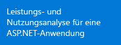
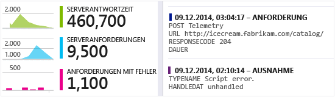
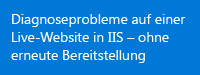
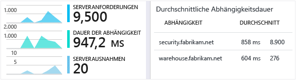
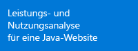
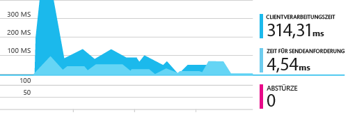
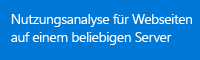
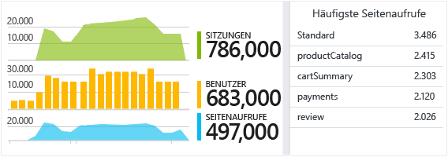
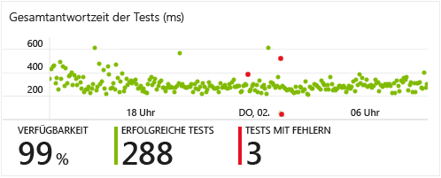
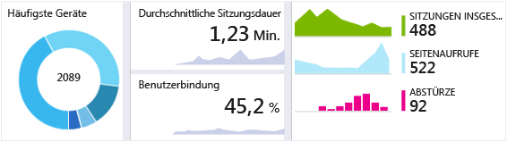

<properties
	pageTitle="Erste Schritte mit Visual Studio Application Insights | Microsoft Azure"
	description="Analysieren Sie die Auslastung, Verfügbarkeit und Leistung Ihrer lokalen oder Microsoft Azure-Webanwendung mit Visual Studio Application Insights."
	services="application-insights"
    documentationCenter=""
	authors="alancameronwills"
	manager="douge"/>

<tags
	ms.service="application-insights"
	ms.workload="tbd"
	ms.tgt_pltfrm="ibiza"
	ms.devlang="na"
	ms.topic="hero-article"
	ms.date="11/17/2015"
	ms.author="awills"/>

# Erste Schritte mit Visual Studio Application Insights

*Application Insights befindet sich in der Vorschau.*

Erkennen und lösen Sie Probleme, und verbessern Sie Ihre Anwendungen kontinuierlich. Diagnostizieren Sie schnell alle Probleme in Ihrer Liveanwendung. Verstehen Sie, wie sie von den Benutzern verwendet wird.

Die Konfiguration ist sehr einfach und liefert nach wenigen Minuten Resultate.

Wir unterstützen derzeit iOS-, Android- und Windows-Apps, J2EE- und ASP.NET-Webanwendungen sowie WCF-Dienste. Web-Apps können in Azure oder auf Ihren eigenen lokalen Servern ausgeführt werden. Unser JavaScript SDK kann auf allen Webseiten ausgeführt werden.

## Erste Schritte

Beginnen Sie mit einer beliebigen Kombination aus Einstiegspunkten in beliebiger Reihenfolge, die im folgenden Diagramm gezeigt werden. Folgen Sie dem Pfad, der für Sie geeignet ist.

Application Insights funktioniert durch Hinzufügen eines SDK zu Ihrer App, welches Telemetriedaten an das [Azure-Portal](http://portal.azure.com) sendet. Es gibt verschiedene SDKs für die verschiedenen Kombinationen von Plattformen, Sprachen und IDEs, die unterstützt werden.

Sie benötigen ein Konto in [Microsoft Azure](http://azure.com). Möglicherweise haben Sie über Ihre Organisation bereits Zugriff auf ein Gruppenkonto, oder Sie möchten vielleicht ein Konto für die nutzungsbasierte Bezahlung anfordern. Application Insights wird unter anderem im Free-Tarif angeboten, bei dem Sie erst bezahlen müssen, wenn sich Ihre App einiger Beliebtheit erfreut. Informationen hierzu finden Sie auf der Seite [Preisübersicht](https://azure.microsoft.com/pricing/details/application-insights/).

Ziel | Vorgehensweise | Ergebnis
---|---|---
  | <a href="app-insights-start-monitoring-app-health-usage.md">Hinzufügen des Application Insights-SDK zu Ihrem Webprojekt</a>    | 
 |<a href="app-insights-monitor-performance-live-website-now.md">Installieren des Statusmonitors auf dem IIS-Server</a>    | 
|<a href="insights-perf-analytics.md">Aktivieren von Insights in Ihrer Azure-Web-App oder auf dem virtuellen Computer</a>    | 
|<a href="app-insights-java-get-started.md">Hinzufügen des SDK zu Ihrem Java-Projekt</a>  | 
|<a href="app-insights-web-track-usage.md">Einfügen des Application Insights-Skripts in Ihre Webseiten</a>  | 
|<a href="app-insights-monitor-web-app-availability.md">Erstellen von Webtests</a>  | 
|<a href="http://hockeyapp.net">Verwenden von HockeyApp</a>  | 

## Support und Feedback

* Fragen und Probleme:
 * [Problembehandlung][qna]
 * [MSDN-Forum](https://social.msdn.microsoft.com/Forums/vstudio/de-DE/home?forum=ApplicationInsights)
 * [StackOverflow](http://stackoverflow.com/questions/tagged/ms-application-insights)
* Fehler:
 * [Kontakt](https://connect.microsoft.com/VisualStudio/Feedback/LoadSubmitFeedbackForm?FormID=6076)
* Vorschläge:
 * [Aussagen von Benutzern](http://visualstudio.uservoice.com/forums/121579-visual-studio/category/77108-application-insights)
* Codebeispiele
 * [Codebeispiele](app-insights-code-samples.md)

## Videos

> [AZURE.VIDEO 218]

> [AZURE.VIDEO usage-monitoring-application-insights]

> [AZURE.VIDEO performance-monitoring-application-insights]

<!--Link references-->

[qna]: app-insights-troubleshoot-faq.md

<!---HONumber=AcomDC_1125_2015-->