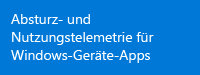

<properties 
	pageTitle="Erste Schritte mit Application Insights" 
	description="Analysieren Sie die Auslastung, Verfügbarkeit und Leistung Ihrer lokalen oder Microsoft Azure-Webanwendung mit Application Insights." 
	services="application-insights" 
    documentationCenter=""
	authors="alancameronwills" 
	manager="ronmart"/>

<tags 
	ms.service="application-insights" 
	ms.workload="tbd" 
	ms.tgt_pltfrm="ibiza" 
	ms.devlang="na" 
	ms.topic="hero-article" 
	ms.date="04/26/2015" 
	ms.author="awills"/>

# Erste Schritte mit Visual Studio Application Insights

*Application Insights befindet sich in der Vorschau.*

Erkennen und lösen Sie Probleme, und verbessern Sie Ihre Anwendungen kontinuierlich. Diagnostizieren Sie schnell alle Probleme in Ihrer Liveanwendung. Verstehen Sie, wie sie von den Benutzern verwendet wird.

Die Konfiguration ist sehr einfach und liefert nach wenigen Minuten Resultate.

Wir unterstützen derzeit iOS, Android und Windows apps; J2EE und ASP.NET Webanwendungen, WCF-Dienste. Webanwendungen können in Azure oder Ihre eigenen lokalen Server ausgeführt werden. Unsere JavaScript-SDK wird in alle Webseiten ausgeführt.

## Erste Schritte

Beginnen Sie mit einer beliebigen Kombination in beliebiger Reihenfolge Einstiegspunkte auf der linken Seite dieser Zuordnung. Führen Sie den Pfad, der für Sie funktioniert.

Application Insights funktioniert durch Hinzufügen eines SDKS in Ihre app, die Telemetrie, sendet die [Azure-Portal](http://portal.azure.com). Es gibt verschiedene SDKs für die verschiedenen Kombinationen von Plattformen, Sprachen und IDEs, die unterstützt werden.

Benötigen Sie ein Konto in [Microsoft Azure](http://azure.com). Möglicherweise haben Sie bereits Zugriff auf ein Gruppenkonto über Ihre Organisation oder möglicherweise möchten ein Konto für die nutzungsbasierte erhalten. (Zwar Application Insights in der Vorschau, ist es kostenlos.)

Was soll | Was zu tun ist | Erhalten Sie
---|---|---
  | <a href="app-insights-start-monitoring-app-health-usage.md">Hinzufügen von Application Insights-SDK zum Webprojekt</a>    | 
 |<a href="app-insights-monitor-performance-live-website-now.md">Statusmonitor zu installieren, auf dem IIS-Server</a>    | 
|<a href="insights-perf-analytics.md">Aktivieren Sie Einblicke in Ihre Azure Web app oder VM</a>    | 
|<a href="app-insights-java-get-started.md">Das SDK zu Ihrem Java-Projekt hinzufügen</a>  | 
|<a href="app-insights-web-track-usage.md">Das Application Insights-Skript in Ihre Webseiten einfügen</a>  | 
|<a href="app-insights-monitor-web-app-availability.md">Erstellen von Webtests</a>  | 
|<a href="app-insights-windows-get-started.md">Hinzufügen von Application Insights für Ihre Geräte-app-Projekt</a>  | 

## Support und Feedback

* Fragen und Probleme:
 * [Problembehandlung][qna]
 * [MSDN-Forum](https://social.msdn.microsoft.com/Forums/vstudio/en-US/home?forum=ApplicationInsights)
 * [StackOverflow](http://stackoverflow.com/questions/tagged/ms-application-insights)
* Fehler:
 * [Verbinden](https://connect.microsoft.com/VisualStudio/Feedback/LoadSubmitFeedbackForm?FormID=6076)
* Vorschläge:
 * [User Voice](http://visualstudio.uservoice.com/forums/121579-visual-studio/category/77108-application-insights)

## Videos

> [AZURE.VIDEO 218]

> [AZURE.VIDEO usage-monitoring-application-insights]

> [AZURE.VIDEO performance-monitoring-application-insights]

<!--Link references-->

[qna]: app-insights-troubleshoot-faq.md

 

<!---HONumber=GIT-SubDir_Tue_AM_dede-->