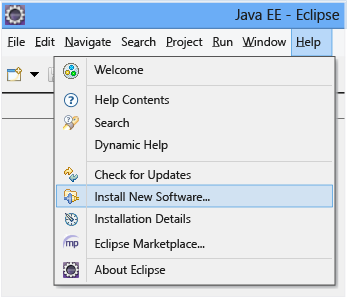

<properties 
	pageTitle="Erste Schritte mit Application Insights mit Java in Eclipse" 
	description="Verwenden Sie das Eclipse-Plug-In zum Hinzufügen einer Leistungs- und Nutzungsüberwachung zu Ihrer Java-Website mit Application Insights" 
	services="application-insights" 
    documentationCenter="java"
	authors="alancameronwills" 
	manager="keboyd"/>

<tags 
	ms.service="application-insights" 
	ms.workload="tbd" 
	ms.tgt_pltfrm="ibiza" 
	ms.devlang="na" 
	ms.topic="article" 
	ms.date="03/03/2015" 
	ms.author="awills"/>
 
# Erste Schritte mit Application Insights mit Java in Eclipse

Das Application Insights SDK sendet Telemetriedaten aus Ihrer Java-Anwendung, damit Sie die Nutzung und Leistung analysieren können. Das Eclipse-Plug-In für Application Insights installiert das SDK automatisch in Ihrem Projekt, damit Sie ohne Konfiguration Telemetriedaten sowie eine API verwenden können, mit der Sie benutzerdefinierte Telemetrie programmieren können.

## Voraussetzungen

Derzeit funktioniert das Plug-In für dynamische Webprojekte in Eclipse. ([Hinzufügen von Application Insights zu anderen Arten von Java-Projekten][java].)

Sie benötigen Folgendes:

* Oracle JRE 1.6 oder höher
* Ein Abonnement für [Microsoft Azure](http://azure.microsoft.com/). (Sie können mit der [kostenlosen Testversion](http://azure.microsoft.com/pricing/free-trial/) beginnen.)
* [Eclipse IDE für Java EE-Entwickler](http://www.eclipse.org/downloads/), Indigo oder höher.
* Windows 7 oder höher oder Windows Server 2008 oder höher

## Installation des SDK in Eclipse (einmalig)

Sie müssen diesen Schritt nur einmal pro Computer durchführen. Bei diesem Schritt wird ein Toolkit installiert, mit dem dann das SDK jedem dynamischen Webprojekt hinzugefügt werden kann.

1. Klicken Sie in Eclipse auf "Hilfe" und dann auf "Neue Software installieren".

    

2. Das SDK befindet sich in http://dl.msopentech.com/eclipse unter "Azure Toolkit".
3. Deaktivieren Sie **Contact all update sites...**.

    

Führen für jedes Java-Projekt die verbleibenden Schritte aus.

## Abrufen eines Application Insights-Instrumentationsschlüssels

Ihre Nutzungs- und Leistungsanalysen werden in einer Azure-Ressource im Azure-Webportal angezeigt. In diesem Schritt richten Sie eine Azure-Ressource für Ihre Anwendung ein.

1. Melden Sie sich am [Microsoft Azure-Portal](https://portal.azure.com) an. (Sie benötigen auch ein [Azure-Abonnement](http://azure.microsoft.com/).)
2. Erstellen einer neuen Application Insights-Ressource

    
3. Legen Sie den Anwendungstyp auf "Java-Webanwendung" fest.

    
4. Suchen Sie den Instrumentationsschlüssel der neuen Ressource. Sie müssen ihn in Ihr Projekt in Eclipse einfügen.

    

## Hinzufügen des SDK zu Ihrem Java-Projekt

1. Fügen Sie Application Insights über das Kontextmenü Ihres Webprojekts hinzu.

    
2. Fügen Sie den Instrumentationsschlüssel ein, den Sie aus dem Azure-Portal abgerufen haben.

    

Der Schlüssel wird zusammen mit jedem Telemetrieelement übermittelt und weist Application Insights an, es in Ihrer Ressource anzuzeigen.

## Ausführen der Anwendung und Anzeigen von Metriken

Führen Sie Ihre Anwendung aus.

Kehren Sie zur Application Insights-Ressource in Microsoft Azure zurück.

HTTP-Anforderungsdaten werden auf dem Blatt "Übersicht" angezeigt. (Wenn sie nicht vorhanden sind, warten Sie einige Sekunden, und klicken Sie dann auf "Aktualisieren".)

 

Klicken Sie sich durch ein beliebiges Diagramm, um ausführlichere Metriken anzuzeigen.

[Weitere Informationen zu Metriken.][metrics]

 

Beim Anzeigen der Eigenschaften einer Anforderung können Sie die damit verbundenen Telemetrieereignisse erkennen, wie z. B. Anforderungen und Ausnahmen.
 

## Clientseitige Telemetrie

Auf dem Blatt "Übersicht" gelangen Sie über die Kachel "Schnellstart" zu einem Skript, das Sie Ihren Webseiten hinzufügen können.

Seitenaufruf-, Benutzer- und Sitzungsmetriken werden auf dem Blatt "Übersicht" angezeigt:

[Weitere Informationen zum Einrichten clientseitiger Telemetrie.][usage]

## Verfügbarkeitswebtests

Application Insights kann Ihre Website in regelmäßigen Abständen testen, um zu überprüfen, ob sie betriebsbereit ist und gut reagiert. Klicken Sie sich durch das leere Webtestdiagramm auf dem Blatt "Übersicht", und geben Sie Ihre öffentliche URL an.

Sie erhalten Diagramme von Reaktionszeiten sowie E-Mail-Benachrichtigungen, falls Ihre Website ausfällt.

[Weitere Informationen zu Verfügbarkeitswebtests.][availability]

## Diagnoseprotokolle

Wenn Sie für die Ablaufverfolgung Logback oder Log4J (Version 1.2 bzw. 2.0) verwenden, werden Ihre Ablaufverfolgungsprotokolle automatisch an Application Insights gesendet. Hier können Sie sie durchsuchen und untersuchen.

[Weitere Informationen zu Diagnoseprotokolle][javalogs]

## Benutzerdefinierte Telemetrie 

Fügen Sie ein paar Codezeilen in Ihre Java-Anwendung ein, um herauszufinden, was Benutzer damit tun oder um Probleme zu diagnostizieren.

Sie können Code sowohl in das JavaScript der Webseite als auch in serverseitiges Java einfügen.

[Weitere Informationen zur benutzerdefinierten Telemetrie][track]

## Nächste Schritte

#### Erkennen und Diagnostizieren von Problemen

* [Fügen Sie Webclient-Telemetrie hinzu,][usage] um Leistungstelemetriedaten vom Webclient abzurufen.
* [Richten Sie Webtests ein][availability], um sicherzustellen, dass die Anwendung online und reaktionsfähig bleibt.
* [Durchsuchen Sie Ereignisse und Protokolle][diagnostic], um Probleme besser zu diagnostizieren.
* [Erfassen Sie Log4J- oder Logback-Ablaufverfolgungen.][javalogs]

#### Nutzung nachverfolgen

* [Fügen Sie Webclient-Telemetrie hinzu][usage], um Seitenaufrufe und grundlegende Benutzermetriken zu überwachen.
* [Verfolgen Sie benutzerdefinierte Ereignisse und Metriken nach][track], um zu erfahren, wie Ihre Anwendung sowohl auf dem Client als auch auf dem Server verwendet wird.

<!--Link references-->

[availability]: app-insights-monitor-web-app-availability.md
[diagnostic]: app-insights-diagnostic-search.md
[java]: app-insights-java-get-started.md
[javalogs]: app-insights-java-trace-logs.md
[metrics]: app-insights-metrics-explorer.md
[track]: app-insights-custom-events-metrics-api.md
[usage]: app-insights-web-track-usage.md

 

<!---HONumber=62-->