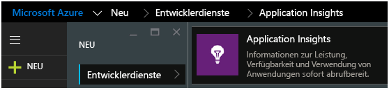
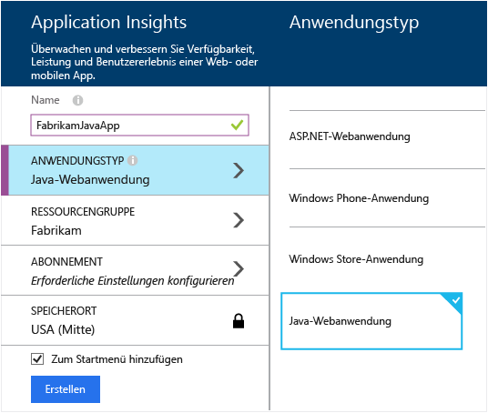
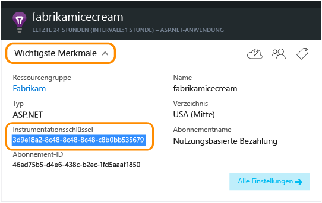

<properties 
	pageTitle="Application Insights für Java-Web-Apps, die bereits live sind" 
	description="Starten Sie die Überwachung einer Webanwendung, die bereits auf dem Server ausgeführt wird" 
	services="application-insights" 
    documentationCenter="java"
	authors="alancameronwills" 
	manager="douge"/>

<tags 
	ms.service="application-insights" 
	ms.workload="tbd" 
	ms.tgt_pltfrm="ibiza" 
	ms.devlang="na" 
	ms.topic="article" 
	ms.date="10/21/2015" 
	ms.author="awills"/>
 
# Application Insights für Java-Web-Apps, die bereits live sind

*Application Insights befindet sich in der Vorschau.*

Wenn Sie eine Webanwendung haben, die bereits auf dem J2EE-Server ausgeführt wird, können Sie mit der Überwachung mit [Application Insights](app-insights-overview.md) beginnen, ohne Codeänderungen vornehmen oder das Projekt neu kompilieren zu müssen. Mit dieser Option erhalten Sie Informationen über an Ihre Server gesendete HTTP-Anforderungen, nicht behandelte Ausnahmen und Leistungsindikatoren.

Sie benötigen ein [Microsoft Azure](http://azure.com)-Abonnement.

> [AZURE.NOTE]Mit dem Verfahren auf dieser Seite wird Ihrer Web-App zur Laufzeit das SDK hinzugefügt. Dies ist nützlich, wenn Sie den Quellcode nicht aktualisieren oder neu erstellen möchten. Sofern möglich, empfehlen wir jedoch, dass Sie stattdessen [das SDK zum Quellcode hinzufügen](app-insights-java-get-started.md). Dadurch erhalten Sie weitere Optionen, Sie können z. B. Code zum Nachverfolgen der Benutzeraktivität schreiben.

## 1\. Abrufen eines Application Insights-Instrumentationsschlüssels

1. Melden Sie sich am [Microsoft Azure-Portal](https://portal.azure.com) an.
2. Erstellen einer neuen Application Insights-Ressource

    
3. Legen Sie den Anwendungstyp auf "Java-Webanwendung" fest.

    
4. Suchen Sie den Instrumentationsschlüssel der neuen Ressource. Sie müssen ihn in Kürze in Ihr Codeprojekt einfügen.

    

## 2\. Herunterladen des SDK

1. Laden Sie das [Application Insights-SDK für Java](https://azuredownloads.blob.core.windows.net/applicationinsights/sdk.html) herunter. 
2. Extrahieren Sie auf dem Server den SDK-Inhalt in das Verzeichnis, aus dem die Projektbinärdateien geladen werden. Wenn Sie Tomcat verwenden, ist dies in der Regel unter `webapps<your_app_name>\WEB-INF\lib`.

## 3\. Hinzufügen der Datei "ApplicationInsights.XML"

Erstellen Sie "ApplicationInsights.xml" in dem Ordner, in dem Sie das SDK hinzugefügt haben. Fügen Sie den folgenden XML-Code ein.

Fügen Sie den Instrumentationsschlüssel ein, den Sie aus dem Azure-Portal abgerufen haben.

    <?xml version="1.0" encoding="utf-8"?>
    <ApplicationInsights xmlns="http://schemas.microsoft.com/ApplicationInsights/2013/Settings" schemaVersion="2014-05-30">

      <!-- The key from the portal: -->

      <InstrumentationKey>** Your instrumentation key **</InstrumentationKey>

      <!-- HTTP request component (not required for bare API) -->

      <TelemetryModules>
        <Add type="com.microsoft.applicationinsights.web.extensibility.modules.WebRequestTrackingTelemetryModule"/>
        <Add type="com.microsoft.applicationinsights.web.extensibility.modules.WebSessionTrackingTelemetryModule"/>
        <Add type="com.microsoft.applicationinsights.web.extensibility.modules.WebUserTrackingTelemetryModule"/>
      </TelemetryModules>

      <!-- Events correlation (not required for bare API) -->
      <!-- These initializers add context data to each event -->

      <TelemetryInitializers>
        <Add   type="com.microsoft.applicationinsights.web.extensibility.initializers.WebOperationIdTelemetryInitializer"/>
        <Add type="com.microsoft.applicationinsights.web.extensibility.initializers.WebOperationNameTelemetryInitializer"/>
        <Add type="com.microsoft.applicationinsights.web.extensibility.initializers.WebSessionTelemetryInitializer"/>
        <Add type="com.microsoft.applicationinsights.web.extensibility.initializers.WebUserTelemetryInitializer"/>
        <Add type="com.microsoft.applicationinsights.web.extensibility.initializers.WebUserAgentTelemetryInitializer"/>

      </TelemetryInitializers>
    </ApplicationInsights>

* Der Instrumentationsschlüssel wird zusammen mit jedem Telemetrieelement übermittelt und weist Application Insights an, ihn in Ihrer Ressource anzuzeigen.
* Die Komponente "HTTP-Anforderung" ist optional. Sie sendet automatisch Telemetriedaten zu Anforderungen und Antwortzeiten zum Portal.
* Die Korrelation von Ereignissen ist eine Ergänzung der HTTP-Anforderungskomponente. Sie weist den einzelnen Anforderungen, die vom Server empfangen wurden, einen Bezeichner zu und fügt diesen als Eigenschaft 'Operation.Id' jedem Telemetrieelement hinzu. Diese Eigenschaft ermöglicht das Korrelieren der jeder Anforderung zugeordneten Telemetriedaten, indem in [Diagnosesuche](app-insights-diagnostic-search.md) ein Filter festgelegt wird.

## 4\. Hinzufügen eines HTTP-Filters

Suchen und öffnen Sie die Datei "web.xml" in Ihrem Projekt, und führen Sie den folgenden Codeausschnitt unter dem Knoten "web-app" zusammen, in dem Ihre Anwendungsfilter konfiguriert sind.

Um möglichst genaue Ergebnisse zu erhalten, muss der Filter vor allen anderen Filtern zugeordnet werden.

    <filter>
      <filter-name>ApplicationInsightsWebFilter</filter-name>
      <filter-class>
        com.microsoft.applicationinsights.web.internal.WebRequestTrackingFilter
      </filter-class>
    </filter>
    <filter-mapping>
       <filter-name>ApplicationInsightsWebFilter</filter-name>
       <url-pattern>/*</url-pattern>
    </filter-mapping>

## 5\. Starten Sie die Web-App neu.

## 6\. Anzeigen Ihrer Telemetriedaten in Application Insights

Kehren Sie zur Application Insights-Ressource im [Microsoft Azure-Portal](https://portal.azure.com) zurück.

HTTP-Anforderungsdaten werden auf dem Blatt "Übersicht" angezeigt. (Wenn sie nicht vorhanden sind, warten Sie einige Sekunden, und klicken Sie dann auf "Aktualisieren".)

 

Klicken Sie sich durch ein beliebiges Diagramm, um ausführlichere Metriken anzuzeigen.

 

Beim Anzeigen der Eigenschaften einer Anforderung können Sie die damit verbundenen Telemetrieereignisse erkennen, wie z. B. Anforderungen und Ausnahmen.
 

[Hier finden Sie weitere Informationen zu Metriken.](app-insights-metrics-explorer.md)

## Nächste Schritte

* [Fügen Sie Ihren Webseiten Telemetrie hinzu](app-insights-web-track-usage.md), um Seitenaufrufe und Benutzermetriken zu überwachen.
* [Richten Sie Webtests ein](app-insights-monitor-web-app-availability.md), um sicherzustellen, dass die Anwendung online und reaktionsfähig bleibt.
* [Erfassen von Protokollablaufverfolgungen](app-insights-java-trace-logs.md)
* [Durchsuchen Sie Ereignisse und Protokolle](app-insights-diagnostic-search.md), um Probleme besser zu diagnostizieren.

 

<!---HONumber=Nov15_HO2-->