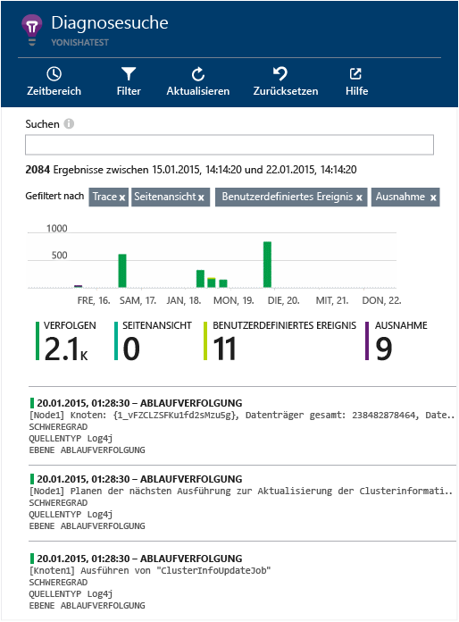

<properties 
	pageTitle="Untersuchen von Java-Ablaufverfolgungsprotokollen in Application Insights" 
	description="Durchsuchen von Log4J- oder Logback-Ablaufverfolgungen in Application Insights" 
	services="application-insights" 
    documentationCenter="java"
	authors="alancameronwills" 
	manager="douge"/>

<tags 
	ms.service="application-insights" 
	ms.workload="tbd" 
	ms.tgt_pltfrm="ibiza" 
	ms.devlang="na" 
	ms.topic="article" 
	ms.date="01/21/2016" 
	ms.author="awills"/>

# Untersuchen von Java-Ablaufverfolgungsprotokollen in Application Insights

Wenn Sie für die Ablaufverfolgung Logback oder Log4J (Version 1.2 bzw. 2.0) verwenden, werden Ihre Ablaufverfolgungsprotokolle automatisch an Application Insights gesendet. Hier können Sie sie durchsuchen und untersuchen.

Installieren Sie das [Application Insights SDK für Java][java], falls noch nicht geschehen.

## Hinzufügen von Protokollierungsbibliotheken zu Ihrem Projekt

*Wählen Sie die geeignete Methode für Ihr Projekt.*

#### Wenn Sie Maven verwenden...

Wenn Ihr Projekt bereits für die Verwendung von Maven für den Buildprozess eingerichtet ist, fügen Sie einen der folgenden Codeabschnitte Ihrer Datei "pom.xml" hinzu:

Aktualisieren Sie dann die Projektabhängigkeiten, damit die Binärdateien heruntergeladen werden.

*Logback*

    <dependencies>
       <dependency>
          <groupId>com.microsoft.azure</groupId>
          <artifactId>applicationinsights-logging-logback</artifactId>
          <version>[1.0,)</version>
       </dependency>
    </dependencies>

*Log4J v2. 0*

    <dependencies>
       <dependency>
          <groupId>com.microsoft.azure</groupId>
          <artifactId>applicationinsights-logging-log4j2</artifactId>
          <version>[1.0,)</version>
       </dependency>
    </dependencies>

*Log4J v1. 2*

    <dependencies>
       <dependency>
          <groupId>com.microsoft.azure</groupId>
          <artifactId>applicationinsights-logging-log4j1_2</artifactId>
          <version>[1.0,)</version>
       </dependency>
    </dependencies>

#### Wenn Sie Gradle verwenden...

Wenn Ihr Projekt bereits für die Verwendung von Gradle für Buildprozesse eingerichtet ist, fügen Sie eine der folgenden Zeilen der Gruppe `dependencies` in der Datei "build.gradle" hinzu:

Aktualisieren Sie dann die Projektabhängigkeiten, damit die Binärdateien heruntergeladen werden.

**Logback**

    compile group: 'com.microsoft.azure', name: 'applicationinsights-logging-logback', version: '1.0.+'

**Log4J v2. 0**

    compile group: 'com.microsoft.azure', name: 'applicationinsights-logging-log4j2', version: '1.0.+'

**Log4J v1. 2**

    compile group: 'com.microsoft.azure', name: 'applicationinsights-logging-log4j1_2', version: '1.0.+'

#### Andernfalls...

Laden Sie den entsprechenden Appender herunter, extrahieren Sie ihn, und fügen Sie Ihrem Projekt die entsprechende Bibliothek hinzu:

Protokollierungstool | Herunterladen | Bibliothek
----|----|----
Logback|[SDK mit Logback-Appender](https://azuredownloads.blob.core.windows.net/applicationinsights/logbackAppender.zip)|applicationinsights-logging-logback
Log4J v2. 0|[SDK mit Log4J-v2-Appender](https://azuredownloads.blob.core.windows.net/applicationinsights/log4j2Appender.zip)|applicationinsights-logging-log4j2 
Log4J v1. 2|[SDK mit Log4J-v1. 2-Appender](https://azuredownloads.blob.core.windows.net/applicationinsights/log4j1_2Appender.zip)|applicationinsights-logging-log4j1\_2 

## Hinzufügen des Appenders zu Ihrem Protokollierungsframework

Zum Starten von Ablaufverfolgungen führen Sie den relevanten Codeausschnitt mit der Konfigurationsdatei für Log4J oder Logback zusammen:

*Logback*

    <appender name="aiAppender" 
      class="com.microsoft.applicationinsights.logback.ApplicationInsightsAppender">
    </appender>
    <root level="trace">
      <appender-ref ref="aiAppender" />
    </root>

*Log4J v2. 0*

    
    <Appenders>
      <ApplicationInsightsAppender name="aiAppender" />
    </Appenders>
    <Loggers>
      <Root level="trace">
        <AppenderRef ref="aiAppender"/>
      </Root>
    </Loggers>

*Log4J v1. 2*

    <appender name="aiAppender" 
         class="com.microsoft.applicationinsights.log4j.v1_2.ApplicationInsightsAppender">
    </appender>
    <root>
      <priority value ="trace" />
      <appender-ref ref="aiAppender" />
    </root>

Die Application Insights-Appender können von jeder konfigurierten Protokollierung und müssen nicht unbedingt von der Stammprotokollierung referenziert werden (siehe die obigen Codebeispiele).

## Untersuchen Ihrer Ablaufverfolgungen im Application Insights-Portal

Nachdem Sie das Projekt so konfiguriert haben, dass Ablaufverfolgungen an Application Insights gesendet werden, können Sie diese Ablaufverfolgungen im Application Insights-Portal auf dem Blatt [Diagnosesuche][diagnostic] anzeigen und durchsuchen.

## Nächste Schritte

[Diagnosesuche][diagnostic]

<!--Link references-->

[diagnostic]: app-insights-diagnostic-search.md
[java]: app-insights-java-get-started.md

 

<!---HONumber=AcomDC_0128_2016-->