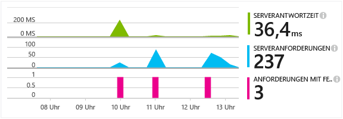
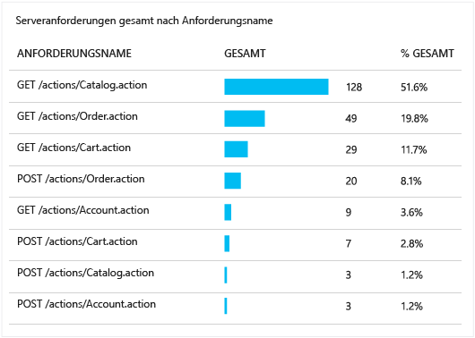
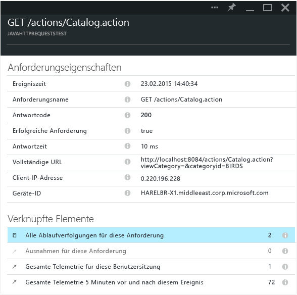

<properties 
	pageTitle="Nachverfolgen von HTTP-Anforderungen in einer Java-Webanwendung" 
	description="Application Insights ermöglicht das Messen der Leistung Ihrer Java-Webanwendung" 
	services="application-insights" 
    documentationCenter=""
	authors="alancameronwills" 
	manager="keboyd"/>

<tags 
	ms.service="application-insights" 
	ms.workload="tbd" 
	ms.tgt_pltfrm="ibiza" 
	ms.devlang="na" 
	ms.topic="article" 
	ms.date="05/26/2015" 
	ms.author="awills"/>
 
# Nachverfolgen von HTTP-Anforderungen in einer Java-Webanwendung

Wenn Sie eine Java-Webanwendung ausführen, können Sie im Application Insights-Portal Informationen zu den HTTP-Anforderungen anzeigen, die an Ihre Anwendung gesendet werden, wie z. B. die angeforderten Ressourcen, nicht erfolgreiche Anforderungen und Antwortzeiten.

Installieren Sie das [Application Insights SDK für Java][java], falls noch nicht geschehen.

## Hinzufügen der Binärdateien zum Projekt

*Wählen Sie die geeignete Methode für Ihr Projekt.*

### Wenn Sie Maven verwenden...

Wenn Ihr Projekt bereits für die Verwendung von Maven für den Buildprozess eingerichtet ist, fügen Sie den folgenden Codeabschnitt Ihrer Datei "pom.xml" hinzu:

Aktualisieren Sie dann die Projektabhängigkeiten, damit die Binärdateien heruntergeladen werden.

    <dependencies>
      <dependency>
        <groupId>com.microsoft.azure</groupId>
        <artifactId>applicationinsights-web</artifactId>
        <version>[0.9,)</version>
      </dependency>
    </dependencies>

### Wenn Sie Gradle verwenden...

Wenn Ihr Projekt bereits für die Verwendung von Gradle für den Buildprozess eingerichtet ist, fügen Sie den folgenden Codeabschnitt Ihrer Datei "build.gradle" hinzu:

Aktualisieren Sie dann die Projektabhängigkeiten, damit die Binärdateien heruntergeladen werden.

    dependencies {
      compile group: 'com.microsoft.azure', name: 'applicationinsights-web', version: '0.9.+'
    }

## Hinzufügen des Application Insights-HTTP-Filters zum Projekt

Suchen und öffnen Sie die Datei "web.xml" in Ihrem Projekt, und führen Sie den folgenden Codeausschnitt unter dem Knoten "web-app" zusammen, in dem Ihre Anwendungsfilter konfiguriert sind.

Um möglichst genaue Ergebnisse zu erhalten, muss der Filter vor allen anderen Filtern zugeordnet werden.

    <filter>
      <filter-name>ApplicationInsightsWebFilter</filter-name>
      <filter-class>
        com.microsoft.applicationinsights.web.internal.WebRequestTrackingFilter
      </filter-class>
    </filter>
    <filter-mapping>
       <filter-name>ApplicationInsightsWebFilter</filter-name>
       <url-pattern>/*</url-pattern>
    </filter-mapping>

## Hinzufügen der HTTP-Module zum Projekt

Suchen und öffnen Sie die Datei "ApplicationInsights.xml" in Ihrem Projekt, und führen den folgenden Codeausschnitt unter dem Element <TelemetryModules> zusammen.

Wenn in dieser Datei kein Element <TelemetryModules> vorhanden ist, fügen Sie eines unter dem Element <ApplicationInsights> hinzu.

    <TelemetryModules>
      <Add type="com.microsoft.applicationinsights.web.extensibility.modules.WebRequestTrackingTelemetryModule"/>
      <Add type="com.microsoft.applicationinsights.web.extensibility.modules.WebSessionTrackingTelemetryModule"/>
      <Add type="com.microsoft.applicationinsights.web.extensibility.modules.WebUserTrackingTelemetryModule"/>
    </TelemetryModules>

## Hinzufügen von Initialisierern für Telemetriedaten für die Korrelation von Ereignissen

Mithilfe der Korrelation von Ereignissen können Sie eine Zuordnung zwischen einer HTTP-Anforderung und allen Telemetrieereignissen einrichten, die während der Anforderungsverarbeitung gesendet wurden. Dazu wird eine Vorgangs-ID-Eigenschaft verwendet, die an jedes dieser Telemetrieereignisse angefügt wird. Dies ermöglicht das Untersuchen einer HTTP-Anforderung zusammen mit allen Ereignissen, die in ihr aufgerufen wurden, und erleichtert die Diagnose und Behebung von Problemen.

Suchen und öffnen Sie die Datei "ApplicationInsights.xml" in Ihrem Projekt, und führen den folgenden Codeausschnitt unter dem Element <TelemetryInitializers> zusammen.

Wenn in dieser Datei kein Element < TelemetryInitializers> vorhanden ist, fügen Sie eines unter dem Element <ApplicationInsights> hinzu.

    <TelemetryInitializers>
     <Add  type="com.microsoft.applicationinsights.web.extensibility.initializers.WebOperationIdTelemetryInitializer"/>
     <Add type="com.microsoft.applicationinsights.web.extensibility.initializers.WebOperationNameTelemetryInitializer"/>
     <Add type="com.microsoft.applicationinsights.web.extensibility.initializers.WebSessionTelemetryInitializer"/>
     <Add type="com.microsoft.applicationinsights.web.extensibility.initializers.WebUserTelemetryInitializer"/>
     <Add type="com.microsoft.applicationinsights.web.extensibility.initializers.WebUserAgentTelemetryInitializer"/>
    </TelemetryInitializers>

## Anzeigen der Anforderungsinformationen in Application Insights

Führen Sie Ihre Anwendung aus.

Kehren Sie zur Application Insights-Ressource in Microsoft Azure zurück.

HTTP-Anforderungsdaten werden auf dem Blatt "Übersicht" angezeigt. (Wenn sie nicht vorhanden sind, warten Sie einige Sekunden, und klicken Sie dann auf "Aktualisieren".)

 

Klicken Sie sich durch ein beliebiges Diagramm, um ausführlichere Metriken anzuzeigen.

[Weitere Informationen zu Metriken.][metrics]

 

Beim Anzeigen der Eigenschaften einer Anforderung können Sie die damit verbundenen Telemetrieereignisse erkennen, wie z. B. Anforderungen und Ausnahmen.
 

## Nächste Schritte

* [Durchsuchen Sie Ereignisse und Protokolle][diagnostic], um Probleme besser zu diagnostizieren.
* [Erfassen Sie Log4J- oder Logback-Ablaufverfolgungen.][javalogs]

<!--Link references-->

[diagnostic]: app-insights-diagnostic-search.md
[java]: app-insights-java-get-started.md
[javalogs]: app-insights-java-trace-logs.md
[metrics]: app-insights-metrics-explorer.md

 

<!---HONumber=July15_HO4-->