<properties 
	pageTitle="Application Insights für JavaScript-Web-Apps" 
	description="Erhalten Sie die Anzahl der Seitenaufrufe und Sitzungen, rufen Sie Webclientdaten ab, und verfolgen Sie Verwendungsmuster. Erkennen Sie Ausnahmen und Leistungsprobleme in JavaScript-Web-Apps." 
	services="application-insights" 
    documentationCenter=""
	authors="alancameronwills" 
	manager="douge"/>

<tags 
	ms.service="application-insights" 
	ms.workload="tbd" 
	ms.tgt_pltfrm="ibiza" 
	ms.devlang="na" 
	ms.topic="get-started-article" 
	ms.date="07/10/2015" 
	ms.author="awills"/>
 
# Application Insights für JavaScript-Web-Apps

[AZURE.INCLUDE [app-insights-selector-get-started](../../includes/app-insights-selector-get-started.md)]

Informieren Sie sich über die Leistung und Nutzung Ihrer Webseite. Fügen Sie Ihrer Seite Visual Studio Application Insights hinzu, und Sie erfahren, wie viele Benutzer die Seite besuchen, wie oft sie zurückkehren und welche Seiten sie am häufigsten verwenden. Außerdem erhalten Sie Berichte zu Ladezeiten und Ausnahmen. Fügen Sie einige [benutzerdefinierte Ereignisse und Metriken][track] hinzu, um die beliebtesten Features und die häufigsten Fehler im Detail zu analysieren und Ihre Seite für den Erfolg bei den Benutzern zu optimieren.

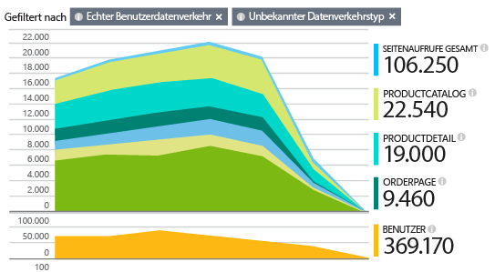

Wenn Sie bereits Servertelemetrie für Ihre [ASP.NET][greenbrown]- oder [Java][java]-Web-App eingerichtet haben, erhalten Sie einen Überblick sowohl aus der Sicht des Clients als auch aus der des Servers. Die beiden Datenströme werden in das Application Insights-Portal integriert.

## Erstellen einer Application Insights-Ressource

Daten zur Leistung und Nutzung Ihrer Seite werden in der Application Insights-Ressource angezeigt. (Wenn Sie bereits eine Ressource erstellt haben, um beispielsweise Daten von Ihrem Webserver zu erfassen, überspringen Sie diesen Schritt.)

Erstellen Sie im [Azure-Portal](http://portal.azure.com) eine neue Application Insights-Ressource:

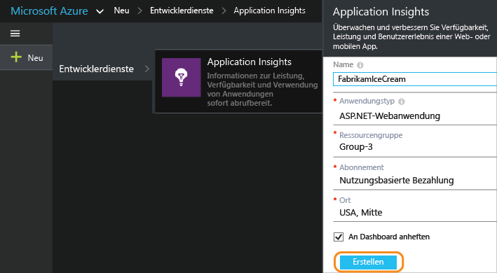

*Schon Fragen?* [Weitere Informationen zum Erstellen einer Ressource][new].

## Hinzufügen des SDK-Skripts zu Ihrer App oder Ihren Webseiten

Rufen Sie im Schnellstart das Skript für Webseiten ab:

Fügen Sie das Skript direkt vor dem &lt;/head&gt;-Tag jeder Seite ein, die Sie nachverfolgen möchten. Wenn Ihre Website über eine Masterseite verfügt, können Sie das Skript dort ablegen. Beispiel:

* In einem ASP.NET MVC-Projekt würden Sie es unter "View\\Shared\\\_Layout.cshtml" ablegen.
* Öffnen Sie in einer SharePoint-Website in der Systemsteuerung [Websiteeinstellungen / Masterseite](app-insights-sharepoint.md).

Das Skript enthält den Instrumentationsschlüssel, der die Daten an Ihre Application Insights-Ressource leitet.

*(Wenn Sie ein bekanntes Webseitenframework verwenden, suchen Sie nach Application Insights-Adaptern. Beispielsweise gibt es [ein AngularJS-Modul](http://ngmodules.org/modules/angular-appinsights).)*

 
## Ausführen Ihrer App

Führen Sie die Web-App aus, verwenden Sie sie eine Weile, um Telemetrie zu generieren, und warten Sie einige Sekunden. Sie können sie entweder durch Drücken von F5 auf dem Entwicklungscomputer ausführen, oder Sie können sie veröffentlichen und von Benutzern ausprobieren lassen.

Wenn Sie die Telemetrie, die von einer Web-App an Application Insights gesendet wird, prüfen möchten, verwenden Sie dazu die Debugtools Ihres Browsers (F12 auf vielen Browsern). Daten werden an "dc.services.visualstudio.com" gesendet.

## Untersuchen Ihrer Daten

Im Blatt mit der Anwendungsübersicht befindet sich im oberen Bereich ein Diagramm, das die durchschnittliche Zeit für das Laden von Seiten im Browser anzeigt:

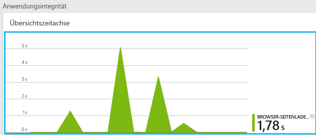

*Noch keine Daten verfügbar? Klicken Sie am oberen Seitenrand auf **Aktualisieren**. Immer noch nichts? Informationen hierzu finden Sie unter [Problembehandlung][qna].*

Klicken Sie auf dieses Diagramm, und Sie erhalten eine ausführlichere Version:

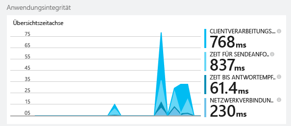

Hierbei handelt es sich um ein gestapeltes Diagramm, das die Gesamtzeit zum Laden der Seite in die [von W3C definierten Standardintervalle](http://www.w3.org/TR/navigation-timing/#processing-model) unterteilt.

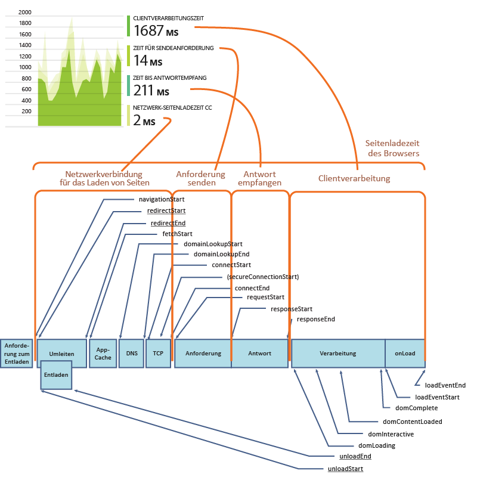

Beachten Sie, dass die Zeit für die *Netzwerkverbindung* in der Regel geringer ist als Sie erwarten würden, da es sich um einen Durchschnittswert über alle Anforderungen vom Browser an den Server handelt. Viele einzelne Anforderungen haben eine Verbindungszeit von 0, da bereits eine aktive Verbindung mit dem Server besteht.

### Leistung nach Seite

Weiter unten auf dem Blatt "Details" finden Sie ein Raster, das nach Seiten-URL segmentiert ist:

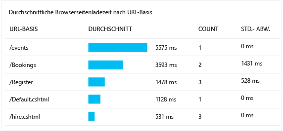

Wenn Sie die Leistung der Seiten im Zeitverlauf anzeigen möchten, doppelklicken Sie auf das Raster, und ändern Sie dessen Diagrammtyp:

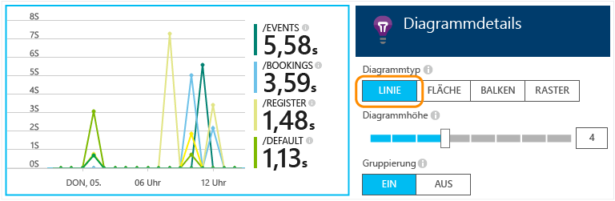

## Übersicht über die Clientnutzung

Klicken Sie auf dem Blatt "Übersicht" auf "Nutzung":

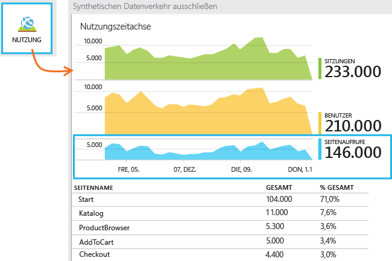

* **Benutzer:** Die Anzahl der unterschiedlichen Benutzer über den Zeitbereich des Diagramms. (Wiederkehrende Benutzer werden mithilfe von Cookies identifiziert.)
* **Sitzungen:** Eine Sitzung wird gezählt, wenn ein Benutzer seit 30 Minuten keine Anforderungen gestellt hat.
* **Seitenaufrufe** Zählt die Anzahl der Aufrufe von trackPageView(), wird in der Regel einmal auf jeder Webseite aufgerufen.

### Für mehr Details durchklicken

Klicken Sie auf ein Diagramm, um weitere Details anzuzeigen. Beachten Sie, dass Sie den Zeitraum der Diagramme ändern können.

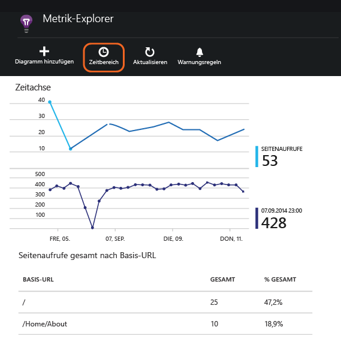

Klicken Sie auf ein Diagramm, um weitere Metriken anzuzeigen, die dargestellt werden können, oder fügen Sie ein neues Diagramm hinzu, und wählen Sie die anzuzeigenden Metriken aus.

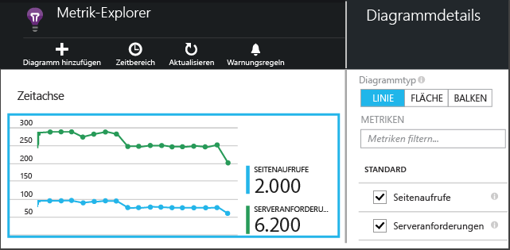

> [AZURE.NOTE]Metriken können nur in einigen Kombinationen angezeigt werden. Wenn Sie eine Metrik auswählen, werden die inkompatiblen deaktiviert.

## Benutzerdefinierte Seitenzähler

Standardmäßig wird jedes Mal ein Seitenzähler angezeigt, wenn eine neue Seite in den Client-Browser geladen wird. Sie möchten jedoch ggf. zusätzliche Seitenaufrufe zählen. Beispielsweise könnte eine Seite in Registerkarten gegliedert sein, und Sie möchten, dass jeder Wechsel von Registerkarten als Aufruf gezählt wird. Auf der Seite könnte auch neuer Inhalt durch JavaScript-Code geladen werden, ohne dass sich die Browser-URL ändert.

Fügen Sie an geeigneter Stelle in Ihren Client-Code einen JavaScript-Aufruf wie diesen ein:

    appInsights.trackPageView(myPageName);

Der Seitenname kann die gleichen Zeichen wie eine URL enthalten, allerdings wird alles nach den Zeichen „#“ oder „?“ ignoriert.

## Überprüfen einzelner Seitenaufruf-Ereignisse

Normalerweise wird die Seitenaufruf-Telemetrie von Application Insights analysiert, und Sie erhalten nur kumulative Berichte, gemittelt über alle Benutzer. Sie können jedoch zu Debugging-Zwecken auch einzelne Seitenaufrufereignisse anzeigen.

Legen Sie im Fenster "Diagnosesuche" als Filter die Einstellung "Seitenansicht" fest.

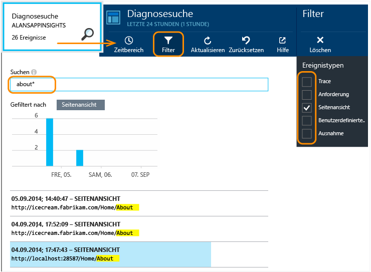

Wählen Sie ein Ereignis, um weitere Details anzuzeigen. Klicken Sie auf der Detailseite auf "...", um weitere Details anzuzeigen.

> [AZURE.NOTE]Beachten Sie bei Verwendung von [Search][diagnostic], dass Sie ganze Wörter suchen müssen: "Info" und "nfo" stimmen nicht mit "Informationen" überein, "Info*" hingegen schon. Ein Suchbegriff darf nicht mit einem Platzhalterzeichen beginnen. Beispielsweise ergibt die Suche nach „*bou“ nicht „About“.

> [Erfahren Sie mehr über Diagnosesuche][diagnostic]

### Eigenschaften von Seitenansichten

* **Dauer der Seitenansicht**: Die Zeit, die das Laden der Seite und das Starten der Ausführung von Skripts dauert. Insbesondere das Intervall vom Beginn des Ladens der Seite bis zur Ausführung von trackPageView. Wenn Sie nach der Initialisierung des Skripts trackPageView von seiner üblichen Position verschoben haben, wird ein anderer Wert wiedergegeben. 

## Benutzerdefinierte Nutzungsverfolgung

Möchten Sie herausfinden, wofür die Benutzer Ihre App verwenden? Durch Einfügen von Aufrufen in den Client- und Servercode können Sie Ihre eigenen Telemetriedaten an Application Insights senden. Beispielsweise können Sie die Anzahl der Benutzer ermitteln, die Aufträge erstellen, ohne sie abzuschließen, oder welche Validierungsfehler am häufigsten auftreten oder was die durchschnittliche Punktzahl in einem Spiel ist.

* [Erhalten Sie weitere Informationen zur API für benutzerdefinierte Ereignisse und Metriken][track].
* [API-Referenz](https://github.com/Microsoft/ApplicationInsights-JS/blob/master/API-reference.md)

## Servertelemetrie

Falls Sie dies noch nicht durchgeführt haben, können Sie Einblicke von Ihrem Server gewinnen und die Daten zusammen mit den clientseitigen Daten anzeigen, damit Sie die Leistung auf dem Server bewerten und Probleme diagnostizieren können.

* [Hinzufügen von Application Insights zu einer ASP.NET-App][greenbrown]
* [Hinzufügen von Application Insights zu einer Java-Web-App][java]

## Video: Nachverfolgen der Nutzung

> [AZURE.VIDEO tracking-usage-with-application-insights]

##  Nächste Schritte

[Nutzungsverfolgung mit benutzerdefinierten Ereignissen und Metriken][track]

<!--Link references-->

[diagnostic]: app-insights-diagnostic-search.md
[greenbrown]: app-insights-start-monitoring-app-health-usage.md
[java]: app-insights-java-get-started.md
[new]: app-insights-create-new-resource.md
[qna]: app-insights-troubleshoot-faq.md
[track]: app-insights-api-custom-events-metrics.md

 

<!---HONumber=August15_HO6-->