<properties 
	pageTitle="Untersuchen von Metriken in Application Insights" 
	description="Interpretieren von Metrik-Explorer-Diagrammen und Anpassen von Metrik-Explorer-Blättern" 
	services="application-insights" 
    documentationCenter=""
	authors="alancameronwills" 
	manager="douge"/>

<tags 
	ms.service="application-insights" 
	ms.workload="tbd" 
	ms.tgt_pltfrm="ibiza" 
	ms.devlang="na" 
	ms.topic="article" 
	ms.date="11/15/2015" 
	ms.author="awills"/>
 
# Untersuchen von Metriken in Application Insights

Metriken in [Application Insights][start] sind gemessene Werte und Anzahlen von Ereignissen, die als Telemetriedaten aus Ihrer Anwendung gesendet werden. Sie dienen zum Erkennen von Leistungsproblemen und Überwachen von Trends bei der Nutzung Ihrer Anwendung. Es gibt eine Vielzahl von Standardmetriken, doch Sie können auch eigene benutzerdefinierte Metriken und Ereignisse erstellen.

Metriken und Ereignisanzahlen werden in Diagrammen aggregierter Werte z. B. als Summen, Mittelwerte oder Zählwerte angezeigt.

Hier sehen Sie ein Beispieldiagramm:

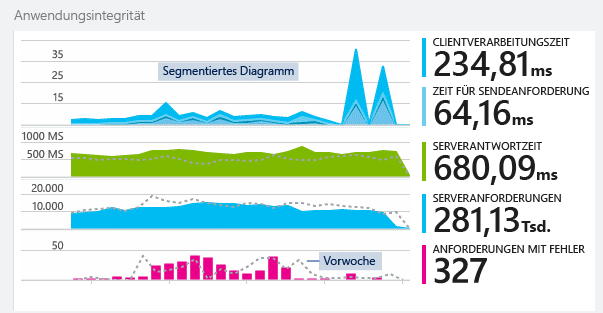

Einige Diagramme sind unterteilt: die Gesamthöhe des Diagramms an einem beliebigen Punkt ist die Summe der gezeigten Metriken. In der Legende werden in der Standardeinstellung die größten Mengen gezeigt.

Gepunktete Linien zeigen den Wert der Metrik eine Woche zuvor.

## Zeitbereich

Sie können den Zeitbereich der Diagramme oder Raster auf jedem Blatt ändern.

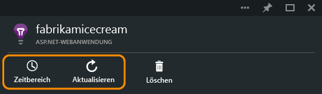

Klicken Sie auf "Aktualisieren", wenn Sie einige Daten erwarten, die noch nicht angezeigt wurden. Diagramme aktualisieren sich regelmäßig selbst, wobei die Intervalle für größere Zeiträume länger sind. Im Freigabemodus kann es eine Weile dauern, bis Daten durch die Analysepipeline in ein Diagramm gelangen.

Um einen Teil des Diagramms zu vergrößern, ziehen Sie die Maus über den gewünschten Bereich, und klicken Sie auf das Lupensymbol:

## Granularität und Punktwerte

Bewegen Sie die Maus über dem Diagramm, um die Werte der Metriken zu diesem Zeitpunkt anzuzeigen.

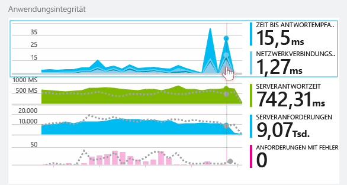

Der Wert der Eigenschaft zu einem bestimmten Zeitpunkt wird über das vorherige Abtastintervall aggregiert.

Das Abtastintervall, auch als „Granularität“ bezeichnet, wird oben auf dem Blatt angezeigt.

Sie können die Granularität auf dem Blatt „Zeitbereich“ anpassen:

Die verfügbaren Granularitäten hängen vom ausgewählten Zeitbereich ab. Die expliziten Granularitäten sind Alternativen für die „automatische“ Granularität für den Zeitbereich.

## Metrik-Explorer

Klicken Sie sich auf dem Blatt "Übersicht" durch ein beliebiges Diagramm, um eine detailliertere Gruppe zusammengehöriger Diagramme und Raster anzuzeigen. Sie können diese Diagramme und Raster bearbeiten, um sich auf die Details zu konzentrieren, die Sie interessieren.

Klicken Sie sich z. B. durch das Diagramm "Anforderungsfehler" der Web-App:

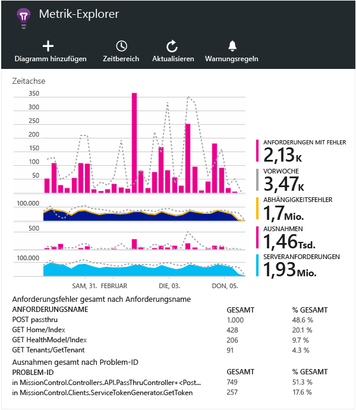

## Was bedeuten die Zahlen?

In der Legende auf der Seite wird standardmäßig der über den Zeitraum des Diagramms aggregierte Wert angezeigt. Wenn Sie auf das Diagramm zeigen, wird der an diesem Punkt befindliche Wert angezeigt.

Jeder Datenpunkt im Diagramm ist ein Aggregat der Datenwerte, die im vorherigen Samplingintervall (Granularität) empfangen wurden. Die Granularität wird oben auf dem Blatt angezeigt und variiert abhängig von der gesamten Zeitskala des Diagramms.

Metriken können auf unterschiedliche Weisen zusammengefasst werden:

 * **Summe** addiert die Werte aller Datenpunkte, die über das Samplingintervall oder den Zeitraum des Diagramms empfangen werden.
 * **Durchschnitt** teilt die Summe durch die Anzahl der Datenpunkte, die während des Intervalls empfangen werden.
 * **Eindeutige** Werte werden verwendet, um Benutzer und Konten zu zählen. Die Abbildung zeigt die Anzahl der verschiedenen Benutzer, die während des Samplingintervalls oder über den Zeitraum des Diagramms gezählt werden.

Sie können die Aggregationsmethode ändern:

Die Standardmethode für die einzelnen Metriken wird bei der Erstellung eines neuen Diagramms angezeigt:

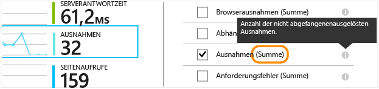

## Bearbeiten von Diagrammen und Rastern

So fügen Sie dem Blatt ein neues Diagramm hinzu:

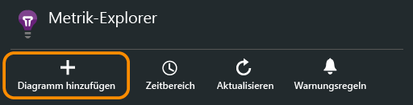

Wählen Sie ein vorhandenes oder neues Diagramm aus, um dessen Anzeige zu bearbeiten:

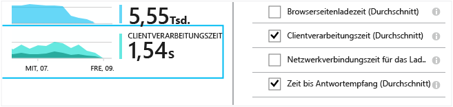

Sie können in einem Diagramm mehr als eine Metrik anzeigen, wenngleich es Einschränkungen bezüglich der Kombinationen gibt, die zusammen angezeigt werden können. Sobald Sie eine Metrik auswählen, werden einige der anderen deaktiviert.

Wenn Sie [benutzerdefinierte Metriken][track] in Ihrer App (Aufrufe von "TrackMetric" und "TrackEvent") programmiert haben, werden sie hier aufgelistet.

## Segmentieren der Daten

Wählen Sie ein Diagramm oder Raster aus, aktivieren Sie das Gruppieren, und wählen Sie eine Eigenschaft, nach der gruppiert werden soll:

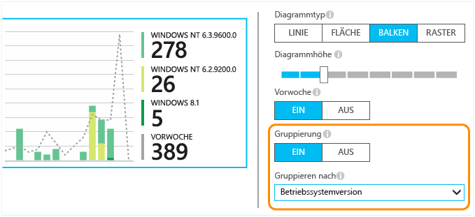

Wenn Sie [benutzerdefinierte Metriken][track] in Ihrer App programmiert haben und diese Eigenschaftswerte enthalten, können Sie die Eigenschaft in der Liste auswählen.

Ist das Diagramm für segmentierte Daten zu klein? Passen Sie die Höhe an:

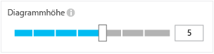

## Filtern der Daten

So zeigen Sie nur die Metriken für eine ausgewählte Gruppe von Eigenschaftswerten an:

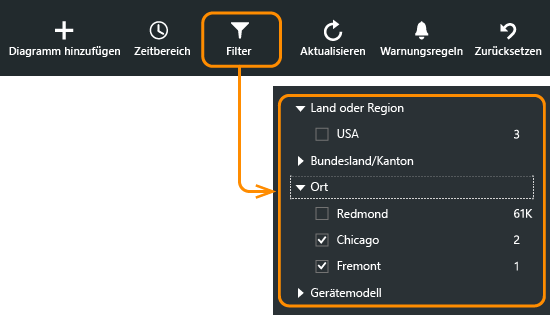

Wenn Sie für eine bestimmte Eigenschaft keine Werte auswählen, entspricht dies der Auswahl aller Werte ohne Angabe von Filtern.

Beachten Sie die Anzahlen von Ereignissen neben jedem Eigenschaftswert. Wenn Sie Werte einer Eigenschaft auswählen, werden neben anderen Eigenschaftswerten die Anzahlen angepasst.

### So fügen Sie der Filterliste Eigenschaften hinzu

Möchten Sie Telemetrie nach einer Kategorie Ihrer Wahl filtern? Möglicherweise unterteilen Sie Ihre Benutzer in verschiedene Kategorien und möchten Ihre Daten nach diesen Kategorien segmentieren.

[Erstellen Sie eine eigene Eigenschaft](app-insights-api-custom-events-metrics.md#properties). Legen Sie sie in einem [Telemetrieinitialisierer](app-insights-api-custom-events-metrics.md#telemetry-initializers) fest, damit sie in allen Telemetrieformen angezeigt wird, einschließlich der von unterschiedlichen SDK-Modulen gesendeten Standardtelemetrie.

## Entfernen von Robot- und Webtest-Datenverkehr

Verwenden Sie den Filter **Realer oder synthetischer Datenverkehr**, und aktivieren Sie **Real**.

Sie können auch nach **Quelle von synthetischem Datenverkehr** filtern.

## Bearbeiten des Diagrammtyps

Beachten Sie insbesondere, dass Sie zwischen Rastern und Diagrammen wechseln können:

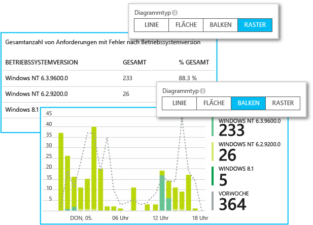

## Speichern des Blatts "Metriken"

Wenn Sie einige Diagramme erstellt haben, speichern Sie sie als Favoriten. Wenn Sie mit einem Organisationskonto arbeiten, können Sie wählen, ob Sie sie für andere Teammitglieder freigeben.

Um das Blatt erneut zu verwenden, **wechseln Sie zum Blatt "Übersicht"** und öffnen "Favoriten":

Wenn Sie beim Speichern den Zeitbereich "Relativ" ausgewählt haben, wird das Fenster mit den neuesten Metriken aktualisiert. Wenn Sie den Zeitraum "Absolut" gewählt haben, werden jedes Mal dieselben Daten gezeigt.

## Zurücksetzen des Blatts

Wenn Sie ein Blatt bearbeiten, aber dann lieber wieder mit den ursprünglich gespeicherten Daten weiterarbeiten möchten, klicken Sie auf "Zurücksetzen".

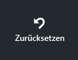

## Festlegen von Benachrichtigungen

Fügen Sie eine Benachrichtigung hinzu, wenn Sie per E-Mail über ungewöhnliche Werte einer beliebigen Metrik informiert werden möchten. Sie können auswählen, ob die E-Mail an die Kontoadministratoren oder an bestimmte E-Mail-Adressen gesendet wird.

[Weitere Informationen zu Warnungen][alerts]

## Exportieren in Excel

Sie können im Metrik-Explorer angezeigte Metrikdaten in eine Excel-Datei exportieren. Die exportierten Daten enthalten Daten aus allen Diagrammen und Tabellen, die im Portal angezeigt werden.

Die Daten jedes Diagramms und jeder Tabelle werden in separate Blätter der Excel-Datei exportiert.

Die Dateien, die Ihnen angezeigt werden, werden exportiert. Ändern Sie den Zeitraum oder die Filter, wenn Sie den zu exportierenden Datenbereich ändern möchten. Wenn bei Tabellen der Befehl **Weitere laden** angezeigt wird, können Sie darauf klicken, bevor Sie auf "Exportieren" klicken, um mehr Daten zu exportieren.

*Der Export funktioniert zurzeit nur mit Internet Explorer und Chrome. Unterstützung für weitere Browser wird in Zukunft verfügbar sein.*

### Fortlaufender Export

Wenn Sie Daten zur externen Verarbeitung fortlaufend exportieren möchten, sollten Sie die Funktion [Fortlaufender Export](app-insights-export-telemetry.md) verwenden.

### Power BI

Wenn Sie umfangreichere Ansichten der Daten wünschen, können Sie sie [nach Power BI exportieren](http://blogs.msdn.com/b/powerbi/archive/2015/11/04/explore-your-application-insights-data-with-power-bi.aspx).

## Nächste Schritte

* [Überwachen der Verwendung mit Application Insights](app-insights-overview-usage.md)
* [Verwenden der Diagnosesuche](app-insights-diagnostic-search.md)

<!--Link references-->

[alerts]: app-insights-alerts.md
[start]: app-insights-overview.md
[track]: app-insights-api-custom-events-metrics.md

 

<!---HONumber=Nov15_HO4-->