<properties
	pageTitle="Diagnostizieren von Leistungsproblemen auf einer ausgeführten IIS-Website | Microsoft Azure"
	description="Überwachen Sie die Leistung einer Website, ohne sie erneut bereitzustellen. Zur eigenständigen Verwendung oder in Verbindung mit dem Application Insights-SDK zum Abrufen von Telemetriedaten zu Abhängigkeiten."
	services="application-insights"
    documentationCenter=".net"
	authors="alancameronwills"
	manager="douge"/>

<tags
	ms.service="application-insights"
	ms.workload="tbd"
	ms.tgt_pltfrm="ibiza"
	ms.devlang="na"
	ms.topic="get-started-article"
	ms.date="03/01/2016"
	ms.author="awills"/>

# Installieren des Application Insights-Statusmonitors zum Überwachen der Websiteleistung

*Application Insights befindet sich in der Vorschau.*

Mit dem Statusmonitor von Visual Studio Application Insights können Sie Ausnahmen und Leistungsprobleme in ASP.NET-Anwendungen diagnostizieren.

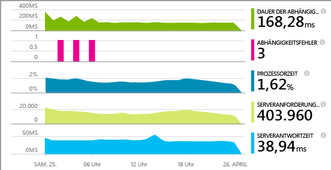

> [AZURE.TIP] Es gibt separate Artikel zum Instrumentieren von [Live-J2EE-Web-Apps](app-insights-java-live.md) und [Azure Cloud Services](app-insights-cloudservices.md).

Bei der Anwendung von Application Insights auf die IIS-Webanwendungen können Sie zwischen drei Möglichkeiten wählen:

* **Buildzeit:** [Fügen Sie Ihrem Web-App-Code das Application Insights-SDK hinzu][greenbrown]. Dadurch erhalten Sie Folgendes:
 * Eine Reihe von Standardtelemetriedaten zur Diagnose und Nutzung.
 * Über die [Application Insights-API][api] können Sie ein eigenes Telemetriemodul zum Nachverfolgen der Nutzung oder zum Diagnostizieren von Problemen schreiben.
* **Laufzeit:** Verwenden Sie den Statusmonitor zum Instrumentieren Ihrer Web-App auf dem Server.
 * Überwachen von Web-Apps, die bereits ausgeführt werden. Es ist nicht erforderlich, sie neu zu erstellen oder erneut zu veröffentlichen.
 * Eine Reihe von Standardtelemetriedaten zur Diagnose und Nutzung.
 * Abhängigkeitsdiagnose – Ermitteln Sie Fehler oder eine schlechte Leistung, wenn Ihre Anwendung andere Komponenten wie z. B. Datenbanken, REST-APIs oder andere Dienste verwendet.
 * Beheben von Problemen mit der Telemetrie.
* **Beides:** Kompilieren Sie das SDK in Ihrem Web-App-Code, und führen Sie den Statusmonitor auf Ihrem Webserver aus. Die Vorteile beider Ansätze:
 * Standardtelemetriedaten zur Diagnose und Nutzung.
 * Abhängigkeitsdiagnose.
 * Mithilfe dieser API können Sie ein benutzerdefiniertes Telemetriemodul schreiben.
 * Beheben von Problemen mit dem SDK und der Telemetrie.

## Installieren des Application Insights-Statusmonitors

Sie benötigen ein [Microsoft Azure](http://azure.com)-Abonnement.

### Wenn Ihre App auf Ihrem IIS-Server ausgeführt wird

1. Melden Sie sich mit Administratorrechten auf Ihrem IIS-Webserver an.
2. Laden Sie den [Statusmonitor-Installer](http://go.microsoft.com/fwlink/?LinkId=506648) herunter, und starten Sie ihn.
4. Melden Sie sich im Installations-Assistenten bei Microsoft Azure an.

    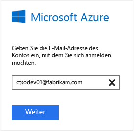

    *Verbindungsfehler? Informationen hierzu finden Sie unter [Problembehandlung](#troubleshooting).*

5. Wählen Sie die installierte Webanwendung oder Website aus, die Sie überwachen möchten, und konfigurieren Sie die Ressource, in der die Ergebnisse im Application Insights-Portal angezeigt werden sollen.

    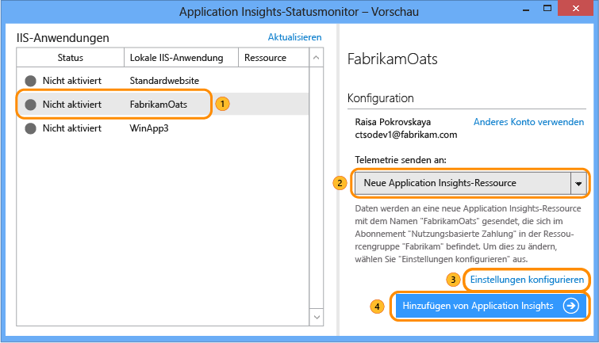

    In der Regel konfigurieren Sie eine neue Ressource und [Ressourcengruppe][roles].

    Sie können andernfalls auch eine vorhandene Ressource verwenden, wenn Sie bereits [Webtests][availability] für Ihre Website oder die [Webclientüberwachung][client] eingerichtet haben.

6. Starten Sie IIS neu.

    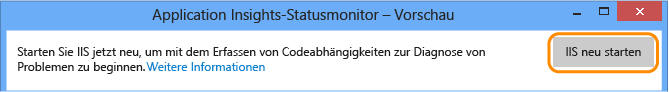

    Der Webdienst wird für kurze Zeit unterbrochen.

6. Beachten Sie, dass die Datei "ApplicationInsights.config" in die Web-Apps eingefügt wurde, die Sie überwachen möchten.

    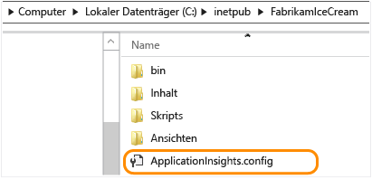

   Außerdem wurden Änderungen an der Datei web.config vorgenommen.

#### Möchten Sie die Konfiguration später ändern?

Nach Abschluss des Assistenten können Sie die Konfiguration des Agenten später jederzeit ändern. Sie können dies auch verwenden, wenn bei der ursprünglichen Einrichtung des Agenten ein Problem aufgetreten ist.

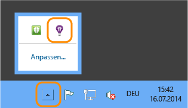

### Wenn Ihre App als Azure-Web-App ausgeführt wird

Fügen Sie in der Systemsteuerung Ihrer Azure-Web-App die Application Insights-Erweiterung hinzu.

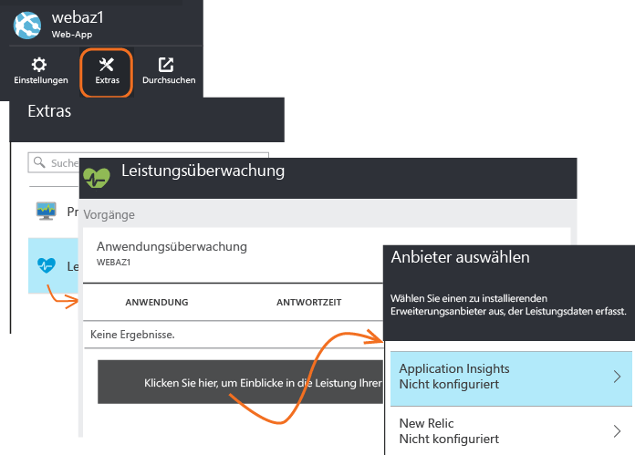

### Wenn es sich um ein Azure-Clouddienstprojekt handelt

[Fügen Sie Web- und Workerrollen Skripts hinzu](app-insights-cloudservices.md).

## Anzeigen von Leistungstelemetriedaten

Melden Sie sich beim [Azure-Portal](https://portal.azure.com) an, navigieren Sie zu Application Insights, und öffnen Sie die zuvor erstellte Ressource.

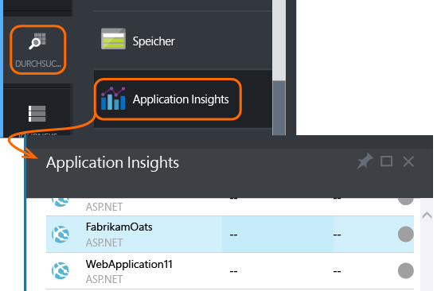

Öffnen Sie das Blatt "Leistung", um die Anforderung, Antwortzeit, Abhängigkeiten und andere Daten anzuzeigen.

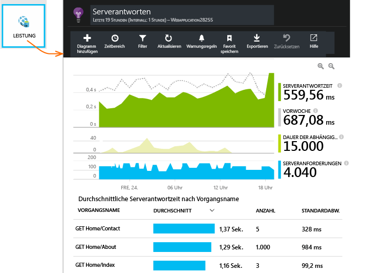

Klicken Sie, um die angezeigten Details anzupassen, oder fügen Sie ein neues Diagramm hinzu.

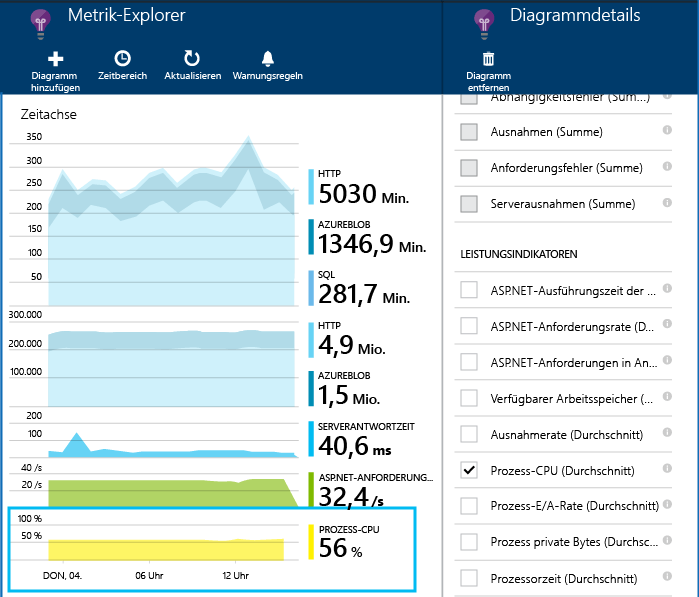

## Abhängigkeiten

Das Diagramm mit der Abhängigkeitsdauer zeigt die Dauer, die Ihre App für Aufrufe externer Komponenten (z. B. Datenbanken, REST-APIs oder Azure-BLOB-Speicher) benötigt.

Um das Diagramm nach Aufrufen verschiedener Abhängigkeiten zu segmentieren, wählen Sie das Diagramm aus, aktivieren "Gruppierung" und wählen dann "Abhängigkeit", "Abhängigkeitstyp" oder "Abhängigkeitsleistung" aus.

Sie können das Diagramm auch filtern, um eine Abhängigkeit, einen Typ oder einen Leistungsbucket zu untersuchen. Klicken Sie auf "Filter".

## Leistungsindikatoren

(Nicht für Azure-Web-Apps.) Klicken Sie auf dem Übersichtsblatt auf "Server", um die Diagramme von Serverleistungsindikatoren wie CPU- und Speicherauslastung anzuzeigen.

Fügen Sie ein neues Diagramm hinzu, oder klicken Sie auf ein beliebiges Diagramm, um die Anzeige zu ändern.

Sie können auch die [Leistungsindikatoren ändern, die vom SDK gemeldet werden](app-insights-configuration-with-applicationinsights-config.md#nuget-package-3).

## Ausnahmen

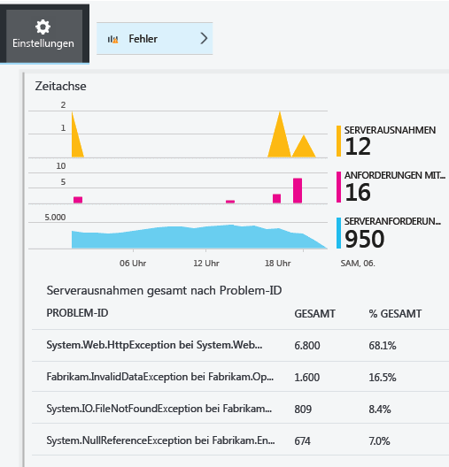

Sie können Detailinformationen zu bestimmten Ausnahmen (der letzten sieben Tage) anzeigen sowie Stapelüberwachung und Kontextdaten abrufen.

## Stichproben

Wenn Ihre Anwendung eine große Menge von Daten sendet und Sie das Application Insights-SDK für ASP.NET Version 2.0.0-beta3 oder höher verwenden, wird möglicherweise die adaptive Stichprobenerstellung verwendet, bei der nur ein bestimmter Prozentsatz der Telemetriedaten übermittelt wird. [Erfahren Sie mehr über das Erstellen von Stichproben.](app-insights-sampling.md)

## Problembehandlung

### Verbindungsfehler

Sie müssen einige ausgehende Ports in der Firewall des Servers öffnen, damit der Statusmonitor funktioniert:

+ Telemetrie – die folgenden sind jederzeit erforderlich:
 +	`dc.services.visualstudio.com:80`
 +	`dc.services.visualstudio.com:443`
 +	`dc.applicationinsights.microsoft.com`
+ Konfiguration – nur erforderlich, wenn Änderungen vorgenommen werden:
 -	`management.core.windows.net:443`
 -	`management.azure.com:443`
 -	`login.windows.net:443`
 -	`login.microsoftonline.com:443`
 -	`secure.addcdn.microsoftonline-p.com:443`
 -	`auth.gfx.ms:443`
 -	`login.live.com:443`
+ Installation:
 +	`packages.nuget.org:443`
 +	`appinsightsstatusmonitor.blob.core.windows.net:80`

Diese Liste kann sich von Zeit zu Zeit ändern.

### Keine Telemetriedaten?

  * Verwenden Sie Ihre Website, um einige Daten zu generieren.
  * Warten Sie einige Minuten, bis die Daten empfangen wurden, und klicken Sie dann auf **Aktualisieren**.
  * Öffnen Sie die "Diagnosesuche" (die Kachel "Search"), um einzelne Ereignisse anzuzeigen. Ereignisse werden häufig in der Diagnosesuche angezeigt, bevor Aggregatdaten in den Diagrammen dargestellt werden.
  * Öffnen Sie den Statusmonitor, und wählen Sie Ihre Anwendung auf der linken Seite aus. Prüfen Sie, ob für diese Anwendung Diagnosemeldungen im Abschnitt mit den Konfigurationsbenachrichtigungen vorliegen:

  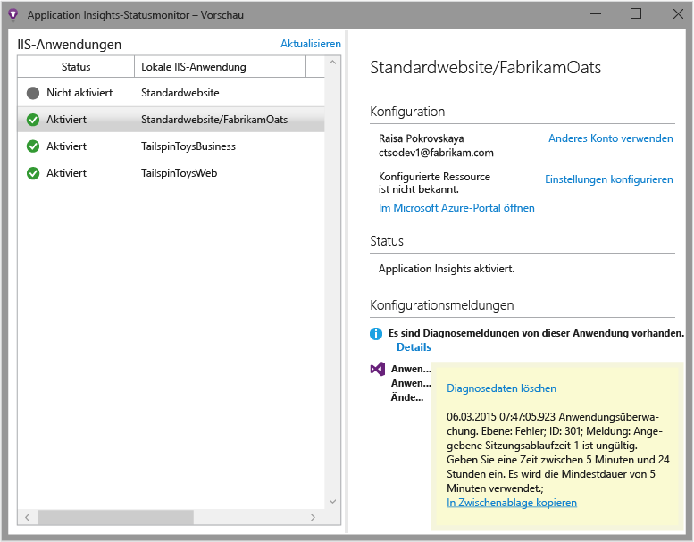

  * Stellen Sie sicher, dass die Firewall Ihres Servers ausgehenden Datenverkehr an die oben aufgeführten Ports erlaubt.
  * Wenn auf dem Server eine Meldung über "unzureichende Berechtigungen" angezeigt wird, versuchen Sie Folgendes:
    * Wählen Sie in IIS-Manager Ihren Anwendungspool aus, öffnen Sie **Erweiterte Einstellungen**, und überprüfen Sie die Identität unter **Prozessmodell**.
    * Fügen Sie in der Systemsteuerung "Computerverwaltung" diese Identität der Gruppe "Systemmonitorbenutzer" hinzu.
  * Wenn Sie MMA/SCOM auf Ihrem Server installiert haben, können einige Versionen in Konflikt stehen. Deinstallieren Sie sowohl SCOM als auch den Statusmonitor, und installieren Sie die neuesten Versionen.
  * Informationen hierzu finden Sie unter [Problembehandlung][qna].

## Systemanforderungen

Betriebssystemunterstützung für den Application Insights-Statusmonitor auf dem Server:

- Windows Server 2008
- Windows Server 2008 R2
- Windows Server 2012
- Windows Server 2012 R2

mit den neuesten Service Packs und .NET Framework 4.0 und 4.5

Auf der Clientseite: Windows 7, 8 und 8.1, ebenfalls mit .NET Framework 4.0 und 4.5

IIS-Unterstützung: IIS 7, 7.5, 8, 8.5 (IIS ist erforderlich)

## Nächste Schritte

* [Erstellen Sie Webtests][availability], um sicherzustellen, dass Ihre Website live bleibt.
* [Durchsuchen Sie Ereignisse und Protokolle][diagnostic], um Probleme besser zu diagnostizieren.
* [Fügen Sie Webclienttelemetrie hinzu][usage], um Ausnahmen von Webseitencode anzuzeigen und Ablaufverfolgungsaufrufe einfügen zu können.
* [Fügen Sie Ihrem Webdienstcode das Application Insights-SDK hinzu][greenbrown], damit Sie die Ablaufverfolgungs- und Protokollaufrufe im Servercode einfügen können.

## Video

#### Leistungsüberwachung

[AZURE.VIDEO app-insights-performance-monitoring]

<!--Link references-->

[api]: app-insights-api-custom-events-metrics.md
[availability]: app-insights-monitor-web-app-availability.md
[client]: app-insights-javascript.md
[diagnostic]: app-insights-diagnostic-search.md
[greenbrown]: app-insights-asp-net.md
[qna]: app-insights-troubleshoot-faq.md
[roles]: app-insights-resources-roles-access-control.md
[usage]: app-insights-web-track-usage.md

<!---HONumber=AcomDC_0302_2016-->