<properties
	pageTitle="Verwendungsanalyse mit Application Insights"
	description="Übersicht über die Verwendungsanalyse mit Application Insights"
	services="application-insights"
    documentationCenter=""
	authors="alancameronwills"
	manager="douge"/>

<tags
	ms.service="application-insights"
	ms.workload="tbd"
	ms.tgt_pltfrm="ibiza"
	ms.devlang="multiple"
	ms.topic="article" 
	ms.date="08/06/2015"
	ms.author="awills"/>

# Verwendungsanalyse mit Application Insights

Wenn Sie wissen, wie Benutzer Ihre Anwendung verwenden, können Sie Ihre Entwicklungsarbeit auf die Szenarien konzentrieren, die für sie am wichtigsten sind. Außerdem verschaffen Sie sich Einsichten in die Ziele, die für sie einfacher oder schwieriger zu erreichen sind.

Application Insights kann Ihnen ein klares Bild der Nutzung Ihrer Anwendung bieten und Sie dabei unterstützen, die Benutzererfahrung zu verbessern und Ihre geschäftlichen Ziele zu erreichen.

Application Insights funktioniert sowohl für eigenständige Apps \(unter iOS, Android und Windows\) als auch für \(in .NET oder J2EE gehostete\) Web-Apps.

## Hinzufügen von Application Insights zu Ihrem Projekt

Zum Einstieg benötigen Sie ein [Microsoft Azure-Abonnement](https://azure.com). \(Es gibt eine kostenlose Testversion. Nach Ablauf des Testzeitraums können Sie den Tarif "Free" des Diensts weiter nutzen.\)

Erstellen Sie im [Azure-Portal](https://portal.azure.com) eine Application Insights-Ressource. Dort werden Leistungs- und Nutzungsdaten zu Ihrer App angezeigt.

**Wenn Ihre App eine Geräte-App ist**, fügen Sie Ihrem Projekt das Application Insights SDK hinzu. Das genaue Verfahren variiert je nach [IDE und Plattform](app-insights-platforms.md). Klicken Sie für Windows-Apps in Visual Studio mit der rechten Maustaste auf das Projekt, und wählen Sie "Application Insights hinzufügen" aus.

**Wenn es sich um eine Web-App handelt**, öffnen Sie das Blatt "Schnellstart", und rufen Sie den Codeausschnitt ab, der Ihren Webseiten hinzugefügt werden soll. Veröffentlichen Sie sie mit diesen Ausschnitt neu.

Sie können Application Insights auch Ihrem [ASP.NET](app-insights-start-monitoring-app-health-usage.md)- oder [J2EE](app-insights-java-get-started.md)- Servercode hinzufügen, um Telemetriedaten von Client und Server zu kombinieren.

### Ausführen Ihres Projekts und Anzeigen erster Ergebnisse

Führen Sie das Projekt einige Minuten im Debugmodus aus, wechseln Sie dann zum [Azure-Portal](http://portal.azure.com), und navigieren Sie in Application Insights zu Ihren Projektressourcen.

Veröffentlichen Sie Ihre App, um weitere Telemetriedaten zu erhalten, und finden Sie heraus, was Ihre Benutzer mit Ihrer App tun.

## Analysen ohne Konfigurationsaufwand

Klicken Sie auf die Kachel "Seitenaufrufe", um Verwendungsdetails einzublenden.

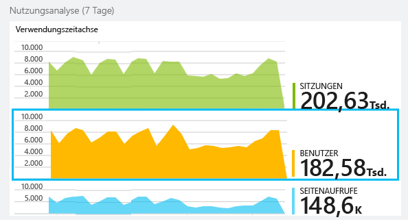

Bewegen Sie den Mauszeiger im dem leeren Bereich über einem Diagramm, um die Anzahlen an einem bestimmten Punkt anzuzeigen. Andernfalls weisen die Zahlen den Wert aus, der über den Zeitraum aggregiert wurde, z. B. einen Mittelwert, eine Summe oder Anzahl eindeutiger Benutzer im jeweiligen Zeitraum.

In Webanwendungen werden Benutzer mithilfe von Cookies gezählt. Eine Person, die mehrere Browser nutzt, Cookies löscht oder die Datenschutzfunktion nutzt, wird mehrere Male gezählt.

Eine Web-Sitzung wird nach 30 Minuten Inaktivität gezählt. Eine Sitzung auf einem Telefon oder anderem Gerät wird gezählt, wenn die App mehr als ein paar Sekunden lang angehalten wird.

Klicken Sie sich durch ein beliebiges Diagramm, um weitere Details anzuzeigen. Zum Beispiel:

\(Dieses Beispiel gehört zu einer Website, aber die Diagramme sind ähnlich für Apps, die auf Geräten ausgeführt werden.\)

Führen Sie einen Vergleich mit der Vorwoche durch, um zu prüfen, ob sich etwas geändert hat:

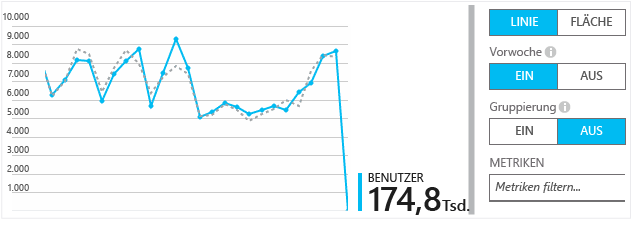

Vergleichen Sie zwei Metriken, z. B. Benutzer und neue Benutzer:

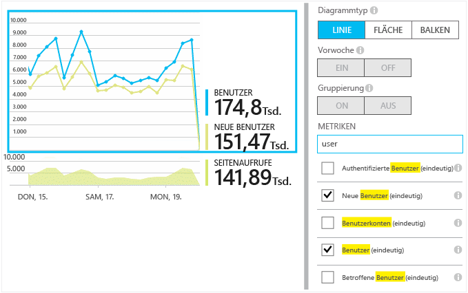

Gruppieren \(Segmentieren\) Sie Daten anhand einer Eigenschaft, z. B. Browser, Betriebssystem oder Ort:

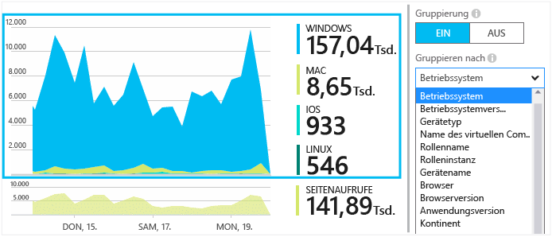

## Seitennutzung

Klicken Sie auf die Kachel "Seitenaufrufe", um eine Aufschlüsselung der beliebtesten Seiten zu erhalten:

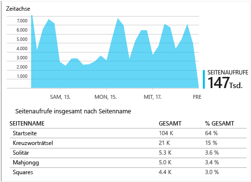

Das vorherige Beispiel gehört zu einer Spielewebsite. Daraus geht Folgendes unmittelbar hervor:

* Die Nutzung hat sich in der Vorwoche nicht erhöht. Vielleicht sollten wir über eine Suchmaschinenoptimierung nachdenken?
* Die Seite mit den Spielen wird von viel weniger Leuten als die Homepage aufgerufen. Warum regt unsere Homepage die Leute nicht zum Spielen an?
* "Crossword" ist das beliebteste Spiel. Wir sollten neue Ideen und Verbesserungen hier Priorität geben.

## Benutzerdefinierte Nachverfolgung

Lassen Sie uns einmal Folgendes annehmen. Anstatt jedes Spiel in einer eigenen Webseite zu implementieren, gestalten Sie den Code so um, dass alle in der App auf einer Seite angezeigt werden, wobei der Großteil der Funktionalität als JavaScript in die Website programmiert wird. Dies ermöglicht Benutzern ein schnelles Wechseln zwischen Spielen oder sogar die Anzeige mehrerer Spiele auf einer Seite.

Aber dennoch soll Application Insights weiter protokollieren, wie oft jedes Spiel geöffnet wird, und zwar auf dieselbe Weise wie bei den getrennten Webseiten. Das ist ganz einfach: Fügen Sie einfach in Ihr JavaScript einen Aufruf des Telemetriemoduls an der Stelle ein, an der aufgezeichnet werden soll, dass eine neue Seite geöffnet wurde:

	telemetryClient.trackPageView(game.Name);

## Benutzerdefinierte Ereignisse

Sie können Telemetrie in vielerlei Hinsicht nutzen, um zu verstehen, wie Ihre Anwendung verwendet wird. Aber Sie möchten nicht immer die Nachrichten mit Seitenaufrufen durcheinanderbringen. Verwenden Sie stattdessen benutzerdefinierte Ereignisse. Sie können diese von Geräte-Apps, Webseiten oder einem Webserver senden:

\(JavaScript\)

    telemetryClient.trackEvent("GameEnd");

\(C\#\)

    var tc = new Microsoft.ApplicationInsights.TelemetryClient();
    tc.TrackEvent("GameEnd");

\(VB\)

    Dim tc = New Microsoft.ApplicationInsights.TelemetryClient()
    tc.TrackEvent("GameEnd")

Die häufigsten benutzerdefinierten Ereignisse werden auf dem Blatt "Übersicht" aufgeführt.

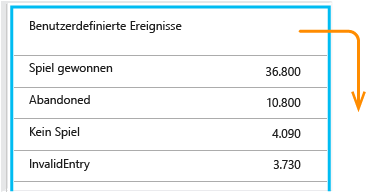

Klicken Sie auf die Kopfzeile der Tabelle, um die Gesamtanzahl von Ereignissen anzuzeigen. Sie können das Diagramm anhand verschiedener Attribute wie z. B. des Ereignisnamens segmentieren:

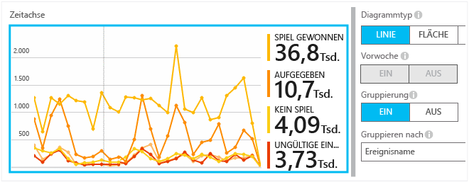

Das besonders Nützliche an Zeitachsen ist, dass Sie Änderungen mit anderen Metriken und Ereignissen in Beziehung setzen können. Zu Zeiten, in denen mehr Spiele gespielt werden, erwarten Sie z. B. auch einen Anstieg abgebrochener Spiele. Aber wenn der Anstieg abgebrochener Spiele unverhältnismäßig ist, möchten Sie herausfinden, ob die hohe Auslastung Probleme verursacht, die Benutzer nicht akzeptabel finden.

## Detailsuche bei bestimmten Ereignissen

Um besser zu verstehen, wie eine typische Sitzung abläuft, wechselt zu erhalten, wird empfohlen, sich auf eine bestimmte Benutzersitzung konzentrieren, die einen bestimmten Typ von Ereignis aufweist.

Bei diesem Beispiel haben wir das benutzerdefinierte Ereignis "NoGame" programmiert, das aufgerufen wird, wenn sich der Benutzer abmeldet, ohne tatsächlich ein Spiel gestartet zu haben. Warum würde ein Benutzer das tun? Wenn wir einige bestimmte Vorkommen analysieren, erhalten wir vielleicht einen Hinweis.

Die von der App empfangenen benutzerdefinierten Ereignisse sind anhand des Namens auf dem Blatt "Übersicht" aufgeführt:

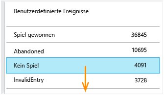

Klicken Sie sich durch das Ereignis von Interesse, und wählen Sie ein aktuelles spezifisches Vorkommen aus:

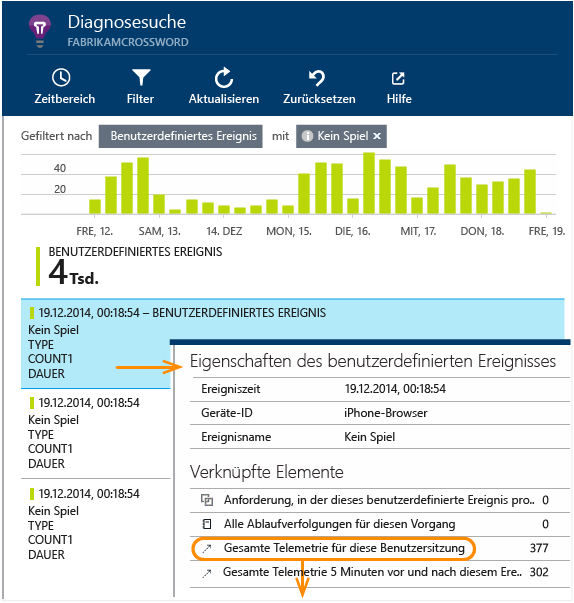

Lassen Sie uns nun alle Telemetriedaten für die Sitzung anschauen, in der dieses bestimmte "NoGame"-Ereignis aufgetreten ist.

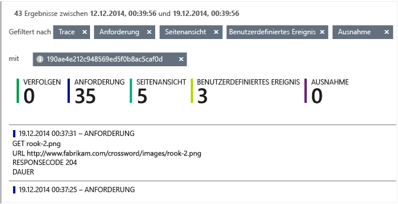

Es gab keine Ausnahmen, sodass der Benutzer nicht durch einen Fehler am Spielen gehindert wurde.

Wir können bis auf Seitenaufrufe alle Arten von Telemetriedaten für diese Sitzung herausfiltern:

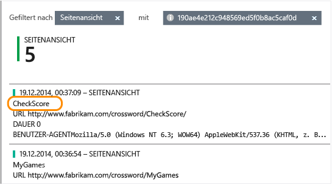

Jetzt können wir erkennen, dass sich dieser Benutzer nur angemeldet, um die neuesten Punktstände zu überprüfen. Vielleicht sollten wir eine User Story entwickeln, die dies vereinfacht. \(Und wir sollten ein benutzerdefiniertes Ereignis implementieren, das meldet, wenn diese bestimmte User Story auftritt.\)

## Filtern, Suchen und Segmentieren der Daten mit Eigenschaften
Sie können beliebige Tags und numerische Werte an Ereignisse anfügen.

JavaScript auf Client

    appInsights.trackEvent("WinGame",
        // String properties:
        {Game: currentGame.name, Difficulty: currentGame.difficulty},
        // Numeric measurements:
        {Score: currentGame.score, Opponents: currentGame.opponentCount}
    );

C\# auf Server

    // Set up some properties:
    var properties = new Dictionary <string, string>
        {{"game", currentGame.Name}, {"difficulty", currentGame.Difficulty}};
    var measurements = new Dictionary <string, double>
        {{"Score", currentGame.Score}, {"Opponents", currentGame.OpponentCount}};

    // Send the event:
    telemetry.TrackEvent("WinGame", properties, measurements);

VB auf Server

    ' Set up some properties:
    Dim properties = New Dictionary (Of String, String)
    properties.Add("game", currentGame.Name)
    properties.Add("difficulty", currentGame.Difficulty)

    Dim measurements = New Dictionary (Of String, Double)
    measurements.Add("Score", currentGame.Score)
    measurements.Add("Opponents", currentGame.OpponentCount)

    ' Send the event:
    telemetry.TrackEvent("WinGame", properties, measurements)

Fügen Sie Eigenschaften an Seitenaufrufe auf die gleiche Weise an:

JavaScript auf Client

    appInsights.trackPageView("Win",
        {Game: currentGame.Name},
        {Score: currentGame.Score});

Zeigen Sie auf dem Blatt "Diagnosesuche" die Eigenschaften an, indem Sie sich durch ein einzelnes Vorkommen eines Ereignisses klicken.

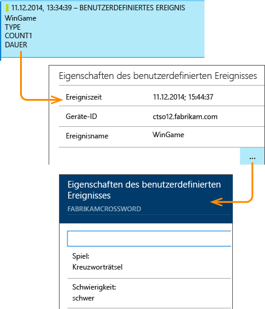

Verwenden Sie das Suchfeld, um Ereignisvorkommen mit einem bestimmten Eigenschaftswert anzuzeigen.

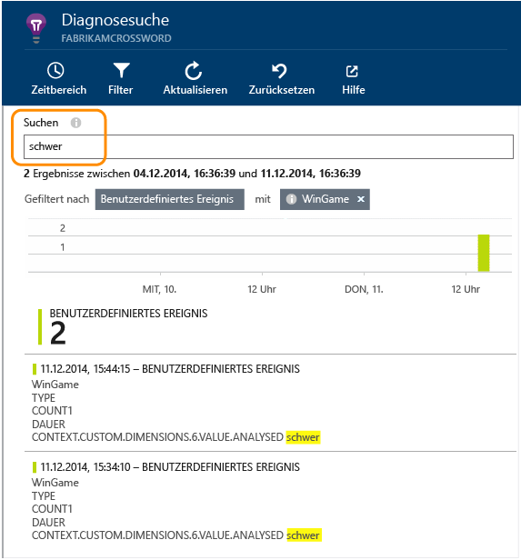

## A-B-Tests

Wenn Sie nicht wissen, welche Variante eines Features erfolgreicher sein wird, veröffentlichten Sie beide, und ermöglichen Sie verschiedenen Benutzern den Zugriff darauf. Messen Sie den jeweiligen Erfolg, und erstellen Sie anschließend eine vereinheitlichte Version.

Für dieses Verfahren fügen Sie unterschiedliche Tags an alle Telemetriedaten an, die von jeder Version Ihrer App gesendet wird. Dazu definieren Sie Eigenschaften im aktiven "TelemetryContext"-Element. Diese Standardeigenschaften werden jeder Telemetrienachricht hinzugefügt, die die Anwendung sendet, nicht nur Ihren benutzerdefinierten Nachrichten, sondern auch den Standardtelemetriedaten.

Im Application Insights-Portal können Sie anschließend Ihre Daten anhand der Tags filtern und gruppieren \(segmentieren\), um die verschiedenen Versionen zu vergleichen.

C\# auf Server

    using Microsoft.ApplicationInsights.DataContracts;

    var context = new TelemetryContext();
    context.Properties["Game"] = currentGame.Name;
    var telemetry = new TelemetryClient(context);
    // Now all telemetry will automatically be sent with the context property:
    telemetry.TrackEvent("WinGame");

VB auf Server

    Dim context = New TelemetryContext
    context.Properties("Game") = currentGame.Name
    Dim telemetry = New TelemetryClient(context)
    ' Now all telemetry will automatically be sent with the context property:
    telemetry.TrackEvent("WinGame")

Einzelne Telemetriedaten können die Standardwerte außer Kraft setzen.

Sie können einen universellen Initialisierer einrichten, damit alle neuen "TelemetryClient"-Elemente automatisch Ihren Kontext verwenden.

    // Telemetry initializer class
    public class MyTelemetryInitializer : IContextInitializer
    {
        public void Initialize (TelemetryContext context)
        {
            context.Properties["AppVersion"] = "v2.1";
        }
    }

Gehen Sie im App-Initialisierer wie z. B. "Global.asax.cs" so vor:

    protected void Application_Start()
    {
        // ...
        TelemetryConfiguration.Active.ContextInitializers
        .Add(new MyTelemetryInitializer());
    }

## Erstellen – Messen – Lernen

Wenn Sie mit Analysen arbeiten, werden diese zu einem integrierten Bestandteil Ihres Entwicklungszyklus und nicht bloß zu etwas, an das Sie denken, wenn es gilt, Probleme zu lösen. Hier einige Tipps:

* Bestimmen Sie die wichtigste Metrik Ihrer Anwendung. Wünschen Sie sich so viele Benutzer wie möglich oder lieber eine kleine Gruppe sehr zufriedener Benutzer? Möchten Sie Websitebesuche oder den Umsatz maximieren?
* Planen Sie eine Messung für jede User Story. Wenn Sie eine neue User Story oder Funktion entwerfen oder eine vorhandene aktualisieren wollen, denken Sie stets daran, wie Sie den Erfolg der Änderung messen möchten. Fragen Sie sich vor Beginn der Programmierung "Welche Auswirkungen hat dies auf unsere Metriken, wenn es funktioniert? Sollten wir neue Ereignisse nachverfolgen?" Und wenn das Feature dann online ist, sehen Sie sich die Analyse an, und reagieren Sie auf die Ergebnisse.
* Setzen Sie die anderen Metriken in Beziehung zur Hauptmetrik. Wenn Sie z. B. das Feature "Favoriten" hinzufügen, möchten Sie bestimmt wissen, wie oft Benutzer Favoriten hinzufügen. Aber vielleicht ist es noch interessanter zu wissen, wie oft sie zu ihren Favoriten zurückkehren. Und am wichtigsten ist, ob Benutzer, die Favoriten nutzen, letztendlich mehr von Ihrem Produkt kaufen.
* Testen Sie mit begrenzten Benutzergruppen. Richten Sie einen Feature-Umschalter ein, der es Ihnen ermöglicht, ein neues Feature nur für einige Benutzer sichtbar zu machen. Verwenden Sie Application Insights, um festzustellen, ob das neue Feature so wie vorgesehen genutzt wird. Nehmen Sie Anpassungen vor, und veröffentlichen Sie es für ein breiteres Publikum.
* Sprechen Sie Ihre Benutzer an! Analysen allein genügen nicht, sondern dienen zur Aufrechterhaltung einer guten Kundenbeziehung.

## Weitere Informationen

* [Erkennung, Eingrenzung und Diagnose von Abstürzen und Leistungsproblemen in Ihrer App](app-insights-detect-triage-diagnose.md)
* [Erste Schritte mit Application Insights auf vielen Plattformen](app-insights-detect-triage-diagnose.md)

## Video

> [AZURE.VIDEO usage-monitoring-application-insights]

<!--Link references-->

[start]: app-insights-get-started.md
 

<!---HONumber=August15_HO7-->