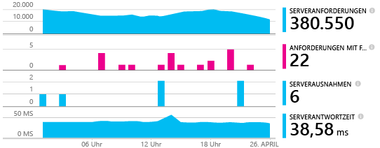
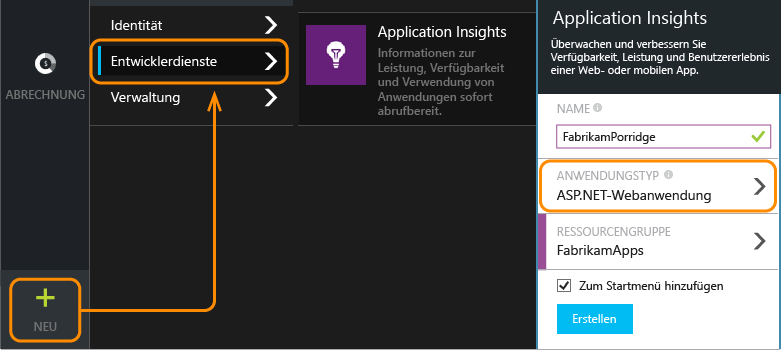
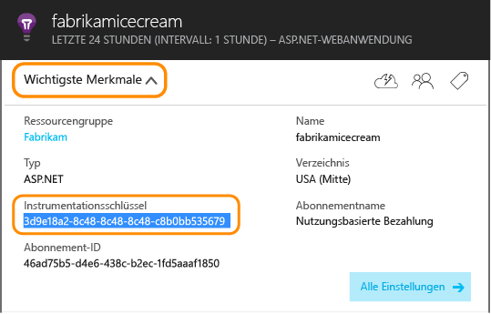
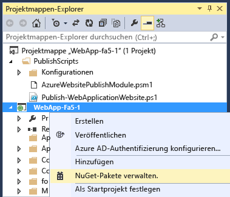
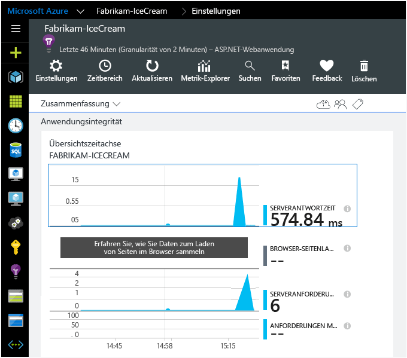

<properties 
	pageTitle="Hinzufügen des Application Insights SDK zur Überwachung der ASP.NET-App" 
	description="Analysieren Sie die Auslastung, Verfügbarkeit und Leistung Ihrer lokalen oder Microsoft Azure-Webanwendung mit Application Insights." 
	services="application-insights" 
    documentationCenter=".net"
	authors="alancameronwills" 
	manager="ronmart"/>

<tags 
	ms.service="application-insights" 
	ms.workload="tbd" 
	ms.tgt_pltfrm="ibiza" 
	ms.devlang="na" 
	ms.topic="article" 
	ms.date="05/21/2015" 
	ms.author="awills"/>

# Hinzufügen des Application Insights SDK zur Überwachung der ASP.NET-App

*Application Insights befindet sich in der Vorschau.*

[AZURE.INCLUDE [app-insights-selector-get-started](../../includes/app-insights-selector-get-started.md)]

Visual Studio Application Insights überwacht Ihre Live-Anwendung. So können Sie [Leistungsprobleme und -ausnahmen erkennen und diagnostizieren][detect] und zudem [ermitteln, wie Ihre App verwendet wird][knowUsers]. Es kann mit einer Vielzahl von Anwendungstypen verwendet werden. Dies funktioniert für apps, die auf Ihren eigenen lokalen IIS-Servern oder auf Azure Virtual Machines gehostet werden, sowie Azure Web-apps. ([Dies funktioniert auch für Geräte-Apps und Java-Server][start].)

Bei vielen Anwendungstypen [kann Visual Studio fast unbemerkt Application Insights Ihrer App hinzufügen](#ide). Aber da Sie diesen Artikel lesen, um besser zu verstehen, was passiert, werden wir diese Schritte manuell durchlaufen.

#### Vorbereitung

Erforderlich:

* Ein Abonnement für [Microsoft Azure](http://azure.com) Wenn Ihr Team oder Ihre Organisation über ein Azure-Abonnement verfügt, kann der Besitzer Sie mit Ihrem [Microsoft-Konto](http://live.com) hinzufügen.
* Visual Studio 2013 oder höher

##  1. Erstellen einer Application Insights-Ressource

Melden Sie sich beim [Azure-Portal][portal] an, und erstellen Sie eine neue Application Insights-Ressource. Wählen Sie als Anwendungstyp "ASP.NET" aus.

Eine [Ressource][roles] in Azure ist eine Instanz eines Diensts. In dieser Ressource werden Telemetriedaten aus Ihrer App analysiert und Ihnen angezeigt.

Durch Auswahl des Anwendungstyps werden der Standardinhalt der Ressourcenblätter und die im [Metrik-Explorer][metrics] sichtbaren Eigenschaften festgelegt.

####  Erstellen Sie eine Kopie des Instrumentationsschlüssels.

Der Schlüssel identifiziert die Ressource, den Sie bald im SDK installieren können, um die Daten an die Ressource zu leiten.

##  2. Installieren des SDK in Ihrer Anwendung

1. Bearbeiten Sie die NuGet-Pakete Ihres Desktop-App-Projekts in Visual Studio.

    

2. Installieren Sie das Application Insights SDK für Web-Apps.

    

3. Bearbeiten Sie die Datei "ApplicationInsights.config" (die bei der NuGet-Installation hinzugefügt wurde). Fügen Sie Folgendes direkt vor dem Endtag ein:

    `<InstrumentationKey>` *Der kopierte Instrumentationsschlüssel* `</InstrumentationKey>`

    (Alternativ können Sie [den Schlüssel durch Schreiben von Code][apikey] in Ihrer App festlegen.)

##  3. Ausführen des Projekts

Starten Sie Ihre Anwendung mit F5, und probieren Sie es aus: Öffnen Sie verschiedene Seiten, um einige Telemetriedaten zu generieren.

In Visual Studio sehen Sie eine Anzahl der gesendeten Ereignisse.

##  4. Anzeigen der Telemetrie

Kehren Sie zum [Azure-Portal][portal] zurück, und navigieren Sie zur Application Insights-Ressource.

Suchen Sie nach Daten in der Übersichtsdiagrammen. Zuerst sehen Sie lediglich einen oder zwei Punkte. Zum Beispiel:

Klicken Sie sich durch ein beliebiges Diagramm, um ausführlichere Metriken anzuzeigen. [Hier finden Sie weitere Informationen zu Metriken.][perf]

Stellen Sie jetzt Ihre Anwendung bereit, und sehen Sie zu, wie Daten gesammelt werden.

Beim Betrieb im Debugmodus wird Telemetrie über die Pipeline geliefert, sodass Ihnen innerhalb von wenigen Sekunden Daten angezeigt werden. Sobald Sie Ihre Anwendung bereitstellen, sammeln sich die Daten langsamer an.

#### Sie sehen keine Daten?

* Öffnen Sie die Kachel [Suche][diagnostic], um einzelne Ereignisse anzuzeigen.
* Verwenden Sie die Anwendung, und öffnen Sie verschiedene Seiten, damit einige Telemetriedaten generiert werden.
* Warten Sie einige Sekunden, und klicken Sie auf "Aktualisieren".
* Informationen hierzu finden Sie unter [Problembehandlung][qna].

#### Probleme auf dem Buildserver?

Weitere Informationen finden Sie in [diesem Artikel zur Problembehandlung](app-insights-troubleshoot-faq.md#NuGetBuild).

## Abschließen der Installation

Um die vollständige 360-Grad-Ansicht Ihrer Anwendung zu erhalten, sollten Sie einige weitere Schritte durchführen:

* [Fügen Sie Ihren Webseiten das JavaScript SDK hinzu][client], um browserbasierte Telemetriedaten wie Anzahl der Seitenaufrufe, Benutzer und Sitzung, Seitenladezeiten oder Skriptausnahmen zu erhalten und um benutzerdefinierte Telemetrie in Ihre Seitenskripts schreiben zu können.
* Fügen Sie die Abhängigkeitsnachverfolgung hinzu, um Probleme zu diagnostizieren, die durch die von der App verwendeten Datenbanken oder von anderen Komponenten verursacht werden:
 * [in Ihrer Azure-Web-App oder -VM][azure]
 * [auf Ihrem lokalen IIS-Server][redfield]
* [Erfassen Sie Protokoll-Ablaufverfolgungen][netlogs] aus Ihrem bevorzugten Protokollierungsframework
* [Verfolgen Sie benutzerdefinierte Ereignisse und Metriken][api] im Client oder im Server oder beides, um weitere Informationen zur Nutzung Ihrer Anwendung zu erhalten.
* [Richten Sie Webtests ein][availability], um sicherzustellen, dass die Anwendung online und reaktionsfähig bleibt.

## Der automatisierte Weg

Die Einrichtung von Visual Studio ist sehr einfach.

Sie benötigen [Visual Studio 2013 Update 3](http://go.microsoft.com/fwlink/?linkid=397827&clcid=0x409) (oder neuer) und ein Konto in [Microsoft Azure](http://azure.com).

#### Falls es sich um ein neues Projekt handelt ...

Wenn Sie in Visual Studio ein neues Projekt erstellen, achten Sie darauf, dass Application Insights ausgewählt ist.

Visual Studio erstellt eine Ressource in Application Insights, fügt dem Projekt das SDK hinzu und legt den Schlüssel in der `.config`-Datei ab.

Verfügt das Projekt über Webseiten, wird der Master-Webseite auch das [JavaScript-SDK][client] hinzugefügt.

#### … oder falls es sich um ein vorhandenes Projekt handelt

Klicken Sie im Projektmappen-Explorer mit der rechten Maustaste auf das Projekt, und wählen Sie "Application Insights hinzufügen".

Visual Studio erstellt eine Ressource in Application Insights, fügt dem Projekt das SDK hinzu und legt den Schlüssel in der `.config`-Datei ab.

In diesem Fall wird das [JavaScript-SDK][client] nicht Ihren Webseiten hinzugefügt. Es empfiehlt sich, dies als nächsten Schritt durchzuführen.

#### Setupoptionen

Falls Sie erstmals ein Projekt erstellen, werden Sie nach einer Anmeldung bei Microsoft Azure Preview gefragt. (Dies ist nicht zu verwechseln mit Ihrem Visual Studio Online-Konto.)

Wenn diese App Teil einer größeren Anwendung ist, empfiehlt es sich, sie mithilfe von **Einstellungen konfigurieren** in derselben Ressourcengruppe wie die anderen Komponenten abzulegen.

*Keine Option "Application Insights" vorhanden? Stellen Sie sicher, dass Sie Visual Studio 2013 Update 3 oder höher verwenden, dass Application Insights-Tools unter "Erweiterungen und Updates" aktiviert wurden und dass Sie ein Web-Projekt erstellen.*

#### Öffnen Sie Application Insights von Ihrem Projekt aus.

## Video

> [AZURE.VIDEO getting-started-with-application-insights]

<!--Link references-->

[api]: app-insights-api-custom-events-metrics.md
[apikey]: app-insights-api-custom-events-metrics.md#ikey
[availability]: app-insights-monitor-web-app-availability.md
[azure]: ../insights-perf-analytics.md
[client]: app-insights-javascript.md
[detect]: app-insights-detect-triage-diagnose.md
[diagnostic]: app-insights-diagnostic-search.md
[knowUsers]: app-insights-overview-usage.md
[metrics]: app-insights-metrics-explorer.md
[netlogs]: app-insights-asp-net-trace-logs.md
[perf]: app-insights-web-monitor-performance.md
[portal]: http://portal.azure.com/
[qna]: app-insights-troubleshoot-faq.md
[redfield]: app-insights-monitor-performance-live-website-now.md
[roles]: app-insights-resources-roles-access-control.md
[start]: app-insights-get-started.md

 

<!---HONumber=GIT-SubDir_Tue_AM_dede-->