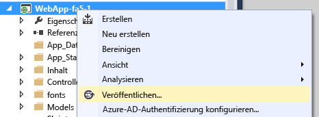
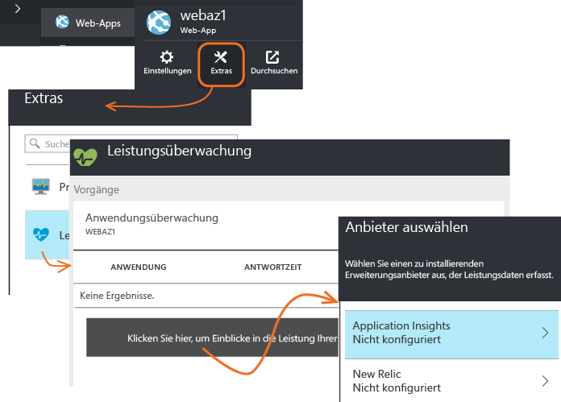
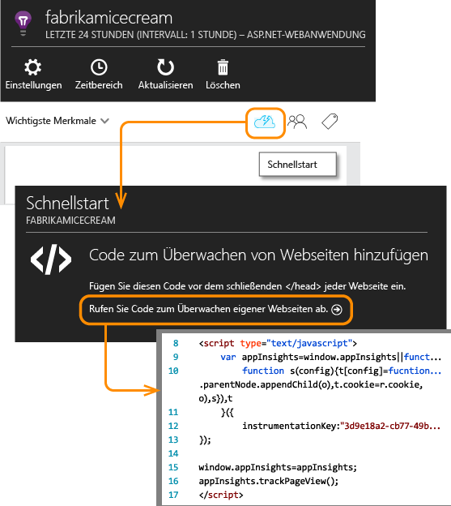

<properties
	pageTitle="Hinzufügen des Application Insights SDK zur Überwachung der ASP.NET-App | Microsoft Azure"
	description="Analysieren Sie die Auslastung, Verfügbarkeit und Leistung Ihrer lokalen oder Microsoft Azure-Webanwendung mit Application Insights."
	services="application-insights"
    documentationCenter=".net"
	authors="alancameronwills"
	manager="douge"/>

<tags
	ms.service="application-insights"
	ms.workload="tbd"
	ms.tgt_pltfrm="ibiza"
	ms.devlang="na"
	ms.topic="get-started-article"
	ms.date="02/04/2016"
	ms.author="awills"/>


# Hinzufügen des Application Insights SDK zur Überwachung der ASP.NET-App

*Application Insights befindet sich in der Vorschau.*

[AZURE.INCLUDE [app-insights-selector-get-started](../../includes/app-insights-selector-get-started.md)]


Visual Studio Application Insights überwacht Ihre Live-Anwendung. So können Sie [Leistungsprobleme und -ausnahmen erkennen und diagnostizieren][detect] und zudem [ermitteln, wie Ihre App verwendet wird][knowUsers]. Es kann mit einer Vielzahl von Anwendungstypen verwendet werden. Dies funktioniert für Apps, die auf den eigenen lokalen IIS-Servern oder Azure-VMs gehostet werden, sowie für Azure-Web-Apps.


*Weitere Informationen:*

* [ASP.NET 5](app-insights-asp-net-five.md)
* [Geräte-Apps und Java-Server][platforms]

#### Vorbereitung

Bei vielen Anwendungstypen [kann Visual Studio fast unbemerkt Application Insights Ihrer App hinzufügen](#ide). Aber da Sie diesen Artikel lesen, um besser zu verstehen, was passiert, werden wir diese Schritte manuell durchlaufen.


Erforderlich:

* Ein Abonnement für [Microsoft Azure](http://azure.com) Wenn Ihr Team oder Ihre Organisation über ein Azure-Abonnement verfügt, kann der Besitzer Sie mit Ihrem [Microsoft-Konto](http://live.com) hinzufügen.
* Visual Studio 2013 oder höher

## <a name="add"></a> 1. Erstellen einer Application Insights-Ressource

Melden Sie sich beim [Azure-Portal][portal] an, und erstellen Sie eine neue Application Insights-Ressource. Wählen Sie als Anwendungstyp "ASP.NET" aus.


Eine [Ressource][roles] in Azure ist eine Instanz eines Diensts. In dieser Ressource werden Telemetriedaten aus Ihrer App analysiert und Ihnen angezeigt.

Durch Auswahl des Anwendungstyps werden der Standardinhalt der Ressourcenblätter und die im [Metrik-Explorer][metrics] sichtbaren Eigenschaften festgelegt.

#### Kopieren des Instrumentationsschlüssels

Der Schlüssel identifiziert die Ressource, den Sie bald im SDK installieren können, um die Daten an die Ressource zu leiten.


Die Schritte, die Sie gerade zum Erstellen einer neuen Ressource getan haben, sind eine gute Möglichkeit zum Starten der Überwachung einer Anwendung. Nun können Sie Daten zur Anwendung senden.

## <a name="sdk"></a> 2. Installieren des SDK in Ihrer Anwendung

Installieren und Konfigurieren des Application Insights-SDK variiert abhängig von der Plattform, mit der Sie gerade arbeiten. Bei ASP.NET-Apps ist es einfach.

1. Bearbeiten Sie die NuGet-Pakete Ihres Web-App-Projekts in Visual Studio.

    

2. Installieren Sie das Application Insights SDK für Web-Apps.

    

3. Bearbeiten Sie die Datei "ApplicationInsights.config" (die bei der NuGet-Installation hinzugefügt wurde). Fügen Sie Folgendes direkt vor dem Endtag ein:

    `<InstrumentationKey>` *Der kopierte Instrumentationsschlüssel* `</InstrumentationKey>`

    (Alternativ können Sie [den Schlüssel durch Schreiben von Code][apikey] in Ihrer App festlegen.)

#### So upgraden Sie auf zukünftige SDK-Versionen

Von Zeit zu Zeit veröffentlichen wir eine neue Version des SDK.

Für ein Upgrade auf eine [neue Version des SDK](app-insights-release-notes-dotnet.md) öffnen Sie wieder den NuGet-Paket-Manager und filtern die Ansicht nach installierten Paketen. Wählen Sie **Microsoft.ApplicationInsights.Web** und dann **Upgrade** aus.

Wenn Sie Anpassungen an der Datei "ApplicationInsights.config" vorgenommen haben, speichern Sie vor dem Upgrade eine Kopie davon. Sie können anschließend die Änderungen in die neue Version übernehmen.


## <a name="run"></a> 3. Ausführen des Projekts

Starten Sie Ihre Anwendung mit **F5**, und testen Sie sie: Öffnen Sie verschiedene Seiten, um einige Telemetriedaten zu generieren.

In Visual Studio sehen Sie eine Anzahl der gesendeten Ereignisse.


## <a name="monitor"></a> 4. Anzeigen der Telemetrie

Kehren Sie zum [Azure-Portal][portal] zurück, und navigieren Sie zur Application Insights-Ressource.


Suchen Sie nach Daten in der Übersichtsdiagrammen. Zuerst sehen Sie lediglich einen oder zwei Punkte. Zum Beispiel:


Klicken Sie sich durch ein beliebiges Diagramm, um ausführlichere Metriken anzuzeigen. [Weitere Informationen zu Metriken.][perf]

#### Sie sehen keine Daten?

* Verwenden Sie die Anwendung, und öffnen Sie verschiedene Seiten, damit einige Telemetriedaten generiert werden.
* Öffnen Sie die Kachel [Suche][diagnostic], um einzelne Ereignisse anzuzeigen. Manchmal dauert es eine Weile, bis Ereignisse über die Metrikpipeline übertragen werden.
* Warten Sie einige Sekunden, und klicken Sie auf **Aktualisieren**. Diagramme aktualisieren sich in regelmäßigen Abständen selbst, doch Sie können sie auch manuell aktualisieren, wenn Sie auf anzuzeigende Daten warten.
* Informationen hierzu finden Sie unter [Problembehandlung][qna].

## Veröffentlichen der App

Stellen Sie jetzt Ihre Anwendung für IIS bereit, und beobachten Sie, wie die Daten gesammelt werden.



Beim Betrieb im Debugmodus wird Telemetrie über die Pipeline geliefert, sodass Ihnen innerhalb von wenigen Sekunden Daten angezeigt werden. Wenn Sie die App in der Releasekonfiguration bereitstellen, sammeln sich die Daten langsamer an.

#### Keine Daten nach dem Veröffentlichen auf Ihrem Server?

Öffnen Sie diese Ports für den ausgehenden Datenverkehr in der Firewall des Servers:

+ `dc.services.visualstudio.com:443`
+ `f5.services.visualstudio.com:443`


#### Probleme auf dem Buildserver?

Weitere Informationen finden Sie in [diesem Artikel zur Problembehandlung](app-insights-asp-net-troubleshoot-no-data.md#NuGetBuild).

> [AZURE.NOTE] Wenn die Anwendung viele Telemetriedaten generiert (und Sie Version 2.0.0-beta3 oder höher des ASP.NET-SDK verwenden), reduziert das adaptive Stichprobenmodul automatisch die an das Portal gesendete Datenmenge, indem nur ein repräsentativer Bruchteil der Ereignisse gesendet wird. Ereignisse, die mit derselben Anforderung im Zusammenhang stehen, werden als Gruppe aus- oder abgewählt, sodass Sie zwischen verwandten Ereignissen navigieren können. [Erfahren Sie mehr über das Erstellen von Stichproben](app-insights-sampling.md).


## 5\. Hinzufügen der Nachverfolgung von Abhängigkeiten (und von IIS-Leistungsindikatoren)

Das SDK benötigt beim Zugriff auf bestimmte Daten etwas Hilfe. Dieser zusätzliche Schritt ist insbesondere erforderlich, um eine automatische Messung der von Ihrer App ausgeführten Aufrufe von Datenbanken, REST-APIs und anderen externen Komponenten zu ermöglichen. Diese Abhängigkeitsmetriken können sehr nützlich sein, um Leistungsprobleme zu diagnostizieren.

Wenn die Ausführung auf Ihrem eigenen IIS-Server stattfindet, ermöglicht dieser Schritt auch das Anzeigen von Systemleistungsindikatoren im [Metrik-Explorer](app-insights-metrics-explorer.md).

#### Wenn Ihre App in IIS-Server ausgeführt wird

Melden Sie sich auf dem Server mit Administratorrechten an, und installieren Sie den [Application Insights-Statusmonitor](http://go.microsoft.com/fwlink/?LinkId=506648).

Möglicherweise müssen Sie [zusätzliche ausgehende Ports in der Firewall öffnen](app-insights-monitor-performance-live-website-now.md#troubleshooting).

Dieser Schritt ermöglicht außerdem [Berichte zu Leistungsindikatoren](app-insights-web-monitor-performance.md#system-performance-counters) wie z. B. CPU, Arbeitsspeicher, Netzwerkauslastung.

#### Wenn Ihre App eine Azure-Web-App ist

Fügen Sie in der Systemsteuerung Ihrer Azure-Web-App die Application Insights-Erweiterung hinzu.




#### Wenn es sich um ein Azure-Clouddienstprojekt handelt

[Fügen Sie Web- und Workerrollen Skripts hinzu](app-insights-cloudservices.md).


## 6\. Hinzufügen der clientseitigen Überwachung

Sie haben das SDK installiert, das Telemetriedaten vom Server (Back-End) Ihrer Anwendung sendet. Nun können Sie die clientseitige Überwachung hinzufügen. Dadurch erhalten Sie Daten zu Benutzern, Sitzungen, Seitenaufrufen und allen Ausnahmen oder Abstürzen, die im Browser auftreten. Sie können zudem eigenen Code schreiben, um nachzuverfolgen, wie Ihre Benutzer Ihre App verwenden – bis zur Detailebene der Mausklicks und Tastaturanschläge.


Fügen Sie jeder Seite einen JavaScript-Codeausschnitt hinzu. Verwenden Sie den Code aus Ihrer Application Insights-Ressource:



Beachten Sie, dass der Code den Instrumentationsschlüssel enthält, der Ihre Anwendungsressource identifiziert.

[Weitere Informationen zur Nachverfolgung von Webseiten.](app-insights-web-track-usage.md)


## Nachverfolgen der Anwendungsversion

Stellen Sie sicher, dass `buildinfo.config` vom MSBuild-Prozess generiert wird. Fügen Sie in Ihrer CSPROJ-Datei Folgendes hinzu:

```XML

    <PropertyGroup>
      <GenerateBuildInfoConfigFile>true</GenerateBuildInfoConfigFile>    <IncludeServerNameInBuildInfo>true</IncludeServerNameInBuildInfo>
    </PropertyGroup> 
```

Wenn das Webmodul Application Insights über die Buildinformationen verfügt, fügt es jedem Telemetrieelement automatisch die **Anwendungsversion** als Eigenschaft hinzu. Dies ermöglicht es Ihnen, nach Version zu filtern, wenn Sie [Diagnosesuchen][diagnostic] ausführen oder [Metriken untersuchen][metrics].

Beachten Sie jedoch, dass die Buildversionsnummer nur von MSBuild nicht vom Entwicklerbuild in Visual Studio generiert wird.

## 7\. Abschließen der Installation

Führen Sie folgende Zusatzschritte aus, um einen umfassenden Überblick über Ihre Anwendung zu erhalten:

* [Richten Sie Webtests ein][availability], um sicherzustellen, dass die Anwendung online und reaktionsfähig bleibt.
* [Erfassen Sie Protokoll-Ablaufverfolgungen][netlogs] aus Ihrem bevorzugten Protokollierungsframework
* [Verfolgen Sie benutzerdefinierte Ereignisse und Metriken][api] im Client oder im Server oder beides, um weitere Informationen zur Nutzung Ihrer Anwendung zu erhalten.

## <a name="ide"></a>Der automatisierte Weg

Zu Beginn dieses Artikels haben wir erwähnt, dass wir Ihnen den manuellen Weg zum Erstellen einer Application Insights-Ressource und zum Installieren des SDK zeigen. Wir glauben, dass es gut ist, die beiden Teile dieses Verfahrens zu verstehen. Für ASP.NET-Apps (und viele andere) gibt es jedoch einen noch schnelleren, automatisierten Weg.

Sie benötigen [Visual Studio](http://go.microsoft.com/fwlink/?linkid=397827&clcid=0x409) (2013 Update 3 oder höher) und ein Konto in [Microsoft Azure](http://azure.com).

#### Falls es sich um ein neues Projekt handelt ...

Wenn Sie in Visual Studio ein neues Projekt erstellen, achten Sie darauf, dass **Application Insights hinzufügen** ausgewählt ist.


Visual Studio erstellt eine Ressource in Application Insights, fügt dem Projekt das SDK hinzu und legt den Schlüssel in der `.config`-Datei ab.

Verfügt das Projekt über Webseiten, wird der Master-Webseite auch das [JavaScript-SDK][client] hinzugefügt.

#### … oder falls es sich um ein vorhandenes Projekt handelt

Klicken Sie im Projektmappen-Explorer mit der rechten Maustaste auf das Projekt, und wählen Sie **Application Insights hinzufügen**.


Visual Studio erstellt eine Ressource in Application Insights, fügt dem Projekt das SDK hinzu und legt den Schlüssel in der `.config`-Datei ab.

In diesem Fall wird das [JavaScript-SDK][client] nicht Ihren Webseiten hinzugefügt. Es empfiehlt sich, dies als nächsten Schritt durchzuführen.

#### Setupoptionen

Wenn Sie erstmals ein Projekt erstellen, werden Sie aufgefordert, sich bei Microsoft Azure Preview anzumelden.

Wenn diese App Teil einer größeren Anwendung ist, empfiehlt es sich, sie mithilfe von **Einstellungen konfigurieren** in derselben Ressourcengruppe wie die anderen Komponenten abzulegen.

*Keine Option "Application Insights" vorhanden? Stellen Sie sicher, dass Sie Visual Studio 2013 Update 3 oder höher verwenden und dass die Application Insights-Tools unter "Erweiterungen und Updates" aktiviert sind.*

#### Öffnen von Application Insights aus Ihrem Projekt


## <a name="video"></a>Video

> [AZURE.VIDEO getting-started-with-application-insights]


<!--Link references-->

[api]: app-insights-api-custom-events-metrics.md
[apikey]: app-insights-api-custom-events-metrics.md#ikey
[availability]: app-insights-monitor-web-app-availability.md
[azure]: ../insights-perf-analytics.md
[client]: app-insights-javascript.md
[detect]: app-insights-detect-triage-diagnose.md
[diagnostic]: app-insights-diagnostic-search.md
[knowUsers]: app-insights-overview-usage.md
[metrics]: app-insights-metrics-explorer.md
[netlogs]: app-insights-asp-net-trace-logs.md
[perf]: app-insights-web-monitor-performance.md
[platforms]: app-insights-platforms.md
[portal]: http://portal.azure.com/
[qna]: app-insights-troubleshoot-faq.md
[redfield]: app-insights-monitor-performance-live-website-now.md
[roles]: app-insights-resources-roles-access-control.md
[start]: app-insights-overview.md

<!-----HONumber=AcomDC_0211_2016-->