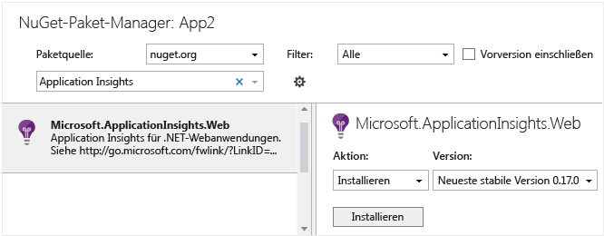

<properties 
	pageTitle="Application Insights für Windows-desktop-apps und Dienste" 
	description="Analysieren Sie die Nutzung und Leistung von Windows-Anwendungen mit Application Insights." 
	services="application-insights" 
    documentationCenter="windows"
	authors="alancameronwills" 
	manager="douge"/>

<tags 
	ms.service="application-insights" 
	ms.workload="tbd" 
	ms.tgt_pltfrm="ibiza" 
	ms.devlang="na" 
	ms.topic="article" 
	ms.date="06/13/2015" 
	ms.author="awills"/>

# Application Insights auf Windows-Desktop-apps und Dienste

*Application Insights befindet sich in der Vorschau.*

[AZURE.INCLUDE [app-insights-selector-get-started](../../includes/app-insights-selector-get-started.md)]

Mit Application Insights können Sie die Nutzung und Leistung Ihrer bereitgestellten Anwendung überwachen:

Unterstützung für Windows-desktop-apps und Dienste werden von den Kern der Application Insights SDK bereitgestellt. Dieses SDK bietet die vollständige API-Unterstützung für alle Telemetriedaten, aber keine Telemetriedaten Auto-Auflistung bereitstellt.


## <a name="add"></a> Erstellen einer Application Insights-Ressource


1.  Erstellen Sie im [Azure-Portal][portal] eine neue Application Insights-Ressource. Wählen Sie für den Anwendungstyp Windows Store-app. 

    


2.  Erstellen Sie eine Kopie des Instrumentationsschlüssels.

    

## <a name="sdk"></a>Installieren des SDK in Ihrer Anwendung


1. Bearbeiten Sie die NuGet-Pakete Ihres Desktop-App-Projekts in Visual Studio.

2. Installieren Sie das Application Insights-API-Paket.

    

3. Bearbeiten Sie die Datei "ApplicationInsights.config" (die bei der NuGet-Installation hinzugefügt wurde). Fügen Sie Folgendes direkt vor dem Endtag ein:

    &lt;InstrumentationKey&gt;*den kopierten Schlüssel*&lt;/InstrumentationKey&gt;

    Alternativ können Sie denselben Effekt mit folgendem Code erzielen:
    
    `TelemetryConfiguration.Active.InstrumentationKey = "your key";`


## <a name="telemetry"></a>Einfügen von Telemetrieaufrufen

Erstellen Sie eine `TelemetryClient`-Instanz und [nutzen Sie sie anschließend, um Telemetriedaten zu senden][api].

Verwenden Sie `TelemetryClient.Flush` zum Senden von Nachrichten vor dem Schließen der App. (Dies wird nicht für andere Arten von Apps empfohlen.)

Beispielsweise können Sie in einer Windows Forms-Anwendung Folgendes schreiben:

```C#

    public partial class Form1 : Form
    {
        private TelemetryClient tc = new TelemetryClient();
        ...
        private void Form1_Load(object sender, EventArgs e)
        {
            // Alternative to setting ikey in config file:
            tc.InstrumentationKey = "key copied from portal";

            // Set session data:
            tc.Context.User.Id = Environment.GetUserName();
            tc.Context.Session.Id = Guid.NewGuid().ToString();
            tc.Context.Device.OperatingSystem = Environment.OSVersion.ToString();

            // Log a page view:
            tc.TrackPageView("Form1");
            ...
        }

        protected override void OnClosing(CancelEventArgs e)
        {
            stop = true;
            if (tc != null)
            {
                tc.Flush(); // only for desktop apps
            }
            base.OnClosing(e);
        }

```

Verwenden Sie eine der [Application Insights-APIs][api], um Telemetriedaten zu senden. In Windows-Desktopanwendungen werden Telemetriedaten nicht automatisch gesendet. In der Regel würden Sie Folgendes verwenden:

* "TrackPageView(pageName)" für umschaltbare Formulare, Seiten oder Registerkarten
* "TrackEvent(eventName)" für andere Benutzeraktionen
* "TrackMetric(Name, Wert)" bei einer Hintergrundaufgabe, um Berichte zu Metriken, die nicht bestimmten Ereignissen zugeordnet sind, regelmäßig zu senden.
* "TrackTrace(logEvent)" für die [Diagnoseprotokollierung][diagnostic]
* "TrackException(exception)" in Catch-Klauseln

#### Kontext-Initialisierer

Als Alternative zur Sitzungsdaten in jeder Instanz TelemetryClient festlegen können Sie eine Kontext-Initialisierung:

```C#
    class UserSessionInitializer: IContextInitializer
    {
        public void Initialize(TelemetryContext context)
        {
            context.User.Id = Environment.UserName;
            context.Session.Id = Guid.NewGuid().ToString();
        }
    }

    static class Program
    {
        ...
        static void Main()
        {
            TelemetryConfiguration.Active.ContextInitializers.Add(
                new UserSessionInitializer());
            ...
```


## <a name="run"></a>Ausführen des Projekts

[Führen Sie die Anwendung durch Drücken von F5 aus](http://msdn.microsoft.com/library/windows/apps/bg161304.aspx), und verwenden Sie sie, um einige Telemetriedaten zu generieren.

In Visual Studio sehen Sie eine Anzahl der gesendeten Ereignisse.


## <a name="monitor"></a>Anzeigen der Überwachungsdaten

Kehren Sie zum Blatt Ihrer Anwendung im Azure-Portal zurück.

Die ersten Ereignisse werden in der Diagnosesuche angezeigt.

Klicken Sie nach einigen Sekunden auf "Aktualisieren", wenn Sie mehr Daten erwarten.

Wenn Sie "TrackMetric" oder den Parameter "measurements" von "TrackEvent" verwendet haben, öffnen Sie im [Metrik-Explorer][metrics] das Blatt "Filter", auf dem die Metriken angezeigt werden.


## <a name="usage"></a>Nächste Schritte

[Nachverfolgen der Nutzung Ihrer App][knowUsers]

[Diagnoseprotokolle anlegen und durchsuchen][diagnostic]

[Problembehandlung][qna]


<!--Link references-->

[diagnostic]: app-insights-diagnostic-search.md
[metrics]: app-insights-metrics-explorer.md
[portal]: http://portal.azure.com/
[qna]: app-insights-troubleshoot-faq.md
[knowUsers]: app-insights-overview-usage.md
[api]: app-insights-api-custom-events-metrics.md
[CoreNuGet]: https://www.nuget.org/packages/Microsoft.ApplicationInsights
 

<!---HONumber=GIT-SubDir_Tue_AM_dede-->