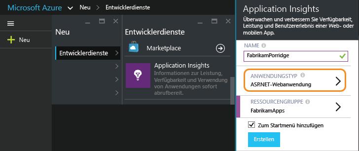
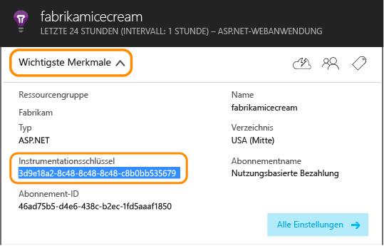
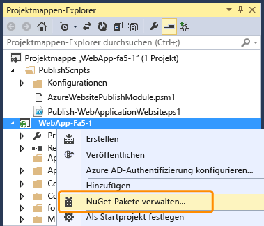
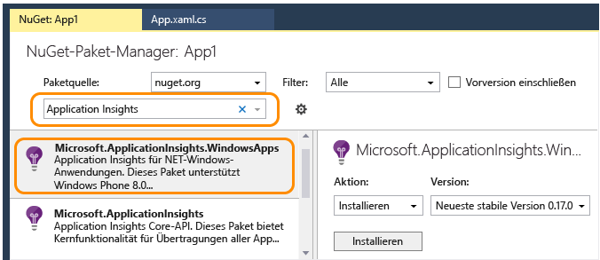
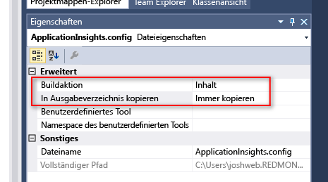
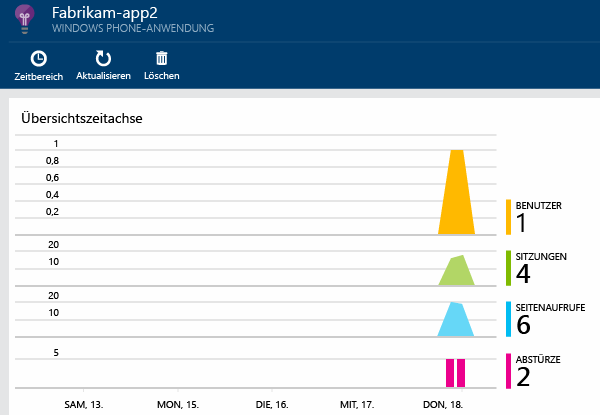

<properties
	pageTitle="Analysen für Windows Phone- und Windows Store-Apps | Microsoft Azure"
	description="Analysieren Sie die Nutzung und Leistung von Windows-Geräteanwendungen."
	services="application-insights"
    documentationCenter="windows"
	authors="alancameronwills"
	manager="douge"/>

<tags
	ms.service="application-insights"
	ms.workload="tbd"
	ms.tgt_pltfrm="ibiza"
	ms.devlang="na"
	ms.topic="get-started-article"
	ms.date="02/03/2016"
	ms.author="awills"/>

# Analysen für Windows Phone- und Windows Store-Apps

Microsoft bietet zwei DevOps-Lösungen für Geräte: [HockeyApp](http://hockeyapp.net/) für clientseitige Analysen und [Application Insights](app-insights-overview.md) für die Serverseite.

[HockeyApp](http://hockeyapp.net/) ist unsere mobile DevOps-Lösung für Apps auf iOS-, OS X-, Android- und Windows-Geräten sowie für plattformübergreifende Apps, die auf Xamarin, Cordova und Unity basieren. Mit dieser Lösung können Sie Builds an Betatester verteilen, Daten sammeln und Benutzermetriken und -feedback erhalten. Sie ist in Visual Studio Team Services integriert und ermöglicht einfache Bereitstellungen von Builds und die Integration von Arbeitsaufgaben.

Wechseln Sie zu:

* [HockeyApp](http://support.hockeyapp.net/kb)
* [HockeyApp-Blog](http://hockeyapp.net/blog/)
* Nehmen Sie an [Hockeyapp Preseason](http://hockeyapp.net/preseason/) teil, um frühe Veröffentlichungen zu erhalten.

Wenn Ihre App serverseitige Komponenten hat, verwenden Sie [Application Insights](app-insights-overview.md) zum Überwachen der Webserverseite der App in [ASP.NET](app-insights-asp-net.md) oder [J2EE](app-insights-java-get-started.md).

## Application Insights-SDK für Windows-Geräte

Wir empfehlen zwar HockeyApp, es gibt jedoch auch eine ältere Version des Application Insights-SDKs, mit dem Sie [Abstürze][windowsCrash] und die [Nutzung][windowsUsage] Ihrer Windows-Geräte-Apps überwachen können.

Beachten Sie, dass die Unterstützung des älteren Geräte-SDKs ausläuft.


Zum Installieren des älteren SDKs benötigen Sie:

* Ein Abonnement für [Microsoft Azure][azure]
* Visual Studio 2013 oder höher


### 1\. Abrufen einer Application Insights-Ressource 

Erstellen Sie im [Azure-Portal][portal] eine Application Insights-Ressource.

Erstellen einer neuen Ressource:



Eine [Ressource][roles] in Azure ist eine Instanz eines Diensts. In dieser Ressource werden Telemetriedaten aus Ihrer App analysiert und Ihnen angezeigt.

#### Kopieren des Instrumentationsschlüssels

Mit diesem Schlüssel wird die Ressource identifiziert. Sie benötigen ihn in Kürze, um das SDK für das Senden der Daten an die Ressource zu konfigurieren.




### 2\. Hinzufügen des Application Insights SDK zu Ihren Apps

Fügen Sie in Visual Studio das entsprechende SDK Ihrem Projekt hinzu.


* Wenn es sich um eine C++-App handelt, verwenden Sie das [C++-SDK](https://github.com/Microsoft/ApplicationInsights-CPP) anstatt des unten dargestellten NuGet-Pakets.

Wenn es sich um eine universelle Windows App handelt, wiederholen Sie die folgenden Schritte für sowohl das Windows Phone-Projekt als auch das Windows-Projekt.

1. Klicken Sie im Projektmappen-Explorer mit der rechten Maustaste auf Ihr Projekt, und wählen Sie **NuGet-Pakete** verwalten aus.

    

2. Suchen Sie nach "Application Insights".

    

3. Wählen Sie **Application Insights für Windows-Anwendungen**.

4. Fügen Sie die Datei "ApplicationInsights.config" im Stammverzeichnis des Projekts hinzu, und fügen Sie den im Portal kopierten Instrumentationsschlüssel ein. Nachfolgend sehen Sie einen XML-Beispielcode für diese Config-Datei.

	```xml
		<?xml version="1.0" encoding="utf-8" ?>
		<ApplicationInsights>
			<InstrumentationKey>YOUR COPIED INSTRUMENTATION KEY</InstrumentationKey>
		</ApplicationInsights>
	```

    Legen Sie die Eigenschaften der Datei "ApplicationInsights.config" fest: **Buildvorgang** = **Inhalt** und **In Ausgabeverzeichnis kopieren** = **Immer kopieren**.
	
	

5. Fügen Sie den folgenden Initialisierungscode hinzu. Es ist am besten, diesen Code dem `App()`-Konstruktor hinzuzufügen. Wenn Sie ihn an anderer Stelle hinzufügen, könnten Sie die automatische Erfassung der ersten Seitenansichten verpassen.

```C#
	public App()
	{
	   // Add this initilization line. 
	   WindowsAppInitializer.InitializeAsync();
	
	   this.InitializeComponent();
	   this.Suspending += OnSuspending;
	}  
```

**Universelle Windows-Apps**: Wiederholen Sie die Schritte für das Phone-Projekt und für das Store-Projekt. [Beispiel für eine universelle Windows 8.1-App](https://github.com/Microsoft/ApplicationInsights-Home/tree/master/Samples/Windows%208.1%20Universal).

### <a name="network"></a>3. Aktivieren des Netzwerkzugriffs für Ihre App

Wenn Ihre App noch nicht [den ausgehenden Netzwerkzugriff anfordert](https://msdn.microsoft.com/library/windows/apps/hh452752.aspx), müssen Sie diesen ihrer Manifestdatei als [erforderliche Funktion](https://msdn.microsoft.com/library/windows/apps/br211477.aspx) hinzufügen.

### <a name="run"></a>4. Ausführen des Projekts

[Führen Sie die Anwendung durch Drücken von F5 aus](http://msdn.microsoft.com/library/windows/apps/bg161304.aspx), und verwenden Sie sie, um einige Telemetriedaten zu generieren.

In Visual Studio sehen Sie eine Anzahl der empfangenen Ereignisse.


Im Debugmodus werden Telemetriedaten gesendet, sobald sie generiert wurden. Im Freigabemodus werden Telemetrie auf dem Gerät gespeichert und erst gesendet, wenn die Anwendung fortgesetzt wird.


### <a name="monitor"></a>5. Anzeigen von Überwachungsdaten

Öffnen Sie Application Insights von Ihrem Projekt aus.


Zuerst sehen Sie lediglich einen oder zwei Punkte. Zum Beispiel:



Klicken Sie nach einigen Sekunden auf "Aktualisieren", wenn Sie mehr Daten erwarten.

Klicken Sie auf ein beliebiges Diagramm, um weitere Details anzuzeigen.


### <a name="deploy"></a>5. Veröffentlichen der Anwendung im Windows Store

[Veröffentlichen Sie die Anwendung](http://dev.windows.com/publish), und verfolgen Sie das Ansammeln der Daten, wenn Benutzer sie herunterladen und nutzen.

### Anpassen der Telemetrie

#### Auswählen der Sammler

Das Application Insights SDK umfasst mehrere Sammler, die automatisch unterschiedliche Datentypen aus Ihrer App erfassen. Standardmäßig sind sie alle aktiv. Sie können jedoch auswählen, welche Sammler im App-Konstruktor initialisiert werden:

    WindowsAppInitializer.InitializeAsync( "00000000-0000-0000-0000-000000000000",
       WindowsCollectors.Metadata
       | WindowsCollectors.PageView
       | WindowsCollectors.Session 
       | WindowsCollectors.UnhandledException);

#### Senden eigener Telemetriedaten

Verwenden Sie die [API][api], um Ereignisse, Metriken und Diagnosedaten an Application Insights zu übermitteln. Zusammenfassung:

```C#

 var tc = new TelemetryClient(); // Call once per thread

 // Send a user action or goal:
 tc.TrackEvent("Win Game");

 // Send a metric:
 tc.TrackMetric("Queue Length", q.Length);

 // Provide properties by which you can filter events:
 var properties = new Dictionary{"game", game.Name};

 // Provide metrics associated with an event:
 var measurements = new Dictionary{"score", game.score};

 tc.TrackEvent("Win Game", properties, measurements);

```

Weitere Informationen finden Sie unter [Benutzerdefinierte Ereignisse und Metriken][api].

## Wie geht es weiter?

* [Erkennen und Diagnostizieren von Abstürzen in Ihrer App][windowsCrash]
* [Weitere Informationen zu Metriken][metrics]
* [Weitere Informationen zur Diagnosesuche][diagnostic]
* [Nachverfolgen der Nutzung Ihrer App][windowsUsage]
* [Verwenden der API zum Senden benutzerdefinierter Telemetriedaten][api]
* [Problembehandlung][qna]

* [Verwendung von HockeyApp für Absturzanalysen, Beta-Verteilung und Feedback zu Ihrer App](http://hockeyapp.net/)


<!--Link references-->

[api]: app-insights-api-custom-events-metrics.md
[azure]: ../insights-perf-analytics.md
[diagnostic]: app-insights-diagnostic-search.md
[metrics]: app-insights-metrics-explorer.md
[portal]: http://portal.azure.com/
[qna]: app-insights-troubleshoot-faq.md
[roles]: app-insights-resources-roles-access-control.md
[windowsCrash]: app-insights-windows-crashes.md
[windowsUsage]: app-insights-windows-usage.md

<!---HONumber=AcomDC_0211_2016-->