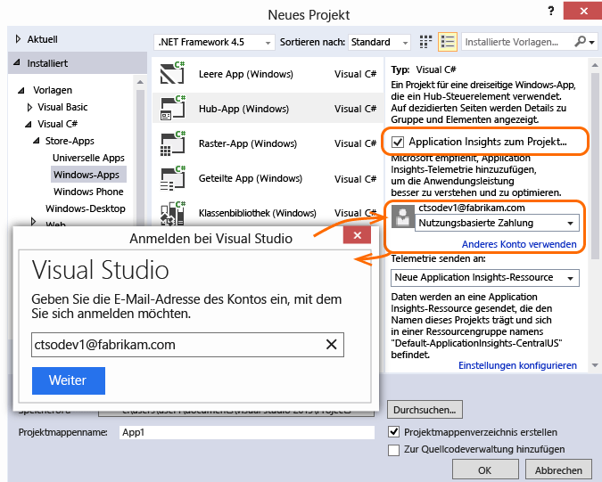
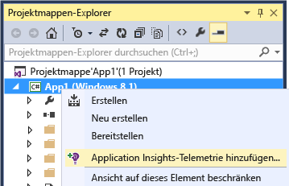

<properties
	pageTitle="Anaylsen für Windows Phone- und Windows Store-Apps | Microsoft Azure"
	description="Analysieren Sie die Nutzung und Leistung von Windows-Geräteanwendungen."
	services="application-insights"
    documentationCenter="windows"
	authors="alancameronwills"
	manager="douge"/>

<tags
	ms.service="application-insights"
	ms.workload="tbd"
	ms.tgt_pltfrm="ibiza"
	ms.devlang="na"
	ms.topic="get-started-article"
	ms.date="11/11/2015"
	ms.author="awills"/>

# Analysen für Windows Phone- und Windows Store-Apps


Mit Visual Studio Application Insights können Sie Ihre veröffentlichte Anwendung auf Nutzung und Leistung überwachen.


> [AZURE.NOTE]Wir empfehlen [HockeyApp](http://support.hockeyapp.net/kb/client-integration-windows-and-windows-phone/hockeyapp-for-windows-store-apps-and-windows-phone-store-apps), um Absturzberichte, Analysen, Verteilung und Feedback zu verwalten.


## Einrichten von Application Insights für Ihr Windows-Geräteprojekt

Sie benötigen Folgendes:

* Ein Abonnement für [Microsoft Azure][azure]
* Visual Studio 2013 oder höher

**C++ UAP-Apps** – Siehe [Application Insights C++-Einrichtungsleitfaden](https://github.com/Microsoft/ApplicationInsights-CPP)

### <a name="new"></a>Wenn Sie ein neues Windows-Anwendungsprojekt erstellen ...

Wählen Sie **Application Insights** im Dialogfeld **Neues Projekt** aus.

Wenn Sie zur Anmeldung aufgefordert werden, verwenden Sie die Anmeldeinformationen für Ihr Azure-Konto.




### <a name="existing"></a>… oder falls es sich um ein vorhandenes Projekt handelt

Fügen Sie Application Insights im Projektmappen-Explorer hinzu.


 **Universelle Windows-Apps**: Wiederholen Sie die Schritte für das Phone-Projekt und für das Store-Projekt. [Beispiel für eine universelle Windows 8.1-App](https://github.com/Microsoft/ApplicationInsights-Home/tree/master/Samples/Windows%208.1%20Universal).

## <a name="network"></a>3. Aktivieren des Netzwerkzugriffs für Ihre App

Wenn Ihre App noch keinen [Internetzugriff anfordert](https://msdn.microsoft.com/library/windows/apps/hh452752.aspx), müssen Sie diesen der Manifestdatei als [erforderliche Funktion](https://msdn.microsoft.com/library/windows/apps/br211477.aspx) hinzufügen.

## <a name="run"></a>4. Ausführen des Projekts

[Führen Sie die Anwendung durch Drücken von F5 aus](http://msdn.microsoft.com/library/windows/apps/bg161304.aspx), und verwenden Sie sie, um einige Telemetriedaten zu generieren.

In Visual Studio sehen Sie eine Anzahl der empfangenen Ereignisse.


Im Debugmodus werden Telemetriedaten gesendet, sobald sie generiert wurden. Im Freigabemodus werden Telemetrie auf dem Gerät gespeichert und erst gesendet, wenn die Anwendung fortgesetzt wird.


## <a name="monitor"></a>5. Anzeigen von Überwachungsdaten

Melden Sie sich beim [Azure-Portal](https://portal.azure.com) an, und öffnen Sie die Application Insights-Ressource, die Sie zuvor erstellt haben.

Zuerst sehen Sie lediglich einen oder zwei Punkte. Zum Beispiel:


Klicken Sie nach einigen Sekunden auf **Aktualisieren**, wenn Sie mehr Daten erwarten.

Klicken Sie auf ein beliebiges Diagramm, um weitere Details anzuzeigen.


## <a name="deploy"></a>5. Veröffentlichen der Anwendung im Windows Store

[Veröffentlichen Sie die Anwendung](http://dev.windows.com/publish), und verfolgen Sie das Ansammeln der Daten, wenn Benutzer sie herunterladen und nutzen.

## Anpassen der Telemetrie

#### Auswählen der Sammler

Das Application Insights SDK umfasst mehrere Sammler, die automatisch unterschiedliche Datentypen aus Ihrer App erfassen. Standardmäßig sind sie alle aktiv. Sie können jedoch auswählen, welche Sammler im App-Konstruktor initialisiert werden:

    WindowsAppInitializer.InitializeAsync( "00000000-0000-0000-0000-000000000000",
       WindowsCollectors.Metadata
       | WindowsCollectors.PageView
       | WindowsCollectors.Session
       | WindowsCollectors.UnhandledException);

#### Senden eigener Telemetriedaten

Verwenden Sie die [API][api], um Ereignisse, Metriken und Diagnosedaten an Application Insights zu übermitteln. Zusammenfassung:

```C#

 var tc = new TelemetryClient(); // Call once per thread

 // Send a user action or goal:
 tc.TrackEvent("Win Game");

 // Send a metric:
 tc.TrackMetric("Queue Length", q.Length);

 // Provide properties by which you can filter events:
 var properties = new Dictionary{"game", game.Name};

 // Provide metrics associated with an event:
 var measurements = new Dictionary{"score", game.score};

 tc.TrackEvent("Win Game", properties, measurements);

```

Weitere Informationen finden Sie unter [API-Übersicht: Benutzerdefinierte Ereignisse und Metriken][api].

## Wie geht es weiter?

* [Erkennen und Diagnostizieren von Abstürzen in Ihrer App][windowsCrash]
* [Weitere Informationen zu Metriken][metrics]
* [Weitere Informationen zur Diagnosesuche][diagnostic]


## Upgraden auf eine neue SDK-Version

Bei [Veröffentlichung einer neuen SDK-Version](app-insights-release-notes-windows.md):

* Klicken Sie mit der rechten Maustaste auf das Projekt, und wählen Sie "NuGet-Pakete verwalten" aus.
* Wählen Sie die installierten Application Insights-Pakete und dann die Aktion **Upgrade** aus.


## <a name="usage"></a>Nächste Schritte


[Erkennen und Diagnostizieren von Abstürzen in Ihrer App][windowsCrash]

[Diagnoseprotokolle anlegen und durchsuchen][diagnostic]


[Nachverfolgen der Nutzung Ihrer App][windowsUsage]

[Verwenden der API zum Senden benutzerdefinierter Telemetriedaten][api]

[Problembehandlung][qna]


<!--Link references-->

[api]: app-insights-api-custom-events-metrics.md
[azure]: ../insights-perf-analytics.md
[diagnostic]: app-insights-diagnostic-search.md
[metrics]: app-insights-metrics-explorer.md
[portal]: http://portal.azure.com/
[qna]: app-insights-troubleshoot-faq.md
[roles]: app-insights-resources-roles-access-control.md
[windowsCrash]: app-insights-windows-crashes.md
[windowsUsage]: app-insights-windows-usage.md

<!---HONumber=Nov15_HO4-->