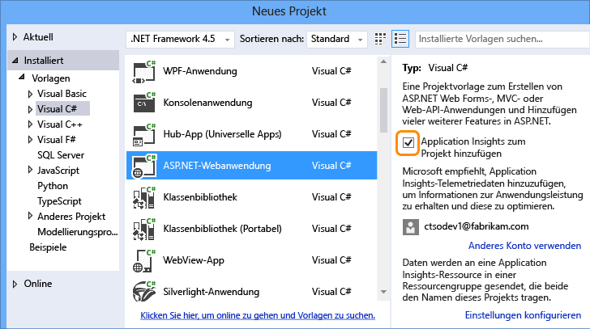
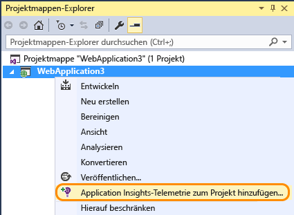
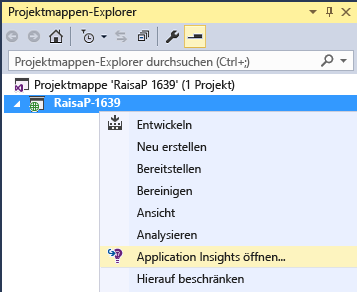
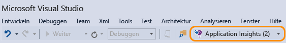

<properties 
	pageTitle="Überwachen der Leistung und Nutzung Ihrer App mit Application Insights" 
	description="Analysieren Sie die Auslastung, Verfügbarkeit und Leistung Ihrer lokalen oder Microsoft Azure-Webanwendung mit Application Insights." 
	services="application-insights" 
    documentationCenter=""
	authors="alancameronwills" 
	manager="ronmart"/>

<tags 
	ms.service="application-insights" 
	ms.workload="tbd" 
	ms.tgt_pltfrm="ibiza" 
	ms.devlang="na" 
	ms.topic="article" 
	ms.date="04/26/2015" 
	ms.author="awills"/>

# Überwachen der Leistung und Nutzung Ihrer App mit Application Insights

*Application Insights befindet sich in der Vorschau.*

Visual Studio Application Insights überwacht Ihre Live-Anwendung. So können Sie [Leistungsprobleme und -ausnahmen erkennen und diagnostizieren][detect] und zudem [ermitteln, wie Ihre App verwendet wird][knowUsers]. Application Insights kann mit einer Vielzahl von Anwendungstypen verwendet werden: ASP.NET- und Java-Web-Apps, iOS-, Android-, Windows- und anderen Geräte-Apps sowie HTML- JavaScript-Apps.

In diesem Artikel liegt der Schwerpunkt auf App-Typen, die in Visual Studio entwickelt werden. Es gibt auch Application Insights-Erweiterungen für andere integrierte Entwicklungsumgebungen.

Sie benötigen [Visual Studio 2013 Update 3](http://go.microsoft.com/fwlink/?linkid=397827&clcid=0x409) (oder neuer) und ein Konto in [Microsoft Azure](http://azure.com).

##  Hinzufügen von Application Insights zu Ihrem Projekt

#### Falls es sich um ein neues Projekt handelt …

Wenn Sie in Visual Studio ein neues Projekt erstellen, achten Sie darauf, dass Application Insights ausgewählt ist.

Visual Studio erstellt eine Ressource in Application Insights, fügt dem Projekt das SDK hinzu und legt den Schlüssel in der `.config`-Datei ab.

Verfügt das Projekt über Webseiten, wird der Master-Webseite auch das [JavaScript-SDK][client] hinzugefügt.

#### … oder falls es sich um ein vorhandenes Projekt handelt

Klicken Sie im Projektmappen-Explorer mit der rechten Maustaste auf das Projekt, und wählen Sie "Application Insights hinzufügen".

Visual Studio erstellt eine Ressource in Application Insights, fügt dem Projekt das SDK hinzu und legt den Schlüssel in der `.config`-Datei ab.

In diesem Fall wird das [JavaScript-SDK][client] nicht Ihren Webseiten hinzugefügt. Es empfiehlt sich, dies als nächsten Schritt durchzuführen.

#### Setupoptionen

Falls Sie erstmals ein Projekt erstellen, werden Sie nach einer Anmeldung bei Microsoft Azure Preview gefragt. (Dies ist nicht zu verwechseln mit Ihrem Visual Studio Online-Konto.)

Wenn diese App Teil einer größeren Anwendung ist, empfiehlt es sich, sie mithilfe von **Einstellungen konfigurieren** in derselben Ressourcengruppe wie die anderen Komponenten abzulegen.

*Keine Option "Application Insights" vorhanden? Für einige Projekttypen können Sie Application Insights durch [manuelles Hinzufügen des SDK][windows] verwenden.*

#### Öffnen Sie Application Insights von Ihrem Projekt aus.

##  3. Ausführen des Projekts

Starten Sie Ihre Anwendung mit F5, und probieren Sie es aus: Öffnen Sie verschiedene Seiten, um einige Telemetriedaten zu generieren.

In Visual Studio sehen Sie eine Anzahl der gesendeten Ereignisse.

##  4. Anzeigen der Telemetrie

Kehren Sie zum [Azure-Portal][portal] zurück, und navigieren Sie zur Application Insights-Ressource.

Suchen Sie nach Daten in der Übersichtsdiagrammen. Zuerst sehen Sie lediglich einen oder zwei Punkte. Zum Beispiel:

Klicken Sie sich durch ein beliebiges Diagramm, um ausführlichere Metriken anzuzeigen. [Hier finden Sie weitere Informationen zu Metriken.][perf]

Stellen Sie jetzt Ihre Anwendung bereit, und sehen Sie zu, wie Daten gesammelt werden.

Beim Betrieb im Debugmodus wird Telemetrie über die Pipeline geliefert, sodass Ihnen innerhalb von wenigen Sekunden Daten angezeigt werden. Sobald Sie Ihre Anwendung bereitstellen, sammeln sich die Daten langsamer an.

#### Sie sehen keine Daten?

* Öffnen Sie die Kachel [Diagnosesuche][diagnostic], um einzelne Ereignisse anzuzeigen.
* Verwenden Sie die Anwendung, und öffnen Sie verschiedene Seiten, damit einige Telemetriedaten generiert werden.
* Warten Sie einige Sekunden, und klicken Sie auf "Aktualisieren".
* Informationen hierzu finden Sie unter [Problembehandlung][qna].

## Nächste Schritte

Jetzt senden Sie Daten von der Serverseite der App. Im Folgenden sind einige Schritte für eine umfassendere Perspektive aufgeführt:

* [Richten Sie Webtests ein][availability], um sicherzustellen, dass die Anwendung live und reaktionsfähig bleibt.
* [Fügen Sie Ihren Webseiten das JavaScript-SDK hinzu][client], um browserbasierte Telemetriedaten wie Anzahl der Seitenaufrufe, Seitenladezeiten oder Skriptausnahmen zu erhalten und benutzerdefinierte Telemetrie in Ihre Seitenskripts schreiben zu können.
* Fügen Sie die Nachverfolgung von Abhängigkeiten hinzu, um Probleme zu diagnostizieren, die durch die von der App verwendeten Datenbanken oder anderen Komponenten verursacht werden 
 * [Hinzufügen der Nachverfolgung von Abhängigkeiten in Ihrem IIS-Server][redfield]
 * [Hinzufügen der Nachverfolgung von Abhängigkeiten in Ihrer Azure Web-App][azure]
* [Erfassen Sie Protokoll-Ablaufverfolgungen][netlogs] aus Ihrem bevorzugten Protokollierungsframework
* [Verfolgen Sie benutzerdefinierte Ereignisse und Metriken][api] im Client oder im Server oder beides, um weitere Informationen zur Nutzung Ihrer Anwendung zu erhalten.

<!--Link references-->

[api]: app-insights-api-custom-events-metrics.md
[availability]: app-insights-monitor-web-app-availability.md
[azure]: ../insights-perf-analytics.md
[client]: app-insights-javascript.md
[detect]: app-insights-detect-triage-diagnose.md
[diagnostic]: app-insights-diagnostic-search.md
[knowUsers]: app-insights-overview-usage.md
[netlogs]: app-insights-asp-net-trace-logs.md
[perf]: app-insights-web-monitor-performance.md
[portal]: http://portal.azure.com/
[qna]: app-insights-troubleshoot-faq.md
[redfield]: app-insights-monitor-performance-live-website-now.md
[windows]: app-insights-windows-get-started.md

 

<!---HONumber=July15_HO3-->