<properties
	pageTitle="Erste Schritte mit Azure Automation"
	description="Erfahren Sie mehr über den Import und die Ausführung eines Automatisierungs-Jobs in Azure."
	services="automation"
	documentationCenter=""
	authors="bwren"
	manager="stevenka"
	editor=""/>

<tags
	ms.service="automation"
	ms.workload="tbd"
	ms.tgt_pltfrm="na"
	ms.devlang="na"
	ms.topic="hero-article" 
	ms.date="05/19/2015"
	ms.author="bwren"/>

# Erste Schritte mit Azure Automation

## Was ist Azure Automation?

Microsoft Azure Automation bietet Benutzern die Möglichkeit, die manuellen, langfristigen, Fehler verursachenden und häufig wiederholten Aufgaben zu automatisieren, die für gewöhnlich in einer Cloudumgebung ausgeführt werden. Mithilfe von Runbooks, die auf Windows PowerShell-Workflows basieren, können Sie in Ihrer Azure-Umgebung Ressourcen erstellen, überwachen, verwalten und bereitstellen. In diesem Handbuch durchlaufen Sie ein Lernprogramm für die Ausführung eines einfachen Beispiel-Runbooks. Es enthält auch Ressourcen zum Durchsuchen der erweiterten Funktionen des Dienstes.

## Lernprogramm:
In diesem Lernprogramm wird erläutert, wie Sie ein Automation-Konto erstellen, das Beispiel-Runbook "Hello World" in Azure Automation importieren, es ausführen und anschließend dessen Ausgabe anzeigen.

Sie benötigen ein Azure-Abonnement, um dieses Lernprogramm auszuführen. Wenn Sie noch kein Abonnement haben, können Sie [Ihre MSDN-Abonnentenvorteile aktivieren](../pricing/member-offers/msdn-benefits-details/) oder sich [für eine kostenlose Testversion registrieren](../pricing/free-trial.md)</a>.

[AZURE.INCLUDE [automation-note-authentication](../../includes/automation-note-authentication.md)]

## Video zur exemplarischen Vorgehensweise

Hier finden Sie eine exemplarische Vorgehensweise für dieses Lernprogramm.

[AZURE.VIDEO get-started-with-azure-automation]

## Erstellen eines Automation-Kontos

Ein Automation-Konto ist ein Container für Ihre Azure Automation-Ressourcen: Es bietet eine Möglichkeit, Ihre Umgebungen zu trennen oder Ihre Workflows weiter zu organisieren. Weitere Informationen finden Sie unter [Automation-Konten](http://aka.ms/runbookauthor/azure/automationaccounts) in der Automation Library. Wenn Sie bereits ein Automation-Konto erstellt haben, können Sie diesen Schritt überspringen.

1.	Melden Sie sich beim [Azure-Verwaltungsportal](http://manage.windowsazure.com) an.

2.	Klicken Sie im Verwaltungsportal auf **Create an Automation Account**.

	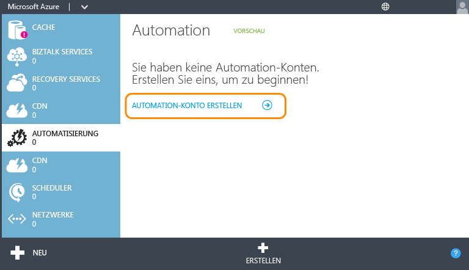

3.	Geben Sie auf der Seite **Add a New Automation Account** einen Namen für das Konto ein, und wählen Sie eine Region für das Konto aus. Die Region gibt an, wo die Automation-Ressourcen im Konto gespeichert werden. Sie hat keine Auswirkungen auf die Funktionalität Ihres Kontos, aber Ihre Runbooks werden möglicherweise schneller ausgeführt, wenn sich Ihre Kontoregion in der Nähe Ihrer anderen Azure-Ressourcen befindet. Wenn Sie bereit sind, klicken Sie auf das Häkchen.

	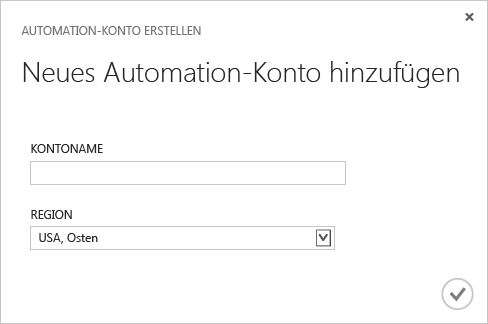

## Importieren des Runbooks aus dem Runbook-Katalog

Der [Runbook-Katalog](http://aka.ms/runbookgallery) enthält Beispiel-Runbooks, die Sie direkt in ein Azure Automation-Konto importieren und so die Arbeit anderer Benutzer von Azure Automation und PowerShell nutzen können. In diesem Schritt verwenden Sie den Katalog, um das Beispiel-Runbook "Hello World" zu importieren.

4.	Klicken Sie auf der Seite **Automation** auf das soeben erstellte neue Konto.

	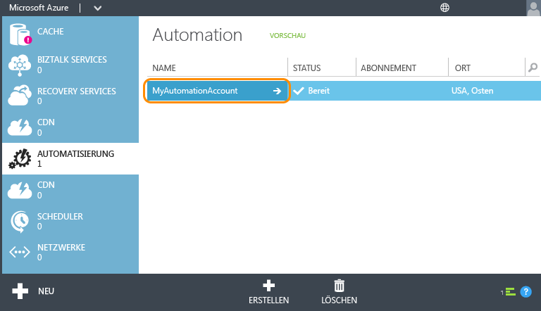

5.	Klicken Sie auf **RUNBOOKS**.

	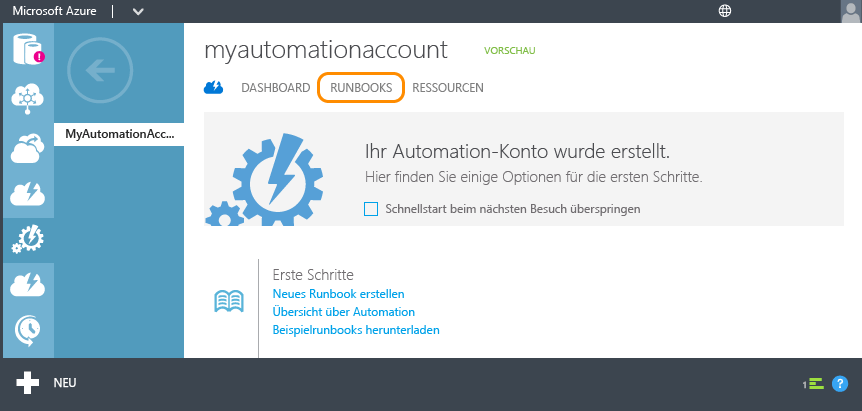

6.	Klicken Sie auf **Neu** > **Runbook** > **Aus Katalog**.

	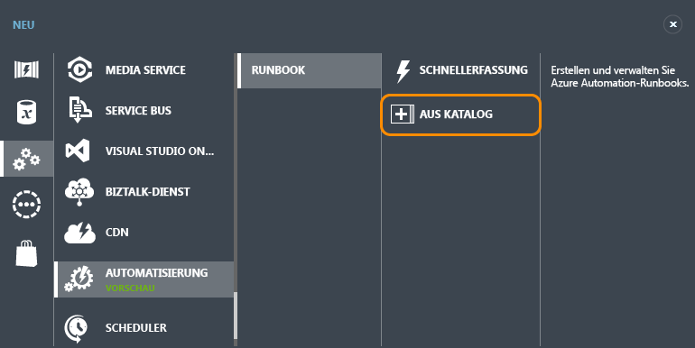

7.  Wählen Sie die Kategorie **Lernprogramm** und anschließend **Hello World for Azure Automation**. Klicken Sie auf die Schaltfläche mit dem Pfeil nach rechts.

	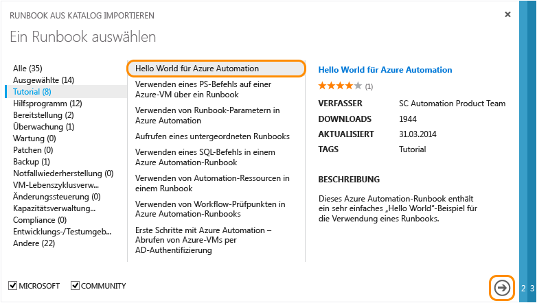

8.  Überprüfen Sie die Inhalte des Runbooks, und klicken Sie anschließend auf die Schaltfläche mit dem Pfeil nach rechts.

	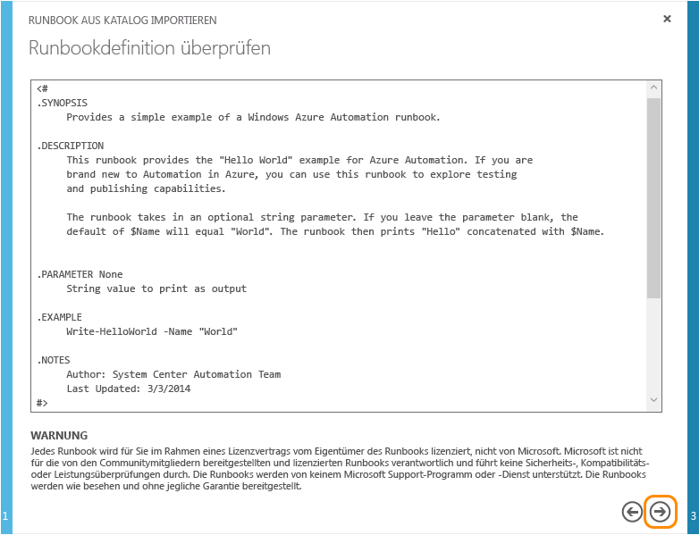

8.	Überprüfen Sie die Details des Runbooks, und klicken Sie anschließend auf das Häkchen.

	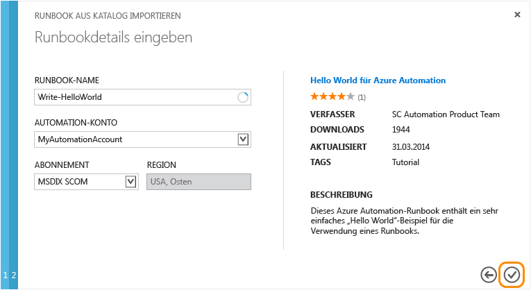

## Veröffentlichen des Runbooks

Das Runbook wird zunächst im Entwurfsmodus importiert. Dies bedeutet, dass Sie weiterhin daran arbeiten können, bevor Sie es als neue Version autorisieren, die ausgeführt werden kann. Da dieses Beispiel-Runbook keine zusätzliche Konfiguration erfordert, veröffentlichen Sie es jetzt in der derzeitigen Form. Weitere Informationen finden Sie unter [Veröffentlichen eines Runbooks](http://aka.ms/runbookauthor/azure/publishrunbook).

9.	Wenn der Import des Runbooks abgeschlossen ist, klicken Sie auf **Write-HelloWorld**.

	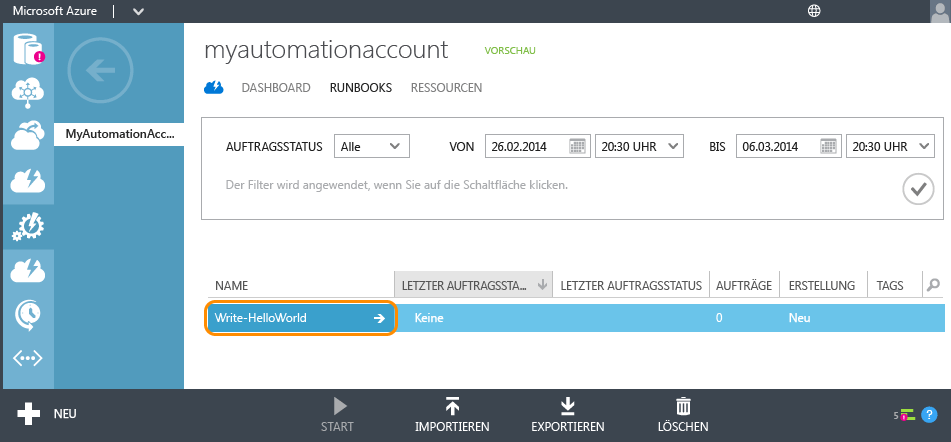

9.	Klicken Sie auf **AUTOR** und dann auf **ENTWURF**.

	Sie können den Inhalt eines Runbooks im Entwurfsmodus ändern. Bei diesem Runbook müssen Sie keine Änderungen vornehmen.

	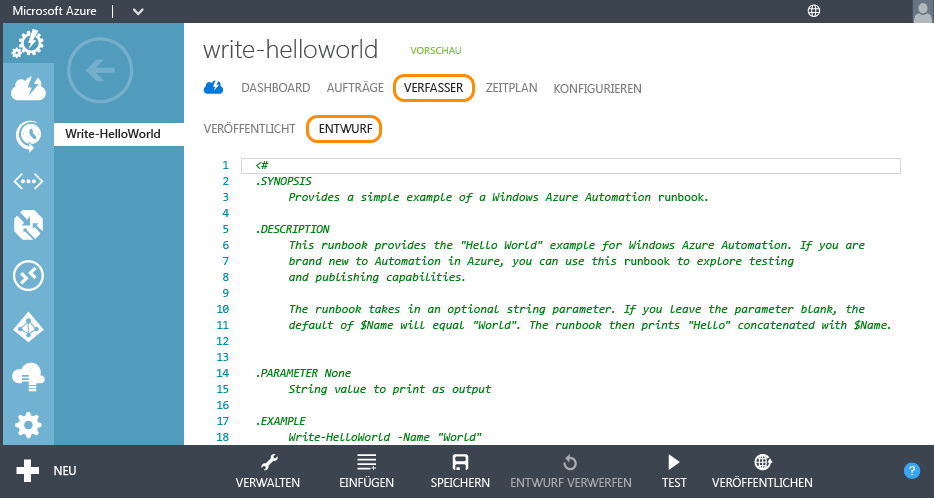

10.	Klicken Sie auf **VERÖFFENTLICHEN**, um das Runbook hochzustufen und es als zum Einsatz in der Produktion bereit zu kennzeichnen.

	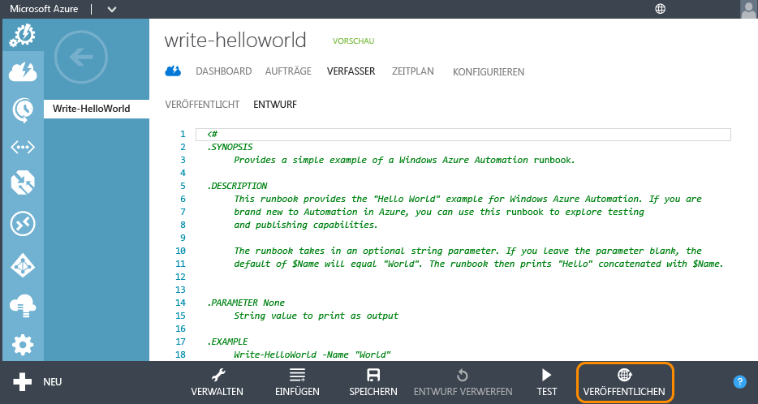

11.	Wenn Sie zur Bestätigung aufgefordert werden, klicken Sie auf **Ja**.

	

## Starten des Runbooks

Jetzt, da Sie das Runbook importiert und veröffentlicht haben, können Sie es ausführen und anschließend die Ausgabe untersuchen. Weitere Informationen finden Sie unter [Starten eines Runbooks](http://aka.ms/runbookauthor/azure/startrunbook) und [Runbook-Ausgabe und -Nachrichten](http://aka.ms/runbookauthor/azure/runbookoutput).

12.	Klicken Sie bei geöffnetem **Write-HelloWorld**-Runbook auf **START**.

	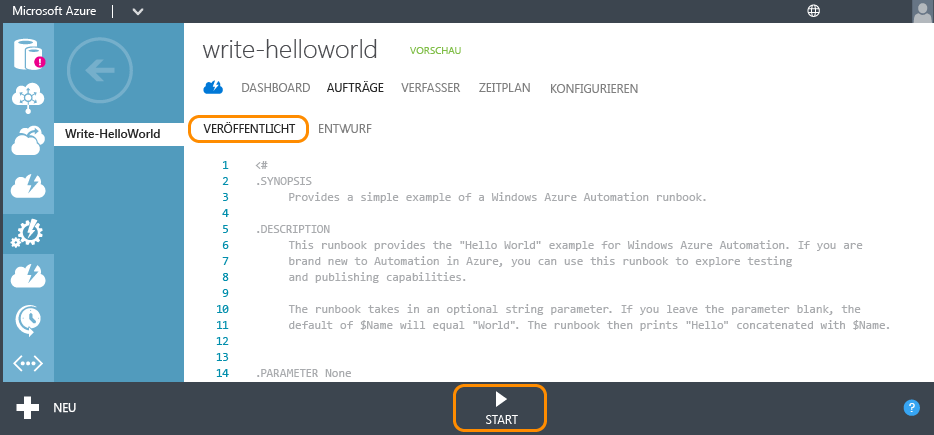

13.	Geben Sie auf der Seite **Specify the runbook parameter values** einen **Namen** ein, der als Eingabeparameter für das Skript Write-HelloWorld.ps1 verwendet wird, und klicken Sie dann auf das Häkchen.

	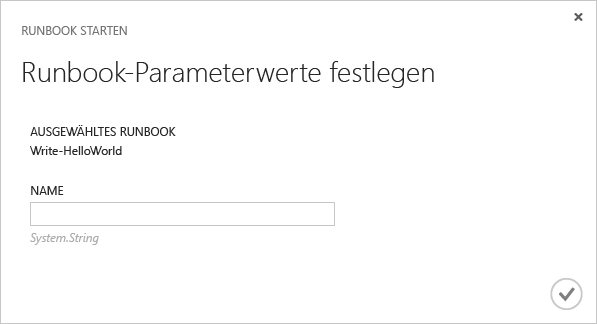

14.	Klicken Sie auf **JOBS**, um den Status des soeben gestarteten Runbook-Auftrags zu prüfen. Klicken Sie anschließend auf den Zeitstempel in der Spalte **AUFTRAGSANFANG**, um eine Zusammenfassung des Auftrags anzuzeigen.

	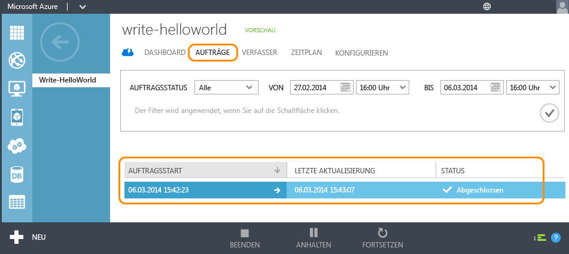

15.	Auf der Seite **ZUSAMMENFASSUNG** sehen Sie die Zusammenfassung, die Eingabeparameter und die Ausgabe des Auftrags.

	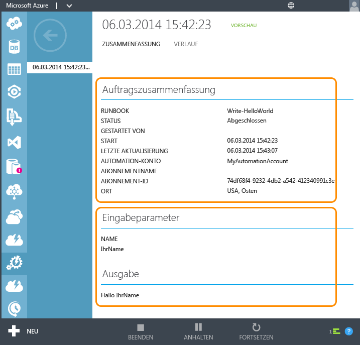

Glückwunsch! Sie haben das Lernprogramm abgeschlossen.

## Nächste Schritte
1. Mit dem einfachen Runbook in diesem Lernprogramm **können keine Azure-Dienste verwaltet werden**. Die meisten Runbooks verwenden dazu die [Azure-Cmdlets](http://msdn.microsoft.com/library/jj156055.aspx), wofür die Authentifizierung bei Ihrem Azure-Abonnement erforderlich ist. Befolgen Sie die Anweisungen unter [Konfigurieren von Azure für die Verwaltung von Runbooks](http://aka.ms/azureautomationauthentication), um Ihr Azure-Abonnement für das Arbeiten mit diesen Cmdlets zu konfigurieren.  
2. Weitere Informationen zu den Funktionen von Azure Automation finden Sie in den unten aufgeführten [Ressourcen](#resources).
3. Abonnieren Sie den [Azure Automation-Blog](http://azure.microsoft.com/blog/tag/azure-automation), um stets die neuesten Informationen vom Azure Automation-Team zu erhalten.

## Ressourcen

Um mehr über Azure Automation zu erfahren und Ihre eigenen Runbooks zu erstellen, steht Ihnen eine Vielzahl weiterer Ressourcen zur Verfügung.

- Die [Azure Automation Library](http://go.microsoft.com/fwlink/p/?LinkId=392860) enthält die vollständige Dokumentation für die Konfiguration und Verwaltung von Azure Automation und für die Erstellung Ihrer eigenen Runbooks.
- Unter [Azure PowerShell-Cmdlets](http://msdn.microsoft.com/library/jj156055.aspx) finden Sie Informationen über die Automatisierung von Azure-Vorgängen mit Windows PowerShell. Runbooks verwenden diese Cmdlets zum Arbeiten mit Azure-Ressourcen.
- Der [Azure Automation-Blog](http://azure.microsoft.com/blog/tag/azure-automation) liefert Ihnen die neuesten Informationen von Microsoft zu Azure Automation.
- Im [Automation-Forum](http://go.microsoft.com/fwlink/p/?LinkId=390561) können Sie Fragen über Azure Automation stellen, um sie von Microsoft und der Automation-Community beantworten zu lassen.

## Beispiele und Hilfsprogramm-Runbooks

Microsoft und die Azure Automation-Community stellen Beispiel-Runbooks zur Verfügung, die Ihnen das Erstellen eigener Lösungen erleichtern, und Hilfsprogramm-Runbooks, die Sie als Bausteine für umfangreichere Automation-Aufgaben verwenden können. Sie können diese Runbooks aus dem [Script Center](http://go.microsoft.com/fwlink/p/?LinkId=393029) herunterladen oder mithilfe des [Runbook-Katalogs](http://aka.ms/runbookgallery) direkt in Azure Automation importieren.

## Feedback

**Geben Sie uns Feedback!** Wenn Sie nach einer Azure Automation-Runbook-Lösung oder einem Integrationsmodul suchen, senden Sie im Script Center eine Skriptanforderung. Wenn Sie Feedback oder Vorschläge zu Features für Azure Automation haben, veröffentlichen Sie sie auf [User Voice](http://feedback.windowsazure.com/forums/34192--general-feedback). Vielen Dank!
 

<!---HONumber=August15_HO8-->