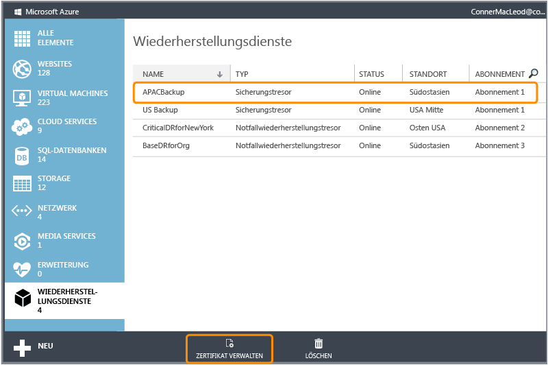
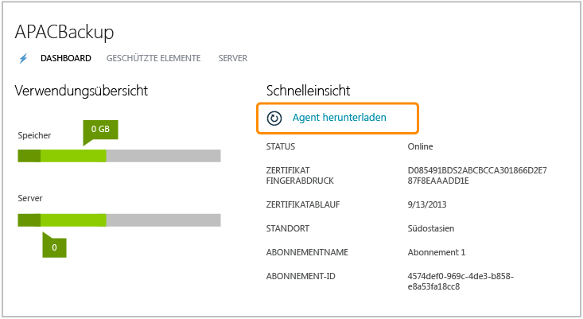
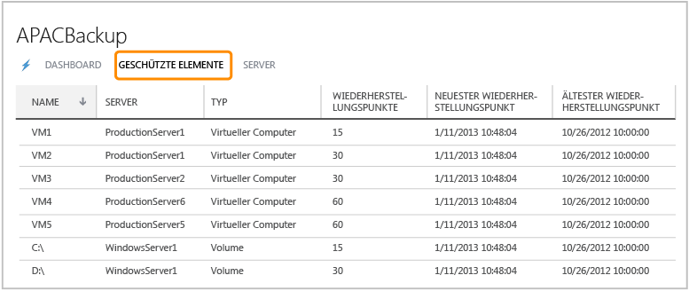

<properties linkid="manage-services-recovery-configure-backup-vault" urlDisplayName="Configure a Backup Vault" pageTitle="Configure Azure Recovery Services to quickly and easily back-up Windows Server" metaKeywords="disaster recovery" description="Use this tutorial to learn how to use the Backup service in Microsoft's Azure cloud offering to back up Windows Server to the cloud." metaCanonical="" services="recovery-services" documentationCenter="" title="Configure Azure Backup to quickly and easily back-up Windows Server" authors="starra" solutions="" manager="cynthn" editor="tysonn" />

Konfigurieren der Azure-Sicherung für schnelle und einfache Sicherung von Windows Server
========================================================================================

**Hinweis**

Sie benötigen ein Windows Azure-Konto, bei dem die Funktion Azure-Sicherung aktiviert ist, um dieses Lernprogramm abzuschließen.

-   Wenn Sie über kein Konto verfügen, können Sie in nur wenigen Minuten ein kostenloses Testkonto erstellen. Weitere Informationen finden Sie unter [Kostenloses Azure-Testkonto](/en-us/pricing/free-trial/).
-   Wenn Sie bereits über ein Konto verfügen und die Azure-Sicherungs-Vorschau aktivieren möchten, finden Sie Informationen dazu unter [Aktivieren von Azure-Vorschaufunktionen](/en-us/develop/net/tutorials/create-a-windows-azure-account/#enable).

Fordern Sie die Teilnahme am Sicherungs-Vorschauprogramm an, und warten Sie, bis Ihr Status zu „aktiv“ wechselt. Alle Kunden werden automatisch bestätigt. Dies dauert daher nicht lange.

Sie müssen einen Sicherungstresor in Ihrer geografischen Region erstellen, in dem die Daten gespeichert werden sollen, um Dateien und Daten von Windows Server in Azure zu sichern. In diesem Lernprogramm wird Folgendes erläutert: das Erstellen des Tresors, in dem Sie Sicherungen speichern, das Hochladen eines Zertifikats in den Tresor, das Installieren eines Sicherungs-Agents sowie eine Übersicht der Sicherungsverwaltungsaufgaben, die über das Verwaltungsportal verfügbar sind.

**Vorbereitungen**

Zum erfolgreichen Ausführen der Schritte in diesem Lernprogramm benötigen Sie ein X.509 v3-Zertifikat, um Ihre Server bei den Sicherungstresoren zu registrieren. Das Zertifikat muss über eine Schlüssellänge von mindestens 2.048 Bit verfügen und sollte auf Ihrem lokalen Computer im persönlichen Zertifikatspeicher aufbewahrt werden. Wenn das Zertifikat auf Ihrem Server installiert ist, sollte es den privaten Schlüssel des Zertifikats enthalten. Sie müssen den öffentlichen Schlüssel als Datei im CER-Format exportieren, um das Zertifikat in das Azure-Verwaltungsportal hochladen zu können.

Sie können eines der folgenden Elemente verwenden:

-   Ihr eigenes selbstsigniertes Zertifikat, das mit MakeCert erstellt wurde
-   Jedes gültige SSL-Zertifikat, das von einer Zertifizierungsstelle ausgegeben wurde, die von Microsoft als vertrauenswürdig erachtet wird und deren Stammzertifikate über das Microsoft-Programm für Stammzertifikate verteilt werden. Weitere Informationen zu diesem Programm finden Sie unter [Windows Root Certificate Program members](http://go.microsoft.com/fwlink/p/?LinkId=294666).

Die folgenden Attribute müssen Sie ebenfalls für die Zertifikate gewährleisten:

-   Das Zertifikat verfügt über ein gültiges Clientauthentifizierungs-EKU.
-   Das Zertifikat ist aktuell gültig und besitzt eine Gültigkeitsdauer, die maximal 3 Jahre beträgt.

Befolgen Sie diese Schritte, wenn Sie Ihr eigenes selbstsigniertes Zertifikat verwenden möchten:

1.  Laden Sie das [Tool zur Erstellung von Zertifikaten (MakeCert.exe)](http://go.microsoft.com/fwlink/p/?LinkID=294662) herunter.
2.  Öffnen Sie eine Eingabeaufforderung (cmd.exe) mit Administratorrechten, und führen Sie den folgenden Befehl aus. Ersetzen Sie dabei *Zertifikatname* durch den Namen Ihres Zertifikats, und geben Sie das aktuelle Ablaufdatum Ihres Zertifikats nach -e an: `makecert.exe -r -pe -n CN=Zertifikatname -ss my -sr localmachine -eku 1.3.6.1.5.5.7.3.2 -len 2048 -e 01/01/2016 CertificateName.cer`

Wenn Sie einen anderen Server registrieren möchten, als denjenigen, den Sie zur Erstellung des Zertifikats verwendet haben, müssen Sie die PFX-Datei (enthält den privaten Schlüssel) exportieren, diese auf den gewünschten Server kopieren und die Datei dann in den persönlichen Zertifikatspeicher dieses Servers importieren.

Eine ausführliche Anleitung zum Hochladeprozess für das Tresorzertifikat sowie weitere Informationen zum Exportieren und Importieren von PFX-Dateien finden Sie unter [Manage vault certificates](http://go.microsoft.com/fwlink/p/?LinkID=294662) (Verwalten von Tresorzertifikaten, in englischer Sprache).

Erstellen eines Sicherungstresors
---------------------------------

1.  Melden Sie sich auf dem [Verwaltungsportal](https://manage.windowsazure.com) an.

    [WACOM.INCLUDE [disclaimer](../includes/disclaimer.md)]

2.  Klicken Sie auf **Wiederherstellungsdienste**, dann auf **Neu erstellen**. Bewegen Sie den Mauszeiger auf **Sicherungstresor**, und klicken Sie anschließend auf **Schnellerfassung**.

    

3.  Geben Sie unter **Name** einen benutzerfreundlichen Namen zur Identifizierung des Sicherungstresors ein.

4.  Wählen Sie unter **Region** die geografische Region für den Sicherungstresor aus.

5.  Geben Sie unter **Abonnement** das Azure-Abonnement ein, mit dem Sie den Sicherungstresor verwenden möchten.

6.  Klicken Sie auf **Tresor erstellen**.

    Es kann eine Weile dauern, bis der Sicherungstresor fertiggestellt wird. Kontrollieren Sie die Benachrichtigungen am unteren Rand des Portals, um den Status zu prüfen. Wenn der Sicherungstresor erstellt wurde, erhalten Sie eine Nachricht, dass der Tresor erfolgreich erstellt wurde und in den Ressourcen der Wiederherstellungsdienste als **Online** angezeigt wird.

    

Hochladen eines Zertifikats
---------------------------

1.  Melden Sie sich auf dem [Verwaltungsportal](https://manage.windowsazure.com) an.

2.  Klicken Sie auf **Wiederherstellungsdienste**. Klicken Sie anschließend auf den Namen des Sicherungstresors, der vom Zertifikat identifiziert werden soll, und klicken Sie dann auf Manage Certificate****.

    

3.  Klicken Sie im Dialog **Manage Certificate** auf Browse Your Computer, um die CER-Datei zu suchen, die für diesen Sicherungstresor verwendet werden soll.

    Herunterladen und Installieren eines Sicherungs-Agents
    ------------------------------------------------------

4.  Melden Sie sich auf dem [Verwaltungsportal](https://manage.windowsazure.com) an.

5.  Klicken Sie auf **Wiederherstellungsdienste** und dann auf den Namen des Sicherungstresors, um das Tresor-Dashboard anzuzeigen.

6.  Klicken Sie auf **Install Agent**

    

7.  Es wird ein Dialog angezeigt, in dem Sie wählen können, welcher Agent heruntergeladen werden soll:
    -   Agent für Windows Server 2012 und System Center 2012 SP1 – Data Protection Manager
    -   Agent für Windows Server 2012 Essentials

8.  Wählen Sie den passenden Agent aus. Sie werden zum Microsoft Download Center weitergeleitet und können dort die Agent-Software herunterladen. Weitere Informationen finden Sie unter:

    -   [Install Azure Backup Agent for Windows Server 2012 and System Center 2012 SP1 - Data Protection Manager (Installieren des Windows Azure-Sicherungs-Agents für Windows Server 2012 und System Center 2012 SP1 – Data Protection Manager, in englischer Sprache)](http://technet.microsoft.com/en-us/library/hh831761.aspx#BKMK_installagent)
    -   [Install Azure Backup Agent for Windows Server 2012 Essentials (Installieren des Sicherungs-Agents für Windows Server 2012 Essentials, in englischer Sprache)](http://technet.microsoft.com/en-us/library/jj884318.aspx)

Wenn Sie den Agent installiert haben, können Sie die passende lokale Verwaltungsschnittstelle verwenden (wie das Microsoft Management Console-Snap-In, die Data Protection Manager-Konsole in Systemcenter oder das Windows Server Essentials-Dashboard), um die Sicherungsrichtlinie für den Server festzulegen.

Verwalten von Sicherungstresoren und Sicherungsservern
------------------------------------------------------

1.  Melden Sie sich auf dem [Verwaltungsportal](https://manage.windowsazure.com) an.

2.  Klicken Sie auf **Wiederherstellungsdienste** und dann auf den Namen des Sicherungstresors, um das Tresor-Dashboard anzuzeigen. Jetzt können Sie folgende Aufgaben ausführen:
    -   **Manage certificate**: Dies wird verwendet, um das zuvor hochgeladene Zertifikat zu aktualisieren.
    -   **Delete**: Dies wird verwendet, um den aktuellen Sicherungstresor zu löschen. Wenn ein Sicherungstresor nicht mehr verwendet wird, können Sie ihn löschen, um Speicherplatz freizugeben. **Delete** wird erst aktiviert, wenn alle registrierten Server aus dem Tresor gelöscht wurden.

3.  Klicken Sie auf **Protected Items**, um die Elemente anzuzeigen, die von den Servern gesichert wurden. Diese Liste dient nur zu Informationszwecken.
     

4.  Klicken Sie auf **Servers**, um die Namen der Server anzuzeigen, die für diesen Tresor registriert sind. Jetzt können Sie folgende Aufgaben ausführen:
    -   **Allow Re-register**: Wenn diese Option für einen Server ausgewählt ist, können Sie den Registrierungs-Assistenten des Agents verwenden, um den Server erneut für den Sicherungstresor zu registrieren. Eine erneute Registrierung ist möglicherweise nötig, wenn im Zertifikat ein Fehler auftritt oder wenn ein Server erneut erstellt werden muss. Je Servername ist nur eine erneute Registrierung möglich.
    -   **Delete**: Dies wird verwendet, um einen Server aus dem Sicherungstresor zu löschen. Alle gespeicherten Daten dieses Servers werden sofort gelöscht.

        

Nächste Schritte
----------------

-   Weitere Informationen zur Azure-Sicherung finden Sie unter [Übersicht über die Windows Azure-Sicherung](http://go.microsoft.com/fwlink/p/?LinkId=222425).

-   Besuchen Sie das [Azure Sicherungs-Forum](http://go.microsoft.com/fwlink/p/?LinkId=290933).

