<properties
	pageTitle="Sichern virtueller Azure-Computer | Microsoft Azure"
	description="Ermitteln, registrieren und sichern Sie Ihre virtuellen Computer mithilfe dieser Verfahren für die Sicherung virtueller Azure-Computer."
	services="backup"
	documentationCenter=""
	authors="Jim-Parker"
	manager="jwhit"
	editor=""
	keywords="VM-Sicherung; Sichern virtueller Computer; Sicherung und Notfallwiederherstellung"/>

<tags
	ms.service="backup"
	ms.workload="storage-backup-recovery"
	ms.tgt_pltfrm="na"
	ms.devlang="na"
	ms.topic="hero-article"
	ms.date="01/19/2016"
	ms.author="trinadhk; jimpark; markgal;"/>

# Sichern von virtuellen Azure-Computern
In diesem Artikel werden die Verfahren zum Sichern vorhandener virtueller Azure-Computer (VMs, Virtual Machines) erläutert, um Ihre virtuellen Computer in Übereinstimmung mit den Sicherungs- und Notfallwiederherstellungsrichtlinien Ihres Unternehmens zu schützen.

Bevor Sie einen virtuellen Azure-Computer sichern können, müssen Sie zunächst einige Dinge erledigen. Falls noch nicht erfolgt, erfüllen Sie die [Voraussetzungen](backup-azure-vms-prepare.md) zur Vorbereitung Ihrer Umgebung auf die Sicherung der virtuellen Computer, ehe Sie fortfahren.

Weitere Informationen finden Sie in den Artikeln [Planen der Sicherungsinfrastruktur für virtuelle Computer in Azure](backup-azure-vms-introduction.md) und [Dokumentation zu Virtual Machines](https://azure.microsoft.com/documentation/services/virtual-machines/).

Zur Sicherung virtueller Azure-Computer gehören drei Hauptschritte:

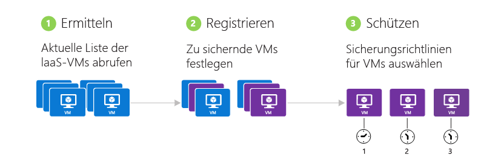

>[AZURE.NOTE]Das Sichern virtueller Computer ist ein örtlich gebundener Vorgang. Sie können keine virtuellen Computer aus einer Region in einem Sicherungstresor in einer anderen Region sichern. Deshalb muss in jeder Azure-Region mit virtuellen Computern, die gesichert werden sollen, mindestens ein Sicherungstresor erstellt werden.

## Schritt 1: Ermitteln virtueller Azure-Computer
Der Ermittlungsprozess muss immer als erster Schritt erfolgen, um sicherzustellen, dass alle neuen virtuellen Computer, die dem Abonnement hinzugefügt wurden, identifiziert werden. Bei diesem Vorgang wird Azure nach der Liste virtueller Computer im Abonnement abgefragt. Außerdem werden zusätzliche Informationen wie der Clouddienstname und die Region erfasst.

1. Navigieren Sie zum Sicherungstresor, der sich im Azure-Portal unter **Recovery Services** befindet, und klicken Sie auf die Registerkarte **Registrierte Elemente**.

2. Wählen Sie im Dropdownmenü **Virtueller Azure-Computer** aus.

    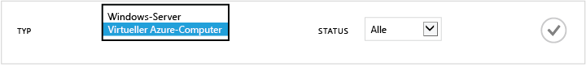

3. Klicken Sie unten auf der Seite auf **ERMITTELN**.
    

    Der Ermittlungsvorgang kann einige Minuten dauern, während die virtuellen Computer in einer Tabelle aufgeführt werden. Am unteren Rand des Bildschirms wird eine Benachrichtigung angezeigt, die Ihnen mitteilt, dass der Vorgang ausgeführt wird.

    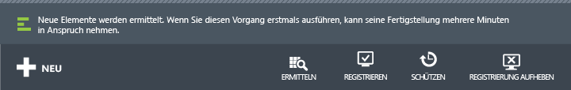

    Die Benachrichtigung ändert sich, sobald der Vorgang abgeschlossen ist.

    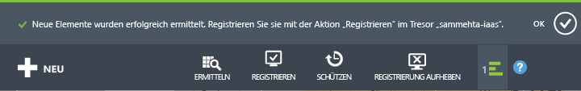

##  Schritt 2: Registrieren virtueller Azure-Computer
Sie registrieren einen virtuellen Azure-Computer, um ihn dem Azure Backup-Dienst zuzuordnen. Die Registrierung ist in der Regel eine einmalige Angelegenheit.

1. Navigieren Sie zum Sicherungstresor, der sich im Azure-Portal unter **Recovery Services** befindet, und klicken Sie anschließend auf **Registrierte Elemente**.

2. Wählen Sie im Dropdownmenü **Virtueller Azure-Computer** aus.

    

3. Klicken Sie unten auf der Seite auf **REGISTRIEREN**. 
    

4. Wählen Sie im Kontextmenü **Elemente registrieren** die virtuellen Computer aus, die Sie registrieren möchten. Wenn zwei oder mehr virtuelle Computer denselben Namen aufweisen, verwenden Sie den Clouddienst, um sie unterscheiden.

    >[AZURE.TIP]Mehrere virtuelle Computer können gleichzeitig registriert werden.

    Für jeden virtuellen Computer, den Sie ausgewählt haben, wird ein Auftrag erstellt.

5. Klicken Sie in der Benachrichtigung auf **Auftrag anzeigen**, um zur Seite **Aufträge** zu gelangen.

    

    Der virtuelle Computer wird auch in der Liste der registrierten Elemente aufgeführt, ebenso wie der Status des Registrierungsvorgangs.

    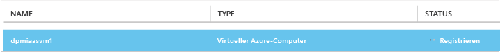

    Wenn der Vorgang abgeschlossen ist, ändert sich der Status dem *registrierten* Status entsprechend.

    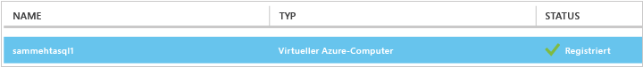

## Schritt 3: Schützen virtueller Azure-Computer
Nun können Sie die Sicherungs- und Aufbewahrungsrichtlinie für den virtuellen Computer definieren. Mehrere virtuelle Computer können in einem einzigen Schritt geschützt werden.

Azure-Sicherungstresore, die nach Mai 2015 erstellt wurden, enthalten eine im Tresor integrierte Standardrichtlinie. Diese Standardrichtlinie sieht eine Standardaufbewahrungsdauer von 30 Tagen und eine einmalige tägliche Sicherung vor.

1. Navigieren Sie zum Sicherungstresor, der sich im Azure-Portal unter **Recovery Services** befindet, und klicken Sie anschließend auf **Registrierte Elemente**.
2. Wählen Sie im Dropdownmenü **Virtueller Azure-Computer** aus.

    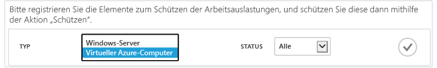

3. Klicken Sie unten auf der Seite auf **SCHÜTZEN**.

    Der Assistent **Elemente schützen** wird angezeigt. In diesem Assistenten werden nur virtuelle Computer aufgeführt, die registriert und nicht geschützt sind. Wählen Sie hier die virtuellen Computer aus, die Sie schützen möchten.

    Wenn zwei oder mehr virtuelle Computer denselben Namen aufweisen, verwenden Sie den Clouddienst zur Unterscheidung zwischen den virtuellen Computern.

    >[AZURE.TIP]Sie können mehrere virtuelle Computer gleichzeitig schützen.

    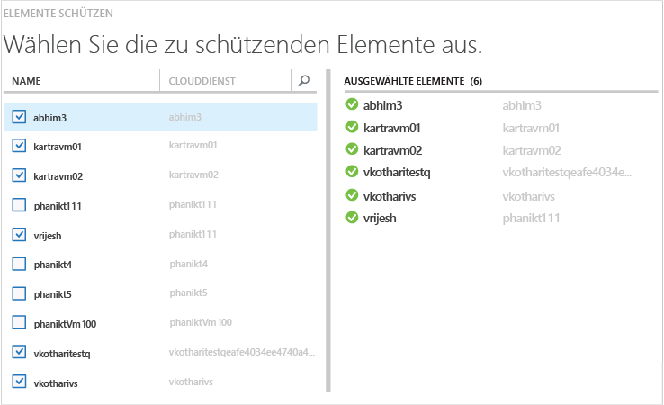

4. Wählen Sie einen **Sicherungszeitplan** zum Sichern der ausgewählten virtuellen Computer aus. Sie können aus einem vorhandenen Satz von Richtlinien wählen oder einen neuen definieren.

    Jeder Sicherungsrichtlinie können mehrere virtuelle Computer zugeordnet sein. Ein virtueller Computer kann jedoch immer nur einer Richtlinie zugeordnet sein.

    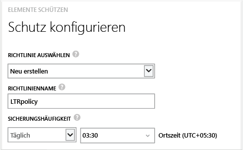

    >[AZURE.NOTE]Eine Sicherungsrichtlinie umfasst auch ein Aufbewahrungsschema für die geplanten Sicherungen. Bei Wahl einer vorhandenen Sicherungsrichtlinie können Sie die Aufbewahrungsoptionen im nächsten Schritt nicht ändern.

5. Wählen Sie eine **Aufbewahrungsdauer** für die Sicherungen aus.

    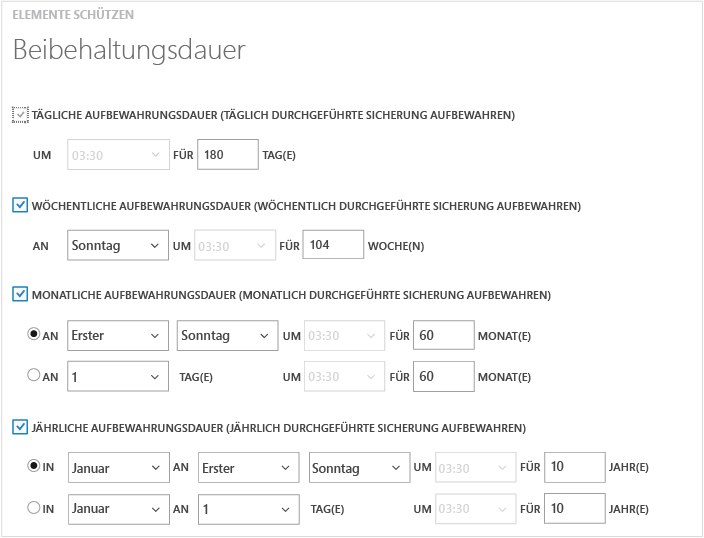

    Die Aufbewahrungsrichtlinie legt fest, für welchen Zeitraum eine Sicherung aufbewahrt wird. Je nach Erstellungszeitpunkt der Sicherung können Sie unterschiedliche Aufbewahrungsrichtlinien festlegen. Beispiel: Der Sicherungspunkt am Ende jedes Quartals muss möglicherweise länger aufbewahrt werden (für Audits), während der tägliche Sicherungspunkt (der als Wiederherstellungspunkt für den alltäglichen Betrieb dient) nur 90 Tage aufbewahrt werden muss.

    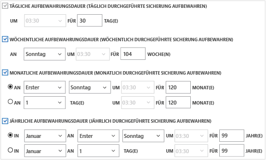

    In dieser Beispielabbildung:

    - **Tägliche Aufbewahrungsrichtlinie**: Täglich erstellte Sicherungen werden 30 Tage lang gespeichert.
    - **Wöchentliche Aufbewahrungsrichtlinie**: Sicherungen, die jeden Sonntag erstellt werden, werden 104 Wochen lang aufbewahrt.
    - **Monatliche Aufbewahrungsrichtlinie**: Sicherungen, die am letzten Samstag im Monat erstellt werden, werden 120 Monate lang aufbewahrt.
    - **Jährliche Aufbewahrungsrichtlinie**: Sicherungen, die am ersten Sonntag im Januar erstellt werden, werden 99 Jahre lang aufbewahrt.

    Ein Auftrag wird erstellt, um die Schutzrichtlinie zu konfigurieren und die virtuellen Computer, die Sie ausgewählt haben, dieser Richtlinie zuzuordnen.

6. Klicken Sie auf die Registerkarte **Auftrag**, und wählen Sie den richtigen Filter zum Anzeigen der Liste mit Aufträgen des Typs **Schutz konfigurieren** aus.

    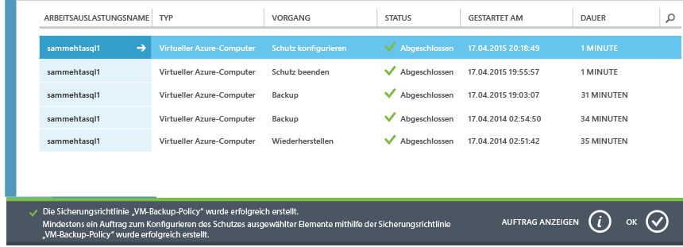

## Erste Sicherung
Sobald der virtuelle Computer durch eine Richtlinie geschützt ist, wird er auf der Registerkarte **Geschützte Elemente** angezeigt und weist den Schutzstatus *Geschützt (Anfangssicherung ausstehend)* auf. Standardmäßig ist die erste geplante Sicherung die *Anfangssicherung*.

So lösen Sie die erste Sicherung unmittelbar nach Konfigurieren des Schutzes aus:

1. Klicken Sie am unteren Rand der Seite **Geschützte Elemente** auf die Schaltfläche **Jetzt sichern**.

    Der Azure Backup-Dienst erstellt einen Sicherungsauftrag für die erste Sicherung.

2. Klicken Sie auf die Registerkarte **Aufträge**, um die Liste der Aufträge anzuzeigen.

    

>[AZURE.NOTE]Als Teil des Sicherungsvorgangs gibt der Azure Backup-Dienst einen Befehl an die Sicherungserweiterung auf jedem virtuellen Computer aus, damit alle Schreibvorgänge geleert werden und eine konsistente Momentaufnahme erstellt wird.

Sobald die erste Sicherung abgeschlossen ist, wird der Status des virtuellen Computers auf der Registerkarte **Geschützte Elemente** als *Geschützt* angezeigt.

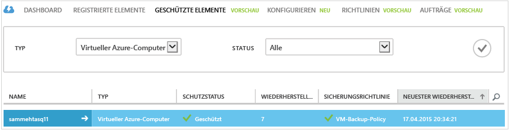

## Anzeigen von Status und Details der Sicherung
Sobald der Schutz eingerichtet ist, steigt die Anzahl der virtuellen Computer auch auf der **Dashboard**-Zusammenfassungsseite. Auf der Seite **Dashboard** wird auch die Anzahl der Aufträge der letzten 24 Stunden angezeigt, die *erfolgreich* waren, *Fehler* verursacht haben oder *noch ausgeführt* werden. Auf der Seite **Aufträge** können Sie durch Klicken auf eine beliebige Kategorie ein Drilldown in diese Kategorie durchführen.

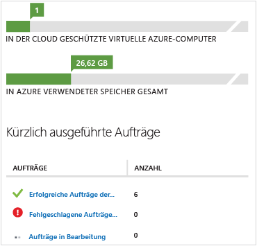

Werte im Dashboard werden einmal alle 24 Stunden aktualisiert.

## Problembehandlung
Wenn beim Sichern des virtuellen Computers Probleme auftreten, finden Sie in dieser Anleitung zur [Problembehandlung](backup-azure-vms-troubleshoot.md) Hilfe.

## Nächste Schritte

- [Verwalten und Überwachen Ihrer virtuellen Computer](backup-azure-manage-vms.md)
- [Wiederherstellen virtueller Computer](backup-azure-restore-vms.md)

<!---HONumber=AcomDC_0121_2016-->