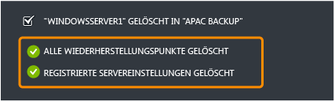

<properties 
	pageTitle="Konfigurieren von Azure Backup Services für eine schnelle und einfache Sicherung von Windows Server" 
	description="In diesem Lernprogramm erfahren Sie, wie der Sicherungsdienst in der Microsoft Azure Cloud verwendet wird, um Windows Server in der Cloud zu sichern." 
	services="backup" 
	documentationCenter="" 
	authors="markgalioto" 
	manager="jwhit" 
	editor="tysonn"/>

<tags 
	ms.service="backup" 
	ms.workload="storage-backup-recovery" 
	ms.tgt_pltfrm="na" 
	ms.devlang="na" 
	ms.topic="article" 
	ms.date="06/03/2015" 
	ms.author="markgal"/>

#Konfigurieren von Azure Backup Services für eine schnelle und einfache Sicherung von Windows Server

Um dieses Lernprogramm abzuschließen, benötigen Sie ein Azure-Konto. In diesem Lernprogramm erfahren Sie, wie Sie das Feature Azure Backup aktivieren.
>[AZURE.NOTE]Früher mussten Sie ein X.509 v3-Zertifikat erstellen oder beziehen, um Ihren Sicherungsserver zu registrieren. Zertifikate werden weiterhin unterstützt, aber jetzt können Sie direkt auf der Seite "Schnellstart" Tresoranmeldeinformationen generieren, wodurch der Azure-Tresor einfacher bei einem Server registriert werden kann. Wenn Sie noch kein Konto haben, können Sie in nur wenigen Minuten ein kostenloses Testkonto erstellen. Ausführliche Informationen finden Sie unter [Kostenlose Azure-Testversion](https://azure.microsoft.com/pricing/free-trial/).

Sie müssen einen Sicherungstresor in Ihrer geografischen Region erstellen, in dem die Daten gespeichert werden sollen, um Dateien und Daten von Windows Server in Azure zu sichern. In diesem Lernprogramm wird Folgendes erläutert:

- Erstellen des Tresors, in dem Sie Sicherungen speichern
- Herunterladen von Tresoranmeldeinformationen
- Installieren eines Sicherungs-Agents
- Übersicht der Sicherungsverwaltungsaufgaben, die über das Verwaltungsportal verfügbar sind

##Erstellen eines Sicherungstresors

1. Melden Sie sich beim [Verwaltungsportal](https://manage.windowsazure.com) an.
2. Klicken Sie auf **Neu** > **Data Services** > **Recovery Services** > **Sicherungstresor** > **Schnellerfassung**.
3. Geben Sie unter **Name** einen benutzerfreundlichen Namen zur Identifizierung des Sicherungstresors ein.
4. Wählen Sie unter **Region** die geografische Region für den Sicherungstresor aus.

    

5. Klicken Sie auf **Tresor erstellen**.

    Es kann eine Weile dauern, bis der Sicherungstresor fertiggestellt wird. Sie können die Benachrichtigungen unten im Portal überwachen, um den Status zu überprüfen. Nach dem Erstellen des Sicherungstresors erhalten Sie eine Nachricht mit dem Hinweis, dass der Tresor erfolgreich erstellt wurde. Er wird anschließend in den Ressourcen der Recovery Services als **Aktiv** angezeigt.

    

6. Wenn mit Ihrem Organisationskonto mehrere Abonnements verknüpft sind, wählen Sie das Konto aus, das mit dem Sicherungstresor verknüpft werden soll.

##Herunterladen von Tresoranmeldeinformationen

Tresoranmeldeinformationen werden nun anstelle von Zertifikaten verwendet, um einen Azure-Dienst beim Server zu registrieren. Sie können auch weiterhin Zertifikate verwenden, allerdings sind Tresoranmeldeinformationen einfacher zu verwenden, weil Sie diese mithilfe des Azure-Portals generieren und herunterladen können.

1. Melden Sie sich im [Verwaltungsportal](https://manage.windowsazure.com) an.
2. Klicken Sie auf **Wiederherstellungsdienste**, und wählen Sie den Sicherungstresor aus, den Sie bei einem Server registrieren möchten. Die Seite "Schnellstart" für diesen Sicherungstresor wird angezeigt.
3. Klicken Sie auf der Seite **Schnellstart** auf **Tresoranmeldeinformationen herunterladen**, damit die Tresoranmeldeinformationen, mit denen Sie Ihren Server beim Sicherungstresor registrieren, generiert und heruntergeladen werden.

    Das Portal generiert Tresoranmeldeinformationen mit einer Kombination aus dem Tresornamen und dem aktuellen Datum.

4. Klicken Sie auf **Speichern**, um die Tresoranmeldeinformationen in den Download-Ordner des lokalen Kontos herunterzuladen. Sie können auch im Menü **Speichern** die Option **Speichern unter** auswählen, um einen anderen Speicherort anzugeben. Sie können die Tresoranmeldeinformationen nicht bearbeiten, sodass es keinen Grund gibt, auf "Öffnen" zu klicken. Sobald die Anmeldeinformationen heruntergeladen wurden, werden Sie aufgefordert, den Ordner zu öffnen. Klicken Sie auf **x**, um dieses Menü zu schließen.

##Herunterladen und Installieren eines Sicherungs-Agents

1. Im [Verwaltungsportal](https://manage.windowsazure.com).
2. Klicken Sie auf **Wiederherstellungsdienste**, und wählen Sie einen Sicherungstresor aus, um die zugehörige Seite "Schnellstart" anzuzeigen.
3. Wählen Sie auf der Seite "Schnellstart" den Agent aus, den Sie herunterladen möchten. Sie können **Azure-Sicherungs-Agent herunterladen**, **Windows Server und System Center Data Protection Manager** oder **Windows Server Essentials** auswählen. Weitere Informationen finden Sie unter:

	* [Installieren des Azure-Sicherungs-Agents für Windows Server 2012 und System Center 2012 SP1 – Data Protection Manager](http://technet.microsoft.com/library/hh831761.aspx#BKMK_installagent)
	* [Installieren des Azure-Sicherungs-Agents für Windows Server 2012 Essentials](http://technet.microsoft.com/library/jj884318.aspx)

Wenn Sie den Agent installiert haben, können Sie die passende lokale Verwaltungsschnittstelle verwenden (wie das Microsoft Management Console-Snap-In, die Data Protection Manager-Konsole in Systemcenter oder das Windows Server Essentials-Dashboard), um die Sicherungsrichtlinie für den Server festzulegen.

##Verwalten von Sicherungstresoren und Sicherungsservern

1. Melden Sie sich beim [Verwaltungsportal](https://manage.windowsazure.com) an.
2. Klicken Sie auf **Wiederherstellungsdienste** und dann auf den Namen des Sicherungstresors, um die Seite "Schnellstart" anzuzeigen.
3. Klicken Sie auf **Dashboard**, um die Verwendungsübersicht für den Server anzuzeigen. Unten im Dashboard können Sie folgende Aufgaben ausführen:

    - **Zertifikat verwalten**. Wenn ein Zertifikat zum Registrieren des Servers verwendet wurde, verwenden Sie diese Aufgabe, um das Zertifikat zu aktualisieren. Wenn Sie Tresoranmeldeinformationen verwenden, verwenden Sie **Zertifikat verwalten** nicht.
    - **Löschen**. Dies wird verwendet, um den aktuellen Sicherungstresor zu löschen. Wenn ein Sicherungstresor nicht mehr verwendet wird, können Sie ihn löschen, um Speicherplatz freizugeben. **Löschen** wird erst aktiviert, wenn alle registrierten Server aus dem Tresor gelöscht wurden.
    - **Tresorsanmeldeinformationen**. Verwenden Sie diese Menüoption in der Schnelleinsicht, um Ihre Tresoranmeldeinformationen zu konfigurieren.

4. Klicken Sie auf **Protected Items**, um die Elemente anzuzeigen, die von den Servern gesichert wurden. Diese Liste dient nur zu Informationszwecken.

    

5. Klicken Sie auf **Servers**, um die Namen der Server anzuzeigen, die für diesen Tresor registriert sind. Jetzt können Sie folgende Aufgaben ausführen:

    - **Erneute Registrierung zulassen**. Wenn diese Option für einen Server ausgewählt ist, können Sie den Registrierungs-Assistenten des Agents verwenden, um den Server erneut für den Sicherungstresor zu registrieren. Eine erneute Registrierung ist möglicherweise nötig, wenn im Zertifikat ein Fehler auftritt oder wenn ein Server erneut erstellt werden muss. Je Servername ist nur eine erneute Registrierung möglich.
    - **Löschen**. Dies wird verwendet, um einen Server aus dem Sicherungstresor zu löschen. Alle gespeicherten Daten dieses Servers werden sofort gelöscht.

        

##Nächste Schritte

- Weitere Informationen zur Azure-Sicherung finden Sie unter [Übersicht über die Windows Azure-Sicherung](http://go.microsoft.com/fwlink/p/?LinkId=222425). 
- Besuchen Sie das [Azure Sicherungs-Forum](http://go.microsoft.com/fwlink/p/?LinkId=290933).

 

<!---HONumber=62-->