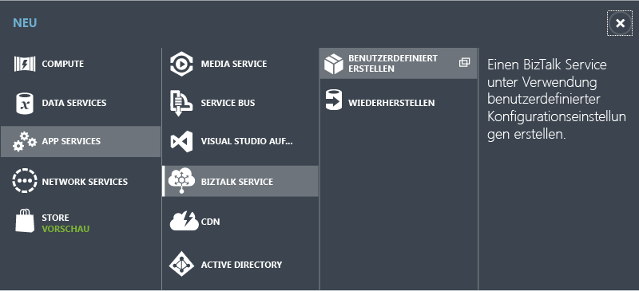
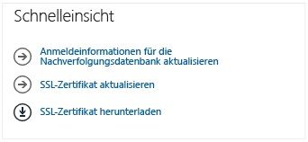
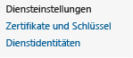

<properties linkid="provisioning-biztalk-service" urlDisplayName="Provision BizTalk Services in management portal" pageTitle="Provision BizTalk Services in management portal | Azure" metaKeywords="Get started Azure biztalk services, provision, Azure unstructured data" description="Learn how to provision a BizTalk service in the Azure Management Portal, as well as create an optional SQL database server and Storage account." metaCanonical="http://www.windowsazure.com/de-de/manage/services/biztalk-services/provisioning-biztalk-service" services="biztalk-services" documentationCenter="" title="BizTalk Services: Provisioning Using Azure Management Portal" authors="mandia" solutions="" manager="paulettm" editor="cgronlun" />

BizTalk Services: Bereitstellen mit dem Azure-Verwaltungsportal
===============================================================

**Tipp**

Um sich beim Azure-Verwaltungsportal anmelden zu können, benötigen Sie ein Azure-Konto und ein Azure-Abonnement. Wenn Sie über kein Konto verfügen, können Sie in wenigen Minuten ein kostenloses Testkonto erstellen. Weitere Informationen finden Sie unter [Kostenlose Azure-Testversion](http://go.microsoft.com/fwlink/p/?LinkID=239738).

Ein Azure BizTalk-Dienst umfasst die folgenden Komponenten:

<table data-morhtml="true" border="1">
	<tr data-morhtml="true" bgcolor="FAF9F9">
	        <td data-morhtml="true"><strong data-morhtml="true">Voraussetzung</strong></td>
	        <td data-morhtml="true"><strong data-morhtml="true">Beschreibung</strong></td>
	</tr>
		<tr data-morhtml="true">
		<td data-morhtml="true">Azure-Abonnement</td>
		<td data-morhtml="true">
Das Abonnement regelt den Zugriff auf das Azure-Verwaltungsportal und wird vom Azure-Kontoinhaber auf <a data-morhtml="true" href="https://account.windowsazure.com/Subscriptions">Azure Subscriptions</a> erstellt.

		
Das Azure-Konto kann &uuml;ber mehrere Abonnements verf&uuml;gen und vom Azure-Kontoinhaber oder von verschiedenen Personen oder Gruppen verwaltet werden. Beispielsweise kann der Azure-Kontoinhaber ein Abonnement namens <em data-morhtml="true">BizTalkServiceSubscription</em> erstellen und den BizTalk-Administratoren in Ihrem Unternehmen (z. B. ContosoBTSAdmins@live.com) Zugriff auf dieses Abonnement gew&auml;hren. In diesem Szenario melden sich die BizTalk-Administratoren beim Azure-Verwaltungsportal an und haben uneingeschr&auml;nkte Administratorrechte f&uuml;r alle gehosteten Dienste des Abonnements, einschlie&szlig;lich Azure BizTalk Services.<I></I> Die BizTalk-Administratoren sind nicht die Azure-Kontoinhaber und haben daher keinen Zugriff auf Abrechnungsinformationen.

		<a data-morhtml="true" href="http://go.microsoft.com/fwlink/p/?LinkID=267577"> Verwalten von Abonnements und Speicherkonten im Azure-Verwaltungsportal</a> enth&auml;lt n&auml;here Informationen zu Azure-Konten und -Abonnements.
		</td>
	</tr>
	<tr data-morhtml="true">
		<td data-morhtml="true">Azure SQL-Datenbank</td>
		<td data-morhtml="true">
Von Azure BizTalk Services verwendete Tabellen, Sichten und gespeicherte Prozeduren werden in einer SQL-Datenbank gespeichert.

		
Wenn Sie einen BizTalk-Dienst bereitstellen, k&ouml;nnen Sie einen vorhandenen Azure SQL-Server und eine vorhandene Azure SQL-Datenbank verwenden oder automatisch einen neuen Server oder eine Datenbank erstellen. Wenn Sie einen neuen Azure SQL-Server und eine Datenbank erstellen m&ouml;chten, wird Azure Services automatisch aktiviert.

		
Bei der Erstellung einer neuen Azure SQL-Datenbank auf einem vorhandenen Azure SQL Server werden die Firewallregeln auf dem Server nicht ver&auml;ndert. Folglich ist es m&ouml;glich, dass andere Azure Services keinen Zugriff auf die Datenbanken des Servers erhalten.

		Es gibt keine minimalen Skalierungsanforderungen f&uuml;r die SQL-Datenbankeinstellungen.</td>
	</tr>
	<tr data-morhtml="true">
		<td data-morhtml="true">Azure Access Control-Namespace</td>
		<td data-morhtml="true">Der Access Control-Namespace dient zur Authentifizierung bei Azure BizTalk Services. Wenn Sie ein BizTalk Service-Projekt von Visual Studio aus bereitstellen, geben Sie diesen Access Control-Namespace an. Bei der Bereitstellung eines BizTalk-Diensts wird der Access Control-Namespace automatisch erstellt.</td>
	</tr>
	
	<tr data-morhtml="true">
		<td data-morhtml="true">Azure-Speicherkonto</td>
		<td data-morhtml="true">
Das Azure-Speicherkonto bietet Zugriff auf Tabellen, Blobs und Warteschlangen. Wenn Sie einen BizTalk Service bereitstellen, k&ouml;nnen Sie ein vorhandenes Speicherkonto verwenden oder automatisch ein neues Speicherkonto erstellen. Die Tabellen, Blobs und Warteschlangen werden vom BizTalk-Dienst zu folgenden Zwecken verwendet:

		<ul data-morhtml="true">
		<li data-morhtml="true">Protokolldateien zur &Uuml;berwachung des BizTalk-Diensts werden gespeichert. Die Ausgabe der &Uuml;berwachungsfunktion wird auch auf der Registerkarte &quot;&Uuml;berwachung&quot; im Azure-Verwaltungsportal angezeigt.</li>
		<li data-morhtml="true">Beim Erstellen einer X12- oder AS2-Vereinbarung zwischen Partnern k&ouml;nnen Sie die Funkion &quot;&Uuml;berwachung&quot; aktivieren, um Eigenschaften von Nachrichten zu speichern. Diese Nachverfolgungsdaten werden in diesem Speicherkonto gespeichert.</li>
		</ul>
		</td>
	</tr>
	
	<tr data-morhtml="true">
		<td data-morhtml="true">Privates SSL-Zertifikat</td>
		<td data-morhtml="true">
Wenn Sie einen BizTalk-Dienst bereitstellen, erstellen Sie eine URL, die den Namen Ihres BizTalk-Diensts enth&auml;lt. Dieses private SSL-Zertifikat (.pfx) wird als HTTPS-Serverauthentifizierungszertifikat verwendet, wenn Anforderungen an die BizTalk-Dienst-URL gesendet werden. Beim Bereitstellen eines BizTalk-Diensts wird automatisch ein selbstsigniertes Zertifikat erstellt. 

		<strong data-morhtml="true">Wichtige Informationen zum SSL-Zertifikat</strong>
		
		<ul data-morhtml="true">
		<li data-morhtml="true">Das Ablaufdatum des Zertifikats muss innerhalb der n&auml;chsten 5 Jahre liegen.</li>
		<li data-morhtml="true">F&uuml;r alle privaten Zertifikate ist ein Kennwort erforderlich. Bringen Sie dieses Kennwort in Erfahrung, und teilen Sie es am besten Ihren Administratoren mit.</li>
		<li data-morhtml="true">Selbstsignierte Zertifikate k&ouml;nnen in einer Test- oder Entwicklungsumgebung verwendet werden. Bei Verwendung selbstsignierter Zertifikate importieren Sie das Zertifikat in Ihren pers&ouml;nlichen Zertifikatsspeicher und den Zertifikatspeicher &quot;Vertrauensw&uuml;rdige Stammzertifizierungsstellen&quot;.</li>
		</ul>
		 Wenn Sie die Produktionszertifikatanforderung an Ihre Zertifizierungsstelle senden, geben Sie die folgenden Zertifikateigenschaften an:  
		
		<ul data-morhtml="true">
		<li data-morhtml="true">
<strong data-morhtml="true">Erweiterte Schl&uuml;sselverwendung</strong>: F&uuml;r das Zertifikat k&ouml;nnen weitere Schl&uuml;sselverwendungen f&uuml;r die Serverauthentifizierung aktiviert werden. F&uuml;r Azure BizTalk Services ist mindestens die Serverauthentifizierung erforderlich.
</li>
		<li data-morhtml="true">
<strong data-morhtml="true">Gemeinsamer Name</strong>: Geben Sie den vollqualifizierten Dom&auml;nennamen (FQDN) Ihrer Azure BizTalk Services-URL ein. Dieser Name wird erstellt, wenn Sie den BizTalk-Dienst in <a data-morhtml="true" href="#BizTalk">Bereitstellen eines BizTalk-Diensts</a> in diesem Thema bereitstellen.

		
Sie m&uuml;ssen also Ihre URL kennen, wenn Sie die Zertifikatanforderung an die Zertifizierungsstelle senden. Nach der Bereitstellung des BizTalk-Diensts kann ein neues oder anderes Zertifikat hinzugef&uuml;gt werden.
</li>
		</ul>
		 
		</td>
	</tr>
</table>

Dieses Thema enthält eine Liste der zur Bereitstellung von Azure BizTalk Services erforderlichen Schritte:

-   [Schritt 1: Bereitstellen eines BizTalk-Diensts](#BizTalk)
-   [Schritt 2: Nach der Bereitstellung auszuführende Schritte](#PostProv)
-   [Optional: Erstellen des SQL-Datenbankservers](#SQLDB)
-   [Optional: Erstellen eines Speicherkontos](#Storage)

Schritt 1: Bereitstellen eines BizTalk-Diensts
----------------------------------------------

Der BizTalk-Dienst hostet Ihre Azure BizTalk-Dienstanwendungen. Wenn Sie einen BizTalk-Dienst bereitstellen, werden der Access Control-Namespace und das selbsignierte SSL-Zertifikat automatisch erstellt. Sie können wahlweise eine neue Azure SQL-Datenbank und ein neues Speicherkonto erstellen. Nach der Bereitstellung des BizTalk-Diensts können einige dieser Voraussetzungen aktualisiert werden.

Mit den folgenden Schritten wird ein neuer Azure BizTalk-Dienst bereitgestellt:

1.  Melden Sie sich beim [Azure-Verwaltungsportal](http://go.microsoft.com/fwlink/p/?LinkID=213885) an.

2.  Wählen Sie am unteren Rand des Navigationsbereichs **+NEW** aus:

    

3.  Wählen Sie **APP SERVICES**, dann **BIZTALK SERVICE** und schließlich **CUSTOM CREATE** aus:

    

4.  Geben Sie die folgenden Einstellungen für den BizTalk-Dienst ein:

    <table data-morhtml="true" border="1">
	 <tr data-morhtml="true">
	 <td data-morhtml="true"><strong data-morhtml="true">BizTalk-Dienstname</strong></td>
	 <td data-morhtml="true">Geben Sie einen Namen f&uuml;r den BizTalk-Dienst ein. &quot;.biztalk.windows.net&quot; wird automatisch dem von Ihnen eingegebenen Namen angeh&auml;ngt. Dies ergibt eine URL, &uuml;ber die Sie auf den BizTalk-Dienst zugreifen. Sie k&ouml;nnen jeden beliebigen Namen eingeben, es empfiehlt sich jedoch, einen aussagekr&auml;ftigen Namen zu w&auml;hlen. Beispiele hierf&uuml;r sind:   <em data-morhtml="true">meineFirma</em>.biztalk.windows.net  <em data-morhtml="true">meineFirmaMeineAnwendung</em>.biztalk.windows.net  <em data-morhtml="true">meineAnwendung</em>.biztalk.windows.net
	 </td>
	 </tr>
	 <tr data-morhtml="true">
	 <td data-morhtml="true"><strong data-morhtml="true">Dom&auml;nen-URL</strong></td>
	 <td data-morhtml="true"><strong data-morhtml="true">Optional</strong>. Standardm&auml;&szlig;ig lautet die Dom&auml;nen-URL &quot;<em data-morhtml="true">IhrBizTalkDienstname</em>.biztalk.windows.net&quot;. Sie k&ouml;nnen auch eine benutzerdefinierte Dom&auml;ne eingeben. Wenn Ihre Dom&auml;ne beispielsweise <em data-morhtml="true">contoso</em> lautet, k&ouml;nnen Sie Folgendes eingeben:    <em data-morhtml="true">MeineFirma</em>.contoso.com  <em data-morhtml="true">meineFirmaMeineAnwendung</em>.contoso.com  <em data-morhtml="true">meineAnwendung</em>.contoso.com  <em data-morhtml="true">IhrBizTalkDienstname</em>.contoso.com 
	 </td>
	 </tr>
	 <tr data-morhtml="true">
	 <td data-morhtml="true"><strong data-morhtml="true">Edition</strong></td>
	 <td data-morhtml="true">Folgende Optionen sind verf&uuml;gbar:
	 <ul data-morhtml="true">
	 <li data-morhtml="true">Developer</li>
	 <li data-morhtml="true">Standard</li>
	 <li data-morhtml="true">Basic</li>
	 <li data-morhtml="true">Premium</li>
	 </ul>
	 <a data-morhtml="true" href="http://go.microsoft.com/fwlink/p/?LinkID=302279">BizTalk Services: &Uuml;bersicht &uuml;ber Developer, Basic, Standard und Premium Edition</a> bietet einen &Uuml;berblick &uuml;ber die Unterschiede zwischen den einzelnen Editionen. Wenn Sie sich in der Test-/Entwicklungsphase befinden, w&auml;hlen Sie <strong data-morhtml="true">Developer</strong>. Wenn Sie sich in der Produktionsphase befinden, ermitteln Sie anhand der &Uuml;bersicht, ob Premium, Standard oder Basic die richtige Wahl f&uuml;r Ihr Gesch&auml;ftsszenario ist.
	 </td>
	 </tr>
	 <tr data-morhtml="true">
	 <td data-morhtml="true"><strong data-morhtml="true">Region</strong></td>
	 <td data-morhtml="true">W&auml;hlen Sie die geografische Region, in der Ihr BizTalk-Dienst gehostet werden soll.</td>
	 </tr>
	 <tr data-morhtml="true">
	 <td data-morhtml="true"><strong data-morhtml="true">Nachverfolgungsdatenbank</strong></td>
	 <td data-morhtml="true">
W&auml;hlen Sie die SQL-Datenbank aus, in der die von Ihrem BizTalk-Dienst verwendeten Tabellen gespeichert werden sollen. Folgende Optionen stehen zur Auswahl:

	 <ul data-morhtml="true">
	 <li data-morhtml="true"><strong data-morhtml="true">Eine vorhandene SQL-Datenbankinstanz verwenden</strong>: W&auml;hlen Sie diese Option, um eine vorhandene Azure SQL-Datenbank zu verwenden. Sie k&ouml;nnen eine vorhandene Azure SQL-Datenbank verwenden, wenn sie von keinem anderen BizTalk-Dienst verwendet wird. Sie ben&ouml;tigen den Anmeldenamen und das Kennwort, der bzw. das beim Erstellen des Azure SQL-Datenbankservers angegeben worden sind.</li>
	 <li data-morhtml="true">
<strong data-morhtml="true">Eine neue SQL-Datenbankinstanz erstellen</strong>: W&auml;hlen Sie diese Option, um eine neue SQL-Datenbankinstanz zu erstellen.
</li>
	 
<strong data-morhtml="true">Hinweis</strong>

	 
Wenn Sie Azure SQL-Server und -Datenbank neu erstellen, wird bei der SQL-Datenbank automatisch die Option &quot;Azure-Dienste&quot; aktiviert. F&uuml;r den BisTalk-Dienst muss Azure-Dienste bei der Azure SQL-Datenbank aktiviert sein.

	 
<strong data-morhtml="true">Tipp</strong>

	 Erstellen Sie die Nachverfolgungsdatenbank und das Speicherkonto f&uuml;r die &Uuml;berwachung/Archivierung in derselben Region wie den BizTalk-Dienst.
	 </ul>
	 </td>
	 </tr>
	 <tr data-morhtml="true">
	 <td data-morhtml="true"><strong data-morhtml="true">Abonnement</strong></td>
	 <td data-morhtml="true"><strong data-morhtml="true">Optional</strong>. Diese Option ist nur verf&uuml;gbar, wenn mindestens ein Abonnement vorhanden ist. W&auml;hlen Sie das Abonnement zum Hosten des BizTalk-Diensts.</td>
	 </tr>
	 </table>

    Wählen Sie den Pfeil für "Weiter" aus.

5.  Geben Sie die Datenbankeinstellungen ein:

    <table data-morhtml="true" border="1">
	 <tr data-morhtml="true">
	 <td data-morhtml="true"><strong data-morhtml="true">Abonnement</strong></td>
	 <td data-morhtml="true"><strong data-morhtml="true">Optional</strong>. Diese Option ist nur verf&uuml;gbar, wenn mindestens ein Abonnement vorhanden ist. W&auml;hlen Sie das Abonnement zum Hosten der Azure SQL-Datenbank.</td>
	 </tr>
	 <tr data-morhtml="true">
	 <td data-morhtml="true"><strong data-morhtml="true">Datenbank</strong></td>
	 <td data-morhtml="true">
Verf&uuml;gbar, wenn im vorherigen Bildschirm <strong data-morhtml="true">Eine vorhandene SQL-Datenbankinstanz verwenden</strong> ausgew&auml;hlt wurde.

	 W&auml;hlen Sie die SQL-Datenbank aus, in der die von Ihrem BizTalk-Dienst verwendeten Tabellen gespeichert werden sollen.
	 </td>
	 </tr>
	 <tr data-morhtml="true">
	 <td data-morhtml="true"><strong data-morhtml="true">Name</strong></td>
	 <td data-morhtml="true">
Verf&uuml;gbar, wenn im vorherigen Bildschirm <strong data-morhtml="true">Eine neue SQL-Datenbankinstanz erstellen</strong> ausgew&auml;hlt wurde.

	 Geben Sie den Namen der SQL-Datenbank ein, die vom BizTalk-Dienst verwendet werden soll. Standardm&auml;&szlig;ig wird hier <em data-morhtml="true">IhrBizTalkDienstname</em>_db eingetragen.</td>
	 </tr>
	 <tr data-morhtml="true">
	 <td data-morhtml="true"><strong data-morhtml="true">Server</strong></td>
	 <td data-morhtml="true">
Verf&uuml;gbar, wenn im vorherigen Bildschirm <strong data-morhtml="true">Eine neue SQL-Datenbankinstanz erstellen</strong> ausgew&auml;hlt wurde.

	 W&auml;hlen Sie einen vorhandenen SQL-Datenbankserver aus. Oder w&auml;hlen Sie <strong data-morhtml="true">Neuer SQL-Datenbankserver</strong>, um einen neuen SQL-Datenbankserver zu erstellen.</td>
	 </tr>
	 <tr data-morhtml="true">
	 <td data-morhtml="true"><strong data-morhtml="true">Serveranmeldename</strong></td>
	 <td data-morhtml="true">Geben Sie den Serveranmeldenamen ein.</td>
	 </tr>
	 <tr data-morhtml="true">
	 <td data-morhtml="true"><strong data-morhtml="true">Kennwort f&uuml;r die Serveranmeldung</strong></td>
	 <td data-morhtml="true">Geben Sie das Kennwort f&uuml;r die Serveranmeldung ein.</td>
	 </tr>
	 <tr data-morhtml="true">
	 <td data-morhtml="true"><strong data-morhtml="true">Region</strong></td>
	 <td data-morhtml="true">Verf&uuml;gbar, wenn <strong data-morhtml="true">Eine neue SQL-Datenbankinstanz erstellen</strong> ausgew&auml;hlt wurde. W&auml;hlen Sie die geografische Region aus, in der die SQL-Datenbank gehostet werden soll.</td>
	 </tr>
	 </table>

    Wählen Sie den Pfeil für "Weiter" aus.

6.  Geben Sie die Einstellungen für die Azure-Überwachung ein:

    <table data-morhtml="true" border="1">
	 <tr data-morhtml="true">
	 <td data-morhtml="true"><strong data-morhtml="true">&Uuml;berwachen/Archivieren des Speicherkontos</strong></td>
	 <td data-morhtml="true">W&auml;hlen Sie ein vorhandenes Speicherkonto aus, oder w&auml;hlen Sie <strong data-morhtml="true">Neues Speicherkonto erstellen</strong>.</td>
	 </tr><tr data-morhtml="true">
	 <td data-morhtml="true"><strong data-morhtml="true">Speicherkontoname</strong></td>
	 <td data-morhtml="true">Verf&uuml;gbar, wenn <strong data-morhtml="true">Neues Speicherkonto erstellen</strong> ausgew&auml;hlt wurde. Geben Sie einen Namen f&uuml;r das Speicherkonto ein, das von Ihrem BizTalk-Dienst verwendet werden soll.</td>
	 </tr>
	 </table>

Wählen Sie das Häkchen, um den Assistenten abzuschließen. Nach Abschluss des Vorgangs wird das Statussymbol angezeigt:

Nach Abschluss des Vorgangs ist der Azure BizTalk-Dienst bereitgestellt und für die Anwendungen einsatzbereit.

Die Standardeinstellungen sind ausreichend. Wenn Sie die Standardeinstellungen ändern möchten, wählen Sie im linken Navigationsbereich **BIZTALK SERVICES** und anschließend Ihren BizTalk-Dienst aus. Auf den Registerkarten "Dashboard", "Überwachen" und "Skalieren" werden weitere Einstellungen angezeigt.

Abhängig vom Status des BizTalk-Diensts, können einige Vorgänge nicht abgeschlossen werden. Eine Liste dieser Vorgänge finden Sie unter [BizTalk Services: BizTalk-Dienststatusübersicht](http://go.microsoft.com/fwlink/p/?LinkID=329870).

Schritt 2: Nach der Bereitstellung auszuführende Schritte
---------------------------------------------------------

In diesem Abschnitt werden folgende Schritte beschrieben:

-   [Hinzufügen eines privaten Zertifkats](#AddCert)
-   [Abrufen des Access Control-Namespace](#ACS)

#### Hinzufügen eines privaten Zertifkats
Wenn Sie einen Azure BizTalk-Dienst bereitstellen, wird eine URL erstellt, die den Namen Ihres BizTalk-Diensts enthält. Ein privates SSL-Zertifikat (.pfx) wird als HTTPS-Serverauthentifizierungszertifikat verwendet, wenn Anforderungen an die BizTalk-Dienst-URL gesendet werden.

Für den BizTalk-Dienst wird automatisch ein selbstsigniertes Zertifikat erstellt. Dieses Zertifikat kann heruntergeladen oder im Dashboard des BizTalk-Diensts ersetzt werden. Selbstsignierte Zertifikate werden in Entwicklungsumgebungen verwendet.

So fügen Sie ein produktionsreifes Zertifikat hinzu:

1.  Melden Sie sich beim [Azure-Verwaltungsportal](http://go.microsoft.com/fwlink/p/?LinkID=213885) an.
2.  Wählen Sie im linken Navigationsbereich **BIZTALK SERVICES** und anschließend Ihren BizTalk-Dienst aus.
3.  Klicken Sie auf die Registerkarte **Dashboard**.
4.  Wählen Sie **SSL-Zertifikat aktualisieren** aus:  

5.  Wechseln Sie zu dem privaten SSL-Zertifikat (*ZertifikatName*.pfx), das den Namen Ihres BizTalk-Diensts enthält, geben Sie das Kennwort ein, und klicken Sie auf das Häkchen.

#### Abrufen des Access Control-Namespace

Der Access Control-Namespace dient zur Authentifizierung bei Azure BizTalk Services. Wenn Sie ein BizTalk Service-Projekt von Visual Studio aus bereitstellen, geben Sie diesen Access Control-Namespace an.

Der Access Control-Namespace wird automatisch für den BizTalk-Dienst erstellt. Um den Access Control-Namespace, den Standardaussteller und den Ausstellerschlüssel abzurufen, klicken Sie im Dashboard des BizTalk-Diensts auf die Schaltfläche **Verbindungsinformationen**.

So rufen Sie den Access Control-Namespace ab:

1.  Melden Sie sich beim [Azure-Verwaltungsportal](http://go.microsoft.com/fwlink/p/?LinkID=213885) an.
2.  Wählen Sie im linken Navigationsbereich **BIZTALK SERVICES** und anschließend Ihren BizTalk-Dienst aus.
3.  Klicken Sie in der Taskleiste auf **Verbindungsinformationen**:  

Sie können die Access Control-Werte kopieren und einfügen.

Nachdem der Access Control-Namespace erstellt worden ist, können die Access Control-Werte für jede Anwendung verwendet werden. Bei der Bereitstellung von Azure BizTalk Services steuert dieser Access Control-Namespace die Authentifizierung bei der BizTalk-Dienstbereitstellung. Wenn Sie das Abonnement ändern oder den Namespace verwalten möchten, wählen Sie im linken Navigationsbereich zunächst **ACTIVE DIRECTORY** und anschließend Ihren Namespace aus. Im unteren Navigationsbereich werden die verfügbaren Optionen aufgelistet.

Wenn Sie auf **Verwalten** klicken, wird das Access Control-Verwaltungsportal geöffnet. Im Access Control-Verwaltungsportal verwendet der BizTalk-Dienst **Dienstidentitäten**:  

Die Access Control-Dienstidentität besteht aus einem Satz von Anmeldeinformationen, mit denen sich Anwendungen oder Clients direkt bei Access Control authentifizieren und einen Token abrufen können.

**Wichtig** 
 Der BizTalk-Dienst verwendet als Standarddienstidentität **Owner** (Besitzer) und den Wert **Password** (Kennwort). Wenn Sie statt "Password" (Kennwort) den Wert "Symmetric Key" (Symmetrischer Schlüssel) verwenden, wird möglicherweise folgender Fehler angezeigt:

*Could not connect to the Access Control Management Service account with the specified credentials (Konnte mit den angegebenen Anmeldeinformationen keine Verbindung zum Access Control-Verwaltungsdienstkonto herstellen)*

[Verwalten Ihres ACS-Namespace](http://go.microsoft.com/fwlink/p/?LinkID=285670) enthält einige Richtlinien und Empfehlungen.

Optional: Erstellen des SQL-Datenbankservers
--------------------------------------------

Wenn Sie einen BizTalk-Dienst bereitstellen, wird automatisch ein neuer SQL-Datenbankserver erstellt. Wenn Sie einen SQL-Datenbankserver lieber unabhängig vom BizTalk-Dienst erstellen möchten, lesen Sie [Verwenden einer Azure SQL-Datenbank in .NET-Anwendungen](http://go.microsoft.com/fwlink/p/?LinkID=251285).

Nach Abschluss des Vorgangs gibt es eine neue Azure SQL-Datenbank, bei der Sie sich anmelden und in der Sie Tabellen, Sichten und gespeicherte Prozeduren erstellen können.

Standardmäßig ist die SQL-Datenbankskalierung wie folgt konfiguriert:

-   Web Edition
-   Datenbankgröße von 1 GB

Die Standardkonfiguration ist für BizTalk-Dienste ausreichend. Wenn Sie die Skalierungskonfigurationseinstellungen ändern möchten, klicken Sie im linken Navigationsbereich auf **SQL-DATENBANKEN**, doppelklicken Sie auf Ihre SQL-Datenbank, und öffnen Sie die Registerkarte **Konfigurieren**. Änderungen der Skalierung können sich auf den Preis auswirken. [Konten und Abrechnung für Azure SQL-Datenbanken](http://go.microsoft.com/fwlink/p/?LinkID=234930) enthält Informationen zu den Editionen und der Abrechnung.

Optional: Erstellen eines Speicherkontos
----------------------------------------

Wenn Sie einen Azure BizTalk-Dienst bereitstellen, wird automatisch ein neues Azure-Speicherkonto erstellt. Wenn Sie das Azure-Speicherkonto lieber unabhängig vom BizTalk-Dienst erstellen möchten, lesen Sie [Erstellen eines Speicherkontos](http://go.microsoft.com/fwlink/p/?LinkID=279823).

Nach Abschluss dieses Vorgangs gibt es ein neues Azure-Speicherkonto, das Ihnen Zugriff auf Tabellen, Blobs und Warteschlangen bietet.

Die Standardeinstellungen sind für BizTalk-Dienste ausreichend. Wenn Sie die Standardeinstellungen ändern möchten, klicken Sie im linken Navigationsbereich auf **STORAGE**, und wählen Sie dann Ihr Speicherkonto aus. Die Einstellungen werden auf den Registerkarten "Dashboard", "Überwachen", "Konfigurieren" und "Container" angezeigt.

Beim Erstellen eines Speicherkontos werden automatisch ein Primärschlüssel und ein Sekundärschlüssel erstellt. Diese Schlüssel steuern den Zugriff auf das Speicherkonto. Der BizTalk-Dienst verwendet automatisch den Primärschlüssel.

[Storage](http://go.microsoft.com/fwlink/p/?LinkID=285671) enthält Informationen zu Ihrem Speicherkonto.

Weiter
------

Nachdem der BizTalk-Dienst bereitgestellt worden ist, können Sie folgenden Artikel lesen, um sich mit den verschiedenen Registerkarten vertraut zu machen:[BizTalk Services: Dashboard, Monitor and Scale tabs](http://go.microsoft.com/fwlink/p/?LinkID=302281). Ihr BizTalk-Dienst steht jetzt für Ihre Anwendungen zur Verfügung. Wenn Sie mit dem Erstellen von Anwendungen beginnen möchten, wechseln Sie zu [Azure BizTalk Services](http://go.microsoft.com/fwlink/p/?LinkID=235197).

Weitere Informationen
---------------------

-   [BizTalk Services: Übersicht über Developer, Basic, Standard und Premium Edition](http://go.microsoft.com/fwlink/p/?LinkID=302279)
-   [BizTalk Services: BizTalk-Dienststatusübersicht](http://go.microsoft.com/fwlink/p/?LinkID=329870)
-   [BizTalk Services: Sichern und Wiederherstellen](http://go.microsoft.com/fwlink/p/?LinkID=329873)
-   [BizTalk Services: Drosselung](http://go.microsoft.com/fwlink/p/?LinkID=302282)
-   [BizTalk Services: Name und Schlüssel des Ausstellers](http://go.microsoft.com/fwlink/p/?LinkID=303941)
-   [Wie verwende ich das Azure BizTalk Services SDK](http://go.microsoft.com/fwlink/p/?LinkID=302335)

[NewBizTalkService]: ./media/biztalk-provision-services/WABS_NewBizTalkService.png
[NEWButton]: ./media/biztalk-provision-services/WABS_New.png
[ProgressComplete]: ./media/biztalk-provision-services/WABS_ProgressComplete.png
[ACSConnectInfo]: ./media/biztalk-provision-services/WABS_ACSConnectInformation.png
[QuickGlance]: ./media/biztalk-provision-services/WABS_QuickGlance.png
[ACSServiceIdentities]: ./media/biztalk-provision-services/WABS_ACSServiceIdentities.png
