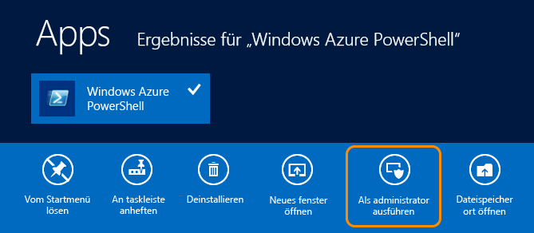

<properties linkid="dev-nodejs-getting-started" urlDisplayName="Cloud Service" pageTitle="Node.js Getting Started Guide - Azure Tutorial" metaKeywords="Azure node.js getting started, Azure Node.js tutorial, Azure Node.js tutorial" description="An end-to-end tutorial that helps you develop a simple Node.js web application and deploy it to Azure." metaCanonical="" services="cloud-services" documentationCenter="Node.js" title="Build and deploy a Node.js application to an Azure Cloud Service" authors="larryfr" solutions="" manager="" editor="" />

Erstellen und Bereitstellen einer Node.js-Anwendung zu einem Azure-Clouddienst
==============================================================================

Nach Durchführung dieser Anleitung werden Sie eine einfache Node.js-Anwendung erhalten, die in einem Azure-Clouddienst ausgeführt wird. Clouddienste sind die Bausteine skalierbarer Cloudanwendungen in Azure. Sie ermöglichen die Trennung und unabhängige Verwaltung und Skalierung von Front-End- und Back-End-Komponenten von Anwendungen. Clouddienste bieten stabile und dedizierte virtuelle Computer, um jede Rolle zuverlässig zu hosten.

Weitere Informationen zu Clouddiensten und einen Vergleich hinsichtlich Azure-Websites und virtuellen Computern finden Sie unter [Azure-Websites, Cloud-Dienste und virtuelle Computer: Wann soll welche Technologie eingesetzt werden?](http://msdn.microsoft.com/de-de/library/windowsazure/jj218759.aspx)

**Möchten Sie eine einfache Website erstellen?**

Wenn Ihr Szenario nur ein einfaches Website-Front-End umfasst, [sollten Sie die Verwendung einer einfachen Azure-Website ins Auge fassen.](../create-a-website-(mac)) Sie können einen Clouddienst leicht upgraden, wenn die Website größer wird und sich Ihre Anforderungen ändern.

In diesem Lernprogramm werden Sie eine einfache Webanwendung erstellen, die in einer Webrolle gehostet wird. Sie werden den Serveremulator verwenden, um die Anwendung lokal zu testen. Anschließend werden Sie diese mithilfe der PowerShell-Befehlszeilentools bereitstellen.

Unten finden Sie einen Screenshot der fertig gestellten Anwendung:

Erstellen einer neuen Knotenanwendung
-------------------------------------

Führen Sie folgende Aufgaben durch, um ein neues Azure-Clouddienstprojekt sowie ein grundlegendes Node.js-Gerüst zu erstellen:

1.  Suchen Sie im **Startmenü** oder auf der **Startseite** nach **Azure PowerShell**. Klicken Sie dann mit der rechten Maustaste auf **Azure PowerShell**, und wählen Sie **Als Administrator ausführen**.

    

    [WACOM.INCLUDE [install-dev-tools](../includes/install-dev-tools.md)]

2.  Erstellen Sie ein neues **Knotenverzeichnis** auf dem Laufwerk C, und ändern Sie es in c:\\node directory:

    

3.  Geben Sie das folgende Cmdlet ein, um eine neue Lösung zu erstellen:

        PS C:\node> New-AzureServiceProject helloworld

        Sie werden folgende Antwort erhalten:

    

    Das Cmdlet **New-AzureServiceProject** generiert eine einfache Struktur für die Erstellung einer neuen Azure-Knotenanwendung, die in einem Clouddienst veröffentlicht wird. Darin sind Konfigurationsdateien enthalten, die für die Veröffentlichung in Azure erforderlich sind. Das Cmdlet ändert zudem das Arbeitsverzeichnis in das Verzeichnis des Diensts.

    Die durch das Cmdlet **New-AzureServiceProject** erstellten Dateien sind:

    -   **ServiceConfiguration.Cloud.cscfg**, **ServiceConfiguration.Local.cscfg** und **ServiceDefinition.csdef**. Dies sind Azure-spezifische Dateien, die für die Veröffentlichung der Anwendung erforderlich sind.

    Informationen zu diesen Dateien erhalten Sie unter [Cloud-Dienste](http://msdn.microsoft.com/de-de/library/windowsazure/jj155995.aspx).

    -   **deploymentSettings.json** speichert lokale Einstellungen, die von den Azure PowerShell-Bereitstellungs-Cmdlets verwendet werden.

4.  Geben Sie den folgenden Befehl ein, um eine neue Webrolle mithilfe des Cmdlets **Add-AzureNodeWebRole** hinzuzufügen:

        PS C:\node\helloworld> Add-AzureNodeWebRole

    Sie werden folgende Antwort erhalten:

    

    Das Cmdlet **Add-AzureNodeWebRole** erstellt ein neues Verzeichnis für die Anwendung, und generiert ein Gerüst für eine einfache Node.js-Anwendung. Zudem ändert es die im vorherigen Schritt erstellten Dateien **ServiceConfiguration.Cloud.csfg**, **ServiceConfiguration.Local.csfg** und **ServiceDefinition.csdef**, um Konfigurationseinträge für die neue Rolle hinzuzufügen.

    **Hinweis**

    Wenn Sie keinen Rollennamen eingeben, wird standardmäßig ein Name erstellt. Sie können einen Namen als ersten Parameter für **Add-AzureNodeWebRole** angeben. Zum Beispiel `Add-AzureNodeWebRole MyRole`

5.  Verwenden Sie folgende Befehle, um zum Verzeichnis **WebRole1** zu navigieren, und öffnen Sie dann die Datei **server.js** im Editor.

	PS C:\\node\\helloworld\> cd WebRole1
        PS C:\\node\\helloworld\\WebRole1\> notepad server.js

    Die Datei **server.js** wurde durch das Cmdlet **Add-AzureNodeWebRole** erstellt, und enthält folgenden Startcode. Dieser Code ist ähnlich wie im Hallo Welt-Beispiel auf der [nodejs.org](http://nodejs.org/)-Website, mit folgender Ausnahme:

   	-   Der Port wurde geändert, sodass die Anwendung den korrekten Port finden kann, der ihr durch die Cloud-Umgebung zugewiesen wurde.
   	-   Konsolenprotokollierung wurde entfernt.

	

Lokales Ausführen der Anwendung im Emulator
-------------------------------------------

Eines der durch das Azure-SDK erstellten Tools ist der Azure-Serveremulator, der Ihnen ermöglicht, die Anwendung lokal zu testen. Der Serveremulator simuliert die Umgebung, in der die Anwendung ausgeführt wird, wenn diese in der Cloud bereitgestellt ist. Führen Sie folgende Schritte aus, um die Anwendung im Emulator zu testen.

1.  Schließen Sie den Editor, und wechseln Sie zurück zum Windows PowerShell-Fenster. Geben Sie das folgende Cmdlet ein, um den Dienst im Emulator auszuführen:

        PS C:\node\helloworld\WebRole1> Start-AzureEmulator -Launch

    Der Parameter **-Launch** gibt an, dass die Tools automatisch ein Browserfenster öffnen und die Anwendung anzeigen, sobald diese im Emulator ausgeführt wird. Es wird ein Browser geöffnet, der wie im Screenshot unten "Hallo Welt" anzeigt. Dies zeigt an, dass der Dienst im Serveremulator ausgeführt wird und korrekt läuft.

    

2.  Verwenden Sie den Befehl **Stop-AzureEmulator**, um den Serveremulator anzuhalten:

    PS C:\\node\\helloworld\\WebRole1\> Stop-AzureEmulator

Bereitstellung der Anwendung zu Azure
-------------------------------------

    [WACOM.INCLUDE [create-account-note](../includes/create-account-note.md)]

### Herunterladen der Azure-Veröffentlichungseinstellungen

Um die Anwendung in Azure bereitzustellen, müssen Sie zuerst die Veröffentlichungseinstellungen für Ihr Azure-Abonnement herunterladen. Die folgenden Schritte führen Sie durch diesen Prozess:

1.  Starten Sie im Windows PowerShell-Fenster die Downloadseite, indem Sie folgendes Cmdlet ausführen:

        PS C:\node\helloworld\WebRole1> Get-AzurePublishSettingsFile

    Dadurch wird Ihr Browser zur Downloadseite mit den Veröffentlichungseinstellungen navigieren. Sie werden möglicherweise aufgefordert, sich mit einem Microsoft-Konto anzumelden. Verwenden Sie in diesem Fall das mit Ihrem Azure-Abonnement verknüpfte Konto.

    Speichern Sie das heruntergeladene Profil an einem Datenspeicherort, auf den Sie leicht zugreifen können.

2.  Verwenden Sie im Azure PowerShell-Fenster das folgende Cmdlet, um Windows PowerShell für Node.js-Cmdlets zur Nutzung des heruntergeladenen Azure-Veröffentlichungsprofils zu konfigurieren:

        PS C:\node\helloworld\WebRole1> Import-AzurePublishSettingsFile [Pfad zur Datei]

    **Hinweis**

    Nach dem Importieren der Veröffentlichungseinstellungen sollten Sie die heruntergeladene .publishsettings-Datei löschen, da sie Informationen enthält, die von anderen Personen für den Zugriff auf Ihr Konto verwendet werden können.

### Veröffentlichung zur Anwendung

1.  Veröffentlichen Sie die Anwendung mithilfe des Cmdlet **Publish-AzureServiceProject** wie unten gezeigt.

        PS C:\node\helloworld\WebRole1> Publish-AzureServiceProject -ServiceName NodeHelloWorld -Location "East US" -Launch

    -   Der Parameter **servicename** gibt den Namen an, der für diese Bereitstellung verwendet wurde. Dieser Name muss eindeutig sein, da ansonsten der Veröffentlichungsprozess fehlschlagen wird.

    -   Der Parameter **location** gibt das Rechenzentrum an, in dem die Anwendung gehostet wird. Verwenden Sie das Cmdlet **Get-AzureLocation**, um eine Liste der verfügbaren Rechenzentren anzuzeigen.

    -   Der Parameter **launch** startet den Browser und navigiert zum gehosteten Dienst, nachdem die Bereitstellung erfolgt ist.

    Nach der erfolgreichen Veröffentlichung wird eine Antwort dieser Art angezeigt:

    

    Das Cmdlet **Publish-AzureServiceProject** führt folgende Schritte aus:

2.  Erstellt ein Paket, das in Azure bereitgestellt wird. Das Paket enthält alle Dateien im Ordner der node.js-Anwendung.

3.  Erstellt ein neues **Speicherkonto**, falls noch keines vorhanden ist. Das Azure-Speicherkonto wird verwendet, um das Anwendungspaket während der Bereitstellung zu speichern. Sie können das Speicherkonto problemlos löschen, wenn die Bereitstellung erfolgt ist.

4.  Erstellt einen neuen **Clouddienst**, falls noch keiner vorhanden ist. Ein **Clouddienst** ist der Container, in dem die Anwendung gehostet wird, wenn diese in Azure bereitgestellt wird. Weitere Informationen erhalten Sie unter [Cloud-Dienste](http://msdn.microsoft.com/de-de/library/windowsazure/jj155995.aspx).

5.  Veröffentlicht das Bereitstellungspaket in Azure.

    > [WACOM.NOTE] Es kann nach der ersten Veröffentlichung fünf bis sieben Minuten dauern, bis die Anwendung bereitgestellt wird und verfügbar ist.

    Sobald die Bereitstellung erfolgt ist, wird ein Browserfenster geöffnet und navigiert zum Clouddienst.

    

    Ihre Anwendung läuft jetzt auf Azure!

Anhalten und Löschen Ihrer Anwendung
------------------------------------

Nachdem Sie Ihre Anwendung bereitgestellt haben, möchten Sie diese möglicherweise deaktivieren, um Extrakosten zu vermeiden. Azure berechnet Webrolleninstanzen pro Stunde verbrauchter Serverzeit. Die Serverzeit wird verbraucht, sobald Ihre Anwendung bereitgestellt wurde, selbst wenn die Instanzen nicht ausgeführt werden und gestoppt wurden.

1.  Stoppen Sie im Windows PowerShell-Fenster die im vorherigen Abschnitt erstellte Dienstbereitstellung mit folgendem Cmdlet:

        PS C:\node\helloworld\WebRole1> Stop-AzureService

    Das Stoppen des Diensts kann einige Minuten dauern. Wenn der Dienst gestoppt wurde, erhalten Sie eine entsprechende Nachricht.

    

2.  Um den Dienst zu löschen, rufen Sie folgendes Cmdlet auf:

        PS C:\node\helloworld\WebRole1> Remove-AzureService

    Geben Sie nach entsprechender Aufforderung **Y** ein, um den Dienst zu löschen.

    Das Löschen des Diensts kann einige Minuten dauern. Nachdem der Dienst gelöscht wurde, erhalten Sie eine entsprechende Nachricht.

    

    **Hinweis**

    Durch das Löschen dieses Diensts wird das Speicherkonto, das beim erstmaligen Veröffentlichen des Diensts erstellt wurde, nicht gelöscht, und Sie erhalten weiterhin eine Rechnung über den verwendeten Speicherplatz. Weitere Informationen zum Löschen eines Speicherkontos finden Sie unter [Löschen eines Speicherkontos aus einem Azure-Abonnement](http://msdn.microsoft.com/de-de/library/windowsazure/hh531562.aspx).

