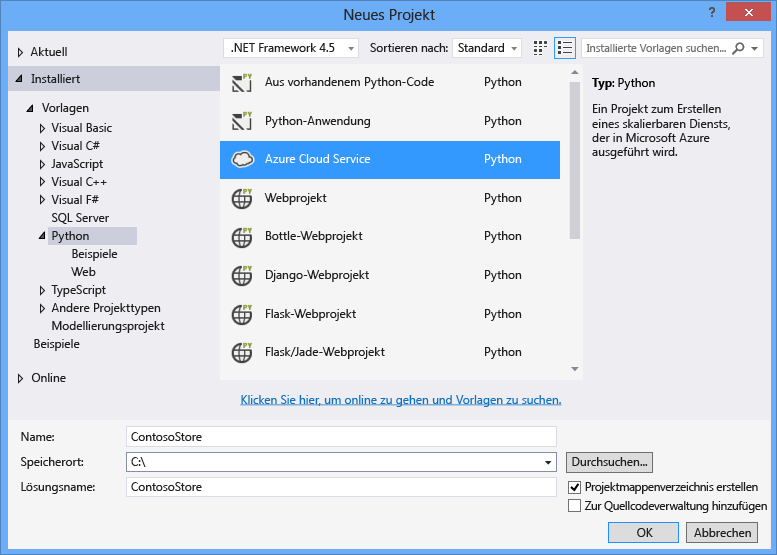
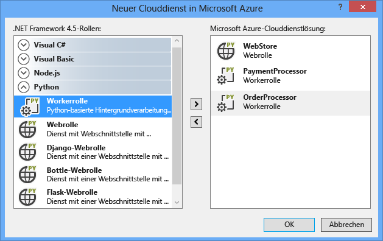
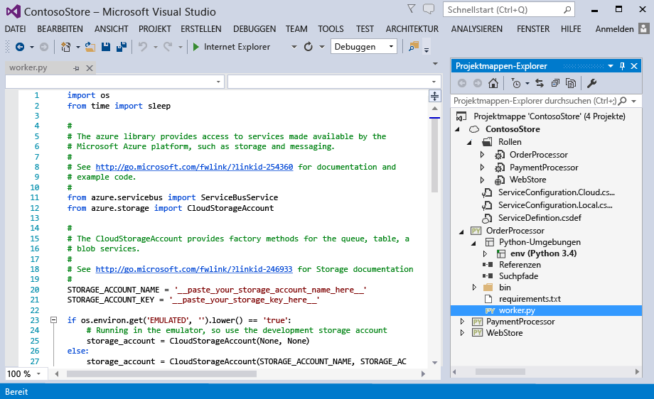
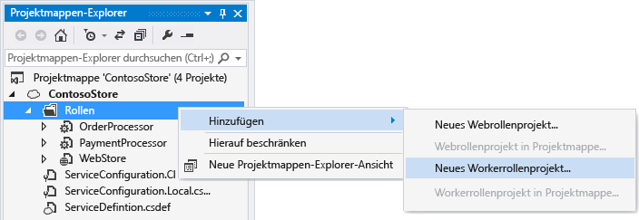
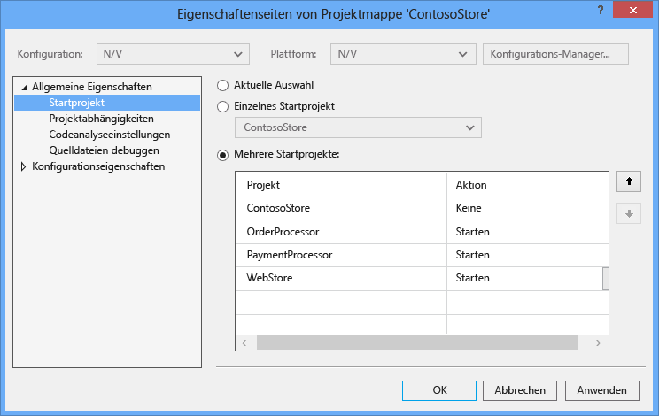
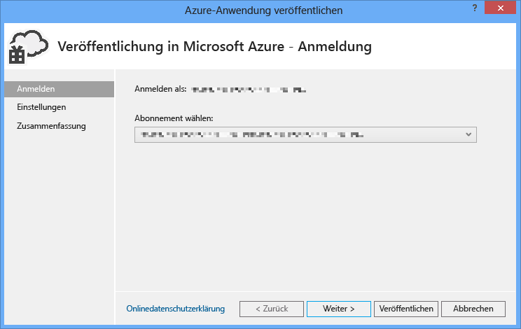
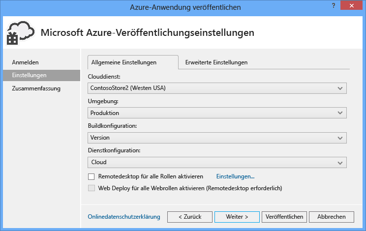
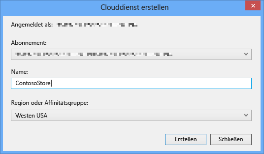
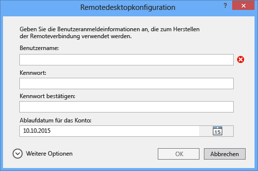
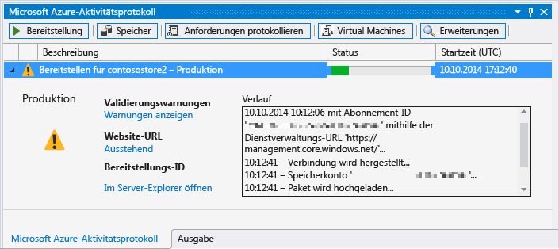

<properties linkid="develop-python-cloud-services-with-ptvs" urlDisplayName="Python Web and Worker Roles with Python Tools 2.1 for Visual Studio" pageTitle="Python-Web- und Workerrollen mit Python-Tools 2.1 für Visual Studio" metaKeywords="Azure python, web role, worker role, PTVS, cloud service" description="Overview of using Python Tools for Visual Studio to create Azure cloud services including web roles and worker roles." metaCanonical="" services="" documentationCenter="Python" title="Python Web and Worker Roles with Python Tools 2.1 for Visual Studio" authors="huvalo" solutions="" manager="wpickett" editor="" />

<tags ms.service="cloud-services" ms.workload="tbd" ms.tgt_pltfrm="na" ms.devlang="python" ms.topic="article" ms.date="10/10/2014" ms.author="huvalo" />

# Python-Web- und Workerrollen mit Python-Tools 2.1 für Visual Studio

Dieser Leitfaden bietet eine Übersicht über die Verwendung von Python-Web- und Workerrollen mit [Python-Tools für Visual Studio][].

+ [Voraussetzungen](#prerequisites)
+ [Was sind Python-Web- und Workerrollen?](#what-are-python-web-and-worker-roles)
+ [Projekterstellung](#project-creation)
+ [Lokales Ausführen](#run-locally)
+ [Veröffentlichen in Azure](#publish-to-azure)
+ [Nächste Schritte](#next-steps)

##Voraussetzungen

 - Visual Studio 2012 oder 2013
 - [Python-Tools 2.1 für Visual Studio][]
 - [Azure-SDK-Tools für VS 2013][] oder [Azure-SDK-Tools für VS 2012][]
 - [Python 2.7 32-Bit][] oder [Python 3.4 32-Bit][]

[WACOM.INCLUDE [create-account-and-websites-note](../includes/create-account-and-websites-note.md)]

##Was sind Python-Web- und Workerrollen?

Azure bietet drei Modelle für die Ausführung von Anwendungen: [Azure-Websites][execution model-web sites], [Azure Virtual Machines][execution model-vms] und [Azure Cloud Services][execution model-cloud services]. Alle drei Modelle unterstützen Python. Cloud Services, welche Web- und Workerrollen enthalten, bieten *Platform as a Service (PaaS)*. In einem Cloud-Dienst bietet eine Webrolle einen speziellen IIS-Webserver (Internet Information Services), um Front-End-Webanwendungen zu hosten, während eine Workerrolle asynchrone, langfristige oder fortwährende Aufgaben ausführen kann, die unabhängig von einer Benutzerinteraktion oder -eingabe sind.

Weitere Informationen finden Sie unter [Was ist ein Cloud-Dienst?].

<strong>Möchten Sie eine einfache Website erstellen?</strong>

Wenn Ihr Szenario nur ein einfaches Website-Front-End umfasst, sollten Sie die Verwendung einer einfachen Azure-Website ins Auge fassen. Sie können einen Cloud-Dienst leicht upgraden, wenn die Website größer wird und sich Ihre Anforderungen ändern. Artikel zur Entwicklung von Azure-Websites finden Sie im <a href="/de-de/develop/python/">Python Developer Center</a> .

 

##Projekterstellung

In Visual Studio können Sie **Azure-Cloud-Dienst** unter **Python** im Dialogfeld **Neues Projekt** auswählen. 

Im Azure-Cloud-Dienst-Assistent können Sie neue Web- und Workerrollen erstellen.

Die Workerrollenvorlage enthält Codebausteine für eine Verbindung mit einem Azure-Speicherkonto oder -Servicebus.

Sie können Web- oder Workerrollen jederzeit zu einem vorhandenen Cloud-Dienst hinzufügen.  Sie können vorhandene Projekte zu Ihrer Lösung hinzufügen oder neue erstellen. 

Ihr Cloud-Dienst kann Rollen enthalten, die in verschiedenen Sprachen implementiert wurden.  Es ist zum Beispiel möglich, dass Sie eine Python-Webrolle haben, die mit Django implementiert wurde, zusammen mit Python- und C#-Workerrollen.  Sie können mit Servicebus-Warteschlangen oder Speicherwarteschlangen einfach zwischen Ihren Rollen kommunizieren.

##Lokales Ausführen

Wenn Sie Ihr Cloud-Dienstprojekt als Startprojekt festlegen und F5 drücken, wird der Cloud-Dienst im lokalen Azure-Emulator ausgeführt.

Auch wenn PTVS den Start im Emulator unterstützt, wird Debugging (Breakpoints, etc) nicht funktionieren.

Um Web- und Workerrollen zu debuggen, können Sie das Rollenprojekt als Startprojekt festlegen und dieses stattdessen debuggen.  Sie können auch mehrere Startprojekte festlegen.  Klicken Sie mit der rechten Maustaste auf die Lösung, und wählen Sie **Startprojekte festlegen** aus.

##Veröffentlichen in Azure

Klicken Sie für die Veröffentlichung mit der rechten Maustaste auf das Cloud-Dienstprojekt in der Lösung, und wählen Sie **Veröffentlichen** aus.

Wählen Sie in der Einstellungsseite den Cloud-Dienst aus, den Sie veröffentlichen möchten.

Sie können einen neuen Cloud-Dienst erstellen, wenn Sie keinen zur Verfügung haben.

Es ist zudem hilfreich, für Debuggingfehler Remotedesktopverbindungen zu den Computern zu aktivieren.

Klicken Sie auf **Veröffentlichen**, wenn Sie mit den Konfigurationseinstellungen fertig sind.

Der Fortschritt wird im Ausgabefenster angezeigt, anschließend wird das Fenster mit dem Microsoft Azure-Aktivitätsprotokoll angezeigt.

Der Abschluss der Bereitstellung dauert einige Minuten, anschließend werden Ihre Web- und/oder Workerrollen in Azure ausgeführt!

##Nächste Schritte

Genauere Informationen zur Arbeit mit Web- und Workerrollen in Python-Tools für Visual Studio finden Sie in der PTVS-Dokumentation:

- [Cloud-Dienstprojekte][]

Weitere Details zur Verwendung von Azure-Diensten Ihrer Web- und Workerrollen, etwa zur Verwendung von Azure-Speicher oder Servicebus, finden Sie in folgenden Anleitungen:
 
- [Blob-Dienst][]
- [Tabellendienst][]
- [Warteschlangendienst][]
- [Servicebus-Warteschlangen][]
- [Servicebus-Themen][]

<!--Link references-->

[Was ist ein Cloud-Dienst?]: /de-de/manage/services/cloud-services/what-is-a-cloud-service/
[Ausführungsmodell-Websites]: /de-de/documentation/articles/fundamentals-application-models/#WebSites
[Ausführungsmodell-VMS]: /de-de/documentation/articles/fundamentals-application-models/#VMachine
[Ausführungsmodell-Cloud-Dienste]: /de-de/documentation/articles/fundamentals-application-models/#CloudServices
[Python Developer Center]: /de-de/develop/python/

[Blob-Dienst]: /de-de/documentation/articles/storage-python-how-to-use-blob-storage/
[Warteschlangendienst]: /de-de/documentation/articles/storage-python-how-to-use-queue-storage/
[Tabellendienst]: /de-de/documentation/articles/storage-python-how-to-use-table-storage/
[Servicebus-Warteschlangen]: /de-de/documentation/articles/service-bus-python-how-to-use-queues/
[Servicebus-Themen]: /de-de/documentation/articles/service-bus-python-how-to-use-topics-subscriptions/

<!--External Link references-->

[Python-Tools für Visual Studio]: http://pytools.codeplex.com
[Python-Tools für Visual Studio-Dokumentation]: http://pytools.codeplex.com/documentation 
[Cloud-Dienstprojekte]: http://pytools.codeplex.com/wikipage?title=Features%20Cloud%20Project

[Python-Tools 2.1 für Visual Studio]: http://go.microsoft.com/fwlink/?LinkId=517189
[Azure-SDK-Tools für VS 2013]: http://go.microsoft.com/fwlink/?LinkId=323510
[Azure-SDK-Tools für VS 2012]: http://go.microsoft.com/fwlink/?LinkId=323511
[Python 2.7 32-Bit]: http://go.microsoft.com/fwlink/?LinkId=517190 
[Python 3.4 32-Bit]: http://go.microsoft.com/fwlink/?LinkId=517191

<!--HONumber=35.1-->
