<properties
	pageTitle="Erste Schritte mit Azure-Clouddiensten und ASP.NET | Microsoft Azure"
	description="Hier erfahren Sie, wie Sie mit ASP.NET MVC und Azure eine Anwendung mit mehreren Ebenen erstellen. Die Anwendung wird in einem Clouddienst mit Webrolle und Workerrolle ausgeführt. Sie verwendet Entity Framework, SQL-Datenbank und Azure Storage-Warteschlangen und -Blobs."
	services="cloud-services, storage"
	documentationCenter=".net"
	authors="tdykstra"
	manager="wpickett"
	editor="mollybos"/>

<tags
	ms.service="cloud-services"
	ms.workload="tbd"
	ms.tgt_pltfrm="na"
	ms.devlang="dotnet"
	ms.topic="hero-article"
	ms.date="09/01/2015"
	ms.author="tdykstra"/>

# Erste Schritte mit Azure-Clouddiensten und ASP.NET

> [AZURE.SELECTOR]
- [Node.js](cloud-services-nodejs-develop-deploy-app.md)
- [.NET](cloud-services-dotnet-get-started.md)

## Übersicht

Dieses Tutorial behandelt die Erstellung einer .NET-Anwendung mit mehreren Ebenen und einem ASP.NET MVC-Front-End sowie die Bereitstellung dieser Anwendung in einem [Azure-Clouddienst](fundamentals-application-models.md#CloudServices). Die Anwendung verwendet eine [Azure SQL-Datenbank](http://msdn.microsoft.com/library/azure/ee336279), den [Azure-Blobdienst](http://www.asp.net/aspnet/overview/developing-apps-with-windows-azure/building-real-world-cloud-apps-with-windows-azure/unstructured-blob-storage) und den [Azure-Warteschlangendienst](http://www.asp.net/aspnet/overview/developing-apps-with-windows-azure/building-real-world-cloud-apps-with-windows-azure/queue-centric-work-pattern). Sie können das [Visual Studio-Projekt](http://code.msdn.microsoft.com/Simple-Azure-Cloud-Service-e01df2e4) aus dem MSDN-Codekatalog herunterladen.

In diesem Tutorial erfahren Sie, wie Sie die Anwendung erstellen und lokal ausführen, in Azure bereitstellen und in der Cloud ausführen und zuletzt auch von Grund auf erstellen können. Sie können auch mit der Erstellung von Grund auf beginnen und die Test- und Bereitstellungsschritte anschließend ausführen.

## Contoso Ads-Anwendung

Bei dieser Anwendung handelt es sich um ein Bulletin Board für Werbung. Benutzer können eine Werbung erstellen, indem sie Text eingeben und ein Bild hochladen. Die Anwendung zeigt eine Liste von Werbeeinblendungen mit Miniaturbildern an, und Benutzer können auf eine Werbung klicken, um das Bild in voller Größe anzuzeigen.

Die Anwendung verwendet das [warteschlangenorientierte Arbeitsmuster](http://www.asp.net/aspnet/overview/developing-apps-with-windows-azure/building-real-world-cloud-apps-with-windows-azure/queue-centric-work-pattern), um die CPU-intensive Last der Erstellung von Miniaturbildern an einen Back-End-Prozess auszulagern.

## Alternative Architektur: Websites und WebJobs

In diesem Tutorial erfahren Sie, wie Sie Front-End und Back-End in einem Azure-Clouddienst ausführen können. Alternativ können Sie das Front-End in einer [Azure-Website](/services/web-sites/) ausführen und die [WebJobs](http://go.microsoft.com/fwlink/?LinkId=390226)-Funktion (momentan in der Vorschauphase) für das Back-End verwenden. Ein Tutorial zu WebJobs finden Sie unter [Erste Schritte mit dem Azure WebJobs SDK](../websites-dotnet-webjobs-sdk-get-started.md). Informationen zur Auswahl der optimalen Dienste für Ihr Szenario finden Sie unter [Vergleich von Websites, Clouddiensten und virtuellen Computern in Azure](../choose-web-site-cloud-service-vm.md).

## Sie lernen Folgendes

* Ermöglichen der Azure-Entwicklung auf Ihrem Computer durch Installieren des Azure SDK
* Erstellen eines Clouddienst-Projekts in Visual Studio mit einer ASP.NET MVC-Webrolle und einer Workerrolle.
* Lokale Tests des Clouddienstprojekts mithilfe des Azure-Speicheremulators.
* Veröffentlichen des Cloudprojekts in einem Azure-Clouddienst und Tests mit einem Azure-Speicherkonto.
* Hochladen von Dateien und Speicherung der Dateien im Azure-Blobdienst.
* Verwenden des Azure-Warteschlangendiensts für die Kommunikation zwischen Ebenen.

## Voraussetzungen

Dieses Tutorial setzt voraus, dass Sie mit den [Grundkonzepten von Azure-Clouddiensten](fundamentals-application-models.md#CloudServices) wie z. B. den Begriffen *Webrollen* und *Workerrollen* vertraut sind. Außerdem wird vorausgesetzt, dass Sie mit der Arbeit mit [ASP.NET MVC](http://www.asp.net/mvc/tutorials/mvc-5/introduction/getting-started)- oder [Web Forms](http://www.asp.net/web-forms/tutorials/aspnet-45/getting-started-with-aspnet-45-web-forms/introduction-and-overview)-Projekten in Visual Studio vertraut sind. Die Beispielanwendung verwendet MVC, aber ein Großteil des Tutorial gilt auch für Web Forms.

Sie können die Anwendung ohne Azure-Abonnement lokal ausführen, aber für die Bereitstellung der Anwendung in der Cloud benötigen Sie ein Abonnement. Wenn Sie kein Konto haben, können Sie [Ihre MSDN-Abonnentenvorteile aktivieren](/pricing/member-offers/msdn-benefits-details/?WT.mc_id=A55E3C668) oder [sich für eine kostenlose Testversion registrieren](/pricing/free-trial/?WT.mc_id=A55E3C668).

Die Anweisungen im Tutorial funktionieren mit den folgenden beiden Produkten:

* Visual Studio 2013
* Visual Studio 2013 Express für das Web

Falls Sie keines dieser Produkte haben, wird Visual Studio 2013 Express für das Web zusammen mit dem Azure SDK installiert.

## Anwendungsarchitektur

Die Anwendung speichert Werbungen in einer SQL-Datenbank und verwendet Entity Framework Code First, um Tabellen zu erstellen und auf Daten zuzugreifen. Pro Werbung werden in der Datenbank zwei URLs gespeichert, eine für das Bild in voller Größe und eine für die Miniaturansicht.

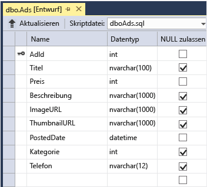

Wenn ein Benutzer ein Bild hochlädt, speichert das in einer Webrolle ausgeführte Front-End das Bild in einem [Azure-Blob](http://www.asp.net/aspnet/overview/developing-apps-with-windows-azure/building-real-world-cloud-apps-with-windows-azure/unstructured-blob-storage) und speichert die Werbeinformationen in der Datenbank zusammen mit einer URL, die auf das Blob zeigt. Gleichzeitig wird eine Nachricht in eine Azure-Warteschlange geschrieben. Ein in einer Workerrolle ausgeführter Back-End-Prozess prüft die Warteschlange regelmäßig auf neue Nachrichten. Wenn eine neue Nachricht vorhanden ist, erstellt die Workerrolle eine Miniaturansicht für das Bild und aktualisiert das entsprechende Datenbankfeld mit der URL für diese Werbung. Das folgende Diagramm zeigt die Interaktion der verschiedenen Anwendungskomponenten:

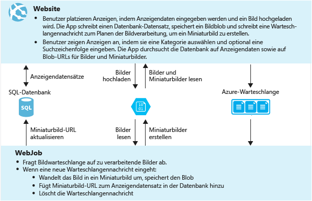

[AZURE.INCLUDE [install-sdk-2013-only](../../includes/install-sdk-2013-only.md)]

## Herunterladen und Ausführen der abgeschlossenen Lösung

1. Laden Sie die [abgeschlossene Lösung](http://code.msdn.microsoft.com/Simple-Azure-Cloud-Service-e01df2e4) herunter und entzippen Sie das Archiv.

2. Starten Sie Visual Studio.

3. Wählen Sie im Menü **Datei** die Option **Projekt öffnen**, navigieren Sie zu dem Ort, an dem Sie die Lösung gespeichert haben und öffnen Sie die Lösungsdatei.

3. Drücken Sie STRG+UMSCH+B, um die Lösung zu erstellen.

	Standardmäßig stellt Visual Studio den Inhalt des NuGet-Pakets automatisch wieder her, das nicht in der *.zip*-Datei enthalten war. Wenn die Pakete nicht wiederhergestellt werden, installieren Sie diese manuell, indem Sie das Dialogfeld **NuGet-Pakete verwalten** öffnen und rechts oben auf **Wiederherstellen** klicken.

3. Vergewissern Sie sich im **Projektmappen-Explorer**, dass **ContosoAdsCloudService** als Startprojekt ausgewählt ist.

1. Drücken Sie STRG+F5, um die Anwendung auszuführen.

	Wenn Sie ein Clouddienst-Projekt lokal ausführen, startet Visual Studio automatisch Azure-*Serveremulator* und Azure-*Speicheremulator*. Der Serveremulator verwendet die Ressourcen Ihres Computers, um die Umgebungen von Web- und Workerrolle zu simulieren. Der Speicheremulator verwendet eine [SQL Server Express LocalDB](http://msdn.microsoft.com/library/hh510202.aspx)-Datenbank, um den Azure-Cloudspeicher zu simulieren.

	Wenn Sie ein Clouddienstprojekt zum ersten Mal ausführen, kann der Start der Emulatoren ca. eine Minute in Anspruch nehmen. Wenn die Emulatoren gestartet sind, wird der Standardbrowser mit der Startseite der Anwendung geöffnet.

	

2. Klicken Sie auf **Werbung erstellen**.

2. Geben Sie einige Testdaten ein, wählen Sie ein hochzuladendes *.jpg*-Bild aus, und klicken Sie auf **Erstellen**.

	

	Die Anwendung wechselt zur Indexseite, zeigt jedoch noch keine Miniaturansicht für die neue Werbung an, da diese Verarbeitung noch nicht erfolgt ist.

3. Warten Sie einen Moment und aktualisieren Sie die Indexseite, um die Miniaturansicht zu sehen.

	

4. Klicken Sie auf **Details** für Ihre Werbung, um das Bild in voller Größe anzuzeigen.

	

Sie haben die Anwendung bislang komplett auf Ihrem lokalen Computer ausgeführt, ohne Verbindung mit der Cloud. Der Speicheremulator speichert die Warteschlangen- und Blobdaten in einer SQL Server Express LocalDB-Datenbank, und die Anwendung speichert die Werbedaten in einer weiteren LocalDB-Datenbank. Entity Framework Code First hat die Werbedatenbank automatisch erstellt, als die Webanwendung zum ersten Mal versucht hat, darauf zuzugreifen.

Im folgenden Abschnitt werden Sie die Lösung so konfigurieren, dass diese Azure-Cloudressourcen für Warteschlangen, Blobs und die Anwendungsdatenbank verwendet, wenn sie in der Cloud ausgeführt wird. Sie könnten die Anwendung auch weiterhin lokal ausführen und Speicher- und Datenbankressourcen in der Cloud verwenden, all dies lässt sich über Verbindungszeichenfolgen konfigurieren.

## Bereitstellen der Anwendung in Azure

Führen Sie folgende Schritte aus, um die Anwendung in der Cloud auszuführen:

* Erstellen eines Azure-Clouddiensts
* Erstellen einer Azure SQL-Datenbank
* Erstellen eines Azure-Speicherkontos
* Konfigurieren der Lösung zur Verwendung Ihrer Azure SQL-Datenbank bei der Ausführung in Azure
* Konfigurieren der Lösung zur Verwendung Ihres Azure-Speicherkontos bei der Ausführung in Azure
* Bereitstellen des Projekts in Ihrem Azure-Clouddienst

### Erstellen eines Azure-Clouddiensts

Ein Azure-Clouddienst ist die Umgebung, in der die Anwendung ausgeführt wird.

1. Öffnen Sie das [klassische Azure-Portal](http://manage.windowsazure.com) in Ihrem Browser.

2. Klicken Sie auf **Neu > Compute > Clouddienst > Benutzerdefiniert erstellen**.

4. Geben Sie ein URL-Präfix in das URL-Eingabefeld ein.

	Diese URL muss eindeutig sein. Sie erhalten eine Fehlermeldung, falls das eingegebene Präfix bereits von einer anderen Person verwendet wird.

5. Wählen Sie die Region aus, in der Sie Ihre Anwendung bereitstellen möchten.

	Dieses Feld gibt an, in welchem Datencenter der Clouddienst gehostet wird. Für eine Produktionsanwendung würden Sie die für Ihre Kunden am nächsten gelegene Region auswählen. Wählen Sie für dieses Tutorial die Ihnen am nächsten gelegene Region aus.

6. Klicken Sie auf **Clouddienst erstellen**.

	In der folgenden Abbildung wird ein Clouddienst mit der URL contosoads.cloudapp.net erstellt.

	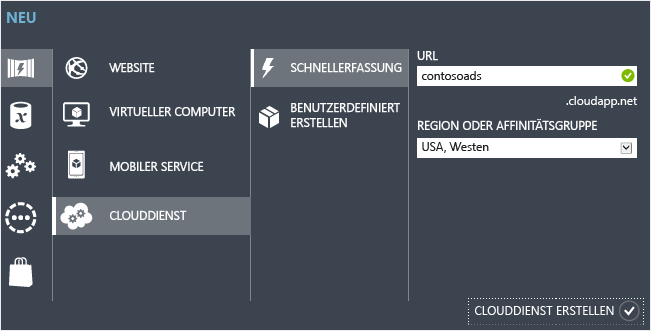

### Erstellen einer Azure SQL-Datenbank

Wenn die Anwendung in der Cloud ausgeführt wird, verwendet sie eine cloudbasierte Datenbank.

1. Klicken Sie im [klassischen Azure-Portal](http://manage.windowsazure.com) auf **Neu > Data Services > SQL-Datenbank > Schnellerfassung**.

1. Geben Sie unter **Datenbankname** den Wert *contosoads* ein.

1. Wählen Sie in der Dropdownliste **Server** den Eintrag **Neuer SQL-Datenbankserver** aus.

	Falls Ihr Konto bereits einen Server enthält, können Sie auch diesen Server aus der Dropdownliste auswählen.

1. Wählen Sie dieselbe **Region** wie für Ihren Clouddienst aus.

	Wenn sich Clouddienst und Datenbank in unterschiedlichen Datencentern (d. h. unterschiedlichen Regionen) befinden, steigt die Latenz an und Sie müssen für die Bandbreite außerhalb des Datencenters bezahlen. Die Bandbreite innerhalb eines Datencenters ist kostenlos.

1. Geben Sie unter **Anmeldename** und **Kennwort** die Anmeldedaten eines Administrators ein.

	Wenn Sie **New SQL Database server** ausgewählt haben, geben Sie hier keinen vorhandenen Namen und kein vorhandenes Kennwort ein. Stattdessen definieren Sie jetzt einen neuen Namen und ein neues Kennwort zur späteren Verwendung beim Datenbankzugriff. Wenn Sie einen zuvor erstellten Server ausgewählt haben, werden Sie aufgefordert, das Kennwort für den zuvor erstellten Administratorbenutzer einzugeben.

1. Klicken Sie auf **SQL-Datenbank erstellen**.

	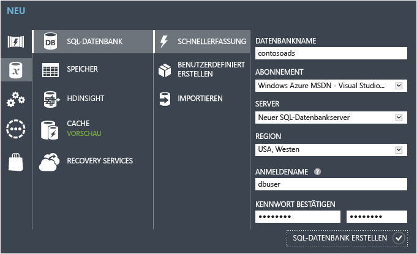

1. Wenn Azure die Datenbank erstellt hat, klicken Sie auf die Registerkarte **SQL-Datenbanken** im linken Bereich des Portals, und klicken Sie dann auf den Namen der neuen Datenbank.

2. Klicken Sie auf die Registerkarte **Dashboard**.

3. Klicken Sie auf **Zulässige IP-Adressen verwalten**.

4. Ändern Sie unter **Zulässige Dienste** die Einstellung für **Azure-Dienste** zu **Ja**.

5. Klicken Sie auf **Speichern**.

### Erstellen eines Azure-Speicherkontos

Azure-Speicherkonten bieten Ressourcen zum Speichern von Warteschlangen- und Blobdaten in der Cloud.

In einer tatsächlichen Anwendung würden Sie normalerweise separate Konten für Anwendungsdaten und Protokolldaten sowie für Test- und Produktionsdaten erstellen. In diesem Tutorial verwenden wir nur ein einziges Konto.

1. Klicken Sie im [klassischen Azure-Portal](http://manage.windowsazure.com) auf **Neu > Data Services > Speicher > Schnellerfassung**.

4. Geben Sie ein URL-Präfix in das **URL**-Eingabefeld ein.

	Dieses Präfix zusammen mit dem Text unterhalb des Eingabefelds ergibt die eindeutige URL Ihres Speicherkontos. Falls das eingegebene Präfix bereits von einer anderen Person verwendet wird, müssen Sie ein anderes Präfix auswählen.

5. Wählen Sie in der Dropdownliste **Region** dieselbe Region aus, die Sie für den Clouddienst ausgewählt haben.

	Wenn sich Clouddienst und Speicherkonto in unterschiedlichen Datencentern (d. h. unterschiedlichen Regionen) befinden, steigt die Latenz an und Sie müssen für die Bandbreite außerhalb des Datencenters bezahlen. Die Bandbreite innerhalb eines Datencenters ist kostenlos.

	Mit Azure-Affinitätsgruppen können Sie die Distanz zwischen Ressourcen in einem Datencenter und somit die Latenz minimieren. Dieses Tutorial verwendet keine Affinitätsgruppen. Anweisungen finden Sie unter [Erstellen einer Affinitätsgruppe in Azure](http://msdn.microsoft.com/library/jj156209.aspx).

6. Wählen Sie in der Dropdownliste **Replikation** den Wert **Lokal redundant** aus.

	Wenn Georeplikation für ein Speicherkonto aktiviert ist, werden dessen Inhalte an ein zweites Datencenter repliziert, um im Katastrophenfall eine Failover-Instanz an diesem zweiten Standort zur Verfügung zu haben. Für die Georeplikation können zusätzliche Kosten anfallen. Für Test- und Entwicklungskonten macht es wenig Sinn, für Georeplikation zu bezahlen. Weitere Informationen finden Sie unter [Erstellen, Verwalten oder Löschen eines Speicherkontos](../storage-create-storage-account/#replication-options).

5. Klicken Sie auf **Speicherkonto erstellen**.

	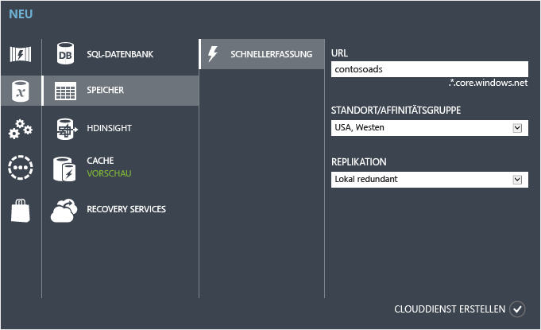

	In der Abbildung wird ein Speicherkonto mit der URL `contosoads.core.windows.net` erstellt.

### Konfigurieren der Lösung zur Verwendung Ihrer Azure SQL-Datenbank bei der Ausführung in Azure

Webprojekt und Workerrollenprojekt haben je eine eigene Verbindungszeichenfolge für die Datenbank. Beide müssen auf die Azure SQL-Datenbank zeigen, wenn die Anwendung in Azure ausgeführt wird.

Sie werden eine [Web.config-Transformation](http://www.asp.net/mvc/tutorials/deployment/visual-studio-web-deployment/web-config-transformations) für die Webrolle und eine Clouddienst-Umgebungseinstellung für die Workerrolle verwenden.

>[AZURE.NOTE]In diesem und im nächsten Abschnitt speichern Sie Anmeldeinformationen in Projektdateien. [Sie sollten keine sensiblen Daten in öffentlichen Quellcode-Repositorys speichern](http://www.asp.net/aspnet/overview/developing-apps-with-windows-azure/building-real-world-cloud-apps-with-windows-azure/source-control#secrets).

1. Öffnen Sie im ContosoAdsWeb-Projekt die *Web.Release.config*-Transformationsdatei für die Anwendungsdatei *Web.config*, löschen Sie den Kommentarblock, der ein `<connectionStrings>`-Element enthält, und fügen Sie den folgenden Code an derselben Stelle ein.

		<connectionStrings>
	        <add name="ContosoAdsContext" connectionString="{connectionstring}"
		    providerName="System.Data.SqlClient" xdt:Transform="SetAttributes" xdt:Locator="Match(name)"/>
		</connectionStrings>

	Lassen Sie die Datei geöffnet.

2. Klicken Sie im [klassischen Azure-Portal](http://manage.windowsazure.com) im linken Bereich auf **SQL-Datenbanken**, klicken Sie auf die Datenbank, die Sie für dieses Tutorial erstellt haben, dann auf die Registerkarte **Dashboard** und dann auf **Verbindungszeichenfolgen anzeigen**.

	

	Die Verbindungszeichenfolgen werden im Portal angezeigt, mit einem Platzhalter für das Kennwort.

	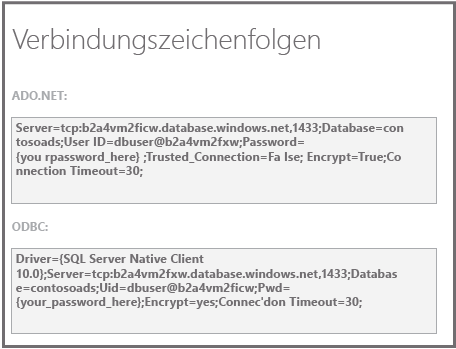

4. Löschen Sie in der Transformationsdatei *Web.Release.config* den Teil `{connectionstring}`, und fügen Sie an dessen Stelle die ADO.NET-Verbindungszeichenfolge aus dem klassischen Azure-Portal ein.

5. Ersetzen Sie in der Verbindungszeichenfolge, die Sie in die Transformationsdatei *Web.Release.config* eingefügt haben, `{your_password_here}` durch das Kennwort, das Sie für die neue SQL-Datenbank eingerichtet haben.

7. Speichern Sie die Datei.

6. Kopieren Sie die Verbindungszeichenfolge (ohne die umgebenden Anführungszeichen), um diese in den folgenden Schritten bei der Konfiguration des Workerrollen-Projekts zur Verfügung zu haben.

5. Klicken Sie im **Projektmappen-Explorer** unter **Rollen** im Clouddienstprojekt mit der rechten Maustaste auf **ContosoAdsWorker**, und klicken Sie auf **Eigenschaften**.

	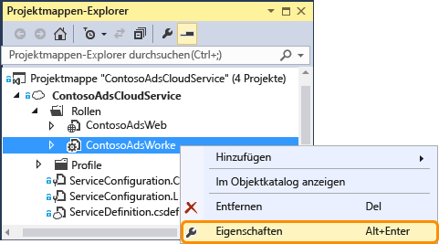

6. Klicken Sie auf die Registerkarte **Einstellungen**.

7. Ändern Sie die **Dienstkonfiguration** zu **Cloud**.

7. Wählen Sie den Text in der `ContosoAdsDbConnectionString`-Einstellung aus, und fügen Sie die Verbindungszeichenfolge ein, die Sie im vorherigen Abschnitt des Tutorials kopiert haben.

	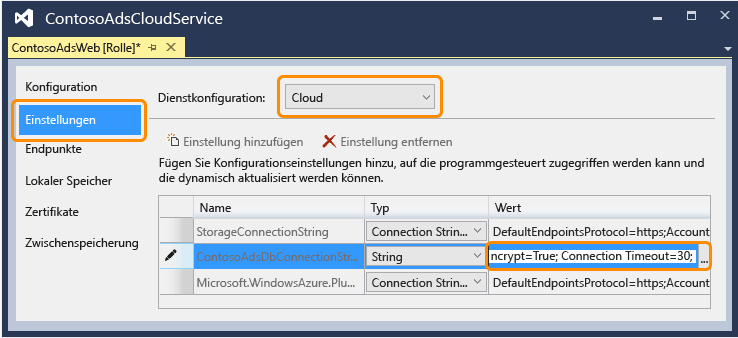

7. Speichern Sie die Änderungen.

### Konfigurieren der Lösung zur Verwendung Ihres Azure-Speicherkontos bei der Ausführung in Azure

Die Verbindungszeichenfolgen für das Azure-Speicherkonto für das Web- und Workerrollenprojekt werden in Umgebungseinstellungen für das Clouddienstprojekt gespeichert. Für jedes Projekt existiert je ein separater Satz von Einstellungen für die lokale Ausführung und die Ausführung in der Cloud. Sie werden die Cloudumgebungseinstellungen für Web- und Workerrollenprojekt ändern.

4. Klicken Sie im **Projektmappen-Explorer** mit der rechten Maustaste auf **ContosoAdsWeb** unter **Rollen** im Projekt **ContosoAdsCloudService**, und klicken Sie dann auf **Eigenschaften**.

	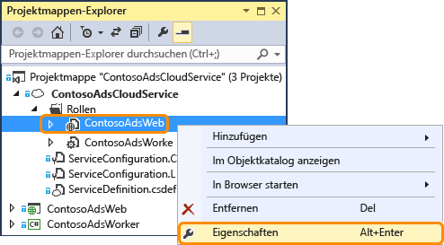

5. Klicken Sie auf die Registerkarte **Einstellungen**. Wählen Sie in der Dropdownliste **Dienstkonfiguration** den Wert **Cloud** aus.

	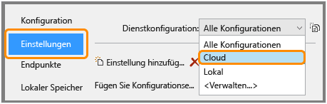

6. Wenn Sie den Eintrag **StorageConnectionString** auswählen, sehen Sie eine elliptische Schaltfläche (**...**) am Ende der Zeile. Klicken Sie auf die elliptische Schaltfläche, um das Dialogfeld **Verbindungszeichenfolge für Speicherkonto erstellen** zu öffnen.

	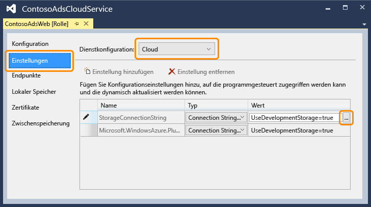

1. Klicken Sie im Dialogfeld **Verbindungszeichenfolge für Speicherkonto** auf **Mit meinem Abonnement**, wählen Sie das zuvor erstellte Speicherkonto aus, und klicken Sie auf **OK**. Falls Sie noch nicht angemeldet sind, werden Sie zur Eingabe Ihrer Azure-Anmeldeinformationen aufgefordert.

	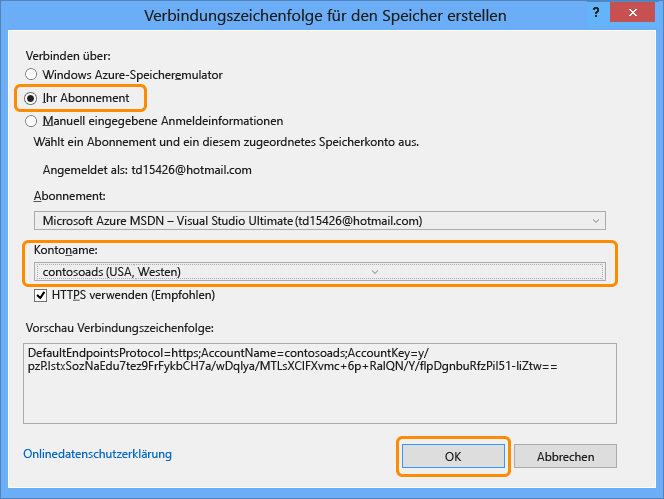

1. Speichern Sie die Änderungen.

2. Führen Sie zum Einrichten der `Microsoft.WindowsAzure.Plugins.Diagnostics.ConnectionString`-Verbindungszeichenfolge die gleichen Schritte aus, die Sie auch für die `StorageConnectionString`-Verbindungszeichenfolge ausgeführt haben.

	Diese Verbindungszeichenfolge wird für die Protokollierung verwendet.

2. Wiederholen Sie die Prozedur, die Sie für die **ContosoAdsWeb**-Rolle verwendet haben, um die beiden Verbindungszeichenfolgen für die **ContosoAdsWorker**-Rolle zu setzen. Vergessen Sie nicht, die **Dienstkonfiguration** auf **Cloud** zu setzen.

Die Einstellungen, die Sie für die Rollenumgebung in der Visual Studio-GUI konfiguriert haben, werden in den folgenden Dateien im ContosoAdsCloudService-Projekt gespeichert:

* *ServiceDefinition.csdef* - Definiert die Einstellungsnamen.
* *ServiceConfiguration.Cloud.cscfg* - Enthält die Werte für die Ausführung der Anwendung in der Cloud.
* *ServiceConfiguration.Local.cscfg* - Enthält die Werte für die lokale Ausführung der Anwendung.

Die "Servicedefinition.csdef" enthält beispielsweise die folgenden Definitionen.

		<ConfigurationSettings>
		  <Setting name="StorageConnectionString" />
		  <Setting name="ContosoAdsDbConnectionString" />
		</ConfigurationSettings>

Und die Datei *ServiceConfiguration.Cloud.cscfg* enthält die Werte, die Sie für diese Einstellungen in Visual Studio eingegeben haben:

		<Role name="ContosoAdsWorker">
		  <Instances count="1" />
		  <ConfigurationSettings>
		    <Setting name="StorageConnectionString" value="{yourconnectionstring}" />
		    <Setting name="ContosoAdsDbConnectionString" value="{yourconnectionstring}" />
		    <!-- other settings not shown -->
		  </ConfigurationSettings>
		  <!-- other settings not shown -->
		</Role>

Die `<Instances>`-Einstellung definiert die Anzahl der virtuellen Computer, auf denen Azure den Code der Workerrolle ausführt. Im Bereich [Nächste Schritte](#next-steps) finden Sie Links zu weiteren Hinweisen zur Skalierung von Clouddiensten.

###  Bereitstellen des Projekts in Azure

3.	Klicken Sie im **Projektmappen-Explorer** mit der rechten Maustaste auf das Cloudprojekt **ContosoAdsCloudService**, und wählen Sie **Veröffentlichen** aus.

	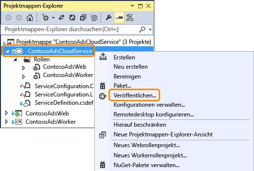

2. Klicken Sie im Schritt **Anmelden** des **Assistenten zum Veröffentlichen einer Azure-Anwendung** auf **Weiter**.

	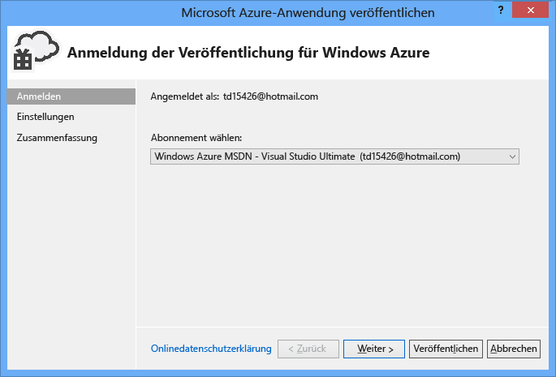

3. Klicken Sie im Schritt **Einstellungen** des Assistenten auf **Weiter**.

	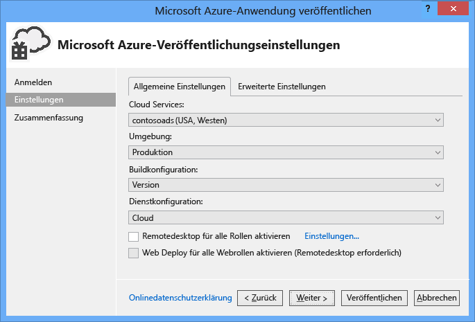

	Die Standardeinstellungen in der Registerkarte **Erweitert** brauchen für dieses Tutorial nicht geändert werden. Weitere Informationen zur Registerkarte Erweitert finden Sie unter [Assistent zum Veröffentlichen einer Azure-Anwendung](http://msdn.microsoft.com/library/hh535756.aspx).

2. Klicken Sie auf der Seite **Zusammenfassung** auf **Veröffentlichen**.

	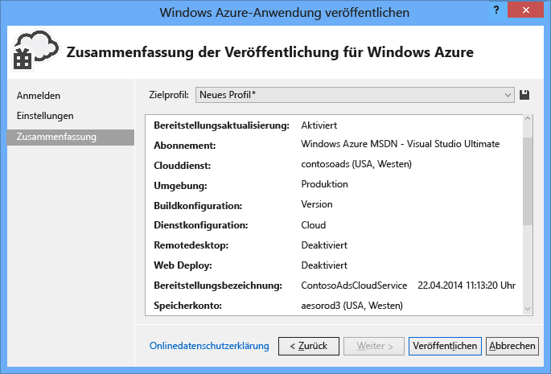

   Das **Azure-Aktivitätsprotokoll** wird in Visual Studio geöffnet.

2. Klicken Sie auf den Pfeil nach rechts, um die Bereitstellungsdetails zu erweitern.

	Die Bereitstellung kann 5 oder mehr Minuten in Anspruch nehmen.

	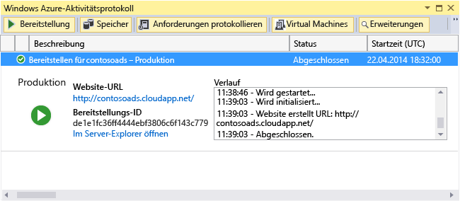

1. Klicken Sie nach Abschluss der Bereitstellung auf die **Website-URL**, um die Anwendung zu starten.

9. Sie können die Anwendung nun testen und Werbungen erstellen, anzeigen und bearbeiten, wie Sie dies bereits bei der lokalen Ausführung getan haben.

>[AZURE.NOTE]Nach Abschluss der Tests sollten Sie den Clouddienst anhalten oder löschen. Selbst wenn Sie den Clouddienst nicht nutzen, fallen Kosten an, da Ressourcen auf virtuellen Computern für den Dienst reserviert sind. Wenn Sie den Dienst laufen lassen, kann jeder, der die URL findet, Werbungen erstellen und anzeigen. Navigieren Sie im [klassischen Azure-Portal](http://manage.windowsazure.com) zur Registerkarte **Dashboard** für Ihren Clouddienst, und klicken Sie am unteren Seitenrand auf **Löschen**. Klicken Sie stattdessen auf **Anhalten**, um vorübergehend zu verhindern, dass andere Personen auf die Website zugreifen. In diesem Fall entstehen weiterhin Kosten. Sie können die SQL-Datenbank und das Speicherkonto auf ähnliche Weise löschen, wenn Sie diese nicht mehr benötigen.

## Neuerstellen der Anwendung

Falls Sie die [komplette Anwendung](http://code.msdn.microsoft.com/Simple-Azure-Cloud-Service-e01df2e4) noch nicht heruntergeladen haben, tun Sie dies jetzt. Sie kopieren Dateien aus dem heruntergeladenen Projekt in das neue Projekt.

Die Erstellung der Contoso-Werbeanwendung umfasst die folgenden Schritte:

* Erstellen einer Clouddienst-Lösung in Visual Studio
* Aktualisieren und Hinzufügen von NuGet-Paketen
* Festlegen von Projektverweisen
* Konfigurieren von Verbindungszeichenfolgen
* Hinzufügen von Codedateien

Nach der Erstellung der Lösung werden Sie den Code prüfen, der speziell für Clouddienst-Projekte, Azure-Blobs und -Warteschlangen gilt.

### Erstellen einer Clouddienst-Lösung in Visual Studio

1. Klicken Sie in Visual Studio im Menü **Datei** auf **Neues Projekt**.

2. Erweitern Sie im linken Bereich des Dialogfelds **Neues Projekt** den Eintrag **Visual C#**, wählen Sie **Cloud**-Vorlagen aus, und klicken Sie auf die Vorlage **Azure Cloud Service**.

3. Geben Sie den Namen ContosoAdsCloudService für Projekt und Lösung ein, und klicken Sie auf **OK**.

	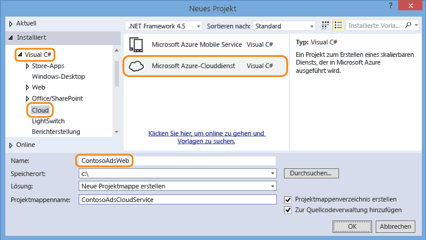

4. Fügen Sie im Dialogfeld **Neuer Azure-Clouddienst** eine Web- und eine Workerrolle hinzu. Nennen Sie die Webrolle ContosoAdsWeb und die Workerrolle ContosoAdsWorker. (Klicken Sie auf das Stiftsymbol auf der rechten Seite, um die Standardnamen der Rollen zu ändern.)

	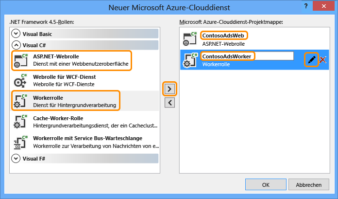

5. Wenn das Dialogfeld **Neues ASP.NET-Projekt** für die Webrolle angezeigt wird, wählen Sie die MVC-Vorlage aus, und klicken Sie auf **Authentifizierung ändern**.

	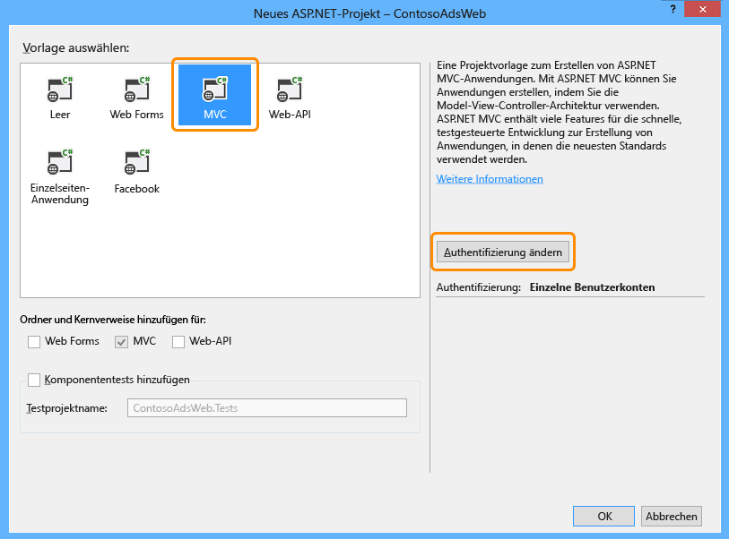

7. Klicken Sie im Dialogfeld **Authentifizierung ändern** auf **Keine Authentifizierung** und dann auf **OK**.

	

8. Klicken Sie im Dialogfeld **Neues ASP.Net-Projekt** auf **OK**.

9. Klicken Sie im **Projektmappen-Explorer** mit der rechten Maustaste auf die Lösung (nicht auf eines der Projekte), und klicken Sie auf **Hinzufügen – Neues Projekt**.

11. Klicken Sie im Dialogfeld **Neues Projekt hinzufügen** unter **Visual C#** im linken Bereich auf **Windows Desktop**, und klicken Sie auf die Vorlage **Klassenbibliothek**.

10. Benennen Sie das Projekt *ContosoAdsCommon*, und klicken Sie auf **OK**.

	Sie müssen in Web- und Workerrolle auf den Entity Framework-Kontext und das Datenmodell verweisen. Alternativ könnten Sie die EF-verwandten Klassen im Webrollen-Projekt definieren und im Workerrollen-Projekt auf dieses Projekt verweisen. In diesem Fall würde Ihr Workerrollenprojekt jedoch auf Webassemblys verweisen, die es nicht benötigt.

### Aktualisieren und Hinzufügen von NuGet-Paketen

11. Öffnen Sie das Dialogfeld **NuGet-Pakete verwalten** für die Lösung.

12. Klicken Sie im linken Bereich auf **Updates**.

13. Suchen Sie das Paket *WindowsAzure.Storage*, und klicken Sie, falls es in der Liste enthalten ist, auf **Update**, um die neueste Version der Speicherclientbibliothek zu installieren.

	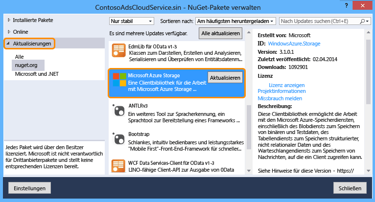

	Die Speicherclient-Bibliothek wird häufiger aktualisiert als die Visual Studio-Projektvorlagen. Daher wird es öfter vorkommen, dass Sie die Version in einem neu erstellten Projekt aktualisieren müssen.

14. Klicken Sie im linken Bereich auf **Online**.

16. Suchen Sie das NuGet-Paket *EntityFramework* und installieren Sie es in allen drei Projekten.

17. Suchen Sie das NuGet-Paket *Microsoft.WindowsAzure.ConfigurationManager*, und installieren Sie es im Workerrollenprojekt.

### Setzen von Projektverweisen

10. Fügen Sie im Projekt ContosoAdsWeb einen Verweis auf das Projekt ContosoAdsCommon ein. Klicken Sie mit der rechten Maustaste auf das Projekt ContosoAdsWeb, und klicken Sie auf **Verweise** – **Verweise hinzufügen**. Wählen Sie im Dialogfeld **Verweis-Manager** im linken Bereich **Projektmappe – Projekte** aus, wählen Sie **ContosoAdsCommon** aus, und klicken Sie auf **OK**.

11. Fügen Sie im Projekt ContosoAdsWorker einen Verweis auf das Projekt ContosoAdsCommon ein.

	ContosoAdsCommon wird Datenmodell und Kontextklasse für das Entity Framework enthalten, das sowohl von Front-End als auch von Back-End verwendet wird.

11. Fügen Sie im Projekt "ContosoAdsWorker" einen Verweis auf `System.Drawing` ein.

	Diese Assembly wird vom Back-End für die Konvertierung von Bildern zu Miniaturansichten verwendet.

### Konfigurieren von Verbindungszeichenfolgen

In diesem Abschnitt konfigurieren Sie die Verbindungszeichenfolgen für den Azure-Speicher und SQL für lokale Tests. In den Bereitstellungsanweisungen weiter oben in diesem Tutorial wurde beschrieben, wie Sie die Verbindungszeichenfolgen für die Ausführung der Anwendung in der Cloud einrichten.

3. Öffnen Sie im Projekt "ContosoAdsWeb" die Datei "Web.config" der Anwendung, und fügen Sie das folgende `connectionStrings`-Element nach dem `configSections`-Element ein.

		<connectionStrings>
		  <add name="ContosoAdsContext" connectionString="Data Source=(localdb)\v11.0; Initial Catalog=ContosoAds; Integrated Security=True; MultipleActiveResultSets=True;" providerName="System.Data.SqlClient" />
		</connectionStrings>

3. Speichern Sie die Änderungen.

2. Klicken Sie im Projekt ContosoAdsCloudService mit der rechten Maustaste auf ContosoAdsWeb unter **Rollen**, und klicken Sie auf **Eigenschaften**.

	

3. Klicken Sie im **ContosAdsWeb [Rolle]**-Eigenschaftenfenster auf die Registerkarte **Einstellungen**, und klicken Sie auf **Einstellung hinzufügen**.

	Lassen Sie den Wert von **Dienstkonfiguration** auf **Alle Konfigurationen**.

4. Fügen Sie eine neue Einstellung mit dem Namen *StorageConnectionString* hinzu. Setzen Sie **Typ** auf *ConnectionString*, und setzen Sie den **Wert** auf *UseDevelopmentStorage=true*.

	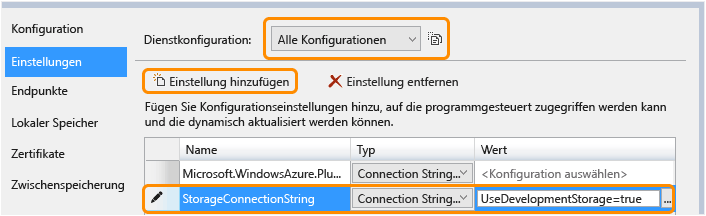

5. Speichern Sie die Änderungen.

3. Wiederholen Sie die Prozedur, mit der Sie eine Speicher-Verbindungszeichenfolge zu den ContosoAdsWorker-Rolleneigenschaften hinzugefügt haben.

5. Fügen Sie ebenfalls im **ContosoAdsWorker [Role]**-Eigenschaftenfenster eine weitere Verbindungszeichenfolge hinzu:

	* Name: ContosoAdsDbConnectionString
	* Typ: Zeichenfolge
	* Wert: Fügen Sie dieselbe Verbindungszeichenfolge ein, die Sie auch für das Webrollenprojekt verwendet haben:

			Data Source=(localdb)\v11.0; Initial Catalog=ContosoAds; Integrated Security=True; MultipleActiveResultSets=True;

### Hinzufügen von Codedateien

In diesem Abschnitt kopieren Sie Codedateien aus der heruntergeladenen Lösung in die neue Lösung. In den folgenden Abschnitten werden die wichtigsten Bereiche des Codes erläutert.

Um Dateien zu einem Projekt oder einem Ordner hinzuzufügen, klicken Sie mit der rechten Maustaste auf das Projekt bzw. den Ordner, und klicken Sie auf **Hinzufügen** - **Vorhandenes Element**. Wählen Sie die gewünschten Dateien aus, und klicken Sie auf **Hinzufügen**. Klicken Sie auf **Ja**, wenn Sie gefragt werden, ob Sie vorhandene Dateien ersetzen möchten.

3. Löschen Sie im Projekt ContosoAdsCommon die Datei *Class1.cs* und fügen Sie an deren Stelle die Dateien *Ad.cs* und *ContosoAdscontext.cs* aus dem heruntergeladenen Projekt hinzu.

3. Fügen Sie im Projekt ContosoAdsWeb die folgenden Dateien aus dem heruntergeladenen Projekt hinzu.
	- *Global.asax.cs*.  
	- Im Ordner *Views\\Shared*: <em>\_Layout.cshtml</em>
	- Im Ordner *Views\\Home*: *Index.cshtml*
	- Im Ordner *Controllers*: *AdController.cs*
	- Im Ordner *Views\\Ad* (Ordner zuerst erstellen): fünf *CSHTML*-Dateien

3. Fügen Sie im Projekt ContosoAdsWorker die Datei *WorkerRole.cs* aus dem heruntergeladenen Projekt hinzu.

Sie können die Anwendung nun anhand der weiter oben in diesem Tutorial beschriebenen Prozedur erstellen und ausführen, und die Anwendung wird eine lokale Datenbank und den Speicheremulator verwenden.

In den folgenden Abschnitten wird der Code für die Arbeit mit Azure-Umgebung, Blobs und Warteschlangen beschrieben. Dieses Tutorial befasst sich nicht mit der Erstellung von MVC-Controllern und -Ansichten mithilfe eines Gerüsts, dem Entity Framework-Code für die Arbeit mit SQL Server-Datenbanken und den Grundsätzen asynchroner Programmierung in ASP.NET 4.5. Informationen zu diesen Themen finden Sie in den folgenden Ressourcen:

* [Erste Schritte mit MVC 5](http://www.asp.net/mvc/tutorials/mvc-5/introduction/getting-started)
* [Erste Schritte mit EF 6 und MVC 5](http://www.asp.net/mvc/tutorials/getting-started-with-ef-using-mvc)
* [Einführung in die asynchrone Programmierung in .NET 4.5](http://www.asp.net/aspnet/overview/developing-apps-with-windows-azure/building-real-world-cloud-apps-with-windows-azure/web-development-best-practices#async).

### ContosoAdsCommon - Ad.cs

Die Datei Ad.cs definiert eine Enumeration für Werbekategorien und eine POCO-Entitätsklasse für Werbeinformationen.

		public enum Category
		{
		    Cars,
		    [Display(Name="Real Estate")]
		    RealEstate,
		    [Display(Name = "Free Stuff")]
		    FreeStuff
		}

		public class Ad
		{
		    public int AdId { get; set; }

		    [StringLength(100)]
		    public string Title { get; set; }

		    public int Price { get; set; }

		    [StringLength(1000)]
		    [DataType(DataType.MultilineText)]
		    public string Description { get; set; }

		    [StringLength(1000)]
		    [DisplayName("Full-size Image")]
		    public string ImageURL { get; set; }

		    [StringLength(1000)]
		    [DisplayName("Thumbnail")]
		    public string ThumbnailURL { get; set; }

		    [DataType(DataType.Date)]
		    [DisplayFormat(DataFormatString = "{0:yyyy-MM-dd}", ApplyFormatInEditMode = true)]
		    public DateTime PostedDate { get; set; }

		    public Category? Category { get; set; }
		    [StringLength(12)]
		    public string Phone { get; set; }
		}

### ContosoAdsCommon - ContosoAdsContext.cs

Die Klasse ContosoAdsContext gibt an, dass die Ad-Klasse in einer DbSet-Sammlung verwendet wird, die von Entity Framework in einer SQL-Datenbank gespeichert wird.

		public class ContosoAdsContext : DbContext
		{
		    public ContosoAdsContext() : base("name=ContosoAdsContext")
		    {
		    }
		    public ContosoAdsContext(string connString)
		        : base(connString)
		    {
		    }
		    public System.Data.Entity.DbSet<Ad> Ads { get; set; }
		}

Die Klasse besitzt zwei Konstruktoren. Der erste Konstruktor wird vom Webprojekt verwendet und gibt den Namen einer Verbindungszeichenfolge an, die in der Datei Web.config gespeichert ist. Mit dem zweiten Konstruktor können Sie die eigentliche Verbindungszeichenfolge übergeben. Diese wird vom Workerrollen-Projekt benötigt, da dieses keine eigene Web.config-Datei hat. Sie haben weiter oben gesehen, wo diese Verbindungszeichenfolge gespeichert wird, und weiter unten werden Sie sehen, wie der Code die Verbindungszeichenfolge beim Instanziieren der DbContext-Klasse abruft.

### ContosoAdsWeb - Global.asax.cs

Der aus der `Application_Start`-Methode aufgerufene Code erstellt einen *images*-Blobcontainer und eine *images*-Warteschlange, falls diese noch nicht vorhanden sind. Damit wird sichergestellt, dass Blobcontainer und Warteschlange immer automatisch erstellt werden, wenn Sie ein neues Speicherkonto verwenden oder den Speicheremulator auf einem neuen Computer verwenden.

Der Code verwendet die Speicher-Verbindungszeichenfolge aus der *.cscfg*-Datei für den Zugriff auf das Speicherkonto.

		var storageAccount = CloudStorageAccount.Parse
		    (RoleEnvironment.GetConfigurationSettingValue("StorageConnectionString"));

Anschließend ruft er einen Verweis auf den *images*-Blobcontainer ab, erstellt den Container, falls dieser noch nicht existiert, und setzt die Zugriffsberechtigungen für den neuen Container. Standardmäßig erlauben neue Container nur Clients mit Speicherkonto-Anmeldeinformationen den Zugriff auf Blobs. Für die Website müssen die Blobs öffentlich sein, um die Bilder mithilfe der URLs anzuzeigen, die auf die Bild-Blobs zeigen.

		var blobClient = storageAccount.CreateCloudBlobClient();
		var imagesBlobContainer = blobClient.GetContainerReference("images");
		if (imagesBlobContainer.CreateIfNotExists())
		{
		    imagesBlobContainer.SetPermissions(
		        new BlobContainerPermissions
		        {
		            PublicAccess =BlobContainerPublicAccessType.Blob
		        });
		}

Ein ähnlicher Codeteil ruft einen Verweis auf die *images*-Warteschlange ab und erstellt eine neue Warteschlange. In diesem Fall sind keine Berechtigungsänderungen erforderlich.

		CloudQueueClient queueClient = storageAccount.CreateCloudQueueClient();
		var imagesQueue = queueClient.GetQueueReference("images");
		imagesQueue.CreateIfNotExists();

### ContosoAdsWeb - \_Layout.cshtml

Die *\_Layout.cshtml*-Datei setzt den App-Namen in Kopf- und Fußzeile und erstellt einen "Ads"-Menüeintrag.

### ContosoAdsWeb - Views\\Home\\Index.cshtml

Die *Views\\Home\\Index.cshtml*-Datei zeigt Links zu den Kategorien auf der Startseite an. Die Links übergeben den ganzzahligen Wert aus der `Category`-Enumeration in einer querystring-Variable an die Ads-Indexseite.

		<li>@Html.ActionLink("Cars", "Index", "Ad", new { category = (int)Category.Cars }, null)</li>
		<li>@Html.ActionLink("Real estate", "Index", "Ad", new { category = (int)Category.RealEstate }, null)</li>
		<li>@Html.ActionLink("Free stuff", "Index", "Ad", new { category = (int)Category.FreeStuff }, null)</li>
		<li>@Html.ActionLink("All", "Index", "Ad", null, null)</li>

### ContosoAdsWeb - AdController.cs

In der *AdController.cs*-Datei ruft der Konstruktor die `InitializeStorage`-Methode auf, um Objekte der Azure-Speicherclient-Bibliothek zu erstellen, die eine API für die Arbeit mit Blobs und Warteschlangen bereitstellen.

Anschließend ruft der Code einen Verweis auf den *images*-Blobcontainer ab, wie weiter oben in *Global.asax.cs* gezeigt. Gleichzeitig wird eine angemessene Standard-[Wiederholungs-Richtlinie](http://www.asp.net/aspnet/overview/developing-apps-with-windows-azure/building-real-world-cloud-apps-with-windows-azure/transient-fault-handling) für eine Webanwendung gesetzt. Mit der Standardrichtlinie (exponentiell ansteigende Wartezeiten) kann es passieren, dass die Webanwendung im Fall eines vorübergehenden Fehlers über eine Minute lang stehen bleibt. Die hier gezeigte Richtlinie wartet 3 Sekunden nach jedem Versuch für bis zu 3 Versuche.

		var blobClient = storageAccount.CreateCloudBlobClient();
		blobClient.RetryPolicy = new LinearRetry(TimeSpan.FromSeconds(3), 3);
		imagesBlobContainer = blobClient.GetContainerReference("images");

Ein ähnlicher Codeteil ruft einen Verweis auf die *images*-Warteschlange ab.

		CloudQueueClient queueClient = storageAccount.CreateCloudQueueClient();
		queueClient.RetryPolicy = new LinearRetry(TimeSpan.FromSeconds(3), 3);
		imagesQueue = queueClient.GetQueueReference("images");

Ein Großteil des Controller-Codes ist typisch für die Arbeit mit einem Entity Framework-Datenmodell und einer DbContext-Klasse. Eine Ausnahme ist die HttpPost `Create`-Methode, die eine Datei hochlädt und im Blobspeicher ablegt. Die Modellbindung stellt ein [HttpPostedFileBase](http://msdn.microsoft.com/library/system.web.httppostedfilebase.aspx)-Objekt für die Methode bereit.

		[HttpPost]
		[ValidateAntiForgeryToken]
		public async Task<ActionResult> Create(
		    [Bind(Include = "Title,Price,Description,Category,Phone")] Ad ad,
		    HttpPostedFileBase imageFile)

Wenn ein Benutzer eine hochzuladende Datei auswählt, lädt der Code die Datei hoch, speichert sie in einem Blob und aktualisiert den Ad-Datenbankeintrag mit einer URL, die auf den Blob zeigt.

		if (imageFile != null && imageFile.ContentLength != 0)
		{
		    blob = await UploadAndSaveBlobAsync(imageFile);
		    ad.ImageURL = blob.Uri.ToString();
		}

Der Code für den Upload befindet sich in der `UploadAndSaveBlobAsync`-Methode. Er erstellt einen GUID-Namen für den Blob, lädt die Datei hoch und speichert sie, und gibt einen Verweis auf den gespeicherten Blob zurück.

		private async Task<CloudBlockBlob> UploadAndSaveBlobAsync(HttpPostedFileBase imageFile)
		{
		    string blobName = Guid.NewGuid().ToString() + Path.GetExtension(imageFile.FileName);
		    CloudBlockBlob imageBlob = imagesBlobContainer.GetBlockBlobReference(blobName);
		    using (var fileStream = imageFile.InputStream)
		    {
		        await imageBlob.UploadFromStreamAsync(fileStream);
		    }
		    return imageBlob;
		}

Nachdem mit HttpPost `Create`-Methode ein Blob hochgeladen und die Datenbank aktualisiert wurde, wird eine Nachricht in der Warteschlange erstellt, um den Back-End-Prozess darüber zu informieren, dass ein Bild für die Konvertierung in eine Miniaturansicht vorliegt.

		string queueMessageString = ad.AdId.ToString();
		var queueMessage = new CloudQueueMessage(queueMessageString);
		await queue.AddMessageAsync(queueMessage);

Der Code für die HttpPost `Edit`-Methode ist ähnlich, nur müssen hier alle vorhandenen Blobs gelöscht werden, wenn der Benutzer eine neue Bilddatei auswählt.

		if (imageFile != null && imageFile.ContentLength != 0)
		{
		    await DeleteAdBlobsAsync(ad);
		    imageBlob = await UploadAndSaveBlobAsync(imageFile);
		    ad.ImageURL = imageBlob.Uri.ToString();
		}

Das nächste Beispiel zeigt den Code, der Blobs löscht, wenn Sie eine Werbeanzeige löschen.

		private async Task DeleteAdBlobsAsync(Ad ad)
		{
		    if (!string.IsNullOrWhiteSpace(ad.ImageURL))
		    {
		        Uri blobUri = new Uri(ad.ImageURL);
		        await DeleteAdBlobAsync(blobUri);
		    }
		    if (!string.IsNullOrWhiteSpace(ad.ThumbnailURL))
		    {
		        Uri blobUri = new Uri(ad.ThumbnailURL);
		        await DeleteAdBlobAsync(blobUri);
		    }
		}
		private static async Task DeleteAdBlobAsync(Uri blobUri)
		{
		    string blobName = blobUri.Segments[blobUri.Segments.Length - 1];
		    CloudBlockBlob blobToDelete = imagesBlobContainer.GetBlockBlobReference(blobName);
		    await blobToDelete.DeleteAsync();
		}

### ContosoAdsWeb - Views\\Ad\\Index.cshtml und Details.cshtml

Die Datei *Index.cshtml* zeigt Miniaturansichten zusammen mit den restlichen Werbedaten an.

		

Die Datei *Details.cshtml* zeigt das Bild in voller Größe an.

		

### ContosoAdsWeb - Views\\Ad\\Create.cshtml und Edit.cshtml

Die Dateien *Create.cshtml* und *Edit.cshtml* geben die Formularcodierung an, mit der der Controller das `HttpPostedFileBase`-Objekt abruft.

		@using (Html.BeginForm("Create", "Ad", FormMethod.Post, new { enctype = "multipart/form-data" }))

Ein `<input>`-Element weist den Browser an, ein Dateiauswahl-Dialogfeld zu öffnen.

		<input type="file" name="imageFile" accept="image/*" class="form-control fileupload" />

### ContosoAdsWorker - WorkerRole.cs - OnStart-Methode

Die Azure Workerrollen-Umgebung ruft die `OnStart`-Methode in der `WorkerRole`-Klasse auf, wenn die Workerrolle gestartet wird, und ruft die `Run`-Methode auf, wenn die `OnStart`-Methode abgeschlossen wird.

Die `OnStart`-Methode ruft die Datenbank-Verbindungszeichenfolge aus der *CSCFG*-Datei ab und übergibt sie an die DbContext-Klasse des Entity Framework. Der SQLClient-Anbieter wird standardmäßig verwendet, daher muss kein Anbieter angegeben werden.

		var dbConnString = CloudConfigurationManager.GetSetting("ContosoAdsDbConnectionString");
		db = new ContosoAdsContext(dbConnString);

Anschließend ruft die Methode einen Verweis auf das Speicherkonto ab und erstellt Blobcontainer und Warteschlange, falls diese noch nicht existieren. Dieser Code ähnelt dem Code, den Sie bereits in der `Application_Start`-Methode der Webrolle gesehen haben.

### ContosoAdsWorker - WorkerRole.cs - Run-Methode

Die `Run`-Methode wird aufgerufen, wenn die Initialisierung der `OnStart`-Methode abgeschlossen ist. Die Methode führt eine Endlosschleife aus, die nach neuen Nachrichten in der Warteschlange sucht und diese beim Eintreffen verarbeitet.

		public override void Run()
		{
		    CloudQueueMessage msg = null;

		    while (true)
		    {
		        try
		        {
		            msg = this.imagesQueue.GetMessage();
		            if (msg != null)
		            {
		                ProcessQueueMessage(msg);
		            }
		            else
		            {
		                System.Threading.Thread.Sleep(1000);
		            }
		        }
		        catch (StorageException e)
		        {
		            if (msg != null && msg.DequeueCount > 5)
		            {
		                this.imagesQueue.DeleteMessage(msg);
		            }
		            System.Threading.Thread.Sleep(5000);
		        }
		    }
		}

Nach jedem Durchgang der Schleife geht das Programm für eine Sekunde in den Ruhezustand, wenn keine Nachricht gefunden wurde. So wird verhindert, dass die Workerrolle übermäßige Kosten für CPU-Zeit und Speichertransaktionen verursacht. Das Microsoft-Kundenberatungsteam erzählt eine Geschichte von einem Entwickler, der diesen Mechanismus vergessen hat, seine Anwendung bereitgestellt hat und in den Urlaub gefahren ist. Als er zurückkam, war sein Versehen teurer als der gesamte Urlaub.

Manchmal kann der Inhalt einer Nachricht in der Warteschlange einen Verarbeitungsfehler verursachen. Dies nennt man eine *nicht verarbeitbare Nachricht*. Wenn Sie in diesem Fall nur einen Fehler protokollieren und die Schleife neu starten, kann es passieren, dass Sie endlos versuchen, diese Nachricht zu verarbeiten. Daher enthält der catch-Block eine Anweisung, die prüft, wie oft die Anwendung bereits versucht hat, die aktuelle Nachricht zu verarbeiten. Wenn diese Anzahl größer als 5 ist, wird die Nachricht aus der Warteschlange gelöscht.

`ProcessQueueMessage` wird aufgerufen, wenn eine Warteschlangennachricht gefunden wurde.

		private void ProcessQueueMessage(CloudQueueMessage msg)
		{
		    var adId = int.Parse(msg.AsString);
		    Ad ad = db.Ads.Find(adId);
		    if (ad == null)
		    {
		        throw new Exception(String.Format("AdId {0} not found, can't create thumbnail", adId.ToString()));
		    }

		    CloudBlockBlob inputBlob = this.imagesBlobContainer.GetBlockBlobReference(ad.ImageURL);

		    string thumbnailName = Path.GetFileNameWithoutExtension(inputBlob.Name) + "thumb.jpg";
		    CloudBlockBlob outputBlob = this.imagesBlobContainer.GetBlockBlobReference(thumbnailName);

		    using (Stream input = inputBlob.OpenRead())
		    using (Stream output = outputBlob.OpenWrite())
		    {
		        ConvertImageToThumbnailJPG(input, output);
		        outputBlob.Properties.ContentType = "image/jpeg";
		    }

		    ad.ThumbnailURL = outputBlob.Uri.ToString();
		    db.SaveChanges();

		    this.imagesQueue.DeleteMessage(msg);
		}

Der Code liest die Bild-URL aus der Datenbank, konvertiert das Bild zu einer Miniaturansicht, speichert die Miniaturansicht in einem Blob, aktualisiert die Datenbank mit der URL der Miniaturansicht und löscht die Warteschlangen-Nachricht.

>[AZURE.NOTE]Der Code in der `ConvertImageToThumbnailJPG`-Methode verwendet zur Vereinfachung Klassen aus dem System.Drawing-Namespace. Die Klassen in diesem Namespace wurden jedoch für den Einsatz mit Windows Forms entwickelt. Sie werden nicht für die Verwendung in einem Windows- oder ASP.NET-Dienst unterstützt. Weitere Informationen zu Bildverarbeitungsoptionen finden Sie unter [Dynamic Image Generation](http://www.hanselman.com/blog/BackToBasicsDynamicImageGenerationASPNETControllersRoutingIHttpHandlersAndRunAllManagedModulesForAllRequests.aspx) und [Deep Inside Image Resizing](http://www.hanselminutes.com/313/deep-inside-image-resizing-and-scaling-with-aspnet-and-iis-with-imageresizingnet-author-na).

## Problembehandlung

Falls bei der Ausführung der Anweisungen in diesem Tutorial Probleme auftreten, finden Sie hier einige gängige Fehler und Ansätze zu deren Lösung.

### ServiceRuntime.RoleEnvironmentException

Das `RoleEnvironment`-Objekt wird von Azure bereitgestellt, wenn Sie eine Anwendung in Azure ausführen oder den Azure-Serveremulator lokal verwenden. Wenn Sie diesen Fehler bei der lokalen Ausführung erhalten, vergewissern Sie sich, dass Sie das ContosoAdsCloudService-Projekt als Startprojekt gesetzt haben. Damit wird festgelegt, dass die Anwendung im Azure-Serveremulator ausgeführt werden soll.

Die Anwendung verwendet die Azure-Rollenumgebung z. B. zum Abrufen der Verbindungszeichenfolgen aus den *.cscfg*-Dateien. Dieser Fehler kann also auch durch eine fehlende Verbindungszeichenfolge verursacht werden. Stellen Sie sicher, dass Sie die StorageConnectionString-Einstellung sowohl für die lokale als auch für die Cloudkonfiguration im ContosoAdsWeb-Projekt erstellt haben und dass Sie beide Verbindungszeichenfolgen für beide Konfigurationen im ContosoAdsWorker-Projekt erstellt haben. Mit einer **Alles durchsuchen**-Suche nach StorageConnectionString in der gesamten Lösung sollten Sie die Zeichenfolge 9 Mal in 6 Dateien finden.

### Port xxx kann nicht überschrieben werden. Neuer Port unterhalb des zulässigen Mindestwerts 8080 für das HTTP-Protokoll

Versuchen Sie, die Portnummer für das Webprojekt zu ändern. Klicken Sie mit der rechten Maustaste auf das ContosoAdsWeb-Projekt, und klicken Sie auf **Eigenschaften**. Klicken Sie auf die Registerkarte **Web** und ändern Sie die Portnummer in der Einstellung **Project-Url**.

Eine weitere Möglichkeit zur Behebung dieses Problems finden Sie im nächsten Abschnitt.

### Sonstige Fehler bei der lokalen Ausführung

Standardmäßig verwenden neue Clouddienstprojekte den Azure-Serveremulator Express, um die Azure-Umgebung zu simulieren. Dies ist eine abgespeckte Version der Serveremulator-Vollversion. Unter bestimmten Umständen kann es passieren, dass die Vollversion funktioniert und die Express-Version einen Fehler verursacht.

Um das Projekt mit der Emulator-Vollversion zu verwenden, klicken Sie mit der rechten Maustaste auf das ContosoAdsCloudService-Projekt, und klicken anschließend auf **Eigenschaften**. Klicken Sie im **Properties**-Fenster auf die Registerkarte **Web**, und klicken Sie auf das Optionsfeld **Emulator-Vollversion verwenden**.

Um die Anwendung mit der Emulator-Vollversion zu verwenden, müssen Sie Visual Studio mit Administratorrechten öffnen.

## Nächste Schritte

Die Contoso Ads-Anwendung wurde für dieses Tutorial bewusst einfach gehalten. Sie implementiert z. B. keine [Abhängigkeitsinjektion](http://www.asp.net/mvc/tutorials/hands-on-labs/aspnet-mvc-4-dependency-injection) oder [Repository und Arbeitseinheit](http://www.asp.net/mvc/tutorials/getting-started-with-ef-using-mvc/advanced-entity-framework-scenarios-for-an-mvc-web-application#repo), verwendet keine [Schnittstelle für die Protokollierung](http://www.asp.net/aspnet/overview/developing-apps-with-windows-azure/building-real-world-cloud-apps-with-windows-azure/monitoring-and-telemetry#log) und keine [EF Code First-Migrationen](http://www.asp.net/mvc/tutorials/getting-started-with-ef-using-mvc/migrations-and-deployment-with-the-entity-framework-in-an-asp-net-mvc-application) zur Verwaltung von Datenmodellen oder [EF-Verbindungsstabilität](http://www.asp.net/mvc/tutorials/getting-started-with-ef-using-mvc/connection-resiliency-and-command-interception-with-the-entity-framework-in-an-asp-net-mvc-application) für vorübergehende Verbindungsfehler, usw.

Hier finden Sie einige Beispielanwendungen für Clouddienste mit realitätsnäheren Programmierpraktiken, geordnet vom einfachsten hin zum komplexesten Projekt:

* [PhluffyFotos](http://code.msdn.microsoft.com/PhluffyFotos-Sample-7ecffd31). Ähnlich der Contoso Ads-Anwendung, jedoch mit mehr Funktionen und realitätsnäheren Programmierpraktiken.
* [Azure-Clouddienst-Anwendung mit mehreren Ebenen mit Tabellen, Warteschlangen und Blobs](http://code.msdn.microsoft.com/windowsazure/Windows-Azure-Multi-Tier-eadceb36). Einführung in Azure Storage-Tabellen, -Blobs und -Warteschlangen inklusive einer [Schritt-für-Schritt-Anleitungsreihe](../cloud-services-dotnet-multi-tier-app-storage-1-overview.md).
* [Clouddienstgrundlagen in Microsoft Azure](http://code.msdn.microsoft.com/Cloud-Service-Fundamentals-4ca72649). Ein umfassendes Beispiel mit einer breiten Palette bewährter Methoden, erarbeitet von der Microsoft Patterns and Practices-Gruppe.

Weitere Informationen zur Entwicklung für die Cloud finden Sie unter [Erstellen von Cloud-Apps mit Azure](http://www.asp.net/aspnet/overview/developing-apps-with-windows-azure/building-real-world-cloud-apps-with-windows-azure/introduction).

Ein Einführungsvideo zu bewährten Methoden und Vorlagen für Azure Storage finden Sie unter [Microsoft Azure Storage – Neuigkeiten, bewährte Methoden und Vorlagen](http://channel9.msdn.com/Events/Build/2014/3-628).

Weitere Informationen finden Sie in den folgenden Ressourcen:

* [Azure Cloud Services Teil 1: Einführung](http://justazure.com/microsoft-azure-cloud-services-part-1-introduction/)
* [Verwalten von Cloud Services](cloud-services-how-to-manage.md)
* [Azure Storage (in englischer Sprache)](/documentation/services/storage/)

<!---HONumber=AcomDC_1203_2015-->