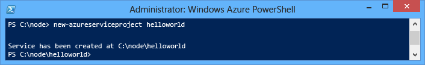
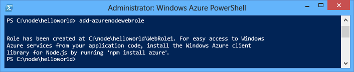
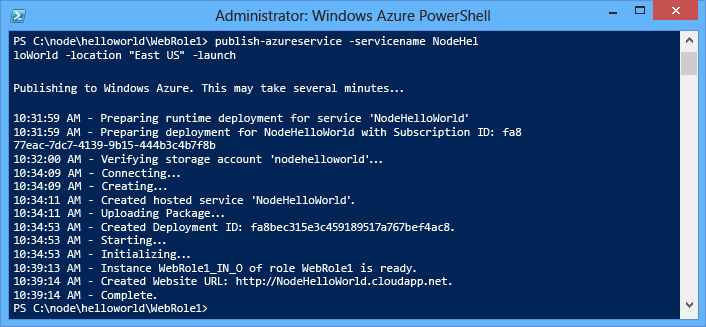
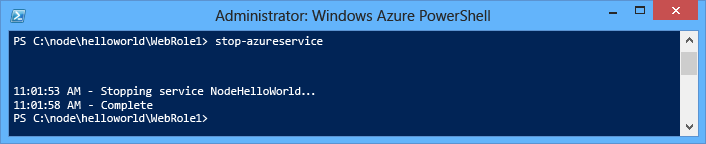
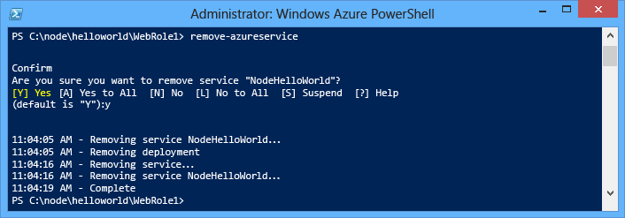

<properties 
	pageTitle="Node.js-Anleitung, erste Schritte - Azure-Lernprogramm" 
	description="Erfahren Sie, wie Sie eine einfache Node.js-Webanwendung erstellen und in einem Azure-Cloud-Dienst bereitstellen können." 
	services="cloud-services" 
	documentationCenter="nodejs" 
	authors="MikeWasson" 
	manager="wpickett" 
	editor=""/>

<tags 
	ms.service="cloud-services" 
	ms.workload="tbd" 
	ms.tgt_pltfrm="na" 
	ms.devlang="nodejs" 
	ms.topic="hero-article" 
	ms.date="02/24/2015" 
	ms.author="mwasson"/>

# Erstellen und Bereitstellen einer Node.js-Anwendung in einem Azure-Cloud-Dienst

> [AZURE.SELECTOR]
- [Node.js](cloud-services-nodejs-develop-deploy-app.md)
- [.NET](cloud-services-dotnet-get-started.md)

Dieses Lernprogramm veranschaulicht, wie Sie eine einfache Node.js-Anwendung erstellen können, die in einem Azure-Cloud-Dienst ausgeführt wird. Clouddienste sind die Bausteine skalierbarer Cloudanwendungen in Azure. Sie ermöglichen die Trennung und unabhängige Verwaltung und Skalierung von Front-End- und Back-End-Komponenten von Anwendungen.  Clouddienste bieten stabile und dedizierte virtuelle Computer, um jede Rolle zuverlässig zu hosten.

Weitere Informationen zu Cloud-Diensten und einen Vergleich hinsichtlich Azure-Websites und virtueller Computern finden Sie unter [Vergleich von Websites, Cloud-Diensten und virtuellen Computern in Azure](http://azure.microsoft.com/documentation/articles/choose-web-site-cloud-service-vm/).

>[AZURE.TIP] Möchten Sie eine einfache Website erstellen? Wenn Ihr Szenario nur ein einfaches Website-Front-End umfasst, sollten Sie die <a href="/documentation/articles/web-sites-nodejs-develop-deploy-mac/">Verwendung einer einfachen Azure-Website</a> ins Auge fassen. Sie können einen Cloud-Dienst leicht upgraden, wenn die Website größer wird und sich Ihre Anforderungen ändern.

In diesem Lernprogramm werden Sie eine einfache Webanwendung erstellen, die in einer Webrolle gehostet wird. Sie werden den Serveremulator verwenden, um die Anwendung lokal zu testen. Anschließend stellen Sie sie mithilfe der PowerShell-Befehlszeilentools bereit.

Die Anwendung ist eine einfache "Hello World"-Anwendung:

## Voraussetzungen

> [AZURE.NOTE] In diesem Lernprogramm wird Azure PowerShell verwendet, für die Windows installiert sein muss.

- Installieren Sie das Azure SDK für Node.js: <a href="http://go.microsoft.com/fwlink/?LinkId=254279">Windows Installer</a> 

- Installieren und konfigurieren Sie [Azure Powershell](../install-configure-powershell.md).

## Erstellen eines Azure-Cloud-Dienstprojekts

Führen Sie folgende Aufgaben durch, um ein neues Azure-Cloud-Dienstprojekt sowie ein einfaches Node.js-Gerüst zu erstellen:

1. Führen Sie **Azure PowerShell** als Administrator aus. (Suchen Sie im **Startmenü** oder auf der **Startseite** nach **Azure PowerShell**.)

2.  Geben Sie das folgende PowerShell-Cmdlet ein, um das Projekt zu erstellen:

        New-AzureServiceProject helloworld

	

	Das **New-AzureServiceProject**-Cmdlet generiert eine einfache Struktur für die Veröffentlichung einer Node.js-Anwendung in einem Cloud-Dienst. Darin sind Konfigurationsdateien enthalten, die für die Veröffentlichung in Azure erforderlich sind. Das Cmdlet ändert zudem das Arbeitsverzeichnis in das Verzeichnis des Diensts.

	Das Cmdlet erstellt die folgenden Dateien:

	-   **ServiceConfiguration.Cloud.cscfg**,
        **ServiceConfiguration.Local.cscfg** und **ServiceDefinition.csdef**: 
        Dies sind Azure-spezifische Dateien, die für die Veröffentlichung der Anwendung erforderlich sind. Weitere Informationen finden Sie unter
        [Übersicht zum Erstellen eines gehosteten Diensts für Azure][].

	-   **deploymentSettings.json**: speichert lokale Einstellungen, die von den Azure PowerShell-Bereitstellungs-Cmdlets verwendet werden.

4.  Geben Sie den folgenden Befehl zum Hinzufügen einer neuen Webrolle ein:

        Add-AzureNodeWebRole
	
	

	Das **Add-AzureNodeWebRole**-Cmdlet erstellt eine einfache Node.js-Anwendung. Zudem ändert es die **CSFG**- und **CSDEF**-Dateien, um Konfigurationseinträge für die neue Rolle hinzuzufügen.

	> [AZURE.NOTE] Wenn Sie keinen Rollennamen angeben, wird ein Standardname verwendet. Sie können einen Namen als ersten Cmdlet-Parameter angeben: `Add-AzureNodeWebRole MyRole`

Die Node.js-Anwendung wird in der Datei **server.js** im Verzeichnis für die Webrolle (**WebRole1** in der Standardeinstellung) definiert. Hier folgt der Code:

	var http = require('http');
	var port = process.env.port || 1337;
	http.createServer(function (req, res) {
	    res.writeHead(200, { 'Content-Type': 'text/plain' });
	    res.end('Hello World\n');
	}).listen(port);

Dieser Code ist im Wesentlichen identisch mit dem Beispiel "Hello World" auf der [nodejs.org][]-Website, mit der Ausnahme, dass die von der Cloudumgebung zugewiesene Portnummer verwendet wird.

## Ausführen der Anwendung lokal im Emulator

Zu den Tools, die mit dem Azure-SDK installiert werden, gehört der
Azure-Serveremulator, mit dem Sie die Anwendung lokal testen können. Die
Serveremulator simuliert die Umgebung, in der die Anwendung ausgeführt wird,
wenn sie in der Cloud bereitgestellt wird. 

1.  Geben Sie das folgende Azure PowerShell-Cmdlet ein, um den Dienst im Emulator auszuführen:

        Start-AzureEmulator -Launch

	Verwenden Sie den "**-Launch**"-Parameter, um automatisch ein Browserfenster zu öffnen, wenn die Webrolle im Emulator ausgeführt wird. Im Browserfenster sollte "Hello World" angezeigt werden, wie dies im folgenden Screenshot abgebildet ist. 

	

2.  Verwenden Sie das Cmdlet **Stop-AzureEmulator**, um den Serveremulator anzuhalten:
	
		Stop-AzureEmulator

## Bereitstellen der Anwendung in Azure

	[AZURE.INCLUDE [create-account-note](../../includes/create-account-note.md)]

### Herunterladen der Azure-Veröffentlichungseinstellungen

Um die Anwendung in Azure bereitzustellen, müssen Sie zuerst die Veröffentlichungseinstellungen für Ihr Azure-Abonnement herunterladen. 

1.  Führen Sie das folgende Azure PowerShell-Cmdlet aus:

        Get-AzurePublishSettingsFile

	Dadurch wird Ihr Browser zur Downloadseite mit den Veröffentlichungseinstellungen navigieren. Sie werden möglicherweise aufgefordert, sich mit einem Microsoft-Konto anzumelden. Verwenden Sie in diesem Fall das mit Ihrem Azure-Abonnement verknüpfte Konto.

	Speichern Sie das heruntergeladene Profil an einem Datenspeicherort, auf den Sie leicht zugreifen können.

2.  Führen Sie das folgende Cmdlet aus, um das heruntergeladene Veröffentlichungsprofil zu importieren:

        Import-AzurePublishSettingsFile [Pfad zur Datei]

	> [AZURE.NOTE] Nach dem Importieren der Veröffentlichungseinstellungen empfiehlt es sich, die heruntergeladene .publishSettings-Datei zu löschen, da sie Informationen enthält, die von anderen Personen für den Zugriff auf Ihr Konto verwendet werden können.
    

### Veröffentlichen der Anwendung

Führen Sie zum Veröffentlichen das **Publish-AzureServiceProject**-Cmdlet wie folgt aus:

    Publish-AzureServiceProject -ServiceName NodeHelloWorld -Location "East US" -Launch

- **-ServiceName** gibt den Namen für die Bereitstellung an. Dieser Name muss eindeutig sein, andernfalls schlägt der Veröffentlichungsvorgang fehl.

- **-Location** gibt das Data Center an, in dem die Anwendung gehostet wird. Verwenden Sie das **Get-AzureLocation**-Cmdlet, um eine Liste der verfügbaren Data Center anzuzeigen.

- **-Launch** öffnet nach Abschluss der Bereitstellung ein Browserfenster und navigiert zum gehosteten Dienst.

Nach der erfolgreichen Veröffentlichung wird eine Antwort dieser Art angezeigt:

> [AZURE.NOTE]
> Es kann nach der ersten Veröffentlichung fünf bis sieben Minuten dauern, bis die Anwendung bereitgestellt wird und verfügbar ist.

Nachdem die Bereitstellung abgeschlossen ist, wird ein Browserfenster geöffnet und der Cloud-Dienst angezeigt.

Ihre Anwendung läuft jetzt auf Azure!

Das Cmdlet **Publish-AzureServiceProject** führt folgende Schritte aus:

1.  Erstellt ein Paket zum Bereitstellen. Das Paket enthält alle Dateien im Anwendungsordner.

2.  Erstellt ein neues **Speicherkonto**, falls noch keines vorhanden ist. Das Azure-Speicherkonto wird verwendet, um das Anwendungspaket während der Bereitstellung zu speichern. Sie können das Speicherkonto problemlos löschen, wenn die Bereitstellung erfolgt ist.

3.  Erstellt einen neuen **Cloud-Dienst**, falls noch keiner vorhanden ist. Ein **Cloud-Dienst** ist der Container, in dem die Anwendung gehostet wird, wenn diese in Azure bereitgestellt wird. Weitere Informationen finden Sie unter [Übersicht zum Erstellen eines gehosteten Diensts für Azure][].

4.  Veröffentlicht das Bereitstellungspaket in Azure.

## Beenden und Löschen Ihrer Anwendung

Nachdem Sie Ihre Anwendung bereitgestellt haben, möchten Sie diese möglicherweise deaktivieren, um Extrakosten zu vermeiden. Azure berechnet Webrolleninstanzen pro Stunde verbrauchter Serverzeit. Die Serverzeit wird verbraucht, sobald Ihre Anwendung bereitgestellt wurde, selbst wenn die Instanzen nicht ausgeführt werden und gestoppt wurden.

1.  Stoppen Sie im Windows PowerShell-Fenster die im vorherigen Abschnitt erstellte Dienstbereitstellung mit folgendem Cmdlet:

        Stop-AzureService

	Das Stoppen des Diensts kann einige Minuten dauern. Wenn der Dienst gestoppt wurde, erhalten Sie eine entsprechende Nachricht.

	

2.  Um den Dienst zu löschen, rufen Sie folgendes Cmdlet auf:

        Remove-AzureService

	Geben Sie nach entsprechender Aufforderung **Y** ein, um den Dienst zu löschen.

	Das Löschen des Diensts kann einige Minuten dauern. Nachdem der Dienst gelöscht wurde, erhalten Sie eine entsprechende Nachricht.

	

	> [AZURE.NOTE] Durch das Löschen dieses Diensts wird das Speicherkonto, das beim erstmaligen Veröffentlichen des Diensts erstellt wurde, nicht gelöscht, und Sie erhalten weiterhin eine Rechnung über den verwendeten Speicherplatz. Weitere Informationen zum Löschen eines Speicherkontos finden Sie unter [Löschen eines Speicherkontos aus einem Azure-Abonnement](http://msdn.microsoft.com/library/windowsazure/hh531562.aspx).

[Windows-Startmenü mit erweitertem Eintrag Azure SDK Node.js]: ./media/cloud-services-nodejs-develop-deploy-app/azure-powershell-menu.png
[mkdir]: ./media/cloud-services-nodejs-develop-deploy-app/getting-started-6.png
[nodejs.org]: http://nodejs.org/
[Eine Verzeichnisliste des helloworld-Ordners.]: ./media/cloud-services-nodejs-develop-deploy-app/getting-started-7.png
[Übersicht zum Erstellen eines gehosteten Diensts für Azure]: http://msdn.microsoft.com/library/windowsazure/jj155995.aspx
[Eine Verzeichnisliste des WebRole1-Ordners]: ./media/cloud-services-nodejs-develop-deploy-app/getting-started-8.png
[Das in der Taskleiste über das Kontextmenü des Azure-Emulators aufgerufene Menü.]: ./media/cloud-services-nodejs-develop-deploy-app/getting-started-11.png
[Ein Browserfenster, in dem http://www.windowsazure.com/ mit hervorgehobenem Link für die kostenlose Testversion angezeigt wird]: ./media/cloud-services-nodejs-develop-deploy-app/getting-started-12.png
[Ein Browserfenster, in dem die liveID-Anmeldeseite angezeigt wird]: ./media/cloud-services-nodejs-develop-deploy-app/getting-started-13.png
[Internet Explorer mit Dialogfeld "Speichern unter" für die Datei "publishSettings".]: ./media/cloud-services-nodejs-develop-deploy-app/getting-started-14.png

[Die vollständige Statusausgabe des Publish-AzureService-Befehls]: ./media/cloud-services-nodejs-develop-deploy-app/node20.png
[Löschen eines Speicherkontos aus einem Azure-Abonnement]: https://www.windowsazure.com/manage/services/storage/how-to-manage-a-storage-account/
[powershell-menu]: ./media/cloud-services-nodejs-develop-deploy-app/azure-powershell-start.png

<!--HONumber=52--> 